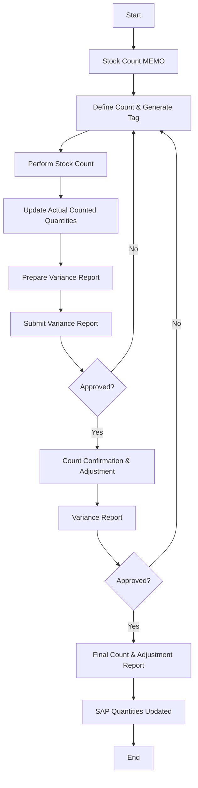

### Analysis of the Flowchart

1. **Process Name**: Physical Count Process

2. **Roles (Swimlanes)**:
   - SC Director / HQ Warehouse Manager
   - Branch WH Managers / WH Section Heads
   - Finance Dept Manager
   - Warehouse

3. **Steps Extracted into a Markdown Table:**

| Step # | Role                                | Action                              | Next Step/Logic       |
|--------|-------------------------------------|-------------------------------------|-----------------------|
| 1      | SC Director / HQ Warehouse Manager  | Start                               | Stock Count MEMO      |
| 2      | SC Director / HQ Warehouse Manager  | Stock Count MEMO                    | Define Count & Generate Tag |
| 3      | Branch WH Managers / WH Section Heads | Define Count & Generate Tag       | Perform Stock Count   |
| 4      | Branch WH Managers / WH Section Heads | Perform Stock Count               | Update Actual Counted Quantities |
| 5      | Branch WH Managers / WH Section Heads | Update Actual Counted Quantities  | Prepare Variance Report |
| 6      | Branch WH Managers / WH Section Heads | Prepare Variance Report           | Submit Variance Report |
| 7      | SC Director / HQ Warehouse Manager  | Submit Variance Report              | Approved?             |
| 8      | SC Director / HQ Warehouse Manager  | Approved (Yes)                      | Count Confirmation & Adjustment |
| 9      | Finance Dept Manager                | Variance Report                     | Approved?             |
| 10     | Finance Dept Manager                | Approved (Yes)                      | Final Count & Adjustment Report |
| 11     | Warehouse                           | Final Count & Adjustment Report     | SAP Quantities Updated |
| 12     | Warehouse                           | SAP Quantities Updated              | End                   |
| A      | Branch WH Managers / WH Section Heads | Rejected                           | Define Count & Generate Tag |

4. **Logic as a Mermaid.js Code Block:**

