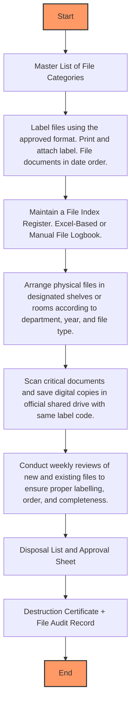

### Analysis of Flowchart

1. **Process Name**: Warehouse Archive File Management

2. **Roles (Swimlanes)**:
   - DC Officer / WH Head
   - Warehouse Section Head
   - Warehouse Manager
   - HQ Warehouse Manager

3. **Steps Table**:

| Step # | Role                     | Action                                                                                      | Next Step/Logic                             |
|--------|--------------------------|---------------------------------------------------------------------------------------------|---------------------------------------------|
| 1      | DC Officer / WH Head     | Start                                                                                       | 2                                           |
| 2      | DC Officer / WH Head     | Master List of File Categories                                                              | 3                                           |
| 3      | DC Officer / WH Head     | Label files using the approved format. Print and attach label. File documents in date order. | 4                                           |
| 4      | DC Officer / WH Head     | Maintain a File Index Register. Excel-Based or Manual File Logbook.                         | 5                                           |
| 5      | DC Officer / WH Head     | Arrange physical files in designated shelves or rooms according to department, year, and file type. | 6                                           |
| 6      | DC Officer / WH Head     | Scan critical documents and save digital copies in official shared drive with same label code. | 7                                           |
| 7      | Warehouse Section Head   | Conduct weekly reviews of new and existing files to ensure proper labelling, order, and completeness. | 8                                           |
| 8      | Warehouse Manager        | Disposal List and Approval Sheet                                                            | 9                                           |
| 9      | HQ Warehouse Manager     | Destruction Certificate + File Audit Record                                                 | End                                         |
| End    | HQ Warehouse Manager     | End                                                                                         |                                             |

4. **Mermaid.js Code Block**:

