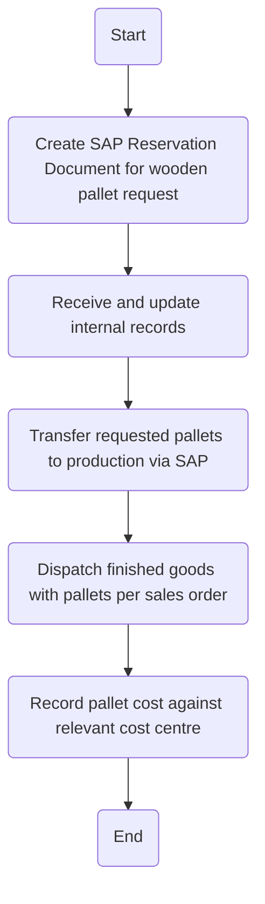

1. **Process Name**: Handling Wooden & Plastic Pallets (Issuance Wooden Pallet)

2. **Roles (Swimlanes)**:
   - Production Department
   - Packaging Warehouse
   - Logistics
   - Finance / System

3. **Markdown Table**:

| Step # | Role                  | Action                                                                | Next Step/Logic                         |
|--------|-----------------------|-----------------------------------------------------------------------|-----------------------------------------|
| 1      | Production Department | Start                                                                 | Step 2                                  |
| 2      | Production Department | Create SAP Reservation Document for wooden pallet request.            | Step 3                                  |
| 3      | Production Department | Receive and update internal records.                                  | Step 4                                  |
| 4      | Packaging Warehouse   | Transfer requested pallets to production via SAP.                     | Step 5                                  |
| 5      | Logistics             | Dispatch finished goods with pallets per sales order.                 | Step 6                                  |
| 6      | Finance / System      | Record pallet cost against relevant cost centre.                      | End                                     |

4. **Mermaid.js Code Block**:

