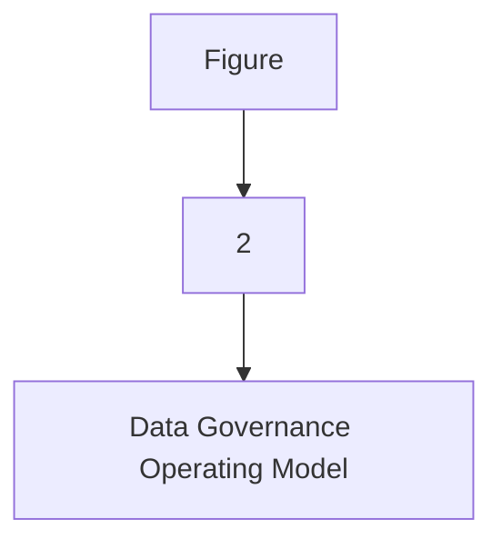
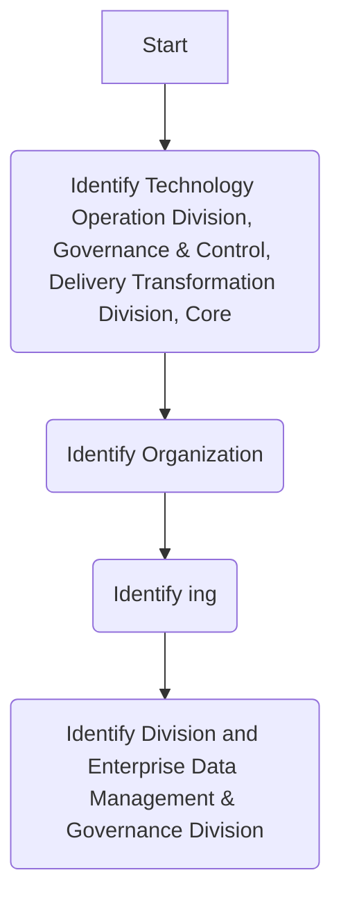

## Data Security and Protection

Data Security and Protection focuses on the processes, people, and technology designed to protect the entity’s data, including, but not limited to authorized access to data, avoidance of spoliation, and safeguarding against unauthorized disclosure of data. This domain is under the mandate of the Saudi National Cybersecurity Authority.

**[Diagram — PNG]:**

- **Board of Directors**
  - MD
    - COO
      - Head EDM
        - BO
          - MIS Council
            - BI and Analytics
        - DWH
          - ETL
          - DW & Architecture
            - Data Sharing and Interoperability
        - Data Governance
          - DG Council
            - Data Governance, Metadata and Data Catalogue, Data Quality, Reference and Master Data Management, Data Architecture & Modeling, Data Value Realization, Open Data, Freedom of Information
        - TOD
          - Data Operations
        - ETD
          - Document and Content Management
        - CISD
          - Data Classification, Data Security and Protection
        - Risk
          - Personal Data Protection


**[Flowchart — Word Shapes]:**

1. Figure
2. 2
3. – Data Governance Operating Model


**[Flowchart — Structured]:**

```markdown
### Step Table

| Step | Description                      | Decision? |
|------|----------------------------------|-----------|
| 1    | Figure                           | No        |
| 2    | 2                                | No        |
| 3    | Data Governance Operating Model  | No        |

### Mermaid Diagram


```


| organization |  |
| --- | --- |


**[Flowchart — Word Shapes]:**

1. IT* includes Technology Operation Division, Governance & Control, Delivery Transformation Division, Core
2. Organization
3. ing
4. Division and Enterprise Data Management & Governance Division


**[Flowchart — Structured]:**

```markdown
## Step Table

| Step | Description                                                                 |
|------|-----------------------------------------------------------------------------|
| 1    | Identify Technology Operation Division, Governance & Control, Delivery Transformation Division, Core |
| 2    | Identify Organization                                                      |
| 3    | Identify ing                                                               |
| 4    | Identify Division and Enterprise Data Management & Governance Division     |

## Mermaid Diagram


```