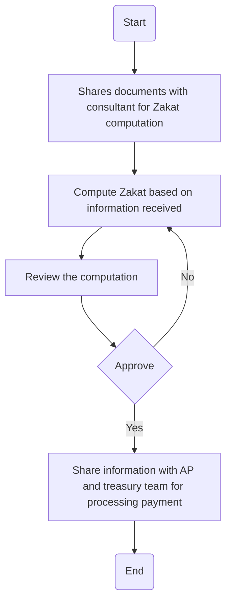

### Analysis

#### 1. Process Name:
- **Zakat**

#### 2. Roles (Swimlanes):
- Tax Manager
- CFO
- Consultant

#### 3. Steps in Markdown Table:

| Step # | Role         | Action                                                      | Next Step/Logic                        |
|--------|--------------|-------------------------------------------------------------|----------------------------------------|
| 1      | Tax Manager  | Start                                                       | 2                                      |
| 2      | Tax Manager  | Shares documents with consultant for Zakat computation      | 3                                      |
| 3      | Consultant   | Compute Zakat based on information received                 | 4                                      |
| 4      | CFO          | Review the computation                                      | 5                                      |
| 5      | CFO          | Approve                                                     | 6 (Yes) / 3 (No)                       |
| 6      | Tax Manager  | Share information with AP and treasury team for payment     | 7                                      |
| 7      | Tax Manager  | End                                                         |                                        |

#### 4. Mermaid.js Code Block:

