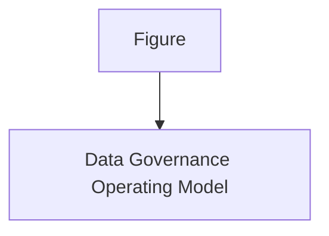
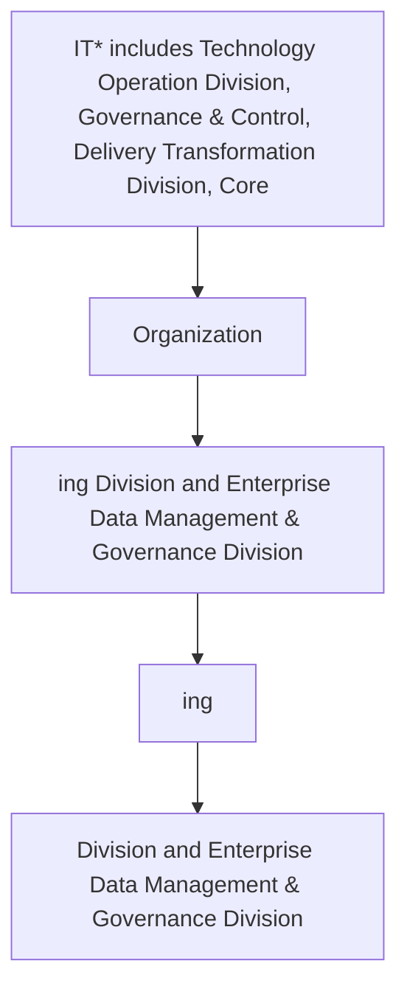

| Data Architecture and Modelling Management |
| --- |

| Version # : | 1 .0 |
| --- | --- |
| Issue / Effective D ate: |  |
| Date of Next Review |  |

| Document Categorization | **Strategic**<br>
- Transactional<br>
- Procedural<br>
- Not applicable |
| --- | --- |

| Prepared by: |  |  |  |
| --- | --- | --- | --- |
| Position / Title | Name | Date | Signature |
|  | Shiraz Aslam |  |  |

| Reviewed by : |  |  |  |
| --- | --- | --- | --- |
| Position / Title | Name | Date | Signature |

| Approved by: |  |  |  |
| --- | --- | --- | --- |
| Position / Title | Name | Date | Signature |
| Head of Data Management | Zeeshan Khan |  |  |
| Chief Operating Officer | Thamer Yousef |  |  |

| Rev. No. | Revision Date | Revised By | Approved By | Brief Description of Changes |
| --- | --- | --- | --- | --- |
|  | New Document |  |  |  |

| Term | Description |
| --- | --- |
| BI | Business Intelligence |
| BI&A | Business Intelligence and Analytics |
| BOD | Board of Directors |
| BRD | Business Requirement Document |
| [client] |  |
| BU | Business Unit |
| CCO | Chief Compliance Officer |
| CFO | Chief Financial Officer |
| CISD | Corporate Information Security Department |
| CMMI | Capability Maturity Model Integration |
| CO | Control Objectives for Information and Related Technologies |
| COO | Chief Operating Officer |
| CPG | Compliance Group |
| CRO | Chief Risk Officer |
| CTO | Chief Technology Officer |
| DB | Database |
| DBMS | Database Management System |
| DG | Data Governance |
| DMS | Document Management System |
| DVR | Data Value Realization |
| DWH | Data Warehouse |
| ECMS | Enterprise Content Management System |
| EDA | Enterprise Data Architecture |
| data management | Data Management |
| ERD | Entity Relationship Diagram |
| EUC | End-User Computations |
| FOI | Freedom of Information |
| GRM | Governance and Regulatory Management |
| HR G | Human Resources Group |
| ISG | Information Systems Group |
| IT | Information Technology |
| ITPC | IT Portfolio Committee |
| KPI | Key Performance Indicators |
| MDM | Master Data Management |
| NCA | National Cybersecurity Authority |
| NDMO | National Data Management Office |
| PDPL | Personal Data Protection Law |
| PMO | Project Management Office |
| PMS | Project Management System |
| PII | Personally Identifiable Information |
| PPU | Policy and Procedure Unit |
| PPC | Policy and Procedure Committee |
| RACI | Responsible, Accountable, Consulted, and Informed |
| RCA | Root Cause Assessment |
| ROI | Return on Investment |
| RPA | Reporting Process Assessment |
| RMG | Risk Management Group |
| SAMA | Saudi Arabian Monetary Authority |
| SLA | Service Level Agreements |
| SME | Subject Matter Expert |
| VAT | Value-Added Tax |

| Term | Explanation |
| --- | --- |
| Artifact | A tangible outcome of any process. May refer to documents like data dictionary , business glossary, systems architecture documents etc. |
| Business Glossary | A list of business terms with their definitions |
| Business Intelligence | A technology-driven process for analyzing data and presenting actionable information which helps executives, managers and other corporate end users make informed business decisions. |
| Business Intelligence and Analytics | Business Intelligence and Analytics focuses on analyzing organization's data records to extract insight and to draw conclusions about the information uncovered. |
| Data | A collection of facts in a raw or unorganized form such as numbers, characters, images, video, voice recordings, or symbols |
| Data-related Activity | Any activity that deals with data creation, data storage, data consumption, data sharing, data archival, data management or data destruction |
| Data Architecture | Data architecture is composed of models, policies, rules or standards that govern which data is collected, and how it is stored, arranged, integrated, and put to use in data systems and in organizations |
| Data Architecture and Modelling | Data Architecture and Modelling focuses on establishment of formal data structures and data flow channels to enable end to end data processing across and within entities. |
| Data Asset | Any critical data in an organization which is governed and managed as an asset |
| Data Catalog and Metadata | Data Catalog and Metadata focuses on enabling an effective access to high quality integrated metadata. The access to metadata is supported by use of the Data Catalog automated tool acting as the single point of reference to the organizations' metadata. |
| Data Classification | Data Classification involves the categorization of data so that it may be used and protected efficiently. Data Classification levels are assigned following an impact assessment determining the potential damages caused by the mishandling of data or unauthorized access to data. |
| Data Dictionary | A centralized repository of information about data such as meaning, relationships to other data, origin, usage, and format |
| Data Governance | Data governance is the definition of organizational structures, data owners, policies, rules, processes, business terms, and metrics for the end-to-end lifecycle of data (collection, storage, use, protection, archiving, and deletion). |
| Data Governance Controls | The preventive measures established to ensure adequate governance over data (e.g ., change controls, sign-offs, data quality checks etc.) |
| Data Governance program | A data governance program is an overarching set of initiatives required for establishing and maintaining effective data governance in the organization |
| Data I nitiative s | Initiatives which impact how data is created, stored, processed, consumed or destroyed in the organization . These includes system implementations, integrations, automations, data governance or management initiatives etc. |
| Data Lineage | Data lineage is documentation or description of the path along which data flows from the point of its origin to the point of its use showing all the transformations which it undergo es along this path. |
| Data Management | Data Management is a comprehensive collection of practices, concepts, procedures, processes, and accompanying systems that allow for an organization to gain control of its data resources. |
| Data Operations | The Data Operations domain focuses on the design, implementation, and support for data storage to maximize data value throughout its lifecycle from creation/acquisition to disposal. |
| Data Quality | Data Quality measures how fit the data is for its intended use with respect to its accuracy, completeness, integrity, timeliness, conformity and consistency. |
| Data Security and Protection | Data Security and Protection focuses on the processes, people, and technology designed to protect the entity’s data, including, but not limited to authorized access to data, avoidance of spoliation, and safeguarding against unauthorized disclosure of data. This domain is under the mandate of the Saudi National Cybersecurity Authority. |
| Data Sharing and Interoperability | Data Sharing and Interoperability involves the collection of data from different sources and consists of integration solutions fostering a harmonious internal and external communication between various IT components. Data Sharing and Interoperability also covers a Data Sharing process that enable an organized and standardized exchange of data between entities. |
| Data Value Realization | Data Value Realization involves the continuous evaluation of data assets for potential data driven use cases that generate revenue or reduce operating costs for the organization. |
| Data Warehouse | A system to store data from disparate sources, which can be used to create reports and data extracts that, may be used for further data analysis. |
| Document and Content Management | Document and Content Management involves controlling the capture, storage, access, and use of documents and content stored outside of relational databases. |
| Data Management | In the context of this policy, ‘ Data Management ’ (“ data management ”) refers to the Data Management department within [client] . |
| Freedom of Information | Freedom of Information domain focuses on providing Saudi citizens access to government information, portraying the process for accessing such information, and the appeal mechanism in the event of a dispute. |
| Master Data | Information that is shared universally across the organization , regardless of the process, function, conversation, or interaction |
| Metadata | Metadata is ‘structured information that describes, explains, locates, or otherwise makes it easier to retrieve, use, or manage an information resource’. Metadata provides valuable context and meaning to data which dramatically increases the usability of the data. |
| Open Data | Open Data focuses on the organization’s data which could be made available for public consumption to enhance transparency, accelerate innovation, and foster economic growth |
| Personal Data Protection | Personal Data Protection focuses on protection of a subject’s entitlement to the proper handling and non-disclosure of their personal information. |
| Reference Data | Reference data are sets of values or classification schemas that are referred by systems, applications, data stores, processes, and reports, as well as by transactional and master records. |
| Reference and Master Data Management | Reference and Master Data Management allow to link all critical data to a single master file, providing a common point of reference for all critical data. |

# Policy
## Purpose

The  Policy (' 'the policy') sets out the guidelines, framework, and key roles and responsibilities concerning the management of data in  ('' or 'the '). Through this policy, the :

- Establish robust data management and ensure effective oversight, monitoring, and management of data assets.

- Ensure comprehensive controls are in place to ensure data cataloguing, data sharing data quality, accuracy, availability, integrity, and completeness.

- Promote data management awareness amongst the 's employees; and

- Leverage existing data assets to derive business value.

This policy applies to all Business Units (BU), support functions, vendors/ third parties (undertaking any data-related activities for the , employees (insourced, outsourced & contractual), members of the Board and its committees, and management committees.
() owns this policy, and it is subject to be reviewed every two (2) years or when deemed necessary. This policy will be reviewed and approved as per the standard  protocols applicable for other enterprise level policies.
This  Policy set out the overall Data Management Framework of . In case the provision of any other policy conflict with or are inconsistent with this policy, the provision of this Policy will prevail. If there are questions regarding the interpretation of applicable sections of this policy, the matter should be raised immediately to  for clarifications.

The roles & responsibilities for the approval and implementation of this policy are listed below:
Governance

| Responsibility | Function |
| --- | --- |
| Approval and oversight | Board of Directors |
| Oversight, enforcement & recommendation to BOD | Data Governance and Management Leadership Team (COO, CRO & CFO ) |
| Document owner and implementations | data management |
| Periodic review of policy | data management |
Policy Governance Support

| Responsibility | Function |
| --- | --- |
| Policy custodian | Policies and Procedures Unit |
| Content issuance/ review | Head data management |
| Periodic audit review | Internal Audit |
This policy will be distributed to all  employees. All  employees are responsible for familiarizing themselves and ensuring compliance with the Policy requirements.
Update and maintenance of the document
1. The standards laid down by the Board through this document may be subject to changes, as deemed appropriate by the Board to ensure appropriate oversight and control over the ’s affairs. Such changes may be required due to one or more of the following reasons:
a) Changes in applicable laws, regulatory requirements / standards and specific instructions from governmental, legal and regulatory authorities
b) Changes in governance and organizational structures including institution of new committees or changes in the existing committees, changes in terms of references of groups / divisions and changes in the roles and responsibilities of relevant stakeholders
c) Inclusion of new data processes in the
d) New data management and application roles that are not envisioned or included in this document
e) Changes in data governance roles, responsibilities, or accountability matrix (as per the data governance handbook)
f) Any other change as deemed necessary by the Board
2. A formal 'Amendment Request Form' describing the proposed revision/ amendment shall be prepared by the person requesting changes (or 'requestor'). The amendment request inclusion and approval process will be as follows:
a) The requestor will complete the amendment request form, detailing the justification for changes to the policy document.
b) The amendment request form must be submitted to the Senior Manager, Data Governance and subsequently to the DG Management and Leadership Team for review and approval.
c) After approval is obtained from the DG Council, the amendment request form has to be submitted by PPU to the PPC members for their level of approval.
3. The Management of the  also have the right to propose amendments to the policy based on evolving circumstances and business needs. The Board, at its sole discretion shall have the authority to accept or reject such proposed changes and authorize amendment of the policy accordingly, if required.
a) will be responsible to carry out the required changes as directed by the Board and present the revised / updated policy to the Board for formal approval of the revised version.
b) Once the Board has approved an updated version of the policy,  will coordinate with PPU and PPU shall take the necessary steps to immediately inform the primary recipients of the changes / amendments, through an internal memorandum. Such revisions may also be communicated via email. The updated policy shall then be circulated, following the same circulation process as defined in the “Ownership, Custody and Circulation” section of this policy.
c) In the event of changes in the policy, the primary recipients shall be responsible to assess if the changes in this policy warrant a change in relevant policies and procedures, and if required, necessary updates to the policies and procedures will be made to ensure alignment with the revised Enterprise Data Governance Policy.

This policy adheres to the guidelines and the principles stipulated in:
- National Data Governance Interim Regulations
- National Data Management Office Handbook
- Data Management and Personal Data Protection Standards
The  also adhere to all other applicable laws and regulations around data governance and data management as and when will be issued by the SAMA, NDMO and other regulators, relevant to the 's operations.
Compliance to applicable laws and regulations shall be provided by the Compliance Group and Internal Audit Department of the
This policy is for the internal use of , and all employees must ensure its confidentiality at all times. No content of this policy shall be reproduced or transmitted in any form by any means without the written permission of a competent authority.

The Policy is effective from the date of its approval by the Board of Directors

**[Diagram — PNG]:**

KSA Data Management and Personal Data Protection Framework

1. **Data Governance**

**Data Assetization**
- 2: Data Catalog and Metadata
- 3: Data Quality
- 4: Data Operations
- 5: Document and Content Management
- 6: Data Architecture and Modeling
- 7: Reference and Master Data Management

**Data Usage**
- 8: Business Intelligence and Analytics
- 9: Data Sharing and Interoperability
- 10: Data Value Realization
- 11: Open Data

**Data Classification and Availability**
- 12: Freedom of Information
- 13: Data Classification

**Data Protection**
- 14: Personal Data Protection
- 15: Data Security and Protection (covered by NCA)
Figure 1 – KSA Data Management and Personal Data Protection Framework

**[Diagram — PNG]:**

- **Board of Directors**
  - **MD**
    - **COO**
      - **Head EDM**
        - **MIS Council**
        - **DG Council**
        - **NDMO Domains**
          - **BO**
            - BI and Analytics
          - **DWH**
            - **ETL**
            - **DW & Architecture**
            - Data Sharing and Interoperability
          - **Data Governance**
            - Data Governance, Metadata and Data Catalogue, Data Quality, Reference and Master Data Management, Data Architecture & Modelling, Data Value Realization, Open Data, Freedom of Information
          - **TOD**
            - Data Operations
          - **ETD**
            - Document and Content Management
          - **CISD**
            - Data Classification, Data Security and Protection
          - **Risk**
            - Personal Data Protection

**[Flowchart — Word Shapes]:**

1. Figure
2. 2
3. – Data Governance Operating Model

**[Flowchart — Structured]:**

```markdown
## Step Table

| Step No. | Description                        | Decision Point | Next Step (Yes) | Next Step (No) |
|----------|------------------------------------|----------------|-----------------|----------------|
| 1        | Figure                             | No             | 2               | N/A            |
| 2        | Data Governance Operating Model    | No             | End             | N/A            |

## Mermaid Diagram


```

Data Architecture is fundamental to data management. Most organizations have more data than individual people can comprehend, it is necessary to represent organizational data at different levels of abstraction so the data can be understood, and management can make decisions about it.
Data Architecture is most valuable when it fully supports the needs of the entire enterprise. Enterprise Data Architecture enables consistent data standardization and integration across the enterprise.
Data modeling is the process of discovering, analyzing, and scoping data requirements, and then representing and communicating these data requirements in a precise form called the data model. Data modeling is a critical component of data management. The modeling process requires that organizations discover and document how their data fits together. Data models depict and enable an organization to understand its data assets.

The below statements of policy are defined as the foundation of  view on data architecture and modelling and should guide all actions in creating, maintaining and using data architecture and modelling across the . These statements are:

- A Data Architecture and Modelling capability shall be established to develop and maintain  data architecture. The capability shall determine the needs of  from an architecture perspective and define an overall architecture methodology.

- As part of the capability, a Data Architecture and Modeling plan shall be established which includes roadmap that establishes the path from the Current Data Architecture to the Target Data Architecture and details how the target state shall be achieved along with budgeting factors.  shall include methods to move towards creation of Data Lake and consider operations for data processing.

- Data Architect shall define the current state data architecture and the desired target state data architecture. Target Data Architecture shall be developed in conjunction with the development of the 's overall Enterprise Architecture using widely used Enterprise Architecture Framework e.g., TOGAF, Zachmann as per prevailing standards.

- Data Architect along with support from Data Governance Officer shall conduct a gap analysis and document findings to define inputs and steps to achieve target state data architecture.

- Core architecture artefacts that shall be maintained to support the methodology include:
  o High level data architecture diagram representing an overview of data.
  o Data Flow Diagrams - Data Flow Diagrams shall show the flow of information (and associated metadata and identifying data) between systems.
  o Data Models – Enterprise, Conceptual, Logical and Physical models shall be maintained in accordance with the requirements outlined below:
a) Entity Relationship diagrams.
b) Security compliance designs - Security compliance designs shall overlay how security requirements are aligned with the architecture.
c) Quality compliance design - Quality compliance designs shall overlay how data quality requirements are aligned with the architecture.
d) Key Processes and Key System Components.
e) Data Flow diagrams and data lineage.

- Data architecture artefacts shall be reviewed and approved by the Data Governance Council.

- Data Architecture and Modeling artefacts shall be version controlled and the latest approved Data models shall be published for reference and re-use within the .

- Data Architecture and Modeling artefacts shall align with standard patterns (e.g., UML2) and NDMO architecture guidelines. Data Modeling needs to select and implement a technological toolset which shall cover Data Architecture Design, Data Modeling and Data Lineage.

- Data models shall contain sufficient metadata to allow Traceability, Reuse, Consistency and promote Data Quality. Data models shall also include details of the structure, relationships, and notations of data objects at a conceptual, logical, and physical level.

- shall consider technologies for the design, development, and implementation of Data Architecture and Modeling initiatives which shall have capabilities to support at minimum Data Architecture Design, Data Modeling and Data Lineage.

- shall follow the defined change management process to review, approve and implement changes to current and/or target state Data Architectures and Data Architecture checkpoints must be incorporated into its Software Development Lifecycle (SDLC) process.

- KPIs shall be established to measure the state of  Data Architecture and Modeling capabilities. The monitoring of these KPIs shall help in providing inputs to uplift the current state architecture to target state architecture.

- Data Architecture and Modeling artifacts such as data and technical architecture project, reference documentation materials and data model designs shall be stored and maintained as supporting documents.

- Data Architecture and Modeling Training and Awareness shall be provided to Data Owners and Data Stewards.

- All stakeholders dealing or handling Data Architecture and Modeling activities, and parties involved in  business, shall comply with the requirements of this policy.

should adhere to the following Data Architecture and Modelling principles.
Single Version of Truth: Enable integrity, quality and security of data by maintaining single version of truth for all data elements and make it systematically accessible across .
Data is Trusted:  data users need to have a high confidence in the quality of data that is produced, integrated, curated and provisioned.
Data a shared asset: For the smooth flow, data should be viewed as a shared asset. Instead of allowing inter-departmental silos to exist, the stakeholders get a complete view of the organization.
Data is Secured: Considering data confidentiality the core part of the data architecture and design. Data must be secured end-to-end throughout its lifecycle
Data is Available, Accessible: Data transformation processes must be designed keeping fault tolerance into consideration, to meet the agreed SLAs w.r.t information’s time-to-market
Data Storage is Scalable and Optimized: Independent scalability of storage & compute should be enabled to achieve costs optimization.
Empower Self Service: Empower business data users with greater autonomy to work with data, leveraging self-service tools.
Curating the data: Data curation includes cleaning of raw data, modeling proper relationships between various data sets, and curating key dimensions and measures to ensure the data models are monitored regularly and are up to date.
Formalization: Formal definition imposes a disciplined structure to data that reduces the possibility of data anomalies occurring when accessing and persisting data. By illustrating the structures and relationships in the data, a data model makes data easier to consume.
Knowledge retention/documentation: A data model can preserve corporate memory regarding a system or project by capturing knowledge in an explicit form. It serves as documentation for future projects to use as the as-is version.

The following roles and responsibilities are applicable to this policy:

- Enterprise Architecture Board (EAB): EAB is responsible for conduct training and awareness sessions and is accountable for the establishment of enterprise data architecture, evaluation of existing data architecture and modelling specifications and development of roadmap. Monitoring of Data Architecture and Modelling KPIs

- Data Management and Governance Leadership Team: The executive body of  data management & governance is responsible for signing off on any changes, exemption, and exceptions to this policy.

- Data Governance Council: The strategic body of  data management & governance is responsible for implementing this policy in the and ensuring the required process for Data Architecture and Modelling are implemented.

- Data Governance officer: An experienced business domain representative responsible for managing all data management & governance initiatives and changes. The data governance officer ensures compliance of this policy.

- Head of : The Head of  is responsible to oversee implementation of the Data Management Program and compliance with Data Architecture and Modeling Policy standards. Ensure coordination and execution of training and awareness programs across.
Sr. Mgr. data Management & Architecture Department: Sr. Mgr. is accountable to review and update data architecture and modelling policy, creating procedures to ensure data accuracy, accessibility, security and visibility of data flow and is responsible for conduct training and awareness sessions, establishment of enterprise data architecture, evaluation of existing data architecture and modelling specifications and development of roadmap. Monitoring of Data Architecture and Modelling KPIs

- Data Architecture and Modelling Team: The Data Architecture and Modelling team is accountable and responsible for reviewing and update this policy annually or whenever there are organizational, legal, or regulatory changes and requirements. Create and review data architecture and modelling artifacts. Conduct training and awareness sessions. Establishing enterprise data architecture. Creating procedures to ensure data accuracy, accessibility, security, and visibility of data flow. Evaluate existing data architecture and modelling specifications and develop roadmap.

- Stewardship Team: The stewardship team is accountable and responsible for authoring business data definitions and data standards. Further, awareness of relevant data flows between systems and setting the conditions for integration of data from different sources is also the responsibility of Stewardship team.

- Compliance Officer: Compliance officer is accountable for ensuring compliance with Data Architecture and Modelling policy

- Data Specialist: Data Specialist is responsible for creating procedures to ensure data accuracy, accessibility, security and visibility of data flow, evaluate existing data architecture and modelling specifications and develop roadmap.

| Main Activities | The Board | DG Leadership Team | EAB | Head of data management | Sr. Mgr. data Management & Architecture Department | DG Council | Compliance Officer | Data Governance Officer | Data Architecture and Modelling Team | Stewardship Team | Data Specialist |  |  |  |
| --- | --- | --- | --- | --- | --- | --- | --- | --- | --- | --- | --- | --- | --- | --- |
| Main Activities | The Board | DG Leadership Team | EAB | Head of data management | Sr. Mgr. data Management & Architecture Department | DG Council | Compliance Officer | Data Governance Officer | Data Architecture and Modelling Team | Data Domain Steward | Business Domain Steward | Data Steward | Business Steward | Data Specialist |
| Create a Data Architecture and Modelling Plan |  | C | R |  | I | A |  |  |  |  |  |  |  |  |
| Signing off on any changes, exemption, and exceptions to Data Architecture and Modelling policy |  | I | A | C |  | C |  | R | I |  |  |  |  |  |
| Implementation of Data Architecture and Modelling policy and processes |  | A | R |  | R | C | I |  |  |  |  |  |  |  |
| Ensuring compliance with Data Architecture and Modelling policy |  | I |  | I | A | I | R | C | I |  |  |  |  |  |
| Review and update Data Architecture and Modelling policy |  | I | A | I |  | C | R | C | I |  |  |  |  |  |
| Create and review data architecture and modelling artifacts |  | I |  | I |  | I | A, R |  |  |  |  |  |  |  |
| Conduct training and awareness sessions |  | R | C | R | I |  | C | A | C | I |  |  |  |  |
| Establishing and building enterprise data architecture |  | A | C | R | C |  | I | R | C | I | C |  |  |  |
| Creating procedures to ensure data accuracy, accessibility, security and visibility of data flow |  | C | A | I |  | I | R | C | I | C | R |  |  |  |
| Evaluate existing data architecture and modelling specifications and develop roadmap. |  | A | C | R | I |  | I | R | C | I | C | R |  |  |
| Authoring business data definitions and data standards |  | C |  | I |  | I | R | A | I | C |  |  |  |  |
| Awareness of relevant data flows between systems and setting the conditions for integration of data from different sources |  | C |  | I |  | I | R | A | I | C |  |  |  |  |
| Monitoring of Data Architecture and Modelling KPIs |  | A | I | R | I |  | C | R |  |  |  |  |  |  |

It is important to measure and analyze the effectiveness of data architecture and modelling KPIs. Following KPIs to be adopted and monitored by Data Architecture and Modelling team.

| Category | Metric | Description |
| --- | --- | --- |
| Data Architecture artifact | Number of data architecture artefact created | The total number of artifacts for each data architecture created within one year. |
| Target state architecture | Number of gaps between the data architecture baseline and target state | Total number of gaps identified between the data architecture baseline and target state data architecture. This metric will be monitored annually. |
| Target state architecture | Number of gaps resolved between the data architecture baseline and target state | Total number of gaps resolved between the data architecture baseline and target state data architecture. This metric will be monitored annually. |
| Data Model | Number of Data Models created vs databases | Total number of data models VS total number of databases during the year. |
| Data Model | Number of Data Models updated | Total number of data models updated during the year. |
| Data Model | Number of unstructured datasets modelled | Data modelling done on total number of unstructured datasets during the year. |
| Dataset | Number of datasets included within data flow documentation | Datasets included in data flow documentation during the year |
| Dataset | Number of datasets included within the Entity Relationship Diagram | The number of datasets become part of the Entity Relationship Diagram (ERD) during the year. |

**[Flowchart — Word Shapes]:**

1. IT* includes Technology Operation Division, Governance & Control, Delivery Transformation Division, Core
2. Organization
3. ing Division and Enterprise Data Management & Governance Division
4. ing
5. Division and Enterprise Data Management & Governance Division

**[Flowchart — Structured]:**

```markdown
# Step Table

| Step | Description                                                                             | Decision |
|------|-----------------------------------------------------------------------------------------|----------|
| 1    | IT* includes Technology Operation Division, Governance & Control, Delivery Transformation Division, Core |          |
| 2    | Organization                                                                             |          |
| 3    | ing Division and Enterprise Data Management & Governance Division                        |          |
| 4    | ing                                                                                      |          |
| 5    | Division and Enterprise Data Management & Governance Division                            |          |

# Mermaid Diagram

