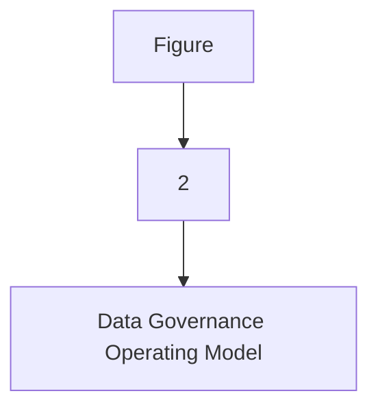
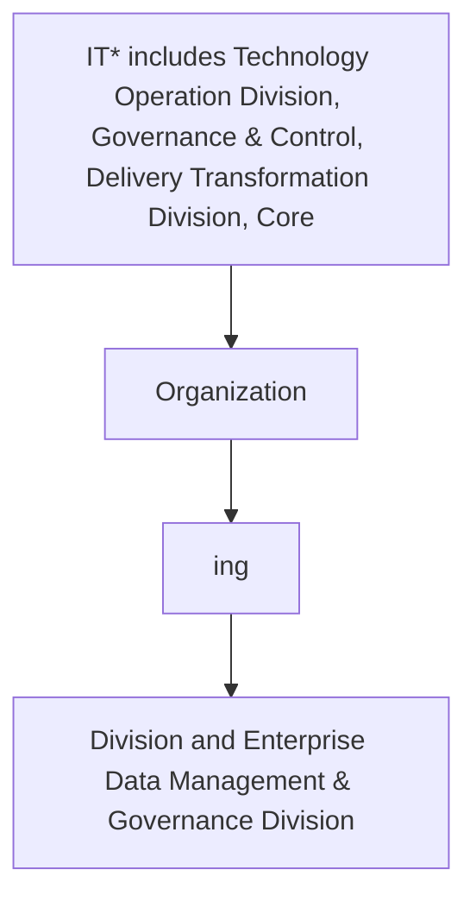

| Data Sharing and Interoperability |
| --- |

| Version # : | 1 .0 |
| --- | --- |
| Issue / Effective D ate: |  |
| Date of Next Review |  |

| Document Categorization | **Strategic**<br>
- Transactional<br>
- Procedural<br>
- Not applicable |
| --- | --- |

| Prepared by: |  |  |  |
| --- | --- | --- | --- |
| Position / Title | Name | Date | Signature |
|  | Shiraz Aslam |  |  |

| Reviewed by : |  |  |  |
| --- | --- | --- | --- |
| Position / Title | Name | Date | Signature |

| Approved by: |  |  |  |
| --- | --- | --- | --- |
| Position / Title | Name | Date | Signature |
| Head of Data Management | Zeeshan Khan |  |  |
| Chief Operating Officer | Thamer Yousef |  |  |

| Rev. No. | Revision Date | Revised By | Approved By | Brief Description of Changes |
| --- | --- | --- | --- | --- |
|  | New Document |  |  |  |

| Term | Description |
| --- | --- |
| BI | Business Intelligence |
| BI&A | Business Intelligence and Analytics |
| BOD | Board of Directors |
| BRD | Business Requirement Document |
| [client] |  |
| BU | Business Unit |
| CCO | Chief Compliance Officer |
| CFO | Chief Financial Officer |
| CISD | Corporate Information Security Department |
| CMMI | Capability Maturity Model Integration |
| CO | Control Objectives for Information and Related Technologies |
| COO | Chief Operating Officer |
| CPG | Compliance Group |
| CRO | Chief Risk Officer |
| CTO | Chief Technology Officer |
| DB | Database |
| DBMS | Database Management System |
| DG | Data Governance |
| DMS | Document Management System |
| DVR | Data Value Realization |
| DWH | Data Warehouse |
| ECMS | Enterprise Content Management System |
| EDA | Enterprise Data Architecture |
| data management | Data Management |
| ERD | Entity Relationship Diagram |
| EUC | End-User Computations |
| FOI | Freedom of Information |
| GRM | Governance and Regulatory Management |
| HR G | Human Resources Group |
| ISG | Information Systems Group |
| IT | Information Technology |
| ITPC | IT Portfolio Committee |
| KPI | Key Performance Indicators |
| MDM | Master Data Management |
| NCA | National Cybersecurity Authority |
| NDMO | National Data Management Office |
| PDPL | Personal Data Protection Law |
| PMO | Project Management Office |
| PMS | Project Management System |
| PII | Personally Identifiable Information |
| PPU | Policy and Procedure Unit |
| PPC | Policy and Procedure Committee |
| RACI | Responsible, Accountable, Consulted, and Informed |
| RCA | Root Cause Assessment |
| ROI | Return on Investment |
| RPA | Reporting Process Assessment |
| RMG | Risk Management Group |
| SAMA | Saudi Arabian Monetary Authority |
| SLA | Service Level Agreements |
| SME | Subject Matter Expert |
| VAT | Value-Added Tax |

| Term | Explanation |
| --- | --- |
| Artifact | A tangible outcome of any process. May refer to documents like data dictionary , business glossary, systems architecture documents etc. |
| Business Glossary | A list of business terms with their definitions |
| Business Intelligence | A technology-driven process for analyzing data and presenting actionable information which helps executives, managers and other corporate end users make informed business decisions. |
| Business Intelligence and Analytics | Business Intelligence and Analytics focuses on analyzing organization's data records to extract insight and to draw conclusions about the information uncovered. |
| Data | A collection of facts in a raw or unorganized form such as numbers, characters, images, video, voice recordings, or symbols |
| Data-related Activity | Any activity that deals with data creation, data storage, data consumption, data sharing, data archival, data management or data destruction |
| Data Architecture | Data architecture is composed of models, policies, rules or standards that govern which data is collected, and how it is stored, arranged, integrated, and put to use in data systems and in organizations |
| Data Architecture and Modelling | Data Architecture and Modelling focuses on establishment of formal data structures and data flow channels to enable end to end data processing across and within entities. |
| Data Asset | Any critical data in an organization which is governed and managed as an asset |
| Data Catalog and Metadata | Data Catalog and Metadata focuses on enabling an effective access to high quality integrated metadata. The access to metadata is supported by use of the Data Catalog automated tool acting as the single point of reference to the organizations' metadata. |
| Data Classification | Data Classification involves the categorization of data so that it may be used and protected efficiently. Data Classification levels are assigned following an impact assessment determining the potential damages caused by the mishandling of data or unauthorized access to data. |
| Data Dictionary | A centralized repository of information about data such as meaning, relationships to other data, origin, usage, and format |
| Data Governance | Data governance is the definition of organizational structures, data owners, policies, rules, processes, business terms, and metrics for the end-to-end lifecycle of data (collection, storage, use, protection, archiving, and deletion). |
| Data Governance Controls | The preventive measures established to ensure adequate governance over data (e.g ., change controls, sign-offs , data quality checks etc.) |
| Data Governance program | A data governance program is an overarching set of initiatives required for establishing and maintaining effective data governance in the organization |
| Data I nitiative s | Initiatives which impact how data is created, stored, processed, consumed or destroyed in the organization . These includes system implementations, integrations, automations, data governance or management initiatives etc. |
| Data Lineage | Data lineage is documentation or description of the path along which data flows from the point of its origin to the point of its use showing all the transformations which it undergo es along this path. |
| Data Management | Data Management is a comprehensive collection of practices, concepts, procedures, processes, and accompanying systems that allow for an organization to gain control of its data resources. |
| Data Operations | The Data Operations domain focuses on the design, implementation, and support for data storage to maximize data value throughout its lifecycle from creation/acquisition to disposal. |
| Data Quality | Data Quality measures how fit the data is for its intended use with respect to its accuracy, completeness, integrity, timeliness, conformity and consistency. |
| Data Security and Protection | Data Security and Protection focuses on the processes, people, and technology designed to protect the entity’s data, including, but not limited to authorized access to data, avoidance of spoliation, and safeguarding against unauthorized disclosure of data. This domain is under the mandate of the Saudi National Cybersecurity Authority. |
| Data Sharing and Interoperability | Data Sharing and Interoperability involves the collection of data from different sources and consists of integration solutions fostering a harmonious internal and external communication between various IT components. Data Sharing and Interoperability also covers a Data Sharing process that enable an organized and standardized exchange of data between entities. |
| Data Value Realization | Data Value Realization involves the continuous evaluation of data assets for potential data driven use cases that generate revenue or reduce operating costs for the organization. |
| Data Warehouse | A system to store data from disparate sources, which can be used to create reports and data extracts that, may be used for further data analysis. |
| Document and Content Management | Document and Content Management involves controlling the capture, storage, access, and use of documents and content stored outside of relational databases. |
| Data Management | In the context of this policy, ‘ Data Management ’ (“ data management ”) refers to the Data Management department within [client] . |
| Freedom of Information | Freedom of Information domain focuses on providing Saudi citizens access to government information, portraying the process for accessing such information, and the appeal mechanism in the event of a dispute. |
| Master Data | Information that is shared universally across the organization , regardless of the process, function, conversation, or interaction |
| Metadata | Metadata is ‘structured information that describes, explains, locates, or otherwise makes it easier to retrieve, use, or manage an information resource’. Metadata provides valuable context and meaning to data which dramatically increases the usability of the data. |
| Open Data | Open Data focuses on the organization’s data which could be made available for public consumption to enhance transparency, accelerate innovation, and foster economic growth |
| Personal Data Protection | Personal Data Protection focuses on protection of a subject’s entitlement to the proper handling and non-disclosure of their personal information. |
| Reference Data | Reference data are sets of values or classification schemas that are referred by systems, applications, data stores, processes, and reports, as well as by transactional and master records. |
| Reference and Master Data Management | Reference and Master Data Management allow to link all critical data to a single master file, providing a common point of reference for all critical data. |

# Policy
## Purpose

The  Policy (' 'the policy') sets out the guidelines, framework, and key roles and responsibilities concerning the management of data in  ('' or 'the '). Through this policy, the  will:

- Establish robust data management and ensure effective oversight, monitoring, and management of data assets.

- Ensure comprehensive controls are in place to ensure data cataloguing, data sharing data quality, accuracy, availability, integrity, and completeness.

- Promote data management awareness amongst the 's employees; and

- Leverage existing data assets to derive business value.

This policy applies to all Business Units (BU), support functions, vendors/ third parties (undertaking any data-related activities for the ), employees (insourced, outsourced & contractual), members of the Board and its committees, and management committees.
() owns this policy, and it is subject to be reviewed every two (2) years or when deemed necessary. This policy will be reviewed and approved as per the standard  protocols applicable for other enterprise level policies.
This  Policy set out the overall Data Management Framework of . In case the provision of any other policy conflict with or are inconsistent with this policy, the provision of this Policy will prevail. If there are questions regarding the interpretation of applicable sections of this policy, the matter should be raised immediately to  for clarifications.

The roles & responsibilities for the approval and implementation of this policy are listed below:
Governance

| Responsibility | Function |
| --- | --- |
| Approval and oversight |  |
| Oversight, enforcement & recommendation to BOD |  |
| Document owner and implementations |  |
| Periodic review of policy |  |
Policy Governance Support

| Responsibility | Function |
| --- | --- |
| Policy custodian |  |
| Content issuance/ review |  |
| Periodic audit review |  |
This policy will be distributed to all  employees. All  employees are responsible for familiarizing themselves and ensuring compliance with the Policy requirements.
Update and maintenance of the document
1. The standards laid down by the Board through this document may be subject to changes, as deemed appropriate by the Board to ensure appropriate oversight and control over the ’s affairs. Such changes may be required due to one or more of the following reasons:
a) Changes in applicable laws, regulatory requirements / standards and specific instructions from governmental, legal and regulatory authorities
b) Changes in governance and organizational structures including institution of new committees or changes in the existing committees, changes in terms of references of groups / divisions and changes in the roles and responsibilities of relevant stakeholders
c) Inclusion of new data processes in the
d) New data management and application roles that are not envisioned or included in this document
e) Changes in data governance roles, responsibilities, or accountability matrix (as per the data governance handbook)
f) Any other change as deemed necessary by the Board
2. A formal 'Amendment Request Form' describing the proposed revision/ amendment shall be prepared by the person requesting changes (or 'requestor'). The amendment request inclusion and approval process will be as follows:
a) The requestor will complete the amendment request form, detailing the justification for changes to the policy document.
b) The amendment request form must be submitted to the Senior Manager, Data Governance and subsequently to the DG Management and Leadership Team for review and approval.
c) After approval is obtained from the DG Council, the amendment request form has to be submitted by PPU to the PPC members for their level of approval.
3. The Management of the  shall also have the right to propose amendments to the policy based on evolving circumstances and business needs. The Board, at its sole discretion shall have the authority to accept or reject such proposed changes and authorize amendment of the policy accordingly, if required.
a) will be responsible to carry out the required changes as directed by the Board and present the revised / updated policy to the Board for formal approval of the revised version.
b) Once the Board has approved an updated version of the policy,  will coordinate with PPU and PPU shall take the necessary steps to immediately inform the primary recipients of the changes / amendments, through an internal memorandum. Such revisions may also be communicated via email. The updated policy shall then be circulated, following the same circulation process as defined in the “Ownership, Custody and Circulation” section of this policy.
c) In the event of changes in the policy, the primary recipients shall be responsible to assess if the changes in this policy warrant a change in relevant policies and procedures, and if required, necessary updates to the policies and procedures will be made to ensure alignment with the revised Enterprise Data Governance Policy.

This policy adheres to the guidelines and the principles stipulated in:
- National Data Governance Interim Regulations
- National Data Management Office Handbook
- Data Management and Personal Data Protection Standards
The  will also adhere to all other applicable laws and regulations around data governance and data management as and when will be issued by the SAMA, NDMO and other regulators, relevant to the 's operations.
Compliance to applicable laws and regulations shall be provided by the Compliance Group and Internal Audit Department of the .
This policy is for the internal use of , and all employees must ensure its confidentiality at all times. No content of this policy shall be reproduced or transmitted in any form by any means without the written permission of a competent authority.

The Policy is effective from the date of its approval by the Board of Directors

**[Diagram — PNG]:**

KSA Data Management and Personal Data Protection Framework

- 1- Data Governance

Data Assetization
- 2- Data Catalog and Metadata
- 3- Data Quality
- 4- Data Operations
- 5- Document and Content Mgmt.
- 6- Data Architecture and Modeling
- 7- Reference and Master Data Mgmt.

Data Usage
- 8- Business Intelligence and Analytics
- 9- Data Sharing and Interoperability
- 10- Data Value Realization
- 11- Open Data

Data Classification and Availability
- 12- Freedom of Information
- 13- Data Classification

Data Protection
- 14- Personal Data Protection
- 15- Data Security and Protection (covered by NCA)

**[Diagram — PNG]:**

- **Board of Directors**
  - MD
    - COO
      - Head EDM
        - MIS Council
          - BO
            - BI and Analytics
        - DWH
          - ETL
          - DW & Architecture
            - Data Sharing and Interoperability
        - Data Governance
          - DG Council
          - Data Governance, Metadata and Data Catalogue, Data Quality, Reference and Master Data Management, Data Architecture & Modelling, Data Value Realization, Open Data, Freedom of Information
        - TOD
          - Data Operations
        - ETD
          - Document and Content Management
        - CISD
          - Data Classification, Data Security and Protection
        - Risk
          - Personal Data Protection

**[Flowchart — Word Shapes]:**

1. Figure
2. 2
3. – Data Governance Operating Model

**[Flowchart — Structured]:**

```markdown
### Step Table

| Step | Description                                      | Decision (Yes/No)   |
|------|--------------------------------------------------|---------------------|
| 1    | Figure                                           | No                  |
| 2    | 2                                                | No                  |
| 3    | Data Governance Operating Model                  | No                  |

### Mermaid Diagram


```

As a financial institution of the Kingdom of Saudi Arabia,  is committed to ensuring the confidentiality, integrity and availability of its data, systems, and tools.
The data sharing policy has been developed in compliance with the prevailing National Data Management Office (NDMO) mandates of the Kingdom of Saudi Arabia. The policy aims to safeguard the confidentiality, integrity, and availability of all the data assets within the . This document applies to  as a whole and relevant third parties. When referring to relevant third parties, this policy applies to any individual, not directly employed by  or any potential entity under the direct ownership of , that has been granted any form of logical or physical access to ’s data assets.

The below statements have been defined as the foundation of ’s view on data sharing and interoperability and guide all actions in granting, sharing, using, controlling, and decommissioning data sharing across the  data assets. These statements are:
1. The data sharing and interoperability policy should be read in conjunction with Data Classification policy.
2. must share data only when the classification criteria as per the Data Classification Policy and data sharing principles stated in this policy are satisfied, and all controls assigned to the sharing request approval are fulfilled.
3. In line with the prevailing NDMO Data Privacy Interim Regulations, personally identifiable information (PII) should be removed before sharing unless PII is necessary for the intended use of the shared data. Also, Personal (PII) data attributes and attributes classified as “Strictly Confidential”, and “Confidential” must be masked and anonymized during data processing and analysis unless for the purpose of an audit or investigation (Refer  Data Classification Policy).
4. For any transfer of data across information systems (internal or external) of the ,  must develop and adhere to a data sharing template along with a data sharing agreement.
5. The requestor of the data is responsible for protecting the shared data and ensure utilization for the defined purpose and the  team is entitled to conduct periodic compliance audits as provisioned in the data sharing agreement(s).
6. With support from the Data Governance Officer, the data owner is responsible to ensure compliance with the data sharing policy for all sharing of data under their ownership, in accordance with the Data Sharing process.
7. Data Owners are accountable and responsible for approving data sharing request(s). For BAU activities where data sharing is also part of the process, a blanket approval should be obtained for an extended time to prevent disruption in the BAU process. For any ad-hoc data sharing request(s), approval from data owner(s) should be obtained before sharing the data.
8. Data access does not entitle the user to share the data with any stakeholder/party/department/employee.
9. Access to data shall be allocated based on role-based access control principles set out for the . Access and privileges shall be configured in all systems in accordance with the  Access Management Policy and Procedure.
10. The direct access to share data is not encouraged, only approved modes of data sharing/integration channels to be utilized upon required approvals.
11. All  employees are responsible to understand and align with all relevant data sharing policies, processes, and standards at .
12. Any exception to the rules outlined in this policy shall require a formal business case to be made and approval from the data governance council after consulting the Data Governance Officer (Sr. Manager Data Governance) and CISD, granted in a strict time-bound manner.
13. shall conduct training on data sharing to make sure staff members who are participating in data sharing efforts are aware of their obligations and the repercussions of unauthorized disclosure or improper management of data.
14. will create an Integration Requirements Document, a Solution Design Document, and test the generated Integration Solution before deploying in the Production Environment for any data integration and interoperability initiative.
15. shall create and execute KPIs to track the success and effectiveness of Data Integration and interoperability solutions as well as the efficiency of Data Sharing activities.
16. must design, record, and adhere to both ELT operations to store unstructured data in its unaltered natural format in the Data Lake and ETL processes to integrate data from various sources and load it into data warehouse.

Sharing of  data assets within and outside , regardless of its source, form or nature, would be governed by the following data sharing principles.
1. Data Sharing Culture
to act as a Single Source of Truth (SSOT) for all the data it produces, any data sharing requests for accessing  data assets should be processed following the prevailing  Data Sharing policy, NDMO and SAMA guidelines.
2. Clear Purpose for Data Sharing
External Data Requestor should clearly state the reason or legal basis behind the data sharing request - except for data and entities exempted by a Royal Decree. Data should only be shared
when it delivers a public benefit without inflicting harm against national interests, organizations, individuals, or the environment.
3. Authorized Access
All parties involved in Data Sharing should have the appropriate authority, knowledge, and skills along with properly trained staff to manage and handle data sharing requests.
4. Transparency
All parties involved in the data sharing process should share all information necessary for the successful fulfilment of the data sharing request, including required data, purpose behind data sharing request, data transfer and storage mechanism, data security controls, and data disposal mechanism.
5. Collective Accountability
All parties involved in the data sharing process should be held responsible for Data Sharing decisions, for processing as per the clearly defined reasons, and for taking the necessary actions to ensure data quality and implementation of security controls as defined in the Data Sharing Agreement and as prescribed by relevant national laws and regulations.
6. Data Security
All parties involved in Data Sharing shall have an adequate set of security controls to protect and safeguard data and enable a secure environment for data sharing in line with relevant national laws and regulations, and National Cybersecurity Authority requirements.
7. Ethical Data Use
All parties involved in Data Sharing should follow  code of conduct,  Acceptable Use Policy,  Data Classification Policy, Cybersecurity Operations and Technology Policy and other relevant existing policies throughout the data sharing process to ensure fairness, integrity, trust, and respect, and go beyond meeting data protection and security standards or other regulatory requirements.

The following roles and responsibilities apply to this policy:

- Data Management and Governance Leadership Team: The executive body of  data management & governance program, is responsible for signing off on any changes and exceptions to this policy.

- Data governance council: The strategic body of ’s data governance program, is responsible for approving the creation of data sharing request across the  systems and data warehouse(s).

- Data Privacy Officer: An experienced business domain representative responsible for managing data request approvals and overviewing the data sharing processes following the timeline stipulated by the prevailing NDMO regulations. It is the responsibility of the Data Privacy Officer to direct on conducting the required data analysis and preparing the data to be shared if the requested data is not readily available within the  data warehouse and systems.

- Data Owner: Data Owner responsible for ensuring that the sensitivity classification of the data in question is considered before sharing with the requester. Data Owners are responsible for authorizing sharing of data and ensuring that only those with eligibility requirements / justifiable reason(s), clearance and approval as per the  process, have access and/or rights to share data. Data owner must ensure that relevant authentication information controls are embedded and enabled in all relevant systems (systems containing data) and are being adhered to by all data users, the systems are operating in a safe and appropriate environment and the specificities of their systems and the relevant security practices are documented.

- Data User(s) Manager: The data user(s) manager is any personnel with management responsibilities over one or more  data users. The data user(s) manager is responsible for submitting data sharing requests on behalf of their internal team and third parties under their management.

- Data Processor: Any individual interacting with the data without having direct control over it. Data users are responsible for complying with the controls and standards outlined in this policy and are accountable for safeguarding all data in their possession, their access credentials to data and the data systems they have been granted access to. Furthermore, when being granted permission to share data, data users are responsible for complying with any terms of sharing mandated by the data owner.

- CISD: CISD team ensures that the necessary classification of data exists to facilitate data sharing in a timely manner. Further, the CISD team is accountable and responsible for devising and implementing necessary controls on the data sharing mediums of the  (email, common/share drives, time bound access in case of external data sharing etc).

- Compliance Officer: An experienced domain representative accountable and responsible for monitoring compliance.

- Implementation Team: Implementation Team is responsible for Create documentation for any data or system integration and interoperability initiative

| Main Activities | The Board | DG Leadership Team | Head data management | GRM Team | Imple mentation Team | DG Council | Data Privacy Officer | Data Governance Officer | Compliance Officer | CISD | Data Owner | Data Processor | Data User(s) Manager |
| --- | --- | --- | --- | --- | --- | --- | --- | --- | --- | --- | --- | --- | --- |
| Verification of data Classification level assigned to requested data before data sharing |  | C |  | C | A, R |  |  |  |  |  |  |  |  |
| Validation of conformance of the sharing request with data sharing principles |  | I |  | I | C |  | C | A, R |  |  |  |  |  |
| Design and finalize the controls for data sharing |  | I | R |  | I | C | R |  | C | A | C |  |  |
| Implement Data Sharing Controls |  | C |  | A, R |  | C |  |  |  |  |  |  |  |
| Submitting data sharing requests on behalf of their internal team and third parties under their management |  | C | A, R |  |  |  |  |  |  |  |  |  |  |
| Data Sharing request approval |  | C |  | C | I |  | A, R | I |  |  |  |  |  |
| Data Sharing limited to purpose only |  | C |  | R | A, R |  |  |  |  |  |  |  |  |
| Conduct required data analysis and prepare the data to be shared, where applicable |  | I |  | C | I |  | I |  | C | A, R | C |  |  |
| Monitor compliance |  | I |  | I | C | I | A, R |  | I |  |  |  |  |
| Make and approve any exceptions or changes in Data Sharing policy |  | A | C | R |  | C | R | I |  | C |  |  |  |
| Training on data sharing policy, principles to understand the obligations |  | A | R |  | I | R | C | I | C |  |  |  |  |
| Data sharing template and agreement development |  | I | R |  | I | R |  | C | A | I |  |  |  |
| Create documentation for any data integration and interoperability initiative |  | A, R |  | C |  |  |  |  |  |  |  |  |  |
| Create documentation for any system integration and interoperability initiative |  | A, R |  | C |  |  |  |  |  |  |  |  |  |
| Designing, measuring, and monitoring Data sharing and interoperability KPIs |  | A | R |  | C | I |  | I | C |  |  |  |  |

It is important to measure and analyze the effectiveness of data sharing and interoperability activities. Data Owners are accountable for adopting the Key Performance Indicators (KPIs). The following table delineates the data sharing key performance indicators.

| Category | Metric | Description |
| --- | --- | --- |
| Data Sharing Request Volume | Number of Data Sharing Requests received | Total number of data sharing requests received by during a specified time duration |
| Data Sharing Request Volume | Number of Data Sharing Requests Accepted/denied | Number of data sharing requests received and accepted/denied by during a specified time duration |
| Data Sharing Process Efficiency | The average time taken for evaluating the Data Sharing requests received (days) | The average time taken for processing the data sharing requests received. Indicates the efficiency of processing the data sharing requests |
| Data Sharing Process Efficiency | Percentage of external data sharing requests fulfilled within the NDMO stipulated 90 days | Data sharing requests processed during a specific period against the number of requests received, expressed in percentage. Indicates the timeliness and compliance with NDMO directives on data sharing |
| Data Interoperability Efficiency | Data transfer rate between systems / applications | The average rate of data transfer between multiple systems and applications during a specified time duration |
| Data Interoperability Efficiency | Latency between data sources and data targets | The average latency (delays) of data transfer from data sources to data target (application, systems, data warehouse(s) etc ) |

**[Flowchart — Word Shapes]:**

1. IT* includes Technology Operation Division, Governance & Control, Delivery Transformation Division, Core
2. Organization
3. ing
4. Division and Enterprise Data Management & Governance Division

**[Flowchart — Structured]:**

```markdown
### Step Table

| Step | Description                                                                                       |
|------|---------------------------------------------------------------------------------------------------|
| 1    | Identify "IT* includes Technology Operation Division, Governance & Control, Delivery Transformation Division, Core"    |
| 2    | Identify "Organization"                                                                           |
| 3    | Identify "ing"                                                                                    |
| 4    | Identify "Division and Enterprise Data Management & Governance Division"                         |

### Mermaid Diagram

