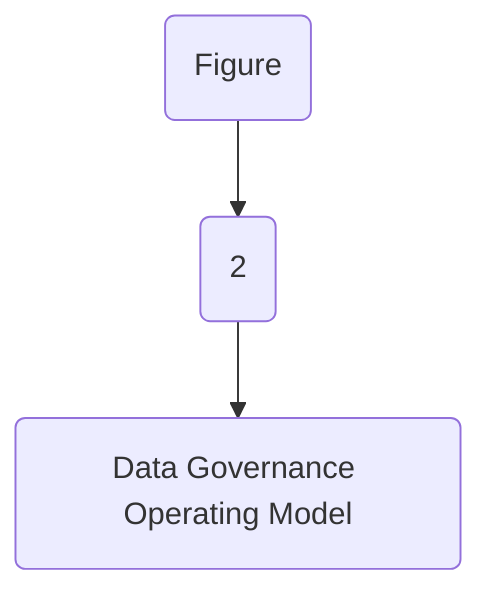
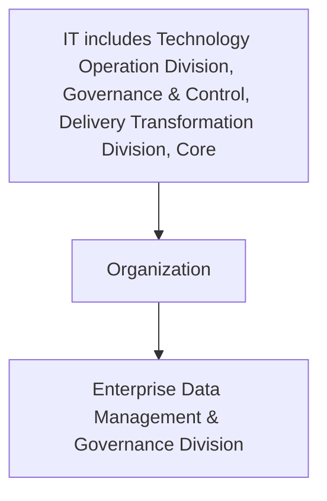

| Reference and Master Data Management |
| --- |

| Version # : | 1 .0 |
| --- | --- |
| Issue / Effective D ate: |  |
| Date of Next Review |  |

| Document Categorization |  |
| --- | --- |

| Prepared by: |  |  |  |
| --- | --- | --- | --- |
| Position / Title | Name | Date | Signature |

| Reviewed by : |  |  |  |
| --- | --- | --- | --- |
| Position / Title | Name | Date | Signature |

| Approved by: |  |  |  |
| --- | --- | --- | --- |
| Position / Title | Name | Date | Signature |

| Rev. No. | Revision Date | Revised By | Approved By | Brief Description of Changes |
| --- | --- | --- | --- | --- |
|  | New Document |  |  |  |

| Term | Description |
| --- | --- |
| BI | Business Intelligence |
| BI&A | Business Intelligence and Analytics |
| BOD | Board of Directors |
| BRD | Business Requirement Document |
| [client] |  |
| BU | Business Unit |
| CMMI | Capability Maturity Model Integration |
| CO | Control Objectives for Information and Related Technologies |
| COO | Chief Operating Officer |
| DB | Database |
| DBMS | Database Management System |
| DG | Data Governance |
| DMS | Document Management System |
| DVR | Data Value Realization |
| DWH | Data Warehouse |
| ECMS | Enterprise Content Management System |
| EDA | Enterprise Data Architecture |
| DM | Data Management |
| ERD | Entity Relationship Diagram |
| EUC | End-User Computations |
| FOI | Freedom of Information |
| GRM | Governance and Regulatory Management |
| HRG | Human Resources Group |
| ISG | Information Systems Group |
| IT | Information Technology |
| ITPC | IT Portfolio Committee |
| KPI | Key Performance Indicators |
| MDM | Master Data Management |
| NCA | National Cybersecurity Authority |
| NDMO | National Data Management Office |
| PDPL | Personal Data Protection Law |
| PII | Personally Identifiable Information |
| RACI | Responsible, Accountable, Consulted, and Informed |
| RCA | Root Cause Assessment |
| ROI | Return on Investment |
| RPA | Reporting Process Assessment |
| RMG | Risk Management Group |
| SAMA | Saudi Arabian Monetary Authority |
| SLA | Service Level Agreements |
| SME | Subject Matter Expert |
| VAT | Value-Added Tax |

| Term | Explanation |
| --- | --- |
| Artifact | A tangible outcome of any process. May refer to documents like data dictionary, business glossary, systems architecture documents etc. |
| Business Glossary | A list of business terms with their definitions |
| Business Intelligence | A technology-driven process for analyzing data and presenting actionable information which helps executives, managers and other corporate end users make informed business decisions. |
| Business Intelligence and Analytics | Business Intelligence and Analytics focuses on analyzing organization 's data records to extract insight and to draw conclusions about the information uncovered. |
| Data | A collection of facts in a raw or unorganized form such as numbers, characters, images, video, voice recordings, or symbols |
| Data-related Activity | Any activity that deals with data creation, data storage, data consumption, data sharing, data archival, data management or data destruction |
| Data Architecture | Data architecture is composed of models, policies, rules or standards that govern which data is collected, and how it is stored, arranged, integrated, and put to use in data systems and in organization s |
| Data Architecture and Modelling | Data Architecture and Modelling focuses on establishment of formal data structures and data flow channels to enable end to end data processing across and within entities. |
| Data Asset | Any critical data in an organization which is governed and managed as an asset |
| Data Catalog and Metadata | Data Catalog and Metadata focuses on enabling an effective access to high quality integrated metadata. The access to metadata is supported by use of the Data Catalog automated tool acting as the single point of reference to the organization s' metadata. |
| Data Classification | Data Classification involves the categorization of data so that it may be used and protected efficiently. Data Classification levels are assigned following an impact assessment determining the potential damages caused by the mishandling of data or unauthorized access to data. |
| Data Dictionary | A centralized repository of information about data such as meaning, relationships to other data, origin, usage, and format |
| Data Governance | Data governance is the definition of organization al structures, data owners, policies, rules, processes, business terms, and metrics for the end-to-end lifecycle of data (collection, storage, use, protection, archiving, and deletion). |
| Data Governance Controls | The preventive measures established to ensure adequate governance over data (e.g., change controls, sign-offs , data quality checks etc.) |
| Data Governance program | A data governance program is an overarching set of initiatives required for establishing and maintaining effective data governance in the organization |
| Data Initiatives | Initiatives which impact how data is created, stored, processed, consumed or destroyed in the organization . These includes system implementations, integrations, automations, data governance or management initiatives etc. |
| Data Lineage | Data lineage is documentation or description of the path along which data flows from the point of its origin to the point of its use showing all the transformations which it undergoes along this path. |
| Data Management | Data Management is a comprehensive collection of practices, concepts, procedures, processes, and accompanying systems that allow for an organization to gain control of its data resources. |
| Data Operations | The Data Operations domain focuses on the design, implementation, and support for data storage to maximize data value throughout its lifecycle from creation/acquisition to disposal. |
| Data Quality | Data Quality measures how fit the data is for its intended use with respect to its accuracy, completeness, integrity, timeliness, conformity and consistency. |
| Data Security and Protection | Data Security and Protection focuses on the processes, people, and technology designed to protect the entity’s data, including, but not limited to authorized access to data, avoidance of spoliation, and safeguarding against unauthorized disclosure of data. This domain is under the mandate of the Saudi National Cybersecurity Authority. |
| Data Sharing and Interoperability | Data Sharing and Interoperability involves the collection of data from different sources and consists of integration solutions fostering a harmonious internal and external communication between various IT components. Data Sharing and Interoperability also covers a Data Sharing process that enable an organized and standardized exchange of data between entities. |
| Data Value Realization | Data Value Realization involves the continuous evaluation of data assets for potential data driven use cases that generate revenue or reduce operating costs for the organization . |
| Data Warehouse | A system to store data from disparate sources, which can be used to create reports and data extracts that, may be used for further data analysis. |
| Document and Content Management | Document and Content Management involves controlling the capture, storage, access, and use of documents and content stored outside of relational databases. |
| Data Management | In the context of this policy, ‘ Data Management ’ (“ data management ”) refers to the Data Management department within [client] . |
| Freedom of Information | Freedom of Information domain focuses on providing Saudi citizens access to government information, portraying the process for accessing such information, and the appeal mechanism in the event of a dispute. |
| Master Data | Information that is shared universally across the organization , regardless of the process, function, conversation, or interaction |
| Metadata | Metadata is ‘structured information that describes, explains, locates, or otherwise makes it easier to retrieve, use, or manage an information resource’. Metadata provides valuable context and meaning to data which dramatically increases the usability of the data. |
| Open Data | Open Data focuses on the organization ’s data which could be made available for public consumption to enhance transparency, accelerate innovation, and foster economic growth |
| Personal Data Protection | Personal Data Protection focuses on protection of a subject’s entitlement to the proper handling and non-disclosure of their personal information. |
| Reference Data | Reference data are sets of values or classification schemas that are referred by systems, applications, data stores, processes, and reports, as well as by transactional and master records. |
| Reference and Master Data Management | Reference and Master Data Management allow to link all critical data to a single master file, providing a common point of reference for all critical data. |

| Responsibility | Function |
| --- | --- |
| Approval and oversight |  |
| Oversight, enforcement & recommendation to BOD |  |
| Document owner and implementations |  |
| Periodic review of policy |  |

| Responsibility | Function |
| --- | --- |
| Policy custodian |  |
| Content issuance/ review |  |
| Periodic audit review |  |

|  | organization |
| --- | --- |
|  | organization |
|  | organization |
|  | organization |
|  | organization |
|  | organization |
|  | organization |
|  | organization |

**[Diagram — PNG]:**

KSA Data Management and Personal Data Protection Framework

- **1- Data Governance**

**Data Assetization**
- 2- Data Catalog and Metadata
- 3- Data Quality
- 4- Data Operations
- 5- Document and Content Mgmt.
- 6- Data Architecture and Modeling
- 7- Reference and Master Data Mgmt.

**Data Usage**
- 8- Business Intelligence and Analytics
- 9- Data Sharing and Interoperability
- 10- Data Value Realization
- 11- Open Data

**Data Classification and Availability**
- 12- Freedom of Information
- 13- Data Classification

**Data Protection**
- 14- Personal Data Protection
- 15- Data Security and Protection (covered by NCA)

**[Diagram — PNG]:**

- **Board of Directors**
  - **MD**
    - **COO**
      - **Head EDM**
        - **BO**
          - BI and Analytics
        - **DWH**
          - **ETL**
          - **DW & Architecture**
          - Data Sharing and Interoperability
        - **Data Governance**
          - Data Governance, Metadata and Data Catalogue, Data Quality, Reference and Master Data Management, Data Architecture & Modelling, Data Value Realization, Open Data, Freedom of Information
        - **TOD**
          - Data Operations
        - **ETD**
          - Document and Content Management
        - **CISD**
          - Data Classification, Data Security and Protection
        - **Risk**
          - Personal Data Protection

- **MIS Council** (linked to BO)
- **DG Council** (linked to Data Governance)

- **NDMO Domains** (side label)

**[Flowchart — Word Shapes]:**

1. Figure
2. 2
3. – Data Governance Operating Model

**[Flowchart — Structured]:**

```markdown
## Step Table

| Step Number | Description                       | Decision Needed? | Yes Direction | No Direction |
|-------------|-----------------------------------|------------------|---------------|--------------|
| 1           | Figure                            | No               | -             | -            |
| 2           | 2                                 | No               | -             | -            |
| 3           | Data Governance Operating Model   | No               | -             | -            |

## Mermaid Diagram


```

The Reference and Master Data Management policy has been developed for , in compliance with relevant Data Management and Personal Data Protection Standards and Interim Regulation issued by the National Data Management Office (NDMO).
Systems and data in most businesses develop more naturally than data management specialists would want. Numerous projects and initiatives, mergers and acquisitions, and other business activity, especially in large businesses, lead to several systems doing basically the same tasks apart from one another. These circumstances necessarily result in differences in data values and data structure between systems. Costs and risks are raised by this unpredictability. Through the management of Master Data and Reference Data, both can be reduced.
Definitions of Reference and Master Data and related terms:

- Master Data: Master data is the consistent and uniform set of identifiers and extended attributes that describes the core entities of the enterprise including customers, prospects, citizens, residents, suppliers, sites, hierarchies, and accounts.

- Reference Data: Reference data are sets of values or classification schemas that are referred to by systems, applications, data stores, processes, and reports, as well as by transactional and master records.

- System of Reference: An authoritative system where data consumers can obtain reliable data to support transactions and analysis, even if the information did not originate in the system of reference. MDM applications, Data Sharing Hubs, and Data Warehouses often serve as systems of reference.

- System of Record: An authoritative system where data is created/captured, and/or maintained through a defined set of rules and expectations (e.g., an ERP system may be the System of Record for sell-to customers).

The below statements of policy have been defined as the foundation of ’s view on reference and master data management. These statements are:

- Establish a Reference and Master Data Management capability, a Reference and Master Data Management approach and plan.

- The Reference and Master Data approach and plan shall be approved by the Data Governance Leadership Team and reviewed quarterly to monitor progress.

- Perform an initial review to identify all Reference and Master Datasets, considering internal and external data.

- Identify, document, and prioritize Reference and Master data objects owned by the  and categorize as either internal or external datasets.

- Identify and document data sources and applications where Reference and Master Data objects are created, read, updated, and deleted.

- Datasets shall be grouped logically where possible to create a single source of Reference or Master data, reduce data duplication and to create a common definition across the  for each Master or Reference data record.

- Prioritize the identified Reference and Master Data Objects for determining a phased approach to implement the target RMD Data architecture.

- Develop and document requirements for effectively managing Reference and Master Data across the data lifecycle.

- Reference data assets must be made available for reuse across the .

- Evaluate and select Reference Master Data Hub architecture design to effectively manage and support its Reference and Master Data Objects.

- For the desired Reference and Master Data environment, create conceptual and data architectures, and specify the technical requirements for the Reference and Master Data Hub platform as per prevailing SAMA and NDMO guidelines along with industry standards.

- Develop and document conceptual architecture for target Reference and Master data environment as per the selected Data Hub architecture design.

- Develop and design data architecture for target Reference and Master data environment based on defined conceptual architecture design.

- Conduct Reference and Master Data training for employees responsible for managing, creating and updating reference and master data.

- Assign Data Owner and Stewardship team to the identified Reference and Master Data Objects.

- Establish and follow clearly defined Data Lifecycle Management process with roles, responsibilities and actions for Reference and Master Data Objects.

- Implement the Reference and Master Data Hub as the 's Trusted Source as well as document and maintain Reference and Master Data Integration Mappings.

- Monitor and improvise quality of reference and master datasets regularly.

- The data quality issues should be raised and resolved as per the Data Quality Policy.

- Establish Service Level Agreements for Reference and Master Data requests.

- Establish Key Performance Indicators (KPIs) to measure the effectiveness of development of Reference and Master Data capabilities.

- Any exceptions, exemptions and/or changes in this policy should be approved by Data Governance Leadership team.

Reference and Master Data Management follows these guiding principles:

- Shared Data: Enabling Master and Reference Data to be shared across ’s functions and all applications.

- Ownership: Reference and Master Data belong to the , not to a particular Domain. Because being shared cross functionally, require a combined stewardship.

- Quality: Reference and Master Data Management require ongoing Data Quality monitoring and governance.

- Stewardship: Stewardship Team accountable for controlling and ensuring the quality of Reference and Master Data as per the instructions from data owner(s).

- Controlled Change:
  o At a given point of time, Master Data values should represent the ’s best understanding of what is accurate and current. Matching rules that change values should be applied with caution and oversight. Any identifier merged or split should be reversible.
  o Changes to Reference Data values should follow a defined process; changes should be approved and communicated before being implemented.

- Authority: Master Data values should be replicated only from ’s system of record. A system of reference may be required to enable sharing of Master Data across the . Ensuring  has complete, consistent, current, authoritative Master and Reference Data across al processes.

The following roles and responsibilities are applicable to this policy
Enterprise Architecture Board (EAB):  EAB is accountable to approve the conceptual and data architectures for the desired Reference and Master data environments
Data Management and Governance Leadership Team: The DG Leadership Team is responsible for the approval for signing off on any changes, exemptions and exceptions to this policy. Further, the DG Leadership will provide strategic direction for Reference and Master Data Management in order to help/support the business operations run smoothly and without any conflict.
Data Governance Council: The Data Governance Council is responsible for implementing Reference and Master Data Hub in the  as a Trusted Source. Monitoring Reference and Master Data quality and monitoring Reference and Master Data KPIs to measure the effectiveness of development of Reference and Master Data capabilities. Further, the DG Council is accountable for approving the conceptual and data architectures for the desired Reference and Master data environments.
Stewardship Team: The Stewardship team is responsible for collecting and evaluating issues of the quality and management of reference and master data. The stewardship team shall work in collaboration with data specialists, data quality analyst and data architect to resolve the identified issues and communicate the data owner(s) and data governance officer upon resolution.
Head of : The Head of  is responsible for overseeing the implementation of data architecture based on conceptual architecture for the desired Reference and Master Data environment.
Sr. Mgr. data Management & Architecture Department: Sr. Mgr. is accountable for Implementing Reference and Master Data Hub, Resolve the Reference and Master Data issues, Monitoring the Reference and Master Data Management KPIs and Responsible for Approve the conceptual and data architectures for the desired Reference and Master data environments, Implementation of data architecture based on conceptual architecture for the desired Reference and Master Data environment, Signing off on any changes, exemptions and exceptions to Reference and Master Data Management policy, Develop MDM and RDM implementation approach.
MDM Team: MDM Team is accountable for Collecting and evaluating issues of the quality and management of reference and master data, Establish and operationalize rules for accurate matching and merging Master Data Records from different data sources to create Golden Records and is responsible for Monitoring Reference and Master Data KPIs, Resolve the Reference and Master Data issues, Raise the identified RMD issues to Data Governance Support or Data Governance Council, Track the resolution of the Reference and Master Data Management issues. Requirements for provisioning of Master Data Golden Records to Requirements for provisioning of requirements for Reference Data Objects to consuming systems and applications, Signing off on any changes, exemptions and exceptions to Reference and Master Data Management policy Approve Reference and Master Data approach and plan, Develop MDM and RDM implementation approach
Data Governance Officer: The Data Governance Officer is responsible for monitoring the Reference and Master Data Management KPIs and raising the identified issues to Data Governance Council (where necessary) and tracking the resolution of the Reference and Master Data Management issues.
Data Owner: The data owner is accountable to establish and operationalize rules for accurate matching and merging Master Data Records from different data sources to create Golden Record. Further, the data owner is responsible the requirements for provisioning of Master Data Golden Records, requirements for provisioning of Reference Data Objects to consuming systems and applications are met adequately and providing/suggesting data quality rules to stewardship team.
Data Quality Analyst: The data quality analyst is accountable to identify and resolve the data quality issues within reference and master data. This also includes creating, implementing and execution of data quality rules and supporting the stewardship team to resolve the data quality issues related to reference and master data.
Data Architect: The Data Architect is accountable for creating and documenting the conceptual architecture for the selected Data Hub architectural design and the intended Reference and Master data environments. Creating and documenting data architecture based on the conceptual architectural design for the desired Reference and Master data environment. Further, data architect is accountable for defining the data architecture framework, standards, and principles, including modeling, metadata, security, reference data such as product codes and client categories, and master data such as clients, vendors, materials, and employees and defining data flows, i.e., which systems/applications of the  generates data, which require data to function, how data flows are managed, and how data changes in transition
GRM Team: GRM Team is responsible to Identify and support in resolution of Reference and Master Data management data quality issues.
Data Specialist: Data Specialist is responsible for raise the identified RMD issues to Data Governance Support, establish and operationalize rules for accurate matching and merging Master Data Records from different data sources to create Golden Records, requirements for provisioning of Master Data Golden Records to consuming systems and applications, requirements for provisioning of requirements for Reference Data Objects to consuming systems and applications, creating and documenting the conceptual architecture for the selected Data Hub architectural design, creating and documenting information architecture based on the conceptual architectural design

| Main Activities | The Board | EAB | DG Leadership Team | Head of data management | DG Council | Sr. Mgr. data Management & Architecture Department | MDM Team | GRM Team | Data Governance Officer | Data Quality Analyst | Data Architect | Data Owner | Data Governance Operations | Data Specialist |  |  |  |
| --- | --- | --- | --- | --- | --- | --- | --- | --- | --- | --- | --- | --- | --- | --- | --- | --- | --- |
| Main Activities | The Board | EAB | DG Leadership Team | Head of data management | DG Council | Sr. Mgr. data Management & Architecture Department | MDM Team | GRM Team | Data Governance Officer | Data Quality Analyst | Data Architect | Data Owner | Data Domain Steward | Business Domain Steward | Data Steward | Business Steward | Data Specialist |
| Implementing Reference and Master Data Hub |  | I |  | A |  | C |  | C | R | C | I |  |  |  |  |  |  |
| Monitoring Reference and Master Data KPIs |  | A | I |  | R |  | I | C | I |  | C | I |  |  |  |  |  |
| Approve the conceptual and data architectures for the desired Reference and Master data environments |  | A |  | I | A | R | C |  | R | C |  |  |  |  |  |  |  |
| Collecting and evaluating issues of the quality and management of reference and master data |  | I |  | A |  | I | R | C | R | C |  |  |  |  |  |  |  |
| Resolve the Reference and Master Data issues |  | I |  | A | R |  | I | C | R |  | C |  |  |  |  |  |  |
| Implementation of data architecture based on conceptual architecture for the desired Reference and Master Data environment |  | C | I | R |  | I |  | A , R | R | I |  |  |  |  |  |  |  |
| Monitoring the Reference and Master Data Management KPIs |  | I | A |  | R | C | R | C | I | C | I | C |  |  |  |  |  |
| Raise the identified RMD issues to Data Governance Support |  | I |  | R |  | I | C | I | C | A | C | R |  |  |  |  |  |
| Raise the identified RMD issues to Data Governance Council |  | R |  | A |  | R |  |  |  |  |  |  |  |  |  |  |  |
| Track the resolution of the Reference and Master Data Management issues. |  | I |  | R |  | A | C | R | C |  |  |  |  |  |  |  |  |
| Establish and operationalize rules for accurate matching and merging Master Data Records from different data sources to create Golden Record s |  | I |  | A |  | I | C | R | C | R |  |  |  |  |  |  |  |
| Requirements for provisioning of Master Data Golden Records to consuming systems and applications |  | C | I |  | R |  | C | R | C | I | C | I | A, R |  |  |  |  |
| Requirements for provisioning of requirements for Reference Data Objects to consuming systems and applications |  | C | I |  | R |  | C | R | C | I | C | I | A, R |  |  |  |  |
| Identify the data quality issues |  | I |  | R | C | A | C | R | C | R | C |  |  |  |  |  |  |
| Resolve the data quality issues |  | I |  | C | R | C |  | A | C | I |  |  |  |  |  |  |  |
| Creating, implementing and execution of data quality rules in DQ Tool |  | I |  | C, I | A | C | R | C | R | C |  |  |  |  |  |  |  |
| Creating and documenting the conceptual architecture for the selected Data Hub architectural design |  | I | C | I | C |  | C, I |  | A | R | C | R |  |  |  |  |  |
| Creating and documenting information architecture based on the conceptual architectural design |  | I | C | I | C |  | C, I |  | A | R | C | R |  |  |  |  |  |
| Signing off on any changes, exemptions and exceptions to Reference and Master Data Management policy |  | A | C |  | R |  | C | I | R | I |  |  |  |  |  |  |  |
| Approve Reference and Master Data approach and plan | I |  | I | A | C |  | R |  | C |  | C | I |  |  |  |  |  |
| Define Definitions and standards for Reference and Master datasets |  | I |  | I | C |  | C | A | C | R | C |  |  |  |  |  |  |
| Develop MDM and RDM implementation approach |  | I | A | C | R |  | C |  | C |  |  |  |  |  |  |  |  |

It is important to measure and analyze the coverage, accuracy and efficiency of Reference and Master Data management. The following table delineates the data classification key performance indicators.

| Category | Metric | Description |
| --- | --- | --- |
| Reference / Master data Identification | Number of master datasets | Total number of datasets identified as Master Datasets |
| Reference / Master data Identification | Number of Reference datasets | Total number of datasets identified as Reference Datasets |
| Reference / Master data Profiling | % of Profiled Reference/ Master Datasets | Percentage of datasets profiled as Reference / Master Datasets |
| Reference / Master data process efficiency | Number of Reference/Master Datasets updated in past 12 months | Updates made to master and/or reference datasets in last 12 months. |
| Reference / Master data process efficiency | Number of incorrect data values in the Reference / Master Data Records | Incorrect values identified in the Reference / Master Data Records. This should be a downward trend with the passage of time |
| Reference / Master data process efficiency | Number of Data Quality Issues identified in Reference/Master Datasets | Data quality issues identified within the Reference / Master Data Records and/or datasets. This should be a downward trend with the passage of time |
| Reference / Master data process efficiency | Number of Change Requests for Reference/Master Dataset(s) | Change requests made for Reference/Master Dataset(s). This will describe the frequency of changes made within Reference/Master Dataset(s) |

| organization |  |
| --- | --- |

**[Flowchart — Word Shapes]:**

1. IT* includes Technology Operation Division, Governance & Control, Delivery Transformation Division, Core
2. Organization
3. ing Division and Enterprise Data Management & Governance Division

**[Flowchart — Structured]:**

```markdown
## Step Table

| Step | Operation                                                                                     | Decision Required? |
|------|-----------------------------------------------------------------------------------------------|--------------------|
| 1    | IT includes Technology Operation Division, Governance & Control, Delivery Transformation Division, Core | No                 |
| 2    | Organization                                                                                  | No                 |
| 3    | Enterprise Data Management & Governance Division                                             | No                 |

## Mermaid Diagram

