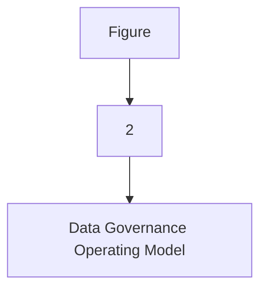
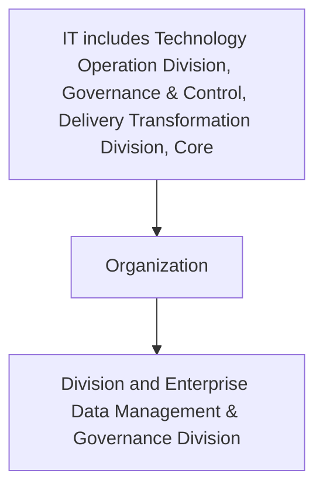

| Business Intelligence and Analytics |
| --- |

| Version # : | 1 .0 |
| --- | --- |
| Issue / Effective D ate: |  |
| Date of Next Review |  |

| Document Categorization | **Strategic**<br>
- Transactional<br>
- Procedural<br>
- Not applicable |
| --- | --- |

| Prepared by: |  |  |  |
| --- | --- | --- | --- |
| Position / Title | Name | Date | Signature |
|  | Shiraz Aslam |  |  |

| Reviewed by : |  |  |  |
| --- | --- | --- | --- |
| Position / Title | Name | Date | Signature |

| Approved by: |  |  |  |
| --- | --- | --- | --- |
| Position / Title | Name | Date | Signature |
| Head of Data Management | Zeeshan Khan |  |  |
| Chief Operating Officer | Thamer Yousef |  |  |

| Rev. No. | Revision Date | Revised By | Approved By | Brief Description of Changes |
| --- | --- | --- | --- | --- |
|  | New Document |  |  |  |

| Term | Description |
| --- | --- |
| BI | Business Intelligence |
| BI&A | Business Intelligence and Analytics |
| BOD | Board of Directors |
| BRD | Business Requirement Document |
| [client] |  |
| BU | Business Unit |
| CCO | Chief Compliance Officer |
| CFO | Chief Financial Officer |
| CISD | Corporate Information Security Department |
| CMMI | Capability Maturity Model Integration |
| CO | Control Objectives for Information and Related Technologies |
| COO | Chief Operating Officer |
| CPG | Compliance Group |
| CRO | Chief Risk Officer |
| CTO | Chief Technology Officer |
| DB | Database |
| DBMS | Database Management System |
| DG | Data Governance |
| DMS | Document Management System |
| DVR | Data Value Realization |
| DWH | Data Warehouse |
| ECMS | Enterprise Content Management System |
| EDA | Enterprise Data Architecture |
| data management | Data Management |
| ERD | Entity Relationship Diagram |
| EUC | End-User Computations |
| FOI | Freedom of Information |
| GRM | Governance and Regulatory Management |
| HR G | Human Resources Group |
| ISG | Information Systems Group |
| IT | Information Technology |
| ITPC | IT Portfolio Committee |
| KPI | Key Performance Indicators |
| MDM | Master Data Management |
| NCA | National Cybersecurity Authority |
| NDMO | National Data Management Office |
| PDPL | Personal Data Protection Law |
| PMO | Project Management Office |
| PMS | Project Management System |
| PII | Personally Identifiable Information |
| PPU | Policy and Procedure Unit |
| PPC | Policy and Procedure Committee |
| RACI | Responsible, Accountable, Consulted, and Informed |
| RCA | Root Cause Assessment |
| ROI | Return on Investment |
| RPA | Reporting Process Assessment |
| RMG | Risk Management Group |
| SAMA | Saudi Arabian Monetary Authority |
| SLA | Service Level Agreements |
| SME | Subject Matter Expert |
| VAT | Value-Added Tax |

| Term | Explanation |
| --- | --- |
| Artifact | A tangible outcome of any process. May refer to documents like data dictionary , business glossary, systems architecture documents etc. |
| Business Glossary | A list of business terms with their definitions |
| Business Intelligence | A technology-driven process for analyzing data and presenting actionable information which helps executives, managers and other corporate end users make informed business decisions. |
| Business Intelligence and Analytics | Business Intelligence and Analytics focuses on analyzing organization's data records to extract insight and to draw conclusions about the information uncovered. |
| Data | A collection of facts in a raw or unorganized form such as numbers, characters, images, video, voice recordings, or symbols |
| Data-related Activity | Any activity that deals with data creation, data storage, data consumption, data sharing, data archival, data management or data destruction |
| Data Architecture | Data architecture is composed of models, policies, rules or standards that govern which data is collected, and how it is stored, arranged, integrated, and put to use in data systems and in organizations |
| Data Architecture and Modelling | Data Architecture and Modelling focuses on establishment of formal data structures and data flow channels to enable end to end data processing across and within entities. |
| Data Asset | Any critical data in an organization which is governed and managed as an asset |
| Data Catalog and Metadata | Data Catalog and Metadata focuses on enabling an effective access to high quality integrated metadata. The access to metadata is supported by use of the Data Catalog automated tool acting as the single point of reference to the organizations' metadata. |
| Data Classification | Data Classification involves the categorization of data so that it may be used and protected efficiently. Data Classification levels are assigned following an impact assessment determining the potential damages caused by the mishandling of data or unauthorized access to data. |
| Data Dictionary | A centralized repository of information about data such as meaning, relationships to other data, origin, usage, and format |
| Data Governance | Data governance is the definition of organizational structures, data owners, policies, rules, processes, business terms, and metrics for the end-to-end lifecycle of data (collection, storage, use, protection, archiving, and deletion). |
| Data Governance Controls | The preventive measures established to ensure adequate governance over data (e.g ., change controls, sign-offs , data quality checks etc.) |
| Data Governance program | A data governance program is an overarching set of initiatives required for establishing and maintaining effective data governance in the organization |
| Data I nitiative s | Initiatives which impact how data is created, stored, processed, consumed or destroyed in the organization . These includes system implementations, integrations, automations, data governance or management initiatives etc. |
| Data Lineage | Data lineage is documentation or description of the path along which data flows from the point of its origin to the point of its use showing all the transformations which it undergo es along this path. |
| Data Management | Data Management is a comprehensive collection of practices, concepts, procedures, processes, and accompanying systems that allow for an organization to gain control of its data resources. |
| Data Operations | The Data Operations domain focuses on the design, implementation, and support for data storage to maximize data value throughout its lifecycle from creation/acquisition to disposal. |
| Data Quality | Data Quality measures how fit the data is for its intended use with respect to its accuracy, completeness, integrity, timeliness, conformity and consistency. |
| Data Security and Protection | Data Security and Protection focuses on the processes, people, and technology designed to protect the entity’s data, including, but not limited to authorized access to data, avoidance of spoliation, and safeguarding against unauthorized disclosure of data. This domain is under the mandate of the Saudi National Cybersecurity Authority. |
| Data Sharing and Interoperability | Data Sharing and Interoperability involves the collection of data from different sources and consists of integration solutions fostering a harmonious internal and external communication between various IT components. Data Sharing and Interoperability also covers a Data Sharing process that enable an organized and standardized exchange of data between entities. |
| Data Value Realization | Data Value Realization involves the continuous evaluation of data assets for potential data driven use cases that generate revenue or reduce operating costs for the organization. |
| Data Warehouse | A system to store data from disparate sources, which can be used to create reports and data extracts that, may be used for further data analysis. |
| Document and Content Management | Document and Content Management involves controlling the capture, storage, access, and use of documents and content stored outside of relational databases. |
| Data Management | In the context of this policy, ‘ Data Management ’ (“ data management ”) refers to the Data Management department within [client] . |
| Freedom of Information | Freedom of Information domain focuses on providing Saudi citizens access to government information, portraying the process for accessing such information, and the appeal mechanism in the event of a dispute. |
| Master Data | Information that is shared universally across the organization , regardless of the process, function, conversation, or interaction |
| Metadata | Metadata is ‘structured information that describes, explains, locates, or otherwise makes it easier to retrieve, use, or manage an information resource’. Metadata provides valuable context and meaning to data which dramatically increases the usability of the data. |
| Open Data | Open Data focuses on the organization’s data which could be made available for public consumption to enhance transparency, accelerate innovation, and foster economic growth |
| Personal Data Protection | Personal Data Protection focuses on protection of a subject’s entitlement to the proper handling and non-disclosure of their personal information. |
| Reference Data | Reference data are sets of values or classification schemas that are referred by systems, applications, data stores, processes, and reports, as well as by transactional and master records. |
| Reference and Master Data Management | Reference and Master Data Management allow to link all critical data to a single master file, providing a common point of reference for all critical data. |

# Policy
## Purpose

The  Policy (' 'the policy') sets out the guidelines, framework, and key roles and responsibilities concerning the management of data in  ('' or 'the '). Through this policy, the  will:

- Establish robust data management and ensure effective oversight, monitoring, and management of data assets.

- Ensure comprehensive controls are in place to ensure data cataloguing, data sharing data quality, accuracy, availability, integrity, and completeness.

- Promote data management awareness amongst the 's employees; and

- Leverage existing data assets to derive business value.

This policy applies to all Business Units (BU), support functions, vendors/ third parties (undertaking any data-related activities for the ), employees (insourced, outsourced & contractual), members of the Board and its committees, and management committees.
() owns this policy, and it is subject to be reviewed every two (2) years or when deemed necessary. This policy will be reviewed and approved as per the standard  protocols applicable for other enterprise level policies.
This  Policy set out the overall Data Management Framework of . In case the provision of any other policy conflict with or are inconsistent with this policy, the provision of this Policy will prevail. If there are questions regarding the interpretation of applicable sections of this policy, the matter should be raised immediately to  for clarifications.

The roles & responsibilities for the approval and implementation of this policy are listed below:
Governance

| Responsibility | Function |
| --- | --- |
| Approval and oversight |  |
| Oversight, enforcement & recommendation to BOD |  |
| Document owner and implementations |  |
| Periodic review of policy |  |
Policy Governance Support

| Responsibility | Function |
| --- | --- |
| Policy custodian |  |
| Content issuance/ review |  |
| Periodic audit review |  |
This policy will be distributed to all  employees. All  employees are responsible for familiarizing themselves and ensuring compliance with the Policy requirements.
Update and maintenance of the document
1. The standards laid down by the Board through this document may be subject to changes, as deemed appropriate by the Board to ensure appropriate oversight and control over the ’s affairs. Such changes may be required due to one or more of the following reasons:
a) Changes in applicable laws, regulatory requirements / standards and specific instructions from governmental, legal and regulatory authorities
b) Changes in governance and organizational structures including institution of new committees or changes in the existing committees, changes in terms of references of groups / divisions and changes in the roles and responsibilities of relevant stakeholders
c) Inclusion of new data processes in the
d) New data management and application roles that are not envisioned or included in this document
e) Changes in data governance roles, responsibilities, or accountability matrix (as per the data governance handbook)
f) Any other change as deemed necessary by the Board
2. A formal 'Amendment Request Form' describing the proposed revision/ amendment shall be prepared by the person requesting changes (or 'requestor'). The amendment request inclusion and approval process will be as follows:
a) The requestor will complete the amendment request form, detailing the justification for changes to the policy document.
b) The amendment request form must be submitted to the Senior Manager, Data Governance and subsequently to the DG Management and Leadership Team for review and approval.
c) After approval is obtained from the DG Council, the amendment request form has to be submitted by PPU to the PPC members for their level of approval.
3. The Management of the  shall also have the right to propose amendments to the policy based on evolving circumstances and business needs. The Board, at its sole discretion shall have the authority to accept or reject such proposed changes and authorize amendment of the policy accordingly, if required.
a) will be responsible to carry out the required changes as directed by the Board and present the revised / updated policy to the Board for formal approval of the revised version.
b) Once the Board has approved an updated version of the policy,  will coordinate with PPU and PPU shall take the necessary steps to immediately inform the primary recipients of the changes / amendments, through an internal memorandum. Such revisions may also be communicated via email. The updated policy shall then be circulated, following the same circulation process as defined in the “Ownership, Custody and Circulation” section of this policy.
c) In the event of changes in the policy, the primary recipients shall be responsible to assess if the changes in this policy warrant a change in relevant policies and procedures, and if required, necessary updates to the policies and procedures will be made to ensure alignment with the revised Enterprise Data Governance Policy.

This policy adheres to the guidelines and the principles stipulated in:
- National Data Governance Interim Regulations
- National Data Management Office Handbook
- Data Management and Personal Data Protection Standards
The  will also adhere to all other applicable laws and regulations around data governance and data management as and when will be issued by the SAMA, NDMO and other regulators, relevant to the 's operations.
Compliance to applicable laws and regulations shall be provided by the Compliance Group and Internal Audit Department of the .
This policy is for the internal use of , and all employees must ensure its confidentiality at all times. No content of this policy shall be reproduced or transmitted in any form by any means without the written permission of a competent authority.

The Policy is effective from the date of its approval by the Board of Directors

**[Diagram — PNG]:**

KSA Data Management and Personal Data Protection Framework

- **Data Governance**
  - 1- Data Governance

- **Data Assetization**
  - 2- Data Catalog and Metadata
  - 3- Data Quality
  - 4- Data Operations
  - 5- Document and Content Mgmt.
  - 6- Data Architecture and Modeling
  - 7- Reference and Master Data Mgmt.

- **Data Usage**
  - 8- Business Intelligence and Analytics
  - 9- Data Sharing and Interoperability
  - 10- Data Value Realization
  - 11- Open Data

- **Data Classification and Availability**
  - 12- Freedom of Information
  - 13- Data Classification

- **Data Protection**
  - 14- Personal Data Protection
  - 15- Data Security and Protection (covered by NCA)

**[Diagram — PNG]:**

- **Board of Directors**
  - MD
    - COO
      - Head EDM
        - MIS Council
        - DG Council

- **NDMO Domains**
  - BO: BI and Analytics
  - DWH
    - ETL
    - DW & Architecture: Data Sharing and Interoperability
  - Data Governance
    - Data Governance, Metadata and Data Catalogue, Data Quality, Reference and Master Data Management, Data Architecture & Modelling, Data Value Realization, Open Data, Freedom of Information
  - TOD: Data Operations
  - ETD: Document and Content Management
  - CISD: Data Classification, Data Security and Protection
  - Risk: Personal Data Protection

**[Flowchart — Word Shapes]:**

1. Figure
2. 2
3. – Data Governance Operating Model

**[Flowchart — Structured]:**

```markdown
## Step Table

| Step | Description                          | Decision |
|------|--------------------------------------|----------|
| 1    | Figure                               | No       |
| 2    | 2                                    | No       |
| 3    | Data Governance Operating Model      | No       |

## Mermaid Diagram


```

The Business Intelligence and Analytics policy has been developed for the  Saudi Fransi in compliance with the standards and regulations issued by the National Data Management Office (NDMO) of the Kingdom of Saudi Arabia.
Business Intelligence and Analytics (BI&A) includes the applications, infrastructure and tools, and best practices that enable access to and analysis of information to improve and optimize decisions and performance.

The below statements of policy have been defined as the foundation of ’s view on BI and Analytics. These statements are:

- is required to develop a Business Intelligence and Analytics Plan, prioritize a list of BI and Analytics use cases, and create an implementation strategy for each of the defined BI and Analytics Use Cases in the Use Case Portfolio.

- shall ensure that the Business Intelligence and Analytics Plan is supported by analytics and business intelligence capabilities and processes to provide strategic, tactical, and operational insights into the business.

- shall determine and rank the list of Business Intelligence and Analytics use cases based on strategy and describe the use cases that best represent business data requirements.

- will conduct business intelligence and analytics training and develop business intelligence and analytics awareness campaigns to promote the awareness, education and adoption of Business Intelligence and Analytics capabilities.

- will identify a validation process for use case outcomes as part of the Data Lifecycle Management.

- will define key performance indicators (KPIs) as part of the Performance Management control to assess the performance and efficacy of BI and Analytics portfolio.

- must keep track of BI and Analytics Use Cases, final reviews of the results of each implementation, and relevant process documentation in a register which is accessible to relevant stakeholders.

should adhere to the following principles:

- Focus on business goals: Make sure BI serves organizational priorities and solves business problems.

- Start with the end in mind: Let the business priority and scope of end-data-delivery in the BI&A space drive the creation of the DW content.

- Think, design, act and build: Let end-vision guide the analytics, but build and deliver incrementally to deliver meaningful results and reasonable return on investments

- Promote transparency and self-service: The more context (Metadata of all kinds) provided, the better the results to get value out of the data. Keep stakeholders informed about the data and the processes by which it is analyzed.

- Collaborate: Collaborate with other data initiatives, especially those for Data Governance, Data Classification, Data Security, Data Quality, Data Value Realization, and Data Catalog and Metadata.

The following roles and responsibilities are applicable to this policy:

- Data Management and Governance Leadership Team: The executive body of  data management & governance is responsible for signing off on any changes, exemption, and exceptions to this policy.

- Data Governance Council: The strategic body of  data management & governance is responsible for implementing this policy in the  and ensuring the required process for Business Intelligence and Analytics are implemented. It is also accountable for developing Business Intelligence and Analytics plan, defining KPIs and monitor the performance and efficacy of BI and Analytics.

- MIS Council: MIS council is responsible for Develop BI and analytics plan, create implementation strategy for the BI&A use cases, provide training and develop business intelligence and analytics awareness campaigns, develop a validation process for BI&A use case from expected outcomes and ROI perspective, keep a register for of its BI and Analytics Use Cases
Sr. Manager BI&A: Sr. Mgr. is responsible for Provide training and develop business intelligence and analytics awareness campaigns, define key performance indicators (KPIs) and is accountable for Develop a validation process for BI&A use case from expected outcomes and ROI perspective, Keep a register for of its BI and Analytics Use Cases, Monitor the performance and efficacy of BI and Analytics.

- Data Governance officer: An experienced business domain representative responsible for managing all data management & governance initiatives and changes. The data governance officer ensures compliance of this policy.

- Head of : The Head of  is responsible to oversee implementation of the Data Management Program and compliance with Business Intelligence and Analytics standards.

- Business Intelligence and Analytics Team: The Business Intelligence and Analytics team is accountable and responsible to develop BI and analytics plan, create implementation strategy for the BI&A use cases, identify a validation process for use case outcomes as part of the Data Lifecycle Management, document register for its BI and Analytics Use Cases, creation of analytics reports, define KPIs and maintaining and updating BI&A logs.

- HR: HR team is responsible and accountable for providing training and developing business intelligence and analytics awareness campaigns.

- Data Owner: Data Owners are responsible for supporting BI and Analytics team with activities like providing inputs for BI and analytics plan, training and awareness sessions, use case identifications and population of analytics reports.

- Data Specialist: Data Specialist is responsible for implementation of strategy for the BI&A use cases.

- Stewardship Team: The stewardship team supports the Business Intelligence and Analytics capabilities.  The team contributes on formulation of strategy for BI & A use cases, training and awareness, population of analytics reports and ad-hoc reports

| Main Activities | The Board | DG Leadership Team | Head of data management | MIS Council | DG Council | Sr. Manager BI&A | Data Governance Officer | BI&A Team | HR | Data Owner | Stewardship Team | Data Specialist |  |  |  |
| --- | --- | --- | --- | --- | --- | --- | --- | --- | --- | --- | --- | --- | --- | --- | --- |
| Main Activities | The Board | DG Leadership Team | Head of data management | MIS Council | DG Council | Sr. Manager BI&A | Data Governance Officer | BI&A Team | HR | Data Owner | Data Domain Steward | Business Domain Steward | Data Steward | Business Steward | Data Specialist |
| Develop BI and analytics plan |  | A | R | I |  | I | R |  | C | I | C |  |  |  |  |
| Create implementation strategy for the BI&A use cases |  | I | R | I |  | I | A, R |  | C | I | R |  |  |  |  |
| Provide training and develop business intelligence and analytics awareness campaigns |  | A | C | C, R | I | R | C | R | C | C, I | C | I |  |  |  |
| Develop a validation process for BI&A use case from expected outcomes and ROI perspective |  | C, I | R |  | A | I |  | C, I | C | I | C |  |  |  |  |
| Keep a register for of its BI and Analytics Use Cases |  | C, I | R |  | A | I |  | C, I | C | I | C |  |  |  |  |
| Development, modification, and automation of reports and ad-hoc reports |  | C, I | R |  | A | I |  | C, I | C | I |  |  |  |  |  |
| Define key performance indicators (KPIs) |  | A |  | I | R | I | R |  | I |  |  |  |  |  |  |
| Monitor the performance and efficacy of BI and Analytics. |  | A |  | C, I |  | I |  |  |  |  |  |  |  |  |  |
| Maintaining and updating BI&A logs |  | I |  | I |  | I | A, R |  | I |  |  |  |  |  |  |

It is important to measure the performance and analyze the effectiveness of Business Intelligence and Analytics.
The following table delineates the Business Intelligence and Analytics key performance indicators.

| Category | Metric | Description |
| --- | --- | --- |
| BI and Analytics Use cases Implementation | Number of use cases defined | Total number of BI and Analytics use cases defined |
| BI and Analytics Use cases Implementation | Number of use cases piloted | Total number of use cases piloted during BI and Analytics process |
| BI and Analytics Use cases Implementation | Number of use cases implemented and scaled | Total number of use cases implemented and scaled to explore and expand the BI and Analytics process |
| BI and Analytics Process efficiency | Total ROI value generated from the implemented use cases | Total ROI value generated from the implemented use cases to evaluate efficiency/profitability of an investment |
| Performance Monitoring | Training and awareness sessions delivered | Total number of training and awareness programs delivered by [client] management |

**[Flowchart — Word Shapes]:**

1. IT* includes Technology Operation Division, Governance & Control, Delivery Transformation Division, Core
2. Organization
3. ing
4. Division and Enterprise Data Management & Governance Division
5. ing Division and Enterprise Data Management & Governance Division

**[Flowchart — Structured]:**

```markdown
## Step Table

| Step | Description                                                                                                   |
|------|---------------------------------------------------------------------------------------------------------------|
| 1    | IT includes Technology Operation Division, Governance & Control, Delivery Transformation Division, Core      |
| 2    | Organization                                                                                                  |
| 3    | Division and Enterprise Data Management & Governance Division                                                 |

## Mermaid Diagram

