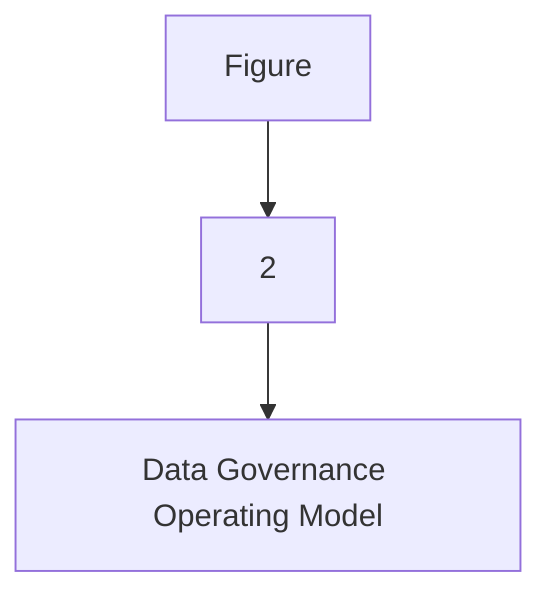
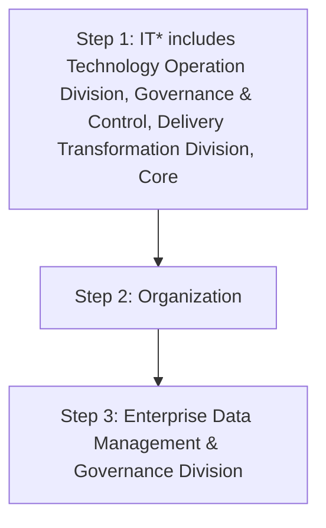

| Data Value Realization |
| --- |

| Version # : | 1 .0 |
| --- | --- |
| Issue / Effective D ate: |  |
| Date of Next Review |  |

| Document Categorization |  |
| --- | --- |

| Prepared by: |  |  |  |
| --- | --- | --- | --- |
| Position / Title | Name | Date | Signature |

| Reviewed by : |  |  |  |
| --- | --- | --- | --- |
| Position / Title | Name | Date | Signature |

| Approved by: |  |  |  |
| --- | --- | --- | --- |
| Position / Title | Name | Date | Signature |

| Rev. No. | Revision Date | Revised By | Approved By | Brief Description of Changes |
| --- | --- | --- | --- | --- |
|  | New Document |  |  |  |

| Term | Description |
| --- | --- |
| BI | Business Intelligence |
| BI&A | Business Intelligence and Analytics |
| BOD | Board of Directors |
| BRD | Business Requirement Document |
| [client] |  |
| BU | Business Unit |
| CMMI | Capability Maturity Model Integration |
| CO | Control Objectives for Information and Related Technologies |
| COO | Chief Operating Officer |
| DB | Database |
| DBMS | Database Management System |
| DG | Data Governance |
| DMS | Document Management System |
| DVR | Data Value Realization |
| DWH | Data Warehouse |
| ECMS | Enterprise Content Management System |
| EDA | Enterprise Data Architecture |
| DM | Data Management |
| ERD | Entity Relationship Diagram |
| EUC | End-User Computations |
| FOI | Freedom of Information |
| GRM | Governance and Regulatory Management |
| HRG | Human Resources Group |
| ISG | Information Systems Group |
| IT | Information Technology |
| ITPC | IT Portfolio Committee |
| KPI | Key Performance Indicators |
| MDM | Master Data Management |
| NCA | National Cybersecurity Authority |
| NDMO | National Data Management Office |
| PDPL | Personal Data Protection Law |
| PII | Personally Identifiable Information |
| RACI | Responsible, Accountable, Consulted, and Informed |
| RCA | Root Cause Assessment |
| ROI | Return on Investment |
| RPA | Reporting Process Assessment |
| RMG | Risk Management Group |
| SAMA | Saudi Arabian Monetary Authority |
| SLA | Service Level Agreements |
| SME | Subject Matter Expert |
| VAT | Value-Added Tax |

| Term | Explanation |
| --- | --- |
| Artifact | A tangible outcome of any process. May refer to documents like data dictionary, business glossary, systems architecture documents etc. |
| Business Glossary | A list of business terms with their definitions |
| Business Intelligence | A technology-driven process for analyzing data and presenting actionable information which helps executives, managers and other corporate end users make informed business decisions. |
| Business Intelligence and Analytics | Business Intelligence and Analytics focuses on analyzing organization 's data records to extract insight and to draw conclusions about the information uncovered. |
| Data | A collection of facts in a raw or unorganized form such as numbers, characters, images, video, voice recordings, or symbols |
| Data-related Activity | Any activity that deals with data creation, data storage, data consumption, data sharing, data archival, data management or data destruction |
| Data Architecture | Data architecture is composed of models, policies, rules or standards that govern which data is collected, and how it is stored, arranged, integrated, and put to use in data systems and in organization s |
| Data Architecture and Modelling | Data Architecture and Modelling focuses on establishment of formal data structures and data flow channels to enable end to end data processing across and within entities. |
| Data Asset | Any critical data in an organization which is governed and managed as an asset |
| Data Catalog and Metadata | Data Catalog and Metadata focuses on enabling an effective access to high quality integrated metadata. The access to metadata is supported by use of the Data Catalog automated tool acting as the single point of reference to the organization s' metadata. |
| Data Classification | Data Classification involves the categorization of data so that it may be used and protected efficiently. Data Classification levels are assigned following an impact assessment determining the potential damages caused by the mishandling of data or unauthorized access to data. |
| Data Dictionary | A centralized repository of information about data such as meaning, relationships to other data, origin, usage, and format |
| Data Governance | Data governance is the definition of organization al structures, data owners, policies, rules, processes, business terms, and metrics for the end-to-end lifecycle of data (collection, storage, use, protection, archiving, and deletion). |
| Data Governance Controls | The preventive measures established to ensure adequate governance over data (e.g., change controls, sign-offs, data quality checks etc.) |
| Data Governance program | A data governance program is an overarching set of initiatives required for establishing and maintaining effective data governance in the organization |
| Data Initiatives | Initiatives which impact how data is created, stored, processed, consumed or destroyed in the organization . These includes system implementations, integrations, automations, data governance or management initiatives etc. |
| Data Lineage | Data lineage is documentation or description of the path along which data flows from the point of its origin to the point of its use showing all the transformations which it undergoes along this path. |
| Data Management | Data Management is a comprehensive collection of practices, concepts, procedures, processes, and accompanying systems that allow for an organization to gain control of its data resources. |
| Data Operations | The Data Operations domain focuses on the design, implementation, and support for data storage to maximize data value throughout its lifecycle from creation/acquisition to disposal. |
| Data Quality | Data Quality measures how fit the data is for its intended use with respect to its accuracy, completeness, integrity, timeliness, conformity and consistency. |
| Data Security and Protection | Data Security and Protection focuses on the processes, people, and technology designed to protect the entity’s data, including, but not limited to authorized access to data, avoidance of spoliation, and safeguarding against unauthorized disclosure of data. This domain is under the mandate of the Saudi National Cybersecurity Authority. |
| Data Sharing and Interoperability | Data Sharing and Interoperability involves the collection of data from different sources and consists of integration solutions fostering a harmonious internal and external communication between various IT components. Data Sharing and Interoperability also covers a Data Sharing process that enable an organized and standardized exchange of data between entities. |
| Data Value Realization | Data Value Realization involves the continuous evaluation of data assets for potential data driven use cases that generate revenue or reduce operating costs for the organization . |
| Data Warehouse | A system to store data from disparate sources, which can be used to create reports and data extracts that, may be used for further data analysis. |
| Document and Content Management | Document and Content Management involves controlling the capture, storage, access, and use of documents and content stored outside of relational databases. |
| Data Management | In the context of this policy, ‘ Data Management ’ (“ data management ”) refers to the Data Management department within [client] . |
| Freedom of Information | Freedom of Information domain focuses on providing Saudi citizens access to government information, portraying the process for accessing such information, and the appeal mechanism in the event of a dispute. |
| Master Data | Information that is shared universally across the organization , regardless of the process, function, conversation, or interaction |
| Metadata | Metadata is ‘structured information that describes, explains, locates, or otherwise makes it easier to retrieve, use, or manage an information resource’. Metadata provides valuable context and meaning to data which dramatically increases the usability of the data. |
| Open Data | Open Data focuses on the organization ’s data which could be made available for public consumption to enhance transparency, accelerate innovation, and foster economic growth |
| Personal Data Protection | Personal Data Protection focuses on protection of a subject’s entitlement to the proper handling and non-disclosure of their personal information. |
| Reference Data | Reference data are sets of values or classification schemas that are referred by systems, applications, data stores, processes, and reports, as well as by transactional and master records. |
| Reference and Master Data Management | Reference and Master Data Management allow to link all critical data to a single master file, providing a common point of reference for all critical data. |

| Responsibility | Function |
| --- | --- |
| Approval and oversight |  |
| Oversight, enforcement & recommendation to BOD |  |
| Document owner and implementations |  |
| Periodic review of policy |  |

| Responsibility | Function |
| --- | --- |
| Policy custodian |  |
| Content issuance/ review |  |
| Periodic audit review |  |

|  | organization |
| --- | --- |
|  | organization |
|  | organization |
|  | organization |
|  | organization |
|  | organization |
|  | organization |
|  | organization |

**[Diagram — PNG]:**

**KSA Data Management and Personal Data Protection Framework**

1. **Data Governance**

**Data Assetization:**
- 2: Data Catalog and Metadata
- 3: Data Quality
- 4: Data Operations
- 5: Document and Content Mgmt.
- 6: Data Architecture and Modeling
- 7: Reference and Master Data Mgmt.

**Data Usage:**
- 8: Business Intelligence and Analytics
- 9: Data Sharing and Interoperability
- 10: Data Value Realization
- 11: Open Data

**Data Classification and Availability:**
- 12: Freedom of Information
- 13: Data Classification

**Data Protection:**
- 14: Personal Data Protection
- 15: Data Security and Protection (covered by NCA)

**[Diagram — PNG]:**

- **Board of Directors**

  - **MD**
    - **COO**
      - **Head EDM**
        - **NDMO Domains**:
          - **BO**
            - BI and Analytics
          - **DWH**
            - **ETL**
              - Data Sharing and Interoperability
            - **DW & Architecture**
              - Data Sharing and Interoperability
          - **Data Governance**
            - Data Governance, Metadata and Data Catalogue, Data Quality, Reference and Master Data Management, Data Architecture & Modelling, Data Value Realization, Open Data, Freedom of Information
          - **TOD**
            - Data Operations
          - **ETD**
            - Document and Content Management
          - **CISD**
            - Data Classification, Data Security and Protection
          - **Risk**
            - Personal Data Protection

- **Councils**:
  - **MIS Council** (related to BO)
  - **DG Council** (related to Data Governance)

**[Flowchart — Word Shapes]:**

1. Figure
2. 2
3. – Data Governance Operating Model

**[Flowchart — Structured]:**

```markdown
### Step Table

| Step | Description                       | Decision Required | Next Step if Yes | Next Step if No |
|------|-----------------------------------|-------------------|------------------|-----------------|
| 1    | Figure                            | No                | 2                | -               |
| 2    | 2 (implying a continuation or action)| No                | 3                | -               |
| 3    | Data Governance Operating Model   | No                | -                | -               |

### Mermaid Diagram


```

The Data Value Realization policy has been created in accordance with the guidelines and criteria set forth by the National Data Management Office (NDMO) of the Kingdom of Saudi Arabia. As part of the Data Value Realization policy, data assets are continuously assessed for prospective data-driven use cases that could result in revenue generation or lower operational costs for the  Saudi Fransi.
Data Value Realization (DVR) is the technique utilized to achieve a quantifiable economic benefit using data generated. This can involve leveraging data internally to enhance workflows or seize new opportunities for innovation, as well as to cut costs, boost revenue, and create new chances for data-related services.

The below statements of policy have been defined as the foundation of ’s view on data value realization. These statements are:

- Identify and document Data Value Realization use cases that include Data cost saving use cases and data revenue generation use cases.

- Estimate and document the projected Payback period and Return on Investment (ROI) for each Data Value Realization Use Case.

- Establish a Data Value Realization Plan to achieve its data revenue generation potential and promote data-related cost optimization activities.

- Establish a Data Revenue Generation Process (define the pricing scheme, calculate data collection and development cost, and define charging model)

- Monitor and Maintain implemented Data Value Realization Use Cases

- Establish key performance indicators (KPIs) to measures Data Value Realization activities

Data Value Realization is based on these guiding principles:
1. Be Specific: Data Value Realization should be focused on identification of right use cases e.g., revenue generation, cost cutting etc.
2. Actionable: Data Value Realization use cases must be actionable and serving the purpose.
3. Measurable: The Output of Data Value Realization Use cases must be measurable in defined KPI’s
4. Drive Innovation: Data Value Realization KPI’s should be innovation driven for the .

The following roles and responsibilities are applicable to this policy:

- Data Management and Governance Leadership Team: The executive body of  data management & governance is responsible for signing off on any changes, exemption, and exceptions to this policy.

- Data Governance Council: The strategic body of  data management & governance is responsible for the creation of Data Value Realization (DVR) plan and overlooks the implementation of data value generation process, monitoring and maintenance of implemented Data Value Realization use cases and DVR KPIs

- Data Governance officer: An experienced business domain representative responsible for managing all data management & governance initiatives and changes. The data governance officer overlooks and manages the implementation of data value realization projects and maintains plans, timelines, budgets, ensuring that progress is made.

- Head of : Head of  responsible for managing all data management & governance initiatives and changes. The Head of  is consulted for the identification and documentation of the data value realization use cases, overlook monitoring and maintenance of implemented DVR use cases, and examine DVR KPIs

- Data Owner: The Data Owner is single point of contact for all DVR activities from Identification of use cases till DVR KPIs measurement. He / She is responsible for providing domain-specific executive-level support in all data value realization activities, communicating the results of the activities across the business domain, establish and maintain the data value realization KPIs in their domain.

- Data Product: The Data Product team can be anyone from the overall  team which generates business value out of data by providing services to the business lines across the . This team is responsible and accountable for the implementation of data revenue generation process including defining the pricing scheme, calculation of data collection and development cost, define the charging model and cost effort estimation for each DVR request. Further the team is also responsible for identification and documentation of the data value realization use cases, determine the projected ROI, DVR plan, maintenance of implemented use cases and develop KPIs to measure the DVR effectiveness.

- Data Specialist:  Data Specialist is responsible estimation and documentation of Projected Payback Period and ROI for each DVR use case.

| Main Activities | The Board | DG Leadership Team | Head of data management | DG Council | Data Governance Officer | Data Product Team | Data Owner | MIS Council | Data Specialist |
| --- | --- | --- | --- | --- | --- | --- | --- | --- | --- |
| Identification and Documentation of Data Value Realization Use Cases |  | C | I | A, R | R | C |  |  |  |
| Estimation and documentation of Projected Payback Period and ROI for each DVR use case |  | I | C | I | A, R | R | C | R |  |
| Create Data Value Realization Plan |  | I | C | I | A, R | R | C |  |  |
| Implementation of Data Revenue Generation Process (define the pricing scheme, calculate data collection and development cost, and define charging model) |  | A | I | C | R | C |  |  |  |
| Monitoring and Maintenance of implemented Data Value Realization Use Cases |  | I | A, R | C |  | C |  |  |  |
| Establish key performance indicators (KPIs) to measure the Data Value Realization activities |  | A | C | I | R | C |  |  |  |

It is important to measure the progress of the Data Value Realization initiatives. Data Product and BI Team is accountable and responsible for creating and maintaining the Key Performance Indicators (KPIs) to measure the Data Value Realization initiatives. The following table delineates the Data Value Realization key performance indicators.

| Category | Metric | Description |
| --- | --- | --- |
| Data Value Realization Use Cases | C ost saved from implemented Use Cases | Total cost saved from implemented Cost Saving Use Cases . This in dicator will be assessed at each use case level, and the frequency will be on yearly basis. |
| Data Value Realization Use Cases | Data Value Realization Use Case Payback period | Period of Data Value Realization Use Case Payback . This KPI will be monitored and assessed as per the pay back period defined at business value estimation time. |
| Data Value Realization Use Cases | Data Value Realization Use Case Return on Investment (ROI). | Return on Investment (ROI) from implemented Data Value Realization Use Cases . This KPI will be assessed at each use case level, and the frequency will be on yearly basis. |

| organization |  |
| --- | --- |

**[Flowchart — Word Shapes]:**

1. IT* includes Technology Operation Division, Governance & Control, Delivery Transformation Division, Core
2. Organization
3. ing Division and Enterprise Data Management & Governance Division

**[Flowchart — Structured]:**

```markdown
## Step Table

| Step Number | Step Description                                                                          | Decision | Next Step (Yes) | Next Step (No) |
|-------------|-------------------------------------------------------------------------------------------|----------|-----------------|----------------|
| 1           | IT* includes Technology Operation Division, Governance & Control, Delivery Transformation Division, Core | No       | 2               | -              |
| 2           | Organization                                                                              | No       | 3               | -              |
| 3           | Enterprise Data Management & Governance Division                                         | No       | -               | -              |

## Mermaid Diagram

