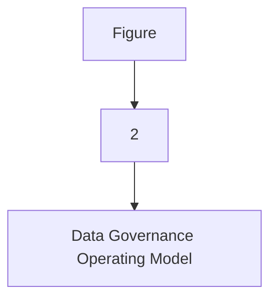
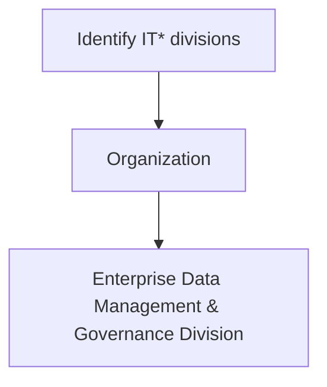

| Data Classification |
| --- |

| Version # : | 1 .0 |
| --- | --- |
| Issue / Effective D ate: |  |
| Date of Next Review |  |

| Document Categorization |  |
| --- | --- |

| Prepared by: |  |  |  |
| --- | --- | --- | --- |
| Position / Title | Name | Date | Signature |

| Reviewed by : |  |  |  |
| --- | --- | --- | --- |
| Position / Title | Name | Date | Signature |

| Approved by: |  |  |  |
| --- | --- | --- | --- |
| Position / Title | Name | Date | Signature |

| Rev. No. | Revision Date | Revised By | Approved By | Brief Description of Changes |
| --- | --- | --- | --- | --- |
|  | New Document |  |  |  |

| Term | Description |
| --- | --- |
| BI | Business Intelligence |
| BI&A | Business Intelligence and Analytics |
| BOD | Board of Directors |
| BRD | Business Requirement Document |
| [client] |  |
| BU | Business Unit |
| CMMI | Capability Maturity Model Integration |
| CO | Control Objectives for Information and Related Technologies |
| COO | Chief Operating Officer |
| DB | Database |
| DBMS | Database Management System |
| DG | Data Governance |
| DMS | Document Management System |
| DVR | Data Value Realization |
| DWH | Data Warehouse |
| ECMS | Enterprise Content Management System |
| EDA | Enterprise Data Architecture |
| DM | Data Management |
| ERD | Entity Relationship Diagram |
| EUC | End-User Computations |
| FOI | Freedom of Information |
| GRM | Governance and Regulatory Management |
| HRG | Human Resources Group |
| ISG | Information Systems Group |
| IT | Information Technology |
| ITPC | IT Portfolio Committee |
| KPI | Key Performance Indicators |
| MDM | Master Data Management |
| NCA | National Cybersecurity Authority |
| NDMO | National Data Management Office |
| PDPL | Personal Data Protection Law |
| PII | Personally Identifiable Information |
| RACI | Responsible, Accountable, Consulted, and Informed |
| RCA | Root Cause Assessment |
| ROI | Return on Investment |
| RPA | Reporting Process Assessment |
| RMG | Risk Management Group |
| SAMA | Saudi Arabian Monetary Authority |
| SLA | Service Level Agreements |
| SME | Subject Matter Expert |
| VAT | Value-Added Tax |

| Term | Explanation |
| --- | --- |
| Artifact | A tangible outcome of any process. May refer to documents like data dictionary, business glossary, systems architecture documents etc. |
| Business Glossary | A list of business terms with their definitions |
| Business Intelligence | A technology-driven process for analyzing data and presenting actionable information which helps executives, managers and other corporate end users make informed business decisions. |
| Business Intelligence and Analytics | Business Intelligence and Analytics focuses on analyzing organization 's data records to extract insight and to draw conclusions about the information uncovered. |
| Data | A collection of facts in a raw or unorganized form such as numbers, characters, images, video, voice recordings, or symbols |
| Data-related Activity | Any activity that deals with data creation, data storage, data consumption, data sharing, data archival, data management or data destruction |
| Data Architecture | Data architecture is composed of models, policies, rules or standards that govern which data is collected, and how it is stored, arranged, integrated, and put to use in data systems and in organization s |
| Data Architecture and Modelling | Data Architecture and Modelling focuses on establishment of formal data structures and data flow channels to enable end to end data processing across and within entities. |
| Data Asset | Any critical data in an organization which is governed and managed as an asset |
| Data Catalog and Metadata | Data Catalog and Metadata focuses on enabling an effective access to high quality integrated metadata. The access to metadata is supported by use of the Data Catalog automated tool acting as the single point of reference to the organization s' metadata. |
| Data Classification | Data Classification involves the categorization of data so that it may be used and protected efficiently. Data Classification levels are assigned following an impact assessment determining the potential damages caused by the mishandling of data or unauthorized access to data. |
| Data Dictionary | A centralized repository of information about data such as meaning, relationships to other data, origin, usage, and format |
| Data Governance | Data governance is the definition of organization al structures, data owners, policies, rules, processes, business terms, and metrics for the end-to-end lifecycle of data (collection, storage, use, protection, archiving, and deletion). |
| Data Governance Controls | The preventive measures established to ensure adequate governance over data (e.g., change controls, sign-offs , data quality checks etc.) |
| Data Governance program | A data governance program is an overarching set of initiatives required for establishing and maintaining effective data governance in the organization |
| Data Initiatives | Initiatives which impact how data is created, stored, processed, consumed or destroyed in the organization . These includes system implementations, integrations, automations, data governance or management initiatives etc. |
| Data Lineage | Data lineage is documentation or description of the path along which data flows from the point of its origin to the point of its use showing all the transformations which it undergoes along this path. |
| Data Management | Data Management is a comprehensive collection of practices, concepts, procedures, processes, and accompanying systems that allow for an organization to gain control of its data resources. |
| Data Operations | The Data Operations domain focuses on the design, implementation, and support for data storage to maximize data value throughout its lifecycle from creation/acquisition to disposal. |
| Data Quality | Data Quality measures how fit the data is for its intended use with respect to its accuracy, completeness, integrity, timeliness, conformity and consistency. |
| Data Security and Protection | Data Security and Protection focuses on the processes, people, and technology designed to protect the entity’s data, including, but not limited to authorized access to data, avoidance of spoliation, and safeguarding against unauthorized disclosure of data. This domain is under the mandate of the Saudi National Cybersecurity Authority. |
| Data Sharing and Interoperability | Data Sharing and Interoperability involves the collection of data from different sources and consists of integration solutions fostering a harmonious internal and external communication between various IT components. Data Sharing and Interoperability also covers a Data Sharing process that enable an organized and standardized exchange of data between entities. |
| Data Value Realization | Data Value Realization involves the continuous evaluation of data assets for potential data driven use cases that generate revenue or reduce operating costs for the organization . |
| Data Warehouse | A system to store data from disparate sources, which can be used to create reports and data extracts that, may be used for further data analysis. |
| Document and Content Management | Document and Content Management involves controlling the capture, storage, access, and use of documents and content stored outside of relational databases. |
| Data Management | In the context of this policy, ‘ Data Management ’ (“ data management ”) refers to the Data Management department within [client] . |
| Freedom of Information | Freedom of Information domain focuses on providing Saudi citizens access to government information, portraying the process for accessing such information, and the appeal mechanism in the event of a dispute. |
| Master Data | Information that is shared universally across the organization , regardless of the process, function, conversation, or interaction |
| Metadata | Metadata is ‘structured information that describes, explains, locates, or otherwise makes it easier to retrieve, use, or manage an information resource’. Metadata provides valuable context and meaning to data which dramatically increases the usability of the data. |
| Open Data | Open Data focuses on the organization ’s data which could be made available for public consumption to enhance transparency, accelerate innovation, and foster economic growth |
| Personal Data Protection | Personal Data Protection focuses on protection of a subject’s entitlement to the proper handling and non-disclosure of their personal information. |
| Reference Data | Reference data are sets of values or classification schemas that are referred by systems, applications, data stores, processes, and reports, as well as by transactional and master records. |
| Reference and Master Data Management | Reference and Master Data Management allow to link all critical data to a single master file, providing a common point of reference for all critical data. |

| Responsibility | Function |
| --- | --- |
| Approval and oversight |  |
| Oversight, enforcement & recommendation to BOD |  |
| Document owner and implementations |  |
| Periodic review of policy |  |

| Responsibility | Function |
| --- | --- |
| Policy custodian |  |
| Content issuance/ review |  |
| Periodic audit review |  |

|  | organization |
| --- | --- |
|  | organization |
|  | organization |
|  | organization |
|  | organization |
|  | organization |
|  | organization |
|  | organization |

**[Diagram — PNG]:**

KSA Data Management and Personal Data Protection Framework

1. Data Governance

Data Assetization
- 2. Data Catalog and Metadata
- 3. Data Quality
- 4. Data Operations
- 5. Document and Content Mgmt.
- 6. Data Architecture and Modeling
- 7. Reference and Master Data Mgmt.

Data Usage
- 8. Business Intelligence and Analytics
- 9. Data Sharing and Interoperability
- 10. Data Value Realization
- 11. Open Data

Data Classification and Availability
- 12. Freedom of Information
- 13. Data Classification

Data Protection
- 14. Personal Data Protection
- 15. Data Security and Protection (covered by NCA)

**[Diagram — PNG]:**

- **Board of Directors**
  - MD
    - COO
      - Head EDM
        - **NDMO Domains**
          - **MIS Council**
            - BO
              - BI and Analytics
            - DWH
              - ETL
              - DW & Architecture
                - Data Sharing and Interoperability
          - **DG Council**
            - Data Governance
              - Data Governance, Metadata and Data Catalogue, Data Quality, Reference and Master Data Management, Data Architecture & Modelling, Data Value Realization, Open Data, Freedom of Information
            - TOD
              - Data Operations
            - ETD
              - Document and Content Management
            - CISD
              - Data Classification, Data Security and Protection
            - Risk
              - Personal Data Protection

**[Flowchart — Word Shapes]:**

1. Figure
2. 2
3. – Data Governance Operating Model

**[Flowchart — Structured]:**

```markdown
## Step Table

| Step Number | Description                          |
|-------------|--------------------------------------|
| 1           | Figure                               |
| 2           | 2                                    |
| 3           | Data Governance Operating Model      |

## Mermaid Diagram


```
ntities exempted by a Royal Decree. Data should only be shared
when it delivers a public benefit without inflicting harm against national interests, s, individuals, or the environment.
1. Authorized Access
All parties involved in Data Sharing should have the appropriate authority, knowledge, and skills along with properly trained staff to manage and handle data sharing requests.
2. Transparency
All parties involved in the data sharing process should share all information necessary for the successful fulfilment of the data sharing request, including required data, purpose behind data sharing request, data transfer and storage mechanism, data security controls, and data disposal mechanism.
3. Collective Accountability
All parties involved in the data sharing process should be held responsible for Data Sharing decisions, for processing as per the clearly defined reasons, and for taking the necessary actions to ensure data quality and implementation of security controls as defined in the Data Sharing Agreement and as prescribed by relevant national laws and regulations.
4. Data Security
All parties involved in Data Sharing shall have an adequate set of security controls to protect and safeguard data and enable a secure environment for data sharing in line with relevant national laws and regulations, and National Cybersecurity Authority requirements.
5. Ethical Data Use
All parties involved in Data Sharing should follow  code of conduct,  Acceptable Use Policy,  Data Classification Policy, Cybersecurity Operations and Technology Policy and other relevant existing policies throughout the data sharing process to ensure fairness, integrity, trust, and respect, and go beyond meeting data protection and security standards or other regulatory requirements.

| Control Activity | The Board | Head of data management | DG Council | Data Privacy Officer | Data Governance Officer | Data Classification Reviewer (CXO of the respective data owner) | Compliance Officer | Data Owner | CISD |  | Data User | Stewardship Team |  |  |  |  |
| --- | --- | --- | --- | --- | --- | --- | --- | --- | --- | --- | --- | --- | --- | --- | --- | --- |
| Control Activity | The Board | Head of data management | DG Council | Data Privacy Officer | Data Governance Officer | Data Classification Reviewer (CXO of the respective data owner) | Compliance Officer | Data Owner | CISD | BST | Data User | Data Domain Steward | Business Domain Steward | Data Steward | Business Steward | Data Specialist |
| Establish the need of data classification / re-classification |  | C | I |  | C |  | A | C |  | C | R | C | R |  |  |  |
| Assign initial data classification level |  | I | C | I |  | C |  | A | I |  | C | I | R | C | I | R |
| Validate the initial classification assigned by Data Owner |  | I |  | A |  | R | C |  | I | C |  |  |  |  |  |  |
| Analyze data and verify compliance of initial data classification levels with the Personal Data Protection agenda |  | I | A, R |  | C |  | R | I |  | I |  |  |  |  |  |  |
| Analyze data and verify compliance of initial data classification levels with the Open Data Program and Freedom of Information Regulation |  | I | A, R |  | C |  | R | I |  | I |  |  |  |  |  |  |
| Store the approved classification level and communicate |  | A | I |  | I |  | C | I |  | I | R | I | R | I | R |  |
| Implement data classification labelling in data management tool |  | A | I |  | I |  | C | I |  | I | R | C | R | C | R |  |
| Validate the Implemented data classification labelling in data management tool |  | C |  | A | I |  | C | R | C | R | C, R |  |  |  |  |  |
| Implement data security controls |  | I | C |  | I |  | C | A , R |  | I | R |  |  |  |  |  |
| Monitoring Compliance |  | C |  | A , R | R | C |  | C |  |  |  |  |  |  |  |  |
| A pproval of data access requests as per data classification |  | C | R | C | R | I | C | A | R |  | I |  |  |  |  |  |
| A pproval of data storage and transfer requests as per data classification |  | I | C |  | C |  | C | A, R | I |  |  |  |  |  |  |  |
| Make and approve any exceptions or changes to this policy | A | C |  | I | C | A, R |  | I |  |  |  |  |  |  |  |  |

| Category | Metric | Description |
| --- | --- | --- |
| Data Classification Coverage | Percentage of data classified | Percentage of data in the [client] systems and data warehouses with an approved data classification level. This KPI should trend upwards with time until all data assets are classified |
| Data Classification Coverage | Percentage of datasets and artifacts classified | Percentage of datasets and artifacts in the [client] systems and data warehouses with an approved data classified level. This KPI should trend upwards with time until all data assets are classified |
| Data Classification Coverage | Percentage of data and artifacts classified under Public, Internal Use, Confidential and Strictly Confidential (each) | Percentage of data assets and artefacts with an approved classification level under Public, Internal Use, Confidential and Strictly Confidential levels (at each classification level) |
| Data Classification Coverage | Percentage of Low impact data classified as Internal Use | Percentage of data with a Low impact level, but classified as Internal Use |
| Data Classification Coverage | Percentage of datasets and artifacts identified as not classified during last audit | Percentage of unclassified data and artifacts identified during recent audit. This KPI should be trending downwards with time |
| Data Classification Accuracy | Percentage of data and artifacts with approved classification levels, but escalated for re-classification | Percentage of classified data and artifacts with re-classification request due to identified issues in their classification level |
| Data Classification Process Efficiency | Average time taken for completing the data classification process after initiating the process (time in days) | The average time taken for completing the data classification requests received. Indicates the efficiency of the [client] systems and data warehouses in processing the data classification requests |
| Data Classification Process Efficiency | Average time taken for assigning a classification level for the insights and reports generated | The average time taken to classify a newly generated report/insight/any other document or data from the data assets (with/without a classification level) |

| organization |  |
| --- | --- |

**[Flowchart — Word Shapes]:**

1. IT* includes Technology Operation Division, Governance & Control, Delivery Transformation Division, Core
2. Organization
3. ing Division and Enterprise Data Management & Governance Division

**[Flowchart — Structured]:**

```markdown
### Step Table

| Step Number | Description                                                                 | Decision Points                            |
|-------------|-----------------------------------------------------------------------------|--------------------------------------------|
| 1           | IT* includes Technology Operation Division, Governance & Control, Delivery Transformation Division, Core | N/A                                        |
| 2           | Organization                                                                | N/A                                        |
| 3           | Enterprise Data Management & Governance Division                            | N/A                                        |

### Mermaid Diagram

