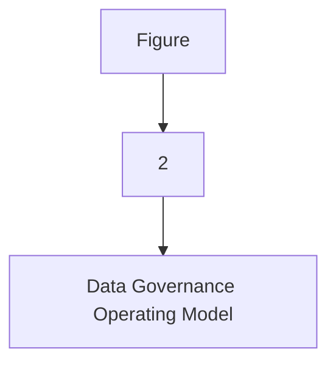

| Data Security and Protection |
| --- |

| Version # : | 1 .0 |
| --- | --- |
| Issue / Effective D ate: |  |
| Date of Next Review |  |

| Document Categorization | **Strategic**<br>
- Transactional<br>
- Procedural<br>
- Not applicable |
| --- | --- |

| Prepared by: |  |  |  |
| --- | --- | --- | --- |
| Position / Title | Name | Date | Signature |
|  | Shiraz Aslam |  |  |

| Reviewed by : |  |  |  |
| --- | --- | --- | --- |
| Position / Title | Name | Date | Signature |

| Approved by: |  |  |  |
| --- | --- | --- | --- |
| Position / Title | Name | Date | Signature |
| Head of Data Management | Zeeshan Khan |  |  |
| Chief Operating Officer | Thamer Yousef |  |  |

| Rev. No. | Revision Date | Revised By | Approved By | Brief Description of Changes |
| --- | --- | --- | --- | --- |
|  | New Document |  |  |  |

| Term | Description |
| --- | --- |
| BI | Business Intelligence |
| BI&A | Business Intelligence and Analytics |
| BOD | Board of Directors |
| BRD | Business Requirement Document |
| [client] |  |
| BU | Business Unit |
| CCO | Chief Compliance Officer |
| CFO | Chief Financial Officer |
| CISD | Corporate Information Security Department |
| CMMI | Capability Maturity Model Integration |
| CO | Control Objectives for Information and Related Technologies |
| COO | Chief Operating Officer |
| CPG | Compliance Group |
| CRO | Chief Risk Officer |
| CTO | Chief Technology Officer |
| DB | Database |
| DBMS | Database Management System |
| DG | Data Governance |
| DMS | Document Management System |
| DVR | Data Value Realization |
| DWH | Data Warehouse |
| ECMS | Enterprise Content Management System |
| EDA | Enterprise Data Architecture |
| data management | Data Management |
| ERD | Entity Relationship Diagram |
| EUC | End-User Computations |
| FOI | Freedom of Information |
| GRM | Governance and Regulatory Management |
| HR G | Human Resources Group |
| ISG | Information Systems Group |
| IT | Information Technology |
| ITPC | IT Portfolio Committee |
| KPI | Key Performance Indicators |
| MDM | Master Data Management |
| NCA | National Cybersecurity Authority |
| NDMO | National Data Management Office |
| PDPL | Personal Data Protection Law |
| PMO | Project Management Office |
| PMS | Project Management System |
| PII | Personally Identifiable Information |
| PPU | Policy and Procedure Unit |
| PPC | Policy and Procedure Committee |
| RACI | Responsible, Accountable, Consulted, and Informed |
| RCA | Root Cause Assessment |
| ROI | Return on Investment |
| RPA | Reporting Process Assessment |
| RMG | Risk Management Group |
| SAMA | Saudi Arabian Monetary Authority |
| SLA | Service Level Agreements |
| SME | Subject Matter Expert |
| VAT | Value-Added Tax |

| Term | Explanation |
| --- | --- |
| Artifact | A tangible outcome of any process. May refer to documents like data dictionary , business glossary, systems architecture documents etc. |
| Business Glossary | A list of business terms with their definitions |
| Business Intelligence | A technology-driven process for analyzing data and presenting actionable information which helps executives, managers and other corporate end users make informed business decisions. |
| Business Intelligence and Analytics | Business Intelligence and Analytics focuses on analyzing organization's data records to extract insight and to draw conclusions about the information uncovered. |
| Data | A collection of facts in a raw or unorganized form such as numbers, characters, images, video, voice recordings, or symbols |
| Data-related Activity | Any activity that deals with data creation, data storage, data consumption, data sharing, data archival, data management or data destruction |
| Data Architecture | Data architecture is composed of models, policies, rules or standards that govern which data is collected, and how it is stored, arranged, integrated, and put to use in data systems and in organizations |
| Data Architecture and Modelling | Data Architecture and Modelling focuses on establishment of formal data structures and data flow channels to enable end to end data processing across and within entities. |
| Data Asset | Any critical data in an organization which is governed and managed as an asset |
| Data Catalog and Metadata | Data Catalog and Metadata focuses on enabling an effective access to high quality integrated metadata. The access to metadata is supported by use of the Data Catalog automated tool acting as the single point of reference to the organizations' metadata. |
| Data Classification | Data Classification involves the categorization of data so that it may be used and protected efficiently. Data Classification levels are assigned following an impact assessment determining the potential damages caused by the mishandling of data or unauthorized access to data. |
| Data Dictionary | A centralized repository of information about data such as meaning, relationships to other data, origin, usage, and format |
| Data Governance | Data governance is the definition of organizational structures, data owners, policies, rules, processes, business terms, and metrics for the end-to-end lifecycle of data (collection, storage, use, protection, archiving, and deletion). |
| Data Governance Controls | The preventive measures established to ensure adequate governance over data (e.g ., change controls, sign-offs , data quality checks etc.) |
| Data Governance program | A data governance program is an overarching set of initiatives required for establishing and maintaining effective data governance in the organization |
| Data I nitiative s | Initiatives which impact how data is created, stored, processed, consumed or destroyed in the organization . These includes system implementations, integrations, automations, data governance or management initiatives etc. |
| Data Lineage | Data lineage is documentation or description of the path along which data flows from the point of its origin to the point of its use showing all the transformations which it undergo es along this path. |
| Data Management | Data Management is a comprehensive collection of practices, concepts, procedures, processes, and accompanying systems that allow for an organization to gain control of its data resources. |
| Data Operations | The Data Operations domain focuses on the design, implementation, and support for data storage to maximize data value throughout its lifecycle from creation/acquisition to disposal. |
| Data Quality | Data Quality measures how fit the data is for its intended use with respect to its accuracy, completeness, integrity, timeliness, conformity and consistency. |
| Data Security and Protection | Data Security and Protection focuses on the processes, people, and technology designed to protect the entity’s data, including, but not limited to authorized access to data, avoidance of spoliation, and safeguarding against unauthorized disclosure of data. This domain is under the mandate of the Saudi National Cybersecurity Authority. |
| Data Sharing and Interoperability | Data Sharing and Interoperability involves the collection of data from different sources and consists of integration solutions fostering a harmonious internal and external communication between various IT components. Data Sharing and Interoperability also covers a Data Sharing process that enable an organized and standardized exchange of data between entities. |
| Data Value Realization | Data Value Realization involves the continuous evaluation of data assets for potential data driven use cases that generate revenue or reduce operating costs for the organization. |
| Data Warehouse | A system to store data from disparate sources, which can be used to create reports and data extracts that, may be used for further data analysis. |
| Document and Content Management | Document and Content Management involves controlling the capture, storage, access, and use of documents and content stored outside of relational databases. |
| Data Management | In the context of this policy, ‘ Data Management ’ (“ data management ”) refers to the Data Management department within [client] . |
| Freedom of Information | Freedom of Information domain focuses on providing Saudi citizens access to government information, portraying the process for accessing such information, and the appeal mechanism in the event of a dispute. |
| Master Data | Information that is shared universally across the organization , regardless of the process, function, conversation, or interaction |
| Metadata | Metadata is ‘structured information that describes, explains, locates, or otherwise makes it easier to retrieve, use, or manage an information resource’. Metadata provides valuable context and meaning to data which dramatically increases the usability of the data. |
| Open Data | Open Data focuses on the organization’s data which could be made available for public consumption to enhance transparency, accelerate innovation, and foster economic growth |
| Personal Data Protection | Personal Data Protection focuses on protection of a subject’s entitlement to the proper handling and non-disclosure of their personal information. |
| Reference Data | Reference data are sets of values or classification schemas that are referred by systems, applications, data stores, processes, and reports, as well as by transactional and master records. |
| Reference and Master Data Management | Reference and Master Data Management allow to link all critical data to a single master file, providing a common point of reference for all critical data. |

# Policy
## Purpose

The  Policy (' 'the policy') sets out the guidelines, framework, and key roles and responsibilities concerning the management of data in  ('' or 'the '). Through this policy, the  will:

- Establish robust data management and ensure effective oversight, monitoring, and management of data assets.

- Ensure comprehensive controls are in place to ensure data cataloguing, data sharing data quality, accuracy, availability, integrity, and completeness.

- Promote data management awareness amongst the 's employees; and

- Leverage existing data assets to derive business value.

This policy applies to all Business Units (BU), support functions, vendors/ third parties (undertaking any data-related activities for the ), employees (insourced, outsourced & contractual), members of the Board and its committees, and management committees.
() owns this policy, and it is subject to be reviewed every two (2) years or when deemed necessary. This policy will be reviewed and approved as per the standard  protocols applicable for other enterprise level policies.
This  Policy set out the overall Data Management Framework of . In case the provision of any other policy conflict with or are inconsistent with this policy, the provision of this Policy will prevail. If there are questions regarding the interpretation of applicable sections of this policy, the matter should be raised immediately to  for clarifications.

The roles & responsibilities for the approval and implementation of this policy are listed below:
Governance

| Responsibility | Function |
| --- | --- |
| Approval and oversight | Board of Directors |
| Oversight, enforcement & recommendation to BOD | Data Governance and Management Leadership Team (COO, CRO & CFO ) |
| Document owner and implementations | data management |
| Periodic review of policy | data management |
Policy Governance Support

| Responsibility | Function |
| --- | --- |
| Policy custodian | Policies and Procedures Unit |
| Content issuance/ review | Head data management |
| Periodic audit review | Internal Audit |
This policy will be distributed to all  employees. All  employees are responsible for familiarizing themselves and ensuring compliance with the Policy requirements.
Update and maintenance of the document
1. The standards laid down by the Board through this document may be subject to changes, as deemed appropriate by the Board to ensure appropriate oversight and control over the ’s affairs. Such changes may be required due to one or more of the following reasons:
a) Changes in applicable laws, regulatory requirements / standards and specific instructions from governmental, legal and regulatory authorities
b) Changes in governance and organizational structures including institution of new committees or changes in the existing committees, changes in terms of references of groups / divisions and changes in the roles and responsibilities of relevant stakeholders
c) Inclusion of new data processes in the
d) New data management and application roles that are not envisioned or included in this document
e) Changes in data governance roles, responsibilities, or accountability matrix (as per the data governance handbook)
f) Any other change as deemed necessary by the Board
2. A formal 'Amendment Request Form' describing the proposed revision/ amendment shall be prepared by the person requesting changes (or 'requestor'). The amendment request inclusion and approval process will be as follows:
a) The requestor will complete the amendment request form, detailing the justification for changes to the policy document.
b) The amendment request form must be submitted to the Senior Manager, Data Governance and subsequently to the DG Management and Leadership Team for review and approval.
c) After approval is obtained from the DG Council, the amendment request form has to be submitted by PPU to the PPC members for their level of approval.
3. The Management of the  shall also have the right to propose amendments to the policy based on evolving circumstances and business needs. The Board, at its sole discretion shall have the authority to accept or reject such proposed changes and authorize amendment of the policy accordingly, if required.
a) will be responsible to carry out the required changes as directed by the Board and present the revised / updated policy to the Board for formal approval of the revised version.
b) Once the Board has approved an updated version of the policy,  will coordinate with PPU and PPU shall take the necessary steps to immediately inform the primary recipients of the changes / amendments, through an internal memorandum. Such revisions may also be communicated via email. The updated policy shall then be circulated, following the same circulation process as defined in the “Ownership, Custody and Circulation” section of this policy.
c) In the event of changes in the policy, the primary recipients shall be responsible to assess if the changes in this policy warrant a change in relevant policies and procedures, and if required, necessary updates to the policies and procedures will be made to ensure alignment with the revised Enterprise Data Governance Policy.

This policy adheres to the guidelines and the principles stipulated in:
- National Data Governance Interim Regulations
- National Data Management Office Handbook
- Data Management and Personal Data Protection Standards
The  will also adhere to all other applicable laws and regulations around data governance and data management as and when will be issued by the SAMA, NDMO and other regulators, relevant to the 's operations.
Compliance to applicable laws and regulations shall be provided by the Compliance Group and Internal Audit Department of the .
This policy is for the internal use of , and all employees must ensure its confidentiality at all times. No content of this policy shall be reproduced or transmitted in any form by any means without the written permission of a competent authority.

The Policy is effective from the date of its approval by the Board of Directors

**[Diagram — PNG]:**

**KSA Data Management and Personal Data Protection Framework**

1. **Data Governance**

**Data Assetization**

- 2: Data Catalog and Metadata
- 3: Data Quality
- 4: Data Operations
- 5: Document and Content Management
- 6: Data Architecture and Modeling
- 7: Reference and Master Data Management

**Data Usage**

- 8: Business Intelligence and Analytics
- 9: Data Sharing and Interoperability
- 10: Data Value Realization
- 11: Open Data

**Data Classification and Availability**

- 12: Freedom of Information
- 13: Data Classification

**Data Protection**

- 14: Personal Data Protection
- 15: Data Security and Protection (covered by NCA)

**[Diagram — PNG]:**

- **Board of Directors**
  - MD
    - COO
      - Head EDM
        - BO
          - BI and Analytics
        - DWH
          - ETL
          - DW & Architecture
            - Data Sharing and Interoperability
        - Data Governance
          - Data Governance, Metadata and Data Catalogue, Data Quality, Reference and Master Data Management, Data Architecture & Modelling, Data Value Realization, Open Data, Freedom of Information
        - TOD
          - Data Operations
        - ETD
          - Document and Content Management
        - CISD
          - Data Classification, Data Security and Protection
        - Risk
          - Personal Data Protection
  - MIS Council
  - DG Council

- **NDMO Domains**

**[Flowchart — Word Shapes]:**

1. Figure
2. 2
3. – Data Governance Operating Model

**[Flowchart — Structured]:**

```markdown
## Step Table

| Step Number | Description                           | Decision (Yes/No) |
|-------------|---------------------------------------|-------------------|
| 1           | Figure                                | No                |
| 2           | 2                                     | No                |
| 3           | Data Governance Operating Model       | No                |

## Mermaid Diagram


```

| IT* includes Technology Operation Division, Governance & Control, Delivery Transformation Division, Core Organization ing Division and Enterprise Data Management & Governance Division IT* includes Technology Operation Division, Governance & Control, Delivery Transformation Division, Core Organization ing Division and Enterprise Data Management & Governance Division |  |
| --- | --- |

The data security and security policy has been developed for , in compliance with relevant Data Management and Personal Data Protection Standards and Interim Regulation issued by the National Data Management Office (NDMO).
Compliance to the Data Security and Protection controls will be conducted by NCA, as per their requirements and methodology, and not as part of NDMO’s annual Data Management and Personal Data Protection compliance assessment.
Note: The National Cybersecurity Authority (NCA) is the government entity in charge of cybersecurity in Saudi Arabia. NCA serves as the national authority on this topic, both from a regulatory and operational perspective. Hence, the controls and corresponding specifications for the Data Security and Protection Domain will be detailed and addressed by NCA.

The below statements of policy are defined as the foundation of  view on data protection and security. These statements should guide all actions in creating, maintaining, and using data quality standards across the . These statements are:

- The Data Security and Protection policy should be read in conjunction with Cybersecurity Operation and Technology policy, National Cybersecurity Authority (NCA) Policy and Critical Systems Cybersecurity Controls.

- shall meet its needs for data protection by establishing a plan to employ necessary tools, personnel and business processes to ensure adequate security to implement information security governance.

- must establish a tested and defined information security architecture which includes fundamental concepts and properties that enable the purpose, context and guidance for making security design decisions.

- must ensure that the minimum-security provisions are included as components during the development, testing and implementation stages of all of its information systems.

- The identity and access management policy, including the responsibilities and accountabilities, should be defined, approved and implemented. The compliance with the Identity and Access Management policy should be monitored.

- shall ensure identification and documentation of users and information systems that request access to ’s information assets.

- ’s engagement with third parties must reflect obligations to ensure Information Security requirements are met.

- A comprehensive Information Security training program designed to introduce employees’ to ’s security expectations and obligations must be implemented.

- shall ensure a documented and maintained inventory of information assets containing information about ’s critical data and information systems.

- and its employees must adhere to operational duties to monitor, assess, and protect ’s information assets.

- The establishment of operational processes must be ensured by  for detecting, managing, recording and analyzing potential security threats and breaches that are outcomes from monitoring its operations.

- shall establish identification, review, response and corrective actions to mitigate or prevent risks for occurrence, consequences, impact and exposure.

- shall develop a framework for preserving and maintaining the confidentiality, integrity and availability of data in the event of an incident.

- Collaboration: Data Security is a collaborative effort involving IT security administrators, data stewards/data governance, internal and external audit teams, and the legal department.

- Enterprise approach: Data Security standards and policies must be applied consistently across the entire organization.

- Proactive management: Success in data security and protection management depends on being proactive and dynamic, engaging all stakeholders, managing change, and overcoming organizational or cultural bottlenecks such as traditional separation of responsibilities between information security, information technology, data administration, and business stakeholders.

- Clear accountability: Roles and responsibilities must be clearly defined, including the ‘chain of custody’ for data across organizations and roles.

- Metadata-driven: Security classification for data elements is an essential part of data definitions.

- Reduce risk by reducing exposure: Minimize sensitive/confidential data proliferation, especially to non-production environments.

The following roles and responsibilities are applicable to this policy:

- Enterprise Architecture Board: EAB is accountable for authorization of information security architecture plan

- Data Management and Governance Leadership Team: The executive body of  data management & governance is responsible for signing off on any changes, exemption, and exceptions to this policy.

- Chief Information Security Officer (CISO): CISO is responsible for the authorization of information security architecture plan.

- Data Governance Council: The strategic body of  data management & governance, support on authorizing Information Security Governance Plan, drafting inventory of all identified information systems and support conducting training and awareness session on data security and protection.

- Data Governance officer: An experienced business domain representative responsible for managing all data management & governance initiatives and changes. The data governance officer overlooks and manages the information security and information system operational activities, provides support on training and awareness, data security and protection processes, identification and reduction of potential security threats.

- Head of : Head of  responsible for managing all data management & governance initiatives and changes. The Head of  overlooks and manages the delivery of information security and information systems capabilities and maintains plans, timelines, budgets, ensuring that progress is made.

- Head of Enterprise Architecture: Head of EA is responsible for the authorization of information security architecture plan

- Compliance Officer: The Compliance Officer is responsible for monitoring compliance with information security and information systems governance policies and standards.

- CISD: CISD team is responsible for the overall approach and framework implementation of information security. Its responsibilities include, Authorizing Information Security Governance Plan and Information Security Architecture Plan, monitoring the design, development and testing of information systems, providing training and awareness on information security, drafting inventory of all identified information systems, and identifying and reducing potential security threats.

- Data Architecture: Data Architecture is responsible for authorizing Information Security Architecture Plan.

- BCP Team: BCP team is responsible for monitoring the design, development and testing of information systems and implementation and regular check on the working of Business Continuity Plan.

- Data Owner: The Data Owner is responsible for providing domain-specific executive-level support in information security and information systems capabilities, communicating the reports of the exercises across the business domain, supporting on training and awareness programs and monitoring identity and access management operations.

| Main Activities | The Board | EAB | DG Leadership Team | CISO | Head of EA | Head of data management | DG Council | Data Privacy Officer | Data Governance Officer | CISD | Compliance Officer | Data Owner | Data Architecture | BCP Team |
| --- | --- | --- | --- | --- | --- | --- | --- | --- | --- | --- | --- | --- | --- | --- |
| Authorizing Information Security Governance Plan |  | I |  | I | C | I | A, R |  | C |  | C |  |  |  |
| Authorizing Information Security Architecture Plan |  | A |  | R | I |  | C | R |  |  |  |  |  |  |
| Monitoring the design, development and testing of information systems |  | I |  | I | A, R |  | I |  | R |  |  |  |  |  |
| Identity and Access management operations |  | I |  | C | A, R |  | I |  |  |  |  |  |  |  |
| Training and awareness on information security |  | C | I |  | C | A, R |  | I |  |  |  |  |  |  |
| Inventory of Information systems |  | I |  | C |  | C | A, R |  | C |  |  |  |  |  |
| Processes for reducing potential security threats |  | I | C | A, R | I | C |  |  |  |  |  |  |  |  |
| Implement and check Business Continuity Plan |  | I |  | C |  | C | I | C |  | A, R |  |  |  |  |