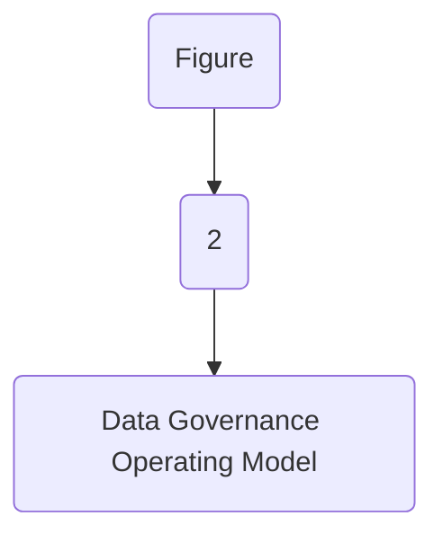
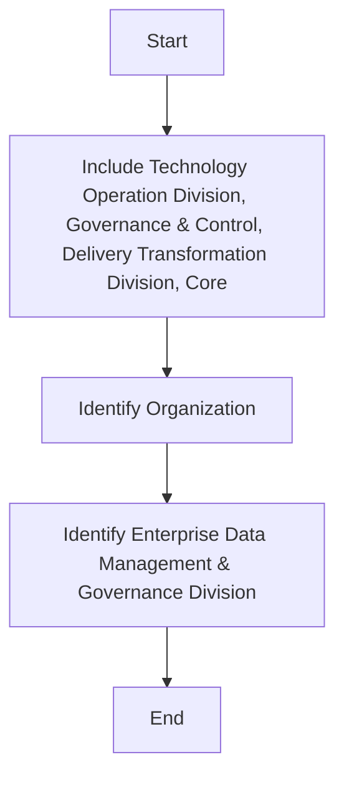

| Personal Data Protection Standards |
| --- |

| Version # : | 1 .0 |
| --- | --- |
| Issue / Effective D ate: |  |
| Date of Next Review |  |

| Document Categorization |  |
| --- | --- |

| Prepared by: |  |  |  |
| --- | --- | --- | --- |
| Position / Title | Name | Date | Signature |

| Reviewed by : |  |  |  |
| --- | --- | --- | --- |
| Position / Title | Name | Date | Signature |

| Approved by: |  |  |  |
| --- | --- | --- | --- |
| Position / Title | Name | Date | Signature |

| Rev. No. | Revision Date | Revised By | Approved By | Brief Description of Changes |
| --- | --- | --- | --- | --- |
|  | New Document |  |  |  |

| Term | Description |
| --- | --- |
| BI | Business Intelligence |
| BI&A | Business Intelligence and Analytics |
| BOD | Board of Directors |
| BRD | Business Requirement Document |
| [client] |  |
| BU | Business Unit |
| CMMI | Capability Maturity Model Integration |
| CO | Control Objectives for Information and Related Technologies |
| COO | Chief Operating Officer |
| DB | Database |
| DBMS | Database Management System |
| DG | Data Governance |
| DMS | Document Management System |
| DVR | Data Value Realization |
| DWH | Data Warehouse |
| ECMS | Enterprise Content Management System |
| EDA | Enterprise Data Architecture |
| DM | Data Management |
| ERD | Entity Relationship Diagram |
| EUC | End-User Computations |
| FOI | Freedom of Information |
| GRM | Governance and Regulatory Management |
| HRG | Human Resources Group |
| ISG | Information Systems Group |
| IT | Information Technology |
| ITPC | IT Portfolio Committee |
| KPI | Key Performance Indicators |
| MDM | Master Data Management |
| NCA | National Cybersecurity Authority |
| NDMO | National Data Management Office |
| PDPL | Personal Data Protection Law |
| PII | Personally Identifiable Information |
| RACI | Responsible, Accountable, Consulted, and Informed |
| RCA | Root Cause Assessment |
| ROI | Return on Investment |
| RPA | Reporting Process Assessment |
| RMG | Risk Management Group |
| SAMA | Saudi Arabian Monetary Authority |
| SLA | Service Level Agreements |
| SME | Subject Matter Expert |
| VAT | Value-Added Tax |

| Term | Explanation |
| --- | --- |
| Artifact | A tangible outcome of any process. May refer to documents like data dictionary, business glossary, systems architecture documents etc. |
| Business Glossary | A list of business terms with their definitions |
| Business Intelligence | A technology-driven process for analyzing data and presenting actionable information which helps executives, managers and other corporate end users make informed business decisions. |
| Business Intelligence and Analytics | Business Intelligence and Analytics focuses on analyzing organization 's data records to extract insight and to draw conclusions about the information uncovered. |
| Data | A collection of facts in a raw or unorganized form such as numbers, characters, images, video, voice recordings, or symbols |
| Data-related Activity | Any activity that deals with data creation, data storage, data consumption, data sharing, data archival, data management or data destruction |
| Data Architecture | Data architecture is composed of models, policies, rules or standards that govern which data is collected, and how it is stored, arranged, integrated, and put to use in data systems and in organization s |
| Data Architecture and Modelling | Data Architecture and Modelling focuses on establishment of formal data structures and data flow channels to enable end to end data processing across and within entities. |
| Data Asset | Any critical data in an organization which is governed and managed as an asset |
| Data Catalog and Metadata | Data Catalog and Metadata focuses on enabling an effective access to high quality integrated metadata. The access to metadata is supported by use of the Data Catalog automated tool acting as the single point of reference to the organization s' metadata. |
| Data Classification | Data Classification involves the categorization of data so that it may be used and protected efficiently. Data Classification levels are assigned following an impact assessment determining the potential damages caused by the mishandling of data or unauthorized access to data. |
| Data Dictionary | A centralized repository of information about data such as meaning, relationships to other data, origin, usage, and format |
| Data Governance | Data governance is the definition of organization al structures, data owners, policies, rules, processes, business terms, and metrics for the end-to-end lifecycle of data (collection, storage, use, protection, archiving, and deletion). |
| Data Governance Controls | The preventive measures established to ensure adequate governance over data (e.g., change controls, sign-offs, data quality checks etc.) |
| Data Governance program | A data governance program is an overarching set of initiatives required for establishing and maintaining effective data governance in the organization |
| Data Initiatives | Initiatives which impact how data is created, stored, processed, consumed or destroyed in the organization . These includes system implementations, integrations, automations, data governance or management initiatives etc. |
| Data Lineage | Data lineage is documentation or description of the path along which data flows from the point of its origin to the point of its use showing all the transformations which it undergoes along this path. |
| Data Management | Data Management is a comprehensive collection of practices, concepts, procedures, processes, and accompanying systems that allow for an organization to gain control of its data resources. |
| Data Operations | The Data Operations domain focuses on the design, implementation, and support for data storage to maximize data value throughout its lifecycle from creation/acquisition to disposal. |
| Data Quality | Data Quality measures how fit the data is for its intended use with respect to its accuracy, completeness, integrity, timeliness, conformity and consistency. |
| Data Security and Protection | Data Security and Protection focuses on the processes, people, and technology designed to protect the entity’s data, including, but not limited to authorized access to data, avoidance of spoliation, and safeguarding against unauthorized disclosure of data. This domain is under the mandate of the Saudi National Cybersecurity Authority. |
| Data Sharing and Interoperability | Data Sharing and Interoperability involves the collection of data from different sources and consists of integration solutions fostering a harmonious internal and external communication between various IT components. Data Sharing and Interoperability also covers a Data Sharing process that enable an organized and standardized exchange of data between entities. |
| Data Value Realization | Data Value Realization involves the continuous evaluation of data assets for potential data driven use cases that generate revenue or reduce operating costs for the organization . |
| Data Warehouse | A system to store data from disparate sources, which can be used to create reports and data extracts that, may be used for further data analysis. |
| Document and Content Management | Document and Content Management involves controlling the capture, storage, access, and use of documents and content stored outside of relational databases. |
| Data Management | In the context of this policy, ‘ Data Management ’ (“ data management ”) refers to the Data Management department within [client] . |
| Freedom of Information | Freedom of Information domain focuses on providing Saudi citizens access to government information, portraying the process for accessing such information, and the appeal mechanism in the event of a dispute. |
| Master Data | Information that is shared universally across the organization , regardless of the process, function, conversation, or interaction |
| Metadata | Metadata is ‘structured information that describes, explains, locates, or otherwise makes it easier to retrieve, use, or manage an information resource’. Metadata provides valuable context and meaning to data which dramatically increases the usability of the data. |
| Open Data | Open Data focuses on the organization ’s data which could be made available for public consumption to enhance transparency, accelerate innovation, and foster economic growth |
| Personal Data Protection | Personal Data Protection focuses on protection of a subject’s entitlement to the proper handling and non-disclosure of their personal information. |
| Reference Data | Reference data are sets of values or classification schemas that are referred by systems, applications, data stores, processes, and reports, as well as by transactional and master records. |
| Reference and Master Data Management | Reference and Master Data Management allow to link all critical data to a single master file, providing a common point of reference for all critical data. |

| Responsibility | Function |
| --- | --- |
| Approval and oversight |  |
| Oversight, enforcement & recommendation to BOD |  |
| Document owner and implementations |  |
| Periodic review of policy |  |

| Responsibility | Function |
| --- | --- |
| Policy custodian |  |
| Content issuance/ review |  |
| Periodic audit review |  |

|  | organization |
| --- | --- |
|  | organization |
|  | organization |
|  | organization |
|  | organization |
|  | organization |
|  | organization |
|  | organization |

**[Diagram — PNG]:**

**KSA Data Management and Personal Data Protection Framework**

1. **Data Governance**

   **Data Assetization**
   - 2: Data Catalog and Metadata
   - 3: Data Quality
   - 4: Data Operations
   - 5: Document and Content Mgmt.
   - 6: Data Architecture and Modeling
   - 7: Reference and Master Data Mgmt.

   **Data Usage**
   - 8: Business Intelligence and Analytics
   - 9: Data Sharing and Interoperability
   - 10: Data Value Realization
   - 11: Open Data

2. **Data Classification and Availability**
   - 12: Freedom of Information
   - 13: Data Classification

3. **Data Protection**
   - 14: Personal Data Protection
   - 15: Data Security and Protection (covered by NCA)

**[Diagram — PNG]:**

- **Board of Directors**

  - MD
    - COO
      - Head EDM

        - MIS Council
          - BO
            - BI and Analytics

        - DWH
          - ETL
          - DW & Architecture
            - Data Sharing and Interoperability

        - Data Governance
          - Data Governance, Metadata and Data Catalogue, Data Quality, Reference and Master Data Management, Data Architecture & Modelling, Data Value Realization, Open Data, Freedom of Information

        - DG Council
        
        - NDMO Domains
          - TOD
            - Data Operations
          - ETD
            - Document and Content Management
          - CISD
            - Data Classification, Data Security and Protection
          - Risk
            - Personal Data Protection

**[Flowchart — Word Shapes]:**

1. Figure
2. 2
3. – Data Governance Operating Model

**[Flowchart — Structured]:**

```markdown
### Step Table

| Step | Description                             | Decision Required |
|------|-----------------------------------------|-------------------|
| 1    | Figure                                  | No                |
| 2    | 2                                       | No                |
| 3    | Data Governance Operating Model         | No                |

### Mermaid Diagram


```

The Data Protection Policy applies to  and its branches (collectively “”). In the event the branches are subject to more onerous regulatory requirements in their respective jurisdictions, such requirements in other jurisdictions shall apply to those branches (as the case may be).
The policy addresses the following specific issues:
Personal Data, whether in electronic or physical form relating to , its customers, stakeholders, employees, and other interested parties must be protected with confidentiality and in accordance with legal and regulatory requirements including applicable data protection laws.
All personnel employed or contracted by  are responsible for ensuring all compliance with this policy and need to implement appropriate practices, processes, controls, and training to ensure such compliance.
For the avoidance of doubt, while certain sections apply specifically to the protection of Personal Data, the general provisions with respect to the protection of data apply to Personal Data as well.

The statements below of policy have been defined as the foundation of ’s view on Personal Data Protection. These statements are:

- Create an assessment to evaluate the current state of the Personal Data Protection environment.

- Establish a plan to address both the strategic and operational privacy requirements of the NDMO’s Personal Data Protection Regulations.

- Assign the required resources and budget to achieve and maintain the ’s compliance with the NDMO’s Personal Data Protection Regulations.

- Conduct required training for every employee to promote a Personal Data Protection-centric culture in accordance with the -specific and national privacy regulations.

- Notify the Regulatory Authority about the personal data breach within the allotted timeframe (i.e., within 72 hours) specified within the NDMO’s Personal Data Protection Regulations.

- Establish a process to directly manage and address the privacy violations and to set the functions and responsibilities for the affected work team.

- Establish a data life cycle management process for providing Data Subjects with notice and requesting consent at all points where personal data is collected as prescribed by NDMO's Personal Data Protection Regulations.

- Establish a Data Rights Management processes to support the rights of Data Subjects, in accordance with the NDMO's Personal Data Protection Regulations.

- Conduct an automated or manual yearly risk assessments containing the collection of personal data and the storing and transmittal of personal data by each system.

- Ensure to conduct internal audits to monitor compliance with NDMO’s Personal Data Protection regulations and document its findings in a report submitted to the Privacy Officer and take necessary action for non-compliance.

- Document the compliance records in a register for a reasonable period (not less than 24 months) and make those records available when requested by the National Data Management Office as defined in the NDMO’s Personal Data Protection Regulations.

adheres to the following Key principles relating to the Processing of Personal Data.
Personal Data must be:
1. Legality, Fairness, and Transparency – Personal data should be processed fairly, transparently, and lawfully. An individual’s personal data should not be processed unless there are lawful grounds for doing so and the individual should be informed as to how and why their personal data is being processed either upon or before collecting it.
2. Data Minimization and Purpose Limitation – Data collected should be limited to minimum data necessary for the purpose of collection only. Personal data should also be processed only for the purpose initially collected. Any further processing should require customer consent unless there is a legal basis such as fulfilling a regulatory request.
3. Accuracy – Personal data should be accurate and, where appropriate, kept up to date. Incorrect data should be rectified as soon as possible. s are advised to develop ongoing processes for data update and making channels available for customers to update their data (e.g., face to face and online).
4. Data Retention – Data should not be kept longer than is necessary for the purpose for which it was collected while taking into consideration regulatory record retention requirements.
5. Rights of Data Subjects – s should implement appropriate processes to ensure timely response to data subject rights’ requests as applicable. Data subjects are the individuals to whom the personal data belongs; these include customers, employees, Board members, and third parties.
6. Security - Personal data should be protected against unauthorized or unlawful processing, accidental loss, destruction, or damage through appropriate technical and al measures.
7. International Data Transfers – When transferring data to a territory outside the ’s country, effective due diligence and controls should be in place to ensure an adequate level of protection.
8. Accountability – Accountability is the ability to demonstrate compliance with all the above principles and is required under the KSA's Personal Data Protection Law (PDPL) and other data protection regulations worldwide. Accountability mechanisms include policies, procedures, guidelines, checklists, training and awareness activities, transparency measures, technical safeguards, and other mechanisms that mitigate internal and external privacy and data protection risks

The following roles and responsibilities are applicable to this policy:

- Data Management and Governance Leadership Team / Compliance Team: The executive body of  data management & governance is responsible for signing off on any changes, exemption, and exceptions to this policy.

- Data Privacy Officer: An experienced privacy professional plays a key role in Personal Data Protection policy implementation during all phases (planning, processing, security, control, report and respond).

- Data Privacy Compliance Officer: The data privacy compliance office supports during the implementation of all the phases (planning, processing, security, control, report and respond) of Personal Data Protection policy. Data privacy compliance officer is accountable for monitoring compliance of the policy.

- CISD: CISD team is accountable and responsible for all the security related activities from conducting information security risk assessment till notification of personal data breach of the policy. Also consulted during the other activities of the policy.

- Legal: Legal team is consulted for all phases (planning, processing, security, control, report and respond) during the implementation of PDP policy.

- Data Owner: Data Owner is consulted during the planning of the implementation. Data Owner is majorly responsible for managing all the data requests during the processing and respond to data requests.

- Privacy Champion: Privacy Champion is responsible and accountable for the major activities during the implementation of all the phases (planning, processing, security, control, report and respond) of Personal Data Protection policy in their respective unit or department.

- IT: IT team is accountable for managing all the data requests during the processing and is responsible for conducting data protection impact and information security risk assessment, Implementation of technical and al measures for ensuring the security of the processing, information security incident management.

| Main Activities | The Board | DP Leadership Team/ Compliance Committee | Data Privacy Officer | Data Privacy Compliance Officer | CISD | Legal | Data Owner | Privacy Champion | IT* |
| --- | --- | --- | --- | --- | --- | --- | --- | --- | --- |
| Planning |  |  |  |  |  |  |  |  |  |
| Regular review and update of the list of PDPL requirements |  | I | A, R | S | I | C | I |  |  |
| Develop Review Data Privacy Policy and Plan |  | C | A | S | I | C | I | R | I |
| Define the legal basis, purposes, list of personal data for processing and records the retention period |  | I | R | I | R | C | A | I |  |
| Prepare templates (Consents, Notices, DPIA Reports, Requests and Responds) |  | I | A, R | S | C | I |  |  |  |
| Conduct data protection impact assessments (DPIA) |  | I | R | I | C | A | R |  |  |
| Review & Update Data Processor, Third Party processing agreements |  | I | A, R | S | I | C | I |  |  |
| Prepare and conduct data protection awareness training |  | I | R | S | I | C | I | A | I |
| Processing |  |  |  |  |  |  |  |  |  |
| Collect consents from the data subjects |  | R | I | C | A, R | I |  |  |  |
| Notify the data subjects about the processing |  | I | R | I | C | A, R | I |  |  |
| Rectification of inaccurate data on request |  | I | C, I |  | R | A |  |  |  |
| Erase/ Restrict processing on request |  | C, I | C |  | R | A |  |  |  |
| Preparing data for porting on request |  | C, I | C |  | R | A |  |  |  |
| Consultation of the data subjects |  | A, R | I | C | R |  |  |  |  |
| Regularly update Records of processing activities |  | I | R | C |  | C | R | A |  |
| Security |  |  |  |  |  |  |  |  |  |
| Conduct information security risk assessment |  | I | A, R |  | I | R |  |  |  |
| Review Information Security Policy |  | A | C | I | R | C | I |  |  |
| Implement technical and organization al measures for ensuring the security of the processing |  | I | C, I | I | A, R |  | I | R |  |
| Information Security incident management |  | I | C, I | I | A, R |  | I | R |  |
| Notification of personal data breach |  | I | A | S | R | C | R | I |  |
| Control, Report and Respond |  |  |  |  |  |  |  |  |  |
| Report to the Senior management level |  | I | A | S | C | R | I |  |  |
| Communicate and cooperate with the supervisory authority |  | I | A, R | S | C | R | I |  |  |
| Monitor compliance |  | I | R | A | C | R | I |  |  |
| Respond to requests from the Data Subjects |  | I | A | S | C | R | C |  |  |

**[Flowchart — Word Shapes]:**

1. IT* includes Technology Operation Division, Governance & Control, Delivery Transformation Division, Core
2. Organization
3. ing Division and Enterprise Data Management & Governance Division

**[Flowchart — Structured]:**

```markdown
### Step Table

| Step | Description                                                                 |
|------|-----------------------------------------------------------------------------|
| 1    | Include Technology Operation Division, Governance & Control, Delivery Transformation Division, Core |
| 2    | Identify Organization                                                       |
| 3    | Identify Enterprise Data Management & Governance Division                   |

### Mermaid Diagram

