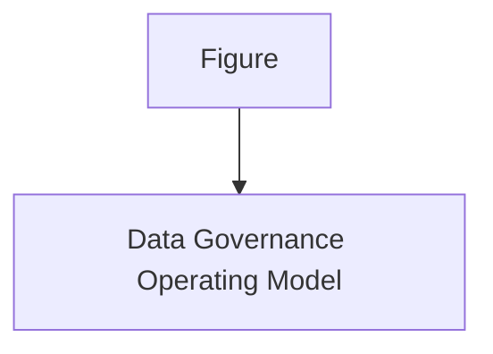
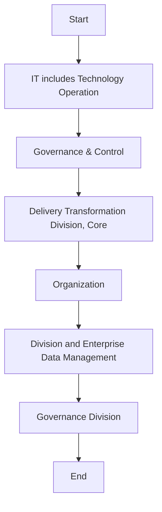

| Data Catalog & Metadata |
| --- |

| Version # : | 1 .0 |
| --- | --- |
| Issue / Effective D ate: |  |
| Date of Next Review |  |

| Document Categorization |  |
| --- | --- |

| Prepared by: |  |  |  |
| --- | --- | --- | --- |
| Position / Title | Name | Date | Signature |

| Reviewed by : |  |  |  |
| --- | --- | --- | --- |
| Position / Title | Name | Date | Signature |

| Approved by: |  |  |  |
| --- | --- | --- | --- |
| Position / Title | Name | Date | Signature |

| Rev. No. | Revision Date | Revised By | Approved By | Brief Description of Changes |
| --- | --- | --- | --- | --- |
|  | New Document |  |  |  |

| Term | Description |
| --- | --- |
| BI | Business Intelligence |
| BI&A | Business Intelligence and Analytics |
| BOD | Board of Directors |
| BRD | Business Requirement Document |
| [client] |  |
| BU | Business Unit |
| CMMI | Capability Maturity Model Integration |
| CO | Control Objectives for Information and Related Technologies |
| COO | Chief Operating Officer |
| DB | Database |
| DBMS | Database Management System |
| DG | Data Governance |
| DMS | Document Management System |
| DVR | Data Value Realization |
| DWH | Data Warehouse |
| ECMS | Enterprise Content Management System |
| EDA | Enterprise Data Architecture |
| DM | Data Management |
| ERD | Entity Relationship Diagram |
| EUC | End-User Computations |
| FOI | Freedom of Information |
| GRM | Governance and Regulatory Management |
| HR G | Human Resources Group |
| ISG | Information Systems Group |
| IT | Information Technology |
| ITPC | IT Portfolio Committee |
| KPI | Key Performance Indicators |
| MDM | Master Data Management |
| NCA | National Cybersecurity Authority |
| NDMO | National Data Management Office |
| PDPL | Personal Data Protection Law |
| PII | Personally Identifiable Information |
| RACI | Responsible, Accountable, Consulted, and Informed |
| RCA | Root Cause Assessment |
| ROI | Return on Investment |
| RPA | Reporting Process Assessment |
| RMG | Risk Management Group |
| SAMA | Saudi Arabian Monetary Authority |
| SLA | Service Level Agreements |
| SME | Subject Matter Expert |
| VAT | Value-Added Tax |

| Term | Explanation |
| --- | --- |
| Artifact | A tangible outcome of any process. May refer to documents like data dictionary , business glossary, systems architecture documents etc. |
| Business Glossary | A list of business terms with their definitions |
| Business Intelligence | A technology-driven process for analyzing data and presenting actionable information which helps executives, managers and other corporate end users make informed business decisions. |
| Business Intelligence and Analytics | Business Intelligence and Analytics focuses on analyzing organization's data records to extract insight and to draw conclusions about the information uncovered. |
| Data | A collection of facts in a raw or unorganized form such as numbers, characters, images, video, voice recordings, or symbols |
| Data-related Activity | Any activity that deals with data creation, data storage, data consumption, data sharing, data archival, data management or data destruction |
| Data Architecture | Data architecture is composed of models, policies, rules or standards that govern which data is collected, and how it is stored, arranged, integrated, and put to use in data systems and in organizations |
| Data Architecture and Modelling | Data Architecture and Modelling focuses on establishment of formal data structures and data flow channels to enable end to end data processing across and within entities. |
| Data Asset | Any critical data in an organization which is governed and managed as an asset |
| Data Catalog and Metadata | Data Catalog and Metadata focuses on enabling an effective access to high quality integrated metadata. The access to metadata is supported by use of the Data Catalog automated tool acting as the single point of reference to the organizations' metadata. |
| Data Classification | Data Classification involves the categorization of data so that it may be used and protected efficiently. Data Classification levels are assigned following an impact assessment determining the potential damages caused by the mishandling of data or unauthorized access to data. |
| Data Dictionary | A centralized repository of information about data such as meaning, relationships to other data, origin, usage, and format |
| Data Governance | Data governance is the definition of organizational structures, data owners, policies, rules, processes, business terms, and metrics for the end-to-end lifecycle of data (collection, storage, use, protection, archiving, and deletion). |
| Data Governance Controls | The preventive measures established to ensure adequate governance over data (e.g ., change controls, sign-offs , data quality checks etc.) |
| Data Governance program | A data governance program is an overarching set of initiatives required for establishing and maintaining effective data governance in the organization |
| Data I nitiative s | Initiatives which impact how data is created, stored, processed, consumed or destroyed in the organization . These includes system implementations, integrations, automations, data governance or management initiatives etc. |
| Data Lineage | Data lineage is documentation or description of the path along which data flows from the point of its origin to the point of its use showing all the transformations which it undergo es along this path. |
| Data Management | Data Management is a comprehensive collection of practices, concepts, procedures, processes, and accompanying systems that allow for an organization to gain control of its data resources. |
| Data Operations | The Data Operations domain focuses on the design, implementation, and support for data storage to maximize data value throughout its lifecycle from creation/acquisition to disposal. |
| Data Quality | Data Quality measures how fit the data is for its intended use with respect to its accuracy, completeness, integrity, timeliness, conformity and consistency. |
| Data Security and Protection | Data Security and Protection focuses on the processes, people, and technology designed to protect the entity’s data, including, but not limited to authorized access to data, avoidance of spoliation, and safeguarding against unauthorized disclosure of data. This domain is under the mandate of the Saudi National Cybersecurity Authority. |
| Data Sharing and Interoperability | Data Sharing and Interoperability involves the collection of data from different sources and consists of integration solutions fostering a harmonious internal and external communication between various IT components. Data Sharing and Interoperability also covers a Data Sharing process that enable an organized and standardized exchange of data between entities. |
| Data Value Realization | Data Value Realization involves the continuous evaluation of data assets for potential data driven use cases that generate revenue or reduce operating costs for the organization. |
| Data Warehouse | A system to store data from disparate sources, which can be used to create reports and data extracts that, may be used for further data analysis. |
| Document and Content Management | Document and Content Management involves controlling the capture, storage, access, and use of documents and content stored outside of relational databases. |
| Data Management | In the context of this policy, ‘ Data Management ’ (“ data management ”) refers to the Data Management department within [client] . |
| Freedom of Information | Freedom of Information domain focuses on providing Saudi citizens access to government information, portraying the process for accessing such information, and the appeal mechanism in the event of a dispute. |
| Master Data | Information that is shared universally across the organization , regardless of the process, function, conversation, or interaction |
| Metadata | Metadata is ‘structured information that describes, explains, locates, or otherwise makes it easier to retrieve, use, or manage an information resource’. Metadata provides valuable context and meaning to data which dramatically increases the usability of the data. |
| Open Data | Open Data focuses on the organization’s data which could be made available for public consumption to enhance transparency, accelerate innovation, and foster economic growth |
| Personal Data Protection | Personal Data Protection focuses on protection of a subject’s entitlement to the proper handling and non-disclosure of their personal information. |
| Reference Data | Reference data are sets of values or classification schemas that are referred by systems, applications, data stores, processes, and reports, as well as by transactional and master records. |
| Reference and Master Data Management | Reference and Master Data Management allow to link all critical data to a single master file, providing a common point of reference for all critical data. |

# Policy
## Purpose

The  Policy (' 'the policy') sets out the guidelines, framework, and key roles and responsibilities concerning the management of data in  ('' or 'the '). Through this policy, the  will:

- Establish robust data management and ensure effective oversight, monitoring, and management of data assets.

- Ensure comprehensive controls are in place to ensure data cataloguing, data sharing data quality, accuracy, availability, integrity, and completeness.

- Promote data management awareness amongst the 's employees; and

- Leverage existing data assets to derive business value.

This policy applies to all Business Units (BU), support functions, vendors/ third parties (undertaking any data-related activities for the ), employees (insourced, outsourced & contractual), members of the Board and its committees, and management committees.
() owns this policy, and it is subject to be reviewed every  years or when deemed necessary. This policy will be reviewed and approved as per the standard  protocols applicable for other enterprise level policies.
This  Policy set out the overall Data Management Framework of . In case the provision of any other policy conflict with or are inconsistent with this policy, the provision of this Policy will prevail. If there are questions regarding the interpretation of applicable sections of this policy, the matter should be raised immediately to  for clarifications.

The roles & responsibilities for the approval and implementation of this policy are listed below:
Governance

| Responsibility | Function |
| --- | --- |
| Approval and oversight |  |
| Oversight, enforcement & recommendation to BOD |  |
| Document owner and implementations |  |
| Periodic review of policy |  |
Policy Governance Support

| Responsibility | Function |
| --- | --- |
| Policy custodian |  |
| Content issuance/ review |  |
| Periodic audit review |  |
This policy will be distributed to all  employees. All  employees are responsible for familiarizing themselves and ensuring compliance with the Policy requirements.
Update and maintenance of the document
1. The standards laid down by the Board through this document may be subject to changes, as deemed appropriate by the Board to ensure appropriate oversight and control over the ’s affairs. Such changes may be required due to one or more of the following reasons:
a) Changes in applicable laws, regulatory requirements / standards and specific instructions from governmental, legal and regulatory authorities
b) Changes in governance and organizational structures including institution of new committees or changes in the existing committees, changes in terms of references of groups / divisions and changes in the roles and responsibilities of relevant stakeholders
c) Inclusion of new data processes in the
d) New data management and application roles that are not envisioned or included in this document
e) Changes in data governance roles, responsibilities, or accountability matrix (as per the data governance handbook)
f) Any other change as deemed necessary by the Board
2. A formal 'Amendment Request Form' describing the proposed revision/ amendment shall be prepared by the person requesting changes (or 'requestor'). The amendment request inclusion and approval process will be as follows:
a) The requestor will complete the amendment request form, detailing the justification for changes to the policy document.
b) The amendment request form must be submitted to the  and subsequently to the DG Management and Leadership Team for review and approval.
c) After approval is obtained from the , the amendment request form has to be submitted by  members for their level of approval.
3. The Management of the  shall also have the right to propose amendments to the policy based on evolving circumstances and business needs. The Board, at its sole discretion shall have the authority to accept or reject such proposed changes and authorize amendment of the policy accordingly, if required.
a) will be responsible to carry out the required changes as directed by the Board and present the revised / updated policy to the Board for formal approval of the revised version.
b) Once the Board has approved an updated version of the policy,  will coordinate with  shall take the necessary steps to immediately inform the primary recipients of the changes / amendments, through an internal memorandum. Such revisions may also be communicated via email. The updated policy shall then be circulated, following the same circulation process as defined in the “Ownership, Custody and Circulation” section of this policy.
c) In the event of changes in the policy, the primary recipients shall be responsible to assess if the changes in this policy warrant a change in relevant policies and procedures, and if required, necessary updates to the policies and procedures will be made to ensure alignment with the revised Data Governance Policy.

This policy adheres to the guidelines and the principles stipulated in:
- National Data Governance Interim Regulations
- National Data Management Office Handbook
- Data Management and Personal Data Protection Standards
The  will also adhere to all other applicable laws and regulations around data governance and data management as and when will be issued by the SAMA, NDMO and other regulators, relevant to the 's operations.
Compliance to applicable laws and regulations shall be provided by the Compliance Group and Internal Audit Department of the .
This policy is for the internal use of , and all employees must ensure its confidentiality at all times. No content of this policy shall be reproduced or transmitted in any form by any means without the written permission of a competent authority.

The Policy is effective from the date of its approval by the Board of Directors
Data Catalog is an organized inventory of data assets in the organization, which details information about systems, sources and locations of data and other key metadata. The data assets themselves reside in multiple systems across [client].
Metadata, data about data, includes information about technical and business processes, data rules and constraints, and logical and physical data structures. It describes the data itself (e.g., databases, data elements, data models), the concepts the data represents (e.g., business processes, application systems, software code, technology infrastructure), and the connections (relationships) between the data and concepts. Metadata provides the primary means of capturing and managing knowledge about the data.
The Data Catalog and Metadata policy has been developed for [client] in compliance with the standards and regulations issued by the National Data Management Office (NDMO) of the Kingdom of Saudi Arabia. The metadata management policy guides the implementation of specific supporting policy elements required to manage metadata and ensure capturing and sharing information about various data residing within [client] databases/data warehouse(s)/data mart(s) and platform(s).

**[Diagram — PNG]:**

KSA Data Management and Personal Data Protection Framework

**1- Data Governance**

**Data Assetization**
- 2- Data Catalog and Metadata
- 3- Data Quality
- 4- Data Operations
- 5- Document and Content Mgmt.
- 6- Data Architecture and Modeling
- 7- Reference and Master Data Mgmt.

**Data Usage**
- 8- Business Intelligence and Analytics
- 9- Data Sharing and Interoperability
- 10- Data Value Realization
- 11- Open Data

**Data Classification and Availability**
- 12- Freedom of Information
- 13- Data Classification

**Data Protection**
- 14- Personal Data Protection
- 15- Data Security and Protection (covered by NCA)

**[Diagram — PNG]:**

- **Board of Directors**
  - **MD**
    - **COO**
      - **Head EDM**
        - **MIS Council**
        - **DG Council**
        - **BO**
          - BI and Analytics
        - **DWH**
          - ETL
          - DW & Architecture
          - Data Sharing and Interoperability
        - **Data Governance**
          - Data Governance, Metadata and Data Catalogue, Data Quality, Reference and Master Data Management, Data Architecture & Modelling, Data Value Realization, Open Data, Freedom of Information
        - **TOD**
          - Data Operations
        - **ETD**
          - Document and Content Management
        - **CISD**
          - Data Classification, Data Security and Protection
        - **Risk**
          - Personal Data Protection

- **NDMO Domains**

**[Flowchart — Word Shapes]:**

1. Figure
2. 2
3. – Data Governance Operating Model

**[Flowchart — Structured]:**

```markdown
## Step Table

| Step | Description                   | Decision | Next Step (Yes) | Next Step (No) |
|------|-------------------------------|----------|-----------------|----------------|
| 1    | Figure                        | No       | 2               | -              |
| 2    | Data Governance Operating Model | No     | -               | -              |

## Mermaid Diagram


```

The below statements have been defined as the foundation of ’s view on data catalog and metadata management and should guide all actions in creating, using, managing, and decommissioning metadata in automated data catalog tool across the . These statements are:

- Understandable Metadata for all data assets across all source systems should be captured, updated, and maintained on a periodic basis.

- The data owner is accountable to ensure metadata for data they own is complete, available, and is accurate.

- All data acquired or obtained through external data sources should be accompanied by metadata to help better understand it and make use out of it.

- Review the existing metadata usage and prioritize to capture any missing information.

- Implement and operationalize automated data catalog tool in the  to create and develop data catalog capabilities to describe the data that is owned by the .

- Accessing the metadata through data catalog tool should maintain a role-based accessing system with workflows and approvals for creating and updating of metadata.

- Metadata for all data points across all source systems including the  data warehouse(s) should be captured, updated, and maintained in automated data catalog tool.

- The data owner is accountable for maintaining and keeping metadata updated in the automated data catalog tool.

- All employees of the  who are dealing with data are accountable for understanding and aligning with all relevant data catalog and metadata management policies, processes, and standards, and raising concerns to their respective data owner whenever any misconduct or issue becomes apparent.

- Data catalog tool should be highly automated with tracking functionality, monitoring and performance management KPIs.

- Metadata should be made available to all  employees through catalog tool, allowing users to explore it, aiding  employees to identify potential data that could benefit in the execution of their roles and responsibilities.

The goals of Metadata management include:

- Document and manage organizational knowledge of data-related business terminology to ensure people understand data content and can use data consistently.

- Collect and integrate Metadata from diverse sources to ensure people understand similarities and differences between data from different parts of the .

- Ensure Metadata quality, consistency, concurrency, and security.

- Make metadata accessible to metadata consumers (people, systems, and processes) as per ’s standard process.

- Establish or enforce the use of technical metadata standards to enable data exchange.
The implementation of a successful Metadata solution follows the following guiding principles:
a. Plan
Develop a Metadata plan those accounts for how metadata will be created, maintained, integrated, and accessed. The strategy should drive requirements, which should be defined before evaluating, procuring, and installing metadata management products. The metadata strategy must align with ’s business priorities.
b. Organizational commitment
Organizational commitment (senior management support and executive sponsorship) for metadata management as part of an overall data management & governance initiative.
c. Enterprise perspective:
Take an enterprise perspective to ensure future extensibility but implement through iterative and incremental delivery to bring value.
d. Communication
The necessity of metadata and the purpose of each type of metadata should be communicated. Communicating the value of metadata to  employee will encourage more efficient data usage.
e. Access
personnel should be trained in the access and usage of automated data catalog tool and metadata and should have workflow process to manage changes of metadata in catalog tool.
f. Quality
Data Quality rules to be applied on the existing and newly created metadata to ensure the accuracy, completeness, consistency, and uniqueness of the metadata.
g. Audit
Standards for metadata should be defined, enforced, and audited to aid easier integration and utilization.
h. Improvement
A feedback mechanism should be created, enabling data users to inform the data management & governance team to improvise the metadata and/or its quality where necessary.

Metadata within the  will include Business Metadata, Technical Metadata and Operational Metadata as outlined below:
Business Metadata
Business Metadata focuses largely on the content and condition of the data and includes details related to data management & governance which includes names and definitions of concepts, subject areas, entities, and attributes. Business definition should be comprehensive, including the usage of the data element. Few examples are:

- Stakeholders contact information

- Business rules, transformation rules, calculations, and derivations.

- Data standards

- Known issues with data

- Data usage notes

- Data standards
Technical Metadata
Technical Metadata provides information about the technical details of data, the systems that store data, and the processes that move it within and between systems. Collected from the source systems, source system data dictionaries, where available. Examples are:

- Physical database table and column names

- Data access permissions

- ETL job details

- Recovery and backup rules

- File format schema definitions

- Program and application names and descriptions

- Recovery and backup rules
Operational Metadata
Operational Metadata describes details of the processing and accessing of data. Examples to consider:

- Error logs

- Logs of job execution for batch programs

- Volumetric and usage patterns

- Reports and query access patterns, frequency, and execution time

- SLA requirements and provisions

The following roles and responsibilities apply to this policy:
Data Management and Governance Leadership Team: Provides the strategic direction and mandate to the data governance council and serves as a mediator for any issues data management & governance council cannot resolve by itself.
Data Governance Council: The data governance council authorizes the metadata management plan, defines priorities and critical data elements and is responsible for approving the outputs of the initiatives and projects.
Stewardship Team: The stewardship team is responsible for implementing and supporting the metadata management project. The responsibilities of stewardship team also include assisting in identifying the need for a metadata management initiative, conducting stakeholder interviews to gather functional requirements, developing business metadata, and measuring key metrics for quality assurance and control.
Data Governance Officer: The data governance officer is responsible for managing all the data management & governance initiatives and changes. The Data Governance Officer develops the metadata management plan and manages the delivery of metadata management projects and initiatives while maintaining the timelines, budgets and project progress.
Sr. Mgr. data Management & Architecture Department: Sr. Mgr. data Management & Architecture is accountable for Identifying the team for metadata management project, managing metadata management projects, ensure capturing, updating, maintaining metadata for all the open datasets and personal data, also is responsible for the Implementation of metadata management infrastructure and systems, produce KPIs to assess the metadata management effectiveness and measure metadata management performance metrics, make and approve any exceptions or changes to the metadata management policy
Head of : Head of  responsible for Sign-off and authorize the metadata management plans and outputs. The Head of  is accountable for the Implementation of metadata management infrastructure and systems.
Data Privacy Officer: Data Privacy Officer ensures appropriate handling of personal data through codifying according to how sensitive it is and controlling who has access to it, when and how. Metadata elements of personal data, such as how sensitive it is, who input the data, when it was last updated and whether it has been checked for accuracy, etc. will be verified and used by the data privacy officer to appropriately manage the personal data residing within the  systems and databases. Data Privacy Officer is also responsible for managing data analysis requirements, processing data sharing requests, processing requests for access to public information and validating the compliance of data classification levels with the prevailing Open Data Program and Freedom of Information Regulations. Data Privacy Officer, with the help of the business stewards, ensure that the metadata for the identified/shared Open datasets are captured, updated and maintained.
Data Owner: Data Owner is responsible for identifying a team of personnel from the stewardship team to implement metadata management projects and identifying key metrics on measurements for metadata usability and effectiveness with inputs from business stewards.
Data Architect: An experienced data architect whose responsibilities include developing technical requirements, designing the metadata repository model, providing inputs to support the metadata management project plan, installation and implementation of the infrastructure and systems required to store metadata (including database configurations, system logs, etc.), support in developing and populating technical metadata, facilitate quality assurance of the metadata management project implementation and supporting the Data Governance Officer in providing updates regarding the implementation of projects and initiatives.
Compliance Officer: Compliance Officer teams up with the Data Governance Officer, Stewardship team, and Data Owner(s) to conduct periodic audits to ensure compliance to the policy and reports the audit results for appropriate remedial action.
Data Specialist: Data Specialist is consulted for Shortlist software/tools(s) required for metadata management Produce metadata and populate sources, ensure capturing, updating, maintaining metadata for all the open datasets and personal data , communicate and provide metadata to users

| Main Activities | DG Leadership Team | Head data management | DG Council |  | Data Privacy Officer | Data Governance Officer | Data Owner | Data Architect | Compliance Officer | Stewardship Team | Data Specialist |  |  |  |
| --- | --- | --- | --- | --- | --- | --- | --- | --- | --- | --- | --- | --- | --- | --- |
| Main Activities | DG Leadership Team | Head data management | DG Council | Sr. Mgr. data Management & Architecture Department | Data Privacy Officer | Data Governance Officer | Data Owner | Data Architect | Compliance Officer | Data Domain Steward | Business Domain Steward | Data Steward | Business Steward | Data Specialist |
| Identify the need for metadata management process | I |  | C | A | R |  | R |  | R |  |  |  |  |  |
| Analyze functional and business requirements for metadata management planning |  | I |  | C | I |  | A, R |  | R | C |  |  |  |  |
| Develop the metadata repository model |  | I |  | I | C | A, R | I | C |  |  |  |  |  |  |
| Determine the metadata management activity schedule | I |  | C |  | R |  | C | A | C |  |  |  |  |  |
| Plan and conduct stakeholder meetings | I |  | C |  | R |  | C | A | C |  |  |  |  |  |
| Shortlist software/tools(s) required for metadata management |  | I | A |  | R | C | R | I | C |  | C |  | C |  |
| Identify the team for metadata management project | I | A |  | C |  | R | I |  |  |  |  |  |  |  |
| Sign-off and authorize the metadata management plans and outputs |  | R |  | A, R | I |  | I |  |  |  |  |  |  |  |
| Manage metadata management projects | C |  | C | A |  | C |  | R | C |  |  |  |  |  |
| Implement metadata management infrastructure and systems | I | A |  | R |  | C | R | I |  |  |  |  |  |  |
| Produce metadata and populate sources | I | A | I | C | R | I | C |  |  |  |  |  |  |  |
| Ensure the metadata is populated from all sources |  | I |  | C |  | I | A |  | R | C |  |  |  |  |
| Ensure capturing, updating , maintaining metadata for all the open datasets and personal data | I | A | R | I | R | I | C |  |  |  |  |  |  |  |
| Communicate and provide metadata to users | I |  | I |  | C | I |  | R | A | R | C |  |  |  |
| Produce business and technical KPIs to assess the metadata management effectiveness | I | R | I | C | A | I |  | R | C |  |  |  |  |  |
| Measure metadata management business and technical KPIs | I | R | I | C | A | I |  | R | C |  |  |  |  |  |
| Monitor compliance with the metadata management policy | I |  | I | C | I | A, R | C | I |  |  |  |  |  |  |
| Make and approve any exceptions or changes to the metadata management policy | A | C | R | C | R | C | I |  |  |  |  |  |  |  |

Once the new implementation is validated and operational, ongoing measurement of the overall performance and quality of metadata and its management shall take place. Metrics in the form of KPIs shall be defined and developed by the Stewardship team in coordination with the data owner and data architect and shall be used to assess the effectiveness of metadata management.  As a minimum, the following KPIs should be established and measured:

| Category | Metric | Description |
| --- | --- | --- |
| Data Catalog KPIs | Number of registered Data Catalog users | Total number of registered users stored in a D ata C atalog . |
| Data Catalog KPIs | Number of active Data Catalog users | Total number of active users stored in a Data Catalog . |
| Data Catalog KPIs | Number of logins to Data Catalog | Total number of logins stored in a Data Catalog . |
| Metadata Quality KPIs | Metadata repository completeness | Calculated by comparing the ideal coverage of the enterprise Metadata (all artefacts and all instances within scope) to the actual coverage. |
| Metadata Quality KPIs | Metadata repository availability | Uptime and processing time of the systems, which affects data users’ experience in accessing, using, and producing metadata. |
| Metadata Quality KPIs | Metadata documentation quality | A ssess the quality of Metadata documentation through automatic and manual analysis. For example, an automatic analysis could be performed to identify the percentage of attributes that have definitions and measuring trends over time, while a manual analysis could be performed by surveying personnel’s view of the quality (completeness, reliability, currency, etc., of the Metadata in the repository) of metadata available to them. |

**[Flowchart — Word Shapes]:**

1. IT* includes Technology Operation Division, Governance & Control, Delivery Transformation Division, Core
2. Organization
3. ing
4. Division and Enterprise Data Management & Governance Division
5. ing Division and Enterprise Data Management & Governance Division

**[Flowchart — Structured]:**

```markdown
### Step Table

| Step | Description                                                                 |
|------|-----------------------------------------------------------------------------|
| 1    | IT includes Technology Operation Division, Governance & Control, Delivery Transformation Division, Core |
| 2    | Organization                                                                |
| 3    | ing                                                                         |
| 4    | Division and Enterprise Data Management & Governance Division               |
| 5    | ing Division and Enterprise Data Management & Governance Division           |

### Mermaid Diagram

