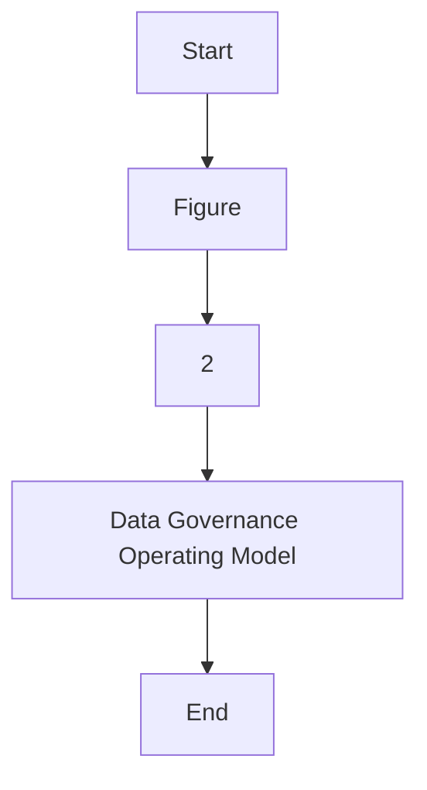
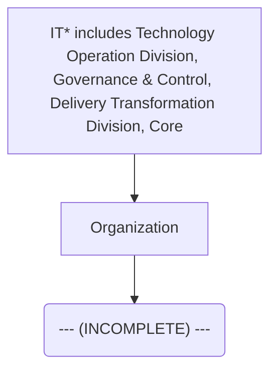

| Data Operation |
| --- |

| Version # : | 1 .0 |
| --- | --- |
| Issue / Effective D ate: |  |
| Date of Next Review |  |

| Document Categorization | **Strategic**<br>
- Transactional<br>
- Procedural<br>
- Not applicable |
| --- | --- |

| Prepared by: |  |  |  |
| --- | --- | --- | --- |
| Position / Title | Name | Date | Signature |
|  | Shiraz Aslam |  |  |

| Reviewed by : |  |  |  |
| --- | --- | --- | --- |
| Position / Title | Name | Date | Signature |

| Approved by: |  |  |  |
| --- | --- | --- | --- |
| Position / Title | Name | Date | Signature |
| Head of Data Management | Zeeshan Khan |  |  |
| Chief Operating Officer | Thamer Yousef |  |  |

| Rev. No. | Revision Date | Revised By | Approved By | Brief Description of Changes |
| --- | --- | --- | --- | --- |
|  | New Document |  |  |  |

| Term | Description |
| --- | --- |
| BI | Business Intelligence |
| BI&A | Business Intelligence and Analytics |
| BOD | Board of Directors |
| BRD | Business Requirement Document |
| [client] |  |
| BU | Business Unit |
| CCO | Chief Compliance Officer |
| CFO | Chief Financial Officer |
| CISD | Corporate Information Security Department |
| CMMI | Capability Maturity Model Integration |
| CO | Control Objectives for Information and Related Technologies |
| COO | Chief Operating Officer |
| CPG | Compliance Group |
| CRO | Chief Risk Officer |
| CTO | Chief Technology Officer |
| DB | Database |
| DBMS | Database Management System |
| DG | Data Governance |
| DMS | Document Management System |
| DVR | Data Value Realization |
| DWH | Data Warehouse |
| ECMS | Enterprise Content Management System |
| EDA | Enterprise Data Architecture |
| data management | Data Management |
| ERD | Entity Relationship Diagram |
| EUC | End-User Computations |
| FOI | Freedom of Information |
| GRM | Governance and Regulatory Management |
| HR G | Human Resources Group |
| ISG | Information Systems Group |
| IT | Information Technology |
| ITPC | IT Portfolio Committee |
| KPI | Key Performance Indicators |
| MDM | Master Data Management |
| NCA | National Cybersecurity Authority |
| NDMO | National Data Management Office |
| PDPL | Personal Data Protection Law |
| PMO | Project Management Office |
| PMS | Project Management System |
| PII | Personally Identifiable Information |
| PPU | Policy and Procedure Unit |
| PPC | Policy and Procedure Committee |
| RACI | Responsible, Accountable, Consulted, and Informed |
| RCA | Root Cause Assessment |
| ROI | Return on Investment |
| RPA | Reporting Process Assessment |
| RMG | Risk Management Group |
| SAMA | Saudi Arabian Monetary Authority |
| SLA | Service Level Agreements |
| SME | Subject Matter Expert |
| VAT | Value-Added Tax |

| Term | Explanation |
| --- | --- |
| Artifact | A tangible outcome of any process. May refer to documents like data dictionary , business glossary, systems architecture documents etc. |
| Business Glossary | A list of business terms with their definitions |
| Business Intelligence | A technology-driven process for analyzing data and presenting actionable information which helps executives, managers and other corporate end users make informed business decisions. |
| Business Intelligence and Analytics | Business Intelligence and Analytics focuses on analyzing organization's data records to extract insight and to draw conclusions about the information uncovered. |
| Data | A collection of facts in a raw or unorganized form such as numbers, characters, images, video, voice recordings, or symbols |
| Data-related Activity | Any activity that deals with data creation, data storage, data consumption, data sharing, data archival, data management or data destruction |
| Data Architecture | Data architecture is composed of models, policies, rules or standards that govern which data is collected, and how it is stored, arranged, integrated, and put to use in data systems and in organizations |
| Data Architecture and Modelling | Data Architecture and Modelling focuses on establishment of formal data structures and data flow channels to enable end to end data processing across and within entities. |
| Data Asset | Any critical data in an organization which is governed and managed as an asset |
| Data Catalog and Metadata | Data Catalog and Metadata focuses on enabling an effective access to high quality integrated metadata. The access to metadata is supported by use of the Data Catalog automated tool acting as the single point of reference to the organizations' metadata. |
| Data Classification | Data Classification involves the categorization of data so that it may be used and protected efficiently. Data Classification levels are assigned following an impact assessment determining the potential damages caused by the mishandling of data or unauthorized access to data. |
| Data Dictionary | A centralized repository of information about data such as meaning, relationships to other data, origin, usage, and format |
| Data Governance | Data governance is the definition of organizational structures, data owners, policies, rules, processes, business terms, and metrics for the end-to-end lifecycle of data (collection, storage, use, protection, archiving, and deletion). |
| Data Governance Controls | The preventive measures established to ensure adequate governance over data (e.g ., change controls, sign-offs , data quality checks etc.) |
| Data Governance program | A data governance program is an overarching set of initiatives required for establishing and maintaining effective data governance in the organization |
| Data I nitiative s | Initiatives which impact how data is created, stored, processed, consumed or destroyed in the organization . These includes system implementations, integrations, automations, data governance or management initiatives etc. |
| Data Lineage | Data lineage is documentation or description of the path along which data flows from the point of its origin to the point of its use showing all the transformations which it undergo es along this path. |
| Data Management | Data Management is a comprehensive collection of practices, concepts, procedures, processes, and accompanying systems that allow for an organization to gain control of its data resources. |
| Data Operations | The Data Operations domain focuses on the design, implementation, and support for data storage to maximize data value throughout its lifecycle from creation/acquisition to disposal. |
| Data Quality | Data Quality measures how fit the data is for its intended use with respect to its accuracy, completeness, integrity, timeliness, conformity and consistency. |
| Data Security and Protection | Data Security and Protection focuses on the processes, people, and technology designed to protect the entity’s data, including, but not limited to authorized access to data, avoidance of spoliation, and safeguarding against unauthorized disclosure of data. This domain is under the mandate of the Saudi National Cybersecurity Authority. |
| Data Sharing and Interoperability | Data Sharing and Interoperability involves the collection of data from different sources and consists of integration solutions fostering a harmonious internal and external communication between various IT components. Data Sharing and Interoperability also covers a Data Sharing process that enable an organized and standardized exchange of data between entities. |
| Data Value Realization | Data Value Realization involves the continuous evaluation of data assets for potential data driven use cases that generate revenue or reduce operating costs for the organization. |
| Data Warehouse | A system to store data from disparate sources, which can be used to create reports and data extracts that, may be used for further data analysis. |
| Document and Content Management | Document and Content Management involves controlling the capture, storage, access, and use of documents and content stored outside of relational databases. |
| Data Management | In the context of this policy, ‘ Data Management ’ (“ data management ”) refers to the Data Management department within [client] . |
| Freedom of Information | Freedom of Information domain focuses on providing Saudi citizens access to government information, portraying the process for accessing such information, and the appeal mechanism in the event of a dispute. |
| Master Data | Information that is shared universally across the organization , regardless of the process, function, conversation, or interaction |
| Metadata | Metadata is ‘structured information that describes, explains, locates, or otherwise makes it easier to retrieve, use, or manage an information resource’. Metadata provides valuable context and meaning to data which dramatically increases the usability of the data. |
| Open Data | Open Data focuses on the organization’s data which could be made available for public consumption to enhance transparency, accelerate innovation, and foster economic growth |
| Personal Data Protection | Personal Data Protection focuses on protection of a subject’s entitlement to the proper handling and non-disclosure of their personal information. |
| Reference Data | Reference data are sets of values or classification schemas that are referred by systems, applications, data stores, processes, and reports, as well as by transactional and master records. |
| Reference and Master Data Management | Reference and Master Data Management allow to link all critical data to a single master file, providing a common point of reference for all critical data. |

# Policy
## Purpose

The  Policy (' 'the policy') sets out the guidelines, framework, and key roles and responsibilities concerning the management of data in  ('' or 'the '). Through this policy, the  will:

- Establish robust data management and ensure effective oversight, monitoring, and management of data assets.

- Ensure comprehensive controls are in place to ensure data cataloguing, data sharing data quality, accuracy, availability, integrity, and completeness.

- Promote data management awareness amongst the 's employees; and

- Leverage existing data assets to derive business value.

This policy applies to all Business Units (BU), support functions, vendors/ third parties (undertaking any data-related activities for the ), employees (insourced, outsourced & contractual), members of the Board and its committees, and management committees.
() owns this policy, and it is subject to be reviewed every two (2) years or when deemed necessary. This policy will be reviewed and approved as per the standard  protocols applicable for other enterprise level policies.
This  Policy set out the overall Data Management Framework of . In case the provision of any other policy conflict with or are inconsistent with this policy, the provision of this Policy will prevail. If there are questions regarding the interpretation of applicable sections of this policy, the matter should be raised immediately to  for clarifications.

The roles & responsibilities for the approval and implementation of this policy are listed below:
Governance

| Responsibility | Function |
| --- | --- |
| Approval and oversight |  |
| Oversight, enforcement & recommendation to BOD |  |
| Document owner and implementations |  |
| Periodic review of policy |  |
Policy Governance Support

| Responsibility | Function |
| --- | --- |
| Policy custodian |  |
| Content issuance/ review |  |
| Periodic audit review |  |
This policy will be distributed to all  employees. All  employees are responsible for familiarizing themselves and ensuring compliance with the Policy requirements.
Update and maintenance of the document
1. The standards laid down by the Board through this document may be subject to changes, as deemed appropriate by the Board to ensure appropriate oversight and control over the ’s affairs. Such changes may be required due to one or more of the following reasons:
a) Changes in applicable laws, regulatory requirements / standards and specific instructions from governmental, legal and regulatory authorities
b) Changes in governance and organizational structures including institution of new committees or changes in the existing committees, changes in terms of references of groups / divisions and changes in the roles and responsibilities of relevant stakeholders
c) Inclusion of new data processes in the
d) New data management and application roles that are not envisioned or included in this document
e) Changes in data governance roles, responsibilities, or accountability matrix (as per the data governance handbook)
f) Any other change as deemed necessary by the Board
2. A formal 'Amendment Request Form' describing the proposed revision/ amendment shall be prepared by the person requesting changes (or 'requestor'). The amendment request inclusion and approval process will be as follows:
a) The requestor will complete the amendment request form, detailing the justification for changes to the policy document.
b) The amendment request form must be submitted to the Senior Manager, Data Governance and subsequently to the DG Management and Leadership Team for review and approval.
c) After approval is obtained from the Council, the amendment request form has to be submitted by PPU to the PPC members for their level of approval.
3. The Management of the  shall also have the right to propose amendments to the policy based on evolving circumstances and business needs. The Board, at its sole discretion shall have the authority to accept or reject such proposed changes and authorize amendment of the policy accordingly, if required.
a) will be responsible to carry out the required changes as directed by the Board and present the revised / updated policy to the Board for formal approval of the revised version.
b) Once the Board has approved an updated version of the policy,  will coordinate with PPU and PPU shall take the necessary steps to immediately inform the primary recipients of the changes / amendments, through an internal memorandum. Such revisions may also be communicated via email. The updated policy shall then be circulated, following the same circulation process as defined in the “Ownership, Custody and Circulation” section of this policy.
c) In the event of changes in the policy, the primary recipients shall be responsible to assess if the changes in this policy warrant a change in relevant policies and procedures, and if required, necessary updates to the policies and procedures will be made to ensure alignment with the revised Enterprise Data Governance Policy.

This policy adheres to the guidelines and the principles stipulated in:
- National Data Governance Interim Regulations
- National Data Management Office Handbook
- Data Management and Personal Data Protection Standards
The  will also adhere to all other applicable laws and regulations around data governance and data management as and when will be issued by the SAMA, NDMO and other regulators, relevant to the 's operations.
Compliance to applicable laws and regulations shall be provided by the Compliance Group and Internal Audit Department of the .
This policy is for the internal use of , and all employees must ensure its confidentiality at all times. No content of this policy shall be reproduced or transmitted in any form by any means without the written permission of a competent authority.

The Policy is effective from the date of its approval by the Board of Directors

**[Diagram — PNG]:**

**KSA Data Management and Personal Data Protection Framework**

1. **Data Governance**

   - **Data Assetization**
     - 2: Data Catalog and Metadata
     - 3: Data Quality
     - 4: Data Operations
     - 5: Document and Content Mgmt.
     - 6: Data Architecture and Modeling
     - 7: Reference and Master Data Mgmt.

   - **Data Usage**
     - 8: Business Intelligence and Analytics
     - 9: Data Sharing and Interoperability
     - 10: Data Value Realization
     - 11: Open Data

2. **Data Classification and Availability**
   - 12: Freedom of Information
   - 13: Data Classification

3. **Data Protection**
   - 14: Personal Data Protection
   - 15: Data Security and Protection (covered by NCA)

**[Diagram — PNG]:**

- **Board of Directors**
  - MD
    - COO
      - Head EDM
        - DWH
          - ETL
          - DW & Architecture
        - Data Governance
        - BO
          - BI and Analytics
        - TOD
          - Data Operations
        - ETD
          - Document and Content Management
        - CISD
          - Data Classification, Data Security and Protection
        - Risk
          - Personal Data Protection

- **Councils**
  - MIS Council connects to BO
  - DG Council connects to Data Governance

- **NDMO Domains:**
  - Data Sharing and Interoperability
  - Data Governance, Metadata and Data Catalogue, Data Quality, Reference and Master Data Management, Data Architecture & Modeling, Data Value Realization, Open Data, Freedom of Information

**[Flowchart — Word Shapes]:**

1. Figure
2. 2
3. – Data Governance Operating Model

**[Flowchart — Structured]:**

```markdown
### Logic Steps

#### Step Table

| Step Number | Step Description                   |
|-------------|------------------------------------|
| 1           | Figure                             |
| 2           | 2                                  |
| 3           | Data Governance Operating Model    |

#### Mermaid Diagram


```

The data operations policy has been developed specifically for , in compliance with relevant Data Management and Personal Data Protection Standards and Interim Regulation issued by the National Data Management Office (NDMO). Data Storage and Operations includes the design, implementation, and support of stored data, to maximize its value throughout its lifecycle, from creation/acquisition to disposal.
The goals of Data Storage and Operations include:

- Managing the availability of data throughout the data lifecycle

- Ensuring the integrity of data assets

- Managing the performance of data transactions

The below statements of policy are defined as the foundation of  view on data operations and should guide all actions in creating, maintaining, and using data quality standards across the . These statements are:

- shall create a Data Operations Plan to manage Data Operations activities.

- Periodic forecasts of needed storage capacity shall be conducted by Data Operations team to support and align with the target storge architecture and future business requirements of . The following shall be determined from the periodic forecast audits:
  o Capacity of current infrastructure.
  o Precise current infrastructure utilization.
  o Infrastructure utilization trends.
  o Server consolidation ratio achievable.
  o Capacity requirements for the next three to five years.

- Annual reviews and findings from periodic forecast audits shall be reported to Data Governance Leadership Team.

- shall prioritize its information systems based on the business criticality and potential monetary and reputational losses because of emergency or disaster.

- shall document list of information systems on prioritization which shall be used to establish an order of systems recovery in the disaster recovery plan.

- A clear process for evaluation and selection of the Database Management System shall be followed. The process' evaluation factors shall include (but not limited to) the following factors:
  o Total cost of ownership including, at minimum, licensing, support, training, hardware
  o Availability of resources skilled in the technology, both internally and in the market
  o Presence of related software tools in the
  o Volume and velocity limits of the technology
  o Reliability provided by the technology
  o Scalability of the technology
  o Security controls provided by the technology

- Data Operations, Storage and Retention policy shall be established and/or updated for any data related activity in , to protect the security, availability, and safety of the data which at minimum shall cover the following areas:
  o Storage conditions ensuring a protection of data in the event of disaster
  o Retention periods of data based on its type, classification, business value and regulatory requirements
  o Disposal and destruction rules based on the data type and data classification
  o Required actions in the event of an accidental permanent loss of data

- The database performance should be monitored on regular basis including (but not limited to) the following:
  o Capacity - size of the unused storage
  o Availability - accessibility of databases to users
  o Queries execution performance - query execution times and errors
  o Changes tracking - tracking of database changes for root cause analysis

- The access to the database should be given as per the Access Management Policy of the .

- shall have its DBMS tools updated to the latest published Vendor release or shall have a plan to update to the latest release.

- Service Level Agreements must be specified for the databases performance, data availability and recovery.

- A data backup process shall be implemented as per business needs and aligned to the approved information security standards of the . The plan shall define the type of data and information to be stored and where it shall be stored.

- Periodic tests shall be conducted to check regular backup availability.

- Data Operations Team shall develop a Disaster Recovery plan as per BCP guidelines  in support with Data Operations policy and Data Backup process.

- The implementation of the changes to production environment should be done as per the Change Management policy and process of the .

- shall develop Key Performance Indicators (KPIs) to monitor and demonstrate the effectiveness and usefulness of Data Storage and Lifecycle Management capabilities.

- Identify and act on automation opportunities: Automate database storage configuration development processes, developing tools, and processes that shorten each business development cycle, reduce errors and rework, and minimize the impact on the data.

- Build with reuse in mind: Develop and promote the use of abstracted and reusable data objects that prevent applications from being tightly coupled to database schemas. The goal is to make using the data as quick, easy, and painless as possible.

- Understand and appropriately apply best practices:  should promote database standards and best practices as requirements but be flexible to deviate given acceptable reasons.

- Collective Accountability: All parties involved in the data storage and retention activities should be held responsible for decisions, for processing as per the clearly defined reasons, and for taking the necessary actions to ensure data quality and implementation of security controls as defined in the Data Operations policy and as prescribed by National Data Management Office.

The following roles and responsibilities are applicable to this policy:

- Managing Director (MD): The Managing Director is accountable for the approval of any exceptions or changes in Data Operations Policy

- Data Management and Governance Leadership Team: The executive body of  data management & governance and will be providing strategic direction for data operations. The DG Leadership Team will also be taking strategic decisions related to data operations.

- Data Governance Council: The strategic body of  data management & governance authorizes data operation exercises, defines priorities and critical data, and is responsible for approving their outputs.

- Data Governance officer: An experienced business domain representative responsible for managing all data management & governance initiatives and changes. The data governance officer overlooks and support the data operations, storage, retention and archival of data related activities.

- Stewardship Team: The stewardship team is responsible for access controls, proposing KPIs for monitoring, support updating to latest DBMS tools and technologies, check functioning of Data Backup process and Disaster Recovery process on a regular basis, support on monitoring and reporting database performance and other data operations and storage related activities.

- Chief Technology Officer (CTO): CTO overlooks and manages the delivery of data operations and storage capabilities and maintains plans, timelines, budgets, ensuring that progress is made.

- Chief Operating Officer (COO): COO is accountable for the approval of disaster recovery plan and data backup process and will also be responsible for approving any exceptions and changes in the data operations policy.

- Chief Information Security Officer (CISO): CISO is accountable for the updating data storage and retention policy

- Compliance Officer: The Compliance Officer is responsible for monitoring compliance with data management and data management & governance policies and standards.

- GRM Team:  The GRM team supports in the monitoring of KPIs, receive alerts and flags from the wider organization, investigate and act accordingly to resolve them.

- Data Owner: The Data Owner is responsible for providing domain-specific executive-level support in data operations and storage exercises, communicating the reports of the exercises across the business domain, maintaining the established storage configurations and support on periodic forecasts of storage capabilities of respective domains.

- Data Operations Team: Data Operations team is responsible for supporting data operations and storage exercises. Their deep knowledge of the ’s data operations and storage allows them to validate the storage configurations, thus ensuring that operations and storage capabilities are consistent in the information systems and all the architectural documents are in line with the required specifications. Responsible for carrying out periodic data storage forecasts, prioritization of systems, evaluation and selection of DBMS, monitor and report database performance, monitoring access controls and other data operations and storage activities.

- Data User: Any individual interacting with the data without having direct control over it. The data users are responsible for raising any issues that surface while interacting with the data

- Data Specialist:  Data Specialist is responsible for update to latest DBMS tools and technologies, implement and check Data Backup process, develop Disaster Recovery Plan as per BCP guidelines

| Main Activities | The Board | MD | DG Leadership Team | CTO | CISO | COO | GRM Team | DG Council | Data Governance Officer | Data Owner | Data User | Data Operations Team | Stewardship Team | Data Specialist |  |  |  |
| --- | --- | --- | --- | --- | --- | --- | --- | --- | --- | --- | --- | --- | --- | --- | --- | --- | --- |
| Main Activities | The Board | MD | DG Leadership Team | CTO | CISO | COO | GRM Team | DG Council | Data Governance Officer | Data Owner | Data User | Data Operations Team | Data Domain Steward | Business Domain Steward | Data Steward | Business Steward | Data Specialist |
| Authorizing Data Operations Plan and roadmap |  | I | A |  | C | I | R |  | R | I | C | I | C |  |  |  |  |
| Periodic Data Storage Forecasts |  | C |  | I | C |  | A, R | I |  |  |  |  |  |  |  |  |  |
| Information Systems prioritization |  | C |  | I | C | R |  | A, R | I | C | I | C | I |  |  |  |  |
| Evaluation and selection of the Database Management System Software |  | A |  | I | C |  | R | I | C |  |  |  |  |  |  |  |  |
| Update Data Storage and retention policy |  | C | A |  | I | C | R |  | R | C | I |  |  |  |  |  |  |
| Monitor and report database performance |  | C |  | I |  | A , R | C | I | C | I | C |  |  |  |  |  |  |
| Approve any exceptions or changes in Data Operations Policy |  | A | I |  | R |  | C | I |  | R | I |  |  |  |  |  |  |
| Update to latest DBMS tools and technologies |  | I |  | I |  | C |  | A , R | I | C, R |  |  |  |  |  |  |  |
| Implement and check Data Backup process |  | I | C |  | C | I | C |  | A , R | I | C, R |  |  |  |  |  |  |
| Develop Disaster Recovery Plan as per BCP guidelines |  | I |  | I | C | I |  | A , R | C | I | C , R |  |  |  |  |  |  |
| Monitor Data Operations KPIs |  | A |  | I |  | R |  |  |  |  |  |  |  |  |  |  |  |
| Approve Disaster Recovery Plan and Data Backup process |  | R |  | A |  | C | I |  | R | I | C |  |  |  |  |  |  |
| Implement the disaster recovery sites as per BCP plan |  | I |  | I |  | A, R | I |  |  |  |  |  |  |  |  |  |  |
| Raising data operations related issues |  | I | A |  | I | C | R | I | C |  |  |  |  |  |  |  |  |

Data Operations team shall monitor these KPIs and help in providing inputs to gather statistics on usage of ’s data storage capabilities. The KPIs should include, at minimum, the following:

| Category | Metric | Description |
| --- | --- | --- |
| Storage Capacity Monitoring | % of total data storage capacity used | Percentage of data storage capacity utilized. This KPI will help to manage the storage capacity quarterly |
| Storage Capacity Monitoring | % of data storage capacity used by type of database | Percentage of data storage capacity utilized by database type. This KPI will help to manage the storage capacity at database each level quarterly |
| Storage Capacity Monitoring | % of data storage capacity used for backups | Percentage of data storage capacity utilized. This KPI will help to manage and monitor the storage capacity utilized for backup on half-yearly basis. |
| Performance Monitoring | Number of performed data transactions | Total number of data transaction performed during a quarter |
| Performance Monitoring | Average time of queries execution | The average time a query takes to execute. The queries maybe ETL queries, queries in application/systems to fetch the data, queries as part of stored procedure/stored process. This KPI will be monitored on monthly basis. |

**[Flowchart — Word Shapes]:**

1. IT* includes Technology Operation Division, Governance & Control, Delivery Transformation Division, Core
2. Organization
3. ing
4. Division and Enterprise Data Management & Governance Division
5. ing Division and Enterprise Data Management & Governance Division

**[Flowchart — Structured]:**

```markdown
## Step Table

| Step | Description                                                                 |
|------|-----------------------------------------------------------------------------|
| 1    | IT* includes Technology Operation Division, Governance & Control, Delivery Transformation Division, Core |
| 2    | Organization                                                                |
| 3    | INCOMPLETE: Likely a continuation or context for the organization           |

## Mermaid Diagram

