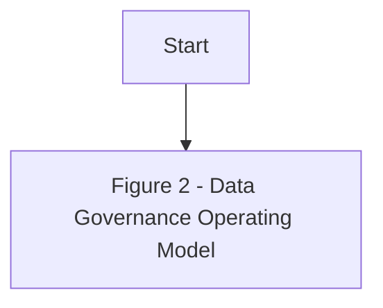
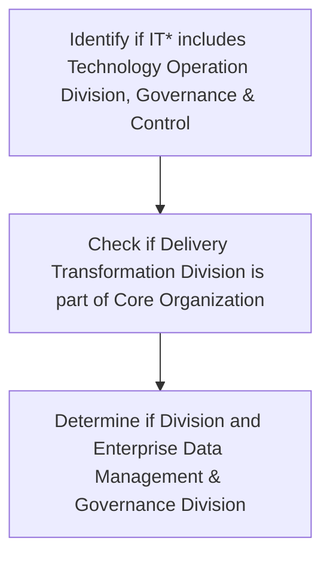

| Document and Content Data Management |
| --- |

| Version # : | 1 .0 |
| --- | --- |
| Issue / Effective D ate: |  |
| Date of Next Review |  |

| Document Categorization | **Strategic**<br>
- Transactional<br>
- Procedural<br>
- Not applicable |
| --- | --- |

| Prepared by: |  |  |  |
| --- | --- | --- | --- |
| Position / Title | Name | Date | Signature |
|  | Shiraz Aslam |  |  |

| Reviewed by : |  |  |  |
| --- | --- | --- | --- |
| Position / Title | Name | Date | Signature |

| Approved by: |  |  |  |
| --- | --- | --- | --- |
| Position / Title | Name | Date | Signature |
| Head of Data Management | Zeeshan Khan |  |  |
| Chief Operating Officer | Thamer Yousef |  |  |

| Rev. No. | Revision Date | Revised By | Approved By | Brief Description of Changes |
| --- | --- | --- | --- | --- |
|  | New Document |  |  |  |

| Term | Description |
| --- | --- |
| BI | Business Intelligence |
| BI&A | Business Intelligence and Analytics |
| BOD | Board of Directors |
| BRD | Business Requirement Document |
| [client] |  |
| BU | Business Unit |
| CCO | Chief Compliance Officer |
| CFO | Chief Financial Officer |
| CISD | Corporate Information Security Department |
| CMMI | Capability Maturity Model Integration |
| CO | Control Objectives for Information and Related Technologies |
| COO | Chief Operating Officer |
| CPG | Compliance Group |
| CRO | Chief Risk Officer |
| CTO | Chief Technology Officer |
| DB | Database |
| DBMS | Database Management System |
| DG | Data Governance |
| DMS | Document Management System |
| DVR | Data Value Realization |
| DWH | Data Warehouse |
| ECMS | Enterprise Content Management System |
| EDA | Enterprise Data Architecture |
| data management | Data Management |
| ERD | Entity Relationship Diagram |
| EUC | End-User Computations |
| FOI | Freedom of Information |
| GRM | Governance and Regulatory Management |
| HR G | Human Resources Group |
| ISG | Information Systems Group |
| IT | Information Technology |
| ITPC | IT Portfolio Committee |
| KPI | Key Performance Indicators |
| MDM | Master Data Management |
| NCA | National Cybersecurity Authority |
| NDMO | National Data Management Office |
| PDPL | Personal Data Protection Law |
| PMO | Project Management Office |
| PMS | Project Management System |
| PII | Personally Identifiable Information |
| PPU | Policy and Procedure Unit |
| PPC | Policy and Procedure Committee |
| RACI | Responsible, Accountable, Consulted, and Informed |
| RCA | Root Cause Assessment |
| ROI | Return on Investment |
| RPA | Reporting Process Assessment |
| RMG | Risk Management Group |
| SAMA | Saudi Arabian Monetary Authority |
| SLA | Service Level Agreements |
| SME | Subject Matter Expert |
| VAT | Value-Added Tax |

| Term | Explanation |
| --- | --- |
| Artifact | A tangible outcome of any process. May refer to documents like data dictionary , business glossary, systems architecture documents etc. |
| Business Glossary | A list of business terms with their definitions |
| Business Intelligence | A technology-driven process for analyzing data and presenting actionable information which helps executives, managers and other corporate end users make informed business decisions. |
| Business Intelligence and Analytics | Business Intelligence and Analytics focuses on analyzing organization's data records to extract insight and to draw conclusions about the information uncovered. |
| Data | A collection of facts in a raw or unorganized form such as numbers, characters, images, video, voice recordings, or symbols |
| Data-related Activity | Any activity that deals with data creation, data storage, data consumption, data sharing, data archival, data management or data destruction |
| Data Architecture | Data architecture is composed of models, policies, rules or standards that govern which data is collected, and how it is stored, arranged, integrated, and put to use in data systems and in organizations |
| Data Architecture and Modelling | Data Architecture and Modelling focuses on establishment of formal data structures and data flow channels to enable end to end data processing across and within entities. |
| Data Asset | Any critical data in an organization which is governed and managed as an asset |
| Data Catalog and Metadata | Data Catalog and Metadata focuses on enabling an effective access to high quality integrated metadata. The access to metadata is supported by use of the Data Catalog automated tool acting as the single point of reference to the organizations' metadata. |
| Data Classification | Data Classification involves the categorization of data so that it may be used and protected efficiently. Data Classification levels are assigned following an impact assessment determining the potential damages caused by the mishandling of data or unauthorized access to data. |
| Data Dictionary | A centralized repository of information about data such as meaning, relationships to other data, origin, usage, and format |
| Data Governance | Data governance is the definition of organizational structures, data owners, policies, rules, processes, business terms, and metrics for the end-to-end lifecycle of data (collection, storage, use, protection, archiving, and deletion). |
| Data Governance Controls | The preventive measures established to ensure adequate governance over data (e.g ., change controls, sign-offs , data quality checks etc.) |
| Data Governance program | A data governance program is an overarching set of initiatives required for establishing and maintaining effective data governance in the organization |
| Data I nitiative s | Initiatives which impact how data is created, stored, processed, consumed or destroyed in the organization . These includes system implementations, integrations, automations, data governance or management initiatives etc. |
| Data Lineage | Data lineage is documentation or description of the path along which data flows from the point of its origin to the point of its use showing all the transformations which it undergo es along this path. |
| Data Management | Data Management is a comprehensive collection of practices, concepts, procedures, processes, and accompanying systems that allow for an organization to gain control of its data resources. |
| Data Operations | The Data Operations domain focuses on the design, implementation, and support for data storage to maximize data value throughout its lifecycle from creation/acquisition to disposal. |
| Data Quality | Data Quality measures how fit the data is for its intended use with respect to its accuracy, completeness, integrity, timeliness, conformity and consistency. |
| Data Security and Protection | Data Security and Protection focuses on the processes, people, and technology designed to protect the entity’s data, including, but not limited to authorized access to data, avoidance of spoliation, and safeguarding against unauthorized disclosure of data. This domain is under the mandate of the Saudi National Cybersecurity Authority. |
| Data Sharing and Interoperability | Data Sharing and Interoperability involves the collection of data from different sources and consists of integration solutions fostering a harmonious internal and external communication between various IT components. Data Sharing and Interoperability also covers a Data Sharing process that enable an organized and standardized exchange of data between entities. |
| Data Value Realization | Data Value Realization involves the continuous evaluation of data assets for potential data driven use cases that generate revenue or reduce operating costs for the organization. |
| Data Warehouse | A system to store data from disparate sources, which can be used to create reports and data extracts that, may be used for further data analysis. |
| Document and Content Management | Document and Content Management involves controlling the capture, storage, access, and use of documents and content stored outside of relational databases. |
| Data Management | In the context of this policy, ‘ Data Management ’ (“ data management ”) refers to the Data Management department within [client] . |
| Freedom of Information | Freedom of Information domain focuses on providing Saudi citizens access to government information, portraying the process for accessing such information, and the appeal mechanism in the event of a dispute. |
| Master Data | Information that is shared universally across the organization , regardless of the process, function, conversation, or interaction |
| Metadata | Metadata is ‘structured information that describes, explains, locates, or otherwise makes it easier to retrieve, use, or manage an information resource’. Metadata provides valuable context and meaning to data which dramatically increases the usability of the data. |
| Open Data | Open Data focuses on the organization’s data which could be made available for public consumption to enhance transparency, accelerate innovation, and foster economic growth |
| Personal Data Protection | Personal Data Protection focuses on protection of a subject’s entitlement to the proper handling and non-disclosure of their personal information. |
| Reference Data | Reference data are sets of values or classification schemas that are referred by systems, applications, data stores, processes, and reports, as well as by transactional and master records. |
| Reference and Master Data Management | Reference and Master Data Management allow to link all critical data to a single master file, providing a common point of reference for all critical data. |

# Policy
## Purpose

The  Policy (' 'the policy') sets out the guidelines, framework, and key roles and responsibilities concerning the management of data in  ('' or 'the '). Through this policy, the  will:

- Establish robust data management and ensure effective oversight, monitoring, and management of data assets.

- Ensure comprehensive controls are in place to ensure data cataloguing, data sharing data quality, accuracy, availability, integrity, and completeness.

- Promote data management awareness amongst the 's employees; and

- Leverage existing data assets to derive business value.

This policy applies to all Business Units (BU), support functions, vendors/ third parties (undertaking any data-related activities for the ), employees (insourced, outsourced & contractual), members of the Board and its committees, and management committees.
() owns this policy, and it is subject to be reviewed every two (2) years or when deemed necessary. This policy will be reviewed and approved as per the standard  protocols applicable for other enterprise level policies.
This  Policy set out the overall Data Management Framework of . In case the provision of any other policy conflict with or are inconsistent with this policy, the provision of this Policy will prevail. If there are questions regarding the interpretation of applicable sections of this policy, the matter should be raised immediately to  for clarifications.

The roles & responsibilities for the approval and implementation of this policy are listed below:
Governance

| Responsibility | Function |
| --- | --- |
| Approval and oversight |  |
| Oversight, enforcement & recommendation to BOD |  |
| Document owner and implementations |  |
| Periodic review of policy |  |
Policy Governance Support

| Responsibility | Function |
| --- | --- |
| Policy custodian |  |
| Content issuance/ review |  |
| Periodic audit review |  |
This policy will be distributed to all  employees. All  employees are responsible for familiarizing themselves and ensuring compliance with the Policy requirements.
Update and maintenance of the document
1. The standards laid down by the Board through this document may be subject to changes, as deemed appropriate by the Board to ensure appropriate oversight and control over the ’s affairs. Such changes may be required due to one or more of the following reasons:
a) Changes in applicable laws, regulatory requirements / standards and specific instructions from governmental, legal and regulatory authorities
b) Changes in governance and organizational structures including institution of new committees or changes in the existing committees, changes in terms of references of groups / divisions and changes in the roles and responsibilities of relevant stakeholders
c) Inclusion of new data processes in the
d) New data management and application roles that are not envisioned or included in this document
e) Changes in data governance roles, responsibilities, or accountability matrix (as per the data governance handbook)
f) Any other change as deemed necessary by the Board
2. A formal 'Amendment Request Form' describing the proposed revision/ amendment shall be prepared by the person requesting changes (or 'requestor'). The amendment request inclusion and approval process will be as follows:
a) The requestor will complete the amendment request form, detailing the justification for changes to the policy document.
b) The amendment request form must be submitted to the Senior Manager, Data Governance and subsequently to the DG Management and Leadership Team for review and approval.
c) After approval is obtained from the DG Council, the amendment request form has to be submitted by PPU to the PPC members for their level of approval.
3. The Management of the  shall also have the right to propose amendments to the policy based on evolving circumstances and business needs. The Board, at its sole discretion shall have the authority to accept or reject such proposed changes and authorize amendment of the policy accordingly, if required.
a) will be responsible to carry out the required changes as directed by the Board and present the revised / updated policy to the Board for formal approval of the revised version.
b) Once the Board has approved an updated version of the policy,  will coordinate with PPU and PPU shall take the necessary steps to immediately inform the primary recipients of the changes / amendments, through an internal memorandum. Such revisions may also be communicated via email. The updated policy shall then be circulated, following the same circulation process as defined in the “Ownership, Custody and Circulation” section of this policy.
c) In the event of changes in the policy, the primary recipients shall be responsible to assess if the changes in this policy warrant a change in relevant policies and procedures, and if required, necessary updates to the policies and procedures will be made to ensure alignment with the revised Enterprise Data Governance Policy.

This policy adheres to the guidelines and the principles stipulated in:
- National Data Governance Interim Regulations
- National Data Management Office Handbook
- Data Management and Personal Data Protection Standards
The  will also adhere to all other applicable laws and regulations around data governance and data management as and when will be issued by the SAMA, NDMO and other regulators, relevant to the 's operations.
Compliance to applicable laws and regulations shall be provided by the Compliance Group and Internal Audit Department of the .
This policy is for the internal use of , and all employees must ensure its confidentiality at all times. No content of this policy shall be reproduced or transmitted in any form by any means without the written permission of a competent authority.

The Policy is effective from the date of its approval by the Board of Directors

**[Diagram — PNG]:**

**KSA Data Management and Personal Data Protection Framework**

1. **Data Governance**

   **Data Assetization**
   - 2. Data Catalog and Metadata
   - 3. Data Quality
   - 4. Data Operations
   - 5. Document and Content Mgmt.
   - 6. Data Architecture and Modeling
   - 7. Reference and Master Data Mgmt.

   **Data Usage**
   - 8. Business Intelligence and Analytics
   - 9. Data Sharing and Interoperability
   - 10. Data Value Realization
   - 11. Open Data

**Data Classification and Availability**
- 12. Freedom of Information
- 13. Data Classification

**Data Protection**
- 14. Personal Data Protection
- 15. Data Security and Protection (covered by NCA)

**[Diagram — PNG]:**

- **Board of Directors**
  - **MD**
    - **COO**
      - **Head EDM**
        - **BO**
          - BI and Analytics
        - **DWH**
          - **ETL**
          - **DW & Architecture**
          - Data Sharing and Interoperability
        - **Data Governance**
          - Data Governance, Metadata and Data Catalogue, Data Quality, Reference and Master Data Management, Data Architecture & Modeling, Data Value Realization, Open Data, Freedom of Information
        - **TOD**
          - Data Operations
        - **ETD**
          - Document and Content Management
        - **CISD**
          - Data Classification, Data Security and Protection
        - **Risk**
          - Personal Data Protection
  - **MIS Council**
  - **DG Council**

**[Flowchart — Word Shapes]:**

1. Figure
2. 2
3. – Data Governance Operating Model

**[Flowchart — Structured]:**

```markdown
### Step Table

| Step Number | Description                          | Decision Point | Yes Path | No Path |
|-------------|--------------------------------------|----------------|----------|---------|
| 1           | Start                                |                |          |         |
| 2           | Figure 2 - Data Governance Operating Model |                |          |         |

### Mermaid Diagram

```

The Document and Content Data Management policy has been developed for the  Saudi Fransi in compliance with the standards and regulations issued by the National Data Management Office (NDMO) of the Kingdom of Saudi Arabia. To manage its data assets, a complete data management Program, including document & content management, needs to be rolled out.
Document and Content Management (DMS) is the control over capture, storage, access and use of data and information stored outside relational databases. Document and Content Management focuses on integrity and access.
Document and Content Management includes two sub-functions:
1. Document management encompasses the processes, techniques, and technologies required for controlling and organizing documents & records throughout their lifecycle. It includes storage, archival, and usage, for both electronic and paper documents.
2. Content management includes the processes, techniques, and technologies for organizing, categorizing, and structuring information resources so that they can be stored, published, and reused in an efficient and safe manner.

The below statements of policy have been defined as the foundation of ’s view on document & content management. These statements are:

- Identify and prioritize the existing and newly created documents to be stored and managed in the ’s DMS.

- Create a Document and Content Management plan to implement and control activities to manage the ’s documents and content lifecycle.

- Create a Document and Content Digitization plan which will be used to track and store the electronic documents instead of creating paper-based documents.

- Documents should be named in a standardized, logical, and intuitive way to discover, manage, and access records effectively as needed

- Documents should be classified and labeled according to the Data Classification policy.

- Conduct required training for the responsible employees to increase the awareness on Document and Content data management.

- Critical documents should be identified, and plans for their protection and recovery should be developed and maintained

- Establish the archival, backup and recovery activities for documents.

- Documents and content should be retained and disposed-off as per ’s Retention policy and in accordance with SAMA regulations; and based on retention period specified by SAMA.

- All content should be up to date and complete. Version control should be maintained In case of multiple version to identify the latest version of the document.

- Content should be legible, and terminology should be standardized and used consistently.

- Records’ Single Source of truth should be always maintained to avoid inconsistencies, however duplicate data records can be kept for business requirements as needed. If the duplicate records are no longer needed and the official copy of record (electronic or paper) is determined, the other copy can be safely destroyed

- Establish key performance indicators (KPIs) to measure ’s document management efficiency.

Document & Content Data Management is one of the NDMO domains for data management.  should adhere to the following principles:
1. Accountability: The  should assign clear roles and responsibilities to relevant stakeholders to support the adoption of policies and processes and to ensure program auditability and compliance monitoring.
2. Integrity: Documents & Content shall be managed so that the records and information generated or managed by or for the  have a reasonable and suitable guarantee of authenticity and reliability.
3. Protection: Documents & Content shall be managed to ensure a reasonable level of protection to information that is personal or that otherwise requires protection.
4. Compliance: Documents & Content shall be managed to comply with applicable laws and other binding authorities, as well as the ’s policies.
5. Availability:  shall maintain its information in a manner that ensures timely, efficient, and accurate retrieval of its information.
6. Retention:  shall retain its information for an appropriate time, considering all operational, legal, regulatory and other relevant requirements.
7. Disposition:  shall provide secure and appropriate disposition of information in accordance with its policies, and applicable laws, regulations, and other binding authorities.
8. Transparency:  shall make its approved policies, processes, and standards, in a manner that is available to all personnel in order to understand and comply with it.

The following roles and responsibilities are applicable to this policy:

- Data Management and Governance Leadership Team: The executive body of  data management & governance is responsible for signing off on any changes, exemption, and exceptions to this policy.

- Data Governance Council: The strategic body of  data management & governance is responsible to develop the required document & content management policies and processes, implementing this policy in the  and ensuring the required process for document and content data management are implemented.

- Head of : The Head of  is responsible to oversee implementation of the Data Management Program and compliance with data and content management standards.

- Head of Enterprise Transformation Division: Head of ETD is accountable for reviewing current requirements, current uses, and document management capabilities, and identify the target state and gaps, development of the document and content management and digitization plan and roadmap, including prioritization, required document & content management policies and processes and measurement and monitoring of the documents & content management relevant adoption KPIs.
Sr. Mgr. data Management & Architecture Department: Sr. Mgr. is accountable to manage and oversee the completion of the documents metadata.

- Compliance Officer: An experienced domain representative accountable for Assess compliance with NDMO requirements and the relevant Document & Content Management policies, processes, and controls across the

- Data Governance Officer: An experienced business domain representative responsible for managing all data management & governance initiatives and changes. The data governance officer is responsible to assess compliance with NDMO requirements and the relevant Document & Content Management policies, processes, and controls across the

- Data Privacy Officer: An experienced privacy domain representative consulted for all document & content management initiatives and activities.

- Document Management System (DMS) Team: DMS team is completely accountable and responsible for document & content management initiatives and activities from review of requirements till managing and overseeing the implementation.

- Data Architect: Data Architect is responsible to manage and oversee the completion of the documents metadata

- Data Owner: Data Owner is responsible for review current requirements, current uses, and document management capabilities, and identify the target state and gaps, develop the document and content management and digitization plan and roadmap, including prioritization, required document & content management policies and processes, manage the documents and content Lifecycle.

- Data User: Any individual interacting with the data without having direct control over it. The data users are responsible for raising any issues that surface while interacting with the data.

- Stewardship Team: The stewardship team is consulted for all document & content management initiatives and activities from review of current requirements, current uses, and document management capabilities, identification of the target state and gaps, development the required document & content management policies and processes, management of documents and content management Lifecycle and providing inventory access, search, retrieval, and delivery through acceptable channels

- Data Specialist: Data Specialist is consulted for establish the archival, backup and recovery activities for documents.

| Control Activity | The Board | DG Leadership Team | Head of data management | Head of ETD | Sr. Mgr. data Management & Architecture Department | DG Council | Compliance Officer | Data Governance Officer | Data Architect | Data Privacy Officer | Data Operations Team | DMS Team (DAMAS) | Data Owner | Data User | Stewardship Team |  |  |  |  |
| --- | --- | --- | --- | --- | --- | --- | --- | --- | --- | --- | --- | --- | --- | --- | --- | --- | --- | --- | --- |
| Control Activity | The Board | DG Leadership Team | Head of data management | Head of ETD | Sr. Mgr. data Management & Architecture Department | DG Council | Compliance Officer | Data Governance Officer | Data Architect | Data Privacy Officer | Data Operations Team | DMS Team (DAMAS) | Data Owner | Data User | Data Domain Steward | Business Domain Steward | Data Steward | Business Steward | Data Specialist |
| Provide document maintenance related requirements |  | I |  | C | A, R |  | R |  |  |  |  |  |  |  |  |  |  |  |  |
| Review current requirements, current uses, and document management capabilities, and identify the target state and gaps |  | C, I | A |  | C |  | C |  | C, I |  | R | I | C | I | C |  |  |  |  |
| Develop the document and content management and digitization plan and roadmap, including prioritization |  | C, I | A |  | C |  | I |  | I |  | R | I |  |  |  |  |  |  |  |
| Develop the required document & content management policies and processes |  | C, I | A |  | C |  | I |  | I |  | R | I |  |  |  |  |  |  |  |
| Manage the documents and content Lifecycle (Capture Records and Content ) |  | C, I |  | C, I |  | C |  | R | I | C | A | C |  |  |  |  |  |  |  |
| Develop a plan to standardize the format of documents and inventory all documents under unified rules for managing workflow plans |  | C, I |  | C, I |  | C, I |  | C |  | A, R | R | I |  |  |  |  |  |  |  |
| Provide Documents inventory access, search, retrieval, and delivery through Acceptable channels |  | C, I |  | C, I |  | C |  | A, R | R | I | C, I |  |  |  |  |  |  |  |  |
| Manage and oversee the completion of the documents metadata |  | C, I |  | A | C, I |  | C, I | R | I |  | C | R | I |  |  |  |  |  |  |
| Establish the archival, backup and recovery activities for documents. |  | C, I |  | A | C, I |  | C, I | R | I |  | C | R | I | C, I |  |  |  |  |  |
| Measure and monitor the documents & content management relevant adoption KPIs |  | C, I | A |  | C, I |  | I |  | I | R |  | I |  |  |  |  |  |  |  |
| Select and oversee the implementation of appropriate tools for document & content management |  | C, I |  | C |  | I |  | I | A, R | C | I |  | C |  |  |  |  |  |  |
| Assess compliance with NDMO requirements and the relevant Document & Content Management policies, processes, and controls across the Organization |  | C | C, I | R |  | C | A | R |  | C | R | I |  |  |  |  |  |  |  |
| Manage and oversee the implementation of Document & Content Management initiatives and activities |  | I | C, I | A |  | C | R |  | C | R | I |  |  |  |  |  |  |  |  |
| Manage the documents and content Lifecycle (Manage Versioning and Control,) |  | C, I |  | C, I |  | C |  | A | R | I | C | R | C |  |  |  |  |  |  |
| Manage the documents and content Lifecycle (Backup and Recovery, Manage Retention and Disposal, Audit Documents / Records) |  | C, I |  | C, I |  | C |  | A | R | I | C | R | C |  |  |  |  |  |  |

DMS team and Data Owners shall monitor these KPIs and help in providing inputs and measure its documents management efficiency. The KPIs should include, at minimum, the following:

| Category | Metric | Description |
| --- | --- | --- |
| Capacity Monitoring | Volume of the [client] 's documents stored and managed within the Document Management System | Metrics on utilized capacity of [client] ’s Document Management System |
| Capacity Monitoring | Number of users of the [client] 's Document Management System | Metrics on user of [client] ’s Document management System |
| Migration | % of identified paper-based documents migrated to electronic format | Percentage of paper-based document that are identified to migrate to electronic format. |
| Performance Monitoring | Training and Awareness programs conducted | Total number of training and awareness programs conducted by [client] management. |
| Performance Monitoring | Attendance for training and awareness programs | Metrics on number of people attended the training and awareness programs conducted by [client] management |

**[Flowchart — Word Shapes]:**

1. IT* includes Technology Operation Division, Governance & Control, Delivery Transformation Division, Core
2. Organization
3. ing
4. Division and Enterprise Data Management & Governance Division
5. ing Division and Enterprise Data Management & Governance Division

**[Flowchart — Structured]:**

```markdown
## Step Table

| Step Number | Description                                                                  | Decision | Next Step (Yes) | Next Step (No) |
|-------------|------------------------------------------------------------------------------|----------|----------------|----------------|
| 1           | Identify if IT* includes Technology Operation Division, Governance & Control | N/A      | 2              | N/A            |
| 2           | Check if Delivery Transformation Division is part of Core Organization       | N/A      | 3              | N/A            |
| 3           | Determine if Division and Enterprise Data Management & Governance Division   | N/A      | End            | N/A            |

## Mermaid Diagram

