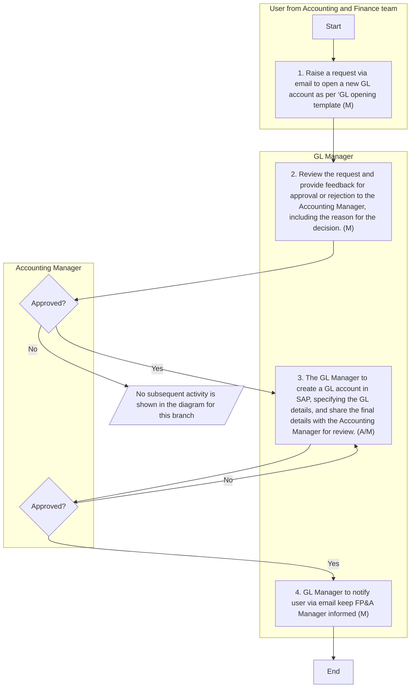
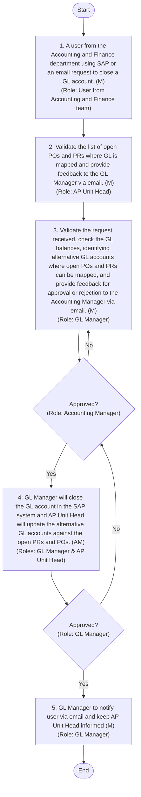
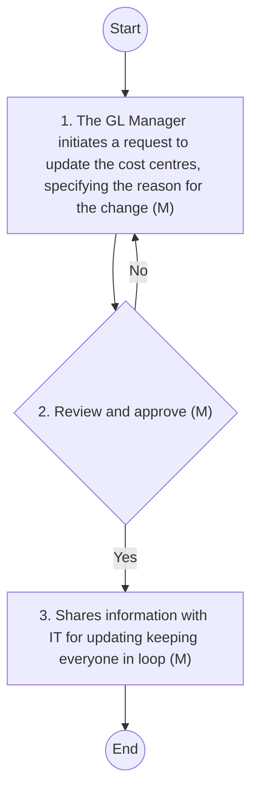
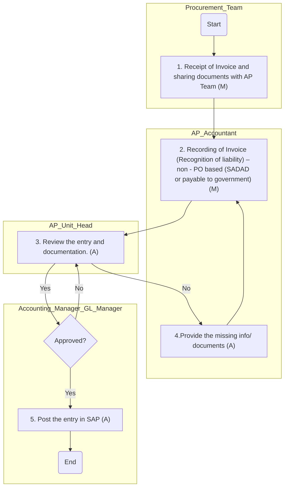
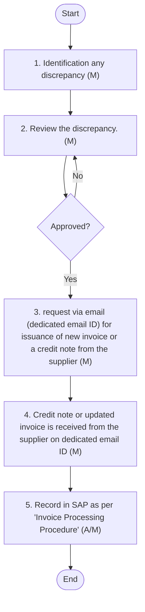
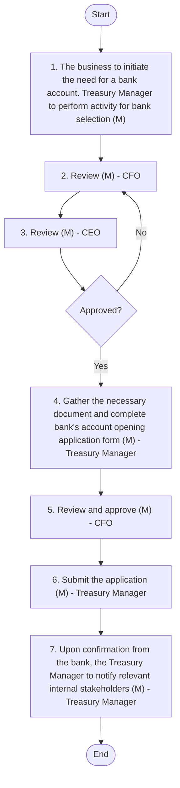
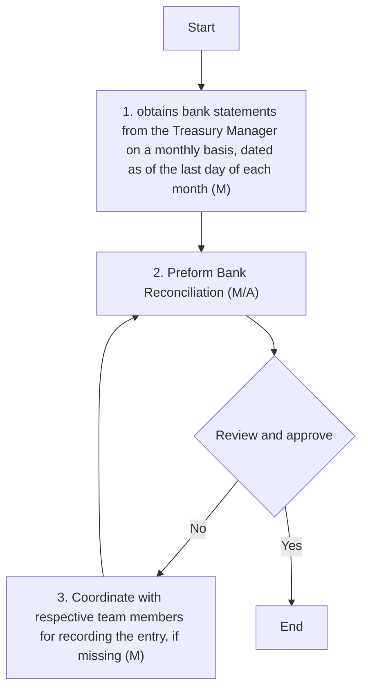
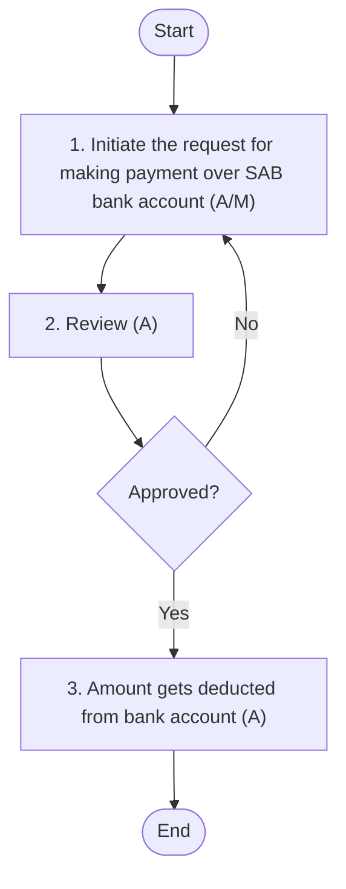
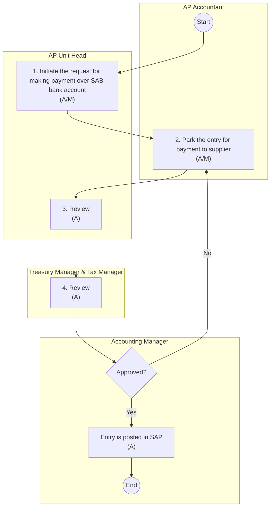

**[Diagram — PNG]:**

المطاحن  
Arabian Mills  

Description of graphic elements:
- Above the text there is a stylized golden icon resembling three overlapping leaves or grain kernels, arranged vertically (one at the top, two below).
- The Arabic text “المطاحن” is in green and appears on the first line beneath the icon.
- The English text “Arabian Mills” is in green and appears on the second line beneath the Arabic text.
ACCOUNTING MANUAL

| Accessibility: | ☒ Confidential | ☐ Controlled |  |  |
| --- | --- | --- | --- | --- |
| Version: | ☐ Draft | ☐ Revised Draft | ☒ Final Draft | ☐ Approved |
| Revision cycle | ☒ Annually |  |  |  |
DOCUMENT INFORMATION

| Category | Information |
| --- | --- |
| Document | Accounting Manual |
| Department | Accounting and Finance |
| Created by | Deloitte |
| Reviewed by | **Accounting Manager;**<br>
- FA & Tax Manager;<br>
- Treasury & Reporting Manager; and<br>
- Costing & FP&A Manager |
| Approved by |  |
| Owner of the document | CFO |
DOCUMENT REVISION HISTORY

| Description | Version Ref. | Rationale for Revision | **Created**<br>
- B y | Creat ion date | **Reviewed**<br>
- by | **Review**<br>
- date |
| --- | --- | --- | --- | --- | --- | --- |
| Original Version | 1.0 | Not applicable | Deloitte | 07 July 2025 | Accounting Manager; FA & Tax Manager; Treasury & Reporting Manager; and Costing & FP&A Manager | 08 October 2025 |
| 1 st Update | --- |  |  |  |  |  |
| 2 nd Update | --- |  |  |  |  |  |
| 3 rd Update | --- |  |  |  |  |  |
DISTRIBUTION LIST

| Department | Designation |
| --- | --- |
| Accounting and Finance | CFO |
| Sales | HOD Sales |
| Supply Chain | Supply Chain Director |
| IT | IT & Cybersecurity Manager |
| Operations | COO |

Arabian Mills for Food Products Company (the “Company” or “Arabian Mills”) is a Saudi Closed Joint Stock Company registered in Riyadh, Kingdom of Saudi Arabia under commercial registration numbered 1010465464 dated 10 Safar 1438H (corresponding to 10 November 2016). The Company’s licensed activities include Packing and grinding wheat, packing and grinding grits, semolina, and bulgur, manufacture of concentrated feed for animals, manufacture of livestock feed, wholesale of bakery products, trade of specialty and healthy foods, land transportation of goods, storage in ports and customs or free zones, and integrated office administrative services activities.
On 6 Jumada Al-Ula 1445H (corresponding to 20 November 2023), the shareholders of the Company resolved to change the name of the Company to Arabian Mills for Food Products Company.
The Company sells products under following brands:

- Finah: Various types of flour including Chapati Flour, Pizza Flour, Patent Flour, Superior Flour, Whole Wheat Flour, and Vitamin D – All Purpose Flour.

- Kamil: A range of animal feeds including Broiler Starter Feed, Pigeon Feed, Cobb Breeder Feeds, Layer Feeds, Livestock Feeds, Horse Feed, Rabbit Feed, and Experimental Animal Feed.

- Master Mills:   Various types of products including Premium Flour, Pasta, Semolina, Cake Mixes, Gluten Free products, Durum Wheat Harees and Jareesh, and Oats.

The purpose of this Accounting Manual (hereinafter referred as the “Manual”) is to lay down the policies and procedures for Accounting department, ensuring its compliance with International Financial Reporting Standards (IFRS) endorsed by the Saudi Organization for Chartered and Professional Accountants (“SOCPA”). The Manual provides clear guidelines for the financial operations of Arabian Mill ensuring consistency, accuracy, and compliance with regulatory requirements in all accounting practices. The manual outlines policies, procedures, and responsibilities related to financial transactions and reporting, promoting transparency and accountability. The manual serves to achieve the following objectives:

- Standardisation of Process:
By establishing standardised financial practices and guidelines, the manual aims to promote consistency across the organisation. This consistency will help in achieving compliance with relevant laws (including IFRS), regulations, and industry standards.

- Clear Accountability:
Each section of the manual will precisely define the roles and responsibilities of all personnel engaged in various accounting processes and procedures. This will ensure clear accountability, foster a culture of financial compliance, and minimise potential risks. Further, it promotes transparency in financial reporting by providing clear and detailed documentation of accounting policies and procedures.

- Decision Making:
The manual will serve as an indispensable reference for the Company's Management. It will assist in making informed decisions, ensuring adherence to financial best practices, and reinforcing a robust internal control environment.

- Risk Management and Internal Control:
The manual serves to mitigates financial risks through well-defined procedures. Ensures that potential issues are addressed promptly and effectively, safeguarding the Company’s financial health. The manual outlines specific procedures and controls to safeguard assets and prevent and minimise financial risks. By documenting these controls, the manual helps establish a strong system of checks and balances within the accounting department.

- Training and Development:
The manual will act as a comprehensive training tool for new employees, helping them understand the Company’s accounting policies and procedures. It will also serve as a reference guide for existing staff, ensuring they follow the correct procedures.

- Efficiency and Accuracy:
Streamlines accounting processes, improving efficiency and reducing the likelihood of errors. Enhances the accuracy of financial data, leading to more reliable financial statements.

- Facilitation of Financial Reporting:
The manual will ensure that financial reporting is conducted in a timely manner. It provides clear guidelines for the preparation and presentation of financial statements, ensuring that they meet regulatory requirements and provide a true and fair view of the company's financial position.

This manual applies to all accounting-related activities within Arabian Mills Finance department. Specifically, it covers the following areas:

- Financial Reporting: Preparation and presentation of financial statements in compliance with International Financial Reporting Standards (IFRS) endorsed by SOCPA.

- Accounts Payable: Management of outgoing payments, including processing invoices, vendor payments, and reconciliation of accounts.

- Accounts Receivable: Management of receivables, including invoicing, collections, and reconciliation processes.

- Fixed Assets: Procedures for the acquisition, depreciation, disposal, impairment of fixed assets.

- Revenue and Cost of Goods Sold (COGS): Recording and reporting of revenue and COGS to ensure accurate financial statements.

- ROU (Right-of-Use) Assets and Leases: Accounting for leases, including recognition, measurement, presentation, and disclosure of ROU assets and lease liabilities in accordance with IFRS 16.

- Accruals: Procedures for recognizing and recording accruals to ensure accurate financial reporting.

- Others: Any other accounting related activities.

This manual applies to the Accounting Department. The Manual shall be reviewed on an annual basis or as needed, to update it in line with the newly applicable accounting standards and interpretations. The manual will be a living document, subject to periodic reviews and updates to adapt to changing business needs, industry trends, and regulatory requirements. Continuous improvement will be emphasised to enhance the effectiveness of the accounting operations.

Chief Financial officer (CFO) is the document owner and is responsible for implementation of this manual. The Accounting team should ensure that this manual and the accounting policies stated therein are being followed for the preparation of the financial statements of the Company.

The CFO leads the Finance and Accounts Department of Arabian Mills. The department is organised into the following four main sections:

- Costing: Focuses on cost management and analysis to support financial decision-making.

- Accounting: Responsible for maintaining accurate financial records and ensuring compliance with IFRS endorsed by SOCPA.

- Financial Planning and Analysis (FP&A): Handles budgeting, forecasting, and financial analysis to guide strategic planning.

- Treasury & Reporting Manager: Manages cash flow, banking relationships, and investment activities to ensure financial stability and support in reporting and analysis.
Following is the structure and management of accounting department:

**[Diagram — PNG]:**

- CFO  
  - Costing and FP&A Manager  
  - Accounting Manager  
    - Riyadh & HO  
      - AR Manager and AR Accountants  
      - AP Unit Head and AP Accountants  
      - GL Manager Accounting Unit Head  
    - Hail  
      - AR Accountant  
      - AP Accountant  
      - Accounting Unit Head  
    - Jazan  
      - AR Accountant  
      - AP Accountant  
      - Accounting Unit Head  
  - FA and Tax  
  - Treasury & Reporting Manager

Following key symbols are used in the process maps in this manual:

| Figure | Explanation | Figure | Explanation |
| --- | --- | --- | --- |
|  | This symbol represents a decision. Decisions are typically phrased as yes/ no questions. This symbol usually precedes a yes / no path |  | This symbol represents input to a process. Inputs are typically information, materials or outputs from a different process |
|  | Used to display the beginning and end of a process . |  | This symbol represents a process or an activity and its usually automated process . |
|  | This symbol represents information output such as a report or document . |  | This symbol represents a set of activities that have already been defined as a process separately |
|  | This symbol represents archiving. |  | This symbol represents a link to another page with certain relevance |
|  | Legend (M) in each symbol represents nature of the control that is “Manual” should be in place for this process |  | Legend (A) in each symbol represents nature of the control that is “Automated” should be in place for this process |
|  | Legend (A/M) in each symbol represents nature of the control that is “Semi-Automated” should be in place for this process |  |  |

# Accounting Policies and Procedures
## GENERAL LEDGER AND CHART OF ACCOUNTS

Overview
A General Ledger (GL) is a comprehensive record of a Company's financial transactions over the life of the organisation. It includes all the accounts used to record the company's financial transactions, such as assets, liabilities, equity, revenues, and expenses. The GL balance will be used for the preparation of financial statements. Following are the classification used in the Company (GL Code range from 100000-499999 and from 900000-999999):

| Category | Classification | Description |
| --- | --- | --- |
| **Statement of**<br>
- Financial Position | Asset |
- Six-digit GL code starting from 1 and 2 (example: 120100, 211306 etc.) .<br>
- Assets code begin with 1,<br>
- Liability code begin with 21 ; and<br>
- Equity code begins with 22. |
| **Statement of**<br>
- Financial Position | Liability |
- Six-digit GL code starting from 1 and 2 (example: 120100, 211306 etc.) .<br>
- Assets code begin with 1,<br>
- Liability code begin with 21 ; and<br>
- Equity code begins with 22. |
| **Statement of**<br>
- Financial Position | Equity |
- Six-digit GL code starting from 1 and 2 (example: 120100, 211306 etc.) .<br>
- Assets code begin with 1,<br>
- Liability code begin with 21 ; and<br>
- Equity code begins with 22. |
| **Statement of**<br>
- Profit or Loss | Revenue |
- Six-digit GL code starting from 3 , 4 and 9. (example: 310101, 411101 , 910101, 920100 etc.) .<br>
- A ll expense GL code begins with 3 and 9 ;<br>
- GL code starting with 9 represent costs that need to be allocated across other GL accounts (example: water cost, labour cost etc etc.). The total balance of these GL accounts should always be zero by the end of the period. This includes Water Cost, Overhead Cost, Machine cost, Labour cost.<br>
- A ll revenue (including other income) and rebate on revenue GL code begins with 4 . |
| **Statement of**<br>
- Profit or Loss | Expens e |
- Six-digit GL code starting from 3 , 4 and 9. (example: 310101, 411101 , 910101, 920100 etc.) .<br>
- A ll expense GL code begins with 3 and 9 ;<br>
- GL code starting with 9 represent costs that need to be allocated across other GL accounts (example: water cost, labour cost etc etc.). The total balance of these GL accounts should always be zero by the end of the period. This includes Water Cost, Overhead Cost, Machine cost, Labour cost.<br>
- A ll revenue (including other income) and rebate on revenue GL code begins with 4 . |
The Chart of Accounts (COA) is a structured list of all General Ledger (GL) accounts, categorised into Assets, Liabilities, Equity, Revenue, and Expenditure. Additionally, it includes other codes such as Company Code, Location Code, Department Code, Profit Centres, and Cost Centres.

| S No. | Segment | Code details |  |
| --- | --- | --- | --- |
| 1 | Company code | Company code is 20 |  |
| 2 | Location code | There are 4 locations in the Company |  |
|  | Head O ffice | Code consists of ‘00’ |  |
|  | Riyadh | Code consists of ‘10’ |  |
|  | Hail | Code consists of ‘20’ |  |
|  | Jizan | Code consists of ‘30’ |  |
| 3 | Department code | There are three department code as follows: |  |
|  | Production | Code starting with 20 |  |
|  | Sales and marketing | Code starting with 30 |  |
|  | Administration | Code starting with 50 |  |
| 4 | GL Number | GL Code range from 100000-499999 and from 900000-999999 |  |
| 4 | GL Number | Assets | Six-digit GL code starting from 1 and 2. |
| 4 | GL Number | Liabilities | Six-digit GL code starting from 1 and 2. |
| 4 | GL Number | Equity | Six-digit GL code starting from 1 and 2. |
| 4 | GL Number | Revenue | Six-digit GL code starting from 3, 4, and 9. |
| 4 | GL Number | Expenditure | Six-digit GL code starting from 3, 4, and 9. |
| 4 | Profit centers |
- Profit centres are a combination of the company code and the location code. Revenue is mapped to these profit centres to ensure accurate financial tracking and reporting. There are four profit centres within the company:<br>
- 2000;<br>
- 2010;<br>
- 2020; and<br>
- 2030. |  |
| 5 | Cost centers |
- Cost centres are designated areas within the company where costs are accumulated and managed. Cost centres are applicable exclusively to costs , encompassing both expenses and assets to be purchased. These include routine operational expenses and capital expenditures. Routine costs refer to day-to-day expenses such as salaries, utilities, maintenance , cost of purchase (inventory) , while capital costs pertain to long-term assets like property, plant, and equipment.<br>
- Each cost centre is identified by a unique 10-digit code which is configured within SAP . The structure of this code is as follows:<br>
- The first two digits represent the department code.<br>
- The next two digits represent the location code.<br>
- The final six digits are random numbers representing the specific cost. |  |
Following are the policies and procedures required for opening and closing of GL account and update in COA:
#### Opening of GL Account
Policy:

- Arabian Mills adheres to a structured approach for opening GL accounts.

- Assessment and approval: A new GL account shall be created only when an existing GL account cannot be used for the request. Finance team assess the necessity for new GL accounts based on business requirements. Approval from both the GL Manager and the Accounting Manager is mandatory before any new GL account can be created.

- Request for opening GL Account: A formal request must be submitted in the prescribed format, detailing the purpose and intended usage of the new GL account. The request must align with the existing chart of accounts to ensure consistency in financial reporting.

- Review and Approval Timeline: The review and approval process for opening a new GL account shall be completed within two working days from the date of submission to ensure timely processing.

- GL number: Upon approval, GL account is created in the SAP system using established coding structure.
The following accounting procedures shall be followed:

| S No. | Procedure description | Responsibility | Fre que n c y |
| --- | --- | --- | --- |
| 1 | **Request Initiation:**<br>
- A user from A ccounting and Finance department fills a ‘GL opening form ’ to open a new GL account as per containing the following minimum requirement and share it over email with GL and Accounting Manager :<br>
- Date of request<br>
- Objectives of opening GL<br>
- Proposed GL name and sub-GL name<br>
- Proposed BS or SPL mapping<br>
- Proposed sub-classification in BS / SPL<br>
- Reason why new GL is required (specifying why it cannot be mapped to existing GL)<br>
- Any additional fields as deemed relevant. | Preparer: User from Accounting and Finance team | Frequency: As and when required |
| 2 | **Request review :**<br>
- Upon receiving the request from the user, the GL Manager reviews the request and provides feedback (for approval or rejection) on the request, which is then directed to the Accounting Manager. Based on the feedback from the GL Manager, the Accounting Manager approves or rejects the request. | **Reviewer: GL Manager**<br>
- Approver: Accounting Manager | Timeline : Within 1 day of receipt of the request |
| 3 | **GL creation in SAP**<br>
- On approval , the Accounting Manager notifies the GL Manager to create the GL account. The GL Manager create s a GL account in SAP, specifying GL classifications (i.e., assets, liabilities, equity, revenue, or expense), GL description, sub-GL details, etc. Once a GL account is created, a unique GL code is generated within SAP.<br>
- After the creation of the GL account, the GL Manager provides the following details in the email , which is directed to the Accounting Manager for final review:<br>
- GL & s ub-GL name<br>
- GL & sub-GL number<br>
- GL descriptions<br>
- Effective date of use<br>
- Based on the review in SAP, the Accounting Manager to provide final approval via email . | **Preparer: GL Manager**<br>
- Reviewer & approver: Accounting Manager | Timeline : Within 1 day from the date of approval |
| 4 | **Notification to stakeholders**<br>
- The GL Manager informs the user, keeping the FP&A Manager in the loop, and provides details or reasons for rejection. | **Informed by : GL Manager**<br>
- Informed to :<br>
- User and FP &A Manager | Frequency: U pon approval or rejection of the request |
Flow Chart:

**[Diagram — PNG]:**

Opening of GL Accounts

**Roles / Swimlanes**

- User from Accounting and Finance team  
- GL Manager  
- Accounting Manager  

---

### Steps

| Step # | Role                                  | Action                                                                                                                                                 | Decision/Next Step                                                                                          |
|--------|---------------------------------------|--------------------------------------------------------------------------------------------------------------------------------------------------------|-------------------------------------------------------------------------------------------------------------|
| 0      | User from Accounting and Finance team | **Start**                                                                                                                                                | Proceeds to Step 1                                                                                          |
| 1      | User from Accounting and Finance team | Raise a request via email to open a new GL account as per ‘GL opening template (M)                                                                     | Proceeds to Step 2                                                                                          |
| 2      | GL Manager                            | Review the request and provide feedback for approval or rejection to the Accounting Manager, including the reason for the decision. (M)               | Proceeds to Decision D1                                                                                     |
| D1     | Accounting Manager                    | **Decision:** Approved?                                                                                                                                | Yes → Step 3; No → (No subsequent activity is shown in the provided diagram for this branch)               |
| 3      | GL Manager                            | The GL Manager to create a GL account in SAP, specifying the GL details, and share the final details with the Accounting Manager for review. (A/M)   | Proceeds to Decision D2                                                                                     |
| D2     | Accounting Manager                    | **Decision:** Approved?                                                                                                                                | Yes → Step 4; No → Step 3 (loop back to GL Manager to recreate/adjust and reshare GL account details)      |
| 4      | GL Manager                            | GL Manager to notify user via email keep FP&A Manager informed (M)                                                                                    | Proceeds to Step 5                                                                                          |
| 5      | —                                     | **End**                                                                                                                                                 | —                                                                                                           |

---

### Mermaid.js diagram


#### Closing/deactivation of GL account
- At Arabian Mills, the closure of a GL account is governed by a structured policy to ensure financial accuracy and compliance.

- GL Balance verification: A GL account shall only be closed if its balance is nil.

- Open PO and PR associated with GL: Any open Purchase Orders (PO) or Purchase Requisitions (PR) associated with the GL account must be reassigned to an alternate GL account to maintain continuity in financial operations.

- Formal Closure Request: A formal closure request must be submitted to the GL Manager and Accounting Manager, detailing the rationale for the account closure and confirming the completion of all related financial activities. The request must include verification that all transactions have been settled and that the account balance is zero.

- Approval requirement: Approval from both the GL Manager and the Accounting Manager is mandatory before any GL account can be deactivated in SAP.

- Timeline: The review and approval process for closing a GL account shall be completed within two working days from the date of submission to ensure timely processing.

- Deactivation: Upon approval, the GL account shall be deactivated in the accounting system to prevent any further transactions.
The following accounting procedures shall be followed:

| S No. | Procedure description | Responsibility | Frequency |
| --- | --- | --- | --- |
| 1 |
- Request for closure of a GL account can be done in two ways : request initiation and internal review.<br>
- Request Initiation : A user from the Accounting and Finance department using SAP sends an email to the GL Manager, AP Unit Head , and Accounting Manager. The email specifies the requirement, reason for closure, details of the existing account, and any necessary balance transfer to another GL account.<br>
- Internal Review : The GL Manager conducts a monthly assessment of GL accounts to determine if any need closing. If a redundant account is identified and has not been used for a reasonable period, the GL Manager informs the Accounting Manager to initiate its closure. | **Preparer: User from Accounting and F i nance team**<br>
- Monitored by: GL Manager | **Frequency: As and when required**<br>
- Frequency: Monthly |
| 2 | **Request review & approval :**<br>
- Upon receiving the form from the user containing details of GL , the AP Unit Head validates the list of open PR and PO where the GL is mapped and provides feedback to the GL Manager via email.<br>
- Upon receiving feedback from the FP&A Manager, the GL Manager validates the request received, checks the GL balance, identifies alternative GL accounts where open POs and PRs can be mapped, and provides feedback for approval or rejection to the Accounting Manager via email.<br>
- Based on the feedback from the GL Manager, the Accounting Manager approves or rejects the request via email, keeping the CFO in loop . | **Reviewer 1: AP Unit Head**<br>
- Reviewer 2 : GL Manager<br>
- Approver : Accounting Manager<br>
- Informed : CFO | Timeline : Within 1 day of receipt of the request |
| 3 | **Deactivation in SAP:**<br>
- On approval , the GL Manager closes the GL account in the SAP system and the AP Unit Head updates the alternative GL account against the open PRs and POs and inform s the Accounting Manager . | **Performed by : GL Manager and AP Unit Head**<br>
- Reviewer & approver: Accounting Manager | Timeline : Within 1 day from the date of approval |
| 4 | **Notification to stakeholders**<br>
- The GL Manager responds to the user via specifying the GL account closure or reason for the rejection. | Email by: GL Manager | Frequency: Immediately upon final approval of the GL account creation or rejection of the request |
Flow Chart:

**[Diagram — Visio-EMF→PNG]:**

**Process Name:** Closing/Deactivating of GL Accounts  

**Roles / Swimlanes:**
- User from Accounting and Finance team
- AP Unit Head
- GL Manager
- Accounting Manager

---

### Steps

| Step # | Role | Action | Decision/Next Step |
|--------|------|--------|--------------------|
| 0 | User from Accounting and Finance team | **Start** | Proceeds to Step 1 |
| 1 | User from Accounting and Finance team | 1. A user from the Accounting and Finance department using SAP or an email request to close a GL account. (M) | Proceeds to Step 2 |
| 2 | AP Unit Head | 2. Validate the list of open POs and PRs where GL is mapped and provide feedback to the GL Manager via email. (M) | Proceeds to Step 3 |
| 3 | GL Manager | 3. Validate the request received, check the GL balances, identifying alternative GL accounts where open POs and PRs can be mapped, and provide feedback for approval or rejection to the Accounting Manager via email. (M) | Proceeds to Decision D1 |
| D1 | Accounting Manager | **Approved?** | If **Yes** → Step 4. If **No** → back to Step 3 (request to re‑validate / reconsider) |
| 4 | GL Manager (and AP Unit Head) | 4. GL Manager will close the GL account in the SAP system and AP Unit Head will update the alternative GL accounts against the open PRs and POs. (AM) | Proceeds to Decision D2 |
| D2 | GL Manager | **Approved?** | If **Yes** → Step 5. If **No** → back to Decision D1 for further review/approval |
| 5 | GL Manager | 5. GL Manager to notify user via email and keep AP Unit Head informed (M) | Proceeds to Step 6 |
| 6 | — | **End** | — |

---

### Mermaid.js flow


#### Update in Chart of Accounts
- No modifications or additions shall be made to any COA without prior written approval from the Accounting Manager, FP&A Manager, CFO and/or IT team.

- Any request for an update in the COA must clearly define the business justification, intended use, and applicable mapping to financial statements or management reports.

- All changes to the COA must be documented, version-controlled, and retained in the master COA log with effective date and responsible approver details.

- Deactivation of any existing COA element is only permitted after ensuring that there are no open transactions, balances, or reporting dependencies linked to that element.

- Changes to the COA that impact external financial reporting must be reviewed for compliance with IFRS endorsed by SOCPA.
The following accounting procedures shall be followed:

| S No. | Procedure description | Responsibility | Description |
| --- | --- | --- | --- |
| 1 | **Request for change in cost center :**<br>
- The GL Manager initiates a request to update the cost centres, specifying the reason for the change.<br>
- The Accounting Manager and FP&A Manager provides feedback on the request initiated by the GL Manager for updating the cost centre, keeping the CFO in the loop.<br>
- Upon approval, the GL Manager updates the cost centres in SAP , and the Accounting Manager reviews the changes. | **Preparer: GL Manager**<br>
- Reviewer and approver : Accounting Manager and FP&A Manager<br>
- Informed: CFO | Frequency: Whenever there is a requirement |
| 2 | **Monitoring of GL account, Cost Centers :**<br>
- The Accounting Manager and FP&A Manager regularly reconciles GL account and cost centre master data on a monthly basis, ensuring that any new GL accounts and cost centres are established based on requests received during the month. | **Monitored by :**<br>
- Accounting Manager and FP&A Manager | Frequency: Monthly |
| 3 | **Request for new location**<br>
- The GL Manager or Accounting Manager initiates a request for the creation of a new location to IT after obtaining approval from the CFO for creating a new location, if any, based on business decisions , keeping FP&A Manager informed . The IT team initiates the process for adding the new location. |
- Request initiated by : Accounting team approved by CFO .<br>
- Informed: FP&A Manager<br>
- Created by : IT team | Frequency: Whenever there is a new location |
Flow Chart

**[Diagram — PNG]:**

**Process Name:** Update COA  

**Roles / Swimlanes:**
- GL Manager  
- Accounting Manager and FP&A Manager  

---

### Steps

| Step # | Role                                   | Action                                                                                                 | Decision/Next Step                                                                                               |
|--------|----------------------------------------|--------------------------------------------------------------------------------------------------------|------------------------------------------------------------------------------------------------------------------|
| 0      | GL Manager                             | Start                                                                                                  | Proceed to step 1                                                                                                |
| 1      | GL Manager                             | 1. The GL Manager initiates a request to update the cost centres, specifying the reason for the change (M) | Send request to Accounting Manager and FP&A Manager for review and approval (step 2). If not approved, return here from step 2 via “No”. |
| 2      | Accounting Manager and FP&A Manager    | 2. Review and approve (M)                                                                              | **Yes:** If approved, proceed to step 3. **No:** Return to step 1.                                              |
| 3      | GL Manager                             | 3. Shares information with IT for updating keeping everyone in loop (M)                                | Proceed to step 4                                                                                                |
| 4      | GL Manager                             | End                                                                                                    | Process terminates                                                                                               |

**Branching logic:**
- From step 2 (“Review and approve (M)”):  
  - **Yes** → step 3 (“Shares information with IT for updating keeping everyone in loop (M)”)  
  - **No** → back to step 1 (“The GL Manager initiates a request to update the cost centres, specifying the reason for the change (M)”)

---



Overview
Accounts Payable (AP) is a critical function within the accounting department that manages the Company's obligations to pay off short-term debts to its creditors or suppliers. Efficient management of accounts payable ensures that the company maintains good relationships with its suppliers, avoids late payment penalties, and accurately reflects its financial position in the financial statements. This policy governs the entire lifecycle of payables, including invoice receiving, processing, confirmation, and reconciliation. This manual encompasses various aspects of accounts payable and accruals, including:

- PO-Based Invoice Processing: Purchase Order (PO)-based invoice processing involves verifying invoices against purchase orders and goods receipt notes to ensure accuracy before payment. This process ensures that payments are made only for goods and services that have been received and approved.

- Non-PO-Based Invoice Processing: This involves checking and approving invoices without a purchase order, ensuring payments are made correctly for goods or services received, based on the invoice details.

- Issuance of Debit Note / Receipt of Credit Note: Debit notes are issued to suppliers for returned goods or services, while credit notes are received from suppliers for adjustments or corrections in invoicing. This process ensures accurate accounting and reconciliation of supplier accounts.

- Creditors Ageing: Creditors ageing involves analysing the outstanding balances owed to suppliers, categorised by the length of time they have been outstanding, credit terms, and invoice date. This process helps in managing payment schedules and maintaining good relationships with suppliers.

- GR IR Reconciliation: Goods Receipt/Invoice Receipt (GR IR) reconciliation involves matching goods received with invoices received to ensure that all goods have been invoiced correctly. This process helps in identifying discrepancies and ensuring accurate accounting.

- Payable Reconciliation and Balance Confirmation: Payable reconciliation involves verifying the accuracy of accounts payable balances by comparing internal records with supplier statements. Balance confirmations are obtained from suppliers to ensure that the recorded balances are accurate and agreed upon.

- Accrual Management – Non-PO-Based Approvals: Non-PO-based accrual management involves recognising expenses that have been incurred but not yet invoiced, based on internal approvals. This ensures that financial statements accurately reflect the company's liabilities for services or goods received without a purchase order.

- Accrual Management – PO-Based Accruals: PO-based accrual management involves recognising expenses that have been incurred but not yet invoiced, where the purchase order is still under the approval stage, but the service has been either fully or partially availed. This process ensures that financial statements accurately reflect the company's liabilities related to purchase orders in progress.
#### PO based invoice processing
- All goods and services must be procured through approved POs unless explicitly exempted (refer to non-PO-based invoice processing).

- The generation of POs is conducted in accordance with the Supply Chain (SC) policy, ensuring alignment with procurement standards.

- Suppliers are required to send invoices to a dedicated email ID accessible by both the procurement and AP departments. All invoices received require validation by the Procurement team and user department before processing by the accounting department.

- All accounting entries related to invoice processing shall be parked by one personnel (AP team) and posted in SAP once approved by another personnel (final approver) via workflow.

- Processing time for PO-based invoices shall not exceed 3 working days from the date of receipt of the invoice.
The following accounting procedures shall be followed:

| S No. | Procedure description | Responsibility | Frequency |
| --- | --- | --- | --- |
| 1 | **Generation of PO**<br>
- Refer S upply C hain (SC) policy and procedure document for generation of PO. | Refer SC P&P |  |
| 2 | **Receipt of goods/service**<br>
- Once goods are procured or services are availed, the receiving department user generates a Goods/Service Receipt Note (GSRN) in SAP according to SC policy and procedure.<br>
- The system automatically records the following entry in SAP at the time of generation of the Goods Receipt/Service Receipt Note (GSRN):<br>
- Inventory a/c OR Expense a/c     Dr.   xx<br>
- GR/IR                                        Cr.   xx | Refer SC P&P |  |
| 3 | **Receipt of invoice and sharing documents with AP Team**<br>
- Suppliers send invoices to a dedicated email ID accessible by the procurement and AP departments. The procurement team validates the invoice, obtains approval from the user department, and provides the approved PO, GSRN, and invoice to the AP team digitally for processing. | **Documents received by: Procurement and AP Team**<br>
- Documents to be shared by : Procurement Team | Frequency: 2 day s from the date of receipt of invoice |
| 4 | **Recording of invoice (Recognition of liability) – PO based**<br>
- Upon receiving the digital copy of the approved invoice, PO, GSRN, and other documents, the AP Accountant parks the auto-generated entry in the system within 1 working day from the date of receipt of documents from the procurement team. The AP Unit Head reviews this entry, and the GL Manager/Accounting Manager approve it. On approval (via workflow), the system posts the entry in SAP.<br>
- GR/IR                             Dr.   xx<br>
- VAT                               Dr.   xx<br>
- Supplier account             Cr.   xx<br>
- In SAP, the total invoice amount cannot exceed the PO value and is only processed if it matches the GSRN. VAT entries are generated based on predefined codes and are validated by the Tax Manager or Tax consultants. | **Preparer: AP Accountant**<br>
- Reviewer: AP Unit Head<br>
- Reviewer: GL Manager or Accounting Manager | Frequency: 1 day from the date of receipt of documents |
| 5 | **Payment of Liability**<br>
- Refer PO based and non-PO based payment under ‘Cash Management’ for details | Refer section ‘Cash Management’ in this manual |  |
Flow Chart:

**[Diagram — PNG]:**

**Process Name**

PO based invoice processing and payment

---

**Roles / Swimlanes**

- Supply Chain Team  
- Procurement Team  
- AP Accountant  
- AP Unit Head  
- Accounting Manager / GL Manager  

---

### Steps

| Step # | Role                         | Action                                                                                                                | Decision/Next Step                                                                                                                                                 |
|--------|------------------------------|------------------------------------------------------------------------------------------------------------------------|--------------------------------------------------------------------------------------------------------------------------------------------------------------------|
| 1      | Supply Chain Team            | Start                                                                                                                 | Proceeds to “Generation of PO”.                                                                                                                                    |
| 2      | Supply Chain Team            | Generation of PO                                                                                                      | Proceeds to “Receipt of goods/ services (System generated entry for GR/IR)”.                                                                                       |
| 3      | Supply Chain Team            | Receipt of goods/ services (System generated entry for GR/IR)                                                         | Proceeds to “1. Receipt of invoice on dedicated email ID; and sharing all approved documents with AP Team (M)”.                                                   |
| 4      | Procurement Team             | 1. Receipt of invoice on dedicated email ID; and sharing all approved documents with AP Team (M)                      | Proceeds to “2. Recording of Invoice (Recognition of liability) – PO based (A)”.                                                                                   |
| 5      | AP Accountant                | 2. Recording of Invoice (Recognition of liability) – PO based (A)                                                     | Proceeds to “3. Review the entry and documentation. (A)”.                                                                                                          |
| 6      | AP Unit Head                 | 3. Review the entry and documentation. (A)                                                                            | Proceeds to decision “Approved?” handled by Accounting Manager / GL Manager.                                                                                       |
| 7      | Accounting Manager / GL Manager | Approved?                                                                                                              | **Yes:** Proceeds to “5. The entry get posted in SAP once approved (A)”.  **No:** Proceeds to “4.Provide the missing info/ documents (A)”.                         |
| 8      | AP Accountant                | 4.Provide the missing info/ documents (A)                                                                             | Returns to “2. Recording of Invoice (Recognition of liability) – PO based (A)” for re-recording and then back through review and approval.                        |
| 9      | Accounting Manager / GL Manager | 5. The entry get posted in SAP once approved (A)                                                                      | Proceeds to “End”.                                                                                                                                                 |
| 10     | Accounting Manager / GL Manager | End                                                                                                                   | Process terminates.                                                                                                                                                |

---

### Explicit Yes/No Branches from “Approved?”

- From **“Approved?” (Accounting Manager / GL Manager)**  
  - **Yes** → “5. The entry get posted in SAP once approved (A)” → “End”.  
  - **No** → “4.Provide the missing info/ documents (A)” → back to “2. Recording of Invoice (Recognition of liability) – PO based (A)” and then re-review and re-approval.

---

```mermaid
graph TD

A[Start] --> B[Generation of PO]
B --> C[Receipt of goods/ services<br/>(System generated entry for GR/IR)]
C --> D[1. Receipt of invoice on dedicated email ID; and sharing all approved documents with AP Team (M)]
D --> E[2. Recording of Invoice (Recognition of liability) – PO based (A)]
E --> F[3. Review the entry and documentation. (A)]
F --> G{Approved?}
G -- Yes --> H[5. The entry get posted in SAP once approved (A)]
H --> I[End]
G -- No --> J[4.Provide the missing info/ documents (A)]
J --> E
```
#### Non-PO based invoice processing
- At Arabian Mills, non-PO-based invoicing is permitted only for predefined categories of expenses where purchase orders are not practical or applicable i.e., utilities, government fees, petty expenses, statutory dues or similar expenses.

- Under no circumstances shall material purchases of goods or capital expenditure be processed through non-PO invoicing; such invoices must be rejected or routed through proper procurement channels.

- Suppliers are required to send invoices to a dedicated email ID accessible by both the procurement and AP departments. All invoices received require validation by the Procurement team and user department before processing by the accounting department.

- All non-PO invoices must be supported by appropriate documentation, including departmental authorization, prior to accounting recognition. Processing time for non-PO based invoices shall not exceed 3 working days from the date of receipt of the invoice.

- All accounting entries related to invoice processing shall be parked by one personnel (AP team) and posted in SAP once approved by another personnel (final approver) via workflow.

- The payment of non-PO-based liabilities is managed under the Cash Management section.
The following accounting procedures shall be followed:

| S No. | Procedure description | Responsibility | Frequency |
| --- | --- | --- | --- |
| 1 | **Receipt of invoice and sharing documents with AP Team**<br>
- All suppliers must send invoices to a dedicated email ID accessible by procurement and AP departments. The procurement team validates the invoice, obtains approval from the user department, and shares all documents with the AP team for processing. | **Documents received by: Procurement and AP Team**<br>
- Documents to be shared by: Procurement Team | Frequency: 2 day s from the date of receipt of invoice |
| 2 |
- Recording of invoice / recognition of liability – non-PO based (SADAD or payable to government)<br>
- Upon receiving the copy of the approved invoice and other documents, the AP Accountant validates the documents and, post-validation, parks the entry in SAP. The AP Unit Head reviews this entry, and the GL Manager/Accounting Manager approve it. On approval , the system posts the entry in SAP (via workflow).<br>
- Expense                             Dr.   xx<br>
- VAT                                   Dr.   xx<br>
- Supplier account                Cr.   xx<br>
- The Tax Manager or consultants validate VAT entries, which are generated based on predefined codes. | **Preparer: AP Accountant**<br>
- Reviewer: AP Unit Head<br>
- Reviewer: GL Manager or Accounting Manager | Frequency: 1 day from the date of receipt of documents |
| 3 | **Payment of Liability**<br>
- Refer PO based and non-PO based payment under Cash Management for details |  |  |
Flow Chart:

**[Diagram — PNG]:**

**Process Name:**  
NON - PO based invoice processing and payment

**Roles / Swimlanes:**

- Procurement Team
- AP Accountant
- AP Unit Head
- Accounting Manager / GL Manager

---

### Steps

| Step # | Role                             | Action                                                                                                           | Decision/Next Step                                                                                                                                                  |
|--------|----------------------------------|------------------------------------------------------------------------------------------------------------------|---------------------------------------------------------------------------------------------------------------------------------------------------------------------|
| 0      | Procurement Team                 | Start                                                                                                            | Proceed to step 1.                                                                                                                                                   |
| 1      | Procurement Team                 | **1. Receipt of Invoice and sharing documents with AP Team (M)**                                                | Proceed to step 2.                                                                                                                                                   |
| 2      | AP Accountant                    | **2. Recording of Invoice (Recognition of liability) – non - PO based (SADAD or payable to government) (M)**    | Proceed to step 3.                                                                                                                                                   |
| 3      | AP Unit Head                     | **3. Review the entry and documentation. (A)**                                                                   | If **Yes** (entry and documentation acceptable) → step 5 “Approved?”. If **No** → step 4 “4.Provide the missing info/ documents (A)”.                               |
| 4      | AP Accountant                    | **4.Provide the missing info/ documents (A)**                                                                    | After providing missing information/documents, proceed back to step 2 “2. Recording of Invoice (Recognition of liability) – non - PO based (SADAD or payable to government) (M)”. |
| 5      | Accounting Manager / GL Manager  | **Approved?**                                                                                                    | If **Yes** → step 6 “5. Post the entry in SAP (A)”. If **No** → return to step 3 “3. Review the entry and documentation. (A)”.                                      |
| 6      | Accounting Manager / GL Manager  | **5. Post the entry in SAP (A)**                                                                                | Proceed to step 7.                                                                                                                                                   |
| 7      | Accounting Manager / GL Manager  | End                                                                                                              | Process complete.                                                                                                                                                    |

---

### Yes/No Branches (Explicit)

- From step 3 “3. Review the entry and documentation. (A)”:
  - **Yes** → step 5 “Approved?”
  - **No** → step 4 “4.Provide the missing info/ documents (A)”

- From step 5 “Approved?”:
  - **Yes** → step 6 “5. Post the entry in SAP (A)” → step 7 “End”
  - **No** → back to step 3 “3. Review the entry and documentation. (A)”

---

### Mermaid.js Flow


#### Issuance of debit note / receipt of credit note
- All credit notes received from suppliers must relate to previously invoiced transactions and reference the original invoice number and PO (if applicable).

- Credit notes are accepted only for valid reasons, such as goods returned, pricing errors, quantity discrepancies, or service deficiencies, supported by adequate documentation.

- Credit notes must be approved by the Procurement and relevant business unit before being recorded in SAP.

- Offsetting of credit notes against future invoices is permitted only upon verification and alignment with supplier account reconciliation.

- Any credit note affecting prior reporting periods must be evaluated for materiality and disclosure in line with IFRS.

- Unjustified or unsupported credit notes must be rejected and escalated to Procurement or Legal for resolution.

- All credit notes must be recorded in the period in which they are received and must not be backdated or used to manipulate expense recognition.
The following accounting procedures shall be followed:

| S No. | Procedure description | Responsibility | Frequency |
| --- | --- | --- | --- |
| 1 | **Identification of discrepancy**<br>
- If a discrepancy is identified in invoice of the supplier ( eg: amount of invoice , description of service) , the AP Accountant discusses this with the AP Unit Head and obtains approval from the Accounting Manager and the respective department head. Discrepancies can be identified by comparing the invoice received, approved PO, contract signed, GSRN, and other relevant documents. | **Preparer: AP Accountant**<br>
- Reviewer: AP Unit Head<br>
- Approver: Accounting M anager and respective Department Head | Frequency: If any discrepancy noticed |
| 2 | **D ebit / credit note**<br>
- When a discrepancy is identified, the AP team (AP Accountant/AP Unit Head) requests for the issuance of a new invoice or a credit note from the supplier, keeping the Accounting Manager informed. | **Email by : AP team**<br>
- Informed: Accounting Manager | Frequency: 1 day from the date of approval discrepancy identified |
| 3 | **Receipt of credit note from the supplier**<br>
- Once the credit note or updated invoice is received from the supplier on the dedicated email ID, the procurement team validates it and the AP team records it in SAP as per the ‘Invoice Processing Procedure’. | Receipt by : Procurement and AP team | Frequency: After receipt of c redit note / updated invoice |
Flow Chart

**[Diagram — PNG]:**

**Process Name:** Issuance of debit note / receipt of credit note  

**Roles / Swimlanes:**
- Procurement Team
- AP Accountant
- AP Unit Head
- Accounting Manager / GL Manager

---

### Steps

| Step # | Role                          | Action                                                                                                                                                | Decision/Next Step                                                                                                      |
|--------|-------------------------------|-------------------------------------------------------------------------------------------------------------------------------------------------------|-------------------------------------------------------------------------------------------------------------------------|
| 0      | Procurement Team              | Start                                                                                                                                                 | Next: Step 1.                                                                                                           |
| 1      | AP Accountant                 | 1. Identification any discrepancy (M)                                                                                                                 | Next: Step 2.                                                                                                           |
| 2      | AP Unit Head                  | 2. Review the discrepancy. (M)                                                                                                                       | Next: Step 3 (“Approved?” decision).                                                                                     |
| 3      | Accounting Manager / GL Manager | Approved?                                                                                                                                             | If Yes: proceed to Step 4. If No: return to Step 2 (“2. Review the discrepancy. (M)”).                                  |
| 4      | AP Unit Head                  | 3. request via email (dedicated email ID) for issuance of new invoice or a credit note from the supplier (M)                                         | Next: Step 5.                                                                                                           |
| 5      | Procurement Team              | 4. Credit note or updated invoice is received from the supplier on dedicated email ID (M)                                                            | Next: Step 6.                                                                                                           |
| 6      | AP Accountant                 | 5. Record in SAP as per ‘Invoice Processing Procedure’ (A/M)                                                                                         | Next: Step 7 (End).                                                                                                     |
| 7      | AP Accountant                 | End                                                                                                                                                   | Process ends.                                                                                                           |

**Explicit Yes/No Branches from Decision “Approved?” (Step 3):**

- **Yes** → Step 4: “3. request via email (dedicated email ID) for issuance of new invoice or a credit note from the supplier (M)”.
- **No** → back to Step 2: “2. Review the discrepancy. (M)”.

---


#### Creditors ageing
- Creditors ageing must be prepared and reviewed weekly to ensure timely identification of overdue liabilities.

- Ageing must be prepared from due date of payment.

- Ageing reports classify balances by due dates and supplier categories in alignment with payment terms.

- Balances under dispute or litigation must be separately disclosed and not considered due for payment.

- Unreconciled or long-outstanding balances must be assessed for write-back or provision in line with IFRS.

- The ageing report must be reconciled with the general ledger and supplier statements regularly.

- Any payable balances outstanding for more than 30 days must be discussed with the CFO to determine appropriate action.
The following accounting procedures shall be followed:

| S No. | Procedure description | Responsibility | Frequency |
| --- | --- | --- | --- |
| 1 | **Ageing Report**<br>
- The finance team utilises the ageing report generated directly by SAP to determine AP ageing.<br>
- The report is automatically generated within SAP, ensuring efficiency and accuracy.<br>
- On a weekly basis, the AP Accountant extracts the AP ageing report, which consists of supplier-wise and invoice-wise ageing.<br>
- The AP Accountant shares the report with the AP Unit Head and Accounting Manager for review.<br>
- The age of suppliers is generally within the due date or a maximum of one month from the due date. | **Preparer: AP Accountant**<br>
- Reviewer: AP Unit Head and Accounting Manager<br>
- Discussed: CFO | Frequency: Weekly |
Flow Chart

**[Diagram — PNG]:**

**Process Name:** Creditors Ageing

**Roles / Swimlanes:**

- SAP  
- AP Accountant  
- AP Unit Head/ Accounting Manager  
- CFO  

---

### Steps

| Step # | Role                               | Action                                                                                          | Decision/Next Step                                   |
|--------|------------------------------------|-------------------------------------------------------------------------------------------------|------------------------------------------------------|
| S0     | SAP                                | Start                                                                                           | Proceed to Step 1                                    |
| 1      | AP Accountant                      | Extract the AP ageing report, which consists of supplier-wise and invoice-wise ageing (A)      | Proceed to Step 2                                    |
| 2      | AP Unit Head/ Accounting Manager   | Review the report. (M)                                                                          | Proceed to Step 3                                    |
| 3      | CFO                                | Discuss the Payment decision if due date is exceed on month (M)                                | Proceed to Step E (End)                              |
| SE     | CFO                                | End                                                                                             | Process completed                                    |

*Note: No explicit Yes/No decision branches are depicted in the diagram; the flow is purely sequential as shown above.*

---

```mermaid
graph TD

    %% Roles as subgraphs (swimlane-style grouping)
    subgraph SAP
        S0((Start))
    end

    subgraph "AP Accountant"
        S1[1. Extract the AP ageing report, which consists of supplier-wise and invoice-wise ageing (A)]
    end

    subgraph "AP Unit Head/ Accounting Manager"
        S2[2. Review the report. (M)]
    end

    subgraph CFO
        S3[3. Discuss the Payment decision if due date is exceed on month (M)]
        SE((End))
    end

    S0 --> S1 --> S2 --> S3 --> SE
```
#### GR IR reconciliation
- At Arabian Mills, the GR/IR account is used exclusively for PO based services and goods received but not yet invoiced.

- GR/IR reconciliation is the joint responsibility of Finance and Procurement.

- Goods receipts must be recorded with reference to the Purchase Order (PO)

- GR/IR accounts must be reconciled monthly to identify unmatched goods receipts and invoices.

- GR/IR balances older than 30 days must be reviewed and cleared with Procurement and AP and escalated to the respective department heads for resolution.

- Significant variances must be disclosed in monthly closing notes to management.
The following accounting procedures shall be followed:

| S No. | Procedure description | Responsibility | Frequency |
| --- | --- | --- | --- |
| 1 | **Extraction of GR IR report**<br>
- The GL Manager extracts the GR/IR report from SAP, detailing supplier-wise and Goods/Service Receipt Note (GSRN) wise information . | Extracted by : GL Manager | Frequency: Monthly ( last week) |
| 2 | **Validation**<br>
- The GL Manager validates the GR/IR balance on a monthly basis to ensure that quantities and prices match the purchase orders.<br>
- The GL Manager notes any discrepancies for further investigation.<br>
- Once validated, the GL Manager shares the report with the Accounting Manager for review of the final working.<br>
- The report includes a detailed list of suppliers where invoices are due but not yet received.<br>
- The GL Manager shares the approved final working with the AP Unit Head for further action | **Preparer: GL Manager**<br>
- Reviewer: Accounting Manager<br>
- Share with : AP Unit Head | Timeline : Within 1 day from review by Accounting Manager |
| 3 | **Follow-up with the Supplier**<br>
- The AP Unit Head or AP Accountant follows up with the procurement department, who in turn follows up with relevant suppliers to expedite the receipt of outstanding invoices. This involves contacting suppliers to inquire about the status of pending invoices. Once the invoice is received and processed, the GR/IR balance reverses automatically as per invoice processing procedures. | Email by: AP Team (AP Unit Head or AP Accountant) | Frequency: Monthly (First week) |
| 4 | **Reviewing and clearing**<br>
- GR/IR balances older than 30 days must be reviewed and cleared with Procurement and AP and escalated to the respective department heads for resolution.<br>
- The AP Unit Head follows up on these balances, keeping the GL Manager, Accounting Manager and CFO in the loop.<br>
- Department heads must arrange for the invoice to be provided within the next 5 working days. | **Email by: AP Unit Head**<br>
- Informed: GL Manager, A ccounting Manager and CFO | Frequency: Monthly (First week) |
Flow Chart

**[Diagram — Visio-EMF→PNG]:**

**Process Name:** GR IR reconciliation  

**Roles / Swimlanes:**
- SAP  
- GL Manager  
- Accounting Manager  
- AP Unit Team  

### Steps

| Step # | Role             | Action | Decision/Next Step |
|--------|------------------|--------|--------------------|
| 0      | SAP              | Start | Proceeds to Step 1 |
| 1      | GL Manager       | Extract the GR/IR report from SAP, detailing supplier-wise and Goods/ Service Received Note (GRN) wise information. (A) | Proceeds to Step 2 |
| 2      | GL Manager       | Review validates the GR/IR balance on a monthly basis and shares the report with the Accounting Manager via e-mail for review of the final working. (M) | Proceeds to Step 3 |
| 3      | Accounting Manager | Review the final working and approve. (M) | Proceeds to Step 4 |
| 4      | AP Unit Team     | Follows up with the procurement department, which in turn follows up with relevant suppliers to expedite the receipt of outstanding invoices. Once the invoice is received and processed, the GR/IR balance is reversed automatically as per invoice processing procedures. (M) | Proceeds to Step 5 |
| 5      | AP Unit Team     | End | — |

### Mermaid.js Flow

```mermaid
graph TD

    A0([Start]):::sap

    A1["1. Extract the GR/IR report from SAP, detailing supplier-wise and Goods/ Service Received Note (GRN) wise information. (A)"]:::gl
    A2["2. Review validates the GR/IR balance on a monthly basis and shares the report with the Accounting Manager via e-mail for review of the final working. (M)"]:::gl

    A3["3. Review the final working and approve. (M)"]:::acctmgr

    A4["4. Follows up with the procurement department, which in turn follows up with relevant suppliers to expedite the receipt of outstanding invoices. Once the invoice is received and processed, the GR/IR balance is reversed automatically as per invoice processing procedures. (M)"]:::ap

    A5([End]):::ap

    A0 --> A1 --> A2 --> A3 --> A4 --> A5

    classDef sap fill=#ffffff,stroke=#000000,stroke-width=1px;
    classDef gl fill=#ffffff,stroke=#000000,stroke-width=1px;
    classDef acctmgr fill=#ffffff,stroke=#000000,stroke-width=1px;
    classDef ap fill=#ffffff,stroke=#000000,stroke-width=1px;
```
#### Balance confirmation and AP Reconciliation
Policy:

- At Arabian Mills, the reconciliation of payables and balance confirmation is performed as per following table:

| Process | Frequency |
| --- | --- |
| Balance Confirmation | Month-end, Quarter -end and year-end |
| AP Reconciliation | Monthly |

- Balance confirmation from key suppliers is mandatory. Key suppliers would include suppliers of raw material including major suppliers identified based on the judgement of the AP Unit Head, GL Manager, Accounting Manager and CFO, as of reporting date.

- Supplier ledgers must be reconciled monthly with external statements to ensure accuracy of payable balances.

- All differences arising from reconciliation must be investigated and corrected in the appropriate period.

- Non-responsive suppliers must be followed up at least twice before alternative audit evidence is used.

- Unauthorized manual adjustments in suppliers accounts are prohibited without documented approval.

- Payable reconciliations must be retained as part of period-end close documentation.

- Significant unresolved variances must be disclosed to auditors and management.
Procedure:
The following accounting procedures shall be followed:

| S No. | Procedure description | Responsibility | Frequency |
| --- | --- | --- | --- |
| 1 | **Balance confirmation - Listing**<br>
- AP Unit Head prepares the list of suppliers as per the policy . Major suppliers are those providing raw materials or holding significant balances as of the reporting date, determined by the judgement of the AP Unit Head and the Accounting Manager & GL Manager, keeping the CFO in loop . | **Preparer: AP Unit Head**<br>
- Reviewer & approval : Accounting Manager and GL Manager<br>
- Informed: CFO | Frequency: Quarterly |
| 2 | **Balance confirmation - sharing**<br>
- On approval of listing , the AP Accountant shares the balance confirmation, including the closing balance, to the Supplier, keeping the AP Unit Head, Accounting Manager, GL Manager, and CFO in loop . | **Preparer: AP Accountant**<br>
- Informed : AP Unit Head , Accounting Manager , GL Manager, and CFO | Frequency: 1 day from the date of approval of listing |
| 3 | **Reconciliation**<br>
- The AP team reconciles the supplier's statement of account with the SAP-generated statement to identify the cause. If the variance is due to an invoice issued by the supplier but not provided to Arabian Mills, it remains as a reconciled variance, with no adjustment recorded. If the received invoice contains errors, it is not recorded until the supplier provides a revised invoice or credit note. It remains as a reconciled variance, with no adjustment recorded. If the variance is due to an invoice shared with Arabian Mills but not recorded, the AP team validates the same. If the invoice was not recorded due to a genuine error, it is recorded in the correct period of the financial year by the AP team, as per the existing process, keeping the AP Unit Head, Accounting Manager, GL Manager, and CFO in loop. If the invoice received contains any error, it is not recorded unless a revised invoice or credit note is shared by the supplier, and it remains as a reconciled variance, with no adjustment recorded. Adjustment entry is system-generated; no manual entry is recorded here. | **Preparer: AP Accountant**<br>
- Informed: AP Unit Head , Accounting Manager, GL Manager, and CFO | Frequency: 1 day from the date of receipt of balance confirmation |

| S No. | Procedure description | Responsibility | Frequency |
| --- | --- | --- | --- |
| 1 | **Payable Reconciliation**<br>
- Following reconciliation to be performed further:<br>
- GL and sub-ledger reconciliation:  The AP Accountant performs the reconciliation of GL and sub-ledger balances on a monthly basis. The AP Unit Head reviews this reconciliation, followed by a discussion and review & approval by the GL Manager/Accounting Manager, keeping the CFO informed.<br>
- Reconciliation of invoice received on email: At the end of each month, the AP Accountant reviews all invoices received via email to ensure they are accurately recorded in SAP. The AP Unit Head reviews the reconciliation between the email records of received invoices and the entries in SAP to identify any discrepancies or missing invoices. Finally, the GL Manager/Accounting Manager approves the reconciliation, ensuring that any discrepancies, if identified, are investigated and resolved promptly, keeping the CFO in loop.<br>
- In case of any variance, necessary adjustments are incorporated in the period when the same is identified. | **Preparer: AP Accountant**<br>
- Reviewer: AP Unit Head<br>
- Approver: GL Manager / Accounting Manager<br>
- Informed: CFO | Frequency: Monthly (last two working days) |
Flow Chart

**[Diagram — PNG]:**

**Process Name:** Payable reconciliation  

**Roles / Swimlanes:**
- AP Accountant
- AP Unit Head
- GL Manager/ Accounting Manager  

---

### Steps

| Step # | Role                          | Action                                                                                                              | Decision / Next Step                                                                                                 |
|--------|-------------------------------|---------------------------------------------------------------------------------------------------------------------|----------------------------------------------------------------------------------------------------------------------|
| 1      | AP Accountant                 | Start                                                                                                               | Proceed to Step 2                                                                                                    |
| 2      | AP Accountant                 | 1. Reconciliation (a) GL and Sub-ledger and (b) Reconcile email received vs recorded in SAP (M)                    | Proceed to Step 3                                                                                                    |
| 3      | AP Unit Head                  | 2. Review reconciliation (M)                                                                                        | Proceed to Step 4                                                                                                    |
| 4      | GL Manager/ Accounting Manager | Approved?                                                                                                           | If **Yes** → Step 5. If **No** → return to Step 3 “2. Review reconciliation (M)”.                                   |
| 5      | GL Manager/ Accounting Manager | Share reconciliation with CFO to keep him informed and for discussion purpose (M)                                   | Proceed to Step 6                                                                                                    |
| 6      | GL Manager/ Accounting Manager | End                                                                                                                 | Process ends                                                                                                         |

**Yes/No branches explicitly:**
- From **“Approved?” (Step 4)**  
  - **Yes** → Step 5: “Share reconciliation with CFO to keep him informed and for discussion purpose (M)”  
  - **No** → Step 3: “2. Review reconciliation (M)”  

---

```mermaid
graph TD

    A[Start<br/>Role: AP Accountant] --> B[1. Reconciliation (a) GL and Sub-ledger and (b) Reconcile email received vs recorded in SAP (M)<br/>Role: AP Accountant]
    B --> C[2. Review reconciliation (M)<br/>Role: AP Unit Head]
    C --> D{Approved?<br/>Role: GL Manager/ Accounting Manager}
    D -- Yes --> E[Share reconciliation with CFO to keep him informed and for discussion purpose (M)<br/>Role: GL Manager/ Accounting Manager]
    E --> F[End<br/>Role: GL Manager/ Accounting Manager]
    D -- No --> C
```

**[Diagram — PNG]:**

**Process Name:** Balance Confirmation  

**Roles / Swimlanes:**

- AP Unit Head  
- Accounting Manager / GL Manager  
- AP Accountant  

---

### Steps

| Step # | Role                         | Action                                                                                                             | Decision / Next Step                                                                                           |
|--------|------------------------------|--------------------------------------------------------------------------------------------------------------------|-----------------------------------------------------------------------------------------------------------------|
| 1      | AP Unit Head                 | Start                                                                                                              | Proceeds to Step 2                                                                                              |
| 2      | AP Unit Head                 | 1. Create list of suppliers where confirmation will be shared (M)                                                 | Proceeds to Step 3                                                                                              |
| 3      | Accounting Manager / GL Manager | Approved?                                                                                                          | If **Yes** → Step 4. If **No** → back to Step 2 (1. Create list of suppliers where confirmation will be shared (M)) |
| 4      | AP Accountant                | Shares reconciliation with suppliers keeping the AP Unit Head, Accounting Manager, GL Manager, and CFO informed (M) | Proceeds to Step 5                                                                                              |
| 5      | AP Accountant                | After receiving balance confirmation, AP accountant to perform reconciliation (M)                                  | Proceeds to Step 6                                                                                              |
| 6      | Accounting Manager / GL Manager | Review reconciliation keeping CFO informed (M)                                                                     | Proceeds to Step 7                                                                                              |
| 7      | Accounting Manager / GL Manager | End                                                                                                                | Process terminates                                                                                              |

---

### Yes/No Branch Tracing

- From **Step 3 – Approved?**  
  - **Yes:** go to **Step 4** – Shares reconciliation with suppliers keeping the AP Unit Head, Accounting Manager, GL Manager, and CFO informed (M).  
  - **No:** return to **Step 2** – 1. Create list of suppliers where confirmation will be shared (M).

---

### Mermaid.js Flow

```mermaid
graph TD

    A[Start] --> B[1. Create list of suppliers where confirmation will be shared (M)]
    B --> C{Approved?}
    C -- Yes --> D[Shares reconciliation with suppliers keeping the AP Unit Head, Accounting Manager, GL Manager, and CFO informed (M)]
    C -- No --> B
    D --> E[After receiving balance confirmation, AP accountant to perform reconciliation (M)]
    E --> F[Review reconciliation keeping CFO informed (M)]
    F --> G[End]
```
#### Accrual Management – non-PO based approvals
- At Arabian Mills, the accruals for non-PO-based services are calculated monthly to ensure accurate financial reporting.

- All material expenses incurred but not invoiced by period-end must be accrued based on reliable estimates.

- Non-PO accruals must be supported by approved service confirmations, contractual terms, or consumption records.

- Accruals must be reversed in the subsequent period when the actual invoice is received.

- Recurring non-PO accruals must be reviewed monthly for continued validity.

- Non-PO accruals are not allowed for capital or inventory purchases.

- Accounting team is solely responsible for booking and reviewing non-PO accruals.

- Over-accruals must be reversed immediately upon identification.

- Accrual working must be uploaded in SAP on monthly basis.

- Accruals balances older than 30 days must be reviewed and escalated to the respective department heads for resolution.
Procedures
The following accounting procedures shall be followed:

| S No. | Procedure description | Responsibility | Frequency |
| --- | --- | --- | --- |
| 1 | **Receipt of non-PO based information**<br>
- For non-PO-based services, the GL Manager collaborates with relevant departments to gather essential data for calculating accrual provisions ( example, electricity consumption details are obtained from the Maintenance Department, and for rebate-related accruals, information is gathered from the Sales Department ) . Stakeholders confirm the percentage or value of services utilised, which the GL Manager uses to perform accrual calculations. | **Email by: GL Manager**<br>
- Information provided by: Respective Department | Frequency: Monthly (last week of the month) |
| 2 | **Accrual Computation**<br>
- After receiving the information, the GL Manager computes the accrual for these non-PO-based services. The GL Manager uploads this working into SAP and parks the accrual entry in the system, and the Accounting Manager reviews and approves the same . The following entry is parked in SAP:<br>
- Expense account         Dr.     xxxx<br>
- Accrual account          Cr.     xxxx | **Preparer: GL Manager**<br>
- Reviewer: Accounting Manager | Frequency: Last date of each month |
| 3 | **Reversal of accruals**<br>
- At the end of each month, the GL Manager checks whether invoices have been received for the accruals calculated in the previous month. If an invoice is received, the accrual from the previous month is reversed in the current month, and the invoice is processed according to the 'non-PO based invoice processing' procedure. The GL Manager uploads this working into SAP and parks the reversal entry in the system, and the Accounting Manager reviews and approves the same. The following entry is parked in SAP:<br>
- Accrual account         Dr.     xxxx<br>
- Expense account          Cr.     xxxx | **Preparer: GL Manager**<br>
- Reviewer: Accounting Manager | Frequency: Last date of each month (along with accrual computation) |
Flow Chart

**[Diagram — PNG]:**

**Process Name:** Accrual Management – non-PO based approvals  

**Roles / Swimlanes:**

- GL Manager  
- Accounting Manager  

---

### Steps

| Step # | Role              | Action                                                                                                                                      | Decision/Next Step                                                                                                                                                                                                                                  |
|--------|-------------------|---------------------------------------------------------------------------------------------------------------------------------------------|-----------------------------------------------------------------------------------------------------------------------------------------------------------------------------------------------------------------------------------------------------|
| Start  | GL Manager        | **Start** (oval symbol in GL Manager swimlane).                                                                                            | Arrow from “Start” to Step 1.                                                                                                                                                                                                                      |
| 1      | GL Manager        | **1. Gather essential data for calculating accrual provisions**<br>(M)                                                                     | Arrow from Step 1 to Step 2. A connector line also appears to leave the lower edge of Step 1, running horizontally beneath Step 2 toward the Accounting Manager swimlane (no clear arrowhead or label visible).                                   |
| 2      | GL Manager        | **2. Calculate accrual and upload the working on SAP and parks the accrual entry in the system**<br>(M)                                   | Clear arrow from the right side of Step 2 to Step 4. A vertical connector from the bottom of Step 2 runs down into the Accounting Manager swimlane and then horizontally toward Step 3 (appears to feed Step 3 “Review and Approve (A)”).        |
| 3      | Accounting Manager| **3. Review and Approve**<br>(A)                                                                                                           | Connector from the upper part of Step 3 runs upward into the GL Manager swimlane, then horizontally under the Step 2–Step 4 area (exact destination/arrowhead not clearly visible). No explicit outgoing arrow from Step 3 to another step shown. |
| 4      | GL Manager        | **4. Reverse the accrual and upload the working on SAP and parks the accrual entry in the system**<br>(M)                                 | Clear arrow from Step 4 downward into the Accounting Manager swimlane, entering the top of Step 5. A horizontal connector line also leaves the bottom of Step 4 toward the Accounting Manager swimlane (parallel to the connector mentioned above).|
| 5      | Accounting Manager| **5. Review and Approve**<br>(M)                                                                                                           | Arrow from the right side of Step 5 to “End”.                                                                                                                                                                                                      |
| End    | Accounting Manager| **End** (oval symbol in Accounting Manager swimlane).                                                                                      | No subsequent step.                                                                                                                                                                                                                                |

**Notes on flow/branches:**

- The diagram does **not** contain any explicit decision diamonds or Yes/No labels.  
- The primary, clearly directed flow is: Start → 1 → 2 → 4 → 5 → End, with an additional clear connector from 2 down to 3.  
- There are unlabeled connector lines between Steps 1, 2, 3, and 4 (running below the GL Manager lane and into the Accounting Manager lane), but arrowheads/destinations are not clearly visible in the provided image, so no definite Yes/No branches can be identified from them.

---

### Mermaid.js representation (based on clearly visible arrows)

```mermaid
graph TD

    Start([Start])
    S1[1. Gather essential data for<br/>calculating accrual provisions<br/>(M)]
    S2[2. Calculate accrual and upload the working<br/>on SAP and parks the accrual entry<br/>in the system<br/>(M)]
    S3[3. Review and Approve<br/>(A)]
    S4[4. Reverse the accrual and upload the working<br/>on SAP and parks the accrual entry<br/>in the system<br/>(M)]
    S5[5. Review and Approve<br/>(M)]
    End([End])

    Start --> S1 --> S2 --> S4 --> S5 --> End
    S2 --> S3

    %% Note: Additional unlabeled connectors between S1, S2, S3, and S4
    %% are present in the original diagram but their exact directions
    %% and endpoints are not clearly visible in the image.
```
#### Accrual Management – PO based accruals
- Accruals for purchase order (PO)-based purchases should only be recognised when the PO is in the approval stage and the service has already been availed.

- PO accruals must be automatically reversed upon approval of the PO.

- PO accruals are permitted only with the approval of the Accounting Manager.

- PO accrual balances must be reviewed and aged on a monthly basis.

- No accrual provision is required for approved POs; these must be processed through system-generated approved Goods and Services Receipt Notes (GSRN).

- No accrual is required if goods or services have not been received by the period-end.

- Accruals balances older than 30 days must be reviewed and escalated to the respective department heads for resolution.
The following accounting procedures shall be followed:

| S No. | Procedure description | Responsibility | Frequency |
| --- | --- | --- | --- |
| 1 | **POs under approval stage**<br>
- The GL Manager sends a monthly email to the procurement team (last week of the month) to request list of PO s which are still under approval stage, as accounting team has access only to approved POs. | Email by : GL Manager | Frequency: Monthly basis (last week, generally 3 rd last day of the month) |
| 2 | **Receipt of listing of POs under approval stage**<br>
- The Supply Chain team provides the list of POs which are under approval stage to the GL Manager via email. | Email by : Supply Chain Team | Frequency: Based on email of GL Manager |
| 3 | **Accrual Computation**<br>
- GL Manager validates the listing of Purchase Orders (POs) that are under the approval stage and identifies the POs where an accrual is required based on communication with the corresponding user department. The GL Manager then manually computes the accrual for these PO ’ s.<br>
- The GL Manager uploads this working into SAP and parks the accrual entry in the system, which the Accounting Manager review and approve . Following entry is parked and posted in SAP (via workflow) :<br>
- Expense account         Dr.     xxxx<br>
- Accrual account          Cr.     xxxx | **Preparer: GL Manager**<br>
- Reviewer: Accounting Manager | Frequency: Last date of each month |
| 4 | **Reversal of accruals**<br>
- At the end of each month, the GL Manager validates whether the POs for the previous month's accruals have been approved. On approval , the entire amount posted as accrual for the previous month is reversed in the current month. The same amount is then be recorded under GR/IR as per applicable procedures. | **Preparer: GL Manager**<br>
- Reviewer: Accounting Manager | Frequency: Last date of each month (along with accrual computation) |
Flow Chart

**[Diagram — PNG]:**

**Process Name:** Accrual Management – PO based approvals  

**Roles / Swimlanes:**
- GL Manager
- Supply Chain Team
- Accounting Manager  

---

### Steps

| Step # | Role               | Action                                                                                                                                                | Decision/Next Step                                                                                           |
|--------|--------------------|-------------------------------------------------------------------------------------------------------------------------------------------------------|--------------------------------------------------------------------------------------------------------------|
| Start  | GL Manager         | Start                                                                                                                                                | Proceed to Step 1                                                                                            |
| 1      | GL Manager         | Send a monthly email to the procurement team to request list of POs which are still under approval stage (M)                                        | Proceed to Step 2                                                                                            |
| 2      | Supply Chain Team  | Provide the list of POs which are under approval stage via email. (M)                                                                               | Proceed to Step 3                                                                                            |
| 3      | GL Manager         | Validate the list of POs and upload the working on SAP and parks the accrual entry in the system (M/A)                                              | Proceed to Decision “Review and Approve”                                                                     |
| –      | Accounting Manager | **Decision:** Review and Approve                                                                                                                     | **Yes:** Proceed to “Entry is posted into the system (A)”
- **No:** Return to Step 3                       |
| –      | Accounting Manager | Entry is posted into the system (A)                                                                                                                  | Proceed to Step 4                                                                                            |
| 4      | GL Manager         | Once PO are approved, the GL Manager reverses the accruals booked against them and ensures they are recorded under GR/IR for the current month (M/A) | Proceed to Step 6                                                                                            |
| 6      | Accounting Manager | Review and Approve (A)                                                                                                                               | Proceed to End                                                                                               |
| End    | Accounting Manager | End                                                                                                                                                  | —                                                                                                            |

---

```mermaid
graph TD

    Start([Start]):::gl
    S1["1. Send a monthly email to the procurement team to request list of POs which are still under approval stage (M)"]:::gl
    S2["2. Provide the list of POs which are under approval stage via email. (M)"]:::sc
    S3["3. Validate the list of POs and upload the working on SAP and parks the accrual entry in the system (M/A)"]:::gl
    D1{"Review and Approve"}:::am
    SPost["Entry is posted into the system (A)"]:::am
    S4["4. Once PO are approved, the GL Manager reverses the accruals booked against them and ensures they are recorded under GR/IR for the current month (M/A)"]:::gl
    S6["6. Review and Approve (A)"]:::am
    End([End]):::am

    Start --> S1 --> S2 --> S3 --> D1
    D1 -->|Yes| SPost --> S4 --> S6 --> End
    D1 -->|No| S3

    classDef gl fill=#ffffff,stroke=#000000,color=#000000;
    classDef sc fill=#ffffff,stroke=#000000,color=#000000;
    classDef am fill=#ffffff,stroke=#000000,color=#000000;
```

Overview
At Arabian Mills, effective cash management is crucial for maintaining financial stability and operational efficiency. This manual encompasses various aspects of cash management, including:

- Bank Accounts Management: Selection, opening, and closing of bank accounts are conducted with diligence to ensure optimal banking relationships and services.

- Update Signatories in Bank Accounts: Signatories in bank accounts are regularly updated to reflect changes in authorised personnel, ensuring secure and authorised access to funds.

- Bank Reconciliation: Monthly bank reconciliations are performed to verify the accuracy of bank statements and internal records, identifying and resolving discrepancies promptly.

- PO-Based and Non-PO-Based Payments: Payments are processed according to the credit ageing, with PO-based payments verified against purchase orders and goods receipt notes, and non-PO-based payments verified against contracts.

- Issuance of Letters of Credit (LC): LCs are issued to facilitate international trade, ensuring secure and timely payment to suppliers.

- Borrowing and Finance Cost: Borrowing involves securing funds from external sources to meet financial obligations. For loans borrowed, interest is accrued periodically to reflect the cost of borrowing.

- Investment and Interest Income: The company engages in short-term investments in bank deposits. Interest from these investments is accrued periodically to reflect earnings.

- Preparation of Forecasted Cash Flow: Forecasted cash flows are prepared to anticipate future cash needs and ensure sufficient liquidity for operations.

- Petty Cash: Petty cash is managed for minor, day-to-day expenses, with strict controls and documentation to prevent misuse.
Currently, the Company has relationships with two banks:

- SAB Bank (through HSBC)

- BSF Bank
The Company has a total of five bank accounts with SAB Bank, consisting of:

- One account for capital-related transactions

- Three accounts for the collection of revenue, one for each location (Riyadh, Hail, and Jizan)

- One account for the payment of expenses
Borrowings obtained by the company from SAB Bank were transferred into the account used for making payments.
The Company has a total of four bank accounts with BSF Bank, consisting of:

- Three accounts for revenue collection and payments

- One account for letters of guarantee
Currently, the Company primarily utilises the bank accounts with SAB Bank for revenue collection and payment of expenses. The BSF Bank accounts are largely used for letters of guarantee.
Cash and cash equivalents in the statement of financial position comprise of cash at banks, Cash on hand and short-term deposits with a maturity of three months or less, which are subject to an insignificant risk of changes in value. For the purpose of the statement of cash flows, cash and cash equivalents consists of cash and short-term deposits, as defined above, net of outstanding bank overdrafts, if any, as they are considered an integral part of the Company’s cash management.
Restricted cash: The treatment of cash subject to restriction depends on the nature of the item and the restriction in force. In certain situations, cash is held in a separate blocked account or an escrow account to be used only for a specific purpose, such that the cash is not freely accessible to the Company. In these circumstances, the classification of cash as a current or non-current is also considered. Where cash is restricted from being exchanged or used to settle a liability for at least twelve months after the reporting period, that restricted cash shall be classified as a non-current asset.
Cash equivalents: Cash equivalents are short-term, highly liquid investments (usually commercial papers, treasury bills, short term government bonds, time deposits etc.) which must satisfy the following criteria to be classified under cash equivalents:

- The investment should mature in three months or less from the acquisition date;

- The item should be highly liquid. This means that they should be easily sold in the market. The buyers of these investments should be easily available; and
Readily convertible to known amounts of cash and so near their maturity that they present insignificant risk of changes in value.
#### Bank accounts management (Bank selection, Opening, and Closing of Bank)
- All bank accounts must be opened or closed only with the approval of the CFO, CEO and the Board of Directors.

- Opening and closing of accounts must adhere to internal delegation of authority and regulatory compliance.

- All bank accounts must be registered within Arabian Mills SAP and treasury records.

- Dormant bank accounts must be reviewed quarterly and closed if deemed unnecessary.

- Unauthorized or unofficial bank accounts are strictly prohibited.

- Any changes to bank accounts must be communicated to relevant stakeholders.

- Only designated personnel are authorised to interact with banks regarding account changes.

- Bank details must be verified during internal audits and cash reviews.
The following accounting procedures shall be followed:

| S No. | Procedure description | Responsibility | Frequency |
| --- | --- | --- | --- |
| 1 | **Bank Selection**<br>
- The business initiates the need for a bank account. The Treasury Manager performs the following activities for bank selection:<br>
- Define criteria for choosing a bank based on service quality, fees charged, user-friendly technology/application, and support.<br>
- Collect suggestions from internal stakeholders.<br>
- Create a report summarising the evaluation and recommendations for bank selection.<br>
- Present the report to the CFO and CEO.<br>
- Incorporate feedback and prepare an updated report for the Board.<br>
- Present the report to the Board for review and approval. | **Documents prepared by:**<br>
- Treasury Manager<br>
- Reviewer: CFO and C E O<br>
- Approver: Board | Frequency: As and when required |
| 2 | **Opening of Bank Acc o unt**<br>
- All authorisations are provided by the Board of Directors (BOD) and communicated to the Treasury Manager by the CFO.<br>
- Upon obtaining approval from the Board regarding the selection of the bank account, the Treasury Manager gathers the necessary documents, including company registration, identification of authorised signatories, and any other required KYC paperwork for opening the bank account.<br>
- The Treasury Manager completes the bank's account opening application form, which is reviewed by the CFO. Following the CFO's review, the Treasury Manager submits the application along with the required documents.<br>
- The Treasury Manager conducts a meeting with the bank manager to discuss the company's banking needs and expectations.<br>
- On approval of application , the bank sets up the account and provides the account details. | **Documentation p reparer: Treasury Manager**<br>
- Documentation r eviewer: CFO | **Frequency: A fter obtaining board approval**<br>
- Additional details: There has been no change in bank account (opening/closing) for past few years . |
| 3 | **Notification to the stakeholders**<br>
- Upon confirmation from the bank, the Treasury Manager notifies relevant internal stakeholders, including members of the GL team and Sales team, about the new bank account details. Other team members perform activities, such as opening of GL account and sharing account details with customers, according to the applicable process. | Email by: Treasury Manager | Frequency: After opening of new bank account |
| 4 | **Closing of Bank Account**<br>
- Assessment: The Treasury Manager assesses the need for closing the bank account based on business requirements, as indicated by the CFO and/or CEO.<br>
- Document Collection: The Treasury Manager collects all necessary documents required by the bank for account closure, including the account closure form and list of authorised signatories.<br>
- The Treasury Manager ensures all outstanding transactions are settled and no pending issues remain. Inform relevant internal stakeholders, including the GL team, about the decision to close the bank account.<br>
- Submit the closure proposal to the CFO and CEO for review.<br>
- Incorporate feedback from the CFO and CEO and prepare an updated proposal for the Board.<br>
- Present the proposal to the Board for final review and approval.<br>
- Upon obtaining Board approval, complete the bank's account closure form and submit it along with the required documents.<br>
- After the bank approves the closure, obtain a closure certificate from the bank confirming the account has been closed and share it with relevant stakeholders. |
- Request initiated by: CFO and/or CEO.<br>
- Documentation preparer: Treasury Manager<br>
- Documentation Reviewer: CFO<br>
- Approver: Board | **Frequency: As and when required**<br>
- Additional details: There has been no change in bank account (opening/closing) for past few years. |
Flow Chart

**[Diagram — PNG]:**

**Process Name:** Bank accounts management (Selection, Opening)

**Roles / Swimlanes:**
- Treasury Manager
- CFO
- CEO
- Board

---

### Steps

| Step # | Role            | Action                                                                                                                                           | Decision / Next Step                                                                                   |
|--------|-----------------|--------------------------------------------------------------------------------------------------------------------------------------------------|--------------------------------------------------------------------------------------------------------|
| —      | Treasury Manager | Start                                                                                                                                            | Flows to Step 1.                                                                                       |
| 1      | Treasury Manager | The business to initiate the need for a bank account. Treasury Manager to perform activity for bank selection (M)                              | Flows to Step 2 (CFO Review).                                                                          |
| 2      | CFO             | Review (M)                                                                                                                                       | Flows to Step 3 (CEO Review).                                                                          |
| 3      | CEO             | Review (M)                                                                                                                                       | Flows to Decision “Approved?”.                                                                         |
| —      | Board           | **Decision:** Approved?                                                                                                                          | **Yes:** Flows to Step 4.  **No:** Returns to Step 2 (CFO Review).                                     |
| 4      | Treasury Manager | Gather the necessary document and complete bank's account opening application form (M)                                                          | Flows to Step 5.                                                                                       |
| 5      | CFO             | Review and approve (M)                                                                                                                           | Flows to Step 6.                                                                                       |
| 6      | Treasury Manager | Submit the application (M)                                                                                                                      | Flows to Step 7.                                                                                       |
| 7      | Treasury Manager | Upon confirmation from the bank, the Treasury Manager to notify relevant internal stakeholders (M)                                             | Flows to End.                                                                                          |
| —      | Treasury Manager | End                                                                                                                                              | Process terminates.                                                                                    |

**Yes/No Branches from “Approved?”:**

- **Yes** → Step 4: Treasury Manager gathers the necessary document and completes bank's account opening application form (M).
- **No** → Step 2: CFO reviews (M) again.

---



**[Diagram — PNG]:**

**Process Name:** Bank accounts management (Closing of bank account)

**Roles / Swimlanes:**
- Treasury Manager
- CFO
- CEO
- Board

### Steps

| Step # | Role            | Action | Decision/Next Step |
|--------|-----------------|--------|--------------------|
| Start  | Treasury Manager | Start | Proceed to Step 1. |
| 1      | Treasury Manager | Assess the need for closing the bank account based on business requirements, as indicated by the CFO and/or CEO (M). | Proceed to Step 2. |
| 2      | Treasury Manager | Collect all necessary documents required by the bank for account closure, including the account closure form and list of authorized signatories (M). | Proceed to Step 3. |
| 3      | Treasury Manager | Ensure all outstanding transactions are settled and no pending issues remain and submit closure proposal (M). | Proceed to Step 4. |
| 4      | CFO             | Review (M). | Proceed to Step 5. |
| 5      | CEO             | Review (M). | Proceed to Decision “Approved?”. |
| D1     | Board           | Approved? | If **Yes** → proceed to Step 6. If **No** → return to Step 5 (CEO Review). |
| 6      | Treasury Manager | Complete the bank's account closure form and obtain a closure certificate from the bank confirming and notify the stakeholders (M). | Proceed to End. |
| End    | Treasury Manager | End | Process completed. |

### Explicit Yes/No Branches

- From Decision **“Approved?”** (Board):
  - **Yes** → Step 6: Treasury Manager completes the bank's account closure form and obtains a closure certificate from the bank confirming and notifies the stakeholders (M), then End.
  - **No** → Step 5: CEO performs Review (M) again.

### Mermaid.js Diagram

```mermaid
graph TD

    Start((Start))
    S1[1. Assess the need for closing the bank account based on business requirements, as indicated by the CFO and/or CEO (M)]
    S2[2. Collect all necessary documents required by the bank for account closure, including the account closure form and list of authorized signatories (M)]
    S3[3. Ensure all outstanding transactions are settled and no pending issues remain and submit closure proposal (M)]
    S4[4. Review (M)]
    S5[5. Review (M)]
    D1{Approved?}
    S6[6. Complete the bank's account closure form and obtain a closure certificate from the bank confirming and notify the stakeholders (M)]
    End((End))

    Start --> S1 --> S2 --> S3 --> S4 --> S5 --> D1
    D1 -- Yes --> S6 --> End
    D1 -- No --> S5
```
#### Update signatories in Bank accounts
- Any update in bank signatories must be approved in writing by the CFO, CEO and Board of Directors.

- Changes must be formally communicated to banks with original documentation.

- Only employees in active service with valid authority may be designated as signatories.

- The signatory matrix must be maintained by Treasury and reviewed annually.

- Removal of exited or transferred employees must be actioned within 7 working days.
Procedures
The following accounting procedures shall be followed:

| S No | Procedure description | Responsibility | Frequency |
| --- | --- | --- | --- |
| 1 | **List of authorised signatories**<br>
- The Treasury Manager maintains the list of authorised signatories and ensures that the bank is informed of any changes. Currently, the authorised signatories are:<br>
- CEO,<br>
- CFO, and<br>
- CHRO . | Preparer: Treasury Manager | n.a. |
| 2 | **Change in authorised signatories**<br>
- The business initiates the assessment of the necessity for changing authorised signatories based on business requirements or organisational changes. All authorisations for changes in the list of bank authorised signatories are provided by the B oard and communicated to the Treasury Manager by the CFO.<br>
- The Treasury Manager connects with the Relationship Manager of the bank and coordinates the changes in authorised signatories, led by the CFO and/or CEO.<br>
- The Treasury Manager gathers all necessary documents required by the bank for changing authorised signatories, such as the updated signatory list and identification of new signatories.<br>
- The Treasury Manager drafts a detailed proposal for changing authorised signatories, including reasons and implications.<br>
- Submit the proposal to the CFO and CEO for review.<br>
- Incorporate feedback and prepare an updated proposal for the Board.<br>
- Present the proposal to the Board for final review and approval. | **Request initiation: C F O or CEO**<br>
- Documentation preparer: Treasury Manager<br>
- Documentation reviewer: CFO and CEO<br>
- Approver: B oard | **Frequency: Once business initiate the request**<br>
- Additional details: There has been no change in bank authorised signatories for past few years. |
| 3 | **Submission of documents to Bank**<br>
- After obtaining Board approval, complete the bank's authorised signatory change form and submit it along with the required documents, keeping the CFO in loop. Obtain confirmation from the bank that the authorised signatories have been updated and update the company's accounting records to reflect the change. | **Documentation preparer: Treasury Manager**<br>
- Documentation reviewer: CFO | Frequency: Post approval of Board |
Flow Chart

**[Diagram — PNG]:**

**Process Name:** Update signatories in Bank accounts  

**Roles / Swimlanes:**
- Treasury Manager  
- CFO  
- CEO  
- Board  

### Steps

| Step # | Role            | Action                                                                                                                                                                   | Decision/Next Step                                                                                                                                                                    |
|--------|-----------------|--------------------------------------------------------------------------------------------------------------------------------------------------------------------------|----------------------------------------------------------------------------------------------------------------------------------------------------------------------------------------|
| Start  | Treasury Manager | Start                                                                                                                                                                    | Proceeds to Step 1.                                                                                                                                                                   |
| 1      | Treasury Manager | Maintains the list of authorized signatories and ensures that the bank is informed of any changes (M)                                                                   | Proceeds to Step 2.                                                                                                                                                                   |
| 2      | Treasury Manager | Gathers all necessary documents required by the bank for changing authorized signatories (M)                                                                            | Proceeds to Step 3.                                                                                                                                                                   |
| 3      | Treasury Manager | Drafts a detailed proposal for changing authorized signatories, including reasons and implications (M)                                                                  | Proceeds to Step 4 (CFO Review).                                                                                                                                                      |
| 4      | CFO             | Review (M)                                                                                                                                                               | Proceeds to Step 5 (CEO Review).                                                                                                                                                      |
| 5      | CEO             | Review (M)                                                                                                                                                               | Proceeds to Decision D1 “Approved?”.                                                                                                                                                  |
| D1     | Board           | Approved?                                                                                                                                                                | If **Yes**, proceed to Step 6 (Treasury Manager). If **No**, return to Step 4 (CFO Review) for further review and repeat the review and approval cycle.                               |
| 6      | Treasury Manager | complete the bank's authorised signatory change form and submit. Obtain confirmation from bank the authorised signatories have been updated (M)                         | Proceeds to End.                                                                                                                                                                      |
| End    | Treasury Manager | End                                                                                                                                                                      | Process terminates.                                                                                                                                                                   |

### Yes/No Branches from Decision “Approved?”

- **Yes** → Step 6: Treasury Manager completes the bank's authorised signatory change form and submits it; obtains confirmation from bank the authorised signatories have been updated (M), then proceeds to End.  
- **No** → Step 4: CFO Review (M) is repeated, followed again by CEO Review (M) and the Board “Approved?” decision.

### Mermaid.js flow

```mermaid
graph TD
    A0([Start]) --> A1

    A1[1. Maintains the list of authorized signatories and ensures that the bank is informed of any changes (Treasury Manager) (M)] --> A2

    A2[2. Gathers all necessary documents required by the bank for changing authorized signatories (Treasury Manager) (M)] --> A3

    A3[3. Drafts a detailed proposal for changing authorized signatories, including reasons and implications (Treasury Manager) (M)] --> B1

    B1[4. Review (CFO) (M)] --> C1

    C1[5. Review (CEO) (M)] --> D1{Approved? (Board)}

    D1 -- Yes --> A4
    D1 -- No --> B1

    A4[6. complete the bank's authorised signatory change form and submit. Obtain confirmation from bank the authorised signatories have been updated (Treasury Manager) (M)] --> A5([End])
```
#### Bank reconciliation
- All bank accounts must be reconciled monthly without exception maximum by 7th day for following month.

- Unreconciled items older than 30 days must be investigated and cleared.

- Bank reconciliations must be reviewed and approved by Accounting Manager.

- Bank charges and interest must be posted accurately as per bank statements.

- Reconciliation reports must be retained as audit evidence.
The following accounting procedures shall be followed:

| S No. | Procedure description | Responsibility | Frequency |
| --- | --- | --- | --- |
| 1 | **Obtaining Bank Statement**<br>
- The Finance Accounting Unit Head of each respective location (Riyadh, Jizan, and Hail) obtains bank statements from the Treasury Manager on a monthly basis, dated as of the last day of each month. | Requester: Accounting Unit Head | Frequency: Monthly (on first day of each month) |
| 2 | **Perform Bank Reconciliation**<br>
- Book b alance extraction and Reconciliation : After obtaining the bank statements, the Accounting Unit Head downloads the book balance statement from SAP for each month in Excel format. Subsequently, the bank statements and book balance statements are entered into Excel, and the reconciliation of transactions is performed. This activity is conducted during the first seven days of each month.<br>
- D ifference between balance as per books and as per bank : Upon identifying differences, the Accounting Unit Head classifies them into reconciling differences and discrepancies.<br>
- - Reconciling differences may arise due to timing differences between the recording of transactions in the books and their reflection in the bank statement. Examples include balances credited in books but not debited in the bank, which pertains to supplier payments recorded in the books at or near month-end, but the amount is debited from the bank statement at the beginning of the next month .<br>
- - Unidentified differences , such as amounts credited in the bank but customers not identified, continue to appear in reconciliation until resolved.<br>
- Review and Feedbac k: The GL Manager and Accounting Manager reviews the reconciliation prepared by the Accounting Unit Head and provides the feedback. | **Preparer: Accounting Unit Head**<br>
- Reviewer and Approver : GL Manager and Accounting Manager | Frequency: Monthly (first week) |
| 3 | **Reconciling entries**<br>
- If any entry is missed, relevant accounting team members park it in the system. The GL Manager or Accounting Manager reviews and approves the entries, which are then posted in SAP. | **Preparer: Respective Accounting Team Member**<br>
- Reviewer: GL Manager and Accounting Manager | Frequency: In case any entry is required to be posted |
| 4 | **Balance confirmation**<br>
- On a quarterly basis, balances are confirmed and reconciled with the GL balance. The confirmation is prepared by each location's Finance Unit Head/Accounting Unit Head, keeping the Treasury Manager, GL Manager, and Accounting Manager in loop. | **Preparer: Accounting Unit Head**<br>
- Informed : Treasury Manager, GL Manager, and Accounting Manager | Frequency: Quarterly |
Flow Chart

**[Diagram — PNG]:**

**Process Name:** Bank Reconciliation  

**Roles / Swimlanes:**
- Accounting Unit Head  
- GL Manager/ Accounting Manager  

### Steps

| Step # | Role                          | Action                                                                                                                                   | Decision/Next Step                                                                                                                                                      |
|--------|-------------------------------|------------------------------------------------------------------------------------------------------------------------------------------|------------------------------------------------------------------------------------------------------------------------------------------------------------------------|
| 1      | Accounting Unit Head          | Start                                                                                                                                   | Proceed to Step 2                                                                                                                                                       |
| 2      | Accounting Unit Head          | 1. obtains bank statements from the Treasury Manager on a monthly basis, dated as of the last day of each month (M)                    | Proceed to Step 3                                                                                                                                                       |
| 3      | Accounting Unit Head          | 2. Preform Bank Reconciliation (M/A)                                                                                                    | Proceed to Step 4                                                                                                                                                       |
| 4      | GL Manager/ Accounting Manager | Review and approve                                                                                                                      | If **Yes** → Step 6 (End). If **No** → Step 5 (3. Coordinate with respective team members for recording the entry, if missing (M))                                     |
| 5      | Accounting Unit Head          | 3. Coordinate with respective team members for recording the entry, if missing (M)                                                     | After coordination, loop back to Step 3 (2. Preform Bank Reconciliation (M/A))                                                                                        |
| 6      | GL Manager/ Accounting Manager | End                                                                                                                                    | Process completed                                                                                                                                                       |

### Mermaid.js Flow



**[Diagram — PNG]:**

**Process Name:** Balance Confirmation  

**Roles / Swimlanes:**
1. Accounting Unit Head  
2. Treasury Manager, GL Manager, and Accounting Manager  

### Steps

| Step # | Role                                                   | Action                                                                                          | Decision/Next Step                            |
|--------|--------------------------------------------------------|-------------------------------------------------------------------------------------------------|-----------------------------------------------|
| 1      | Accounting Unit Head                                   | 1. On quarterly basis, balances are confirmed and reconciled with the GL balance (M)           | Proceeds to “Keep informed Treasury Manager, GL Manager, and Accounting Manager (M)” |
| 2      | Treasury Manager, GL Manager, and Accounting Manager   | Keep informed Treasury Manager, GL Manager, and Accounting Manager (M)                         | Proceeds to End                               |
| 3      | —                                                      | End                                                                                             | —                                             |

### Branches
- There are no decision/Yes-No branches in this process; the flow is linear: Start → Step 1 → Step 2 → End.

### Mermaid.js Flow

```mermaid
graph TD

    A[Start] --> B[1. On quarterly basis, balances are confirmed and reconciled with the GL balance (M)]
    B --> C[Keep informed Treasury Manager, GL Manager, and Accounting Manager (M)]
    C --> D[End]

    %% Swimlane indication via comments (visual lanes not natively supported in Mermaid)
    %% Accounting Unit Head: Start, Step 1
    %% Treasury Manager, GL Manager, and Accounting Manager: Step 2, End
```
#### PO based and non-PO based payment
- No payment shall be made without valid documentation (invoice, approval, PO, contract) except for payments to employees, including salaries, vacation clearance, business trips, and advances to employees, which will be based on approvals and related documentation.

- Payments must be processed only through official bank accounts registered with the company.

- All payments must be supported by matching accounting entries in SAP.

- Payment runs must be reviewed by Treasury and validated for cut-off compliance.

- All payment requires approval from two out of three key executives, as per the following limits:
  o Payments up to SAR 50,000 require joint approval from the Chief Financial Officer (CFO) and Chief Human Resources Officer (CHRO).
  o For payments exceeding SAR 50,000 related to employee reimbursements and HR-related expenses, approval must be obtained from both the Chief Executive Officer (CEO) and CHRO.
  o All other payments above SAR 50,000 require approval from the CEO and CFO.
The following accounting procedures shall be followed:

| S No. | Procedure description | Responsibility | Frequency |
| --- | --- | --- | --- |
| 1 | **Initiate Request for Payment**<br>
- The AP Unit Head initiates the payment request over the SAB bank account based on the due date specified in the invoice and the creditors ageing report. | **Preparer:**<br>
- AP Unit Head | Frequency: At the time of payment |
| 2 | **Request Review**<br>
- The payment request is reviewed by the Treasury Manager, who examines the liability documents, including:<br>
- For non-PO-based suppliers: the approved supplier invoice, user department approval , or related documentation (All Suppliers should be PO based except for Government payments (SADAD & MOI) and employees) .<br>
- For PO-based suppliers: the approved supplier invoice, contract copy, user department approval, approved PO, and GSRN.<br>
- All payments related to deliveries, should be supported by “Delivery Note” from the suppliers. The exception is given when it’s an advance with a condition to provide delivery note once the delivery is completed. All payments related to final payments of a project should be supported by a Completion report duly signed by the requester/Department manager and the supplier.<br>
- Upon validation, the Treasury Manager signs off on the SAB bank account to proceed with the payment, which then requires approval from two out of the CFO, CHRO, and CEO.<br>
- In case of incomplete documentation, the Treasury Manager rejects the payment request, which is then redirected to the AP Unit Head for providing the complete documentation. | **Preparer: AP unit Head**<br>
- Reviewer: Treasury Manager | Frequency: At the time of submission of document for payment processing |
| 3 | **Request Approval**<br>
- Once the Treasury Manager validates and signs off on the payment request, it is forwarded for final approval.<br>
- The payment approval requires the consent of two out of the three key executives: the CFO, CHRO, and CEO, as per accounting policy.<br>
- Upon validating the documents, the key executives provide their approval, and post-approval, the payment is released to the supplier. | **Preparer: AP unit Head**<br>
- Reviewer: Treasury Manager<br>
- Approver: CFO, CHRO , and CEO | Frequency: At the time of submission of document for payment processing |
| 4 | **Recording of entry in SAP**<br>
- On payment initiation , the AP Accountant parks the system-generated entry in SAP. The AP Unit Head, Tax Manager review the entry, and the Accounting Manager approves it. The entry is posted at the time of approval. | **Preparer: AP Accountant**<br>
- Reviewer: AP Unit Head, Tax Manager<br>
- Approver: Accounting Manager | Frequency: At the time of payment initiation |
Flow chart

**[Diagram — PNG]:**

**Process Name:** PO based and non-PO based payment  

**Roles / Swimlanes:**
- AP Unit Head  
- Treasury Manager  
- CFO, CHRO, & CEO  

### Steps

| Step # | Role                 | Action                                                                 | Decision/Next Step                                                                                           |
|--------|----------------------|-------------------------------------------------------------------------|--------------------------------------------------------------------------------------------------------------|
| Start  | AP Unit Head         | Start                                                                  | Proceeds to Step 1.                                                                                          |
| 1      | AP Unit Head         | Initiate the request for making payment over SAB bank account (A/M)   | Proceeds to Step 2.                                                                                          |
| 2      | Treasury Manager     | Review (A)                                                             | Proceeds to Decision D1 “Approved?”.                                                                         |
| D1     | CFO, CHRO, & CEO     | Approved?                                                              | **Yes:** Proceeds to Step 3.  **No:** Request is not approved and flows back to Step 1 for re‑initiation.   |
| 3      | CFO, CHRO, & CEO     | Amount gets deducted from bank account (A)                            | Proceeds to End.                                                                                             |
| End    | CFO, CHRO, & CEO     | End                                                                    | Process completed.                                                                                           |

### Yes/No Branches

- From Decision **“Approved?” (D1)**:  
  - **Yes** → Step 3: “Amount gets deducted from bank account (A)” → End.  
  - **No** → Back to Step 1: “Initiate the request for making payment over SAB bank account (A/M)”.

### Mermaid.js Flow



**[Diagram — PNG]:**

**Process Name:** Recording of PO based and non-PO based payment

**Roles / Swimlanes:**
- AP Accountant
- AP Unit Head
- Treasury Manager & Tax Manager
- Accounting Manager

### Steps

| Step # | Role                               | Action                                                                                     | Decision/Next Step                                                                                                                                                   |
|--------|------------------------------------|--------------------------------------------------------------------------------------------|----------------------------------------------------------------------------------------------------------------------------------------------------------------------|
| Start  | AP Accountant                      | Start                                                                                      | Next: Step **1. Initiate the request for making payment over SAB bank account (A/M)**                                                                                |
| 1      | AP Unit Head                       | 1. Initiate the request for making payment over SAB bank account (A/M)                    | Next: Step **2. Park the entry for payment to supplier (A/M)**                                                                                                       |
| 2      | AP Accountant                      | 2. Park the entry for payment to supplier (A/M)                                           | Next: Step **3. Review (A)**                                                                                                                                         |
| 3      | AP Unit Head                       | 3. Review (A)                                                                             | Next: Step **4. Review (A)**                                                                                                                                         |
| 4      | Treasury Manager & Tax Manager     | 4. Review (A)                                                                             | Next: Decision **Approved?**                                                                                                                                         |
| Dec-1  | Accounting Manager                 | Approved?                                                                                  | **Yes** → Step **Entry is posted in SAP (A)**; **No** → Return to Step **2. Park the entry for payment to supplier (A/M)**                                          |
| Post   | Accounting Manager                 | Entry is posted in SAP (A)                                                                | Next: **End**                                                                                                                                                        |
| End    | Accounting Manager                 | End                                                                                        | Process terminates.                                                                                                                                                  |

### Mermaid.js Flow


#### Issuance of LC
- Letters of Credit (LCs) must be issued only for approved import transactions which exceed 20,000 USD or equivalent.

- All LCs must be backed by valid PO, contract, and import license (if applicable).

- LC terms (amount, validity, beneficiary) must be approved by the CFO before issuance.

- Procurement and Treasury must maintain a centralized LC listing and monitor utilization and expiry.

- LC charges and commissions must be accrued accurately and expensed timely.

- LC limits must be tracked as part of overall banking facilities in the HSBCNet platform with no exception.
The following accounting procedures shall be followed:

| S No. | Procedure description | Responsibility | Frequency |
| --- | --- | --- | --- |
| 1 | **Request Initiation**<br>
- The process for requesting a Letter of Credit (LC) begins with the Procurement team preparing the necessary documents. The Treasury Manager reviews these documents to ensure accuracy and completeness. Following the review, the CFO and CEO approves the documents on the Banking platform (HSBCNet) . On approval , the Treasury Manager submits the documents to the Procurement team who contact s the bank for the issuance of the LC. | **Preparer: Procurement team**<br>
- Reviewer: Treasury Manager<br>
- Approver: CFO and CEO | Frequency: As and when required |
| 2 | **Issuance of LC**<br>
- Upon issuance of the LC, the bank notifies the Procurement team who informs the Treasury Manager, thereby completing the request process. The Procurement Team then informs the relevant stakeholders of the LC issuance . | Notified to : Treasury Manager | Frequency: Once LC is issued |
| 3 | **Recording of LC expense**<br>
- For the recording of LC expenses, the GL Manager initially parks the entry related to the LC expense in SAP. The Accounting Manager reviews and approves this entry. On approval , the entry is posted in SAP. | **Preparer: GL Manager**<br>
- Reviewer & Approver : Accounting Manager | Timeline : Within 2 working days from date of issue |
| 4 | **Settlement of LC**<br>
- Payment to the supplier follows the same process as described in ‘PO-based and non-PO-based payment’. Once the amount is released to the foreign supplier, the AP Accountant parks the system-generated entry (for inventory in transit/margin on LC). The AP Unit Head and Tax Manager review the entry, and the Accounting Manager approves it. On approval , the entry is posted in SAP. | **Accounting entry:**<br>
- Preparer : AP Accountant<br>
- Reviewer: AP Unit Head, Tax Manager<br>
- Approver: Accounting Manager | Frequency: A t the time of settlement |
Flow Chart

**[Diagram — Visio-EMF→PNG]:**

**Process Name:** Issuance of LC  

**Roles / Swimlanes:**
- Procurement Department
- Treasury Manager
- GL Manager
- Accounting Manager
- CFO

| Step # | Role                  | Action                                                                                                   | Decision / Next Step                                                                                                                                             |
|--------|------------------------|----------------------------------------------------------------------------------------------------------|------------------------------------------------------------------------------------------------------------------------------------------------------------------|
| 1      | Procurement Department | Start                                                                                                    | Proceeds to Step 2.                                                                                                                                              |
| 2      | Procurement Department | Procurement team initiates request for issuance of LC                                                   | Proceeds to Step 3.                                                                                                                                              |
| 3      | Treasury Manager       | Review the documentation (M)                                                                            | Proceeds to Step 4 “Approved?”. If Step 4 outcome is “No”, flow returns from Step 4 back to this step for re‑review.                                           |
| 4      | Accounting Manager     | Approved?                                                                                               | **Yes:** Proceed to Step 5 “Submits the document for issuance of LC (M)”.  **No:** Return to Step 3 “Review the documentation (M)”.                              |
| 5      | Treasury Manager       | Submits the document for issuance of LC (M)                                                             | Proceeds to Step 6. If Step 8 outcome is “No”, flow returns from Step 8 back to this step.                                                                      |
| 6      | Treasury Manager       | Upon issuance of LC by the bank, inform all stakeholders about the opening of the LC. (M)              | Proceeds to Step 7.                                                                                                                                              |
| 7      | GL Manager             | Records LC related expense in SAP, and update disclosures in financial statement (AM)                  | Proceeds to Step 8.                                                                                                                                              |
| 8      | Accounting Manager     | Review and Approve                                                                                      | **Yes:** Proceed to Step 9 “End”.  **No:** Return to Step 5 “Submits the document for issuance of LC (M)”.                                                       |
| 9      | Accounting Manager     | End                                                                                                     | Process ends.                                                                                                                                                    |

*(CFO swimlane is present in the diagram but contains no specific steps or actions.)*

```mermaid
graph TD

%% Nodes with role prefixes in labels
A[Start<br/>(Procurement Department)]
B[Procurement team initiates request for issuance of LC<br/>(Procurement Department)]
C[Review the documentation (M)<br/>(Treasury Manager)]
D{Approved?<br/>(Accounting Manager)}
E[Submits the document for issuance of LC (M)<br/>(Treasury Manager)]
F[Upon issuance of LC by the bank, inform all stakeholders about the opening of the LC. (M)<br/>(Treasury Manager)]
G[Records LC related expense in SAP, and update disclosures in financial statement (AM)<br/>(GL Manager)]
H{Review and Approve<br/>(Accounting Manager)}
I[End<br/>(Accounting Manager)]

A --> B
B --> C
C --> D
D -- No --> C
D -- Yes --> E
E --> F
F --> G
G --> H
H -- No --> E
H -- Yes --> I
```
#### Borrowing and finance cost
Policy:

- Borrowings must be raised only with the approval of the Board of Directors.

- All borrowings must be recorded with full terms, including interest rate, tenor, and security.

- Finance costs must be accrued monthly using the effective interest method as per IAS 23.

- Borrowing costs eligible for capitalization must comply with IAS 23.

- Unauthorized overdrafts or informal loans are strictly prohibited.

- Early repayment of borrowings or voluntary Payment of Loan must be pre-approved by the CFO and CEO and the Board of Directors.

- The Accounting department must maintain loan and interest schedules.
The following accounting procedures shall be followed:

| S No. | Procedure description | Responsibility | Frequency |
| --- | --- | --- | --- |
| 1 | **Recording of new loan**<br>
- On approval , the loan agreement and other relevant documents are received from the lender, and the amount is credited to the bank account based on the confirmation from the Treasury Manager. The GL Manager records the entry of the loan receipt in SAP, and the Accounting Manager reviews and approves it. | **Preparer: GL Manager**<br>
- Reviewer: Accounting Manager | Frequency: Once amount is credited to bank account |
| 2 | **Recording of interest**<br>
- Interest expense accrual is based on the loan agreement. If there are any loan costs (e.g., origination fees), these costs are amortised over the life of the loan as per IFRS. The GL Manager parks the entry for interest expense, and the Accounting Manager reviews and approves it. | **Preparer: GL Manager**<br>
- Reviewer: Accounting Manager | Frequency: End of each month |
| 3 | **Recording of payment for loan and interest**<br>
- All payment-related entries are initiated by the Treasury Manager who coordinates with the AP Team for the initiation of the payment . On or before the due date, the AP Accountant parks the entry related to the payment of interest and repayment of the loan instalment. The AP Unit Head review the entry, and the Accounting Manager approves it. On approval , the entry is posted in SAP. | **Preparer: AP Accountant**<br>
- Reviewer: AP Unit Head<br>
- Approver: Accounting Manager | Frequency: Once payment is initiated |
Flow Chart

**[Diagram — PNG]:**

**Process Name:** Recording entry for borrowing and finance cost  

**Roles / Swimlanes:**
- GL Manager
- Accounting Manager
- AP Unit Head
- Treasury Manager  

---

### Steps

| Step # | Role            | Action                                                                                                   | Decision/Next Step                                                                                                  |
|--------|-----------------|----------------------------------------------------------------------------------------------------------|----------------------------------------------------------------------------------------------------------------------|
| 1      | GL Manager      | **Start**                                                                                                | Proceeds to Step 2.                                                                                                  |
| 2      | GL Manager      | Record entry for new loan once same has been disbursed and confirmed by Treasury Manager (M)            | Proceeds to Step 3.                                                                                                  |
| 3      | Accounting Manager | Review and approve (new loan entry)                                                                 | **No** – arrow labelled “No” loops back to Step 2 (Record entry for new loan once same has been disbursed and confirmed by Treasury Manager (M)). **Yes** – flows upward to Step 4 (Record entry for interest accrual periodically (A/M)). |
| 4      | GL Manager      | Record entry for interest accrual periodically (A/M)                                                    | Proceeds downward to Step 5.                                                                                         |
| 5      | Accounting Manager | Review and approve (interest accrual entry)                                                         | **No** – arrow labelled “No” goes rightward to Step 8 (Approve?). **Yes** – proceeds downward to Step 6 (Records entry for payment of interest and loan (A)). |
| 6      | AP Unit Head    | Records entry for payment of interest and loan (A)                                                      | Proceeds downward to Step 7.                                                                                        |
| 7      | Treasury Manager| Review (A)                                                                                               | Proceeds upward to Step 8 (Approve?).                                                                               |
| 8      | Accounting Manager | Approve?                                                                                            | **Yes** – proceeds rightward to Step 9 (End). **No** – proceeds downward back to Step 6 (Records entry for payment of interest and loan (A)). |
| 9      | Accounting Manager | **End**                                                                                             | Process terminates.                                                                                                  |

---

### Mermaid.js Flow

```mermaid
graph TD

%% Nodes
S1[Start]
S2[Record entry for new loan once same has been<br/>disbursed and confirmed by Treasury Manager (M)]
D3{Review and approve}
S4[Record entry for interest accrual<br/>periodically (A/M)]
D5{Review and approve}
S6[Records entry for payment<br/>of interest and loan (A)]
S7[Review (A)]
D8{Approve?}
E9[End]

%% Flows
S1 --> S2
S2 --> D3

D3 -- No --> S2
D3 -- Yes --> S4

S4 --> D5

D5 -- Yes --> S6
D5 -- No --> D8

S6 --> S7
S7 --> D8

D8 -- Yes --> E9
D8 -- No --> S6
```
#### Investment in Bank Deposit (short term) and Interest Income
- Surplus cash can only be placed in fixed deposits with approved banks.

- Investment decisions for deposit in short term bank deposit must be authorised by the CFO and the CEO.

- Interest income must be recognised on an accrual basis.

- No investment may be made in non-bank or high-risk instruments without explicit CEO and Board approval.

- Deposits must be reconciled and confirmed quarterly.

- Original deposit certificates must be retained by the Treasury team.
The following accounting procedures shall be followed:

| S No. | Procedure description | Responsibility | Frequency |
| --- | --- | --- | --- |
| 1 | **Initial Recognition**<br>
- When an investment in a deposit is made, the Treasury Manager notifies the GL Manager via email regarding the investment details, disbursement date, and related documents, keeping the CFO in loop . Based on this information, the GL Manager records the initial recognition entry of the investment in SAP. The Accounting Manager reviews and approves this entry. On approval , the entry is posted in SAP. | **Document provided by: Treasury Manager**<br>
- Preparer: GL Manager<br>
- Reviewer & Approver : Accounting Manager<br>
- Informed: CFO | Frequency: On date of investment |
| 2 | **Interest Income**<br>
- Interest income is recognised on a monthly basis (on the last date of each month) based on the terms of the investment. The GL Manager parks the entry in SAP, and the Accounting Manager reviews and approves it. On approval , the entry is posted in SAP.<br>
- Entry:<br>
- Interest receivable Dr.  xxxx<br>
- Interest income     Cr.  xxxx | **Preparer: GL Manager**<br>
- Reviewer & Approver: Accounting Manager | Frequency: Last date of each month |
| 3 | **Recording of amount on maturity date**<br>
- When an investment matures and the amount is credited to the company's bank account, the Treasury Manager notifies the GL Manager via email regarding the receipt of the principal investment and interest, keeping the CFO in loop. Based on this information, the GL Manager records the entry related to the receipt of the amount. The Accounting Manager reviews and approves this entry. | **Information provided by: Treasury Manager**<br>
- Preparer: GL Manager<br>
- Reviewer & Approver: Accounting Manager<br>
- Informed: CFO | Frequency: On date of maturity |
Flow Chart

**[Diagram — PNG]:**

**Process Name:** Recording entry for Investment and Interest Income  

**Roles / Swimlanes:**
- GL Manager
- Accounting Manager  

---

### Steps

| Step # | Role              | Action                                                                                                       | Decision/Next Step                                                                                          |
|--------|-------------------|--------------------------------------------------------------------------------------------------------------|-------------------------------------------------------------------------------------------------------------|
| 0      | —                 | Start                                                                                                        | Proceed to Step 1                                                                                           |
| 1      | GL Manager        | Record entry for investment made as confirmed by Treasury Manager keeping CFO informed (M)                  | Proceed to Step 2                                                                                           |
| 2      | Accounting Manager| Review and approve                                                                                           | If **No** → Step 1 (rework investment entry). If **Yes** → Step 3                                          |
| 3      | GL Manager        | Record entry for interest income periodically (A/M)                                                          | Proceed to Step 4                                                                                           |
| 4      | Accounting Manager| Review and approve                                                                                           | If **No** → Step 3 (rework interest income entry). If **Yes** → Step 5                                     |
| 5      | GL Manager        | Record entry for receipt of amount (investment and interest) (A)                                            | Proceed to Step 6                                                                                           |
| 6      | Accounting Manager| Review and approve                                                                                           | If **No** → Step 5 (rework receipt entry). If **Yes** → Step 7                                             |
| 7      | —                 | End                                                                                                          | —                                                                                                           |

---

### Yes/No Branch Tracing

- Step 2 – Review and approve (Accounting Manager, investment entry)  
  - **No** → back to Step 1: Record entry for investment made as confirmed by Treasury Manager keeping CFO informed (M)  
  - **Yes** → Step 3: Record entry for interest income periodically (A/M)

- Step 4 – Review and approve (Accounting Manager, interest income entry)  
  - **No** → back to Step 3: Record entry for interest income periodically (A/M)  
  - **Yes** → Step 5: Record entry for receipt of amount (investment and interest) (A)

- Step 6 – Review and approve (Accounting Manager, receipt of amount)  
  - **No** → back to Step 5: Record entry for receipt of amount (investment and interest) (A)  
  - **Yes** → Step 7: End

---

```mermaid
graph TD

    start((Start))
    inv[Record entry for investment made as confirmed by Treasury Manager keeping CFO informed<br/>(M)]
    rev1{Review and approve}
    int[Record entry for interest income periodically<br/>(A/M)]
    rev2{Review and approve}
    rcpt[Record entry for receipt of amount (investment and interest)<br/>(A)]
    rev3{Review and approve}
    end((End))

    start --> inv
    inv --> rev1
    rev1 -- No --> inv
    rev1 -- Yes --> int

    int --> rev2
    rev2 -- No --> int
    rev2 -- Yes --> rcpt

    rcpt --> rev3
    rev3 -- No --> rcpt
    rev3 -- Yes --> end
```
#### Preparation of forecasted cash flow
- Forecasted cash flows must be prepared annually and reviewed monthly.

- The preparation of cash flow forecasts must be authorised by the CFO and CEO.

- Cash flow forecasts must be based on realistic assumptions and historical data.

- All significant cash inflows and outflows must be included, with detailed explanations for variances.

- Forecasts must be aligned with the company’s strategic objectives and financial plans.

- Cash flow forecasts must be reconciled with actual cash flows monthly.

- Any significant deviations from the forecast must be investigated and reported to the CFO.

- Documentation supporting the assumptions and calculations must be retained for audit purposes.
The following accounting procedures shall be followed:

| S No. | Procedure description | Responsibility | Frequency |
| --- | --- | --- | --- |
| 1 | **Gather information**<br>
- T he Treasury Manager obtains information from the FP&A Manager related to revenue growth, expense trends, and other assumptions used in preparing the budget for the current year. Additionally, the Treasury Manager gathers actual cash flow data for the previous year to understand historical cash inflows and outflows. | Information requested by : Treasury Manager | Frequency: Once budget is approved |
| 2 | **Preparation of forecasted cash flow**<br>
- The Treasury Manager performs the following activities on a quarterly basis by coordinating with all stakeholders (Sales, Operations, Supply Chain):<br>
- Forecast future sales by analyzing historical trends, market conditions, and business strategies.<br>
- Assess changes in working capital, i.e., accounts receivable, accounts payable, inventory, etc., to understand their impact on cash flow.<br>
- Plan and identify investments in PPE for the forecast period.<br>
- Plan and identify other short-term and long-term investments.<br>
- Forecast cash flows from activities such as new borrowings, debt repayments, equity issuance, and dividend payments.<br>
- The Treasury Manager prepares the forecasted cash flow based on the above activities and shares it with the CFO and CEO for final review and approval. | **Preparer: Treasury Manager**<br>
- Reviewer & Approver: CFO and CEO | Frequency: Monthly |
Flow Chart

**[Diagram — PNG]:**

**Process Name:** Preparation for forecasted cashflow  

**Roles / Swimlanes:**
- Treasury Manager
- CFO
- CEO

---

### Steps

| Step # | Role             | Action                                                                                                             | Decision/Next Step                                                                                                                                  |
|--------|------------------|--------------------------------------------------------------------------------------------------------------------|-----------------------------------------------------------------------------------------------------------------------------------------------------|
| 1      | Treasury Manager | **Start**                                                                                                          | Proceed to Step 2                                                                                                                                    |
| 2      | Treasury Manager | Gather insights from the FP&A Manager on current year's budget and assess previous year's cash flow data (M)      | Proceed to Step 3                                                                                                                                    |
| 3      | Treasury Manager | Coordinate with all stakeholders and prepare forecasted cash flow (M)                                             | Proceed to Step 4 (CFO approval)                                                                                                                    |
| 4      | CFO              | Approve                                                                                                            | If **Yes**, proceed to Step 5 (CEO approval). If **No**, return to Step 3 (Treasury Manager coordinates with stakeholders and prepares cash flow). |
| 5      | CEO              | Approve                                                                                                            | If **Yes**, proceed to Step 6 (**End**). No “No” branch is shown in the diagram.                                                                    |
| 6      | CEO              | **End**                                                                                                            | Process ends                                                                                                                                        |

---

```mermaid
graph TD

    %% Swimlanes represented as subgraphs for roles

    subgraph TM["Treasury Manager"]
        A0([Start])
        A1[Gather insights from the FP&A Manager on current year's budget and assess previous year's cash flow data<br/>(M)]
        A2[Coordinate with all stakeholders and prepare forecasted cash flow<br/>(M)]
    end

    subgraph CFO["CFO"]
        B1{Approve}
    end

    subgraph CEO["CEO"]
        C1{Approve}
        C2([End])
    end

    A0 --> A1 --> A2 --> B1
    B1 -- No --> A2
    B1 -- Yes --> C1
    C1 -- Yes --> C2
```
#### Petty Cash
- Petty cash amounts are transferred to a dedicated central bank account, distinct from other operational accounts, and accessible only by authorised personnel at each location.

- The Treasury Team oversees these funds, with designated custodians (authorised personnel) at each site ensuring all expenses are properly documented and regularly reviewed.

- Every payment must be supported by a receipt and must not exceed the transaction limit of SAR 1,000, unless approved by the CFO and CEO.

- Petty cash limits must be reviewed annually.

- Petty cash is the joint responsibility of Finance and Procurement.

- The centralised bank account must maintain a minimum balance of SAR 25,000 and a maximum balance of SAR 100,000, with limits reviewed annually.

- The petty cash required value is determined by monthly departmental needs and must not exceed SAR 25,000 per department.

- Petty cash covers minor, incidental costs necessary for day-to-day operations that are impractical to process through the PO system, including:
  o Office Supplies: Stationery (pens, paper, envelopes); Small office equipment (staplers, calculators).
  o Employee Reimbursements: Travel expenses (local transportation, parking fees); Meals and refreshments for meetings.
  o Minor Repairs and Maintenance: Small-scale repairs (light bulbs, plumbing fixes); Maintenance supplies (cleaning materials).
  o Miscellaneous Expenses: Postage and courier services; Minor hospitality expenses (tea, coffee, snacks for guests).
  o Event and Meeting Costs: Decorations and supplies for small events; Refreshments for meetings and workshops.
  o Emergency Purchases: Immediate, unforeseen expenses that require prompt payment.
The following accounting procedures shall be followed:

| S No. | Procedure description | Responsibility | Frequency |
| --- | --- | --- | --- |
| 1 | **Selection of Authorised Individuals**<br>
- The CFO, CHRO, and CEO are responsible for selecting authorised employees from the Finance or Administration team who have access to the central bank account for petty cash management at each location. | **Selected by:**<br>
- CFO, CHRO, or CEO | **Frequency :**<br>
- Once |
| 2 | **Transfer amount to centralised bank -**<br>
- The Treasury Manager is responsible for transferring funds to the centralised bank account once it reaches the minimum balance threshold. This transfer is initiated from the operational account with the approval from the Accounting Team and authorised individuals (to confirm the need of the replenishment of the centralized bank account) and requires approval from the CFO, CHRO, and CEO. | **Initiated by:**<br>
- Treasury Manager<br>
- Approved by:<br>
- CFO, CHRO, or CEO | **Frequency:**<br>
- As and when balance reaches minimum threshold |
| 3 | **Request for petty cash**<br>
- Users initiate petty cash requests using the prescribed form containing details of the supplier including the supplier ’s bank account , which the procurement department approves. The approved form is then shared with authorised personnel (designated custodian ) , keeping the AP team in the loop. | **Request Initiated by: User, approved by department head**<br>
- Reviewer and approver :<br>
- Procurement team and a uthorized p ersonnel (designated custodian)<br>
- Informed: AP team | **Frequency:**<br>
- As and when required |
| 4 | **Payment to supplier**<br>
- Upon approval, authorised personnel (designated custodian) review the details and add the supplier's bank account as a beneficiary.<br>
- On the date of the transaction, after obtaining approval from the user and the procurement team, authorised personnel (designated custodian) transfer the approved amount to the supplier's bank account.<br>
- The Treasury Manager then reviews and approves the transaction based on the supporting documentation . | **Funds transferred by: Authorized P ersonnel**<br>
- Reviewed by: Treasury Manager | **Frequency:**<br>
- Once request is approved |
| 5 | **Invoice Submission**<br>
- Users submit invoices within 2 working day s of the transaction to the procurement team, keeping authorised personnel (designated custodian) and the AP team in the loop to facilitate timely processing and accurate documentation. The Procurement team validates the invoice and shares it with the AP team for further processing. |
- Invoice to be submitted by: User, approved by department head.<br>
- Reviewer and approver:<br>
- Procurement team<br>
- Informed: AP team and authorized personnel | **Timeline :**<br>
- 2 working day from the date of transaction |
| 6 | **Recording Entry in SAP**<br>
- The AP Accountant records the advance/prepayments entry on the date of transfer. The AP Unit Head, Treasury Manager, and Tax Manager review the entry, and the Accounting Manager approves it.<br>
- Upon receipt of the approved invoice and documents, the advance/prepayments are reversed, and the corresponding expense is booked. | **Preparer : AP Accountant**<br>
- Reviewer: AP Unit Head, Treasury Manager and Tax Manager<br>
- Approver : A ccounting Head | **Frequency:**<br>
- As and when required |
| 7 | **Reconciliation and Documentation**<br>
- The petty cash account is regularly reconciled by Finance and Procurement to ensure all transactions are accurately recorded and supported by appropriate documentation. Designated c ustodians at each location verify receipts and maintain comprehensive records of all disbursements on a monthly basis . The Treasury Manager reviews these records. | **Reconciliation by: Authorized Personnel and Procurement**<br>
- Reviewed by: Treasury Manager | Frequency: Monthly |
Flow Chart

**[Diagram — PNG]:**

**Process Name:** Petty Cash | Selection of Authorized Individuals  

**Roles / Swimlanes:**

- CFO, CHRO, CEO  
- Treasury Manager  

### Steps

| Step # | Role              | Action                                                                                      | Decision/Next Step                                                                                                  |
|--------|-------------------|---------------------------------------------------------------------------------------------|---------------------------------------------------------------------------------------------------------------------|
| 1      | CFO, CHRO, CEO    | **Start**                                                                                   | Proceed to Step 2                                                                                                   |
| 2      | CFO, CHRO, CEO    | Nominate the Authorized Individual as Petty Cash Custodian for each location (M)           | Proceed to Step 3                                                                                                   |
| 3      | Treasury Manager  | Arrange for providing access to centralized bank account for each authorized personnel (M) | Proceed to Step 4                                                                                                   |
| 4      | Treasury Manager  | Transfer funds to centralized bank account as per payment process (M)                      | If “Yes”, proceed to Step 5 (End). No alternate (“No”) path is shown in the diagram.                                |
| 5      | Treasury Manager  | **End**                                                                                    | Process terminates                                                                                                  |

### Explicit Yes/No Branches

- From Step 4 (“Transfer funds to centralized bank account as per payment process (M)”):  
  - **Yes** → Step 5 “End”  
  - **No** → Not depicted in the diagram (no branch shown).

### Mermaid.js Flow

```mermaid
graph TD

%% Roles (swimlanes are logical; Mermaid shows nodes only)
subgraph CFO_CHRO_CEO["CFO, CHRO, CEO"]
  A[Start]
  B[Nominate the Authorized Individual as Petty Cash Custodian for each location (M)]
end

subgraph Treasury_Manager["Treasury Manager"]
  C[Arrange for providing access to centralized bank account for each authorized personnel (M)]
  D[Transfer funds to centralized bank account as per payment process (M)]
  E[End]
end

A --> B
B --> C
C --> D
D -- Yes --> E
```

**[Diagram — Visio-EMF→PNG]:**

Overview
At Arabian Mills, effective management of revenue and accounts receivables is essential for maintaining financial accuracy and operational efficiency. This manual encompasses various aspects of revenue and accounts receivables, including:

- Revenue Recognition: Revenue recognition is performed in accordance with IFRS, ensuring that revenue is recognised when control of goods or services is transferred to the customer and the amount can be reliably measured. Payment collection involves the systematic follow-up and receipt of payments from customers for goods and services provided.

- AR Ageing: Accounts Receivable (AR) ageing involves analysing the outstanding balances owed by customers, categorised by the length of time they have been outstanding. This process helps in managing collection schedules and maintaining good relationships with customers.

- Receivable Reconciliation and Balance Confirmation: Receivable reconciliation involves verifying the accuracy of accounts receivable balances by comparing internal records with customer statements. Balance confirmations are obtained from customers to ensure that the recorded balances are accurate and agreed upon.

- Expected Credit Loss and Write-Off: Expected Credit Loss (ECL) involves estimating the potential loss from accounts receivable that may not be collected, in accordance with IFRS 9. Write-offs are performed for receivables that are deemed uncollectible, ensuring that financial statements accurately reflect the company's assets.
#### Revenue Recognition
Arabian Mills policy on revenue recognition is in accordance with IFRS 15 “Revenue from contracts with customers”. Under IFRS 15 an entity recognizes revenue to depict the transfer of promised goods or services to customers in an amount that reflects the consideration to which the entity expects to be entitled in exchange for those goods or services.
The revenue is recognised when control of the goods is transferred to the customer, which is the time when these are dispatched from the warehouse of the Company or the goods are delivered to the customer, as the case may be. The revenue is recognised at an amount that reflects the consideration to which the Company expects to be entitled to in exchange for those goods or services.
Arabian Mills conducts sales transactions under three terms: advance payments, cash sales, and credit sales.
Majority of the customer sales are on cash or advance basis. The normal credit term is 30 to 60 days upon delivery.
Revenue is recognised once control has been transferred and there is no uncertainty regarding the collection of the consideration. Revenue from the sale of goods is recognised at the point in time when control of the goods is transferred to the customer, which is typically upon dispatch or delivery of the goods. The Company does not expect any returns of goods sold, and there is no history of any material returns for previously sold goods. Returns are recorded on an actual basis (if any). Revenue from the sale of goods is recognised at the point in time when control of the goods is transferred to the customer, which is typically upon dispatch or delivery of the goods.
The Company is engaged in the manufacturing of flour, feed, and bran. Revenue is recognised in accordance with IFRS 15, which stipulates that revenue is recognised when control of the goods is transferred to the customer. This transfer of control occurs either when the goods are dispatched from the Company's warehouse or when they are delivered to the customer, depending on the specific circumstances. Under IFRS 15, no separate contract assessment is required as all contracts are homogeneous in nature.
Revenue is recognised at the time the invoice is generated, equal to the value of the invoice. AR is measured at amortised cost in accordance with IFRS 15, equal to the invoice value plus VAT. When the Company's obligation includes delivering goods to the customer's premises, revenue should be recognised on the delivery date rather than the invoice date, provided the delivery date differs from the invoice date. The impact on revenue due to the difference between the delivery date and the invoice date is insignificant, and therefore no revenue adjustment is required.
Under advance against sales, payments are collected prior to the sale; cash sales are processed using a POS system, and credit sales are approved by the Sales Team in consultation with the CEO and CFO. The Sales Manager provides transaction details to the Sales & Collection Staff and AR team, who verify transactions against the bank statement daily. For cash collection, system-generated entries are recorded based on input provided by Sales & Collection Staff for cash collection. Invoices are auto-generated by the Warehouse team based on the sales order once weighing of the goods is completed and system generated entries are recorded for revenue recognition.
The Company considers whether there are other promises in the contract that are separate performance obligations to which a portion of the transaction price needs to be allocated (e.g., warranties, customer loyalty points). In determining the transaction price, the Company considers the effects of variable consideration, existence of a significant financing component, non-cash consideration, and consideration payable to the customer (if any) .
Variable consideration: The variable consideration is estimated at contract inception and constrained until it is highly probable that a significant revenue reversal in the amount of cumulative revenue recognised will not occur when the associated uncertainty with the variable consideration is subsequently resolved. The contracts with customers do not contain any provisions which may result in variable consideration. The Company uses the expected value method to estimate the variable consideration given the large number of contracts that have similar characteristics. The Company then applies the requirements on constraining estimates of variable consideration in order to determine the amount of variable consideration that can be included in the transaction price and recognised as revenue. A refund liability is recognised for the goods that are expected to be returned (i.e., the amount not included in the transaction price). A right of return asset (and corresponding adjustment to cost of sales) is also recognised for the right to recover the goods from the customer.
Significant financing component: Generally, the Company receives short-term advances from its customers. Using the practical expedient in IFRS 15, the Company does not adjust the promised amount of consideration for the effects of a significant financing component if it expects, at contract inception, that the period between the transfer of the promised good or service to the customer and when the customer pays for that good or service will be one year or less. Since majority all revenue is generated on cash basis, there is no financing component with amounts receivable from customers.
Non-cash consideration: Generally, there is no non-cash consideration against the sale of goods.
Contract balances
Contract Assets: A contract asset is the right to consideration in exchange for goods or services transferred to the customer. If the Company performs by transferring goods or services to a customer before the customer pays consideration or before payment is due, a contract asset is recognised for the earned consideration that is conditional. Contract assets are subject to impairment assessment.
Accounts receivables: A receivable is recognised if an amount of consideration that is unconditional is due from the customer (i.e., only the passage of time is required before payment of the consideration is due).
Contract liabilities: A contract liability is the obligation to transfer goods or services to a customer for which the Company has received consideration (or an amount of consideration is due) from the customer. If a customer pays consideration before the Company transfers goods or services to the customer, a contract liability is recognised when the payment is made, or the payment is due (whichever is earlier) . Contract liabilities are recognised as revenue when the Company performs under the contract.
Assets and liabilities arising from rights of return
Right of return assets: A right-of-return asset is recognised for the right to recover the goods expected to be returned by customers. The asset is measured at the former carrying amount of the inventory, less any expected costs to recover the goods and any potential decreases in value. The Company updates the measurement of the asset for any revisions to the expected level of returns and any additional decreases in the value of the returned products.
Refund liabilities: A refund liability is recognised for the obligation to refund some, or all of the consideration received (or receivable) from a customer. The Company’s refund liabilities arise from customers’ right of return and volume rebates. The liability is measured at the amount the Company ultimately expects it will have to return to the customer. The Company updates its estimates of refund liabilities (and the corresponding change in the transaction price) at the end of each reporting period.
Other policy:

- All POS transactions must be settled through approved banking channels and reconciled daily.

- Advance payments are recognised as 'Advance from customers' until control of the goods is transferred.

- All advances must be supported by valid documentation and linked to a future sale.

- Unutilised advances beyond 90 days must be flagged with the Sales team.

- Each invoice includes mandatory details such as invoice date, due date, itemised charges, applicable taxes (VAT), payment instructions (credit sale), and other relevant information.

- Duplicate or manual invoices outside the system are strictly prohibited unless explicitly authorised by the CFO and CEO under exceptional circumstances.

- Customers are assigned a predefined credit limit and credit period before any sales transactions are initiated, based on creditworthiness, financial review, and business risk assessment.

- Credit limits and credit periods are reviewed at least annually or upon significant changes in customer behaviour, financial condition, or payment performance.

- Sales orders are not processed if the customer exceeds the approved credit limit or has overdue invoices beyond the approved credit period, unless specific override approval is obtained from the CFO and CEO.

- No customer is provided with unlimited credit or open terms; all exceptions must be formally documented and justified by commercial or strategic rationale.

- Credit terms, including credit period and credit limit, are established based on customer risk assessment, historical payment behaviour, financial strength, and market credibility.

- The standard credit period for customers is defined by management (e.g., 30/45/60 days). Any deviation from this period requires pre-approval from the CFO and CEO.

- A maximum credit limit is set for each customer and periodically reviewed to ensure alignment with the customer’s current financial standing and transaction volume.

- No sales shall be made to customers exceeding their approved credit limit or credit period unless explicitly approved by CFO and CEO.

- Credit period and credit limit settings are maintained in SAP, with any modifications documented and justified.

- Customers with outstanding dues beyond their credit period are automatically placed on hold until dues are cleared, or an exception is approved.

- Credit policy applies to all customer accounts except for cash sales, advance against sales, and intercompany transactions.
The following accounting procedures shall be followed:

| S No. | Procedure description | Responsibility | Frequency |
| --- | --- | --- | --- |
| 1 | **Payment Collection:**<br>
- Arabian Mills conducts its sales transactions based on the following terms:<br>
- Advance Against Sale : The Company collects an advance payment from its customers prior to the sale.<br>
- Cash Sale : In this scenario, the customer pays for the goods at the point of purchase using a point-of-sale (POS) system.<br>
- Credit Sale : For select customers, goods are sold on credit, allowing payment to be made at a later date. The Sales Team, in consultation with the senior management , approves the credit limit and collection period. Additionally, a promissory note is issued for credit sales to formalise the agreement and terms of payment.<br>
- For advance payments and credit sales, the Sales Manager provides details of the customer's transferred amount to the Sales & Collection Staff and the AR team. These teams verify the transactions against the bank statement on a daily basis. For cash sales, the Sales Staff at the collection desk processes payments using the POS system. A system-generated entry records cash collection from the customers. | **Preparer: Sales and Collection T eam**<br>
- Reviewer: A R Accountant | Frequency: As and when amount is collected (daily) |
| 2 | **Invoice Issuance**<br>
- Based on the sales order, the Warehouse team issues an auto-generated invoice at the weighing scale. | Invoice issuance : Auto generated invoice issued by Warehouse t eam | Frequency: Daily once weighing is completed |
| 3 | **Recording of sales:**<br>
- A system-generated entry records cash collection from customers and the recording of sales. The GL Manager and Accounting Manager review this entry.<br>
- Entry for recording Sales – Cash Sales (Illustrative):<br>
- Bank                                          Dr        115<br>
- Customer (DC) Cr        115<br>
- Customer (DC)                         Dr        115<br>
- Customer (CL)                         Cr        115<br>
- Customer (CL) Dr        115<br>
- Sales (RC/RV) Cr        100<br>
- VAT Sales Cr        15<br>
- (date of invoice issuance and collection)<br>
- Entry for recording Sales – Credit Sales (Illustrative):<br>
- (date of invoice issuance)<br>
- (date of collection)<br>
- Entry for recording Sales – Advance against sales (Illustrative):<br>
- Customer advance (DZ) Cr        115<br>
- VAT Advance                           Dr          15<br>
- VAT Sales Cr          15<br>
- Customer Advance (DZ) Dr 46<br>
- Customer Clearing (DA) Cr 46<br>
- Vat Sales                                  Dr             6<br>
- Vat Advance                            Cr             6<br>
- Customer Clearing (D A ) Dr 46<br>
- Sales (RC/RV) Cr 40<br>
- VAT Sales Cr 6<br>
- VAT payment/settlement is performed by Tax Tea. | **Recording: System Generated**<br>
- Reviewer: GL Manager /<br>
- Accounting Manager | Frequency: Daily |
| 4 | **F ollow - up with customers**<br>
- The AR Manager extracts the ageing report and statement of accounts for all customers from SAP on a weekly basis, validates them, and shares them with the Accounting Manager for review. Once reviewed, the AR Manager shares the statement and the report with the Sales team via email for follow-up with the customers. The Sales Manager requests a statement of account, which includes the closing balance and transactions with selected customers, from the Accounts Receivable (AR) team on an ad hoc basis. | **Preparer: AR Accountant**<br>
- Reviewer: AR Manager | Frequency: Ad-hoc basis |
| 5 | **Rebates:**<br>
- At the end of each quarter, the GL Manager records the entry for rebates as per the approved contract or based on email approval from the CEO and Head of Sales. The Accounting Manager approves this entry. | **Preparer: GL Manager**<br>
- Reviewer: Accounting Manager | Frequency: Quarterly |
| 6 | **Reconciliation of amount collected**<br>
- The AR accountant reconciles the amount collected from POS sales, advance sales, and credit sales against the sales records and receipts on a daily basis.<br>
- The AR Manager reviews, and the Accounting Manager approves the reconciliation.<br>
- Discrepancies between recorded sales and actual collections are identified and investigated, ensuring all differences are resolved promptly. | **Preparer: AR Accountant**<br>
- Reviewer: AR Manager<br>
- Approver: Accounting Manager | Frequency: Daily |
| 7 | **Setting of credit terms**<br>
- The Sales Head of Department initiates and proposes the sales credit terms (period, limit, etc.), which are reviewed by the Chief Financial Officer and then approved by the Chief Executive Officer. Post-approval, the IT team updates the credit terms in SAP and shares the information with relevant stakeholders. | **Initiated by : HOD Sales**<br>
- Reviewer: CFO<br>
- Approver: CEO | At the time of onboarding or revision |
Flow Chart

**[Diagram — PNG]:**

**Process Name:** Recording of payment collection & revenue recognition (Advance and Cash Sale)

**Roles / Swimlanes:**
- Sales & Collection Staff
- AR Team
- Warehouse Personnel (SCM P&P)
- GL and Accounting Manager

### Steps

| Step # | Role                                   | Action                                                                                                   | Decision/Next Step                                                                                       |
|--------|----------------------------------------|----------------------------------------------------------------------------------------------------------|----------------------------------------------------------------------------------------------------------|
| 1      | Sales & Collection Staff              | Start                                                                                                    | Next: Step 2                                                                                             |
| 2      | Sales & Collection Staff              | 1. Validate payment received and update in SAP for amount collected (M)                                 | Next: Step 3                                                                                             |
| 3      | Sales & Collection Staff              | Auto generated entry for amount collection in SAP (A)                                                   | Next: Step 4                                                                                             |
| 4      | AR Team                               | Review amount incorporated in SAP against the collection (M)                                            | Next: Step 5                                                                                             |
| 5      | Warehouse Personnel (SCM P&P)         | After completion of weighing scale, auto-issuance of invoice and revenue recognition entry (A)          | Next: Step 6                                                                                             |
| 6      | GL and Accounting Manager             | Review (M)                                                                                               | If Yes → Step 7 (End). No other branch/decision path is depicted.                                       |
| 7      | GL and Accounting Manager             | End                                                                                                      | —                                                                                                        |

### Mermaid.js Flow

```mermaid
graph TD

    A[Start<br/>Sales & Collection Staff] --> B[1. Validate payment received and update in SAP for amount collected (M)<br/>Sales & Collection Staff]
    B --> C[Auto generated entry for amount collection in SAP (A)<br/>Sales & Collection Staff]
    C --> D[Review amount incorporated in SAP against the collection (M)<br/>AR Team]
    D --> E[After completion of weighing scale, auto-issuance of invoice and revenue recognition entry (A)<br/>Warehouse Personnel (SCM P&amp;P)]
    E --> F[Review (M)<br/>GL and Accounting Manager]
    F -- Yes --> G[End<br/>GL and Accounting Manager]
```

**[Diagram — PNG]:**

**Process Name:** Recording of payment collection & revenue recognition (Credit Sale)

**Roles / Swimlanes:**
- Sales & Collection Staff
- AR Team
- Warehouse Department (SCM P&P)
- GL and Accounting Manager

### Steps

| Step # | Role                               | Action                                                                                          | Decision/Next Step                                                                                   |
|--------|------------------------------------|--------------------------------------------------------------------------------------------------|------------------------------------------------------------------------------------------------------|
| 1      | Sales & Collection Staff           | Start                                                                                           | Next: Step 2                                                                                         |
| 2      | Warehouse Department (SCM P&P)     | After completion of weighing scale, auto-issuance of invoice and revenue recognition (A)        | Next: Step 3                                                                                         |
| 3      | GL and Accounting Manager          | Review (M)                                                                                      | Next: Step 4                                                                                         |
| 4      | GL and Accounting Manager          | Approve                                                                                         | If **Yes** → Step 5. If **No** → Step 6.                                                             |
| 5      | AR Team                            | Post approval, shares with Sales team for follow-up                                             | Next: Step 7                                                                                         |
| 6      | AR Team                            | Prepare listing of customers for follow-up purpose (M)                                          | Next: Step 4 (listing sent back for approval again).                                                |
| 7      | Sales & Collection Staff           | Validate payment received and update in SAP for amount collected (M)                            | Next: Step 8                                                                                         |
| 8      | Sales & Collection Staff           | Auto generated entry for amount collection in SAP (A)                                           | Next: Step 9                                                                                         |
| 9      | AR Team                            | Review amount incorporated in SAP against the collection (M)                                    | Next: Step 10                                                                                        |
| 10     | AR Team                            | End                                                                                             | —                                                                                                    |

**Yes/No Branches from Decision Step "Approve":**

- From Step 4 **Approve**  
  - **Yes** → Step 5: *Post approval, shares with Sales team for follow-up*  
  - **No** → Step 6: *Prepare listing of customers for follow-up purpose (M)*, then back to Step 4 for re-approval.

### Mermaid.js Flow

```mermaid
graph TD
  Start([Start])
  AutoInvoice["After completion of weighing scale, auto-issuance of invoice and revenue recognition (A)"]
  Review["Review (M)"]
  Approve{"Approve"}
  PrepareListing["Prepare listing of customers for follow-up purpose (M)"]
  PostApprovalShare["Post approval, shares with Sales team for follow-up"]
  ValidatePayment["Validate payment received and update in SAP for amount collected (M)"]
  AutoEntry["Auto generated entry for amount collection in SAP (A)"]
  ReviewAmountSAP["Review amount incorporated in SAP against the collection (M)"]
  End([End])

  Start --> AutoInvoice
  AutoInvoice --> Review
  Review --> Approve
  Approve -->|Yes| PostApprovalShare
  Approve -->|No| PrepareListing
  PrepareListing --> Approve
  PostApprovalShare --> ValidatePayment
  ValidatePayment --> AutoEntry
  AutoEntry --> ReviewAmountSAP
  ReviewAmountSAP --> End
```
#### AR Ageing
- Accounts Receivable (AR) ageing shall be reviewed weekly with classification buckets (e.g., 0–30 days, 31–60 days, etc.).

- Receivables over due-date of collection must be reviewed with Sales teams for recovery action.

- Ageing analysis shall be based on the due date, not the invoice date, unless otherwise required by contract.

- Long-outstanding balances exceeding the credit terms must be escalated to senior management for resolution.

- Disputed or suspended receivables must be segregated from normal ageing for reporting purposes.

- Ageing data must be reconciled with general ledger balances to ensure accuracy.
The following accounting procedures shall be followed:

| S No. | Procedure description | Responsibility | Frequency |
| --- | --- | --- | --- |
| 1 | **Ageing analysis:**<br>
- The AR Accountant extracts the accounts receivable ageing report from SAP on a weekly basis and shares it with the AR Manager for review.<br>
- The AR Manager then forwards the ageing analysis to the Accounting Manager for a final review.<br>
- Subsequently, the AR and Sales teams follow up with customers to collect outstanding balances. Finally, the ageing analysis is sent to the CFO for final review and decision-making. | **Preparer: AR Accountant**<br>
- Reviewer: AR Manager, Accounting Manager ,<br>
- CFO | Frequency: Weekly |
Flow Chart

**[Diagram — PNG]:**

**Process Name:** AR Ageing  

**Roles / Swimlanes:**
- AR Team  
- Accounting Manager  
- CFO  

### Steps

| Step # | Role              | Action                                                                                 | Decision/Next Step                 |
|--------|-------------------|----------------------------------------------------------------------------------------|------------------------------------|
| 1      | AR Team           | Start                                                                                  | Proceed to Step 2                  |
| 2      | AR Team           | Extract auto generated AR Ageing report from SAP (M)                                   | Proceed to Step 3                  |
| 3      | Accounting Manager| Review ageing report and approve listing of customers for follow-up purpose (M)       | Proceed to Step 4                  |
| 4      | CFO               | Final review (M)                                                                       | Proceed to Step 5 (End)            |
| 5      | CFO               | End                                                                                    | Process completed                  |

### Mermaid.js flow

```mermaid
graph TD
    A[Start<br/>(AR Team)] --> B[Extract auto generated AR Ageing report from SAP (M)<br/>(AR Team)]
    B --> C[Review ageing report and approve listing of customers for follow-up purpose (M)<br/>(Accounting Manager)]
    C --> D[Final review (M)<br/>(CFO)]
    D --> E[End<br/>(CFO)]
```
#### Balance confirmation and Receivable reconciliation
- At Arabian Mills, the reconciliation of AR and balance confirmation is performed as per following table:

| Process | Frequency |
| --- | --- |
| Balance Confirmation | Quarter-end and year-end |
| AR Reconciliation | Monthly |

- Quarter-end balance confirmations must be obtained for material customers (SAR 250,000 and above), or alternate audit evidence must be documented.

- Differences identified during reconciliation must be resolved within the reporting period.

- Only the Accounting department may authorise adjustments in AR balances following proper documentation.

- Receivable reconciliation must be part of the period-end close checklist and retained as audit evidence.
The following accounting procedures shall be followed:

| S No. | Procedure description | Responsibility | Frequency |
| --- | --- | --- | --- |
| 1 | **Balance Confirmation and Reconciliation:**<br>
- The AR Accountant sends an email to major customers on a quarterly basis, requesting balance confirmation by a specified date.<br>
- The AR Accountant monitors customer responses and compares the confirmed balances with the Company's records. If any discrepancies arise, they are discussed internally with the AR Manager and Accounting Manager, and externally with the customer.<br>
- Should adjustments be necessary, the reconciliation is shared with the CFO for final approval. | **Preparer: AR Accountant**<br>
- Reviewer: GL Manager / Accounting Manager and AR Manager<br>
- Approver: CFO | Frequency: Quarterly |

| S No. | Procedure description | Responsibility | Frequency |
| --- | --- | --- | --- |
| 2 | **Receivable Reconciliation:**<br>
- GL and Sub-Ledger Reconciliation: The AR Accountant is responsible for performing the reconciliation of GL and sub-ledger balances on a monthly basis. This reconciliation is reviewed by the AR Manager, followed by a discussion and review & approval by the GL Manager/Accounting Manager. In case of any variance, necessary adjustments are incorporated in the period when the same is identified. | **Preparer: AR Accountant**<br>
- Reviewer: AR Manager<br>
- Approver: GL Manager / Accounting Manager | Monthly: Monthly |
#### Expected Credit Loss and Write-Off
Policy:

- ECLs are recognised in two stages. For credit exposures for which there has not been a significant increase in credit risk since initial recognition, ECLs are provided for credit losses that result from default events that are possible within the next 12-months (a 12-month ECL). For those credit exposures for which there has been a significant increase in credit risk since initial recognition, a loss allowance is required for credit losses expected over the remaining life of the exposure, irrespective of the timing of the default (a lifetime ECL).

- For accounts receivables, the Company applies a simplified approach in calculating ECLs. Therefore, the Company does not track changes in credit risk, but instead recognises a loss provision based on lifetime ECLs at each reporting date. The Company has established a provision matrix that is based on its historical credit loss experience, adjusted for forward-looking factors specific to the debtors and the economic environment.

- ECL assessments must be performed at least quarterly, and more frequently in volatile credit environments.

- Provisioning must consider historical loss trends, customer risk ratings, and macroeconomic factors.

- Write-offs must be authorised by CFO, CEO, and Board and supported by evidence.

- Reversal of ECL or write-offs shall be made only upon actual receipt or legal recovery.

- The Accounting department shall maintain documentation of ECL assumptions and model parameters.

- Write-off does not relieve collection responsibility unless legally deemed unrecoverable.
The following accounting procedures shall be followed:

| S No. | Procedure description | Responsibility | Frequency |
| --- | --- | --- | --- |
| 1 | **Data Extraction:**<br>
- The AR GL Manager obtains the AR ageing analysis sheet, AR subledger, and other relevant information from the AR team and shares it with the Accounting & Finance Team or ECL Consultant on a quarterly basis. | Documents shared by : GL Manager | Frequency: Quarterly |
| 2 | **ECL Computation:**<br>
- The Accounting & Finance Team or ECL Consultant prepares the quarterly ECL working file in accordance with IFRS and shares it with the GL Manager and AR Manager for review. These managers validate the working and suggest adjustments if needed. Finally, the adjusted file is sent to the CFO for approval. | **Preparer: Accounting & Finance Team or E CL Consultant**<br>
- Reviewer: AR Manager and GL Manager<br>
- Approver: CFO | Frequency: Quarterly |
| 3 | **Write-offs**<br>
- If any customer balance requires a write-off, the CFO and CEO review the working and the Board approves the write-off. | **Preparer: AR Manager and Accounting Manager**<br>
- Reviewer: CFO and CEO<br>
- Approver: Board of Directors | Frequency: If required |
| 4 | **Recording of the entry:**<br>
- After obtaining approval, the GL Manager records the entry in SAP. The Accounting Manager reviews it, and the CFO approves it. | **Preparer: GL Manager**<br>
- Reviewer: Accounting Manager<br>
- Approver: CFO | Frequency: As and when approved |
Flow Chart

**[Diagram — PNG]:**

**Process Name:** Expected Credit Loss  

**Roles / Swimlanes:**
- GL Manager
- Accounting Manager
- Accounting & Finance Team or ECL Consultant
- CFO

### Steps

| Step # | Role | Action | Decision/Next Step |
|--------|------|--------|--------------------|
| 1 | GL Manager | Start | Proceed to Step 2. |
| 2 | GL Manager | Share data of AR Ageing, AR subledger | Proceed to Step 3. |
| 3 | Accounting & Finance Team or ECL Consultant | Perform ECL working based on information shared (M) | Proceed to Step 4. |
| 4 | Accounting Manager | Review the working (M) | Proceed to Step 5. |
| 5 | CFO | Approve | **Yes:** Proceed to Step 6. **No:** Return to Step 3 (Perform ECL working based on information shared (M)). |
| 6 | Accounting Manager | Record the adjust entry in SAP (M) | Proceed to Step 7. |
| 7 | Accounting Manager | Review the adjustment based on approved ECL computation (A) | Proceed to Step 8. |
| 8 | CFO | Approve | **Yes:** Proceed to Step 9 (End). **No:** No alternate path is shown in the source diagram. |
| 9 | CFO | End | Process ends. |

### Mermaid.js Diagram

```mermaid
graph TD

    A((Start))
    B[Share data of AR Ageing, AR subledger]
    C[Perform ECL working based on information shared (M)]
    D[Review the working (M)]
    E{Approve}
    F[Record the adjust entry in SAP (M)]
    G[Review the adjustment based on approved ECL computation (A)]
    H{Approve}
    I((End))

    A --> B --> C --> D --> E
    E -- Yes --> F
    E -- No --> C
    F --> G --> H
    H -- Yes --> I
    %% No alternate path from H on "No" is depicted in the source diagram.
```

Overview
Fixed Assets at Arabian Mills consist of Property, Plant, and Equipment (PPE), Intangibles, and Capital Work-in-Progress (CWIP).

- PPE includes buildings, plant and machinery, computer equipment, furniture and fittings, motor vehicles, and capital spares.

- Intangible assets comprise software, goodwill, and brand.

- CWIP encompasses assets under construction and software under development.
At Arabian Mills, effective management of FA is essential for maintaining financial accuracy and operational efficiency. This manual encompasses various aspects of fixed assets management, including:

- FA Unique ID, Procurement and Tracking: Each fixed asset is assigned a unique identification number for tracking purposes. Procurement involves acquiring assets in accordance with company policies, and tracking ensures that assets are accurately recorded and monitored throughout their lifecycle.

- FA Capital Work-in-Progress: Capital Work-in-Progress (CWIP) or Asset Under Construction (AUC) involves tracking the costs associated with assets that are under construction or development but not yet ready for use. This process ensures accurate recording of expenditures until the asset is completed and capitalised.

- FA - Identification of Cost (Direct and Indirect) to be Allocated to Fixed Assets: Costs associated with fixed assets, including direct costs (e.g., purchase price, installation) and indirect costs (e.g., transportation, handling), are identified and allocated to the respective assets. This ensures accurate valuation and accounting of fixed assets.

- FA – Depreciation and Amortization: Depreciation and amortization involve systematically allocating the cost of tangible and intangible assets over their useful lives. This process ensures that the expense is recognised in the financial statements, reflecting the consumption of the asset's economic benefits.

- FA – Reconciliation and Adjustments: Reconciliation involves verifying the accuracy of fixed asset records by comparing internal records with physical assets and fixed assets register. Adjustments are made to correct any discrepancies, ensuring accurate accounting.

- FA - Impairment of Assets: Impairment involves assessing fixed assets for any indication that their carrying amount may not be recoverable. If an asset is impaired, its carrying amount is reduced to its recoverable amount, ensuring accurate valuation in the financial statements.

- FA – Disposals: Disposals involve removing fixed assets from the company's records when they are sold, retired, or otherwise disposed of. This process ensures that gains or losses on disposals are accurately recorded and reported.

- FA - Capital Spares: Capital spares involve tracking and managing spare parts that are capitalised and used for maintaining fixed assets. This ensures that the costs associated with capital spares are accurately recorded and allocated.

- PPE - Asset Retirement Obligation: Asset Retirement Obligation (ARO) involves recognising and measuring the legal obligation associated with retiring fixed assets. This process ensures that the costs of retiring assets are accurately estimated and recorded.

- Intangible – Mapping of Research and Development Phase Against Intangible: Mapping involves identifying and tracking the costs associated with the research and development phases of intangible assets. This ensures that costs are accurately allocated and capitalised in accordance with IFRS.
#### FA Unique ID, Procurement and Capitalization Criteria
- At Arabian Mills, fixed assets are managed with unique IDs to ensure accurate tracking and reporting. When acquiring a fixed asset, the user must request for the creation of a FA ID in SAP and Fixed Asset Manager is responsible for its creation.

- Assets must be procured through approved channels and recorded only when control is transferred.

- Tagging of physical assets is mandatory within 30 days of capitalization.

- The asset register must be updated for additions, disposals, transfers, and reclassifications.

- All physical assets must be verified periodically through asset verification processes.

- Assets without a valid procurement trail or approval must not be capitalized.

- Software, brands, and intangible assets must follow equivalent tagging via system tracking.

- Capitalisation threshold is the minimum cost at which an item of fixed assets shall be recognised in the statement of financial position. Small value assets costing individually less than the capitalization threshold are charged to the statement of profit or loss in the period acquired.

- The capitalization threshold for an individual item or piece of equipment is SAR 1,000. Individual items below SAR 1,000 are expensed unless these items are used as part of the cost of the larger PPE item in which case their individual cost will be included in the capitalized cost of the larger PPE asset. For individually insignificant items (such as tools) the recognition criteria is applied to the aggregate value.
The following accounting procedures shall be followed:

| S . No | Procedure description | Responsibility | Frequency |
| --- | --- | --- | --- |
| 1 | **FA Master Data - Creation of FA Unique ID:**<br>
- When a department intends to acquire a fixed asset, the department user sends an email to the Fixed Asset Manager requesting the creation of a FA ID in SAP. The email includes detailed information such as the asset description, FA classifications (PPE or Intangibles), category (e.g., Furniture, Capital Spares, etc.), location, expected useful life, and other relevant details prior to the generation of a Purchase Order (PO). Upon receipt of all necessary information, the Fixed Asset Manager initiates the request to create a unique FA ID in SAP, which is linked to the PO upon its generation (and if its functional assets should be linked with equipment number or create new one, by co-ordinating with maintenance department) . The Fixed Asset Manager communicates the FA ID to the respective department via email for reference. | **Request initiated by: Respective Department User**<br>
- FA ID created on SAP: FA Manager | Frequency: As and when request is initiated |
| 2 | **Generation of PO**<br>
- Please refer to the Supply Chain (SC) policy and procedure document for guidance on generating a PO. The FA ID is shared at the time of PO generation. | Refer SC P&P |  |
| 3 | **Receipt of Fixed Assets**<br>
- Upon receipt of the fixed asset, the receiving department user at the relevant location is responsible for generating a Goods Receipt Note (GRN) in SAP, in accordance with SC policy and procedures. The following system-generated entry is recorded in SAP at the time of GRN generation:<br>
- Fixed Assets           Dr.   xx<br>
- GR/IR                     Cr.   xx | Refer SC P&P |  |
| 4 | **Tagging**<br>
- Once the fixed asset is received by the warehouse department, all assets are tagged with identifiers matching the FA unique ID created in SAP. The maintenance team affixes tags to all fixed assets. | Refer Maintenance P&P |  |
| 5 | **Asset Tracking/Movement**<br>
- In the event of any movement of fixed assets from one location to another, the Supply Chain team and/or Maintenance team notify the Fixed Asset Manager and GL Manager. The Fixed Asset Manager updates the relevant information in the FA Master Data, which the GL Manager and Accounting Manager review. | **Updated performed by : FA Manager**<br>
- Reviewer: GL Manager and Accounting Manager | Frequency: Monthly |
| 6 | **FAR maintenance and validation**<br>
- The FA Manager maintains the Fixed Asset Register (FAR) and verifies the accuracy and completeness of acquisitions, disposals, depreciation, and changes. The GL Manager reviews this register monthly, and the Accounting Manager approves it. | **Preparer: FA Manager**<br>
- Reviewer: GL Manager<br>
- Approver: Accounting Manager | Frequency: Monthly |
Flow-Chart

**[Diagram — PNG]:**

**Process Name:** FA Unique ID, Procurement and Tracking  

**Roles / Swimlanes:**
- User  
- FA Manager  
- Accounting Manager  
- Supply Chain P&P  
- Maintenance P&P  

### Steps

| Step # | Role              | Action                                                                                                      | Decision/Next Step                                                                                                                                                          |
|--------|-------------------|-------------------------------------------------------------------------------------------------------------|-----------------------------------------------------------------------------------------------------------------------------------------------------------------------------|
| 1      | User              | Start                                                                                                      | Proceeds to Step 2.                                                                                                                                                         |
| 2      | User              | Initiate request duly approved by Department head for purchase the FA (M)                                  | Proceeds to Step 3.                                                                                                                                                         |
| 3      | FA Manager        | Review and approve                                                                                          | If **Yes** → Step 4 and also proceeds to Step 8. If **No** → returns to Step 2.                                                                                            |
| 4      | FA Manager        | Initiate the request to create a unique FA ID in SAP (M/A)                                                 | Proceeds to Step 5.                                                                                                                                                         |
| 5      | Accounting Manager| Updates the FA movement and maintained the FAR, and shares with GL Manager for review (A/M)               | Proceeds to Step 6.                                                                                                                                                         |
| 6      | Accounting Manager| Approve                                                                                                    | If **Yes** → Step 7 (End). If **No** → returns to Step 5.                                                                                                                  |
| 7      | Accounting Manager| End                                                                                                        | No further steps indicated.                                                                                                                                                 |
| 8      | Supply Chain P&P  | Generation of PO                                                                                           | Proceeds to Step 9.                                                                                                                                                         |
| 9      | Supply Chain P&P  | Receipt of FA                                                                                              | Proceeds to Step 10.                                                                                                                                                        |
| 10     | Maintenance P&P   | FA Tagging FA Movement                                                                                     | No further steps indicated.                                                                                                                                                 |

### Mermaid.js Flow

```mermaid
graph TD

  %% Nodes
  S1([Start])
  S2["Initiate request duly approved by Department head for purchase the FA (M)"]
  D3{"Review and approve"}
  S4["Initiate the request to create a unique FA ID in SAP (M/A)"]
  S5["Updates the FA movement and maintained the FAR, and shares with GL Manager for review (A/M)"]
  D6{"Approve"}
  S7([End])
  S8["Generation of PO"]
  S9["Receipt of FA"]
  S10["FA Tagging FA Movement"]

  %% Flows
  S1 --> S2
  S2 --> D3

  D3 -->|Yes| S4
  D3 -->|Yes| S8
  D3 -->|No| S2

  S4 --> S5
  S5 --> D6

  D6 -->|Yes| S7
  D6 -->|No| S5

  S8 --> S9
  S9 --> S10
```
#### FA Capital work-in-progress
- AUC/CWIP is managed to ensure accurate tracking and reporting. At Arabian Mills, CWIP is classified separately as a major asset class within PPE.

- Once a decision is made at Arabian Mills that an asset (e.g., construction of a building, warehouse, etc.,) is commercially viable, subsequent eligible costs incurred to bring the asset to the location and condition necessary for it to be capable of operating in the manner intended by management will be capitalized within capital work-in-progress. The user must request for the creation of a AUC ID in SAP and GL Manager is responsible for its creation.

- CWIP is not depreciated and are stated at cost less accumulated impairment losses, if any.

- When a CWIP asset is determined as available for use based on the issuance of the Asset Completion Certificate, it is transferred from CWIP to PPE asset and the depreciation commences.

- Further, these costs are transferred to PPE once the asset is available for use i.e., when the asset is in the location and condition necessary for it to be capable of operating in the manner intended by the management. CWIP of a retired or abandoned project is expensed out in the statement of profit or loss.
The following accounting procedures shall be followed:

| S No. | Procedure description | Responsibility | Frequency |
| --- | --- | --- | --- |
| 1 | **Creation of AUC- ID:**<br>
- For a fixed asset that is constructed over time, an Asset Under Construction ID (AUC-ID) is created in SAP. When a department intends to acquire such a fixed asset, the department user sends an email to the GL Manager to request the creation of an AUC-ID, and to the FA Manager to request the creation of an FA-ID. Once the AUC-ID is created, the GL Manager shares it with the requesting user via email. | **Request initiated by: Respective Department User**<br>
- AUC ID created on SAP: GL Manager | Frequency: As and when request is initiated |
| 2 | **Generation of PO**<br>
- Please refer to the Supply Chain (SC) policy and procedure document for guidance on generating a PO. The AUC-ID is shared at the time of PO generation. | Refer SC P&P |  |
| 3 | **Receipt of Goods or Services**<br>
- Upon receipt of the goods/assets or services, the receiving department user at the relevant location is responsible for generating a Goods Receipt Note (GRN) in SAP, in accordance with SC policy and procedures. The following system- generated entry is recorded in SAP at the time of GRN generation:<br>
- Expense Dr.   xx<br>
- GR/IR                                    Cr.   xx | Refer SC P&P |  |
| 4 | **Capitalisation of CWIP**<br>
- At the end of each month, the GL Manager runs an automatic entry for each CWIP order to reverse the expense and capitalise it to the CWIP account. The following entry is generated after running the automatic entry:<br>
- CWIP Dr.   xx<br>
- Expense                                  Cr.   xx<br>
- The Accounting Manager reviews and approves this entry. | **Preparer: GL Manager**<br>
- Reviewer/Approver: Accounting Manager | Frequency: Monthly |
| 5 | **Capitalisation of CWIP into PPE**<br>
- Completion Notification:<br>
- The Maintenance Department keeps the GL Manager informed about the construction status of the assets. Once asset construction is completed, the Maintenance Manager notifies the GL Manager and Accounting Manager via email regarding the completion of the asset construction.<br>
- Certificate of Completion:<br>
- The Maintenance Department, Requesting Department, and the supplier submit a certificate of completion to denote that the work on the CWIP has been completed and the asset can be recorded.<br>
- Asset Capitalisation Process:<br>
- Once the asset is fully complete and the completion certificate is provided, the process follows a similar procedure to the procurement of a complete asset, and the CWIP entry is reversed. The GL Manager reviews the certificate and runs the system-generated accounting entry for asset capitalisation, which the Accounting Manager approves.<br>
- SAP has functionality that allows the CWIP entry to be reversed and capitalised to actual fixed assets, either fully or partially. The following entry is generated once the asset is capitalised:<br>
- Fixed Assets Dr.   xx<br>
- CWIP                                  Cr.   xx<br>
- The amount parked in CWIP, where an AUC-ID is generated, becomes nil and transfers to the FA ID. The FA Manager fills in details of the fixed asset, such as useful life, date of completion, cost centre, etc. | **Informed by : Maintenance Manager and Respective User**<br>
- CWIP reversed by : GL Manager<br>
- Reviewer/Approver: Accounting Manager | Frequency: Post receipt of completion certificate |

**[Diagram — PNG]:**

**Process Name:** FA Capital work-in-progress  

**Roles / Swimlanes:**
- User  
- GL Manager  
- Accounting Manager  
- Supply Chain P&P  

---

### Steps

| Step # | Role              | Action                                                                                                      | Decision/Next Step                                                                                                                                                          |
|--------|-------------------|-------------------------------------------------------------------------------------------------------------|-----------------------------------------------------------------------------------------------------------------------------------------------------------------------------|
| 1      | User              | **Start**                                                                                                   | Proceed to Step 2.                                                                                                                                                          |
| 2      | User              | Initiate request duly approved by Department head for Asset under Construction (M).                        | Proceed to Step 3 (Review and approve by GL Manager).                                                                                                                       |
| 3      | GL Manager        | **Decision:** Review and approve.                                                                          | If **Yes**, proceed to Step 4. If **No**, return to Step 2 (Initiate request duly approved by Department head for Asset under Construction (M)).                           |
| 4      | GL Manager        | Initiate the request to create a unique FA ID in SAP (M/A).                                                | Proceed to Step 5.                                                                                                                                                          |
| 5      | Supply Chain P&P  | Generation of PO.                                                                                           | Proceed to Step 6.                                                                                                                                                          |
| 6      | Supply Chain P&P  | Receipt of goods/service and recording of system generated entry for GR/IR.                                | Proceed to Step 7.                                                                                                                                                          |
| 7      | GL Manager        | Capitalization of expense on monthly basis to CWIP/AUC (A).                                                | After completion, move to Step 9 (CWIP Transfer to FA (A)); this step converges with documentation from Step 8.                                                            |
| 8      | User              | Arrange for completion certificate and relevant documentation including approval from maintenance team (N). | After completion, move to Step 9 (CWIP Transfer to FA (A)); this step converges with capitalization from Step 7.                                                            |
| 9      | GL Manager        | CWIP Transfer to FA (A).                                                                                    | Proceed to Step 10 (Approve).                                                                                                                                               |
| 10     | Accounting Manager| **Decision:** Approve.                                                                                      | If **Yes**, proceed to Step 11 (End). If **No**, go back to Step 8 (Arrange for completion certificate and relevant documentation including approval from maintenance team (N)). |
| 11     | Accounting Manager| **End**                                                                                                     | Process terminates.                                                                                                                                                         |

---

### Mermaid.js Flow

```mermaid
graph TD

    start([Start])
    u1[Initiate request duly approved by Department head for Asset under Construction (M)]
    gl_dec1{Review and approve}
    gl2[Initiate the request to create a unique FA ID in SAP (M/A)]
    scp1[Generation of PO]
    scp2[Receipt of goods/service and recording of system generated entry for GR/IR]
    gl3[Capitalization of expense on monthly basis to CWIP/AUC (A)]
    user2[Arrange for completion certificate and relevant documentation including approval from maintenance team (N)]
    gl4[CWIP Transfer to FA (A)]
    acc_dec2{Approve}
    end_node([End])

    start --> u1
    u1 --> gl_dec1

    gl_dec1 -- Yes --> gl2
    gl_dec1 -- No --> u1

    gl2 --> scp1
    scp1 --> scp2
    scp2 --> gl3

    gl3 --> gl4
    user2 --> gl4

    gl4 --> acc_dec2

    acc_dec2 -- Yes --> end_node
    acc_dec2 -- No --> user2
```
#### FA- Identification of cost (direct and indirect) to be allocated fixed assets
- PPE is stated at cost less accumulated depreciation and accumulated impairment losses, if any. Historical cost includes expenditure that is directly attributable to the acquisition of the item.

- Cost of PPE comprises:
  o Purchase price, including import duties and non-refundable purchase taxes, after deducting trade discounts and rebates;
  o Any costs directly attributable to bringing the asset to the location and condition necessary for it to be capable of operating in the manner intended by management; and
  o The initial estimate of the costs of dismantling and removing the item and restoring the site on which it is located, the obligation which Arabian Mills incurs either when the item is acquired or as a consequence of having used the item during a particular period.

- When significant parts of property, plant and equipment are required to be replaced at intervals, the Company depreciates them separately based on their specific useful lives.

- Likewise, when a major inspection is performed, its cost is recognised in the carrying amount of the property, plant and equipment as a replacement if the recognition criteria are satisfied.

- All other repair and maintenance costs are recognised in statement of profit or loss and other comprehensive income as incurred. The present value of the expected cost for the decommissioning of an asset after its use (if any) is included in the cost of the respective asset if the recognition criteria for a provision are met, which is not applicable for the Company.

- Subsequent expenditure relating to an item of property, plant and equipment that has already been recognized should be added to the carrying amount of an asset or recognized as a separate asset when it is expected to bring economic benefits over more than 12 months (capital expenditures). All other subsequent expenditures (revenue expenditures) should be recognized as an expense in the period in which it is incurred.

- Subsequent expenditures including major renovations are only recognized as a separate asset when:
  o It is probable that the cost of such additional expenditures can be measured reliably;
  o The expenditures will result in a material increase in original productive capacity of the asset significantly beyond that obtained by normal repair and maintenance; and
  o The expenditure will increase the useful life resulting in additional future economic benefits associated with the item.

- IAS 23 defines borrowing costs as interest and other costs that a Company incurs in connection with the borrowing of funds; and defines a qualifying asset as an asset that necessarily takes a substantial period of time to get ready for its intended use or sale . Borrowing costs that are directly attributable to the acquisition, construction or production of a qualifying asset should be capitalized as part of the cost of that asset until such time as the asset is substantially ready for its intended use. To the extent that an entity borrows funds specifically for the purpose of obtaining a qualifying asset, the entity shall determine the amount of borrowing costs eligible for capitalisation as the actual borrowing costs incurred on that borrowing during the period less any investment income on the temporary investment of those borrowings. Where general financing facilities are used for construction of assets, borrowing cost eligible for capitalization is calculated by applying a capitalization rate to the expenditures on that asset. The capitalization rate will be the weighted average of the borrowing costs applicable to the borrowings that are outstanding during the period, other than borrowings made specifically for the purpose of obtaining a qualifying asset.

- Capitalization of borrowing costs begins on the commencement date, which is the date when all the following conditions are met:
o expenditures for the asset are incurred;
o borrowing cost is incurred; and
o activities that are necessary to prepare the asset for its intended use or sale are undertaken.

- The capitalization of borrowing costs is suspended during extended periods in which the Arabian Mills suspends active development of a qualifying asset, and it ceases when substantially all the activities necessary to prepare the qualifying asset for its intended use or sale are complete.

- Normal repairs and maintenance costs should be expensed. These are costs incurred to keep existing PPE in good day-to-day working condition but do not extend its life or improve the quantity or quality of its output, and where the same costs will be incurred again for the same purpose on the same asset within 12 months.

- Certain parts of PPE may require replacement at regular intervals. Arabian Mills shall recognise the cost of replacing the part as PPE if the recognition criteria is met. Consequently, the carrying amount of those parts that are replaced is derecognised. Expenditure that does not meet the recognition criteria shall be charged to the statement of profit or loss in the corresponding period.

- Leasehold improvements that meet the recognition criteria are amortized over the useful life of the asset or the lease term, whichever is lower. When a lease is terminated before the leasehold improvement is fully depreciated, the net book value of the improvement shall be written off in full on the date of lease termination.
The following accounting procedures shall be followed:

| S No. | Procedure description | Responsibility | Frequency |
| --- | --- | --- | --- |
| 1 | **Cost of FA:**<br>
- Direct Cost : When a fixed asset is to be procured, the cost of the asset is capitalised automatically based on the amount agreed upon during the PO stage.<br>
- Indirect Cost : If the user plans to incur costs directly associated with the procurement of the fixed asset (e.g., transportation charges), these costs are mapped under the same category as the fixed asset.<br>
- A single FA unique ID is generated by the FA Manager for all POs mapped for the acquisition of fixed assets. Both direct and indirect costs are capitalised to the fixed asset under the FAR. |
- Cost capitalization : System generated .<br>
- Reviewer: FA Manager , GL Manager, and Accounting Manager | Frequency: At the time of acquisition |
| 2 | **Subsequent cost**<br>
- If any expenditure is incurred (e.g., major repair or inspection cost) that meets the definition of PPE, the PO for the corresponding expenditure is mapped to the FA in a similar manner. The user defines the useful life, which can be up to the remaining useful life of the main fixed asset as of the date of the service. The HOD of the User Department, the Procurement Team, and the FA Manager review these details. |
- Cost capitalization: System generated .<br>
- Reviewer: FA Manager, GL Manager, and Accounting Manager | Frequency: At the time of incurring of subsequent cost |
#### FA – Depreciation and Amortization
- Depreciation expense is to be based on the useful life of assets. Each asset should be depreciated to reduce its cost to its residual value by the end of its expected useful life, using straight-line method. The definition of residual value is the estimated disposal proceeds which could be obtained if the asset were already of the age and in the condition, it is expected to be in at the end of its useful life. At Arabian Mills, the estimated useful lives of the assets for the calculation of depreciation are as follows:

| Categories | Useful lives |
| --- | --- |
| Buildings | 25 years |
| Plant and machinery | 10 - 25 years |
| Computer equipment | 3 years |
| Furniture and fittings | 6.67 - 10 years |
| Motor Vehicles | 5 years |
| Capital spares | 15 years |

- At Arabian Mills, the estimated residual values, expected useful lives of assets, method of depreciation is reviewed at least annually, and adjusted prospectively, if appropriate.

- Depreciation of plant is calculated on the useful lives of the components of the principal asset. Certain inventories meeting the definition of PPE (Capital Spares) are also depreciation on the useful lives of particular component.

- Useful life is defined in terms of how long the use of the asset is expected, taking into account asset replacement policy, rather than the total physical life of the asset. Arabian Mills should estimate the realistic expected useful lives of assets in order to determine the depreciation rate to be applied. Following factors should be considered in determining the useful life of the asset :
  o Expected usage of the asset, by reference to the asset’s expected capacity or physical output;
  o Expected physical wear and tear, which depends on operational factors e.g., the number of shifts for which the asset is to be used and the repair and maintenance programme, and the care and maintenance of the asst while idle;
  o Technical or commercial obsolescence arising from changes or improvements in production, or from a change in the market demand for the product or service output of the asset; and
  o Legal or similar limits on the use of the asset, such as the expiry dates of related leases.

- An item of property, plant and equipment and any significant part initially recognised is derecognised upon disposal or when no future economic benefits are expected from its use or disposal. Any gain or loss arising on derecognition of the asset (calculated as the difference between the net disposal proceeds and the carrying amount of the asset) is included in the statement of profit or loss and other comprehensive income when the asset is derecognised.
The following accounting procedures shall be followed:

| S No. | Procedure description | Responsibility | Frequency |
| --- | --- | --- | --- |
| 1 | **Depreciation / Amortisation Computation :**<br>
- At the end of each month, the FA Manager runs depreciation/amortisation, wherein depreciation is recomputed automatically by SAP as per the fields defined during Asset Capitalisation. The following entry is recorded automatically:<br>
- Depreciation Dr.   xx<br>
- Acc, Depreciation Cr.   xx | System Generated Entry | Frequency: Monthly |
| 2 | **Depreciation / Amortisation - Validation**<br>
- At the end of each month, the FA Manager also recomputes the depreciation amount as per the Fixed Asset Register (FAR) and ensures that it matches the SAP results. The GL Manager reviews this working, and the Accounting Manager approves it. | **Preparer: FA Manager**<br>
- Reviewer: GL Manager , Accounting Manager | Frequency: Monthly |
Flow Chart

**[Diagram — PNG]:**

**Process Name:** Depreciation and Amortization  

**Roles / Swimlanes:**

- FA Manager  
- GL Manager and Accounting Manager  

---

### Steps

| Step # | Role                              | Action                                           | Decision/Next Step                    |
|--------|-----------------------------------|--------------------------------------------------|---------------------------------------|
| 1      | FA Manager                        | Start                                            | Proceeds to Step 2                    |
| 2      | FA Manager                        | Runs depreciation and amortization in SAP (A)    | Proceeds to Step 3                    |
| 3      | FA Manager                        | Shares FAR for review (M)                        | Proceeds to Step 4                    |
| 4      | GL Manager and Accounting Manager | Review and validate the FAR (M)                  | Proceeds to Step 5                    |
| 5      | GL Manager and Accounting Manager | End                                              | Process terminates                    |

- There are no explicit Yes/No or conditional branches; the flow is linear from Start to End.

---

```mermaid
graph TD

    A[Start<br/>Role: FA Manager] --> B[Runs depreciation and amortization in SAP (A)<br/>Role: FA Manager]
    B --> C[Shares FAR for review (M)<br/>Role: FA Manager]
    C --> D[Review and validate the FAR (M)<br/>Role: GL Manager and Accounting Manager]
    D --> E[End<br/>Role: GL Manager and Accounting Manager]
```
#### FA – Reconciliation and Adjustments
- At Arabian Mills, FA reconciliation and adjustment are conducted to ensure accurate financial reporting.

- The fixed asset register must be reconciled monthly with the general ledger.

- Any reconciling differences must be explained, adjusted, and approved.

- Capitalization and disposal entries must be reflected in both the asset register and the books.

- Adjustments for physical verification losses or impairments must follow formal approval processes.

- Accumulated depreciation must be separately maintained and updated monthly.

- Manual adjustments must be authorised and documented.

- Reconciliations must be reviewed by an Accounting Manager before the period close.
The following accounting procedures shall be followed:

| S No. | Procedure description | Responsibility | Frequency |
| --- | --- | --- | --- |
| 1 | **Reconciliation – FAR vs GL Balance**<br>
- The FA Manager downloads the Fixed Asset Register at the end of each month and recomputes the depreciation to ensure that the recorded depreciation for each month matches the recomputed depreciation. The GL Manager reviews the calculations and compares the gross and net balances of fixed assets, as well as the depreciation for the month, with the GL balance to ensure full reconciliation. The Accounting Manager then approves this reconciliation. | **Preparer: FA Manager**<br>
- Reviewer: GL Manager<br>
- Approver: Accounting Manager | Frequency: Monthly |
| 2 | **Reconciliation – Opening to Closing Movement**<br>
- On a quarterly basis, the GL Manager prepares a movement schedule of fixed assets from the opening to the closing balance and reconciles it with the GL balance. This movement schedule includes the following details :<br>
- Gross block<br>
- Depreciation for the period<br>
- Reclassification from CWIP to FA<br>
- Reclassification from Capital Spares to PPE<br>
- Impairment<br>
- Net block<br>
- The Accounting Manager reviews and approves this reconciliation. | **Preparer : GL Manager**<br>
- Reviewer and a pprover: Accounting Manager | Frequency: Quarterly |
| 3 | **Physical count - FA**<br>
- The Maintenance Team, led by the Maintenance Manager and in the presence of finance team members (AP or AR Staff), performs an annual physical count of fixed assets. A listing is extracted from SAP, and the count is performed by comparing the physical fixed assets with the SAP listing. The report of the physical count is shared with the Head of the Maintenance Department, FA Manager, GL Manager, and Accounting Manager.<br>
- The tag number pasted on the asset is the same as the FA Unique ID mapped in SAP. | **Preparer: Maintenance Manager**<br>
- Presence of Finance Staff | Frequency: Annual |
| 4 | **Adjustments**<br>
- Generally, there are no adjustments. However, if adjustments are required, the FA Manager or GL Manager inspects the adjustment and prepares the adjustment entry. The Accounting Manager reviews this entry, and the CFO approves it. | **Preparer: GL Manager / FA Manager**<br>
- Reviewer: Accounting Manager<br>
- Approver : CFO | Frequency: As and when required |
Flow Chart

**[Diagram — PNG]:**
#### FA - Impairment of assets
- At Arabian Mills, impairment assessments are conducted annually to ensure accurate financial reporting and compliance with IFRS.

- An impairment loss is the amount by which the carrying amount of an asset or a cash-generating unit exceeds its recoverable amount. Impairment is an expense charged to statement of profit or loss when the book value of a non-current asset or assets is no longer supported by future economic benefits, usually due to either an unexpected occurrence or change in circumstances, e.g., site closure, or to adverse changes in the external market.

- In assessing whether there is any indication that an asset may be impaired, following are some examples of external and internal indicators which can be considered along with other factors:
External sources of information
  o During the period, an asset's market value has declined significantly more than would be expected as a result of the passage of time or normal use;
  o The technological, market, economic or legal environment in which Arabian Mills operates, or in the market to which an asset is dedicated, has deteriorated significantly during the period and/or is expected to deteriorate significantly during the future life of the asset;
  o The carrying amount of net assets of the Company is more than its market capitalization; and
  o Market interest rates or other market rates of return on investment have increased during the period, and those increases are likely to affect the discount rate used in calculating an asset value-in-use and decrease the assets recoverable amount materially.
Internal sources of information
  o Evidence is available of obsolescence or physical damage of an asset, or that there are quality issues with its output because the asset is not functioning properly;
  o Significant changes with an adverse effect on the Company have taken place during the period or are expected to take place in the near future, in the extent to which, or manner in which, an asset is used or is expected to be used. These changes include plans to discontinue or restructure the operation to which an asset belongs or to dispose of an asset before the previously expected date; and
  o Evidence is available from internal reporting that indicates that the economic performance of an asset is, or will be, worse than expected.

- If there is any indication that an asset may be impaired, recoverable amount shall be estimated for the individual asset. If it is not possible to estimate the recoverable amount of the individual asset, an entity shall determine the recoverable amount of the cash-generating unit to which the asset belongs (the asset’s cash-generating unit) . A cash-generating unit should be defined as the smallest identifiable group of assets that directly generates cash inflows from continuing use.

- If any indication exists, or when annual impairment testing for an asset is required, the Company estimates the asset’s recoverable amount. An asset’s recoverable amount is the higher of an assets or CGU’s fair value less costs of disposal and its value in use. The recoverable amount is determined for an individual asset, unless the asset does not generate cash inflows that are largely independent of those from other assets or groups of assets. When the carrying amount of an asset or CGU exceeds its recoverable amount, the asset is considered impaired and is written down to its recoverable amount.

- In assessing value in use, the estimated future cash flows are discounted to their present value using a pre-tax discount rate that reflects current market assessments of the time value of money and the risks specific to the asset. In determining fair value less costs of disposal, recent market transactions are considered. If no such transactions can be identified, an appropriate valuation model is used. These calculations are corroborated by valuation multiples, quoted share prices for publicly traded companies or other available fair value indicators.

- The Company bases its impairment calculation on most recent budgets calculations, which are prepared separately for each of the Company’s CGUs to which the individual assets are allocated. These budgets and forecast calculations generally cover a period of five years. A long-term growth rate is calculated and applied to project future cash flows after the fifth year. Impairment losses of continuing operations are recognised in the statement of profit or loss expense categories consistent with the function of the impaired asset.

- For assets excluding goodwill, an assessment is made at each reporting date to determine whether there is an indication that previously recognised impairment losses no longer exist or have decreased. If such indication exists, the Company estimates the assets or CGU’s recoverable amount. A previously recognised impairment loss is reversed only if there has been a change in the assumptions used to determine the asset’s recoverable amount since the last impairment loss was recognised. The reversal is limited so that the carrying amount of the asset does not exceed its recoverable amount, nor exceed the carrying amount that would have been determined, net of depreciation, had no impairment loss been recognised for the asset in prior years. Such reversal is recognised in the statement of profit or loss unless the asset is carried at a revalued amount, in which case, the reversal is treated as a revaluation increase.

- Goodwill is tested for impairment annually as at 31 December and when circumstances indicate that the carrying value may be impaired. Impairment is determined for goodwill by assessing the recoverable amount of each CGU (or group of CGUs) to which the goodwill relates. When the recoverable amount of the CGU is less than its carrying amount, an impairment loss is recognised. Impairment losses relating to goodwill cannot be reversed in future periods.

- The GL Manager shares necessary financial data with the Accounting & Finance Team or Consultant, who prepares the impairment working. This working is reviewed and validated by the GL Manager and Accounting Manager, and then shared with the CFO for final approval.

- Impairment, if any, must be reviewed by the CFO and CEO and approved by the Board for writing off.
The following accounting procedures shall be followed:

| S No. | Procedure description | Responsibility | Frequency |
| --- | --- | --- | --- |
| 1 | **Data Sharin g :**<br>
- The GL Manager shares the actual financial statement, budgeted financial statement, discount rate, growth rate, and other requested information with the Accounting & Finance Team or Consultant on an annual basis for the assessment of Goodwill Impairment. | Information provided by : GL Manager | Frequency: Annual |
| 2 | **Impairment Computation:**<br>
- The Accounting & Finance Team or Consultant prepares the impairment working on an annual basis in accordance with IFRS and shares the working file with the GL Manager and Accounting Manager for their review. The GL Manager and Accounting Manager validate the working shared by the Accounting & Finance Team or Consultant and suggest appropriate adjustments in the computation, if required. | **Preparer: Accounting & Finance Team or C onsultant**<br>
- Reviewer: GL Manager and Accounting Manager | Frequency: Annual |
| 3 | **Final review and approval:**<br>
- The GL Manager or Accounting Manager shares the final working of the impairment computation (if any) with the CFO for final review and approval. | **Preparer: Accounting & Finance Team or C onsultant**<br>
- Reviewer: GL Manager and Accounting Manager<br>
- Approver: CFO | Frequency: Annual |
| 4 | **Adjustment**<br>
- In case of any impairment, the CFO and CEO review the working, and the Board approves the impairment for writing off. | **Preparer: GL Manager and Accounting Manager**<br>
- Reviewer: CFO and CEO<br>
- Approver: Board of Directors | Frequency: If required |
Flow Chart

**[Diagram — PNG]:**

**Process Name:** Impairment  

**Roles / Swimlanes:**
- GL Manager
- Accounting Manager
- Accounting & Finance Team or Consultant
- CFO  

---

### Steps

| Step # | Role                                      | Action                                                                                                                                                               | Decision/Next Step                                                                                                                                                                                                                  |
|--------|-------------------------------------------|----------------------------------------------------------------------------------------------------------------------------------------------------------------------|-------------------------------------------------------------------------------------------------------------------------------------------------------------------------------------------------------------------------------------|
| 1      | GL Manager                               | **Start**                                                                                                                                                            | Proceeds to Step 2.                                                                                                                                                                                                                |
| 2      | GL Manager                               | Shares relevant data for impairment assessment.                                                                                                                      | Proceeds to Step 3 (Accounting & Finance Team or Consultant performs impairment assessment as per IFRS and shares assessment results for review).                                                                                  |
| 3      | Accounting & Finance Team or Consultant  | Performs impairment assessment as per IFRS and share assessment results for review (M).                                                                              | Proceeds to Step 4 (Accounting Manager reviews the working). If later not approved at Step 5 (decision “No”), process returns from Step 5 back to this Step 3 for reassessment / rework.                                           |
| 4      | Accounting Manager                       | Review the working (M).                                                                                                                                              | Proceeds to Step 5 (CFO approval decision).                                                                                                                                                                                         |
| 5      | CFO                                      | **Decision:** Approve. (Decision diamond labeled “Approve”; one return arrow labeled “No”; one forward branch labeled “No adjustment”; one branch labeled “With adjustment”.)                            | - If **No** (not approved): return to Step 3 (Performs impairment assessment as per IFRS and share assessment results for review).  <br> - If **Approve – No adjustment**: go to Step 7 (End). <br> - If **Approve – With adjustment**: go to Step 6. |
| 6      | CFO (involving CEO and Board per text)   | In case of any impairment, the working will be reviewed by the CEO and will be approved by the Board for impairing. Once approved, entry will be recorded in SAP (M/A). | After this adjustment and approvals, proceeds to Step 7 (End).                                                                                                                                                                      |
| 7      | CFO                                      | **End.**                                                                                                                                                             | Process terminates.                                                                                                                                                                                                                |

---

### Mermaid.js Flow

```mermaid
graph TD

    Start([Start])
    Share[/Shares relevant data for impairment assessment/]
    Assess["Performs impairment assessment as per IFRS and share assessment results for review (M)"]
    Review["Review the working (M)"]
    Approve{"Approve"}
    Adj["In case of any impairment, the working will be reviewed by the CEO and will be approved by the Board for impairing. Once approved, entry will be recorded in SAP (M/A)"]
    End([End])

    Start --> Share
    Share --> Assess
    Assess --> Review
    Review --> Approve

    Approve -- "No" --> Assess
    Approve -- "No adjustment" --> End
    Approve -- "With adjustment" --> Adj
    Adj --> End
```
#### FA – Disposals
- Disposals must be supported by proper documentation, including approval and buyer information.

- Gains or losses on disposal must be recognised in the profit and loss statement.

- Retired or obsolete assets must be removed from the asset register upon disposal.

- Disposal proceeds must be traced to bank receipts to ensure accuracy.

- No partial disposals shall be recorded unless identifiable and separately valued.

- Disposals to related parties must follow arm’s length pricing and disclosure rules.

- Disposal of fully depreciated assets must be reported and documented for audit purposes.

- Disposal must be approved by Asset Exclusion Committee.
The following accounting procedures shall be followed:

| S No. | Procedure description | Responsibility | Frequency |
| --- | --- | --- | --- |
| 1 | **Need for disposal**<br>
- In case there is a need for disposal, the relevant department provides a list of the assets to be disposed of, specifying the reason (out of service, damaged, or no longer in use) or suggesting the possibility of the Company benefitting from the disposal of such assets. | Preparer: Relevant Department User | Frequency: As and when required |
| 2 | **Asset Removal from Service Request Form**<br>
- The relevant department fills out the Asset Removal from Service Request form when there is a need for disposal and shares it with the respective location Branch Manager. The Branch Manager then shares the necessary details with the Asset Exclusion Committee. | **Preparer: Relevant Department User**<br>
- Reviewer: Branch Manager | Frequency: As and when FA is expected to be sold |
| 3 | **Sharing l ist of assets with the Committee**<br>
- Such asset listings need to be shared with the Asset Exclusion Committee, which consist s of the following members:<br>
- Members of Maintenance Department<br>
- Members of Finance Department<br>
- Members of the department utilising the asset<br>
- Branch Manager<br>
- This Committee is headed by CEO. | **Preparer: Branch Manager**<br>
- Reviewer: Asset Exclusion Committee | Frequency: As and when FA is expected to be sold |
| 4 | **Recording entry for sale**<br>
- On approval for selling fixed assets (FA) as a scrap sale, the Supply Chain department arranges for the bidding of the assets. The following entry is recorded at the time of sale:<br>
- Bank / Receivable                 Dr. xx<br>
- Fixed Assets                          Cr. xx<br>
- Accumulated Depreciation Dr. xx<br>
- Loss/Gain on sale of FA         Dr/Cr. xx<br>
- The entry for depreciation is recomputed automatically by the system until the date of sale. In the case of dismantling, the receivable or bank account is not debited; the rest of the entry remains the same. The Maintenance SCM department performs the dismantling of fixed assets. The FA Manager parks the entry, which the GL Manager and Accounting Manager review, and the CFO approves. | **Preparer: FA Manager**<br>
- Reviewer : GL Manager, Accounting Manager<br>
- Approver: CFO | Frequency: Date of sale |
Flow Chart

**[Diagram — PNG]:**

**Process Name:** FA Disposal  

**Roles / Swimlanes:**
1. GL Manager  
2. Accounting Manager  
3. Asset Exclusion Committee  
4. Accounting Team  

---

### Steps

| Step # | Role                       | Action                                                                 | Decision/Next Step |
|--------|----------------------------|-------------------------------------------------------------------------|--------------------|
| 1      | GL Manager                 | Start                                                                  | Proceed to Step 2  |
| 2      | GL Manager                 | Determine the need for disposal and prepare list of FA to be disposed (M) | Proceed to Step 3  |
| 3      | GL Manager                 | Update the information in asset removal form and shares with Branch Manager | Proceed to Step 4  |
| 4      | Accounting Manager         | Review the working (M)                                                 | Proceed to Step 5  |
| 5      | Asset Exclusion Committee  | **Decision:** Approved                                                 | If **Yes** → Step 6; If **No** → return to Step 2 (loop back) |
| 6      | Accounting Team            | Accounting team to record the entry for disposal of FA (A/M)           | Proceed to Step 7  |
| 7      | Accounting Team            | End                                                                    | —                  |

---

### Yes/No Branches from Decision “Approved”

- **Yes:**  
  - From “Approved” → “Accounting team to record the entry for disposal of FA (A/M)” → “End”.

- **No:**  
  - From “Approved” → back to “Determine the need for disposal and prepare list of FA to be disposed (M)”.

---

### Mermaid Diagram

```mermaid
graph TD

    A1[Start]
    A2[Determine the need for disposal and prepare list of FA to be disposed (M)]
    A3[Update the information in asset removal form and shares with Branch Manager]
    B1[Review the working (M)]
    C1{Approved}
    D1[Accounting team to record the entry for disposal of FA (A/M)]
    D2[End]

    A1 --> A2
    A2 --> A3
    A3 --> B1
    B1 --> C1

    C1 -- Yes --> D1
    D1 --> D2

    C1 -- No --> A2
```
#### FA- Capital Spares
- Spare parts, stand-by equipment, and servicing equipment are normally treated as inventory and expensed as consumed. However, spare parts, stand-by equipment, and servicing equipment should be treated as PPE when they meet the definition of PPE. These are depreciated over their expected useful life.

- At Arabian Mills, in determining whether spare parts are Capital Spares, the spare parts possess all the following characteristics:
o Value is SAR 1,000 or more (the threshold for recognition of capital spare parts);
o Vital to the continued operation of the facility (failing of which could cause operations to be disrupted);
o Expected service life is more than one accounting period; and
o Designation as a critical spare part in SAP by the Maintenance Department.

- All other spares are categorised as Normal Spares. Issuance of any spare requires approval of operations department.
The following accounting procedures shall be followed:

| S No. | Procedure description | Responsibility | Frequency |
| --- | --- | --- | --- |
| 1 | **Issuance of critical s pare p arts (PPE)**<br>
- As and when required, the maintenance department issues spare parts for replacement or utilisation in the plant and machinery, specifically for the main underlying Property, Plant, and Equipment (PPE). Once spare parts are issued for utilisation, a system-generated entry is recorded for the net book value of critical spare parts (PPE) as follows:<br>
- PPE (P&M)                         Dr.   xx<br>
- Acc Dep (P&M)                  Cr.   xx<br>
- Critical Spare Parts (PPE)         Cr.   xx<br>
- Accumulated Depreciation D r.   xx<br>
- T he General Ledger Manager and the Accounting Manager review and approve the entry . | **Entry: System generated**<br>
- Reviewer : GL Manager<br>
- Approver: Accounting Manager | Frequency: At the time of issuance of ca p i t al spares |
#### PPE - Asset Retirement Obligation
Asset Retirement Obligation (ARO) is recognised and measured based on the present value of expected future costs to retire an asset, in accordance with IAS 16. At Arabian Mills, there are no Asset Retirement Obligations.
#### Intangible – Mapping of research and development phase against intangible
Intangible assets are defined as identifiable non-monetary assets that cannot be seen, touched, or physically measured, which are created through time and/or effort and that are identifiable as a separate asset. They include software, brand, goodwill, and any other intangibles. Only intangible assets acquired from 3rd parties are capitalized, except for certain approved production process and software project development costs. Expenditure incurred on internal projects to generate other intangible assets that have not yet obtained regulatory approval is expensed as incurred. An intangible asset arising from development (or from the development phase of an internal project) shall be recognised if, and only if, an entity can demonstrate all of the following :

- The technical feasibility of completing the intangible asset so that it will be available for use or sale;

- Its intention to complete the intangible asset and use or sell it;

- Its ability to use or sell the intangible asset;

- How the intangible asset will generate probable future economic benefits;

- The availability of adequate technical, financial, and other resources to complete the development and to use or sell the intangible asset; and

- Its ability to measure reliably the expenditure attributable to the intangible asset during its development.
Arabian Mills shall recognize an intangible asset when all of the following criteria are met:

- The asset to be recorded should be identifiable;

- The asset to be recorded should be controlled by the Company;

- It is probable that future economic benefit attributable to the asset will flow to Company; and

- The cost of the intangible asset to be recorded should be reliably measurable.
Currently, there are no costs associated with the mapping of the research and development phase against intangible assets.

Overview
At Arabian Mills, effective management of Right-of-Use (ROU) assets and leases is essential for maintaining financial accuracy and compliance with IFRS 16. ROU assets represent the lessee's right to use an underlying asset for the lease term and Lease liability represents the obligation to make lease payments over the lease term, as recognised under IFRS 16. This manual encompasses various aspects of ROU assets and leases, including:

- Lease Identification: All purchase orders and contracts entered into by the Company are evaluated to determine if they contain a lease under IFRS 16. This process ensures that leases are accurately identified and accounted for.

- Lease Classification: Identified leases are classified into categories such as short-term leases, leases for low-value assets, and residual leases. This classification helps in determining the appropriate accounting treatment for each lease.

- Lease Commencement and Measurement: The lease commencement date is identified, and the ROU asset and lease liability are measured using the incremental borrowing rate obtained from the Treasury Manager. This ensures accurate valuation and recording of lease-related assets and liabilities.

- Recording of Expense: Initial recognition involves recording the ROU asset and lease liability on the lease commencement date. Subsequent recognition involves identifying lease modifications and recalculating the present value of remaining lease payments, ensuring accurate accounting.

- Disclosures: ROU assets and lease liabilities are properly presented and disclosed in accordance with IFRS 16. This ensures transparency and compliance in financial reporting.
#### Lease Liability and ROU
IFRS 16 sets out the comprehensive model for the identification of lease arrangements and their treatment in the financial statements of both lessees and lessors.
Lessee’s accounting
Lease identification:
In accordance with IFRS 16, Arabian Mills at inception of a contract, shall assess whether the contract is, or contains, a lease. A contract is, or contains, a lease if the contract conveys the right to control the use of an identified asset for a period of time in exchange for consideration. The assessment will entail whether, throughout the period of use, the Company has both of the following:

- the right to obtain substantially all of the economic benefits from use of the identified asset; and

- the right to direct the use of the identified asset.
Short-term and low-value leases: All leases within the scope of IFRS 16 are required to be brought on the statement of financial position by lessees – recognising a right-of-use asset and the related lease liability at commencement of the lease, except for the short-term leases (lease term 12 months or less) and leases of low value assets (for reporting purposes, low value leases are considered SAR 1,000 or less. Arabian Mills shall recognise the lease payments associated with short-term and low value assets leases as an expense on straight-line basis over the lease term. The election for short-term leases shall be made by class of underlying asset to which the right of use relates, and the election for leases for which the underlying asset is of low value can be made on a lease-by-lease basis.
In determining the lease term, management considers all relevant facts and circumstances that create an economic incentive to exercise the option to extend the lease, or not to exercise the option to terminate the lease. Periods covered by an option to extend the lease are only included in the lease term if Management is reasonably certain to exercise that option, and periods covered by an option to terminate the lease are only included in the lease term if the Management is reasonably certain not to exercise that option.
Initial recognition and measurement
At the commencement date, lessees are required to recognize a lease liability for the obligation to make lease payments and a right-of-use asset for the underlying asset for the lease term .
Arabian Mills shall measure the right-of-use asset at cost at the commencement date . The cost of the right-of-use assets shall comprise:

- the amount of the initial measurement of the lease liability;

- any lease payments made at or before the commencement date, less any lease incentives received;

- any initial direct costs incurred by Arabian Mills; and

- dismantling and restoration costs, when applicable .
Arabian Mills shall measure the lease liability at the commencement date at the present value of the lease payments that are not paid at that date. The lease payments shall be discounted using the interest rate implicit in the lease, if that rate can be readily determined. If that rate cannot be readily determined, the Company shall use the incremental borrowing rate, being the rate that the Company would have to pay to borrow the funds necessary to obtain an asset of similar value in a similar economic environment with similar terms and conditions .
Lease liabilities include the net present value of the following lease payments:

- fixed payments, less any lease incentives receivable;

- variable lease payments that are based on an index or a rate, initially measured using the index or rate as at the commencement date;

- amounts expected to be payable by the Company under residual value guarantees;

- the exercise price of a purchase option if the Company is reasonably certain to exercise that option; and

- payments of penalties for terminating the lease if lease term reflects the Company exercising that option .
Amounts expected to be payable by the lessee under residual value guarantees are also included.
Variable lease payments that are not included in the measurement of the lease liability are recognized in the statement of profit or loss in the period in which the event or condition that triggers payment occurs, unless the costs are included in the carrying amount of another asset under another applicable standard.
Subsequent measurement
Right-of-use assets are subsequently measured at cost, less accumulated depreciation & any accumulated impairment, and adjusted for any remeasurement of the lease liability . Right-of-use assets are depreciated on straight-line basis over the shorter of the asset's useful life or the lease term. Right-of-use assets are subject to impairment.
The Company shall subsequently re-measure the lease liability by discounting the revised lease payments using the original discount rate, if:

- there is a change in the amounts expected to be payable under a residual value guarantee; or

- there is a change in future lease payments resulting from a change in an index or a rate used to determine those payments .
The Company shall subsequently remeasure the lease liability by discounting the revised lease payments using a revised discount rate, if:

- there is a change in the lease term; or

- there is a change in the assessment of an option to purchase the underlying asset.
The revised discount rate used shall be the interest rate implicit in the lease for the remainder of the lease term, if that rate can be readily determined, or the Company’s incremental borrowing rate at the date of reassessment, if the interest rate implicit in the lease cannot be readily determined.
The Company shall recognize the amount of the remeasurement of the lease liability as an adjustment to the right-of-use asset. However, if the carrying amount of the right-of-use asset is reduced to zero and there is a further reduction in the measurement of the lease liability, the Company shall recognize any remaining amount of the remeasurement in statement of profit or loss.
Lease modifications: Lease modifications may also prompt remeasurement of the lease liability unless they are to be treated as separate leases. The Company shall account for a lease modification as a separate lease if both:

- the modification increases the scope of the lease by adding the right to use one or more underlying assets; and

- the consideration for the lease increases by an amount commensurate with the stand-alone price for the increase in scope and any appropriate adjustments to that stand-alone price to reflect the circumstances of the particular contract.
When a lease is terminated, the lease liability and corresponding right-of-use asset should be derecognized. Any difference between the carrying amount of the lease liability and the right-of-use asset should be recognized in the statement profit or loss.
Right-of-use assets are presented separately from other assets on the statement of financial position. Similarly, lease liabilities are presented separately from other liabilities on the statement of financial position.
In the statement of profit or loss, Arabian Mills shall present interest expense on the lease liability separately from the depreciation charge for the right-of-use asset. In the cash flow statement, principal and interest payments on the lease liability are presented within financing activities, and short-term lease payments, payments for leases of low-value assets and variable lease payments not included in the measurement of the lease liability within operating activities.
At Arabian Mills, leases and Right-of-Use (ROU) assets are managed in compliance with IFRS 16. The GL Manager evaluates all Purchase Orders (PO) and contracts monthly to determine lease applicability and reports to the Accounting Manager. Identified leases are classified and computed, with detailed workings reviewed by the Accounting Manager and approved by the CFO. On the lease commencement date, the GL Manager records the ROU asset and lease liability, with monthly depreciation and interest expense entries reviewed by the Accounting Manager. Any lease modifications are recalculated and updated by the GL Manager, with reviews by the Accounting Manager.
Lessor accounting
Since the Company is not lessor or its intention to be lessor in near future so that accounting for lessors is not addressed in the manual.
The following accounting procedures shall be followed:

| S No. | Procedure description | Responsibility | Frequency |
| --- | --- | --- | --- |
| 1 | **Lease Identification**<br>
- All PO and contracts entered into by the Company are evaluated by the GL Manager in compliance with IFRS 16. On a monthly basis, the GL Manager provides the Accounting Manager with a report indicating whether lease guidance is applicable or not applicable. | **Assessed by:**<br>
- GL Manager<br>
- Reviewe r :<br>
- Accounting Manager | Frequency: Monthly |
| 2 | **Lease c lassification & computation**<br>
- Once a contract has been identified as a lease under IFRS 16, the GL Manager classifies the lease into the following categories:<br>
- Short-term leases; or<br>
- Leases for which the underlying asset is of low value; or<br>
- Residual leases as per IFRS 16.<br>
- The GL Manager identifies the lease commencement date as per the approved contract for each lease. The GL Manager obtains the incremental borrowing rate from the Treasury Manager for computing the Right-of-Use (ROU) asset and Lease Liabilities. Based on this information, the GL Manager prepares detailed workings as per IFRS 16 and shares them via email with the Accounting Manager for review and approval. The GL Manager updates the workings based on the feedback received from the Accounting Manager. Subsequently, the updated workings are shared with the CFO for final review and approval. | **Preparer:**<br>
- GL Manager<br>
- Reviewer & Approver:<br>
- Accounting Manager<br>
- Approver: CFO | Frequency: Monthly |
| 3 | **Recording of expense - Initial recognition :**<br>
- The GL Manager records the entry related to the recognition of the ROU asset and Lease Liability on the lease commencement date, which the Accounting Manager reviews and approves in SAP. Entries for monthly depreciation and interest expense are recorded accordingly. | **Preparer:**<br>
- GL Manager<br>
- Reviewer and Approver: Accounting Manager | Frequency: Date of commencement of lease |
| 4 | **Recording of expense - Subsequent recognition :**<br>
- The GL Manager identifies any lease modifications according to the agreement (e.g., changes in lease term or payments) and recalculates the present value of the remaining lease payments in accordance with the Company's accounting policy, updating the Lease and ROU schedule accordingly. The Accounting Manager reviews these recalculations. | **Preparer:**<br>
- GL Manager<br>
- Reviewer: Accounting Manager | Frequency: As and when there are any modifications |
Flow Chart

**[Diagram — Visio-EMF→PNG]:**

**Process Name:** ROU and Lease Liability  

**Roles / Swimlanes:**
- GL Manager  
- Accounting Manager  
- CFO  

---

### Steps

| Step # | Role              | Action                                                                                                                                                           | Decision / Next Step                                                                                   |
|--------|-------------------|------------------------------------------------------------------------------------------------------------------------------------------------------------------|--------------------------------------------------------------------------------------------------------|
| 1      | GL Manager        | Start                                                                                                                                                            | Proceed to Step 2                                                                                      |
| 2      | GL Manager        | Identifies contracts on which IFRS 16 guidance will be applied. Prepare computation of ROU and Lease liability and send it for review & approval (M)            | Proceed to Step 3                                                                                      |
| 3      | Accounting Manager| Review (M)                                                                                                                                                       | Proceed to Step 4                                                                                      |
| 4      | CFO               | Approve                                                                                                                                                          | If **Yes**, proceed to Step 5. No other branch is shown in the diagram.                               |
| 5      | GL Manager        | Parks the entry in the system and uploads the IFRS 16 workings (M)                                                                                              | Proceed to Step 6                                                                                      |
| 6      | Accounting Manager| Review and approve (A)                                                                                                                                           | Proceed to Step 7                                                                                      |
| 7      | Accounting Manager| Payment of lease liability as per Payment process                                                                                                                | Proceed to Step 8                                                                                      |
| 8      | Accounting Manager| End                                                                                                                                                              | Process ends                                                                                           |

---

### Mermaid.js Diagram

```mermaid
graph TD

    A[Start<br/>&#40;GL Manager&#41;] --> B[GL Manager:<br/>Identifies contracts on which IFRS 16 guidance will be applied.<br/>Prepare computation of ROU and Lease liability and send it for review &amp; approval (M)]
    B --> C[Accounting Manager:<br/>Review (M)]
    C --> D{CFO:<br/>Approve?}
    
    D -- Yes --> E[GL Manager:<br/>Parks the entry in the system and uploads the IFRS 16 workings (M)]
    D -- No --> Z[No path indicated in the diagram]
    
    E --> F[Accounting Manager:<br/>Review and approve (A)]
    F --> G[Accounting Manager:<br/>Payment of lease liability as per Payment process]
    G --> H[End]
```

Overview
At Arabian Mills, effective management of inventory and cost of goods sold (COGS) is essential for maintaining financial accuracy and operational efficiency. This manual encompasses various aspects of inventory and COGS, including:

- Inventory Classification: Inventory is classified into categories such as raw materials (RM), work-in-progress (WIP), and finished goods (FG). This classification helps in tracking and managing inventory at different stages of production.

- Identification of Cost and Basis of Allocation of Cost Across Stages of Inventory (RM - WIP - FG): Costs associated with inventory are identified and allocated across different stages of production, including raw materials, work-in-progress, and finished goods. This process ensures accurate valuation and accounting of inventory at each stage.

- Determination of Cost of Goods Manufactured and Cost of Goods Sold: The cost of goods manufactured (COGM) and cost of goods sold (COGS) are determined by calculating the total production costs and allocating them to the goods sold. This process ensures accurate recording of production costs and sales expenses.

- Inventory, Spare Parts Valuation and Valuation Methods and NRV Assessment: Inventory and spare parts are valued using appropriate valuation methods (weighted average for Arabian Mills). Net Realisable Value (NRV) assessment is performed to ensure that inventory is valued at the lower of cost or NRV, reflecting its recoverable amount.

- Obsolete and Slow Moving / Non-Moving Inventory, Write-Offs, and Disposal: Obsolete and slow-moving or non-moving inventory is identified, and appropriate write-offs and disposal actions are taken. This process ensures that inventory records accurately reflect the usable and saleable inventory.

- Issuance of Spare Parts: Spare parts are issued for maintenance and repair activities, ensuring that the costs associated with spare parts are accurately recorded and allocated.

- Inventory-in-Transit: Inventory-in-transit involves tracking and managing inventory that is in the process of being transported from suppliers. This ensures accurate recording and valuation of inventory during transit.
Inventories consist of Raw Material (wheat and others), finished goods, spare parts, and goods in transit. Cost is determined as follows:
o Finished goods: Direct cost of raw materials as well as overheads, the latter of which is allocated based on the normal level of activity. Finished goods are stated at cost or net realisable value, whichever is lower with provision for any obsolete or slow-moving goods. Net realisable value is the estimated selling price in the ordinary course of business, less estimated costs of completion and the estimated costs necessary to make the sale. Costs are assigned to individual items of inventory on the basis of weighted average method.
o Wheat (Raw material) Weighted average.
o Other raw materials Weighted average.
o Spare parts Costs are assigned to individual items of inventory on the basis of weighted average method. At each reporting date, inventories are assessed for impairment. If inventory is impaired, the carrying amount is reduced by its cost; the impairment loss is recognised immediately in statement of profit or loss.
o Goods in-transit Inventories are stated at cost plus freight and other related expense.
#### Inventory Creation
- Inventories consist of Raw Material (wheat and others), finished goods, spare parts, and goods in transit.

- Inventory creation & classification must align with the chart of accounts and SAP master data.

- Misclassification of inventory items must be identified and corrected during periodic reviews.

- Non-production materials must not be included in RM/WIP/FG categories.

- Inventory held for third parties must not be recorded unless legal ownership exists.

- Separate provision must be maintained for obsolete or damaged inventory.
The following accounting procedures shall be followed:

| S No. | Procedure description | Responsibility | Frequency |
| --- | --- | --- | --- |
| 1 | **Inventory Master Data**<br>
- When a department intends to purchase inventory, the department user requests the Procurement team to create an inventory ID in SAP, specifying its classification as raw material, spare parts, or packing material which is reviewed by Costing Manager . This inventory ID is linked to the PO at the time of generation. The Costing Manager communicates the inventory ID to the respective department for reference. | **Request initiated by: Respective Department User**<br>
- ID reviewed on SAP: Costing Manager | Frequency: As and when request is initiated |
| 2 | **Generation of PO**<br>
- Refer Supply Chain (SC) policy and procedure document for generation of PO. | Refer SC P&P |  |
| 3 | **Receipt of goods/service**<br>
- U pon receipt of goods or services, the receiving department user generates a Goods/Service Receipt Note (GSRN) in SAP according to SC policy and procedure. The following system-generated entry is recorded in SAP at the time of generation of the GSRN:<br>
- Inventory a/c OR Expense a/c     Dr.   xx<br>
- GR/IR                                        Cr.   xx<br>
- The GR/IR balance is reversed upon receipt of the invoice, as per Accounts Payable (AP) procedures. | Refer SC P&P |  |
| 4 | **Classification of inventory –WIP and FG**<br>
- When raw materials are issued for the production of flour, they are consumed in the manufacturing process. The system records the consumption of raw materials, reducing the raw material inventory.<br>
- As production progresses, the inventory of Work in Progress (WIP) is created, representing the partially completed goods still in the production process. The inventory of WIP is calculated based on actual cost at the end of each month.<br>
- Upon completion of the production process, the WIP inventory converts into Finished Goods (FG). The system records the consumption of WIP, and the inventory of FG is created based on actual cost at the end of each month.<br>
- The inventory is initially valued using the standard cost method, but adjustments are made based on the weighted average for reporting purposes. | **System Generated Process**<br>
- Reviewer: Costing Manager | Frequency: Monthly |
Flow Chart

**[Diagram — PNG]:**

**Process Name:** Inventory Creation

**Roles / Swimlanes:**
- User
- Procurement Department
- Costing Manager
- Supply Chain P&P
- Operations

---

### Steps

| Step # | Role                | Action                                                                                                                                   | Decision/Next Step                                                                                                            |
|--------|---------------------|------------------------------------------------------------------------------------------------------------------------------------------|-------------------------------------------------------------------------------------------------------------------------------|
| 1      | User                | Start                                                                                                                                   | Next: Step 2                                                                                                                  |
| 2      | User                | Initiate request duly approved by Department head for purchase the inventory (M)                                                       | Next: Step 3                                                                                                                  |
| 3      | Procurement Department | Inventory is created in SAP (M)                                                                                                         | Next: Step 4                                                                                                                  |
| 4      | Costing Manager     | Review of the details (M)                                                                                                               | Next: Step 5 (to continue purchasing process) and Step 9 (for inventory classification review)                               |
| 5      | Supply Chain P&P    | Generation of PO                                                                                                                        | Next: Step 6                                                                                                                  |
| 6      | Supply Chain P&P    | Receipt of inventory                                                                                                                    | Next: Step 7                                                                                                                  |
| 7      | Supply Chain P&P / Accounting team | System generated entry is posted for inventory and GR/IR and validated by Accounting team (A)                                               | Next: Step 8                                                                                                                  |
| 8      | Operations          | Upon issuance of inventory during manufacturing process, classification of inventory is updated to WIP or FG (A)                       | Next: Step 9                                                                                                                  |
| 9      | Costing Manager     | Inventory classification is reviewed (M)                                                                                                | Next: Step 10 (End). If further issuance of inventory occurs, process may loop back from Step 8 to Step 9 for re‑classification. |
| 10     | —                   | End                                                                                                                                     | —                                                                                                                             |

---

```mermaid
graph TD

  U1([Start])
  U2["Initiate request duly approved by Department head for purchase the inventory (M)"]
  P1["Inventory is created in SAP (M)"]
  C1["Review of the details (M)"]
  S1["Generation of PO"]
  S2["Receipt of inventory"]
  S3["System generated entry is posted for inventory and GR/IR and validated by Accounting team (A)"]
  O1["Upon issuance of inventory during manufacturing process, classification of inventory is updated to WIP or FG (A)"]
  C2["Inventory classification is reviewed (M)"]
  E1([End])

  U1 --> U2
  U2 --> P1
  P1 --> C1
  C1 --> S1
  C1 --> C2
  S1 --> S2
  S2 --> S3
  S3 --> O1
  O1 --> C2
  C2 --> E1
```
#### Allocation of the Cost (RM - WIP - FG)
- At Arabian Mills, costs are allocated into three categories: Raw Material (RM) Cost, Labour Cost, Machine Cost, and Overhead Cost.

- Costs must be allocated consistently across inventory stages using standard costing initially and the weighted-average cost method at the end of each month. Further, Activity-Based Costing (ABC) is applied to allocate overhead costs more precisely by linking expenses to the specific activities that drive them.

- Direct materials, labour, machine cost, and production overheads must be included in the valuation of work-in-progress (WIP) and finished goods (FG).

- Administrative and abnormal costs must be excluded from inventory valuation.

- Joint cost allocations must be based on logical and consistent bases, such as volume or weight.

- Inventory cost flows must be aligned with operational processes and verified at month-end.

- Cost must be determined as follows:
o Finished goods: Direct cost of raw materials as well as overheads, the latter of which is allocated based on the normal level of activity. Finished goods are stated at cost or net realisable value, whichever is lower with provision for any obsolete or slow-moving goods. Net realisable value is the estimated selling price in the ordinary course of business, less estimated costs of completion and the estimated costs necessary to make the sale. Costs are assigned to individual items of inventory on the basis of weighted average method.
o Wheat (Raw material) Weighted average.
o Other raw materials Weighted average.
o Spare parts Costs are assigned to individual items of inventory on the basis of weighted average method. At each reporting date, inventories are assessed for impairment. If inventory is impaired, the carrying amount is reduced by its cost; the impairment loss is recognised immediately in statement of profit or loss.
o Goods in-transit Inventories are stated at cost plus freight and other related expense.

- Costing team review all costs associated with inventory and ensure that only eligible costs related to raw materials, labour, and overheads are allocated in accordance with IAS 2.
The following accounting procedures shall be followed:

| S No. | Procedure description | Responsibility | Frequency |
| --- | --- | --- | --- |
| 1 | **Identification of Cost**<br>
- Costs are divided into three categories:<br>
- RM Cost,<br>
- Labour Cost,<br>
- Machine cost, and<br>
- Overhead .<br>
- RM Cost : The actual cost incurred by the Company for procuring goods as per approved purchase orders.<br>
- Labour Cost : Consists of wages paid to the labour directly involved in production.<br>
- Overhead Cost : Includes transportation costs, utility bills, rental costs, depreciation on plant and machinery, and other indirect costs.<br>
- The costing manager determines these costs based on the GL and after discussion with the GL team, allocates costs to respective categories (RM, Labour, Overhead). The costing manager discusses the identified costs and allocation methods with the CFO. The CFO reviews and approves the cost allocations.<br>
- A solution cycle is created in the system (SAP) which specifies the cost to be allocated to inventory. In case a new GL or new cost centre is created, the costing manager identifies and updates the same in the system. | **System Generated**<br>
- Reviewer : Costing Manager<br>
- Reviewer and Approver : CFO | Frequency: Monthly for the new update |
| 2 | **Creation of BOM**<br>
- The production process begins with the creation of a Bill of Materials (BOM) for each final product, specifying the RM percentage required for each product. The operations team then creates a production order in SAP, specifying the raw materials, labour hours to be used, distribution costs, and the mill where production take s place which is reviewed by Costing Manager keeping CFO informed .<br>
- After production is completed, the operations team confirms the total quantity of RM consumed, total quantity of FG produced, and total time consumed to produce that order. | **System Generated**<br>
- Information provided by : Operations Team<br>
- Reviewed by: Costing Manager<br>
- Informed: CFO | Frequency: As and when production order is created |
| 3 | **Allocation of labour and overhead**<br>
- Allocations are based on the number of hours defined by the operations team, using standard costing and adding variances at the end of each month based on actual hours worked. Quantity and price variances are allocated based on the difference between standard quantity and actual quantity. It is important to note that production orders are independent of sales orders. The entire allocation process is performed by SAP; however, the Costing Manager monitors the computations in an Excel workbook, which the CFO reviews and approves.<br>
- The s tandard cost is updated on a monthly basis, based on the data from the previous month. | **System Generated Working**<br>
- Reviewer : Costing Manager<br>
- Reviewer and Approver: CFO | Frequency: Monthly |
Flow Chart

**[Diagram — PNG]:**

**Process Name:** Allocation of the Cost  

**Roles / Swimlanes:**
- Costing Manager
- CFO  

### Steps

| Step # | Role           | Action                                                                                                           | Decision/Next Step                                                                                       |
|--------|----------------|------------------------------------------------------------------------------------------------------------------|----------------------------------------------------------------------------------------------------------|
| 1      | Costing Manager | Start                                                                                                           | Proceed to Step 2                                                                                        |
| 2      | Costing Manager | Costing Manager identifies all GL which will be allocated to inventory and shares for review and approval (M)  | Move to Step 3 (Approve decision by CFO)                                                                |
| 3      | CFO            | Approve                                                                                                          | If **Yes** → Step 4. If **No** → return to Step 2                                                       |
| 4      | Costing Manager | Update GL in SAP for allocation of cost (A/M)                                                                  | Proceed to Step 5                                                                                        |
| 5      | CFO            | Review overall cost of goods sold and inventory valuation monthly (M)                                           | Proceed to Step 6                                                                                        |
| 6      | CFO            | End                                                                                                              | Process completed                                                                                        |

**Yes/No Branches from Decision Step 3 (Approve):**

- **Yes** → Step 4: Update GL in SAP for allocation of cost (A/M)
- **No** → Step 2: Costing Manager identifies all GL which will be allocated to inventory and shares for review and approval (M)

```mermaid
graph TD

  subgraph CM[Costing Manager]
    S([Start])
    A[Costing Manager identifies all GL which will be allocated to inventory and shares for review and approval (M)]
    C[Update GL in SAP for allocation of cost (A/M)]
  end

  subgraph CFO[CFO]
    D{Approve}
    E[Review overall cost of goods sold and inventory valuation monthly (M)]
    F([End])
  end

  S --> A
  A --> D
  D -- No --> A
  D -- Yes --> C
  C --> E
  E --> F
```
#### Determination of cost of goods manufactured and cost of goods sold
- Cost of goods manufactured (COGM) must include raw materials consumed, direct labour, and overheads allocated to production.

- Cost of goods sold (COGS) must be recognised upon transfer of control or delivery of goods to customers i.e., upon issuance of the delivery note.

- Inventory valuation must reflect actual costs incurred and must be reconciled monthly.

- Any inventory variances (standard vs actual) must be analysed and adjusted as needed.
The following accounting procedures shall be followed:

| S No. | Procedure description | Responsibility | Frequency |
| --- | --- | --- | --- |
| 1 | **Cost of goods Manufactured**<br>
- The cost of goods manufactured is the total cost of raw materials consumed, labour, machine cost, and overhead.<br>
- A solution cycle is created in the system (SAP) which specifies the cost to be allocated to inventory.<br>
- Costing Manager ensures that:<br>
- All production orders are confirmed and settled.<br>
- After the solution cycle, the production order is fixed with new activity costs, ensuring that all related costs are loaded onto the inventor y , and all costs are correctly allocated to direct and indirect cost centres.<br>
- Fix actual activity costs in the production order and settle them.<br>
- Allocate the variance between actual cost and standard cost to Inventory and COGS.<br>
- Production orders should be confirmed by the production team in the same period.<br>
- At the beginning of each month, inventory is valued at standard cost, which is adjusted at the end of each month based on variance.<br>
- The cost of goods manufactured is computed automatically in the system. The Costing Manager monitors these computations in an Excel workbook. | System Generated | Frequency: Batch-wise |
| 2 | **Recording of c ost of goods sold**<br>
- The value of inventory is computed by the system. When goods are sold, the Warehouse Staff issues a delivery note specifying the quantity and type of inventory being sold, which is linked to the sales order. Upon issuance of the delivery note, a system-generated entry is recorded to recognise the cost of goods sold and to reduce the inventory accordingly. | **System Generated**<br>
- Delivery note prepared by Warehouse Staff | Frequency: Entry is recorded once delivery note is generated |
#### Inventory, spare parts valuation and valuation methods and NRV Assessment
- Inventories must be valued at the lower of cost or net realizable value (NRV) in accordance with IAS 2.

- NRV testing must be performed at least quarterly or upon identification of obsolescence.

- Write-downs to NRV must be recorded through inventory provision accounts.

- The inventory valuation method (weighted average) must be consistently applied across periods.
The following accounting procedures shall be followed:

| S No. | Procedure description | Responsibility | Frequency |
| --- | --- | --- | --- |
| 1 | **Valuation Method**<br>
- The Company follows the weighted average cost method for computing the value of inventory, which is automatically calculated by the system.<br>
- During production, standard costing determines the value of inventory. At the end of each month, the inventory value is recalculated using the weighted average cost method.<br>
- Variances between standard and actual quantities and prices are allocated over the inventory and COGS through SAP.<br>
- The Operations team updates the quantity of goods consumed and finished goods produced based on the production order. | System Generated |  |
| 2 | **NRV Testing**<br>
- The GL Manager initiates the NRV testing process by requesting quotations from the Procurement team for the inventory as of the reporting date. Once the quotations are received, the GL Manager gathers all relevant inventory data and compiles this information into a working document designed for NRV testing. The GL Manager calculates the NRV for each inventory item accordingly. This working document and the calculated NRV values are subsequently reviewed by the Accounting Manager and CFO and shared with the Costing Manager. | **Preparer: GL Manager**<br>
- Reviewer: Accounting Manager and CFO | Frequency: Quarterly |
Flow Chart

**[Diagram — PNG]:**

**Process Name:** Net Realizable Value (NRV) Testing  

**Roles / Swimlanes:**
- GL Manager
- Accounting Manager
- CFO
- Supply Chain Team

---

### Steps

| Step # | Role             | Action                                                                                                                                         | Decision/Next Step                          |
|--------|------------------|------------------------------------------------------------------------------------------------------------------------------------------------|---------------------------------------------|
| 1      | GL Manager       | Start                                                                                                                                          | Proceeds to Step 2                          |
| 2      | GL Manager       | Initiates the NRV testing process by requesting quotations from the Procurement team (M)                                                       | Proceeds to Step 3                          |
| 3      | Supply Chain Team| Provide quotations to accounting team (M)                                                                                                      | Proceeds to Step 4                          |
| 4      | GL Manager       | Once the quotations are received, compiles this information into a working document designed for NRV testing (M)                              | Proceeds to Step 5                          |
| 5      | CFO              | Review                                                                                                                                         | Proceeds to Step 6                          |
| 6      | CFO              | End                                                                                                                                            | Process ends                                |

There are no decision diamonds or Yes/No branches in this flowchart; all steps follow a single linear path.

---

```mermaid
graph TD

A[Start<br/>(GL Manager)] --> B[Initiates the NRV testing process by requesting quotations from the Procurement team (M)<br/>(GL Manager)]
B --> C[Provide quotations to accounting team (M)<br/>(Supply Chain Team)]
C --> D[Once the quotations are received, compiles this information into a working document designed for NRV testing (M)<br/>(GL Manager)]
D --> E[Review<br/>(CFO)]
E --> F[End<br/>(CFO)]
```
#### Obsolete and slow moving / non-moving inventory, write offs, and disposal
- At Arabian Mills, inventory held for more than one year is classified as slow-moving. The accounting and maintenance conduct quarterly reviews to identify such inventory.

- Provisioning is calculated based on the likelihood of sale and potential loss in value, requiring CFO approval.

- Documentation of provisioning decisions is maintained, and regular reports are provided to senior management.

- Obsolete or non-moving stock must be fully written down or written off upon identification.

- Disposal of unusable inventory must be approved and documented.

- Scrap sales must be recorded separately and not netted against inventory value.
The following accounting procedures shall be followed:

| S No. | Procedure description | Responsibility | Frequency |
| --- | --- | --- | --- |
| 1 | **Identification of slow-moving/non-moving inventory**<br>
- The maintenance team, along with one member of the finance team, performs periodic inventory counts (refer to the Supply Chain Maintenance P&P manual for details). Any inventory held for more than one year from the date of acquisition is marked as aged inventory (or slow-moving inventory). This information is then shared with the GL Manager and Accounting Manager for reporting purposes . | Refer to the Maintenance P&P manual |  |
| 2 | **Data Sharing:**<br>
- The GL Manager shares the details of slow-moving inventory (generally spare parts held for more than one year), along with other requested information, with the Accounting & Finance Team or Consultant on a quarterly basis. | Information provided by: GL Manager | Frequency: Quarterly |
| 3 | **Allowance Computation:**<br>
- The Accounting & Finance Team or Consultant prepares the allowance working on an annual basis in accordance with IFRS and shares the working file with the GL Manager and Accounting Manager for their review. The GL Manager and Accounting Manager validate the working shared by the Consultant and suggest appropriate adjustments to the computation, if required. The GL Manager or Accounting Manager shares the final working of the computation (if any) with the CFO for final review and approval . | **Preparer: Accounting & Finance Team or C onsultant**<br>
- Reviewer: GL Manager and Accounting Manager<br>
- Approver: CFO | Frequency: Quarterly |
| 4 | **Recording of a djustment**<br>
- The GL Manager records the approved allowance parked in the books SAP. The Accounting Manager reviews this entry. Once reviewed, the same posts in SAP. | **Preparer: GL Manager**<br>
- Reviewer: Accounting Manager | Frequency: If required |
| 5 | **Sale or disposal of slow-moving inventory**<br>
- In the case of the sale or disposal of inventory, the allowance provision reverses at the time of sale or disposal of the inventory. | **Reversed by : GL Manager**<br>
- Reviewer: Accounting Manager | Frequency: As and when required |
Flow Chart

**[Diagram — PNG]:**

**Process Name:** Slow-moving  

**Roles / Swimlanes:**

- GL Manager  
- Accounting Manager  
- CFO  
- Accounting & Finance Team or Consultant  

---

### Steps

| Step # | Role                                   | Action                                                                                                                                                 | Decision/Next Step                                                                                                                                                                                |
|--------|----------------------------------------|--------------------------------------------------------------------------------------------------------------------------------------------------------|---------------------------------------------------------------------------------------------------------------------------------------------------------------------------------------------------|
| 1      | GL Manager                             | **Start**                                                                                                                                              | Proceed to Step 2.                                                                                                                                                                               |
| 2      | GL Manager                             | Shares data for assessment                                                                                                                             | Proceed to Step 3.                                                                                                                                                                               |
| 3      | Accounting & Finance Team or Consultant | Prepare detailed working for slow moving as per IFRS (M)                                                                                               | Proceed to Step 4. (Also reached again from Step 5 if decision outcome is **“No”**.)                                                                                                            |
| 4      | Accounting Manager                     | Review the working (M)                                                                                                                                 | Proceed to Step 5.                                                                                                                                                                               |
| 5      | CFO                                    | **Approve** (decision)                                                                                                                                 | - If **“No”**: return to Step 3 “Prepare detailed working for slow moving as per IFRS (M)”.  <br> - If **“Adjustment”**: proceed to Step 6. <br> - If **“No adjustment”**: proceed to Step 7. |
| 6      | Accounting Manager                     | In case of any provisioning, the working will be reviewed by the Senior Management. Once approved, entry will be recorded in SAP (M/A)               | Proceed to Step 7.                                                                                                                                                                               |
| 7      | CFO                                    | **End**                                                                                                                                                | Process terminates.                                                                                                                                                                              |

Additional labels shown on connectors in the diagram:  
- “No” (from Step 5 back to Step 3).  
- “Adjustment” (from Step 5 to Step 6).  
- “No adjustment” (from Step 5 to Step 7 End).  

---

### Mermaid.js Flow

```mermaid
graph TD

    A((Start))
    B["Shares data for assessment"]
    C["Prepare detailed working for slow moving as per IFRS (M)"]
    D["Review the working (M)"]
    E{"Approve"}
    F["In case of any provisioning, the working will be reviewed by the Senior Management. Once approved, entry will be recorded in SAP (M/A)"]
    G((End))

    A --> B
    B --> C
    C --> D
    D --> E

    E -->|No| C
    E -->|Adjustment| F
    E -->|No adjustment| G

    F --> G
```
#### Issuance of spare parts
- Spare parts must be issued through approved material requisition notes and in SAP.

- Capital spares must not be expensed unless declared obsolete or beyond repair.

- Maintenance spares must be charged to operating expenses (OPEX) when consumed.

- Spare part movement must be tracked and reconciled monthly.

- Unauthorized issuance or reclassification of spares is prohibited.
The following accounting procedures shall be followed:

| S No. | Procedure description | Responsibility | Frequency |
| --- | --- | --- | --- |
| 1 | **Recording entry for i ssuance of Spare Parts**<br>
- When there is a requirement for spare parts to be used in machinery, the Maintenance Department initiates a request for the issuance of spare parts via SAP. The Warehouse Team validates the availability of the requested part in the warehouse and provides confirmation accordingly. On approval , the spare parts are issued, and a system-generated entry posts as follows:<br>
- Expense                       Dr.    xx<br>
- Inventory – Spare        Cr.    xx | System Generated Entry | Frequency: As and when issued |
#### Inventory-in-transit
- Inventory in transit is recorded as an asset once ownership transfers to Arabian Mills, reflecting all costs incurred until the inventory is received and ready for use or sale.

- Inventory-in-transit ageing must be monitored and reviewed for delays and control gaps.
The following accounting procedures shall be followed:

| S No. | Procedure description | Responsibility | Frequency |
| --- | --- | --- | --- |
| 1 | **Recording of inventory-in-transit**<br>
- Once the payment releases to the foreign supplier, the AP Accountant parks a system-generated entry for inventory in transit or margin on LC. The AP Unit Head and Tax Manager review this entry, and the Accounting Manager subsequently approves it. Upon approval, the entry posts in SAP . | **System generated entry**<br>
- Preparer: AP Accountant<br>
- Reviewer: AP Unit Head, Tax Manager<br>
- Approver: Accounting Manager | Frequency: At the time of settlement |
| 2 | **Receipt of Goods**<br>
- When the goods arrive at the Company premises and a goods receipt note generates, a system-generated entry records the inventory and reverses the inventory-in-transit entry. | System generated entry | Frequency: Once goods are received |

Overview
At Arabian mills, revenue from loading service of goods to the customers is recorded under “Other income”.
- At Arabian mills, other income consists of loading services.

- Other income must be recognised when earned, measurable, and collectability is probable.

- Classification must distinguish between operating and non-operating income.

- Other income must not include revenue from core operations or contra-expense items.

- Accounting must comply with relevant standards, such as IFRS 15 for contracts with customers and IAS 20 for grants.

- All other income must be supported by documentation and reconciled to general ledger balances.

- One-time gains must be disclosed separately from recurring income for transparency.
The following accounting procedures shall be followed:

| S No. | Procedure description | Responsibility | Frequency |
| --- | --- | --- | --- |
| 1 | **Payment Collection:**<br>
- If a customer avails the loading service, the customer first pays cash to Arabian Mills, which the Sales and Collection staff collect via POS. The Sales Team and the AR Accountant validate the details related to cash collection. | **Preparer: Sales and Collection Team**<br>
- Reviewer: Sales Team and AR Accountant | Frequency: As and when amount is collected |
| 2 | **Other income recognition**<br>
- Once the loading services are provided and confirmation of cash collection is obtained, the warehouse staff issues a cash invoice. The following system-generated entry records:<br>
- Bank                                   Dr.   xxx<br>
- Loading service revenue    Cr. xxx<br>
- VAT Payable                     Cr. xxx<br>
- The GL Manager and the Accounting Manager validate this entry . | **System generated entry**<br>
- Validated by: GL Manager and Accounting Manager | Frequency: Monthly |

Overview
Advances and prepayments involve payments made in advance for goods or services to be received in the future. These are recorded as assets and expensed when the related goods or services are received, ensuring accurate financial reporting.
- Advances and prepayments are recognised as assets at the time of payment and systematically amortised over their benefit period and requires approval of the Accounting Manager.

- Advances must be recorded when payment is made before the receipt of goods or services, supported by valid documentation.

- Ageing of advances must be monitored monthly to ensure timely settlement or recovery.

- Non-recoverable advances must be assessed for provisioning or write-off.

- Prepaid expenses must not be capitalised or deferred beyond their benefit period.

- Long-pending advances to vendors or employees must be escalated for recovery or offset.

- Advances must not be netted off with payables unless contractually agreed.
The following accounting procedures shall be followed:

| S No. | Procedure description | Responsibility | Frequency |
| --- | --- | --- | --- |
| 1 | **Advance and Prepayment – payment process**<br>
- To make a payment to a vendor or prepayments, a Purchase Order creates, and the contract with the third party or PO specifies the terms for making advance payments or requiring prepayments. Once the supplier issues an invoice and the AP team receives it, the AP Unit Head initiates the payment process as per applicable procedures. The Treasury Manager reviews the documents which are aligned with the PO terms and shares them with the CFO, CHRO, and CEO for final approval as per payment policy. | **Payment initiated by : AP Unit Head**<br>
- Reviewer: Treasury Manager<br>
- Approver: CFO , CHRO and CEO | Frequency: As and when payment is made |
| 2 | **Recording entry**<br>
- The AP Accountant parks a system-generated entry for the payment to the supplier, which the AP Unit Head reviews and the GL Manager or Accounting Manager approves. | **Preparer: AP Accountant**<br>
- Reviewer: AP Unit Head<br>
- Approver: GL Manager / Accounting Manager | Frequency: As and when payment is made |
| 3 | **Advance knock-off**<br>
- For all advance invoices, the AP Unit Head knocks off the GR/IR in SAP on a monthly basis based on GSRN, and the GL Manager or Accounting Manager reviews it. | **Preparer: AP Unit Head**<br>
- Reviewer: GL Manager / Accounting Manager | Frequency: Monthly |
| 4 | **Prepayment Amortization**<br>
- Computation: The GL Manager computes the prepayments made by the Company, including the date of payment, amount transferred, contract terms, amortisation value for each month, and all relevant details. The GL Manager updates the prepayment amortisation schedule on a monthly basis.<br>
- Entries: The GL Manager parks the accounting entries for the amortisation of prepayments in SAP and uploads the amortisation schedule. The Accounting Manager reviews and approves these entries in SAP.<br>
- The amortisation schedule reconciles with the book balance on a monthly basis to ensure consistency and accuracy . | **Preparer: GL Manager**<br>
- Reviewer & approver : Accounting Manager | Frequency: Monthly |

Shareholders' equity represents the ownership interest in Arabian Mills and includes components such as issued shares, retained earnings, and other comprehensive income. The Arabian Mills issued and paid-up share capital is divided into 51,315,006 shares of SR 10 each.

Overview
Employee benefit expense includes all forms of consideration given by Arabian Mills in exchange for services rendered by employees, such as salaries, wages, pensions, and other benefits. These expenses are recognised in accordance with IAS 19.
Short-term obligations
Liabilities for wages and salaries, including non-monetary benefits and accumulating leaves, air fare, child education allowance, furniture allowance that are expected to be settled wholly within twelve months after the end of the period in which the employees render the related service are recognised in respect of employees' services up to the end of the reporting period and are measured at amounts expected to be paid when the liabilities are settled. The liabilities are presented as current employee benefit obligations in the statement of financial position under accrued and other expenses.
Employees’ defined contribution plan
The Company has defined plans with General Organization for Social Insurance “GOSI” where the Company and the employees contribute fixed percentage of their salary toward the retirement of its employees.
Employees’ defined benefit liabilities
The Company operates a non-funded employee end-of-service benefit plan, which is classified as defined benefit obligation under IAS 19 'Employee Benefits'. A defined benefit plan is a plan which is not a defined contribution plan. The liability recognised in the statement of financial position for a defined benefit plan is the present value of the defined benefit obligation at the end of the reporting period less the fair value of plan assets at that date. The defined benefit liabilities is calculated by independent actuaries using the projected unit credit method. The present value of the defined benefit liabilities is determined by discounting estimated future cash outflows using market yields at the end of the reporting period of high quality corporate bonds that have terms to maturity approximating to the estimated term of the post-employment benefit obligations.
Re-measurements, comprising of actuarial gains and losses, the effect of the asset ceiling (excluding amounts included in net interest on the net defined benefit liability) and the return on plan assets (excluding amounts included in net interest on the net defined benefit liability), are recognised immediately in the statement of financial position with a corresponding debit or credit to retained earnings through OCI in the year end in which they occur. Re-measurements are not reclassified to income in subsequent periods.
Past service costs are recognised in statement of profit or loss on the earlier of the date of the plan amendment or curtailment, and the date that the Company recognises related restructuring costs.
Net interest is calculated by applying the discount rate to the net defined benefit liability or asset. The Company recognises the following changes in the net defined benefit liabilities under ‘direct costs’, ‘general and administration expenses’ and ‘selling and distribution expenses’ in the statement of profit or loss (by function):

- Service costs comprising current service costs, past-service costs, gains and losses on curtailments and non-routine settlements;

- Net interest expense or income
The following accounting procedures shall be followed:

| S No. | Procedure description | Responsibility | Frequency |
| --- | --- | --- | --- |
| 1 | **Payroll Statement**<br>
- The Human Resources department prepares payroll, taking into account any deductions. Payroll statements are sent to the Finance Department (Accounting Manager) through the system before the 20th of the month and are deposited by the 25th of the month. All entries are created automatically by the system. . | Preparer: HR Team | Frequency: Monthly |
| 2 | **Payment:**<br>
- The Accounting Manager reviews the payrolls and sends them to the AP Unit Head for processing. The AP Unit Head initiates the payment process, which the Treasury Manager reviews (in Totals) and the CFO/CHRO and CEO approve based on the documents. The entry for payment records as per AP procedures. | **Initiated by: AP Unit Head**<br>
- Reviewer: Accounting Manager and Treasury Manager<br>
- Approver: CFO, CHRO, and CEO | Frequency: Monthly |
| 3 | **EOSB**<br>
- Provision for EOSB calculates according to the Saudi Labour Law. The entry for EOSB system-generates based on information provided by the HR department, based on the actuarial report, and reviews by the GL Manager and Accounting Manager on a monthly basis, with a final review by the CFO. | Reviewer: Accounting Manager , GL Manager , CFO | Frequency: Monthly |

Overview
Related party transactions involve sale of good and services between Arabian Mills and its related parties. These transactions are disclosed in the financial statements to ensure transparency and compliance with regulatory requirements.
In accordance with IAS 24 - Related Party Disclosures, Arabian Mills discloses relationships and transactions with related parties that could influence the financial position and performance of the Company. Related parties include individuals or entities with control, joint control, or significant influence over the entity, as well as key management personnel and their close family members.

- Identification and Validation: Related parties are identified by the Legal Department, including entities under control, key management personnel, and their close family members. The list of related parties is validated by accounting department to ensure compliance with IAS 24.

- Disclosure Requirements: Disclosures must include:
  o The nature of the relationship with the related party.
  o Transaction amounts with related parties.
  o Any outstanding balances with related parties.
  o Compensation of key management personnel, categorised and disclosed.

- Review and Approval: The nature of transactions with related parties is reviewed by the Legal Department and the CEO. All related party transactions are approved by the Board annually to ensure that they are planned and authorised in advance.

- Transaction with related party must be at arms-length price.
The following accounting procedures shall be followed:

| S No. | Procedure description | Responsibility | Frequency |
| --- | --- | --- | --- |
| 1 | **Identification of related parties**<br>
- The first step in accounting for related party transactions is the identification of related parties. Related parties include entities that control or are controlled by the reporting entity, entities under common control, key management personnel, and close family members of key management personnel. The legal team identifies the list of related parties, which the Accounting Manager validates as per IFRS and the CFO approves. | **Preparer: Legal department**<br>
- Reviewer: Accounting Manager<br>
- Approver – CF O | Frequency: In case of identification of new related party |
| 2 | **Transaction with related parties**<br>
- The Legal Department and CEO review the nature of transactions to be conducted with related parties, and the Board approves them at the beginning of the year. This ensures that all transactions are planned and authorised in advance, maintaining transparency and compliance with corporate governance standards. | **Approver – Legal Department and CEO**<br>
- Approver Board | Frequency: Annual |
| 3 | **Documentation of Transactions**<br>
- The next step is to document all transactions with these parties. This documentation includes the nature of the transaction, the amount involved, the terms and conditions, and any other relevant details. Proper documentation is essential for transparency and for providing evidence that the transactions are conducted at arm's length. The AR Manager documents these transactions on a monthly basis, which the Accounting Manager and CFO validate. | **Preparer: AR Manager**<br>
- Reviewer: Accounting Manager , CFO | Frequency: Monthly |
| 4 | **Disclosure in Financial Statements**<br>
- The final step is to disclose related party transactions in the financial statements. The disclosure includes details such as the nature of the relationship, the types of transactions, the amounts involved, and any outstanding balances. Proper disclosure helps maintain the integrity of the financial statements and ensures compliance with regulatory requirements. The AR Manager prepares the disclosures, and the Accounting Manager reviews them. | **Preparer: AR Manager**<br>
- Reviewer: Accounting Manager | Frequency: Quarterly |
Flow Chart

**[Diagram — Visio-EMF→PNG]:**

Process Name: Related Party  

Roles / Swimlanes:
- Accounting Manager
- CFO
- AR Manager

### Steps

| Step # | Role              | Action                                                                 | Decision/Next Step                                                                                      |
|--------|-------------------|------------------------------------------------------------------------|---------------------------------------------------------------------------------------------------------|
| 1      | Accounting Manager | Start                                                                  | Proceed to Step 2                                                                                       |
| 2      | Accounting Manager | Obtain list of related part from legal department (M)                 | Proceed to Step 3                                                                                       |
| 3      | Accounting Manager | Validates the listing as per IAS 24 (M)                               | Proceed to Step 4                                                                                       |
| 4      | CFO               | Approve (decision point)                                              | If **Yes** → Step 5. If **No** → return to Step 3 (Validates the listing as per IAS 24 (M)).           |
| 5      | AR Manager        | Documents transactions and disclosure of related party (M)            | Proceed to Step 6                                                                                       |
| 6      | CFO               | Review the transactions and disclosures (M)                           | Proceed to Step 7                                                                                       |
| 7      | CFO               | End                                                                    | Process ends                                                                                            |

Yes/No branches explicitly:

- From **Approve** (Step 4):
  - **Yes** → Documents transactions and disclosure of related party (M) (Step 5)
  - **No** → Validates the listing as per IAS 24 (M) (Step 3)

### Mermaid.js Flow

```mermaid
graph TD

  subgraph Accounting_Manager
    A1[Start]
    A2[Obtain list of related part from legal department (M)]
    A3[Validates the listing as per IAS 24 (M)]
  end

  subgraph CFO
    C1{Approve}
    C2[Review the transactions and disclosures (M)]
    E[End]
  end

  subgraph AR_Manager
    R1[Documents transactions and disclosure of related party (M)]
  end

  A1 --> A2 --> A3 --> C1
  C1 -- Yes --> R1
  C1 -- No --> A3
  R1 --> C2
  C2 --> E
```

Overview
At Arabian Mills, effective management of tax obligations is essential for maintaining compliance with regulatory requirements and ensuring financial accuracy. This manual encompasses various aspects of tax management, including:

- Zakat: At Arabian Mills, Zakat is calculated and paid in accordance with ZATCA regulations. The calculation is based on the company's net assets, and the zakat amount is remitted to the appropriate authorities annually.

- Value Added Tax (VAT): VAT is a consumption tax levied on the value added to goods and services at each stage of production or distribution. Arabian Mills complies with VAT regulations by charging, collecting, and remitting VAT to the authorities. VAT returns are filed periodically, and the company ensures accurate recording and reporting of VAT transactions.

- Withholding Tax (WHT): WHT is a tax deducted at source on certain payments made to non-residents, such as dividends, interest, and royalties. Arabian Mills ensures compliance with WHT regulations by deducting the appropriate amounts from payments and remitting them to the tax authorities. WHT is calculated based on the applicable rates and is reported in the company's financial statements.
#### Zakat
- Zakat is calculated in accordance with the regulations of the Zakat, Tax and Customs Authority (“ZATCA”) in the Kingdom of Saudi Arabia.

- The Zakat provision is estimated and charged to the statement of profit or loss. Any differences in estimates are recorded when the final assessment is approved, at which point the provision is settled.

- Any disallowed expenses or adjustments must be supported by working papers.

- Zakat provision must be reconciled annually with returns filed.
The following accounting procedures shall be followed:

| S No. | Procedure description | Responsibility | Frequency |
| --- | --- | --- | --- |
| 1 | **Identification**<br>
- The first step involves identifying the assets and liabilities that are subject to Zakat, which is typically calculated on net assets. The Tax Manager obtains the trial balance from the GL Manager and shares it with the Internal tax team or Tax Consultants. | TB shared with: Internal tax team or T ax Consultants | Frequency: The estimation provision made quarterly and final calculation once a year |
| 2 | **Calculation**<br>
- The next step is to calculate the Zakat base. This involves determining the net assets by subtracting the liabilities from the assets. The Zakat base is then multiplied by the applicable Zakat rate. The Internal tax team or Tax Consultants perform this calculation, which the Tax Manager reviews, and the CFO approves. | **Preparer: Internal tax team or T ax Consultants**<br>
- Reviewer: Tax Manager<br>
- Approver: CFO | Frequency: T he estimation provision made quarterly and final calculation once a year |
| 3 | **Reporting**<br>
- The final step involves paying the calculated Zakat amount. Payment of Zakat follows a similar procedure to other payments . | **Payment Initiated by: AP Unit Head**<br>
- Review: Tax Manager and Treasury Manager<br>
- Approval: CFO/CHRO and CEO | Frequency: On or before due date |
Flow Chart

**[Diagram — PNG]:**

**Process Name:** Zakat  

**Roles / Swimlanes:**
- Tax Manager
- CFO
- Internal Tax Team or Consultant

---

### Steps

| Step # | Role                           | Action                                                                 | Decision/Next Step                                                                                       |
|--------|--------------------------------|------------------------------------------------------------------------|----------------------------------------------------------------------------------------------------------|
| 1      | Tax Manager                    | **Start**                                                              | Proceed to Step 2.                                                                                       |
| 2      | Tax Manager                    | Shares documents for Zakat computation                                 | Proceed to Step 3 (information passed to Internal Tax Team or Consultant).                              |
| 3      | Internal Tax Team or Consultant | Compute Zakat based on information received (M)                        | Proceed to Step 4 (computed Zakat sent to Tax Manager for review).                                      |
| 4      | Tax Manager                    | Review the computation (M)                                             | Proceed to Step 5 (CFO to approve).                                                                     |
| 5      | CFO                            | Approve                                                                | **Yes** → Step 6.  **No** → Step 3 (return to “Compute Zakat based on information received (M)”).       |
| 6      | Tax Manager                    | Share information with AP and treasury team for processing payment (M) | Proceed to Step 7.                                                                                       |
| 7      | Tax Manager                    | **End**                                                                | Process completed.                                                                                       |

**Yes/No Branches from Decision “Approve” (CFO):**

- **Yes:** Approve → Share information with AP and treasury team for processing payment (M) → End.
- **No:** Approve → Compute Zakat based on information received (M) (loop back for recomputation and re-review).

---

```mermaid
graph TD

    A[Tax Manager: Start]
    B[Tax Manager: Shares documents for Zakat computation]
    C[Internal Tax Team or Consultant: Compute Zakat based on information received (M)]
    D[Tax Manager: Review the computation (M)]
    E{CFO: Approve}
    F[Tax Manager: Share information with AP and treasury team for processing payment (M)]
    G[Tax Manager: End]

    A --> B
    B --> C
    C --> D
    D --> E
    E -- Yes --> F
    F --> G
    E -- No --> C
```
#### Value Added Tax (VAT)
- VAT must be recorded at the applicable rate on taxable sales and purchases.

- Input VAT must be claimed only on valid tax invoices and eligible items.

- Output VAT must be reported at the time of invoice issuance or supply, whichever is earlier.

- VAT returns must be filed accurately and on time in line with ZATKA deadlines.

- Non-compliance or penalties must be reported and disclosed separately.

- Expenses and assets are recognised net of the amount of value added tax, except:
  o When the value added tax incurred on a purchase of assets or services is not recoverable from the taxation authority, in which case, the value added tax is recognised as part of the cost of acquisition of the asset or as part of the expense item, as applicable; and
  o When receivables and payables are stated with the amount of value added tax included

- The net amount of value added tax recoverable from, or payable to, the taxation authority is included as part of receivables or payables in the statement of financial position.
The following accounting procedures shall be followed:

| S No. | Procedure description | Responsibility | Frequency |
| --- | --- | --- | --- |
| 1 | **Registration with Authority**<br>
- Businesses first register for VAT with the relevant tax authority. This involves submitting necessary documentation and information about the business, such as its legal structure, turnover, and nature of operations. Once registered, the business receives a VAT registration number, which must be used on all invoices and tax returns. The Tax Manager performs this activity, the Accounting Manager reviews it, and the CFO approves it. | **Preparer: Tax Manager**<br>
- Reviewer: Accounting Manager<br>
- Approver – CFO | Frequency: Once |
| 2 | **Filing VAT Returns**<br>
- Businesses need to periodically file VAT returns with the tax authority, typically on a monthly basis. The VAT return summarises the total sales, purchases, VAT collected, and VAT paid during the period. Internal tax team or Tax Consultants file the VAT return monthly after review by the Tax Manager and CFO. | **Preparer: Internal tax team or T ax Consultants**<br>
- Reviewer: Tax Manager and CFO | Frequency: Monthly |
| 3 | **VAT Payments**<br>
- Businesses must pay the net VAT amount due to the tax authority, calculated as the difference between the VAT collected on sales and the VAT paid on purchases. If the VAT paid exceeds the VAT collected, the business may be entitled to a refund. Payments should be made within the stipulated deadlines to avoid penalties. The Tax Manager performs this activity after consulting the Internal tax team or Tax Consultants and obtaining approval from the CFO. On approval , the Tax Manager shares the payment request with the Accounts Payable (AP) team for processing. | **Preparer: Tax Manager**<br>
- Consulted: Internal tax team or T ax Consultants<br>
- Approval: CFO | Frequency: Monthly |
| 4 | **VAT Reconciliation**<br>
- This involves comparing the VAT recorded in the accounting system with the VAT reported in the tax returns. The Tax Manager and the Internal tax team or Tax Consultant perform this activity on a monthly basis. I f any discrepancies are identified, they are investigated and corrected promptly after discussion with the CFO. | **Preparer: Internal tax team or T ax Consultants**<br>
- Reviewer: Tax Manager<br>
- Review: CFO | Frequency: Monthly |
Flow Chart

**[Diagram — PNG]:**

**Process Name:** VAT  

**Roles / Swimlanes:**
- Tax Manager
- CFO
- Internal Tax Team or Consultant

---

### Steps

| Step # | Role                             | Action                                                       | Decision/Next Step                                                                                         |
|--------|----------------------------------|--------------------------------------------------------------|------------------------------------------------------------------------------------------------------------|
| 1      | Tax Manager                      | Start                                                        | Proceed to Step 2.                                                                                        |
| 2      | Tax Manager                      | Shares information for VAT filing                            | Proceed to Step 3 (VAT Filing and reconciliation (M)).                                                   |
| 3      | Internal Tax Team or Consultant  | VAT Filing and reconciliation (M)                            | Proceed to Step 4 (Review the filing and reconciliation (M)).                                            |
| 4      | Tax Manager                      | Review the filing and reconciliation (M)                     | Proceed to Step 5 (Approve).                                                                              |
| 5      | CFO                              | Approve                                                      | If **Yes**, proceed to Step 6. If **No**, return to Step 3 (VAT Filing and reconciliation (M)).           |
| 6      | Tax Manager                      | Share information with AP and treasury team for payment, if any (M) | Proceed to Step 7 (End).                                                                                  |
| 7      | Tax Manager                      | End                                                          | Process completed.                                                                                        |

---

### Yes/No Branches from Decision “Approve”

- **Yes** → Share information with AP and treasury team for payment, if any (M) → End.
- **No** → VAT Filing and reconciliation (M) → Review the filing and reconciliation (M) → Approve (decision re-evaluated).

---

```mermaid
graph TD
    TM_Start([Start])
    TM_Share[/Shares information for VAT filing/]
    IT_VAT[VAT Filing and reconciliation (M)]
    TM_Review[Review the filing and reconciliation (M)]
    CFO_Approve{Approve}
    TM_ShareAP[Share information with AP and treasury team for payment, if any (M)]
    TM_End([End])

    TM_Start --> TM_Share
    TM_Share --> IT_VAT
    IT_VAT --> TM_Review
    TM_Review --> CFO_Approve
    CFO_Approve -->|Yes| TM_ShareAP
    CFO_Approve -->|No| IT_VAT
    TM_ShareAP --> TM_End
```
#### Withholding Tax (WHT)
- The Company withhold taxes on transactions with non-resident parties in accordance with ZATCA regulations, which is not recognised as an expense being the obligation of the counter party on whose behalf the amounts are withheld.

- WHT certificates must be obtained and maintained for all deductions.

- WHT returns must be submitted as per statutory timelines.

- WHT on expenses must be accrued at the time of payment booking.
The following accounting procedures shall be followed:

| S No. | Procedure description | Responsibility | Frequency |
| --- | --- | --- | --- |
| 1 | **Identification and calculation**<br>
- The first step involves identifying transactions that are subject to withholding tax. This typically includes payments to non-resident individuals or entities for specified payments. Once identified, the AP Accountant calculates the withholding tax amount based on the applicable tax rate, and the AP Unit Head and Tax Manager review it. | **Identification and calculation by : AP Accountant**<br>
- Reviewer: AP Unit Head and T ax Manager | Frequency: Monthly |
| 2 | **Deduction**<br>
- After calculating the withholding tax, the business deducts the tax amount from the payment to the recipient. The deducted amount records in the accounting system as a liability until it is remitted to the tax authority. The AP Accountant performs this activity, and the AP Unit Head and Tax Manager review it. | **Preparer: AP Accountant**<br>
- Reviewer: AP Unit Head and Tax Manager | Frequency: Monthly |
| 3 | **Reporting**<br>
- The final step involves remitting the withheld tax amount to the tax authority within the stipulated deadlines. The business files the necessary withholding tax returns, detailing the amounts withheld and the corresponding payments. Additionally, tax team provides a withholding tax certificate, indicating the amount of tax withheld. The Tax Manager performs this activity in consultation with Internal tax team or Tax Consultants, keeping the CFO in loop . | **Preparer: Tax Manager**<br>
- Consulted: Internal tax team or T ax Consultants<br>
- Informed : CFO | Frequency: Monthly |
Flow Chart

**[Diagram — Visio-EMF→PNG]:**

**Process Name:** Withholding Tax

**Roles / Swimlanes:**
- AP Accountant
- AP Unit Head
- Tax Manager*

---

### Steps

| Step # | Role         | Action                                                                 | Decision/Next Step              |
|--------|--------------|------------------------------------------------------------------------|---------------------------------|
| 1      | AP Accountant | Start                                                                 | Proceed to Step 2               |
| 2      | AP Accountant | Identifies list of parties where WHT is required to be deducted (M/A) | Proceed to Step 3               |
| 3      | AP Unit Head | Review (M)                                                             | Proceed to Step 4               |
| 4      | AP Accountant | Deduct WHT and record as liability (M)                                | Proceed to Step 5               |
| 5      | Tax Manager* | Review (M)                                                             | Proceed to Step 6               |
| 6      | AP Accountant | Payment as per payment process                                        | Proceed to Step 7               |
| 7      | AP Accountant | End                                                                   | Process completes               |

*There are no decision diamonds or explicit Yes/No branches shown in the diagram.*

---

```mermaid
graph TD
    A[Start] --> B[Identifies list of parties where WHT is required to be deducted (M/A)]
    B --> C[Review (M)]
    C --> D[Deduct WHT and record as liability (M)]
    D --> E[Review (M)]
    E --> F[Payment as per payment process]
    F --> G[End]
```

The Company presents assets and liabilities in the statement of financial position based on current/non-current classification. An asset is current when it :

- it expects to realise the asset, or intends to sell or consume it, in its normal operating cycle;

- it holds the asset primarily for the purpose of trading;

- it expects to realise the asset within twelve months after the reporting period; or

- the asset is cash or a cash equivalent (as defined in IAS 7) unless the asset is restricted from being exchanged or used to settle a liability for at least twelve months after the reporting period.
The Company classifies all other assets as non-current.
A liability is current when :

- it expects to settle the liability in its normal operating cycle;

- it holds the liability primarily for the purpose of trading;

- the liability is due to be settled within twelve months after the reporting period; or

- it does not have the right at the end of the reporting period to defer settlement of the liability for at least twelve months after the reporting period.
The Company classifies all other liabilities as non-current.

| S No. | Procedure description | Responsibility | Frequency |
| --- | --- | --- | --- |
| 1 | **Current v s Non -current classification**<br>
- The GL Manager classifies assets and liabilities into current and non-current categories on a monthly basis. Current assets and liabilities are expected to be converted or settled within one year, while non-current ones extend beyond a year. The Accounting Manager reviews this classification. | **Preparer : GL Manager**<br>
- Reviewer : Accounting Manager | Frequency: Monthly |

Financial instruments: A financial instrument is any contract that gives rise to a financial asset of one entity and a financial liability or equity instrument of another entity.
Financial assets
Recognition and measurement: A financial asset is any asset that is cash, an equity instrument of another entity, a contractual right to receive cash or another financial asset from another entity; or to exchange financial assets or financial liabilities with another entity under conditions. An entity shall recognise a financial asset or a financial liability in its statement of financial position when, and only when, the entity becomes party to the contractual provisions of the instrument. When an entity first recognises a financial asset, it shall classify and measure at amortised cost, fair value through other comprehensive income (“OCI”), and fair value through profit or loss.
The classification of financial assets at initial recognition depends on the financial asset’s contractual cash flow characteristics and the Company’s business model for managing them. The Company initially measures a financial asset at its fair value plus, in the case of a financial asset not at fair value through profit or loss, transaction costs. Accounts receivables that do not contain a significant financing component or for which the Company has applied the practical expedient are measured at the transaction price.
In order for a financial asset to be classified and measured at amortised cost or fair value through OCI, it needs to give rise to cash flows that are ‘solely payments of principal and interest (SPPI)’ on the principal amount outstanding. This assessment is referred to as the SPPI test and is performed at an instrument level. Financial assets with cash flows that are not SPPI are classified and measured at fair value through profit or loss, irrespective of the business model.
The Company’s business model for managing financial assets refers to how it manages its financial assets in order to generate cash flows. The business model determines whether cash flows will result from collecting contractual cash flows, selling the financial assets, or both. Financial assets classified and measured at amortised cost are held within a business model with the objective to hold financial assets in order to collect contractual cash flows while financial assets classified and measured at fair value through OCI are held within a business model with the objective of both holding to collect contractual cash flows and selling.
Purchases or sales of financial assets that require delivery of assets within a time frame established by regulation or convention in the marketplace (regular way trades) are recognised on the trade date, i.e., the date that the Company commits to purchase or sell the asset.
Subsequent measurement
For purposes of subsequent measurement, financial assets are classified into following categories:

- Financial assets at amortised cost (debt instruments)

- Financial assets at fair value through OCI with recycling of cumulative gains and losses (debt instruments)

- Financial assets designated at fair value through OCI with no recycling of cumulative gains and losses upon derecognition (equity instruments)

- Financial assets at fair value through profit or loss
Out of above, only following is applicable to the Company: Financial assets at amortised cost (debt instruments) are subsequently measured using the effective interest rate (“EIR”) method and are subject to impairment. Gains and losses are recognised in profit or loss when the asset is derecognised, modified or impaired.
The Company’s financial assets at amortised cost includes bank balances, accounts receivables, amounts due from related parties and other receivables.
Derecognition
A financial asset (or, where applicable, a part of a financial asset or part of a group of similar financial assets) is primarily derecognised (i.e., removed from the Company’s statement of financial position) when:

- The rights to receive cash flows from the asset have expired; OR

- The Company has transferred its rights to receive cash flows from the asset or has assumed an obligation to pay the received cash flows in full without material delay to a third party under a ‘pass-through’ arrangement; and either (a) the Company has transferred substantially all the risks and rewards of the asset, or (b) the Company has neither transferred nor retained substantially all the risks and rewards of the asset, but has transferred control of the asset.
When the Company has transferred its rights to receive cash flows from an asset or has entered into a pass-through arrangement, it evaluates if, and to what extent, it has retained the risks and rewards of ownership. When it has neither transferred nor retained substantially all the risks and rewards of the asset, nor transferred control of the asset, the Company continues to recognise the transferred asset to the extent of its continuing involvement. In that case, the Company also recognises an associated liability. The transferred asset and the associated liability are measured on a basis that reflects the rights and obligations that the Company has retained.
Continuing involvement that takes the form of a guarantee over the transferred asset is measured at the lower of the original carrying amount of the asset or the maximum amount of consideration that the Company could be required to repay.
Financial liabilities
Recognition and measurement: Financial liabilities are classified, at initial recognition, as financial liabilities at fair value through profit or loss, loans and borrowings, payables, or as derivatives designated as hedging instruments in an effective hedge, as appropriate. All financial liabilities are recognised initially at fair value and, in the case of loans and borrowings and payables, net of directly attributable transaction costs. The Company’s financial liabilities include accounts payables, long-term loans and lease liabilities.
Subsequent measurement
For purposes of subsequent measurement, financial liabilities are classified in two categories:

- Financial liabilities at fair value through profit or loss

- Financial liabilities at amortised cost (loans and borrowings)
Financial liabilities at amortised cost (loans and borrowings) is the category most relevant to the Company. After initial recognition, interest-bearing loans and borrowings are subsequently measured at amortised cost using the EIR method. Gains and losses are recognised in profit or loss when the liabilities are derecognised as well as through the EIR amortisation process. Amortised cost is calculated by taking into account any discount or premium on acquisition and fees or costs that are an integral part of the EIR. The EIR amortisation is included as finance costs in the statement of profit or loss.
Derecognition
A financial liability is derecognised when the obligation under the liability is discharged or cancelled or expires. When an existing financial liability is replaced by another from the same lender on substantially different terms, or the terms of an existing liability are substantially modified, such an exchange or modification is treated as the derecognition of the original liability and the recognition of a new liability. The difference in the respective carrying amounts is recognised in the statement of profit or loss.
Offsetting a financial asset and a financial liability
Financial assets and financial liabilities are offset and the net amount is reported in the statement of financial position if there is a currently enforceable legal right to offset the recognised amounts and there is an intention to settle on a net basis, to realise the assets and settle the liabilities simultaneously.

Fair value is the price that would be received to sell an asset or paid to transfer a liability in an orderly transaction between market participants at the measurement date. The fair value measurement is based on the presumption that the transaction to sell the asset or transfer the liability takes place either:

- In the principal market for the asset or liability; or

- In the absence of a principal market, in the most advantageous market for the asset or liability.
When an asset is acquired or a liability is assumed in an exchange transaction for that asset or liability, the transaction price is the price paid to acquire the asset or received to assume the liability (an entry price).
Initial recognition
The objective of a fair value measurement is to estimate the price at which an orderly transaction to sell the asset or to transfer the liability would take place between market participants at the measurement date under current market conditions. A fair value measurement requires an entity to determine all of the following:

- The particular asset or liability that is the subject of the measurement (consistently with its unit of account);

- For a non-financial asset, the valuation premise that is appropriate for the measurement (consistently with its highest and best use);

- The principal (or most advantageous) market for the asset or liability; and

- The valuation technique(s) appropriate for the measurement, considering the availability of data with which to develop inputs that represent the assumptions that market participants would use when pricing the asset or liability and the level of the fair value hierarchy within which the inputs are categorized.
A fair value measurement of a non-financial asset takes into account a market participant's ability to generate economic benefits by using the asset in its highest and best use or by selling it to another market participant that would use the asset in its highest and best use. The Company uses valuation techniques that are appropriate in the circumstances and for which sufficient data are available to measure fair value, maximizing the use of relevant observable inputs and minimizing the use of unobservable inputs.
Valuation techniques
Three widely used valuation techniques are:

- Market approach: Uses prices and other relevant information generated by market transactions involving identical or comparable (similar) assets, liabilities, or a company of assets and liabilities (e.g., a business).

- Cost approach: Reflects the amount that would be required currently to replace the service capacity of an asset (current replacement cost).

- Income approach: Converts future amounts (cash flows or income and expenses) to a single current (discounted) amount, reflecting current market expectations about those future amounts.
In some cases, a single valuation technique will be appropriate, whereas in others multiple valuation techniques will be appropriate.
Fair value hierarchy
The Company uses the below hierarchy for all assets and liabilities for which fair value is measured or disclosed in the financial statements, based on the lowest level input that is significant to the fair value measurement as a whole:

- Level 1 - Quoted (unadjusted) market prices in active markets for identical assets or liabilities.

- Level 2 - Valuation techniques for which the lowest level input that is significant to the fair value measurement is directly or indirectly observable.

- Level 3 - Valuation techniques for which the lowest level input that is significant to the fair value measurement is unobservable.
The Company considers the characteristics of the asset or liability when measuring fair value, if market participants would take those characteristics into account when pricing the asset or liability at the measurement date.
Disclosure
IFRS 13 requires an entity to disclose information that helps users of its financial statements assess both of the following:

- For assets and liabilities that are measured at fair value on a recurring or non-recurring basis in the statement of financial position after initial recognition, the valuation techniques and inputs used to develop those measurements.

- For recurring fair value measurements using significant unobservable inputs (Level 3), the effect of the measurements on profit or loss or other comprehensive income for the period.
To meet the disclosure objective above, the following minimum disclosures are required for each class of assets and liabilities measured at fair value (including measurements based on fair value within the scope of this IFRS) in the statement of financial position after initial recognition:

- For non-recurring fair value measurements, the reasons for the measurement the fair value measurement at the end of the reporting period;

- For recurring and non-recurring fair value measurements, the level of the fair value hierarchy within which the fair value measurements are categorised in their entirety (Level 1, 2 or 3).

- For assets and liabilities held at the reporting date that are measured at fair value on a recurring basis, the amounts of any transfers between Level 1 and Level 2 of the fair value hierarchy, the reasons for those transfers and the entity’s policy for determining when transfers between levels are deemed to have occurred, separately disclosing and discussing transfers into and out of each level;

- For fair value measurements categorized within Level 2 and Level 3 of the fair value hierarchy, a description of the valuation technique(s) and the inputs used in the fair value measurement, any change in the valuation techniques and the reason(s) for making such change (with some exceptions);

- For fair value measurements categorized within Level 3 of the fair value hierarchy, quantitative information about the significant unobservable inputs used in the fair value measurement (with some exceptions);

- For recurring fair value measurements categorized within Level 3 of the fair value hierarchy, a reconciliation from the opening balances to the closing balances, disclosing separately changes during the period attributable to the following:
  o Total gains or losses for the period recognized in the statement of profit or loss, and the line item(s) in the statement of profit or loss in which those gains or losses are recognized – separately disclosing the amount included in the statement of profit or loss that is attributable to the change in unrealized gains or losses relating to those assets and liabilities held at the end of the reporting period, and the line item(s) in the statement of profit or loss in which those unrealized gains or losses are recognized;
  o Total gains or losses for the period recognized in other comprehensive income, and the line item(s) in other comprehensive income in which those gains or losses are recognized;
  o Purchases, sales, issues and settlements (each of those types of changes disclosed separately); and
  o The amounts of any transfers into or out of Level 3 of the fair value hierarchy, the reasons for those transfers and the entity's policy for determining when transfers between levels are deemed to have occurred. Transfers into Level 3 shall be disclosed and discussed separately from transfers out of Level 3.

- For fair value measurements categorized within Level 3 of the fair value hierarchy, a description of the valuation processes used by the entity;

- For recurring fair value measurements categorized within Level 3 of the fair value hierarchy:
  o A narrative description of the sensitivity of the fair value measurement to changes in unobservable inputs if a change in those inputs to a different amount might result in a significantly higher or lower fair value measurement. If there are interrelationships between those inputs and other unobservable inputs used in the fair value measurement, the entity also provides a description of those interrelationships and of how they might magnify or mitigate the effect of changes in the unobservable inputs on the fair value measurement; and
  o For financial assets and financial liabilities, if changing one or more of the unobservable inputs to reflect reasonably possible alternative assumptions would change fair value significantly, an entity shall state that fact and disclose the effect of those changes. The entity shall disclose how the effect of a change to reflect a reasonably possible alternative assumption was calculated.

- If the highest and best use of a non-financial asset differs from its current use, an entity shall disclose that fact and why the non-financial asset is being used in a manner that differs from its highest and best use.
Quantitative disclosures are required to be presented in a tabular format unless another format is more appropriate.

| S No. | Procedure description | Responsibility | Frequency |
| --- | --- | --- | --- |
| 1 | **Fair Value Measurements**<br>
- The GL Manager measures the fair value of assets and liabilities using market-based inputs and valuation techniques provided by the Accounting & Finance Team or Consultant in accordance with IFRS on quarterly basis . The Accounting Manager and CFO reviews these assessments . | **Preparer: GL Manager**<br>
- Reviewer: Accounting Manager and CFO | Frequency: Quarterly |

IAS 21 distinguishes between the ’functional currency’ and the ’presentation currency’ when referring to the preparation of financial statements.
Choice of functional currency
The primary economic environment in which an entity operates is normally the one in which it primarily generates and expends cash. An entity considers the following factors in determining its functional currency:

- The currency that mainly influences sales prices for goods and services (this will often be the currency in which sales prices for its goods and services are denominated and settled); and of the country whose competitive forces and regulations mainly determine the sales prices of its goods and services, and

- The currency that mainly influences labour, material and other costs of providing goods or services (this will often be the currency in which such costs are denominated and settled.
However, there is a strong presumption that the functional currency for a reporting unit with trading operations should be the local currency, as this will almost always be the currency in which employees are paid, and in which the greatest proportion of sales by value are invoiced and settled. When assessing the functional currency, third party transactions and balances should be given greater weightage than intercompany ones.
Change of functional currency
Once the functional currency has been chosen, it should not be changed unless there is a change in the underlying transactions, events and conditions. The effect of a change in functional currency is accounted for prospectively. The Company translates all items into the new functional currency using the exchange rate at the date of the change. The resulting translated amounts for non‑monetary items are treated as their historical cost.
Monetary items are units of currency held and assets and liabilities to be received or paid in a fixed or determinable number of units of currency.
Initial and Subsequent Recognition
A foreign currency transaction shall be recorded, on initial recognition in the functional currency, by applying to the foreign currency amount the spot exchange rate between the functional currency and the foreign currency at the date of the transaction.
At the end of each reporting period:
a) foreign currency monetary items shall be translated using the closing rate;
b) non-monetary items that are measured in terms of historical cost in a foreign currency shall be translated using the exchange rate at the date of the transaction; and
c) non-monetary items that are measured at fair value in a foreign currency shall be translated using the exchange rates at the date when the fair value was measured.
Recognition of Exchange Differences
Exchange differences arising on the settlement of monetary items or on translating monetary items at rates different from those at which they were translated on initial recognition during the period or in previous financial statements shall be recognised in profit or loss in the period in which they arise.
At Arabian Mills:

- The financial statements are presented in Saudi Riyal.

- Transactions in foreign currencies are initially recorded at their respective functional currency spot rates at the date the transaction first qualifies for recognition.

- Monetary assets and liabilities denominated in foreign currencies are translated at the functional currency spot rates of exchange at the reporting date. Differences arising on settlement or translation of monetary items are recognised in profit or loss and other comprehensive income.

- Non-monetary items that are measured in terms of historical cost in a foreign currency are translated using the exchange rates at the dates of the initial transactions. Non-monetary items measured at fair value in a foreign currency are translated using the exchange rates at the date when the fair value is determined. The gain or loss arising on translation of non-monetary items measured at fair value is treated in line with the recognition of the gain or loss on the change in fair value of the item (i.e., translation differences on items whose fair value gain or loss is recognised in OCI or profit or loss are also recognised in OCI or profit or loss, respectively).

- In determining the spot exchange rate to use on initial recognition of the related asset, expense or income (or part of it) on the derecognition of a non-monetary asset or non-monetary liability relating to advance consideration, the date of the transaction is the date on which the Company initially recognises the non-monetary asset or non-monetary liability arising from the advance consideration. If there are multiple payments or receipts in advance, the Company determines the transaction date for each payment or receipt of advance consideration.

Overview
Events after the reporting date are significant occurrences that happen between the end of the reporting period and the date when the financial statements are authorised for issue. At Arabian Mills, these events are evaluated to determine their impact on the financial statements.
- For information received after the reporting period, but prior to the date of authorisation for issue, about conditions that existed at the end of the reporting period, accounting department must assess whether the information affects the amounts that it recognises in its financial statements.

- Amount must be recognised in its financial statements to reflect any adjusting events after the reporting period and update the disclosures that relate to those conditions in light of the new information.

- For non-adjusting events after the reporting period, the amounts must not be recognised in its financial statements but will disclose the nature of the non-adjusting event and an estimate of its financial effect, or a statement that such an estimate cannot be made, if applicable.

- The Accounting department must evaluate these events, with senior management ensuring transparency and compliance with IAS 10 – Events after Reporting Period.
The following accounting procedures shall be followed:

| S No. | Procedure description | Responsibility | Frequency |
| --- | --- | --- | --- |
| 1 | **Follow-up with Legal Head**<br>
- On a quarterly basis, the Accounting Manager follows up with the Legal Head to gather information on any significant events that may impact the financial statements. This includes legal proceedings, regulatory changes, or other relevant occurrences. . | **Preparer: Accounting Manager**<br>
- Follow-up with: Legal Head | Frequency: Quarterly |
| 2 | **Computation**<br>
- Based on the Legal Head's response and assessment of board meeting minutes, the Accounting Manager computes the financial impact of identified events. Adjusting events require adjustments to the financial statements, while non-adjusting events may require disclosure in the notes to the financial statements. The CFO reviews and approves the computed impact of these events. | **Preparer: Accounting Manager**<br>
- Reviewer and approver: CFO | Frequency: Quarterly |

Basic EPS is calculated by dividing the profit for the year attributable to ordinary equity holders of the Company by the weighted average number of ordinary shares outstanding during the year. Diluted EPS is calculated by dividing the profit attributable to ordinary equity holders of the Company (after adjusting for the impact of interest, dividends, or any other changes in income or expenses due to the conversion of dilutive potential ordinary shares) by the weighted average number of ordinary shares outstanding during the year plus the weighted average number of ordinary shares that would be issued upon conversion of all dilutive potential ordinary shares into ordinary shares.

Overview
Impairment of other assets, including financial assets and advances/prepayments, is assessed to ensure accurate valuation and compliance with accounting standards. Financial assets are evaluated for expected credit losses in accordance with IFRS 9, considering historical data, current conditions, and forward-looking information. Advances and prepayments are reviewed for recoverability, with impairment recognised if they are deemed not fully recoverable. Impairment losses are recorded in the statement of profit or loss.
Impairment: Financial Assets

- The Company recognises an allowance for expected credit losses (ECLs) for the instruments not held at fair value through profit or loss. ECLs are based on the difference between the contractual cash flows due in accordance with the contract and all the cash flows that the Company expects to receive, discounted at an approximation of the original effective interest rate. The expected cash flows will include cash flows from the sale of collateral held or other credit enhancements that are integral to the contractual terms.

- ECLs are recognised in two stages. For credit exposures for which there has not been a significant increase in credit risk since initial recognition, ECLs are provided for credit losses that result from default events that are possible within the next 12-months (a 12-month ECL). For those credit exposures for which there has been a significant increase in credit risk since initial recognition, a loss allowance is required for credit losses expected over the remaining life of the exposure, irrespective of the timing of the default (a lifetime ECL).

- For accounts receivables, the Company applies a simplified approach in calculating ECLs. Therefore, the Company does not track changes in credit risk, but instead recognises a loss provision based on lifetime ECLs at each reporting date. The Company has established a provision matrix that is based on its historical credit loss experience, adjusted for forward-looking factors specific to the debtors and the economic environment.

- Arabian Mills considers a financial asset in default when contractual payments are 180 days past due. However, in certain cases, the Company may also consider a financial asset to be in default when internal or external information indicates that the Company is unlikely to receive the outstanding contractual amounts in full before taking into account any credit enhancements held by the Company. A financial asset is written off when there is no reasonable expectation of recovering the contractual cash flows.
Impairment provisions of advances and prepayments

- If there is objective evidence which indicates that an advance is impaired, a loss is recognized. This usually is the case where the counterparty is not able to provide services or goods and at the same time is not financially capable to repay the money advanced by the Company. The amount of allowance is made by management using their experience of dealing with the counterparty or with other similar counterparties in similar situations.

- In the case of prepayments, when services are not expected to be received due to the default by the service provider, the amount of the allowance taken needs to be assessed by the management based on their dealings with the counterparty.
The following accounting procedures shall be followed:

| S No. | Procedure description | Responsibility | Frequency |
| --- | --- | --- | --- |
| 1 | **Impairment other than Fixed Assets**<br>
- The GL Manager assesses impairment for advances given, prepaid expenses, and similar assets on a quarterly basis by comparing fair value with carrying value. The Accounting Manager reviews the assessment, and the CFO approves it. | **Preparer: GL Manager**<br>
- Reviewer: Accounting Manager<br>
- Approver: CFO | Frequency: Quarterly |

It is critical to distinguish correctly whether an accounting change is a change in an accounting policy, a change in an accounting estimate or error. The consequences of each of these are different.

- Changes in accounting policy include but is not limited to the following:
  o Adoption of new accounting standard (IFRS) or interpretations in accordance with instructions from the reporting team, in the financial statements, prior year comparatives are adjusted retrospectively unless the new standard or interpretation specifies a different method;
  o Changing an accounting policy from an existing policy to a better alternative permitted by IFRS.
  o A change in the measurement basis of an asset or liability – for example from valuing an asset at historical cost to valuing it at fair value.
When a change in accounting policy is applied retrospectively, Arabian Mills shall adjust the opening balance of each affected component of equity for the earliest prior period presented and the other comparative amounts disclosed for each prior period presented as if the new accounting policy had always been applied  ; except to the extent that it is impracticable to determine either the period-specific effects or the cumulative effect of the change.

- Changes in accounting estimate
These are adjustments to previously reported assets and liabilities which result from new information or developments since the prior period end reported in full in current and future years. They include:
  o Changes in the amount of an estimate to reflect new situations or information which have arisen during the year;
  o Changes in the method of calculating an estimate which reflect increased knowledge of or experience in estimating the underlying item; and
  o Changes where the effect of new accounting policy cannot be separated from accounting estimate to which it relates, such as changes to useful lives, depreciation, or amortization method.
The effect of a change in an accounting estimate shall be recognized prospectively by including it in statement of profit or loss in :
  o The period of the change if the change affects that period only; or
  o The period of the change and future periods if the change affects both.

- At Arabian Mills, t changes in accounting policies and estimates are assessed by Accounting Manager, evaluating their rationale and impact on financial statements for compliance with standards. The CFO reviews and approves these changes.

Overview
Contingent liabilities and assets are potential obligations or rights arising from past events, dependent on future occurrences. Arabian Mills identifies and discloses these in the financial statements. Contingent liabilities at Arabian Mills consist of:

- Letters of credit

- Letters of guarantee

- Capital commitments relate to ongoing capital work in progress projects.
- A contingent liability is:
  o A possible obligation that arises from past events and whose existence will be confirmed only by the occurrence or non-occurrence of one or more uncertain future events not wholly within the control of the entity; or
  o A present obligation that arises from past events but is not recognised because:
     It is not probable that an outflow of resources embodying economic benefits will be required to settle the obligation; or
     The amount of the obligation cannot be measured with sufficient reliability.

- A contingent asset is a possible asset that arises from past events and whose existence will be confirmed only by the occurrence or non-occurrence of one or more uncertain future events not wholly within the control of the entity.

- Arabian Mills discloses for each class of contingent liability at the end of the reporting period a brief description of the nature of the contingent liability and, where practicable:
  o An estimate of its financial effect;
  o An indication of the uncertainties relating to the amount or timing of any outflow; and
  o The possibility of any reimbursement.

- Where an inflow of economic benefits is probable, an entity shall disclose a brief description of the nature of the contingent assets at the end of the reporting period, and, where practicable, an estimate of their financial effect.
The following accounting procedures shall be followed:

| S No. | Procedure description | Responsibility | Frequency |
| --- | --- | --- | --- |
| 1 | **Follow-up with Team**<br>
- The Accounting Manager follows up with the Legal Head, Tax Manager, and relevant stakeholders on a quarterly basis to gather information on any potential contingent liabilities. The Accounting Manager assesses the likelihood and potential impact of these contingencies, considering the advice and insights from the Legal Head and Tax Manager. | **Preparer: Accounting Manager**<br>
- Follow-up with: Legal Head and Tax Manager | Frequency: Quarterly |
| 2 | **Computation**<br>
- Based on the assessment, the Accounting Manager prepares the necessary disclosures for contingent liabilities in the financial statements. The CFO reviews and approves the disclosure. | **Preparer: Accounting Manager**<br>
- Reviewer and approver: CFO | Frequency: Quarterly |

Overview
At Arabian Mills, financial reporting is a structured process designed to ensure timely and accurate preparation and presentation of financial information, compliance with IFRS as endorsed in KSA, and support for strategic decision-making. This process encompasses several key activities:

- Planning (Timeline, Frequency of Reporting) and Monitoring Process: Financial reporting is planned with specific timelines and frequency to ensure regular updates and compliance with reporting standards. The monitoring process involves ongoing reviews to maintain accuracy and adherence to internal policies.

- Closing of GL Period: The closing of modules and the General Ledger (GL) period involves finalising all transactions and adjustments for the reporting period. This ensures that financial data is complete and accurate before generating financial statements.

- Reconciliation and Monitoring of the GL: Reconciliation involves verifying the accuracy of GL balances by comparing sub-GL and GL balance. Monitoring ensures that any discrepancies are identified and resolved promptly, maintaining the integrity of financial data.

- Trial-Balance Closure and Preparation of Financial Statement (BS, Income Statement, Cash Flow, and SOCIE) and Schedules: The trial balance is closed and used to prepare the financial statements, including the Balance Sheet (BS), Income Statement, Cash Flow Statement, and Statement of Changes in Equity (SOCIE). Detailed schedules support these statements, ensuring comprehensive financial reporting.

- Comparison with Budgeted and Forecasted Financials: Financial statements are compared with budgeted and forecasted figures to assess performance against expectations. This comparison helps in identifying variances and informing strategic decision-making.

- Review of Financial Statement by Senior Management: Senior management reviews the financial statements to ensure accuracy and compliance with accounting standards. This review provides assurance that the financial information is reliable and supports strategic objectives.

- External Audit or Review and Final Approval of Financial Statements: An external audit or review is conducted to provide independent assurance of the financial statements. The final approval of the financial statements is obtained from the Board, ensuring transparency and compliance with regulatory requirements.
#### Planning (timeline, frequency of reporting) and Monitoring Process
- Financial reporting timelines must be defined and followed for monthly, quarterly, and annual closing.

- All business units must adhere to reporting cut-off dates set by the accounting department.

- Non-compliance or delays must be escalated to the CFO.

- Key controls and checklists must be embedded into the reporting calendar.

- Planning must cover both statutory and management reporting cycles.
The following accounting procedures shall be followed:

| S No. | Procedure description | Responsibility | Frequency |
| --- | --- | --- | --- |
| 1 | **Reporting calendar**<br>
- The Accounting Manager and GL Manager determine the timeline for the closing of financial reporting for monthly, quarterly, and annual reporting, keeping the CFO in loop . This reporting calendar is already in place and is followed consistently. If any changes to the reporting calendar are needed due to new requirements, the GL Manager updates it accordingly after discussions with the Accounting Manager and CFO. | **Preparer: GL Manager**<br>
- Reviewer/Approver: Accounting Manager<br>
- Informed: CFO | **Frequency: One time activity**<br>
- Update: As and when required |
| 2 | **Communication to stakeholders**<br>
- The Accounting Manager shares an email on a monthly basis with relevant stakeholders, keeping the CFO in copy, specifying the closing timeline for the GL Module (generally around 4:00 PM on the last date of the month). This ensures that all POs are booked in the system, modules are closed, and revenue and expenses, including accruals, are appropriately booked.<br>
- Relevant stakeholders:<br>
- Head of Sales (HOD Sales)<br>
- Head of Marketing (HOD Marketing)<br>
- Supply Chain Director (Procurement)<br>
- Procurement Manager<br>
- Head of Quality (HOD Quality)<br>
- IT Security Manager<br>
- Branch Manager<br>
- Payroll Manager<br>
- Warehouse Manager<br>
- Safety and Security Director<br>
- Accounting Division Head<br>
- Production Planner MIS<br>
- FP&A Manager<br>
- Accounts Payable (AP) Unit Head | Preparer: Accounting Manager | Frequency: Monthly (last week of the month) |
| 3 | **Monitoring of closing calendar**<br>
- The Accounting Manager monitors adherence to the closing calendar, ensuring timely submission of financial data and Purchase Orders. Any delays are escalated to the respective Head of Department (HOD) for resolution, with the CFO kept informed. Continuous review of the process aims to improve efficiency and accuracy in financial reporting | Preparer: Accounting Manager | Frequency: As and when required |
Flow Chart

**[Diagram — Visio-EMF→PNG]:**

**Process Name:** Planning  

**Roles / Swimlanes:**
- GL Manager
- Accounting Manager
- CFO  

### Steps

| Step # | Role              | Action                                              | Decision/Next Step                                                                                                                                             |
|--------|-------------------|-----------------------------------------------------|----------------------------------------------------------------------------------------------------------------------------------------------------------------|
| 1      | GL Manager        | Start                                               | Arrow to “Set-up calendar for periodical reporting (M)”.                                                                                                      |
| 2      | GL Manager        | Set-up calendar for periodical reporting (M)       | Arrow down to “Review the calinder (M)”.                                                                                                                      |
| 3      | Accounting Manager| Review the calinder (M)                            | Arrow down to “Approve”. Separate horizontal arrow to the right, labeled “Yes”, going to “Communicate to all department (A/M)”. No “No” branch is shown.     |
| 4      | CFO               | Approve                                             | Reached from “Review the calinder (M)” by a downward arrow. No outgoing arrows are shown from this decision symbol.                                          |
| 5      | GL Manager        | Communicate to all department (A/M)                | Reached from “Review the calinder (M)” via arrow labeled “Yes”. Arrow to “End”.                                                                               |
| 6      | GL Manager        | End                                                 | Process terminates.                                                                                                                                           |

### Mermaid.js flow

```mermaid
graph TD

A([Start]) --> B[Set-up calendar for periodical reporting (M)]
B --> C[Review the calinder (M)]
C --> D{Approve}
C -- Yes --> E[Communicate to all department (A/M)]
E --> F([End])
```
#### Closing of GL period
- All financial modules must be closed before the General Ledger (GL) period closure.

- GL closure must be authorised by the Accounting Manager after validation of completeness.

- System access for posting to closed periods must be restricted to prevent unauthorised entries.

- Any post-closing adjustments must follow formal approval processes and maintain an audit trail.

- GL closing must occur within agreed timelines to meet reporting deadlines.
The following accounting procedures shall be followed:

| S No. | Procedure description | Responsibility | Frequency |
| --- | --- | --- | --- |
| 1 | **Closing and opening of Material Modules**<br>
- All department stakeholders must ensure that all necessary transactions are duly incorporated into SAP before the GL period is closed, as per the timelines specified in the email. Material module includes production, sales, payroll etc . | Preparer: Relevant Stakeholders for closing material modules | Frequency: Monthly |
| 2 | **Closing and opening of GL Period**<br>
- he Accounting Manager closes the GL period according to the timeline specified in the email and opens the GL period for the next month, keeping the CFO in loop throughout the process. | **Closed by : Accounting Manager**<br>
- Informed: CFO | Frequency: Monthly |
| 3 | **Reopening of closed GL Period**<br>
- The GL Manager, along with the Accounting Manager, reviews the trial balance and financial statements on a monthly basis during the first ten days of each month, followed by a detailed review with the CFO. If any discrepancies are identified during the review process, the Accounting Manager approves the reopening of the previous month's GL period, keeping the CFO informed. After recording the adjustments or missing entries, the GL Manager closes the GL period in consultation with the Accounting Manager and CFO. | **Reopened by: Accounting Manager**<br>
- Informed: CFO | Frequency: Monthly (generally on or before 10 th of the month) |
Flow Chart

**[Diagram — Visio-EMF→PNG]:**

**Process Name:** GL period closure  

**Roles / Swimlanes:**
- Accounting Manager  
- Relevant stakeholders  

### Steps

| Step # | Role                | Action                                                                 | Decision/Next Step                                  |
|--------|---------------------|------------------------------------------------------------------------|-----------------------------------------------------|
| 1      | Accounting Manager  | Start                                                                  | Proceed to Step 2                                   |
| 2      | Accounting Manager  | Communicate to all department for closure checklist and module closing (AM) | Proceed to Step 3 and Step 4 (in parallel)         |
| 3      | Relevant stakeholders | Closure of Module (A)                                                 | After completion, feed into Step 4                  |
| 4      | Accounting Manager  | Closure of GL Module and GL Period (A)                                 | Confirm closure complete → Yes → Step 5 (End)      |
| 5      | Accounting Manager  | End                                                                    | Process terminates                                  |

- From Step 2, one flow goes down to Relevant stakeholders (Step 3: Closure of Module (A)).  
- From Step 2, another flow goes directly towards Step 4.  
- Output of Step 3 connects into Step 4 (Closure of GL Module and GL Period (A)).  
- From Step 4, there is a labeled arrow “Yes” going to the End.

### Mermaid.js diagram

```mermaid
graph TD

    A1[Start]:::start
    A2[Communicate to all department for closure checklist and module closing (AM)]
    B1[Closure of Module (A)]
    A3[Closure of GL Module and GL Period (A)]
    A4[End]:::end

    A1 --> A2
    A2 --> B1
    A2 --> A3
    B1 --> A3
    A3 -- Yes --> A4

    classDef start fill:#ffffff,stroke:#000000,stroke-width:1px,rx:20,ry:20;
    classDef end fill:#ffffff,stroke:#000000,stroke-width:1px,rx:20,ry:20;
```
#### Reconciliation and Monitoring of the GL
- All GL balances must be reconciled monthly with sub-ledgers and supporting documents.

- Reconciliations must be reviewed by GL Manager and approved by Accounting Manager and CFO.

- Any unresolved or aging reconciling items must be investigated and documented.

- GL controls must be tested periodically as part of the internal controls review.
The following accounting procedures shall be followed:

| S No. | Procedure description | Responsibility | Frequency |
| --- | --- | --- | --- |
| 1 | **GL reconciliation**<br>
- T he GL Manager reviews the following reconciliations on a monthly basis during the first week, based on the reports shared by respective workstream owners:<br>
- Bank Reconciliation: Reconcile bank statements with accounting records to identify and resolve discrepancies.<br>
- Accounts Receivable and Accounts Payable: Reconcile outstanding balances with customer and supplier records.<br>
- FAR vs GL Reconciliation: Reconcile FA balances as per SAP with FA balance as per FAR.<br>
- Ageing Report: AR and AP.<br>
- Prepayments Schedule vs GL.<br>
- This process is subsequently reviewed by the Accounting Manager and shared with the CFO for final review. | **Preparer: Workstream owners**<br>
- Review : GL Manager<br>
- and Accounting Manager<br>
- Final review : CFO | Frequency: Monthly (first week) |
| 2 | **Coordinate with stakeholders**<br>
- If any discrepancies are identified during the review of GL reconciliation, the GL Manager coordinates with the respective department manager to resolve the discrepancies. | Coordinated by : GL Manager | Frequency: As and when required |
#### Trial-balance closure and preparation of financial statement (BS, Income Statement, Cash flow and SOCIE) and schedules
- The trial balance must be finalised and validated before generating/preparing financial statements.

- Financial statements, including the Balance Sheet (BS), Profit and Loss Statement (P&L), Cash Flow Statement, and Statement of Changes in Equity (SOCIE), must comply with IFRS endorsed by SOCPA.

- Supporting schedules and notes must accompany all reported balances.

- Material movements must be explained and disclosed to stakeholders.

- Comparative and year-to-date (YTD) figures must be reconciled and validated.
The following accounting procedures shall be followed:

| S No. | Procedure description | Responsibility | Frequency |
| --- | --- | --- | --- |
| 1 | **Pre-close review**<br>
- The GL Manager ensures that the following activities have been performed:<br>
- All transactions pertaining to the period have been recorded in the modules;<br>
- Accruals have been recorded and reviewed; and<br>
- The GL has been reconciled and all findings have been updated .<br>
- The GL Manager ensures accuracy by verifying that all transactions are accurately recorded, accruals are properly documented, and reconciliations are complete. This involves checking with accounting and finance team members to ensure they have recorded the entries and coordinating with other departments to ensure they have shared relevant information with the accounting team for the closing process.<br>
- The Accounting Manager reviews the pre-close activities by collaborating with the GL Manager, conducting physical meetings to check transactions. | **Preparer: GL Manager**<br>
- Reviewer: Accounting Manager | Frequency: Monthly basis |
| 2 | **Generate Trial Balance (TB)**<br>
- After completing the above activities, the GL Manager generates the Trial Balance (TB) for all four locations (HO, Riyadh, Hail, and Jizan) from SAP. The GL Manager then consolidates these into one TB for the entire company in an Excel workbook. | Preparer: GL Manager | Frequency: Monthly basis |
| 3 | **Preparation of Financial Statement (FS)**<br>
- A standard Excel template is used within the company for preparing financial statements, which include the balance sheet, statement of profit or loss, statement of cash flows, statement of changes in equity, and corresponding schedules.<br>
- The Excel FS excluding schedules is prepared on a monthly basis.<br>
- The Excel FS including detailed schedules is prepared on a quarterly and annual basis.<br>
- The GL Manager uses the consolidated TB to prepare the financial statements and the Accounting Manager review the same .<br>
- The Accounting Manager reviews the financial statements by:<br>
- Verifying the accuracy and completeness of the financial statements prepared using the standard Excel template.<br>
- Ensuring that all figures in the financial statements reconcile with the consolidated TB.<br>
- Checking for any discrepancies or errors in the financial statements.<br>
- Conducting physical meetings with the GL Manager to discuss and resolve any issues found during the review. | **Preparer: GL Manager**<br>
- Reviewer: Accounting Manager | Frequency: Monthly |
| 4 | **Preparation of detailed schedule**<br>
- The GL Manager prepares the following schedules in the Excel FS on a quarterly basis:<br>
- Segment reporting;<br>
- Fixed assets (Property, Pant, and Equipment’s and Intangible Assets);<br>
- Right-of-use assets and lease liabilities;<br>
- Inventories;<br>
- Prepayments & other current assets;<br>
- Trade Payable & other current liabilities;<br>
- Accrued expenses and other liabilities;<br>
- Sales<br>
- Cost of good sold, selling & distribution expenses, and general & administrative expenses;<br>
- Related party transactions; and<br>
- Other relevant schedules.<br>
- The GL Manager coordinates with the relevant departments to obtain information related to the above schedules (eg: ageing of suppliers from AP team, ageing of customers from AR team etc) .<br>
- The GL Manager uses the consolidated TB and information provided by the relevant departments to prepare the schedules and the Accounting Manager review s the same . | **Preparer: GL Manager**<br>
- Reviewer: Accounting Manager | Frequency: Quarterly |
| 5 | **Variance Analysis**<br>
- The GL Manager prepares a comprehensive variance analysis, comparing actual data with prior periods' actual data (Month-on-Month, Quarter-on-Quarter variances) and comparing actual data with the budget. The Accounting Manager reviews this analysis to ensure accuracy and completeness. | **Preparer: GL Manager**<br>
- Reviewer: Accounting Manager | Frequency: Monthly |
| 6 | **Manual adjustments**<br>
- During the review process, if any discrepancies are identified, the Accounting Manager shares observations with the GL Manager. This process typically involves a collaborative review, where both managers may sit together to analyse the numbers. The GL Manager then coordinates with the respective departments to gather explanations for any unresolved differences, ensuring that all inquiries are addressed thoroughly.<br>
- If any entries are necessary, they are incorporated into the Excel financial statements. These entries are posted in SAP once the GL period for the relevant month is reopened. This step controls by ensuring that the entry is approved by the respective department head and the Accounting Manager. Further, the adjustment discusses with the CFO as part of the review of financial statements by senior management. | **Preparer: GL Manager**<br>
- Reviewer: Accounting Manager | Frequency: Monthly |
| 7 | **Communication to the Senior Management**<br>
- The GL Manager shares financial statement including schedules and variance analysis with CFO for his review and feedback. | **Preparer: GL Manager**<br>
- Reviewer: CFO | Frequency: Monthly |
Flow Chart

**[Diagram — PNG]:**

**Process Name:** Trial-balance closure and preparation of financial statement  

**Roles / Swimlanes:**

- GL Manager  
- Accounting Manager  

---

### Steps

| Step # | Role              | Action                                                                                       | Decision/Next Step          |
|--------|-------------------|----------------------------------------------------------------------------------------------|-----------------------------|
| 1      | GL Manager        | Start                                                                                        | Next: Step 2                |
| 2      | GL Manager        | Extract TB, perform pre-closure checklist, and prepare financial statement (A/M)            | Next: Step 3                |
| 3      | Accounting Manager| Review and provide feedback (M)                                                              | Next: Step 4                |
| 4      | GL Manager        | Updated FS, prepare detailed schedule and perform variance analysis (M)                     | Next: Step 5                |
| 5      | Accounting Manager| Review and share with senior management (M)                                                 | Next: Step 6                |
| 6      | Accounting Manager| End                                                                                          | —                           |

*No explicit Yes/No decision branches are depicted in the diagram; the flow is linear from Start to End.*

---

### Mermaid.js Diagram

```mermaid
graph TD

    A((Start))
    B[Extract TB, perform pre-closure checklist, and prepare financial statement (A/M)]
    C[Review and provide feedback (M)]
    D[Updated FS, prepare detailed schedule and perform variance analysis (M)]
    E[Review and share with senior management (M)]
    F((End))

    A --> B --> C --> D --> E --> F
```
#### Comparison with budgeted and forecasted financials
- Budgeted financial statements shall be prepared annually in alignment with the corporate objectives, using consistent accounting policies as applied in the statutory financial statements.

- Budgets shall include projected statement of financial position, statement of profit or loss, and cash flow statement, prepared on the same reporting basis and using comparable classifications to enable meaningful comparison with actual results.

- Preparation of budgeted financial statements shall be based on reasonable and supportable assumptions, documented and approved by senior management prior to the start of the budget period.

- Actual financial results shall be compared against budgeted figures at regular intervals (e.g., monthly) to assess performance and identify material variances.

- Variance analysis shall focus on significant deviations from budget, supported by explanations and corrective action recommendations where appropriate.

- All budget and actual comparison reports shall be reviewed by the CFO and CEO.
The following accounting procedures shall be followed:

| S No. | Procedure description | Responsibility | Frequency |
| --- | --- | --- | --- |
| 1 | **Initiation Process**<br>
- The FP&A Manager update the business plan and prepares the budgeted financial statements for the upcoming year during the second half of the current year | Initiated by : FP&A Manager | Frequency : Annually, second half of year (August) |
| 2 | **Coordinate with stakeholders**<br>
- A meeting is conducted with the Heads of Departments (HODs) at the beginning of the second half of the year, typically in August, where the company's vision, goals, and strategy are shared and aligned with the objectives of each department.<br>
- The FP&A Manager provides standard forms to relevant departments (e.g., Sales, Production, HR) to gather necessary information related to current year budgets . Information to be provided by the department within 1 month from the date of receiving forms. | **Coordination performed by : FP&A Manager**<br>
- Information provided by: Respective Department | Frequency: Annually, second half of year (August) |
| 3 | **Budgeted Financial Statements:**<br>
- Based on this information, the budgeted financial statements are prepared, including the budgeted balance sheet, profit and loss statement, and cash flow statement for the upcoming year; and business plan is updated and is shared with CFO, then CEO, and then with Board for final approval. | **Preparer: FP&A Manager**<br>
- Reviewer: CFO and CEO<br>
- Approver: Board | Frequency: Annually |
| 4 | **Distribute Budget:**<br>
- Once the budget has been approved by the Board, the FP&A Manager is responsible for distributing / emailing the finalised budget to each department. This ensures that all departments are aware of their financial allocations and can align their activities with the company's overall strategy. | Email by: FP&A Manager | Frequency: Post approval |
| 5 | **Monitor Budget and Actuals:**<br>
- The FP&A Manager continuously monitors the budget against actual financial performance. This involves analysing any variances between the budgeted figures and the actual results. If there are significant changes or discrepancies, the FP&A Manager updates the forecasted financial statements to reflect these changes, ensuring that the company remains on track with its financial goals. This is then reviewed by CFO, and then CEO . | **Preparer: FP&A Manager**<br>
- Reviewer: CFO and CEO | Frequency: Monthly |
Flow Chart:

**[Diagram — PNG]:**

**Process Name:** Comparison of Budgeted and Actual Financial Statement  

**Roles / Swimlanes:**

- Respective Department  
- FP&A Manager  
- CFO  
- CEO  
- Board  

---

### Steps

| Step # | Role                | Action                                                                                                                   | Decision/Next Step                                                                                                                                      |
|--------|---------------------|--------------------------------------------------------------------------------------------------------------------------|--------------------------------------------------------------------------------------------------------------------------------------------------------|
| 1      | FP&A Manager        | Start                                                                                                                    | Proceed to Step 2.                                                                                                                                      |
| 2      | FP&A Manager        | FP&A Manager conducts meeting with HOD of each department to align on company strategy and for obtaining CY Budget (M)  | Proceed to Step 5.                                                                                                                                      |
| 3      | Respective Department | Provide FS and all supporting document to external auditor for review/ audit (M)                                        | Proceed to Step 4.                                                                                                                                      |
| 4      | Respective Department | Prepares budget of respective department and share it with FP&A Manager (M)                                            | Proceed to Step 5.                                                                                                                                      |
| 5      | FP&A Manager        | Prepare over Company budget and update business plan and share it for review and approval (M)                           | Proceed to Step 6 (CFO review and approval).                                                                                                           |
| 6      | CFO                 | Review and approved (M)                                                                                                  | **Yes:** Proceed to Step 7.  **No:** Return to Step 5 for revision.                                                                                    |
| 7      | CEO                 | Review and approved (M)                                                                                                  | **Yes:** Proceed to Step 8.                                                                                                                             |
| 8      | Board               | Approve                                                                                                                  | **Yes:** Proceed to Step 9.                                                                                                                             |
| 9      | FP&A Manager        | Distributes Budget and monitors the budget which will be reviewed by CFO and CEO (M)                                    | Proceed to Step 10.                                                                                                                                     |
| 10     | FP&A Manager        | End                                                                                                                      | Process ends.                                                                                                                                           |

**Explicit Yes/No Branches:**

- Step 6 (CFO – Review and approved (M))  
  - Yes → Step 7 (CEO – Review and approved (M))  
  - No → Step 5 (FP&A Manager – Prepare over Company budget and update business plan and share it for review and approval (M))

- Step 7 (CEO – Review and approved (M))  
  - Yes → Step 8 (Board – Approve)

- Step 8 (Board – Approve)  
  - Yes → Step 9 (FP&A Manager – Distributes Budget and monitors the budget which will be reviewed by CFO and CEO (M))

---

```mermaid
graph TD

  start([Start])

  meet["FP&A Manager conducts meeting with HOD of each department to align on company strategy and for obtaining CY Budget (M)"]

  fs["Provide FS and all supporting document to external auditor for review/ audit (M)"]

  deptbud["Prepares budget of respective department and share it with FP&A Manager (M)"]

  compbud["Prepare over Company budget and update business plan and share it for review and approval (M)"]

  cforev{"Review and approved (M)"}

  ceorev{"Review and approved (M)"}

  approve{"Approve"}

  dist["Distributes Budget and monitors the budget which will be reviewed by CFO and CEO (M)"]

  end([End])

  %% Flows
  start --> meet
  fs --> deptbud
  deptbud --> compbud
  meet --> compbud
  compbud --> cforev
  cforev -- No --> compbud
  cforev -- Yes --> ceorev
  ceorev -- Yes --> approve
  approve -- Yes --> dist
  dist --> end
```
#### Review of financial statement by Senior Management
- Financial results must be reviewed monthly by senior management prior to external reporting.

- Variance analysis, key metrics, risks, and controls must be highlighted in review packs.

- Review documentation must be retained for audit and governance purposes.

- The CFO must certify the completeness and accuracy of reported numbers.

- Adjustments requested by management must be approved and documented.

- Any discrepancies or issues identified during the review must be promptly investigated and resolved to uphold the integrity of financial reporting.
The following accounting procedures shall be followed:

| S No. | Procedure description | Responsibility | Frequency |
| --- | --- | --- | --- |
| 1 | **Preparation of Financial Statement**<br>
- The finance team prepares the consolidated financial statements, including the balance sheet, income statement, cash flow statement, and notes to the accounts. The GL Manager prepares financial statement, a comprehensive variance analysis, comparing actual data with prior periods actual data (Month-on-Month, Quarter-on-Quarter variances) and comparing actual data with budget . This analysis is reviewed by the Accounting Manager to ensure accuracy and completeness . | **Preparer: GL Manager**<br>
- Reviewer: Accounting Manager | Frequency: Monthly |
| 2 | **Review**<br>
- The GL Manager shares the consolidated financial statement pack, including the variance analysis, with the CFO via email on or before the 10th of each month. The CFO conducts a detailed review, assessing the appropriateness of accounting policies, estimates, and significant judgments. | Reviewer: CFO | Frequency: Monthly |
| 2 | **F eedback**<br>
- The CFO reviews the financial statements and provides feedback. If adjustments are necessary, the GL Manager records the appropriate accounting entries based on the CFO's feedback. These entries are incorporated into the financial statements and recorded in the books following the review process. . | **Preparer: GL Manager**<br>
- Reviewer 1: Accounting Manager<br>
- Reviewer 2: CFO | Frequency: Monthly |
| 4 | **CEO Review**<br>
- The CFO discusses the final financial statements with the CEO in a meeting to plan future actions. During this meeting, they review both actual vs. actual (comparative) figures and budget vs. actual variances to ensure a comprehensive understanding of the company's financial performance. | CFO and CEO | Frequency: Monthly |
Flow Chart:

**[Diagram — Visio-EMF→PNG]:**

**Process Name:** Review of financial statement by Senior Management  

**Roles / Swimlanes:**
- Accounting Manager  
- CFO  
- CEO  

| Step # | Role              | Action                                                                                                                                     | Decision/Next Step                      |
|-------:|-------------------|--------------------------------------------------------------------------------------------------------------------------------------------|-----------------------------------------|
| 1      | Accounting Manager | Start                                                                                                                                      | Proceed to Step 2                       |
| 2      | Accounting Manager | Share financial statement, supporting documents and variance analysis with senior management for review (M)                               | CFO reviews and provides feedback → 3   |
| 3      | CFO               | Review and provide feedback (M)                                                                                                            | If updates required, Accounting Manager shares updated version of FS → 4 |
| 4      | Accounting Manager | Share updated version of FS, if required (M)                                                                                              | CFO discusses final financial statements with CEO → 5 |
| 5      | CFO               | The CFO discusses the final financial statements with the CEO in a meeting to plan future actions (M)                                     | Proceed to End → 6                      |
| 6      | Accounting Manager | End                                                                                                                                        | —                                       |

```mermaid
graph TD

    A1[Start\n(Role: Accounting Manager)]
    A2[Share financial statement, supporting documents and variance analysis with senior management for review (M)\n(Role: Accounting Manager)]
    C1[Review and provide feedback (M)\n(Role: CFO)]
    A3[Share updated version of FS, if required (M)\n(Role: Accounting Manager)]
    C2[The CFO discusses the final financial statements with the CEO in a meeting to plan future actions (M)\n(Role: CFO)]
    A4[End\n(Role: Accounting Manager)]

    A1 --> A2 --> C1 --> A3 --> C2 --> A4
```
#### External audit or review and final approval of financial statements
- Engagement of External Auditors: Engage external auditors to conduct an independent audit of the financial statements, ensuring compliance with IFRS endorsed by SOCPA and regulatory requirements.

- Audit Completion and Reporting: The external auditors must complete their audit and provide a detailed report on the financial statements, highlighting any material findings or recommendations for improvement.

- Resolution of Audit Findings: Any findings or recommendations from the external audit must be addressed and resolved before the Board approves the financial statements.

- Formal Approval: The Board/Audit Committee must formally approve the financial statements, confirming their accuracy and compliance with IFRS endorsed by SOCPA.

- Management representation letters must be signed only by authorised officials.
The following accounting procedures shall be followed:

| S No. | Procedure description | Responsibility | Frequency |
| --- | --- | --- | --- |
| 1 | **Auditors Planning**<br>
- The GL Manager, Accounting Manager, and CFO coordinate with the auditor to provide necessary information and access to records. A preliminary meeting is conducted with the auditor to discuss the audit plan, key areas of focus, and any specific concerns. | Audit plan aligned with auditors by: GL Manager, A ccounting Manager and CFO | Frequency: Quarterly |
| 2 | **Sharing of financial statement and schedules**<br>
- The company provides the auditor with the latest financial statements, including the balance sheet, income statement, cash flow statement, and statement of changes in equity. These statements are accompanied by supporting documents and schedules that provide detailed information on the company's financial activities. The CFO and Accounting Manager ensure that the financial statements are complete and accurate before sharing them with the auditor. The Accounting Manager and GL Manager share the information, keeping the CFO informed. The company ensures timely provision of requested information to avoid delays in the audit process. | **Information shared by: Accounting Manager and GL Manager**<br>
- Informed: CFO | Frequency: Quarterly |
| 3 | **Audit Findings**<br>
- The auditor communicates preliminary findings and any issues identified during the audit. The CFO, Accounting Manager, and GL Manager review these findings and provide necessary explanations or corrective actions. This review process involves a thorough examination of the auditor's observations and recommendations to ensure that any discrepancies or concerns are addressed promptly. | Audit findings addressed by: Accounting Manager , GL Manager and CFO | Frequency: As and when audit findings are shared |
| 4 | **Adjustments Suggested by Auditor**<br>
- If the auditor suggests adjustments to the financial statements, the CFO, GL Manager, and Accounting Manager evaluate these recommendations. Adjustments may include corrections to account balances, reclassification of transactions, or changes to accounting estimates. The CFO decides whether to accept or reject the suggested adjustments based on their impact on the financial statements and compliance with accounting standards. Any rejected adjustments must be documented with a rationale for the decision. | Adjustment acceptance by: CFO | Frequency: As and when audit findings are shared |
| 5 | **Resharing of final financials**<br>
- In case any adjustments are required to be incorporated, they are initially recorded in the Excel financial statement and then in SAP . The GL Manager or Accounting Manager then shares the final financials after CFO review and approval, with the external auditor for final review/audit . | **Preparer: GL Manager**<br>
- Reviewer: Accounting Manager<br>
- Approver: CFO | Frequency: If any adjustments are recorded |
| 6 | **Review and F inalisation**<br>
- The Board of Directors and Audit Committee review the audit report and discuss the findings with the auditor. The auditor issues the final audit report after addressing any responses or additional information provided by the company. | Discussion with Board and Audit Committee |  |
Flow Chart

**[Diagram — Visio-EMF→PNG]:**

**Process Name:**  
External audit or review and final approval of financial statements

**Roles / Swimlanes:**

- GL Manager  
- Accounting Manager  
- CFO  
- Auditors  
- Board  

---

### Steps

| Step # | Role                                                | Action                                                                                                           | Decision/Next Step                                                                                                  |
|--------|-----------------------------------------------------|------------------------------------------------------------------------------------------------------------------|----------------------------------------------------------------------------------------------------------------------|
| 1      | –                                                   | **Start**                                                                                                        | Proceed to Step 2                                                                                                    |
| 2      | GL Manager, Accounting Manager and CFO              | The GL Manager, Accounting Manager and CFO will coordinate with the auditors to provide necessary information and access to records (M) | Proceed to Step 3                                                                                                    |
| 3      | GL Manager                                          | Provide FS and all supporting document to external auditor for review/ audit (M)                                 | Proceed to Step 4                                                                                                    |
| 4      | Auditors                                            | Conduct audit/review, and communicate audit findings and/or adjustments (M)                                      | Proceed to Step 5                                                                                                    |
| 5      | Accounting Manager                                  | Review and evaluate findings/adjustment and prepare response (M)                                                | Proceed to Step 6                                                                                                    |
| 6      | CFO                                                 | **Decision: Approve**                                                                                            | If **Yes**, go to Step 7. If **No**, go to Step 4.                                                                   |
| 7      | GL Manager                                          | Release updated FS post approval from CFO (M)                                                                    | Proceed to Step 8                                                                                                    |
| 8      | CFO                                                 | Review and share draft audit report (M)                                                                          | Proceed to Step 9                                                                                                    |
| 9      | Board                                               | Review and provide approval (M)                                                                                  | Proceed to Step 10                                                                                                   |
| 10     | –                                                   | **End**                                                                                                          | –                                                                                                                    |

---

### Mermaid.js Diagram

```mermaid
graph TD

    %% Nodes
    S1([Start])
    S2["The GL Manager, Accounting Manager and CFO will coordinate with the auditors to provide necessary information and access to records (M)"]
    S3["Provide FS and all supporting document to external auditor for review/ audit (M)"]
    S4["Conduct audit/review, and communicate audit findings and/or adjustments (M)"]
    S5["Review and evaluate findings/adjustment and prepare response (M)"]
    D6{"Approve"}
    S7["Release updated FS post approval from CFO (M)"]
    S8["Review and share draft audit report (M)"]
    S9["Review and provide approval (M)"]
    S10([End])

    %% Flow
    S1 --> S2
    S2 --> S3
    S3 --> S4
    S4 --> S5
    S5 --> D6

    D6 -- Yes --> S7
    D6 -- No --> S4

    S7 --> S8
    S8 --> S9
    S9 --> S10