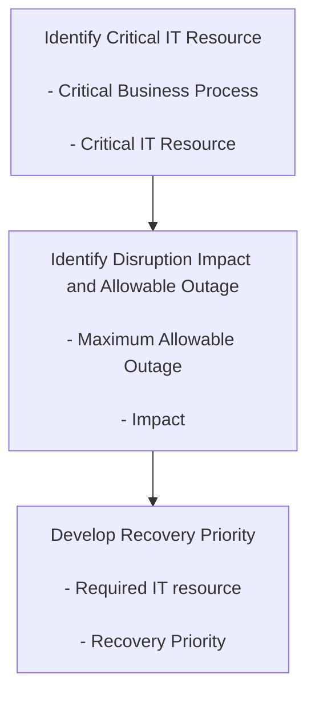
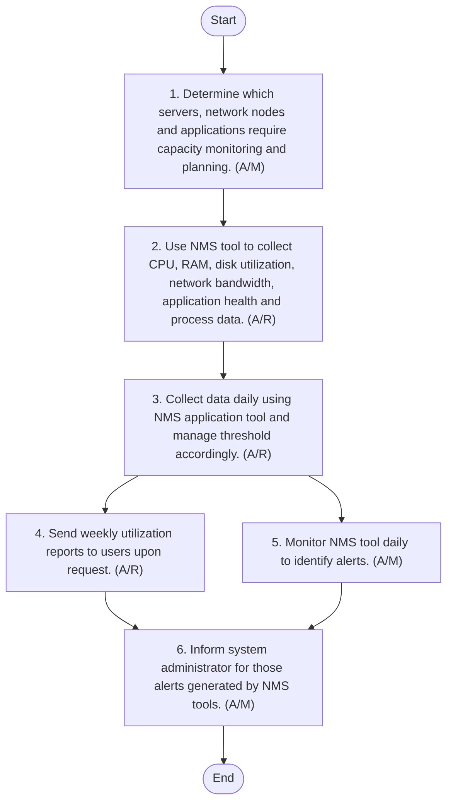
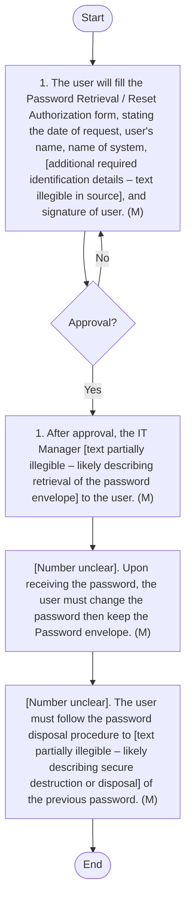

**[Diagram — PNG]:**

A logo consisting of:

- A graphic symbol at the top: three golden leaf-shaped elements arranged vertically (one on top, two below forming a triangular cluster), emerging from a short green curved line.
- Beneath the symbol, two lines of text:
  - First line (in Arabic, green): المطاحن العربية
  - Second line (in English, green): Arabian Mills
INFORMATION TECHNOLOGY POLICY AND PROCEDURE MANUAL

| Accessibility: | ☒ Confidential | ☐ Controlled |  |  |
| --- | --- | --- | --- | --- |
| Version: | ☐ Draft | ☐ Revised Draft | ☒ Final Draft | ☐ Approved |
| Revision cycle | ☒ Annually |  |  |  |
DOCUMENT INFORMATION

| Category | Information |
| --- | --- |
| Document | Information Technology Policy and Procedure Manual |
| Department | Information Technology |
| Created by | Deloitte |
| Reviewed by | IT and Cyber Security Manager |
| Approved by |  |
| Owner of the document | CFO |
DOCUMENT REVISION HISTORY

| Description | Version Ref. | Rationale for Revision | **Created**<br>
- by | Creat ion date | **Reviewed**<br>
- by | **Review**<br>
- date |
| --- | --- | --- | --- | --- | --- | --- |
| Original Version | 1.0 | Not applicable. | Deloitte | 10 July 2025 | IT and Cyber Security Manager | 17 July 2025 |
| 1 st Update | --- |  |  |  |  |  |
| 2 nd Update | --- |  |  |  |  |  |
| 3 rd Update | --- |  |  |  |  |  |
| 4 th Update | --- |  |  |  |  |  |
| 5 th Update | --- |  |  |  |  |  |
DISTRIBUTION LIST

| Name | Department | Designation |
| --- | --- | --- |
|  | Information Technology |  |
|  | Internal Audit |  |
|  | Finance |  |
|  | Security Team |  |

Arabian Mills for Food Products Company, a Saudi Closed Joint Stock Company based in Riyadh, specializes in packing and grinding wheat, manufacturing animal feeds, and trading specialty foods under the brands Finah and Kamil. The company is involved in diverse activities including land transportation, storage, and integrated office services, reflecting its commitment to delivering quality food products and services.
The IT Department Policy and Procedure Manual is designed to provide a comprehensive framework for managing information technology resources within Arabian Mills. It serves as a guide for IT staff, management, and all stakeholders involved in the planning, implementation, and oversight of IT systems and services. The manual outlines the policies and procedures necessary to ensure the security, efficiency, and compliance of the organisation's IT infrastructure.

The purpose of this IT Policy and Procedure Manual (the “Manual”) is to lay down the Company's IT policies and procedures, ensuring its compliance with the relevant standards and industry better practices. The manual serves to achieve the following objectives:

- Enhance Security: Establish robust security protocols to safeguard sensitive information and protect against unauthorized access, data breaches, and cyber threats.

- Ensure Compliance: Align IT practices with relevant legal, regulatory, and industry standards to ensure compliance and avoid potential liabilities.

- Improve Efficiency: Streamline IT operations through clear policies and procedures that promote consistency, accountability, and effective resource management.

- Facilitate Communication: Foster clear communication and collaboration among IT staff, management, and other departments to support organisational goals.

- Support Innovation: Encourage the adoption of emerging technologies and innovative practices to enhance the organisation's competitive advantage and growth.

This manual applies to the following the Information Technology Department. The Manual shall be reviewed on an annual basis or as needed, to update it in line with the newly applicable standards.
A procedure changes inputs into outputs, using resources and according to defined rules:

**[Diagram — EMF→PNG]:**

Inputs

Inputs  
- Ideas or Concepts  
- Data or Information  

Outputs  
- Product  
- Services  
- Information  
- Decisions  

Outputs  

Central box label:  
- Activity  

Arrows and directions:  
- An arrow labeled “Inputs” points downward from above into the top of the “Activity” box.  
- An arrow labeled “Inputs” points rightward from the left-side “Inputs” text block into the left side of the “Activity” box.  
- An arrow labeled “Outputs” points rightward from the right side of the “Activity” box toward the right-side “Outputs” text block.  
- An arrow labeled “Outputs” points downward from the bottom of the “Activity” box toward the bottom “Outputs” text.

Following is the existing IT department organisation chart:

**[Diagram — PNG]:**

- CFO  
  - IT & Cyber Security Manager  
    - Server Team  
      - Senior Server Administrator  
    - Network Team  
      - Senior Network & Server Admin  
    - Technical Support Team  
      - Hail (2), Jizan (2), Riyadh (1)  
    - Application & DB supportTeam  
      - Senior Application & DB Administrator  
      - Application Support  
      - Application Support  
    - Cybersecurity Team  
      - Cybersecurity Consultant

#### Purpose
The purpose of this Risk Management Procedure is to establish a systematic approach for identifying, assessing, and mitigating information security risks within Arabian Mills. By implementing a robust risk management framework, the organisation aims to proactively address potential threats and vulnerabilities, ensuring the protection of information assets and supporting business continuity. This procedure provides guidance on risk identification, evaluation, analysis, treatment, communication, and review, fostering a culture of risk awareness and resilience across the organisation.
#### Procedure Reference
This procedure refers to the Information Security Risk Management and Operational Security of Information Security.
#### Scope
The risk management document applies to the IT department and its sub-departments at Arabian Mills and the supporting services required to run the business services, including assets required to support this information. It is also applicable to all people (employees, external parties) who handle Arabian Mills information.
#### Objectives
The objectives of this Risk Management Procedure are to:

- Identify Risks: Systematically identify potential threats and vulnerabilities that could impact information assets and business operations.

- Evaluate Risks: Assess the likelihood and impact of identified risks, prioritising them based on their significance to the organisation.

- Mitigate Risks: Implement appropriate risk treatment strategies to reduce, transfer, avoid, or accept risks, ensuring they are managed to an acceptable level.

- Enhance Security: Strengthen the organisation's security posture by addressing risks proactively and continuously improving risk management practices.

- Support Compliance: Ensure compliance with legal, regulatory, and industry standards by integrating risk management into organisational processes.

- Foster Risk Awareness: Promote a culture of risk awareness and resilience across the organisation, encouraging stakeholders to actively participate in risk management efforts.
#### Responsibility
IT Risk Team

- Identify assets as per asset groups.

- Inform the existing controls for identified risks.

- Report the failure of risk mitigation strategy to risk owner.

- Coordinate with risk owner for the effectiveness of risk mitigation control.

- Implement the risk mitigation strategy.

- Conduct risk analysis.

- Provide risk mitigation strategy.

- Provide risk treatment.

- Review risk with risk owner.

- Review control implementation effectiveness with risk owner.
Asset Owner (Business Unit Head)

- Verify the identified assets.

- Identify criticality of assets.

- Take responsibility for risk (Risk owner).

- Monitor and review risk.

- Take risk management decisions (avoid, mitigate, etc.).

- Review control implementation effectiveness.

- Ensure the implementation of risk controls.
Information Security Manager

- Oversee the overall risk management process.

- Review effectiveness of risk with IT Risk team.

- Review Risk Register with IT Risk team.
#### Organizational Context
The Information Security Management Forum of Arabian Mills will ensure that a comprehensive information security risk assessment is carried out. The process of risk assessment will be repeated annually and monitored in the management forum meetings. The risk assessment methodology to be followed will be according to these basic criteria:
1. Criteria for Risk Evaluation

- Arabian Mills services and their data are of specific value to the organisation, and risks to this data and applications would be considered severe risks. Therefore, all processes that handle customer-related data will be considered for a thorough risk assessment.

- Arabian Mills will consider all three security parameters of confidentiality, integrity, and availability while protecting information.
2. Criteria for Impact

- Arabian Mills services and its data-related incident would be considered as a high impact incident.

- Any information security incident that affects the availability of the services of Arabian Mills would be considered a high impact incident.

- Any incident affecting legal, regulatory, or contractual obligations would be considered a high impact incident.
3. Criteria for Risk Acceptance

- Arabian Mills defines the following base criteria for risk acceptance:

- Cost of risk mitigation outweighs the business loss.

- Identified risk is not associated with environmental security & employee safety.

- Risk is not related to personal data compromise of Arabian Mills stakeholders & customers.

- Risk not affecting availability of the Arabian Mills applications and services to stakeholders & customers.
#### Risk Assessment Methodology
Arabian Mills will follow a five-step risk management process. The first step will be to perform Business process classification. The second step is to identify and classify all the information assets. The third step will be to identify key risks to those assets. The fourth step will be to analyse the risks. The fifth step is risk treatment.

**[Diagram — PNG]:**

Fig 1: Risk Assessment Overview  

Diagram description:

- Central element:
  - Large central circle labeled: **Risk Assessment** (orange gradient).

- Surrounding circular sequence of connected circles (forming a ring around the central circle), connected by a continuous colored ring:
  - Top circle (grey):
    - **Business Process Classification**
  - Right circle (gold/brown):
    - **Asset Identification**
  - Bottom-right circle (orange-brown):
    - **Risk Identification**
  - Bottom-left circle (dark orange/red-brown):
    - **Risk Analysis**
  - Left circle (red/orange):
    - **Risk Treatment**

- The outer circles are arranged in a clockwise loop around the central “Risk Assessment” circle in the following order:
  1. Business Process Classification
  2. Asset Identification
  3. Risk Identification
  4. Risk Analysis
  5. Risk Treatment
  6. (back to) Business Process Classification

All labels:

- Fig 1: Risk Assessment Overview
- Risk Assessment
- Business Process Classification
- Asset Identification
- Risk Identification
- Risk Analysis
- Risk Treatment
Arabian Mills will follow a detailed risk analysis process based on the ISO 27005 standard, comprising of three stages: Risk Identification, Risk Analysis, and Risk Treatment.

**[Diagram — EMF→PNG]:**

| Risk Identification |  |  |  | Risk Analysis |  |  |  | Risk Treatment |  |  |  |  |
| --- | --- | --- | --- | --- | --- | --- | --- | --- | --- | --- | --- | --- |
| Threat Description | Vulnerability Description | Existing Control(s) | Risk Owner | Vulnerability Impact | Likelihood of Vulnerability | Risk Level | Risk Management Decision | Suggested Controls to Mitigate Risk | Vulnerability Impact (revised) | Likelihood of Vulnerability (revised) | Revised Risk Level (Residual Risk) | Managements Decision |
|  |  |  |  |  |  | #N/A |  |  |  |  | #N/A |  |
|  |  |  |  |  |  | #N/A |  |  |  |  | #N/A |  |
|  |  |  |  |  |  | #N/A |  |  |  |  | #N/A |  |
|  |  |  |  |  |  | #N/A |  |  |  |  | #N/A |  |
|  |  |  |  |  |  | #N/A |  |  |  |  | #N/A |  |
|  |  |  |  |  |  | #N/A |  |  |  |  | #N/A |  |
1. Business Process Classification
The first step to asset identification is business process classification. Business processes are classified either as critical or non-critical based on a set of questions mentioned below. If the answer to any of the questions is "YES", then that business process is considered critical and undergoes a detailed risk assessment; otherwise, it is considered baseline, wherein baseline security controls are applied.
Answer the following questions for each of the business processes:
 Does the process achieve critical business objectives?
 Does the business process pr information critical for the survival of the business?
 Is the level of investment in this business process high in developing, maintaining, or replacing the business process?
 Are the assets of the business process highly valued?
If the answer to any of the above questions is YES, then the process will be considered as critical and will have a detailed risk analysis approach. If the answer is NO, then it will have a baseline approach. Critical and non-critical processes will be separated.
2. Asset Identification and Classification
Identifying and classifying assets is a crucial step in the risk management process. This ensures that Arabian Mills can effectively assess and manage risks associated with its information, software, physical, people, service, and document assets. Each asset category is evaluated based on its importance and sensitivity to the organisation's operations and security.

| Information Assets | Software Assets | Physical/Virtual Assets | People Assets | Service Assets | Document Assets |
| --- | --- | --- | --- | --- | --- |
| Database and Data files | Operating Systems | Computers and Communications Equipment | Employees | Computing and Communication Services | Contracts |
| System Documentation | Development Tools and Utilities | Server, desktop | Customers | Telecommunications | Guidelines |
| User Manuals | System Software | Storage Media | Subscribers | Smoke Detector Systems | Business results |
| Training Materials |  | Technical Equipment | Contractors | Fire Control System | SLA’s |
| Operational Procedure |  | Power Suppliers, A/C Units | Staff | Air-conditioning | MOU’s |
| Support Procedures |  | Cables |  | Power | Purchase Documents |
| Intellectual Property |  | Virtual Machines |  | UPS | Invoices |
| Continuity Plans |  | Courier | HR Records |  |  |
| Emails |  | Outsourced vendor support | Legal Documents |  |  |
| Archives |  | Internet Links |  |  |  |
Asset Sensitivity Rating for Critical Process
1. The information assets for critical business processes are rated for Confidentiality (C), Integrity (I), and Availability (A).
2. The C, I, A values will be assigned from 1 to 5 (5 being the highest). Asset value can be defined by considering confidentiality, integrity, and availability of an asset.
3. Identify the impact on the process and organisation if the information asset is compromised or any reach occurs.
A. Confidentiality
Question: What if an intruder or another employee of a lower access level gets to read confidential, top management mails?

| Thinking Process | Reply |
| --- | --- |
| It is very critical. Since financial /business- critical information is e xchanged through emails. | Then confidentiality value is 5 |
| It is critical. Since the top management exchanges a lot of information through emails. | Then confidentiality value is 4 |
| It is essential but not very critical | Then Confidentiality value is 3 |
| It is not very critical, for the process | Then confidentiality value is 2 |
B. Integrity
Question: What if an intruder or another employee tries to modify the contents of the mail and the mail delivered is something different? For example: The CEO sends out a mail to the VPs to donate SAR 100,000 for a charity. Someone in between tampers the mail, changes the amount to SAR 700,000, and gives his account number.

| Thinking Process | Reply |
| --- | --- |
| It is very critical | Then Integrity value is 5 |
| It is critical | Then Integrity value is 4 |
| It is important but not very critical | Then Integrity value is 3 |
| It is not very critical for the business process | Then Integrity value is 2 |
C. Availability
Question: What happens if a hardware failure occurs, and the server is not available to the users working under Arabian Mills?

| Thinking Process | Reply |
| --- | --- |
| It is very critical. There might be data corruption, and there is a possibility of users losing their mails. | Then the availability value is 5 |
| It is critical. We might even have the emails coming in but not been delivered. | Then the availability value is 4 |
| It is important but not very critical | Then the availability value is 3 |
| It is not very critical for my process | Then the availability value is 2 |
| It is very critical. There might be data corruption, and there is a possibility of users losing their mails. | Then the availability value is 5 |
Asset Valuation
Asset valuation involves assessing the sensitivity of assets based on their potential impact if compromised. The valuation is performed using a rating system, where assets are rated from 1 to 5, with 5 indicating the highest sensitivity and potential impact. The following table provides an illustrative to rate the sensitivity of the asset.

| Rating | Level | Description |
| --- | --- | --- |
| Negligible | 1 | Breach could result in little maybe 5000 SAR or no loss or injury* (minor cut ) . |
| Low | 2 | Breach could result in minor loss maybe 10,000 SAR or injury* (minor cut or bruises at more than 1 place in body . |
| Medium | 3 | Breach could result in serious loss maybe 50,000 SAR or injury* (major cut or bruises to two to 5 people), and the business could be affected or slow or down for more 3 hours. |
| High | 4 | Breach could result in a very serious loss of less than 200,000 SAR or injury* (major incident and patient is hospitalized), and the business is affected or slow or down for less than 5 hours . |
| Very High | 5 | Breach could result in financial losses which are unpredictable, or in exceptionally grave injury* (Major accident leading to hospitalization and patient being in critical condition) or the organization and the business failed and need to be recovered . |
Note: Injury should be considered only while rating people assets.
All the assets with values 4 and 5 will be considered for detailed risk assessment and risk treatment. Management has taken a conscious decision to perform a thorough risk assessment for assets with a rating of 4 and 5 to have a focused approach and assess the assets of high dependency. This level would subsequently be increased in the next cycle of risk assessment. Till that time, the remaining assets will be treated with baseline control. The assets with final values from 1 to 3 will be covered by baseline security.
3. Risk Identification
Any asset with a confidentiality, integrity, or availability rating of either 4 or 5 shall be considered for detailed risk analysis. Risk analysis will include identification, assessment, and prioritisation of risks followed by coordinated and economical application of resources to minimise, monitor, and control unfortunate events' probability and/or impact. Information security risk assessment is an ongoing activity.
Technique to Identify Risk:

- Historical or Evidence-Based Methods: Review of historical events, such as the use of checklists and the reviews of past issues or compromises.

- Systematic Approaches (Expert Opinion): A risk team examines and questions a business process in an organised manner to determine the potential points of failure.

- Inductive Methods (Theoretical Analysis): A team examines a process to determine the possible point of attack or compromise.
Risk Identification Stage:
The risk identification stage consists of identification and listing of the following:
 Threats: Threats can harm assets such as information, processes, and systems. They may be natural or human-origin, accidental or deliberate. Both accidental and intentional threat sources should be identified. Threats may arise from within or outside the organisation.
 Existing Controls: Existing controls are safeguards or countermeasures already implemented in the organisation to avoid, counteract, or minimise risks. For each threat, all existing controls are identified and listed.
 Vulnerabilities: Vulnerabilities are weaknesses associated with a resource. These weaknesses may be exploited by threats causing unwanted incidents that may result in loss, damage, or harm to the resource. All such vulnerabilities are identified for each resource-threat-existing control combination.
 Risk Owner: Risk owner shall be identified for each risk. Risk owner is the person or entity accountable and authorised to manage risk.
4. Risk Analysis
The risk estimation and analysis stage deals with analysing and assessing the probability of a threat exploiting the vulnerability and identifying the risk levels.
Vulnerability Impact:
The business impact upon the organisation that might result from possible or actual information security incidents should be assessed, considering the consequences of a breach of information security such as loss of confidentiality, integrity, or availability of the assets. Impact of the vulnerability is assessed using the following table:

| Vulnerability Rating | Vulnerability Impact |  |  |
| --- | --- | --- | --- |
| Vulnerability Rating | Legal consequences | Loss of image and Reputation | Impact on business process |
| Low | No Legal Consequences | Little Loss of image and r eputation. Like n egative word of mouth within the company or individual client | Little impact on business process leading to slight dissatisfaction to customer |
| Moderate | Legal Consequences like warning from regulatory body or law enforcement agency or minor financial impact due to a minor legal case impacting up to SAR 50,000 | Moderate Loss of image and Reputation, like negative branding of the company in the local newspaper or local media | Moderate impact, but the business process can continue also may lead to the significant complaint from the customer. |
| Major | Legal proceedings against the company leading to closure or higher financial impact | Major Loss of image and reputation (other than above) | Significant impact, the business process cannot function (other |
The probability of the threat exploiting the vulnerability is assessed using the following table. The below table is used to assess the likelihood of occurrence of vulnerability:

| Likelihood Rating | Likelihood of Occurrence |  |  |
| --- | --- | --- | --- |
| Likelihood Rating | Likelihood | Business Downtime Consideration | Existing Controls |
| Rare | Extremely unlikely, may occur only in exceptional circumstances . | Would not cause damage to business beyond 1- hour downtime . | Existing controls in place to contain the vulnerability . |
| Moderate | May occur once or twice in a year . | Can cause damage to business with 3 to 4 hours downtime . | Existing control in place but may fail with little effort from attacker . |
| Almost Certain | May occur once a month or 4 to 5 times in a year . | Can cause serious damage to business with downtime of more than 5 hours . | No control or control exists but may fail due to a highly motivated attacker . |
Estimate Risk Level:
Based on a combination of the consequence and likelihood of the risk materialising, risks are assessed. The two parameters - impact and likelihood - are evaluated to calculate the resultant risk. The following table is used to assess the risk level:

| Estimate Risk Level | Likelihood |  |  |  |
| --- | --- | --- | --- | --- |
| Estimate Risk Level | Rare | Moderate | Almost Certain |  |
| Impact | Low | High |  |  |
| Impact | Moderate | High |  |  |
| Impact | Major | Moderate | High | Extreme |
5. Risk Treatment
After the risk analysis, various risk treatment options are considered. This stage includes taking risk management decisions, implementing controls if necessary to manage the risk, re-assessing the consequences, the level of consequence, and the likelihood of incident scenarios to arrive at the final risk level.
Risk Management Decision:
The next stage after identifying the risks is to identify and evaluate the most appropriate action of how to deal with the risk. There are four possible actions for risk management decision (nomenclature as per ISO27005):

- Reduce Risk: To reduce the assessed risks, appropriate and justified controls should be identified and selected. Control selection aims to minimise the risk to a level which is acceptable to Arabian Mills.

- Avoid Risk: Risk avoidance describes any action where resources are moved away from risky areas or change the technology or the process so that the risk doesn't exist. When evaluating the option of risk avoidance, it must be balanced against business and monetary needs.

- Transfer Risk: Risk transfer might be the best option if it seems impossible to avoid the risk or is difficult or too expensive to reduce the risk. E.g., risk transfer can be achieved by insuring or using third parties and outsourcing partners to handle critical business functions.

- Accept Risk: Retain (accept) risk concerns the communication of residual risks to the decision-makers. When no further controls can be applied to reduce the risks, a decision needs to be made on how to deal with them. This decision is to retain (accept) risk.
Suggested Controls to Mitigate Risk:
For risk management decisions to 'reduce risks', controls that will reduce the risk are identified. These controls would either be to:

- Reduce the probability of occurrence of the vulnerability.

- Reduce the severity of the vulnerability.
Residual Risk:
After implementing the proposed controls, the following values are computed again:
1. Level of severity
2. Likelihood
3. Risk level.
The risk that remains after computation is termed as the 'Residual Risk'. Management of Arabian Mills will approve the residual risks as acceptable risks. Approvals Required to Accept Residual Risks:

| Risk Level | Risk Accepted by |
| --- | --- |
| Extreme | CEO |
| High | CFO1 |
| Moderate | IT & Cybersecurity Manager (HQ) |
| Low | Business Unit Head |
Opportunity:
Risk owner shall ensure that opportunities that arise from risk identified would be identified wherever possible and logged in "Opportunity log". These risk opportunities may help the organisation to provide service to other organisations and become a profit centre.
#### Risk Communication
Risk communication is an activity to achieve agreement on managing risks by exchanging and/or sharing information about risk between the decision-makers and other stakeholders. Arabian Mills IT & Cybersecurity Manager and the stakeholders will need to communicate and agree on the risk analysis done. Stakeholders will include the Head of Department, business process owner affected by the identified risk, the subcategory area of the IT department that will implement the treatment controls, the Department Head who will approve the resources required to mitigate risks.
Information About Risks to be Shared with Stakeholders:

- Existence of risk

- Nature of risk

- Likelihood of occurrence of risk

- The severity of the risk

- The controls to be implemented for the treatment of risk.

- Acceptability of risks
Effective risk communication is essential for ensuring that stakeholders are informed and engaged in the risk management process. The following table outlines the activities and responsibilities involved in risk communication:

| No. | Procedure description | Responsibility | Frequency |
| --- | --- | --- | --- |
| 1 | Develop Communication Plan: Create a detailed communication plan outlining specific steps, responsible parties, and timelines for risk communication. | Preparer: IT & Cybersecurity Manager | Annually |
| 2 | Identify Responsible Parties: Assign roles and responsibilities for risk communication, specifying who initiates communication and who needs to be informed. | Preparer: IT & Cybersecurity Manager | Annually |
| 3 | Establish Timelines: Set clear timelines for risk communication activities, including deadlines for feedback and decision-making. | Preparer: IT & Cybersecurity Manager | Annually |
| 4 | Standardise Communication Methods: Determine standard methods for communication, such as meetings, reports, emails, or dashboards. | Preparer: IT & Cybersecurity Manager | Annually |
| 5 | Create Templates and Tools: Develop templates and tools to facilitate risk communication, including risk assessment reports and communication checklists. | Preparer: IT & Cybersecurity Manager | Annually |
| 6 | Conduct Training and Awareness: Provide training and awareness sessions for stakeholders to ensure they understand their roles and responsibilities in the risk communication process. | Preparer: IT & Cybersecurity Manager | Annually |
| 7 | Monitor and Review Communication Effectiveness: Implement a process for monitoring and reviewing the effectiveness of risk communication, gathering feedback, and adjusting as needed. | Preparer: IT & Cybersecurity Manager | Annually |

**[Diagram — Visio-EMF→PNG]:**

**Process Name:** Risk Communication Procedure  

**Roles / Swimlanes:**

- IT & Cybersecurity Manager

---

### Steps

| Step # | Role                     | Action | Decision/Next Step |
|--------|--------------------------|--------|--------------------|
| Start  | IT & Cybersecurity Manager | Start | Next: 1 |
| 1      | IT & Cybersecurity Manager | Co-create a detailed communication plan outlining goals, stakeholders, media, and timelines for risk communication. (M) | Next: 2 |
| 2      | IT & Cybersecurity Manager | Assign roles and responsibilities for risk communication, specifying who needs to be informed. (M) | Next: 3 |
| 3      | IT & Cybersecurity Manager | Set clear timelines for risk communication activities, including deadlines for feedback and decision-making. (M) | Next: 4 |
| 4      | IT & Cybersecurity Manager | Determine standard methods for communication, such as meetings, reports, emails, or dashboards. (M) | Next: 5 |
| 5      | IT & Cybersecurity Manager | Develop templates and tools to facilitate effective risk communication, including risk assessment reports and communication checklists. (M) | Next: 6 |
| 6      | IT & Cybersecurity Manager | Provide training and awareness sessions for stakeholders to ensure they understand their obligations in the risk communication process. (M) | Next: 7 |
| 7      | IT & Cybersecurity Manager | Implement a process for monitoring and evaluating the effectiveness of the risk communication, gathering feedback, and making improvements as needed. (M) | Next: End |
| End    | IT & Cybersecurity Manager | End | — |

---

```mermaid
graph TD

    Start((Start))
    S1[1. Co-create a detailed communication plan outlining goals, stakeholders, media, and timelines for risk communication. (M)]
    S2[2. Assign roles and responsibilities for risk communication, specifying who needs to be informed. (M)]
    S3[3. Set clear timelines for risk communication activities, including deadlines for feedback and decision-making. (M)]
    S4[4. Determine standard methods for communication, such as meetings, reports, emails, or dashboards. (M)]
    S5[5. Develop templates and tools to facilitate effective risk communication, including risk assessment reports and communication checklists. (M)]
    S6[6. Provide training and awareness sessions for stakeholders to ensure they understand their obligations in the risk communication process. (M)]
    S7[7. Implement a process for monitoring and evaluating the effectiveness of the risk communication, gathering feedback, and making improvements as needed. (M)]
    End((End))

    Start --> S1 --> S2 --> S3 --> S4 --> S5 --> S6 --> S7 --> End
```
#### Risk Review
Periodic review of risk assessment by Arabian Mills IT team with CFO is essential to identify any changes in the organisation's context at an early stage and maintain an overview of the complete risk picture. The risk register created because of this exercise will be reviewed once quarterly or whenever there are any changes to the business environment.
During the review of the risk assessment, the following order should be considered in order of priority mentioned below for risk level identified:

| Risk Level | Risk Accepted by |
| --- | --- |
| Extreme | First |
| High | Second |
| Moderate | Third |
| Low | Fourth |
During risk review, extreme and high-risk levels should be given priority for any new risks identified for assets, post which moderate and low risk will be reviewed.
#### Annexure
The following definition apply to the Risk Management Procedure

| Term | Definition |
| --- | --- |
| Asset | Anything that has value to the organization |
| Availability | The property of being accessible and usable upon demand by an authorized entity |
| Confidentiality | The property that information is not made available or disclosed to unauthorized individuals, entities, or processes |
| Impact | The result of an information security incident |
| Integrity | The property of safeguarding the accuracy and completeness of assets |
| Owner | An individual or entity that has approved management responsibility for controlling the production, development, maintenance, use and security of the asset. The term “owner” does not mean that the person has any property rights to the asset. |
| Residual risk | The risk that remains after risk treatment |
| Risk | The potential that a given threat will exploit vulnerabilities of an asset or group of assets and cause harm to the organization. It is measured in terms of a combination of the probability of an event and its consequence |
| Risk analysis | The systematic process of estimating the magnitude of risks |
| Risk treatment | The process of selection and implementation of controls to modify risk |
| Threat | A potential cause of an incident that may result in harm to a system or organization |
| Vulnerability | A weakness of an asset or group of assets that one or more threats can exploit |
| Asset | Anything that has value to the organization |

#### Purpose
The purpose of this document is to establish a comprehensive framework for managing IT incidents within Arabian Mills. It aims to provide clear guidelines for identifying, analysing, and responding to incidents in real-time, ensuring that incidents are handled efficiently to minimize impact on business operations. By defining roles, responsibilities, and procedures, Arabian Mills seeks to enhance the resilience of its IT infrastructure and protect sensitive information from unauthorized access or disruption.
#### Scope
This procedure applies to all IT incidents that may result in loss of productivity or compromise the security and functionality of Arabian Mills' IT infrastructure. It encompasses incidents related to cybersecurity, hardware failures, software bugs, network outages, and user errors across all locations and departments, ensuring a unified approach to incident management.
#### Objectives

- Rapid Identification: Enable swift detection and reporting of IT incidents to minimize potential damage.

- Effective Response: Ensure timely and coordinated response to incidents, reducing impact on business operations.

- Comprehensive Analysis: Conduct thorough analysis of incidents to identify root causes and develop preventive measures.

- Continuous Improvement: Learn from incidents to enhance future incident management practices and strengthen IT security.

- Stakeholder Involvement: Promote collaboration among key stakeholders to ensure comprehensive incident handling and resolution.
#### Responsibilities
1. CFO

- Ensure the implementation of Incident Management procedures at all Arabian Mills locations.

- Oversee the incident management process.

- Provide support and resources for managing and handling incidents.
2. IT & Cybersecurity Manager

- Inform the CFO in case of any severe incident (S4 & S5).

- Ensure that Incident Management is implemented and followed.

- Proper escalation of incidents, as required.
3. IT Operations Head

- Ensure that incidents are contained.

- Conduct Root-Cause analysis.

- Implement preventive and corrective actions.

- Ensure the Incident Management Form is filled and maintained.

- Proper escalation of incidents, as required.
4. Incident Management Team

- Handle information security incidents.

- Contain the incidents and coordinate the recovery procedure.

- Conduct Root-Cause analysis, provide corrective and preventive measures for incidents.

- Implement preventive and corrective actions in coordination with the IT team.
5. IT Team

- Identify reported incidents and report to the Incident Management Team.

- Implement preventive and corrective actions.

- Coordinate and implement the recovery procedure.
#### Procedure
1. Incident Detection

- An incident may be detected or witnessed by anyone working in Arabian Mills IT department or any Arabian Mills staff.

- Anyone witnessing the incident shall immediately report it to the IT Team in HQ or to IT & Cybersecurity Managers at their respective locations.

- Third-party personnel witnessing the incident related to security events or security weaknesses related to Arabian Mills' information processing facilities shall report it to the IT team.
2. Incident Handling

- The reported incidents shall be assessed by the Information Security Officer (ISO) or the IT & Cybersecurity Manager to determine if the events are information security incidents.

- IT & Cybersecurity Manager-HQ shall establish a proper incident handling procedure, including escalation of incidents.

- IT & Cybersecurity Manager-HQ shall define guidelines for handling incidents. Any incidents not part of the guidelines shall be escalated to the CFO.
3. Learning from Incidents

- IT & Cybersecurity Manager shall ensure that there is a root cause analysis done for each incident along with the respective team who identifies the incident.

- The respective teams shall assist in identifying any corrective and preventive actions required to prevent recurrence of the incident.

- IT & Cybersecurity Manager shall retain all evidence of incidents and ensure that a copy is provided to the CFO.
#### Incident Management Procedure

| No. | Procedure description | Responsibility | Frequency |
| --- | --- | --- | --- |
| 1 | Incident Identification: Any Arabian Mills staff or third party detecting an IT incident should inform the incident immediately to Arabian Mills HQ-IT dept or Branch- IT & Cybersecurity Manager . The user reporting the incident should also inform their line manager. | Preparer: Notifier | As needed |
| 2 | Capture Incident Information: Collect details such as contact name and number, type of data or information involved, location/department of the incident, equipment/system/device affected, date and time of the incident. | Preparer: IT Network and Server Admin | As needed |
| 3 | Verify Occurrence and Contain Incident: Verify the occurrence of the incident and contain it to avoid further spreading. | Preparer: IT Network and Server Admin | As needed |
| 4 | Identify Attack Vector: Determine the attack vector for the incident. | Preparer: IT Network and Server Admin | As needed |
| 5 | Incident Analysis: Analyse the incident and determine the impact and severity. Report the incident to IT & Cybersecurity Manager (HQ). | Preparer: IT Network and Server Admin | As needed |
| 6 | Approval of Incident Handling (S1-S3): Obtain approval from IT & Cybersecurity Manager for handling of incidents with severity S1 to S3. | Reviewer: IT & Cybersecurity Manager | After each incident |
| 7 | Approval of Incident Handling (S4-S5): Obtain approval from CFO for handling of incidents with severity S4 to S5. | Reviewer: CFO | After each incident |
| 8 | Gather Incident Evidence: Collect evidence such as logs, system snapshots, CCTV footage, etc. | Preparer: IT Network and Server Admin | As needed |
| 9 | Contain and Recover: Contain the incident and prepare for recovery. | Preparer: IT Network and Server Admin | As needed |
| 1 0 | Identify Root Cause: Analyse the incident to determine the underlying issues that caused it. | Preparer: IT Network and Server Admin | After each incident |
| 1 1 | Document Findings: Record the findings of the root cause analysis in the incident reporting form. | Preparer: IT Network and Server Admin | After each incident |
| 1 2 | Develop Preventive Measures: Implement corrective and preventive actions based on the root cause analysis to prevent recurrence. | Preparer: IT Network and Server Admin | After each incident |
| 1 3 | Post-Incident Activities: Secure all gathered evidence, document lessons learned, and update the CFO about incident closure. | Preparer: IT & Cybersecurity Manager | After each incident |
| 1 4 | Gather Stakeholder Feedback: Collect feedback from all relevant stakeholders involved in incident handling. | Preparer: IT & Cybersecurity Manager | After each incident |
| 1 5 | Analyse Incident Outcomes: Review the outcomes of the incident to assess the effectiveness of the response. | Preparer: IT Network and Server Admin | After each incident |
| 1 6 | Identify Lessons Learned: Document lessons learned and areas for improvement to enhance future incident management practices. | Preparer: IT Network and Server Admin | After each incident |
| 1 7 | Follow-Up: Follow up with the team after one week for the implementation status of corrective actions. | Preparer: IT & Cybersecurity Manager | Weekly |

**[Diagram — Visio-EMF→PNG]:**

**Process Name:** Incident Management Procedure  

**Roles / Swimlanes:**

- Notifier  
- IT Network and Server Admin  
- IT & Cybersecurity Manager  
- CFO  

---

### Steps

| Step # / Node | Role | Action (exact step text as visible) | Decision / Next Step |
| --- | --- | --- | --- |
| Start | Notifier | Start | Flows to Step 1. |
| 1 | Notifier | Report the incident to the network administrator. (M) | Next: Step 2. |
| 2 | IT Network and Server Admin | Collect data such as general details and number, type of an incident, user reports, logs and information from IT / security staff. (M) | Next: Step 3. |
| 3 | IT Network and Server Admin | Verify the occurrence of the incident and communicate incident for further escalating. (M) | Next: Step 4. |
| 4 | IT Network and Server Admin | Determine the attack vector for the incident. (M) | Next: Step 5. |
| 5 | IT Network and Server Admin | Analyse the incident and severity, then report the incident to IT Manager. (M) | Next: Step 6. |
| 6 | IT Network and Server Admin | Collect evidence such as log, system snapshots, CCTV footage, etc. (M) | Next: Step 8. |
| 8 | IT Network and Server Admin | Contain the incident and prepare for recovery. (M) | Next: Step 10. |
| 10 | IT Network and Server Admin | Analyse the incident to determine the underlying issues that caused it. (M) | Next: Step 11. |
| 11 | IT Network and Server Admin | Record the findings in the incident reporting form and root cause analysis form. (M) | Two parallel flows: (1) to Step 12; (2) down to Decision “S1–S3”. |
| 12 | IT Network and Server Admin | Implement corrective and preventive controls based on the root cause analysis to prevent recurrence. (M) | Next: Step 15. |
| 15 | IT & Cybersecurity Manager | Review the outcomes of the incident to assess the adequacy and timeliness of the response. (M) | Next: Step 16. |
| 16 | IT & Cybersecurity Manager | Document lessons learned and best practices and share them with management to improve incident management practices. (M) | Next: Step 17. |
| Decision “S1–S3” | IT & Cybersecurity Manager | Decision node labelled “S1–S3”. | Yes → Decision “Approve” (CFO). No branch is not shown in the diagram. |
| Decision “Approve” | CFO | Decision node labelled “Approve”. | Yes → Step 13. No branch is not shown in the diagram. |
| 13 | IT & Cybersecurity Manager | Secure all gathered evidence, document lesson learned, and update the CEO about incident closure. (M) | Next: Step 14. |
| 14 | IT & Cybersecurity Manager | Collect feedback from all stakeholders involved in incident handling. (M) | Next: Step 17 (joins the main flow). |
| 17 | IT & Cybersecurity Manager | Follow up with the team on the corrective actions for the improvement areas or communication actions. (M) | Next: End. |
| End | (Process end) | End | — |

---

```mermaid
graph TD

  Start([Start])

  n1[1. Report the incident to the network administrator. (M)]
  n2[2. Collect data such as general details and number, type of an incident, user reports, logs and information from IT / security staff. (M)]
  n3[3. Verify the occurrence of the incident and communicate incident for further escalating. (M)]
  n4[4. Determine the attack vector for the incident. (M)]
  n5[5. Analyse the incident and severity, then report the incident to IT Manager. (M)]
  n6[6. Collect evidence such as log, system snapshots, CCTV footage, etc. (M)]
  n8[8. Contain the incident and prepare for recovery. (M)]
  n10[10. Analyse the incident to determine the underlying issues that caused it. (M)]
  n11[11. Record the findings in the incident reporting form and root cause analysis form. (M)]
  n12[12. Implement corrective and preventive controls based on the root cause analysis to prevent recurrence. (M)]
  n15[15. Review the outcomes of the incident to assess the adequacy and timeliness of the response. (M)]
  n16[16. Document lessons learned and best practices and share them with management to improve incident management practices. (M)]
  d1{S1–S3}
  d2{Approve}
  n13[13. Secure all gathered evidence, document lesson learned, and update the CEO about incident closure. (M)]
  n14[14. Collect feedback from all stakeholders involved in incident handling. (M)]
  n17[17. Follow up with the team on the corrective actions for the improvement areas or communication actions. (M)]
  End([End])

  Start --> n1
  n1 --> n2
  n2 --> n3
  n3 --> n4
  n4 --> n5
  n5 --> n6
  n6 --> n8
  n8 --> n10
  n10 --> n11

  %% Branch from 11 to corrective/preventive actions path
  n11 --> n12
  n12 --> n15
  n15 --> n16
  n16 --> n17

  %% Branch from 11 to approval/documentation/feedback path
  n11 --> d1
  d1 -- Yes --> d2
  d2 -- Yes --> n13
  n13 --> n14
  n14 --> n17

  n17 --> End
```
#### Emergency Incident Protocol Procedure
This procedure establishes detailed protocols for handling emergency incidents, ensuring efficient management and documentation to respond effectively to critical incidents.

| No. | Procedure description | Responsibility | Frequency |
| --- | --- | --- | --- |
| 1 | Raise Emergency Incident Request: Immediately raise a request and document the urgency. | Preparer: Notifier | As needed |
| 2 | Identify Emergency Incident Needs: Determine the necessity for an emergency incident based on severity. | Preparer: IT & Cybersecurity Manager ; | As needed |
| 3 | Approve Emergency Incident: Obtain approval from relevant authorities via email or SMS. | Reviewer: CFO | As needed |
| 4 | Implement Emergency Incident: Execute the incident response promptly following approval. | Preparer: IT Network and Server Admin | As needed |
| 5 | Document Emergency Incident: Maintain comprehensive records of the incident, including approvals and implementation details. | Preparer: IT Network and Server Admin | After implementation |
| 6 | Conduct Post-Incident Review: Evaluate the effectiveness of the emergency incident response and gather feedback. | Preparer: IT Network and Server Admin | After each emergency incident |

**[Diagram — Visio-EMF→PNG]:**

**Process Name:** Emergency Incident Protocol Procedure  

**Roles / Swimlanes:**

- Notifier  
- IT & Cybersecurity Manager  
- CFO  
- IT Network and Server Admin  

### Steps

| Step # | Role                     | Action                                                                                                                                                          | Decision/Next Step                                                                                                                                                                 |
|--------|--------------------------|-----------------------------------------------------------------------------------------------------------------------------------------------------------------|------------------------------------------------------------------------------------------------------------------------------------------------------------------------------------|
| Start  | Notifier                 | Start                                                                                                                                                           | Proceeds to Step 1                                                                                                                                                                 |
| 1      | Notifier                 | Immediately raise a request and document the urgency (M).                                                                                                      | Proceeds to Step 2                                                                                                                                                                 |
| 2      | IT & Cybersecurity Manager | Determine the necessity for an emergency incident based on severity (M).                                                                                       | Proceeds to Decision “Approve”                                                                                                                                                     |
| —      | CFO                      | **Decision:** Approve                                                                                                                                            | **Yes:** Proceeds to Step 4.  **No:** Proceeds to Step 6.                                                                                                                          |
| 4      | IT Network and Server Admin | Execute the incident response measures following approval (M).                                                                                                  | Proceeds to Step 5                                                                                                                                                                 |
| 5      | IT Network and Server Admin | Maintain comprehensive records of the incident, including all updates and implementation details (M).                                                           | Proceeds to Step 6                                                                                                                                                                 |
| 6      | IT Network and Server Admin | Evaluate the effectiveness of the response and submit feedback (M).                                                                                            | Proceeds to End                                                                                                                                                                    |
| End    | IT Network and Server Admin | End                                                                                                                                                             | —                                                                                                                                                                                  |

### Mermaid.js Flow

```mermaid
graph TD

    %% Nodes
    A[Start]:::terminator
    B[1. Immediately raise a request<br/>and document the urgency (M).]:::process
    C[2. Determine the necessity for an<br/>emergency incident based on severity (M).]:::process
    D{Approve}:::decision
    E[4. Execute the incident response<br/>measures following approval (M).]:::process
    F[5. Maintain comprehensive records<br/>of the incident, including all<br/>updates and implementation details (M).]:::process
    G[6. Evaluate the effectiveness of<br/>the response and submit feedback (M).]:::process
    H[End]:::terminator

    %% Flow
    A --> B --> C --> D
    D -->|Yes| E --> F --> G --> H
    D -->|No| G

    %% Styles
    classDef process fill:#ffffff,stroke:#000000,stroke-width:1px;
    classDef decision fill:#ffffff,stroke:#000000,stroke-width:1px,rx:10,ry:10;
    classDef terminator fill:#ffffff,stroke:#000000,stroke-width:1px,rx:20,ry:20;
```
#### Incident Training and Awareness Programs Procedure
This procedure ensures regular training and awareness programs for incident management to improve the effectiveness of incident handling and response.

| No. | Procedure description | Responsibility | Frequency |
| --- | --- | --- | --- |
| 1 | Develop Training Programs: Create training materials and programs for incident management. | Preparer: IT & Cybersecurity Manager | Quarterly |
| 2 | Conduct Training Sessions: Regularly train staff on incident management procedures and best practices. | Preparer: IT & Cybersecurity Manager | Quarterly |
| 3 | Implement Awareness Programs: Develop and distribute awareness materials to educate staff on incident management. | Preparer: IT & Cybersecurity Manager | Quarterly |
| 4 | Evaluate Training Effectiveness: Assess the effectiveness of training sessions and awareness programs through feedback and performance metrics. | Preparer: IT & Cybersecurity Manager | Quarterly |
| 5 | Update Training Materials: Revise training materials and programs based on feedback and evolving incident management practices. | Preparer: IT & Cybersecurity Manager | Quarterly |

**[Diagram — Visio-EMF→PNG]:**

**Process Name:** Incident Training and Awareness Procedure  

**Role / Swimlane:** IT & Cybersecurity Manager  

| Step # | Role                     | Action                                                                                                                                              | Decision/Next Step                  |
|-------|---------------------------|-----------------------------------------------------------------------------------------------------------------------------------------------------|-------------------------------------|
| Start | IT & Cybersecurity Manager | Start                                                                                                                                               | Proceed to Step 1                   |
| 1     | IT & Cybersecurity Manager | Create training materials and programs for incident management. (M)                                                                                | Proceed to Step 2                   |
| 2     | IT & Cybersecurity Manager | Regularly train all staff on incident management procedures and best practices. (M)                                                                | Proceed to Step 3                   |
| 3     | IT & Cybersecurity Manager | Develop and distribute awareness materials to educate staff on incident management. (IM)                                                          | Proceed to Step 4                   |
| 4     | IT & Cybersecurity Manager | Assess the effectiveness of training and awareness programs through feedback and performance metrics. (A)                                         | Proceed to Step 5                   |
| 5     | IT & Cybersecurity Manager | Review training materials and revise training based on feedback and changing incident management practices. (M)                                    | Proceed to End                      |
| End   | IT & Cybersecurity Manager | End                                                                                                                                                 | —                                   |

```mermaid
graph TD
    A([Start])
    B[1. Create training materials and programs for incident management. (M)]
    C[2. Regularly train all staff on incident management procedures and best practices. (M)]
    D[3. Develop and distribute awareness materials to educate staff on incident management. (IM)]
    E[4. Assess the effectiveness of training and awareness programs through feedback and performance metrics. (A)]
    F[5. Review training materials and revise training based on feedback and changing incident management practices. (M)]
    G([End])

    A --> B --> C --> D --> E --> F --> G
```
Preparation for Incident Handling
1. Communication and Facilities:

- Contact information for team members and other important contacts outside the organization.

- Secure storage facility for securing evidence and other important sensitive materials and data.
2. Alert Management:

| Severity Level | Alert Response | Communication Channels |
| --- | --- | --- |
| S5- Very High | 30 minutes | Telephone call, Email, Service Desk |
| S4 - High | 45 minutes | Telephone call, Email, Service Desk |
| S3 - Moderate | 90 minutes | Email, Service Desk |
| S2 - Low | 240 minutes | Email, Service Desk |
3. Hardware and Software:

- Workstation for creating disk images, preserving log files, and saving other incident-relevant data (Digital Evidence).

- Backup devices in case of data corruption or ransomware attacks.

- Spare workstation, server, network device, or virtualization infrastructure for restoring backup or recovery of the system.

- Laptop for analysing data, sniffing packets, and writing reports.

- Clean operating system images for server/desktop.

- Blank removable media.

- Digital forensic software to analyse disk images and other files (if required).
4. Analysis Resources:

- Port list of all commonly used ports.

- Documentation for OSs, applications, protocols, intrusion detection, and antivirus such as secure configuration, security best practices, access credentials, etc.

- Network diagrams and list of critical assets.
Detection and Analysis
1. Identifying the Attack Vectors:

- External/Removable Media.

- Attrition (brute force methods).

- Web/Web application based.

- Email.

- Loss or theft of equipment.

- Spoofing.
2. Indicator of System Compromise/Incident:

- Web server log entries.

- Announcement of a new exploit.

- Threat message from cyber criminals.

- Network intrusion detection alerts.

- Buffer overflow attempts.

- Antivirus software alerts.

- Unusual characteristics of the device or unknown files.

- Multiple failed logins attempt from unfamiliar IPs.

- Unusual network traffic deviations.

- Large numbers of bounced emails with suspected content.
3. Incident Analysis:

- Networks and Systems Profiling: Measure characteristics of expected activity to identify changes.

- Understand Normal Behaviour: Study networks, systems, and applications to identify abnormal behaviour.

- Retain & Analyse Logs: From servers and other devices.

- Use Internet Search: To find information on unusual activity.

- Run Packet Sniffers: To collect network traffic data.
4. Incident Documentation:

- Summary of the incident.

- Attack Vector.

- Indicator of incident.

- Action taken by the incident response team.

- Contact information of all members present.

- List of evidence gathered.

- Impact of the incident.
Containment, Eradication, and Recovery
1. Evidence Gathering and Host Identification:

- Gather evidence to resolve the incident or for legal proceedings.

- Identify the attack host to contain the attack and prevent further spreading.
2. Eradication and Recovery:

- Identify and fix infected hosts.

- Restore systems to normal operation and confirm functioning after patching and remediation.

- Common recovery examples: restoring old clean backup, rebuilding the system from scratch, replacing infected files, installing patches, changing passwords.
Post-Incident Activity
Learning from Incidents:

- Root Cause of the incident.

- Remediation steps.

- Corrective actions to prevent similar incidents in the future.

- Attack vector.

- Additional tools or resources needed to detect, analyse, and mitigate future incidents.
#### Escalation Matrix for Incident Follow-Up and Closure

| Incident Severity | Expected Response Time | Level - 1 Escalation | Level - 2 Escalation | Level - 3 Escalation |
| --- | --- | --- | --- | --- |
| S5- Very High | 30 mins | 1 Hour | 3 Hours | 5 Hours |
| S4 - High | 2 Hours | 3 Hours | 5 Hours | 8 Hours |
| S3 - Moderate | 4 Hours | 6 Hours | 12 Hours | 36 Hours |
| S2 - Low | 6 Hours | 24 Hours | 2 working days | 3 Working days |
Escalation Levels:

| Escalation Level | Escalation Point |
| --- | --- |
| Level - 1 | Incident Manager |
| Level - 2 | IT & Cybersecurity Manager |
| Level - 3 | CFO |
#### Incident Severity Levels

| Severity Level | Details |
| --- | --- |
| S5 (Very High) |
- Critical issue that requires public notification and work with executive teams.<br>
- The system is in a critical state and is actively impacting a large (200+ users) number of customers/internal users.<br>
- Functionality/Production has been severely impaired for a long time (5+ hours).<br>
- Citizen information expose/application down/portal down, due to security vulnerability exposed.<br>
- System/Application hacked and is down .<br>
- Ransomware attacks<br>
- Physical Access to IT facility is unavailable. |
| S4 (High) |
- Critical system issue actively impacting many customers/internal employee/users’ ability to use the application, server, system.<br>
- The system is actively impacting a large (less than 100 users) number of customers/internal users.<br>
- Functionality/Production has been impaired for a long time (3 hours).<br>
- Application or system or a portal is experiencing very slow network (latency is 1000+ ms).<br>
- Network is down .<br>
- Something that has the likelihood of becoming a S5 severity if nothing is done.<br>
- Virus attack . |
| S3 (Moderate) |
- Stability or minor customer/employee/users-impacting issues that require immediate attention from service owners.<br>
- Partial loss of functionality/production, not affecting majority of users/customers (50 users).<br>
- Something that has the likelihood of becoming a S4 severity if nothing is done.<br>
- Network is working with latency of (500 ms), application/sever access/portal access is slow.<br>
- Phishing attacks . |
| S2 (Low) |
- Minor issues requiring action, but not affecting customer/employee/users’ ability to use the application, server, system.<br>
- Performance issues (delays, etc.)<br>
- Individual host failure (i.e. one node out of a cluster).<br>
- Delayed job failure . |
| S1 (Negligible) |
- Cosmetic issues or bugs, not affecting customer/employee/user ability to use the application, server, system.<br>
- Bugs fix not impacting the immediate ability to use the system. |
Examples of Information Security Incidents
1. Malicious Incident

- Computer infected by a virus or other malware, (spyware or adware or ransomware)

- Finding data that has been changed by an unauthorized person.

- Receiving and forwarding chain letters – Including virus warnings, scam warnings and other emails which encourage the recipient to forward onto others.

- Social engineering - Unknown people asking for information which could gain them access to the organization’s data (e.g. a password or details of a third party).

- Unauthorized disclosure of sensitive or confidential information electronically, in paper form or verbally.

- Falsification of records, Inappropriate destruction of records

- Damage or interruption to the organization’s equipment or services caused deliberately e.g. computer vandalism.

- Connecting third party equipment to the organization’s network

- Unauthorized Information access or use

- Giving sensitive or confidential information to someone who should not have access to it - verbally, in writing or electronically Printing or copying sensitive or confidential information and not storing it correctly or confidentially.

- Introduction of unauthorized or untested software

- Information leakage due to software errors
2. Access Violation

- Disclosure of logins to unauthorized people

- Writing down your password and leaving it on display or somewhere easy to find

- Accessing systems using someone else's authorization e.g. someone else's user id and password

- Inappropriately sharing security devices such as access tokens

- Other compromise of user identity e.g. access to network or specific system by unauthorized person

- Allowing unauthorized physical access to secure premises e.g. server room, scanning facility.
3. Environmental

- Damage caused by natural disasters e.g. fire, burst pipes, lighting etc

- Deterioration of paper records

- Deterioration of backup tapes

- Cooling and Humidity not maintained.
4. Inappropriate use

- Accessing inappropriate material on the internet

- Sending inappropriate emails

- Use of unapproved or unlicensed software on the organization’s equipment

- Misuse of facilities, e.g. phoning premium line numbers.
5. Theft / loss Incident

- Theft / loss of data – written or electronically held.

- Theft / loss of any of the organization’s equipment including computers, monitors, mobile phones, Blackberries, Memory sticks, CDs.
6. Accidental Incident

- Sending an email containing sensitive or confidential information to 'all staff' by mistake

- Receiving unsolicited mail of an offensive nature, e.g. containing pornographic, obscene, racist, sexist, grossly offensive or violent material

- Receiving unsolicited mail which requires you to enter personal data.

- Receiving unauthorized information

- Sending sensitive or confidential information to wrong recipient.
7. Operational

- Loss of service

- System malfunction

- Uncontrolled system changes
#### Annexure

**[Diagram — Visio-EMF→PNG]:**

The image shows a single PDF document icon centered on a blank (white) background.

Text displayed beneath the PDF icon:
- `Incident Management`
- `Annexure.pdf`

#### Purpose
The purpose of this document is to establish a structured procedure for managing changes within the production environment of Arabian Mills' IT infrastructure. This procedure aims to ensure that all changes are executed efficiently, minimizing business impact, costs, and risks. By defining clear processes and responsibilities, Arabian Mills seeks to maintain the integrity, availability, and security of its IT systems while accommodating necessary modifications and improvements.
#### Scope
This procedure applies to changes across various aspects of the IT infrastructure, including:
 Hardware: Installation, modification, restart, access methods.
 Software: Installation, patching, upgrade, or removal of software products, including operating systems, access methods, COTS packages, internally developed packages, and utilities.
 Database: Changes to databases or files, such as additions, reorganizations, and major maintenance.
 Application: Application changes being promoted to production, integration of new application systems, and removal of obsolete elements.
 Moves, Adds, Changes, Deletes: Changes to system configuration.
 Schedule Changes: Requests for creation, deletion, or revision to job schedules, backup schedules, or other regularly scheduled jobs managed by the IT team.
#### Objectives

- Ensure Controlled Implementation: Facilitate the systematic execution of changes to minimize disruptions and risks.

- Maintain Documentation: Ensure all changes are thoroughly documented for accountability and traceability.

- Enhance Communication: Promote clear communication among stakeholders regarding change requests and implementations.

- Support Business Continuity: Ensure changes are managed in a way that supports uninterrupted business operations.

- Compliance and Security: Ensure changes comply with relevant standards and do not compromise system security.
#### Responsibilities
1. IT & Cybersecurity Manager

- Implement Change Management.

- Ensure changes are implemented as per the schedule.

- Review and approve change management requests.

- Conduct post-implementation review for major changes.
2. CFO & Business Unit Head (BU)

- Review and approve relevant change requests.

- Ensure changes are implemented as per the schedule.
3. System Administrator

- Ensure changes are approved before implementation.

- Review the Change Request (CR) form for completeness before implementation.

- Coordinate with external resources for change requests if required.

- Implement changes as per the schedule and requirements.

- Update stakeholders on the progress of Change Requests.

- Maintain the CR Form.
#### Procedure
1. Stakeholder Involvement

- Consult Relevant Stakeholders: Engage stakeholders from various departments during change planning and approval.

- Gather Stakeholder Feedback: Collect input from stakeholders to ensure comprehensive consideration of needs and perspectives.
2. Change Impact Analysis

- Assess Change Impact: Conduct thorough analysis to understand the potential effects of changes on applications, systems, services, and overall business operations.

- Develop Mitigation Strategies: Identify risks and develop plans to mitigate potential negative impacts.
3. Documentation Enhancement

- Maintain Detailed Records: Document all changes comprehensively, including change request forms, logs, and reports.

- Generate Change Reports: Create detailed reports summarizing change activities and outcomes.
4. SAP Change Documentation

- Document SAP Changes: Include SAP-related changes in the change management process to ensure comprehensive coverage and consistency.

- Review SAP Change Procedures: Ensure SAP-related change procedures are consistent and comprehensive.
5. Business Requirement Document

- Develop Business Requirement Document: Create a document outlining business needs and objectives to ensure changes are aligned with the organization's strategic goals.

- Align Changes with Business Goals: Ensure changes meet business requirements and strategic goals.
6. Transition to Digital Storage

- Digital Storage of Signed Forms: Digitally store and manage of change request forms to improve efficiency and accessibility.
#### Category of Change
1. Minor
Standard changes are small, low-risk changes that can be implemented without affecting business services. They can be approved by the IT & Cybersecurity Manager.
2. Major
Major changes involve significant impact on production services, requiring downtime and restart of servers and applications. Proper rollback plans are compulsory. Approval from BU Head, Branch IT & Cybersecurity Manager (for branch-related changes), IT & Cybersecurity Manager (HQ), and CFO is mandatory.
3. Emergency
Emergency changes are required to resolve or prevent high-priority incidents or problems impacting internal or external live systems. Approval from Branch IT & Cybersecurity Manager (for branch-related changes), IT & Cybersecurity Manager (HQ), and BU Head (if required) via email or SMS is necessary. Change Requester must fill the Change Request Form and obtain signatures post-implementation.
#### Priority of Change
1. High
Critical changes need immediate implementation, potentially causing high impact on applications, systems, services, and overall business if not addressed.
2. Moderate
Non-critical changes should be implemented promptly to prevent slowness and potential downtime.
3. Low
Non-critical changes can be implemented within 1 to 2 weeks, with minimal risk of downtime.
#### Change Management Procedure

| No. | Procedure description | Responsibility | Frequency |
| --- | --- | --- | --- |
| 1 | Fill the Change Request (CR) Form: Ensure completeness of information. | Preparer: Change Requestor | As needed |
| 2 | Review, analyse , and approve the CR form: For Major changes only. | Reviewer: BU Head | As needed |
| 3 | Consult Relevant Stakeholders: Engage stakeholders from various departments during change planning and approval. | Preparer: Change Requestor | As needed |
| 4 | Assess Change Impact: Conduct thorough analysis to understand the potential effects of changes. | Preparer: Change Requestor | As needed |
| 5 | Develop Mitigation Strategies: Identify risks and develop plans to mitigate potential negative impacts. | Preparer: Change Requestor | As needed |
| 6 | Hand over the CR form to System Administrator: Transfer the completed form to System Admin | Preparer: Change Requestor | As needed |
| 7 | Review and analyse requested changes: Ensure completeness of the CR form. | Preparer : IT Network Server Admin | As needed |
| 8 | Hand over the filled form to IT & Cybersecurity Manager : Transfer the reviewed form to IT & Cybersecurity Manager | Preparer: IT Network Server Admin | As needed |
| 9 | Review, analyse , and approve the CR Form: HQ IT & Cybersecurity Manager approve s in case of Branch IT & Cybersecurity Manager 's non-availability. | Reviewer: IT & Cybersecurity Manager | As needed |
| 10 | Hand over the CR form to CFO: Handover the CR form to CFO For Major changes only. | Preparer: IT & Cybersecurity Manager ; | As needed |
| 11 | Review, analyse , and approve the CR Form: Final approval. | Reviewer: CFO | As needed |
| 12 | Collect the approved form from the CFO: Retrieve the approved form. | Preparer: IT Network and Server Admin | As needed |
| 13 | Implement the CR form: Follow the schedule defined. | Preparer: IT Network and Server Admin | As per schedule |
| 14 | Verify the implemented changes: Ensure changes are correctly applied. | Preparer: IT Network and Server Admin | After implementation |
| 15 | Conduct Post-Implementation Review: Evaluate the effectiveness of changes and gather feedback from stakeholders. | Preparer: IT Network and Server Admin | After each major change |
| 16 | Maintain Detailed Records: Document all changes comprehensively, including change request forms and logs. | Preparer: IT Network and Server Admin | Ongoing |
| 17 | Digital Storage: Digitally store change request forms. | Preparer: IT Network and Server Admin | Ongoing |

**[Diagram — Visio-EMF→PNG]:**
#### Emergency Change Protocol Procedure
This procedure establishes detailed protocols for handling emergency changes. It ensures efficient management and documentation of such changes to respond effectively to critical incidents.

| No. | Procedure description | Responsibility | Frequency |
| --- | --- | --- | --- |
| 1 | Raise Emergency Change Request: Immediately raise a change request and document the urgency. | Preparer: Change Requester | As needed |
| 2 | Identify Emergency Change Needs: Determine the necessity for an emergency change based on incident severity. | Preparer: IT & Cybersecurity Manager | As needed |
| 3 | Approve Emergency Change: Obtain approval from relevant authorities via email or SMS. | Reviewer: CFO | As needed |
| 4 | Implement Emergency Change: Execute the change promptly following approval. | Preparer: IT Network and Server Admin | As needed |
| 5 | Document Emergency Change: Maintain comprehensive records of the change, including approvals and implementation details. | Preparer: IT Network and Server Admin | After implementation |
| 6 | Conduct Post-Implementation Review: Evaluate the effectiveness of the emergency change and gather feedback. | Preparer: IT Network and Server Admin | After each emergency change |

**[Diagram — Visio-EMF→PNG]:**

**Process Name:** Emergency Change Protocol Procedure

**Roles / Swimlanes:**
1. Change Requestor  
2. IT & Cybersecurity Manager  
3. CIO  
4. IT Network and Server Admin  

---

### Steps

| Step # | Role                     | Action                                                                                               | Decision / Next Step                                                                                  |
|--------|--------------------------|------------------------------------------------------------------------------------------------------|--------------------------------------------------------------------------------------------------------|
| –      | Change Requestor         | **Start**                                                                                            | Proceed to Step 1                                                                                      |
| 1      | Change Requestor         | Immediately raise a change request and document the urgency. (M)                                    | Proceed to Step 2                                                                                      |
| 2      | IT & Cybersecurity Manager | Determine the necessity for the emergency change (severity). (M)                                   | Proceed to Decision “Approve”                                                                          |
| – (Approve) | CIO                 | **Decision:** Approve                                                                               | If **Yes** → Step 4; if **No** → End                                                                  |
| 4      | IT Network and Server Admin | Execute the change promptly after approval. (M)                                                   | Proceed to Step 5                                                                                      |
| 5      | IT Network and Server Admin | Maintain comprehensive records of the change, including approval and implementation details. (M) | Proceed to Step 6                                                                                      |
| 6      | IT Network and Server Admin | Evaluate the effectiveness of the emergency change and gather feedback. (M)                       | Proceed to End                                                                                         |
| –      | –                        | **End**                                                                                             | —                                                                                                      |

**Yes/No Branches from Decision “Approve”:**
- **Yes** → Step 4: Execute the change promptly after approval. (M)  
- **No** → End

---

```mermaid
graph TD

    A[Start<br/>(Change Requestor)] --> S1[1. Immediately raise a change request and document the urgency. (M)<br/>(Change Requestor)]

    S1 --> S2[2. Determine the necessity for the emergency change (severity). (M)<br/>(IT & Cybersecurity Manager)]

    S2 --> D3{Approve<br/>(CIO)}

    D3 -- Yes --> S4[4. Execute the change promptly after approval. (M)<br/>(IT Network and Server Admin)]
    D3 -- No --> E[End]

    S4 --> S5[5. Maintain comprehensive records of the change, including approval and implementation details. (M)<br/>(IT Network and Server Admin)]

    S5 --> S6[6. Evaluate the effectiveness of the emergency change and gather feedback. (M)<br/>(IT Network and Server Admin)]

    S6 --> E[End]
```
#### Procedure for Infrastructure Changes
This procedure covers the planning and coordination of infrastructure changes, such as physical relocations of data centres or server rooms, ensuring efficient management and implementation.

| No. | Procedure description | Responsibility | Frequency |
| --- | --- | --- | --- |
| 1 | Identify Infrastructure Change Requirements: Determine the scope and necessity for infrastructure changes. | Preparer: Change Requestor | As needed |
| 2 | Develop Infrastructure Change Plan: Create a detailed plan outlining logistical and technical requirements. | Preparer: IT Network and Server Admin | As needed |
| 3 | Consult Stakeholders : Engage relevant stakeholders to gather input and ensure alignment with business needs. | Preparer: IT Network and Server Admin | As needed |
| 4 | Approve Infrastructure Change ( IT & Cybersecurity Manager ) : Obtain necessary approvals from relevant authorities. | Reviewer: IT & Cybersecurity Manager | As needed |
| 5 | Approve Infrastructure Change (CFO) : Obtain necessary approvals from relevant authorities. | Reviewer: CFO | As needed |
| 6 | Implement Infrastructure Change : Execute the change according to the approved plan. | Preparer: IT Network and Server Admin | As per schedule |
| 7 | Document Infrastructure Change : Maintain comprehensive records of the change, including approvals and implementation details. | Preparer: IT Network and Server Admin | After implementation |
| 8 | Conduct Post-Implementation Review: Evaluate the effectiveness of the infrastructure change and gather feedback. | Preparer: IT Network and Server Admin | After each infrastructure change |

**[Diagram — Visio-EMF→PNG]:**

**Process Name:** Infrastructure Changes Procedure  

**Roles / Swimlanes:**
- Change Requestor  
- IT Network and System Admin  
- IT & Cybersecurity Manager  
- CFO  

---

### Steps

| Step # | Role | Action | Decision/Next Step |
|--------|------|--------|--------------------|
| 0 | Change Requestor | **Start** | Proceed to Step 1. |
| 1 | Change Requestor | **1. Determine the scope and necessity for the infrastructure changes. (M)** | Proceed to Step 2. |
| 2 | IT Network and System Admin | **2. Create detailed plan including a rollback plan and technical requirements. (M)** | Proceed to Step 3. |
| 3 | IT Network and System Admin | **3. Request relevant stakeholder input and review alignment with business needs. (M)** | Proceed to Decision D1 – IT & Cybersecurity Manager “Approve”. |
| D1 | IT & Cybersecurity Manager | **Decision: Approve** | **Yes** → proceed to Decision D2 – CFO “Approve”. **No** → return to Step 2 (revise detailed plan, rollback plan, and technical requirements as needed). |
| D2 | CFO | **Decision: Approve** | **Yes** → proceed to Step 5. **No** → return to Step 2 (revise detailed plan, rollback plan, and technical requirements as needed). |
| 5 | IT Network and System Admin | **5. Execute the change according to the approved plan. (M)** | Proceed to Step 6. |
| 6 | IT Network and System Admin | **6. Maintain comprehensive records of the change, including approval and implementation details. (M)** | Proceed to Step 7. |
| 7 | IT Network and System Admin | **7. Evaluate the effectiveness of the infrastructure change and gather feedback. (M)** | Proceed to Step 8 (End). |
| 8 | IT Network and System Admin | **End** | Process completed. |

---

### Explicit Yes/No Branches

- **IT & Cybersecurity Manager – Approve (D1):**  
  - **Yes:** Move to CFO decision (D2).  
  - **No:** Go back to Step 2 to revise the detailed plan (including rollback plan and technical requirements) and re-run subsequent steps.

- **CFO – Approve (D2):**  
  - **Yes:** Proceed to Step 5 to execute the change according to the approved plan.  
  - **No:** Go back to Step 2 to revise the detailed plan (including rollback plan and technical requirements) and re-run subsequent steps.

---

### Mermaid.js Diagram

```mermaid
graph TD

    A0([Start])
    A1[1. Determine the scope and necessity for the infrastructure changes. (M)]
    A2[2. Create detailed plan including a rollback plan and technical requirements. (M)]
    A3[3. Request relevant stakeholder input and review alignment with business needs. (M)]
    D1{IT & Cybersecurity Manager<br/>Approve}
    D2{CFO<br/>Approve}
    A5[5. Execute the change according to the approved plan. (M)]
    A6[6. Maintain comprehensive records of the change, including approval and implementation details. (M)]
    A7[7. Evaluate the effectiveness of the infrastructure change and gather feedback. (M)]
    A8([End])

    A0 --> A1 --> A2 --> A3 --> D1
    D1 -- Yes --> D2
    D1 -- No --> A2
    D2 -- Yes --> A5
    D2 -- No --> A2
    A5 --> A6 --> A7 --> A8
```
#### Procedure for IT Process and Policy Changes
This procedure documents IT process and policy changes to ensure clarity, consistency, and compliance with governance standards.

| No. | Procedure description | Responsibility | Frequency |
| --- | --- | --- | --- |
| 1 | Identify IT Process and Policy Change Needs: Determine the necessity for changes in IT processes and policies. | Preparer: IT & Cybersecurity Manager | As needed |
| 2 | Develop Change Plan: Create a detailed plan outlining the changes and their impact on governance standards. | Preparer: IT Network and Server Admin | As needed |
| 3 | Consult Stakeholders: Engage relevant stakeholders to gather input and ensure alignment with governance standards. | Preparer: IT Network and Server Admin | As needed |
| 4 | Approve IT Process and Policy Change ( IT & Cybersecurity Manager ) : Obtain necessary approvals from relevant authorities. | Reviewer: IT & Cybersecurity Manager | As needed |
| 5 | Approve IT Process and Policy Change (CFO) : Obtain necessary approvals from relevant authorities. | Reviewer: CFO | As needed |
| 6 | Implement IT Process and Policy Change: Execute the change according to the approved plan. | Preparer: IT Network and Server Admin | As per schedule |
| 7 | Document IT Process and Policy Change: Maintain comprehensive records of the change, including approvals and implementation details. | Preparer: IT Network and Server Admin | After implementation |
| 8 | Conduct Post-Implementation Review: Evaluate the effectiveness of the IT process and policy change and gather feedback. | Preparer: IT Network and Server Admin | After each IT process and policy change |

**[Diagram — Visio-EMF→PNG]:**

**Process Name**

IT Process and Policy Changes Procedure

---

**Roles / Swimlanes**

- IT Cybersecurity Manager  
- IT Network and System Admin  
- CFO  

---

### Steps

| Step # | Role                         | Action                                                                                                              | Decision/Next Step                                                                                                    |
|--------|------------------------------|---------------------------------------------------------------------------------------------------------------------|------------------------------------------------------------------------------------------------------------------------|
| 1      | IT Cybersecurity Manager     | Start                                                                                                               | Proceed to Step 2                                                                                                      |
| 2      | IT Cybersecurity Manager     | `1. Determine the necessity for changes in IT process and policies.(AM)`                                           | Proceed to Step 3                                                                                                      |
| 3      | IT Network and System Admin  | `2. Create a detailed plan outlining the changes and their impact on [illegible].(AM)`                             | Proceed to Step 4                                                                                                      |
| 4      | IT Network and System Admin  | `3. Engage relevant stakeholders to gather input and ensure organizational governance standards.(AM)`              | Proceed to Step 5 (Approve decision)                                                                                   |
| 5      | CFO                          | Diamond: `Approve`                                                                                                 | **Yes** → Step 6. **No** → return to Step 3 (`2. Create a detailed plan outlining the changes and their impact ...`) |
| 6      | IT Cybersecurity Manager     | `6. Execute the change according to the approved plan.(AM)`                                                        | Proceed to Step 7                                                                                                      |
| 7      | IT Network and System Admin  | `7. Maintain comprehensive records of the change including approvals and implementation details.(AM)`             | Proceed to Step 8                                                                                                      |
| 8      | IT Cybersecurity Manager     | End                                                                                                                 | Process completed                                                                                                      |

---

### Yes/No Branches from Decision

- From **Approve (CFO)**:
  - **Yes** → `6. Execute the change according to the approved plan.(AM)`
  - **No** → back to `2. Create a detailed plan outlining the changes and their impact on [illegible].(AM)`

---

### Mermaid.js Diagram

```mermaid
graph TD

    start([Start])
    s1[1. Determine the necessity for changes in IT process and policies.(AM)]
    s2[2. Create a detailed plan outlining the changes and their impact on [illegible].(AM)]
    s3[3. Engage relevant stakeholders to gather input and ensure organizational governance standards.(AM)]
    d1{Approve}
    s4[6. Execute the change according to the approved plan.(AM)]
    s5[7. Maintain comprehensive records of the change including approvals and implementation details.(AM)]
    end([End])

    start --> s1 --> s2 --> s3 --> d1
    d1 -- Yes --> s4 --> s5 --> end
    d1 -- No --> s2
```
#### Annexure

**[Diagram — Visio-EMF→PNG]:**

Charge Request  
Form.pdf

#### Purpose
Information technology (IT) and automated information systems are vital elements in Arabian Mills' business processes. Contingency planning supports this requirement by establishing thorough plans, procedures, and technical measures to enable a system/application to be recovered quickly and effectively following a service disruption or disaster.
#### Scope
This policy applies to all critical servers hosting applications and data used in Arabian Mills, managed by the IT department or third-party service providers. The IT Disaster Recovery (DR) plan focuses on IT system disruptions and not business processes. The purpose is to allow Arabian Mills to return to its daily operations as quickly as possible after an unforeseen event, protecting resources, minimizing customer inconvenience, and assigning specific responsibilities in the context of recovery.
#### Objectives

- Ensure the rapid and effective recovery of IT systems and applications following a disruption.

- Minimize downtime and data loss during IT system disruptions.

- Protect critical IT resources and infrastructure.

- Facilitate communication and coordination among recovery teams and stakeholders.

- Maintain business continuity and minimize customer inconvenience.

- Regularly test and update the IT DR plan to ensure its effectiveness.
#### Roles and Responsibilities
IT & Cybersecurity Manager

- Approve the IT DR Plan and Recovery Strategy.

- Approve Business Impact Analysis (BIA) and Risk Assessment (RA).

- Assign DR Plan coordinator and line of succession.

- Provide status updates to the BU head and CFO every 3 hours during a disaster.

- Ensure DR tests are conducted every 6 months.

- Review DR test results.
IT Team

- Develop Recovery Strategy.

- Assist BIA team in identifying assets involved in recovery.

- Assist DR Plan coordinator in DR testing.
Cybersecurity Team

- Ensure security is not compromised during IT DR implementation.

- Update the Cybersecurity committee about the status of IT DR Implementation and Recovery every hour.

- Oversee the BIA and RA process and assist BIA coordinator in RA.

- Oversee the DR Testing activity.
Asset Owner (BU Head)

- Assist IT & Cybersecurity Manager and IT Team in developing Recovery Strategy.

- Provide Recovery Time Objective (RTO).

- Approve BIA and RA.

- Assign department BIA coordinator to assist the BIA coordinator.

- Ensure DR tests are conducted regularly.
BIA Coordinator

- Conduct BIA and RA.

- Coordinate with IT team for gathering IT assets information.

- Coordinate with BU Head and internal team for BIA and RA.

- Assist IT team in developing Recovery Strategy.
DR Plan Coordinator

- Inform Damage Assessment Team to conduct damage assessment.

- Activate IT DR.

- Inform Recovery Team to initiate IT DR.

- Coordinate with Recovery Team for implementation of IT DR.

- Provide status updates to IT & Cybersecurity Manager and Security Team every hour.

- Maintain an up-to-date list of teams and civil services contacts.

- Share relevant contacts with the recovery team as required for IT DR.

- Test DR plan.

- Assign names to call tree.

- Conduct DR Training and awareness among different teams involved in DR activity.

- Coordinate and conduct DR testing.
Damage Assessment Team

- Conduct damage assessment.

- Coordinate with DR Plan coordinator for damage assessment.

- Get approval on Damage Assessment Form.

- Inform DR Plan coordinator upon completion of damage assessment.
Recovery Team

- Implement IT DR Plan upon activation.

- Assign an internal recovery team lead.

- Follow the instructions of the recovery team lead during the recovery process.

- Coordinate with IT Team, Vendors, etc., as per the IT DR Plan.

- Periodically inform DR Plan coordinator about IT DR implementation progress.

- Assist DR Plan coordinator during DR Testing.
#### IT Contingency Policy
1. An IT DRP to recover and restore technology services and infrastructure components (Data, systems, network, services, and applications) shall be defined, approved, implemented, and maintained in alignment with business impact analysis & risk assessment.
2. Arabian Mills shall develop IT contingency plans for each major system, application, or general support system to meet the needs of critical IT operations in the event of a disruption.
3. Arabian Mills shall identify Critical Applications and IT Systems by performing BIA.
4. Arabian Mills shall establish an alternative datacentre at an appropriate location if required, based on a risk assessment.
5. Data, system, network, and application configurations and capacities in the alternative datacentre shall be commensurate to those maintained in the main datacentre.
6. Arabian Mills shall implement the same logical, physical, environmental, and cybersecurity controls for the alternative datacentre as for the primary datacentre.
7. Arabian Mills shall define and implement a backup and recovery process.
8. Arabian Mills shall use the offsite location for storing backups.
9. Formal contracts shall be signed with third parties to ensure continuity of outsourced services or delivery of replacement hardware or software within agreed timelines in case of a disaster.
10. The IT & Cybersecurity Manager shall be responsible for maintaining and keeping the IT disaster recovery plans and arrangements up to date.
11. Compliance with the IT disaster recovery plan shall be monitored.
12. The effectiveness of the IT DRP shall be measured and evaluated yearly at minimum.
13. Personnel responsible for target systems/applications shall be trained to execute contingency procedures.
14. IT DR documentation shall be reviewed and updated at least once a year or as required.
#### IT Contingency Methodology
The IT Contingency Methodology involves a structured approach to developing and maintaining an effective IT contingency plan. This process is common to all IT systems and includes the following steps:

- Conduct the business impact analysis (BIA)

- Identify preventive controls.

- Develop recovery strategies.

- Develop an IT contingency plan.

- Plan testing, training, and exercises.

- Plan Maintenance.
1. Business Impact Analysis (BIA)
The BIA is a key step in the contingency planning process. The purpose of the BIA is to correlate specific system components with the critical services they provide and, based on that information, to characterise the consequences of a disruption to the system components. Results from the BIA should be appropriately incorporated into the analysis and strategy development efforts for Arabian Mills' Business Continuity Plan (BCP). Refer: BIA Template Appendix A

**[Diagram — PNG]:**

**Process Name:** Not specified in the diagram  

**Roles / Swimlanes:** Not specified in the diagram  

### Steps

| Step # | Role | Action | Decision/Next Step |
|--------|------|--------|--------------------|
| 1 | Not specified | **Identify Critical IT Resource**
- Critical Business Process
- Critical IT Resource | Proceed to Step 2: Identify Disruption Impact and Allowable Outage |
| 2 | Not specified | **Identify Disruption Impact and Allowable Outage**
- Maximum Allowable Outage
- Impact | Proceed to Step 3: Develop Recovery Priority |
| 3 | Not specified | **Develop Recovery Priority**
- Required IT resource
- Recovery Priority | End of process |

### Flow (Mermaid)


A. Identify Critical IT Resources:
This first BIA step evaluates the IT system to determine the critical functions performed by the system and to identify the specific system resources required to perform them. Two activities usually are needed to complete this step:

- Critical Business Process: The BIA Coordinator meets with business heads to identify essential processes for Arabian Mills' business continuity.

- Identify Critical Resource: The BIA Coordinator collaborates with the IT team to identify necessary IT resources such as servers, software, applications, backups, configuration files, databases, personnel, LAN & WAN connectivity, email, printers, and vendor dependencies.
B. Identify Disruption Impact and Allowable Outage Time:
In this step, the BIA Coordinator would analyse the critical resources identified in the previous step and determine the impact(s) on IT operations if a given resource were disrupted or damaged. Recovery Time Objective (RTO) must be less than Allowable Outage Time2. The analysis would evaluate the impact of the outage in two ways.:

- Effects Over Time: Track the outage effects over time to identify the maximum allowable time a resource may be denied before inhibiting essential functions.

- Cascading Effects: Track outage effects across related resources and dependent systems to identify cascading impacts.
C. Develop Recovery Priorities
The outage impact(s) and allowable outage times characterised in the previous step enable the BIA Coordinator to develop and prioritise recovery strategies that personnel will implement during contingency plan activation. The recovery priority is assigned to each IT resource identified for critical activity. The Recovery Priority Scale includes High, Medium, and Low.
Risk Assessment would identify the risks to the assets identified based on recovery priority. Availability would be the criteria to identify the threat and vulnerability to assets. The probability of threat is considered as; we are conducting the exercise majoring to identify the threats that can affect normal business activities. The Threat Impact would be given priority during the development of the IT Recovery Strategy along with Asset Recovery Priority. Refer: Threat Impact Table – Appendix B
Threat Impact Scale:

- High

- Medium

- Low

- Non-Significant
2. Identify Preventive Control
The BIA provides vital information regarding system availability and recovery requirements. Threats identified in the BIA may be mitigated or eliminated through preventive measures that deter, detect, and/or reduce impacts to the system or application.
3. Develop Recovery Strategies
Recovery strategies provide a means to restore IT operations quickly and effectively following a service disruption. The strategies should address disruption impacts and allowable outage times identified in the BIA. The strategy should include a combination of methods that complement one another to provide recovery capability over the full spectrum of incidents. Refer: Recovery Strategy – Appendix C
Considerations for Recovery Strategies: Ensure strategies are attainable, highly probable to be successful, verifiable through tests, cost-effective, and appropriate for the organization's size and scope. Strategies may include alternate site, backup-restore, vendor SLA, server/application high availability, redundancy, RAID, equipment replacement, etc.
4. IT Contingency Plan Development
IT contingency plan development is a critical step in implementing a comprehensive contingency planning program. The plan contains detailed roles, responsibilities, teams, and procedures associated with restoring an IT system/application following a disruption.
Contingency Plan Structure: Format the plan to provide quick and clear direction in emergencies. Include sections on supporting information, concept of operation, notification/activation procedures, damage assessment, plan activation, recovery activities, and reconstitution. Below is the plan structure:

**[Diagram — PNG]:**

Diagram description:

- The diagram consists of four horizontal rows of right-pointing arrows.  
- In each row, a large arrow on the left has a main heading, followed by one or more smaller arrows to the right with sub‑items.  
- Bullets (
- ) appear before all sub‑items except the first row’s sub‑item.

Row 1:
- Left large arrow text:  
  `Supporting Information`
- Right arrow text:  
  `Concept of operation`

Row 2:
- Left large arrow text:  
  `Notification/activation`
- Three right arrows, each with a bullet:
  - `
- Notification procedures`
  - `
- Damage assessment`
  - `
- Plan activation`

Row 3:
- Left large arrow text:  
  `Recovery`
- Two right arrows, each with a bullet:
  - `
- Sequence of recovery activities`
  - `
- Recovery procedures`

Row 4:
- Left large arrow text:  
  `Reconstitution`
- Three right arrows, each with a bullet:
  - `
- Restore original site`
  - `
- Test systems`
  - `
- Terminate operations`
Supporting Information:
Supporting Information helps in understanding the applicability of the guidance, in making decisions on how to use the plan, and in providing information on where associated plans and information outside the scope of the plan may be found.

- Purpose: Define the purpose & objectives of the IT DR Plan.

- Scope: Identify the target system/service and the locations covered by the contingency plan. The scope should address any assumptions made in the plan, such as the assumption that all key personnel would be available in an emergency. However, assumptions should not be used as a substitute for thorough planning. For example, the plan should not assume that disruptions would occur only during business hours; by developing a contingency plan based on such an assumption, the DR Plan Coordinator might be unable to recover the system/service effectively if a disruption were to occur during non-business hours.

- Record changes: A contingency document is a living document; any changes to the IT DR Plan, system, service, or organization should be updated in this section tonsure that the IT DR plan is up to date. Along with record change approver name and signature

- DR Plan coordinator: Person identified as the main point of contact who can oversee the entire DR plan activity.

- Line of succession: Person identified to take over the DR Plan coordinator role in case he is not available.
Notification & Activation
The Notification/Activation defines the initial actions taken once a system/service disruption or emergency has been detected or appears to be imminent. This includes activities to notify recovery personnel, assess system damage, and implement the plan. The below table outlines the procedure for in such a case:

| No. | Procedure description | Primary Responsibility | Secondary Responsibility | Frequency |
| --- | --- | --- | --- | --- |
| 1 | I nform DR Plan Coordinator about the disaster event | Notifier | Line Manager | As soon as event is identified |
| 2 | Assess whether the event/disaster is temporary or permanent | DR Plan Coordinator | Line of succession | Immediately upon notification |
| 3 | Inform Damage Assessment Team (DAT) | DR Plan Coordinator | Line of succession | Immediately after assessment |
| 4 | DAT to follow Damage Assessment procedure (refer below section 2) | Damage Assessment Team |  | Once notified |
| 5 | Inform damage assessment details to DR Plan Coordinator | Damage Assessment Team |  | Upon completion of assessment |
| 6 | Inform CFO about DR Plan activation | DR Plan Coordinator | Line of succession | Immediately after assessment |
| 7 | Inform CEO about DR Plan activation | CFO |  | Immediately after CFO notification |
| 8 | Inform Recovery Team to activate IT DR Plan (Refer Call Tree below) | DR Plan Coordinator | Line of succession | Immediately after CEO notification |
| 9 | Communicate the Recovery Status to DR Plan Coordinator every 1 hour | Recovery Team |  | Every hour |
| 10 | Communicate to DR Plan Coordinator about the Recovery process completion and service/process is back online | Recovery Team |  | Upon completion of recovery |
| 11 | Inform CFO about recovery completion | DR Plan Coordinator |  | Immediately after recovery |
| 12 | Inform CEO about recovery completion | CFO |  | Immediately after CFO notification |

**[Diagram — Visio-EMF→PNG]:**
Call Tree

**[Diagram — PNG]:**

- DR Plan Coordinator  
  - Line of Succession (HQ: IT Manager)  
  - CFO  
    - Inform CEO  
      - Network Recovery  
        - Contact 1  
        - Contact 2  
      - Server Recovery  
        - Contact 1  
        - Contact 2  
      - Telecommunication Recovery  
        - Contact 1  
        - Contact 2  
      - Database & SAP Application Recovery  
        - Contact 1  
        - Contact 2  
      - Backup & Restore  
        - Contact 1  
        - Contact 2  
      - Alternate Site Recovery  
        - Contact 1  
        - Contact 2
Damage Assessment
To determine how the contingency plan will be implemented following an emergency, assess the nature and extent of the damage to the system. This damage assessment should be completed quickly, prioritizing personnel safety. Refer: Damage Assessment Template Appendix E Address the following:

- Cause of the emergency or disruption

- Potential for additional disruptions or damage

- Departments affected by the emergency

- Status of physical infrastructure (e.g., structural integrity of computer room, condition of electric power, telecommunications, HVAC)

- Inventory and functional status of IT equipment (e.g., fully functional, partially functional, non-functional)

- Type of damage to IT equipment or data (e.g., water damage, fire and heat, physical impact, electrical surge)

- Items to be replaced (e.g., hardware, software, firmware, supporting materials)

- Estimated time to restore normal services.
Plan Activation
The IT contingency plan should be activated only when the damage assessment indicates that one or more activation criteria for the system are met. Criteria include:

- The safety of Arabian Mills employees is threatened.

- The type of outage indicates system/application will be down for more than 5 hours.

- The facility housing system/application is damaged and won't be available as per the Recovery Time Objective (RTO).

- System or application outage indicates it won't be available as per the RTO.

- Extent of damage to the system (e.g., physical, operational, or cost).

- Criticality of the system to the organization's mission based on BIA.

- Anticipated duration of the disruption.
Recovery
Recovery operations begin after the contingency plan has been activated, a damage assessment has been completed, personnel have been notified, and appropriate teams have been mobilized. Recovery activities focus on contingency measures to execute temporary IT processing capabilities, repair damage to the original system, and restore operational capabilities at the original or new facility.
Sequence of Recovery Activity:
The recovery sequence should be based on assets identified as priority in BIA based on Maximum Outage Allowed (MOA). Assets with high priority should be recovered first. Procedures should be written in a stepwise, sequential format for logical restoration.
Recovery Procedures (IT DR Plan):
Procedures should be straightforward, step-by-step, with no assumed or omitted steps. A checklist format is useful for documenting sequential recovery procedures and troubleshooting problems if the system cannot be recovered properly. Refer: IT DR Plan Template Appendix D
Reconstitution
In the Reconstitution phase, recovery activities are terminated, and normal operations are transferred back to the organization's facility. If the original facility is unrecoverable, activities in this phase apply to preparing a new facility to support system processing requirements. Major activities include:

- Ensuring adequate infrastructure support (e.g., electric power, water, telecommunications, security, environmental controls, office equipment, supplies).

- Installing system hardware, software, and firmware with detailed restoration procedures similar to those followed in the Recovery Phase.

- Establishing connectivity and interfaces with network components and external systems.

- Testing system operations to ensure full functionality.

- Backing up operational data on the contingency system and uploading to the restored system.

- Shutting down the contingency system.

- Terminating contingency operations.

- Securing, removing, and/or relocating all sensitive materials at the contingency site.

- Arranging for recovery personnel to return to the original facility.
DR Testing, Training & Awareness
Regular testing, training, and awareness are crucial components of maintaining an effective IT Disaster Recovery (DR) plan. This section outlines the activities, responsibilities, and methodologies involved in ensuring preparedness for disaster recovery.
Training & Awareness
Training and awareness sessions are essential to ensure that personnel involved in DR activities understand their roles and responsibilities. These sessions should be conducted at least once every six months to keep all team members informed and ready to act in case of a disaster.

- Conduct Awareness Training: The DR Plan Coordinator is responsible for organizing training sessions to ensure all team members are aware of the DR plan and their specific roles within it.

- Responsibilities Awareness: The DR Plan Coordinator should clearly communicate the expectations and duties of each team member during a disaster recovery scenario.

- BIA and RA Awareness Sessions: The BIA Coordinator should lead sessions to educate DR teams on the Business Impact Analysis (BIA) and Risk Assessment (RA) processes, ensuring they understand how these analyses inform recovery priorities and strategies.

- Plan Discussion and Updates: The DR Plan Coordinator should facilitate discussions to review the DR plan, gather feedback, and make necessary updates based on team input and evolving needs.
Key Roles and Training:

| Key Role | Training |
| --- | --- |
| DR Plan Coordinator | CBCP, CBCM, ISO22301:2019 Implementer (LI) & Lead Auditor (LA) |
| Damage Assessment Team | ISO22301:2019 (LI), Incident response training |
| Disaster Recovery Team | CBCP, ISO22301:2019 (LI), Incident response training, Certified Disaster Recovery Engineer (C/DRE), EC-Council Disaster Recovery Professional (EDRP) |
| BIA Coordinator | ISO22301:2019 Lead Implementer |
| Security Team | ISO22301:2019 (Lead Auditor) |
| DR Plan Coordinator | CBCP, CBCM, ISO22301:2019 Implementer (LI) & Lead Auditor (LA) |
Disaster Recovery Testing
Disaster recovery testing is an essential component of ensuring the effectiveness of the DR plan. Arabian Mills should conduct testing at least once every six months. An observer from the security team should be appointed to ensure impartial observation, and test results should be shared with the cybersecurity committee.
Testing Methodologies:

- Structured Walk-through: Functional representatives meet to review the IT DR plan in detail, ensuring that the actual planned activities are accurately described in the plan.

- Simulation: Functional representatives practice executing the IT DR based on a scenario designed to test the reaction of teams to a simulated disaster. Only materials and information available during a real disaster are used, continuing up to the point of actual relocation to the alternate site if required.

- Parallel Test: This operational test involves placing critical systems into operation at the alternate site (DR site) to verify correct operation. Results are compared with real operational output, noting any differences.

- Full Interruption Test: A comprehensive test where normal operations are completely shut down, and processing is conducted at the alternate site using materials available at the off-site storage location and personnel assigned to recovery teams. This test is not recommended for large organizations due to the risk of precipitating an actual disaster.

- Test Report: Each test should be documented in a Disaster Recovery Test Report, detailing the test date, type, system/application tested, teams/personnel involved, test goals, scope, observations, suggested changes, and signatures of the observer and DR Plan Coordinator. Refer: DR Testing Template, Appendix F
6. Plan Maintenance
Regular review and updating of the IT contingency plan ensure its relevance and effectiveness.

- Review and Update: Review and update the BIA, Recovery Strategy, and Recovery Plan based on test plan observations. Control the distribution of documents and maintain updated, easily accessible documents. The IT contingency document should be reviewed and updated at least once a year.
#### RACI Matrix
A RACI matrix defines roles and responsibilities across various activities related to the IT DR plan, ensuring clarity and accountability. C=Consulted (Anyone who can tell more about task), I= Informed (kept informed about the progress), R= Responsible (assign to work on task), A= Accountable (take decisions)

| Activity | IT Team | BU Head (Asset Owner) | IT & Cybersecurity Manager | Security Team | BIA Coordinator |
| --- | --- | --- | --- | --- | --- |
| Conduct BIA | R | CI | CA | I | R |
| Conduct RA | C | AI | A | R | C |
| Develop Recovery Strategy | R | C | A | I |  |
| Develop DR Plan | R | C | AI | C |  |
#### Appendices

**[Diagram — Visio-EMF→PNG]:**

IT Disaster Recovery Appendices.pdf

#### Purpose
The purpose of the Asset Management Policy is to ensure the proper tracking, maintenance, and disposal of IT assets within Arabian Mills. This policy aims to enhance security, improve operational efficiency, and ensure compliance with regulatory standards.
#### Scope
This policy applies to all IT assets managed by Arabian Mills, including hardware, software, and network devices. It covers asset inventory, asset movement, and asset disposal procedures.
#### Objectives

- Security: Protect IT assets from unauthorized access, theft, and damage.

- Compliance: Ensure adherence to legal and regulatory requirements.

- Efficiency: Improve the accuracy and efficiency of asset tracking and management.

- Accountability: Establish clear responsibilities for asset management.
#### Responsibility
The IT & Cybersecurity Manager is responsible for the implementation and adherence to this policy. All IT staff are expected to comply with the procedures outlined in this section.
Asset Inventory Procedure:
The Asset Inventory Procedure outlines the steps required to maintain an accurate and up-to-date inventory of all IT assets within Arabian Mills. This includes listing all devices, applications, and licensed software managed by the IT department. The procedure ensures that all assets are properly tracked, maintained, and updated regularly to enhance security, operational efficiency, and compliance with regulatory standards.

| No. | Procedure description | Responsibility | Frequency |
| --- | --- | --- | --- |
| 1 | Inventory Listing: List all devices under the custody of the IT department, including desktops, monitors, IP telephones, mobiles, tablets, routers, switches, firewalls, servers, printers, network devices, access devices, CCTV, etc. | Preparer: IT Network and Server Administrator | Ongoing |
| 2 | Software Inventory: List all applications and licensed software installed on production servers and desktops/laptops. | Preparer: IT Network and Server Administrator | Annually |
| 3 | New Asset Requests: Fill the server & network device request form for all new server and network device requests. | Preparer: IT Network and Server Administrator | As Needed |
| 4 | Asset Request Approval: Review and approve the server and network device request form for all new server and network devices requests. | Preparer: IT Network and Server Administrator | As Needed |
| 5 | Asset Inventory Update: Update asset inventory file for any asset removed, disposed, or newly purchased. | Preparer: IT Network and Server Administrator | Within 5 Working Days |
| 6 | Software License Update: Update information about licensed software installed on servers, desktops, and laptops. | Preparer: IT Network and Server Administrator ; Reviewer: IT & Cybersecurity Manager | Annually |
| 7 | Asset Information Capture: Capture asset information using a specified format including asset name, custodian, owner, description, and location. | Preparer: IT Network and Server Administrator | Ongoing |
| 8 | Licensed Software Information Capture: Capture licensed software information using a specified format including software name, license status, IP address/host name, and asset identification. | Preparer: IT Network and Server Administrator | Ongoing |

**[Diagram — Visio-EMF→PNG]:**

**Process Name:** Asset Inventory Procedure  

**Roles / Swimlanes:**

- IT Network and Server Administrator  
- IT & Cyber Security Manager  

---

### Steps

| Step # | Role | Action (verbatim where legible; `[illegible]` = text not readable) | Decision / Next Step |
|--------|------|---------------------------------------------------------------------|----------------------|
| Start | IT Network and Server Administrator | Start | Proceed to Step 1 |
| 1 | IT Network and Server Administrator | 1. List all devices under the custody of the IT department staff (A/M) | Proceed to Step 2 |
| 2 | IT Network and Server Administrator | 2. List all applications and source code software installed on all [illegible] systems (A/M) | Proceed to Step 3 |
| 3 | IT Network and Server Administrator | 3. Capture asset identification using predefined [illegible] including asset description, owner, and location [illegible]. (A/M) | Proceed to Step 4 |
| 4 | IT Network and Server Administrator | 4. Capture licensed software information using a specific template including software name, license, no. of authorized users, and asset identification. (A/M) | Proceed to Step 5 |
| 5 | IT & Cyber Security Manager | 5. If the server & network devices generate new [illegible] for all new connected hardware devices reported. (M) | Proceed to Decision “Approved?” |
| Decision: Approved? | IT & Cyber Security Manager | Approved? | Yes → Step 6; No → return to Step 5 |
| 6 | IT & Cyber Security Manager | 6. Update asset inventory list for any new asset removed, disposed of, moved, or purchased. (M) | Proceed to End |
| End | IT Network and Server Administrator | End | — |

---

```mermaid
graph TD

    S([Start])
    S1[1. List all devices under the custody of the IT department staff (A/M)]
    S2[2. List all applications and source code software installed on all [illegible] systems (A/M)]
    S3[3. Capture asset identification using predefined [illegible] including asset description, owner, and location [illegible]. (A/M)]
    S4[4. Capture licensed software information using a specific template including software name, license, no. of authorized users, and asset identification. (A/M)]
    S5[5. If the server & network devices generate new [illegible] for all new connected hardware devices reported. (M)]
    D{Approved?}
    S6[6. Update asset inventory list for any new asset removed, disposed of, moved, or purchased. (M)]
    E([End])

    S --> S1 --> S2 --> S3 --> S4 --> S5 --> D
    D -- "Yes" --> S6 --> E
    D -- "No" --> S5
```
#### Asset Movement Procedure
The Asset Movement Procedure defines the process for managing the movement of IT assets between different locations or vendors. This includes filling out and approving asset movement request forms, updating the asset movement register, and verifying the movement and return of assets. The procedure aims to ensure that all asset movements are properly documented and authorized to prevent unauthorized access, loss, or damage.

| S No. | Procedure description | Responsibility | Frequency |
| --- | --- | --- | --- |
| 1 | Asset Movement Request: Fill the Asset Movement Request Form for moving assets between locations or vendors. | Preparer: User/System Administrator | As Needed |
| 2 | Asset Movement Approval: Review and approve the Asset Movement Form. | Reviewer: IT & Cybersecurity Manager | As Needed |
| 3 | Asset Movement Register Update: Update the Asset Movement Register after approval. | Preparer: System Administrator | As Needed |
| 4 | Verification of Asset Movement: Verify outgoing/incoming media/asset as per the Asset Movement Request Form, including checking for approval signature and verifying with signatory if required. | Reviewer: On-duty Security Guard at Gate | As Needed |
| 5 | Media/Asset Return Verification: Verify the return of media/asset as per the return date specified in the Asset Movement Request Form. | Reviewer: System Administrator | As Needed |
| 6 | Asset Invoice Check: Check and verify Asset Invoice for any new device, system, or media brought inside the IT premises or Datacentre . | Reviewer: System Administrator | As Needed |
| 7 | Asset Inventory Maintenance: Update and maintain Asset Inventory for any new or discarded device, system, or media. | Preparer: System Administrator | Ongoing |
| 8 | Form Maintenance: Maintain forms for 2 years. | Preparer: System Administrator | Ongoing |

**[Diagram — Visio-EMF→PNG]:**

**Process Name:** Asset Movement Procedure  

**Roles / Swimlanes:**
1. Business User  
2. System Administrator or IT & Cybersecurity Manager  
3. Security Guard  

---

### Steps

| Step # | Role | Action | Decision / Next Step |
|--------|------|--------|----------------------|
| Start | Business User | Start | Proceed to Step 1. |
| 1 | Business User | File the Asset Movement Request Form for moving assets between working units. (M) | Send form to “System Administrator or IT & Cybersecurity Manager” → Step 2. |
| 2 | System Administrator or IT & Cybersecurity Manager | File the Asset Movement Request Form for moving assets between sections/locations within MIS. (M) | Go to approval decision → “Approved?” |
| D1 | System Administrator or IT & Cybersecurity Manager | **Decision:** Approved? | **Yes:** proceed to Step 3 and Step 4 (parallel flows). **No:** return to Step 1 / Step 2 for re-filing (arrow back to both Step 1 and Step 2). |
| 3 | Business User | Update the Asset Movement Register after approval. (M) | After updating, send to “System Administrator or IT & Cybersecurity Manager” → Step 6. Also receive later feedback from Step 5 (return verification). |
| 4 | Security Guard | Verify equipment per the Asset Movement Request Form. (M) | After verification, pass information/confirmation upward to Business User → Step 3 (arrow from Step 4 to Step 3). |
| 5 | Business User | Verify the return of movable assets or the workstations specified in the Asset Movement Request Form. (M) | After return verification, update via Step 3 again (arrow from Step 5 back to Step 3). |
| 6 | System Administrator or IT & Cybersecurity Manager | Check and verify Asset Movement Request Form, including transfer details (e.g., number of items, destination, and method of movement). (M) | If verification complete, proceed to Step 7. |
| 7 | System Administrator or IT & Cybersecurity Manager | Update and revise an Asset Inventory Register for any new or discarded devices, system, or media. (M) | Send information to Business User for retention and to confirm closure; arrow to Step 5 (return verification) and toward Step 8 for record keeping. |
| 8 | Business User | Maintain form for 2 years. (M) | End. |
| End | Business User | End | — |

**Yes/No Branch Tracing**

- From Decision D1 “Approved?”  
  - **Yes:**  
    - Flow goes upwards to Business User → Step 3 “Update the Asset Movement Register after approval. (M)”  
    - Flow also goes downwards to Security Guard → Step 4 “Verify equipment per the Asset Movement Request Form. (M)”  
  - **No:**  
    - Flow returns back (arrows) to:  
      - Step 1 (Business User: initial filing for moving between working units).  
      - Step 2 (System Administrator or IT & Cybersecurity Manager: filing for movements within MIS).  

---

### Mermaid.js Diagram

```mermaid
graph TD

    %% Roles (comments for clarity)
    %% BU = Business User
    %% SA = System Administrator or IT & Cybersecurity Manager
    %% SG = Security Guard

    A[Start\n(Business User)] --> S1

    S1[1. File the Asset Movement Request Form for moving assets between working units. (M)\nRole: Business User] --> S2

    S2[2. File the Asset Movement Request Form for moving assets between sections/locations within MIS. (M)\nRole: System Administrator or IT & Cybersecurity Manager] --> D1

    D1{Approved?\nRole: System Administrator or IT & Cybersecurity Manager}

    D1 -- Yes --> S3
    D1 -- Yes --> S4
    D1 -- No --> S1
    D1 -- No --> S2

    S3[3. Update the Asset Movement Register after approval. (M)\nRole: Business User] --> S6

    S4[4. Verify equipment per the Asset Movement Request Form. (M)\nRole: Security Guard] --> S3

    S6[6. Check and verify Asset Movement Request Form, including transfer details. (M)\nRole: System Administrator or IT & Cybersecurity Manager] --> S7

    S7[7. Update and revise an Asset Inventory Register for any new or discarded devices, system, or media. (M)\nRole: System Administrator or IT & Cybersecurity Manager] --> S5

    S5[5. Verify the return of movable assets or the workstations specified in the Asset Movement Request Form. (M)\nRole: Business User] --> S3

    S3 --> S8

    S8[8. Maintain form for 2 years. (M)\nRole: Business User] --> E[End]
```
#### Asset Disposal Procedure
The Asset Disposal procedure is designed to ensure the secure and environmentally responsible disposal of IT assets within Arabian Mills. This process aims to prevent unauthorized access to sensitive data and comply with legal and regulatory requirements.

| S No. | Procedure description | Responsibility | Frequency |
| --- | --- | --- | --- |
| 1 | Asset Evaluation: Identify IT assets that are obsolete, damaged, or no longer required. | Preparer: IT Network and S erver Administrato r | As Needed |
| 2 | Disposal Approval: Obtain approval for asset disposal from the IT & Cybersecurity Manager , ensuring compliance with company policies and regulatory standards. | Reviewer: IT & Cybersecurity Manager | As Needed |
| 3 | Data Erasure: Securely erase all data from IT assets using approved data sanitization tools and methods. | Preparer: IT Network and Server Administrato r | As Needed |
| 4 | Disposal Method Selection: Determine the appropriate disposal method, such as recycling, donation, or physical destruction, based on the asset type and condition. | Preparer: IT Network and Server Administrato r | As Needed |
| 5 | Vendor Coordination: Coordinate with approved disposal vendors for secure pickup and disposal of IT assets. Ensure vendors comply with environmental and data protection standards. | Preparer: IT Network and Server Administrato r | As Needed |
| 6 | Documentation: Maintain records of disposed assets, including asset details, disposal method, vendor information, and approval documentation. | Preparer: IT Network and Server Administrato r | Ongoing |

**[Diagram — Visio-EMF→PNG]:**

**Process Name:** Asset Disposal Procedure  

**Roles / Swimlanes:**
- IT Network and Server Administrator  
- IT & Cybersecurity Manager  

### Steps

| Step # | Role | Action | Decision/Next Step |
|--------|------|--------|--------------------|
| Start | IT Network and Server Administrator | Start | Proceed to Step 1. |
| 1 | IT Network and Server Administrator | Identify IT assets that are obsolete, damaged, or no longer in use. (M) | Proceed to Step 2 (Approval decision). |
| 2 | IT & Cybersecurity Manager | Approved? | **Yes:** Proceed to Step 3.  **No:** Return to Step 1 for re‑assessment or correction. |
| 3 | IT Network and Server Administrator | 2. Securely erase all data from IT assets using approved data destruction methods. (M) | Proceed to Step 4. |
| 4 | IT Network and Server Administrator | 4. Determine the appropriate disposal method (e.g., recycling, donation, or physical destruction) based on the asset type and condition. (M) | Proceed to Step 5. |
| 5 | IT Network and Server Administrator | 5. Coordinate with approved disposal or e‑waste vendors and obtain disposal certificates where necessary, ensuring compliance with data protection standards. (M) | Proceed to Step 6. |
| 6 | IT Network and Server Administrator | 6. Maintain a record of disposed assets, including serial numbers, disposal methods, data erasure information, and approval documentation. (M) | Proceed to End. |
| End | IT Network and Server Administrator | End | — |

### Mermaid.js Diagram

```mermaid
graph TD

    Start([Start])
    S1[1. Identify IT assets that are obsolete, damaged, or no longer in use. (M)]
    D1{Approved?}
    S3[2. Securely erase all data from IT assets using approved data destruction methods. (M)]
    S4[4. Determine the appropriate disposal method (e.g., recycling, donation, or physical destruction) based on the asset type and condition. (M)]
    S5[5. Coordinate with approved disposal or e‑waste vendors and obtain disposal certificates where necessary, ensuring compliance with data protection standards. (M)]
    S6[6. Maintain a record of disposed assets, including serial numbers, disposal methods, data erasure information, and approval documentation. (M)]
    End([End])

    Start --> S1
    S1 --> D1
    D1 -- No --> S1
    D1 -- Yes --> S3
    S3 --> S4
    S4 --> S5
    S5 --> S6
    S6 --> End
```
#### IT Asset Audit Procedure
The IT Asset Audit Procedure is designed to ensure the accuracy and completeness of the IT asset inventory through regular audits. This procedure aims to identify discrepancies, unauthorized changes, and ensure compliance with company policies and regulatory standards.

| S No. | Procedure description | Responsibility | Frequency |
| --- | --- | --- | --- |
| 1 | Audit Planning: Develop an audit plan outlining the scope, objectives, and schedule for periodic audits of IT assets. | Preparer: Internal Audit Department | Annually |
| 2 | Audit Execution: Conduct physical and logical audits of IT assets, comparing the actual state of assets with the inventory records. | Preparer: Internal Audit Department | Quarterly |
| 3 | Discrepancy Identification: Identify any discrepancies between the actual state of assets and inventory records, including unauthorized changes, missing assets, or incorrect information. | Preparer: Internal Audit Department | Quarterly |
| 4 | Discrepancy Resolution: Investigate and resolve identified discrepancies, updating inventory records as necessary. | Preparer: IT Network and S erver Administrato r ; Reviewer: IT & Cybersecurity Manager | Quarterly |
| 5 | Audit Reporting: Prepare and submit audit reports detailing findings, resolutions, and recommendations for improving asset management practices. | Preparer: Internal Audit Department; Reviewer: IT & Cybersecurity Manager | Quarterly |
| 6 | Management Review: Review audit reports with senior management to ensure awareness and support for necessary changes and improvements. | Reviewer: Senior Management | Quarterly |

**[Diagram — Visio-EMF→PNG]:**

**Process Name:** IT Asset Audit Procedure  

**Roles / Swimlanes:**

1. Internal Audit  
2. IT Network Engineer and Server Admin  
3. IT & Cybersecurity Manager  
4. Senior Management  

---

### Steps

| Step # | Role                                | Action | Decision/Next Step |
|--------|-------------------------------------|--------|--------------------|
| Start  | Internal Audit                      | Start | Next: Step 1 |
| 1      | Internal Audit                      | Develop an audit plan outlining the objectives, scope, and schedule for periodic audits of IT assets. (M) | Next: Step 2 |
| 2      | Internal Audit                      | Conduct physical and logical audits of IT assets, verifying that all assets are in the inventory records. (M) | Next: Step 3 |
| 3      | Internal Audit                      | Identify any discrepancies between the actual state of assets and recorded records, including unauthorized changes, missing assets, or incorrect information. (M) | Next: Step 4 (IT Network Engineer and Server Admin) |
| 4      | IT Network Engineer and Server Admin | Investigate and resolve identified discrepancies, updating inventory records as necessary. (M) | Next: Step 4 (IT & Cybersecurity Manager) |
| 4      | IT & Cybersecurity Manager          | Investigate and resolve identified discrepancies, updating inventory records as necessary. (M) | Next: Step 5 |
| 5      | Internal Audit                      | Prepare and submit audit report, detailing findings, risks, and recommendations for improving asset management practices. (M) | Next: Step 6 |
| 6      | Senior Management                   | Review audit reports with senior management to ensure awareness and support for necessary changes and improvements. (M) | Next: End |
| End    | Senior Management                   | End | — |

---

### Mermaid.js Flow

```mermaid
graph TD

    S[Start<br/>Role: Internal Audit]

    A1[1. Develop an audit plan outlining the objectives, scope, and schedule for periodic audits of IT assets. (M)<br/>Role: Internal Audit]

    A2[2. Conduct physical and logical audits of IT assets, verifying that all assets are in the inventory records. (M)<br/>Role: Internal Audit]

    A3[3. Identify any discrepancies between the actual state of assets and recorded records, including unauthorized changes, missing assets, or incorrect information. (M)<br/>Role: Internal Audit]

    B4[4. Investigate and resolve identified discrepancies, updating inventory records as necessary. (M)<br/>Role: IT Network Engineer and Server Admin]

    C4[4. Investigate and resolve identified discrepancies, updating inventory records as necessary. (M)<br/>Role: IT & Cybersecurity Manager]

    A5[5. Prepare and submit audit report, detailing findings, risks, and recommendations for improving asset management practices. (M)<br/>Role: Internal Audit]

    D6[6. Review audit reports with senior management to ensure awareness and support for necessary changes and improvements. (M)<br/>Role: Senior Management]

    E[End<br/>Role: Senior Management]

    S --> A1 --> A2 --> A3 --> B4 --> C4 --> A5 --> D6 --> E
```
#### IT Asset Verification Procedure
The IT Asset Verification Procedure is designed to ensure the accuracy and completeness of the IT asset inventory through regular verification processes. This procedure aims to confirm the existence, condition, and location of IT assets, ensuring compliance with company policies and regulatory standards.

| S No. | Procedure description | Responsibility | Frequency |
| --- | --- | --- | --- |
| 1 | Verification Planning: Develop a verification plan outlining the scope, objectives, and schedule for regular verification of IT assets. | Preparer: Finance Department | Annually |
| 2 | Asset Verification: Conduct physical verification of IT assets, confirming their existence, condition, and location as recorded in the inventory. | Preparer: Finance Department | Quarterly |
| 3 | Verification Documentation: Document the results of the verification process, including any discrepancies or issues identified. | Preparer: Finance Department | Quarterly |
| 4 | Discrepancy Resolution: Investigate and resolve any discrepancies identified during the verification process, updating inventory records as necessary. | Preparer: IT Network and Server Admin ; Reviewer: IT & Cybersecurity Manager | Quarterly |
| 5 | Verification Reporting: Prepare and submit verification reports detailing findings, resolutions, and recommendations for improving asset management practices. | Preparer: Finance Department; Reviewer: IT & Cybersecurity Manager | Quarterly |
| 6 | Management Review: Review verification reports with senior management to ensure awareness and support for necessary changes and improvements. | Reviewer: Senior Management | Quarterly |

**[Diagram — Visio-EMF→PNG]:**

**Process Name:** IT Asset Verification Procedure  

**Roles / Swimlanes:**

- Finance Department  
- IT Network and Server Admin  
- IT & Cybersecurity Manager  
- Senior Management  

---

### Steps

| Step # | Role | Action | Decision/Next Step |
|--------|------|--------|--------------------|
| Start | Finance Department | Start of the IT Asset Verification Procedure. | Proceed to Step 1. |
| 1. | Finance Department | Develop a verification plan, outlining the objectives, schedule, and the time for regular verification of IT assets. (R) | Proceed to Step 2. |
| 2. | Finance Department | Conduct physical verification of IT assets, confirming their existence, condition, and location as recorded in the inventory. (M) | Proceed to Step 3. |
| 3. | Finance Department | Document the results of the verification process, including any discrepancies or issues identified. (M) | Proceed to Step 4. (IT Network and Server Admin) |
| 4. | IT Network and Server Admin | Investigate and resolve any discrepancies identified during the verification, updating records as necessary. (M) | Proceed to Step 4. (IT & Cybersecurity Manager) |
| 4. | IT & Cybersecurity Manager | Investigate and resolve any discrepancies identified during the verification, updating records as necessary. (M) | Proceed to Step 5. |
| 5. | Finance Department | Prepare and submit verification reports, detailing findings, discrepancies, and recommendations for improving asset management practices. (M) | Proceed to Step 6. |
| 6. | Senior Management | Review verification reports with senior management to ensure awareness and confirm necessary changes and improvements. (M) | Proceed to End. |
| End | Senior Management | End of the IT Asset Verification Procedure. | — |

---

### Mermaid.js Flow

```mermaid
graph TD

    start([Start])

    s1["1. Finance Department: Develop a verification plan, outlining the objectives, schedule, and the time for regular verification of IT assets. (R)"]
    s2["2. Finance Department: Conduct physical verification of IT assets, confirming their existence, condition, and location as recorded in the inventory. (M)"]
    s3["3. Finance Department: Document the results of the verification process, including any discrepancies or issues identified. (M)"]
    s4a["4. IT Network and Server Admin: Investigate and resolve any discrepancies identified during the verification, updating records as necessary. (M)"]
    s4b["4. IT & Cybersecurity Manager: Investigate and resolve any discrepancies identified during the verification, updating records as necessary. (M)"]
    s5["5. Finance Department: Prepare and submit verification reports, detailing findings, discrepancies, and recommendations for improving asset management practices. (M)"]
    s6["6. Senior Management: Review verification reports with senior management to ensure awareness and confirm necessary changes and improvements. (M)"]

    end([End])

    start --> s1 --> s2 --> s3 --> s4a --> s4b --> s5 --> s6 --> end
```
#### Annexure

**[Diagram — Visio-EMF→PNG]:**

Asset Inventory  
Forms.pdf

**[Diagram — Visio-EMF→PNG]:**

The image shows a mostly blank white page with a single PDF file icon located near the bottom center.

- The icon is a standard PDF document symbol with a small red border and a red emblem.
- Directly beneath the icon, the file name is displayed on two lines:

1. `Asset Movement`  
2. `Template-.pdf`

#### Purpose
The purpose of this procedure is to establish a structured approach for managing the capacity of critical IT resources within Arabian Mills. By monitoring and projecting capacity needs, the organisation aims to ensure optimal performance, prevent resource bottlenecks, and support future growth.
#### Scope
This procedure applies to all critical servers, network devices, and applications within Arabian Mills that require capacity monitoring and management. It covers both on-premises and cloud-hosted environments, ensuring comprehensive oversight of IT infrastructure capacity.
#### Procedure Reference
This procedure refers to the Operational Security Guidelines of ARABIAN MILLS Information Security, ensuring alignment with overarching security policies and standards.
#### Objectives
The objectives of this procedure are to:

- Identify Critical Resources: Determine which servers, network devices, and applications require capacity monitoring and projection.

- Monitor Key Parameters: Use tools like PRTG to monitor parameters such as CPU, RAM, disk utilization, network bandwidth, and application load.

- Generate Reports: Collect and report capacity data regularly to asset owners and stakeholders for informed decision-making.

- Plan for Future Needs: Conduct regular capacity planning meetings to discuss projections and approve necessary actions.
#### Responsibility
It is the responsibility of the IT & Cybersecurity Manager to ensure the proper implementation of this procedure. The procedure shall be reviewed and updated as necessary or at least annually by the IT & Cybersecurity Manager.
#### Capacity Management Procedure
To effectively manage the capacity of critical IT resources, Arabian Mills has established a comprehensive procedure that ensures optimal performance and supports future growth. This procedure involves monitoring key parameters, generating regular reports, and planning for future capacity needs through structured meetings and discussions.

| S No. | Procedure description | Responsibility | Frequency |
| --- | --- | --- | --- |
| 1 | Identify Critical Resources: Determine which servers, network devices, and applications require capacity monitoring and projection. | Preparer: IT & Cybersecurity Manager | Annually |
| 2 | **Monitor Parameters: Use PRTG tool to monitor the below parameters :**<br>
- Peak Load CPU utilization : 75%-80%<br>
- Peak Load RAM utilization : 70%-85%<br>
- HDD Disk utilization : 80%-90%<br>
- Peal Load network bandwidth utilization : 70%-85%<br>
- Peak load application utilization : Application-specific metrics (e.g., response times, transaction rates, user sessions)<br>
- HDD utilization for storing security data logs : 75% - 85% of allocated log storage capacity . | Preparer: IT Server and Network Admin | Daily |
| 3 | Collect Information: Collect data daily using PRTG automated tool and configure sensors accordingly. | Preparer: IT Server and Network Admin | Daily |
| 4 | Generate Reports : Send weekly utilization reports to asset owners (system-generated). | Preparer: IT Server and Network Admin | Weekly |
| 5 | Monitor Alerts: Monitor PRTG tool daily to identify alerts. | Preparer: Helpdesk Engineer | Daily |
| 6 | Inform Alerts: Inform system administrator about alerts generated in PRTG tool. | Preparer: Helpdesk Engineer | Daily |
| 7 | Analyse Alerts: Analyse alerts, discuss technical issues, suggest remedial actions, and inform asset owners via email with alert report. | Preparer: IT Server and Network Admin | As needed |

**[Diagram — Visio-EMF→PNG]:**

**Process Name:** Capacity Management Procedure  

**Roles / Swimlanes:**
- IT & Cybersecurity Manager
- IT Server and Network Admin
- Helpdesk Engineer  

---

### Steps

| Step # | Role | Action | Decision/Next Step |
|--------|------|--------|--------------------|
| Start | IT & Cybersecurity Manager | Start | Next: Step 1 |
| 1 | IT & Cybersecurity Manager | Determine which servers, network nodes and applications require capacity monitoring and planning. (A/M) | Next: Step 2 |
| 2 | IT Server and Network Admin | Use NMS tool to collect CPU, RAM, disk utilization, network bandwidth, application health and process data. (A/R) | Next: Step 3 |
| 3 | IT Server and Network Admin | Collect data daily using NMS application tool and manage threshold accordingly. (A/R) | Next: Step 4 and Step 5 (in parallel paths) |
| 4 | IT Server and Network Admin | Send weekly utilization reports to users upon request. (A/R) | Next: Step 6 |
| 5 | Helpdesk Engineer | Monitor NMS tool daily to identify alerts. (A/M) | Next: Step 6 |
| 6 | IT Server and Network Admin | Inform system administrator for those alerts generated by NMS tools. (A/M) | Next: End |
| End | IT Server and Network Admin | End | — |

---


#### Strategic Capacity Planning and Asset Management
In addition to the core capacity management activities, Arabian Mills engages in strategic capacity planning and asset management to ensure long-term resource optimisation and effective utilisation. Quarterly capacity planning meetings are held, involving the Chief Finance Officer, IT Team, and IT & Cybersecurity Manager. During these meetings, capacity planning reports are reviewed, and future projections are discussed and approved. Minutes of these meetings are maintained for 2 years to ensure transparency and accountability.
Furthermore, asset management is a critical component of capacity planning. The System Administrator and Security Team are responsible for updating the Asset Identification & Classification (AIC) sheet and conducting risk assessments for new assets. This ensures that all new systems, equipment, and devices are accurately recorded and evaluated for potential risks, supporting informed decision-making, and enhancing the organisation's security posture.
#### Team Roles

| Role . | Responsibility |
| --- | --- |
| System Administrator | Monitor and report capacity utilization, configure monitoring tools, and update asset records. |
| Network Administrator | Assist with alert analysis and technical discussions. |
| Helpdesk Engineer | Monitor alerts and inform system administrators. |
| IT & Cybersecurity Manager | Oversee procedure implementation and review. |
| Chief Finance Officer | Participate in capacity planning meetings and approve projections. |

#### Purpose
The purpose of this policy is to establish comprehensive security standards for Arabian Mills' network infrastructure and datacentre facilities. These standards are designed to protect information assets from cybersecurity threats, unauthorised access, and environmental hazards. By defining clear protocols and procedures, Arabian Mills aims to ensure the integrity, confidentiality, and availability of its critical systems and data, supporting the organisation's operational efficiency and business continuity.
#### Scope
This policy applies to all network infrastructure and datacentre facilities under the control of Arabian Mills. It encompasses:
1. Network Infrastructure: Includes routers, switches, firewalls, cabling, VPNs, email gateways, PBX systems, IP printers, and network diagrams. It covers both on-premise and cloud-hosted environments, ensuring secure access and communication protocols are enforced.
2. Datacentre Security: Addresses physical security, environmental controls, cabling, and power management for datacentres located at Riyadh HQ, Hail, and Jizan. It includes measures for fire suppression, access control, and maintenance of critical systems within the datacentre environment.
#### Objectives
The objectives of this policy are to:
1. Enhance Security Measures:

- Implement robust security controls to protect network infrastructure and datacentre facilities from cyber threats and unauthorised access.

- Ensure physical security and environmental protection within datacentres to safeguard assets from damage.
2. Ensure Operational Continuity:

- Maintain the reliability and availability of IT systems by preventing disruptions caused by security breaches or environmental hazards.

- Ensure redundancy and failover mechanisms are in place to support business continuity.
3. Protect Sensitive Data:

- Safeguard the confidentiality and integrity of data processed and transmitted within network and datacentre environments.

- Implement encryption and secure access protocols to prevent data breaches and unauthorised access.
4. Compliance with Standards:

- Align security practices with international standards and best practices for network and infrastructure security.

- Ensure compliance with regulatory requirements and internal policies to mitigate risks and enhance security posture.
#### Responsibility
The responsibility for implementing and maintaining the security standards outlined in this policy is shared among several key roles within Arabian Mills:
IT Network and Server Team:

- Responsible for the day-to-day implementation of security measures across network infrastructure and datacentre facilities.

- Conduct regular assessments, develop security protocols, and deploy security measures as needed.
IT & Cybersecurity Manager:

- Oversees compliance with security standards and reviews the effectiveness of security measures.

- Monitors security performance identifies areas for improvement, and ensures protocols are up to date with emerging threats.

- Approves changes to security protocols and procedures, ensuring alignment with organisational objectives and regulatory requirements.

- Reports security outcomes and improvements to senior management, facilitating informed decision-making.
#### Network Security Standard
1. Segregation of Duties:

- Roles and responsibilities must be assigned, implemented, and reviewed for critical activities.

- Due care must be exercised to segregate roles and responsibilities, with appropriate supervision where segregation is not feasible.
2. Access to Network:

- Access to applications and rights must be granted only after approval from the IT & Cybersecurity Manager (branch), IT & Cybersecurity Manager (HQ), and Asset Owner.

- Logging must be enabled on network devices, and logs must be monitored and reviewed periodically.

- Unused LAN ports must be secured by disabling them on the switch.

- Vendors requesting internet access must fill an Access request form and obtain approval before access is provided.

- A separate firewall rule for allowing the MAC address of the requested laptop should be created and removed after the requested time expires.

- Access to system configurations and documentation must be restricted on a "need to know" basis.

- Access to internet sites for business purposes, which are otherwise blocked, must be granted only after approval from the IT & Cybersecurity Manager (HQ) and CFO.

- The internet connection must have redundancy built into the network to ensure business continuity.

- Remote access to diagnostic ports must be protected.

- All remote access sessions must be authorised by the IT & Cybersecurity Manager (HQ) and CFO.

- System administrators must supervise remote access for troubleshooting IT systems.

- Systems that are remotely accessed must be audited for configuration every quarter.

- Employees connecting to Arabian Mills information systems from an external network must connect through a VPN with an inactivity session timeout of 5 minutes on servers and network devices.

- A Remote Access form must be filled, maintained, and approved before access is provided.

- All remote access connections must be logged, and the logs must be monitored and reviewed.
3. Segregation of Network:

- Network external to Arabian Mills must be segregated from the internal network using secured perimeter devices.

- Rules on secured perimeter devices must deny any unauthorised access to or from the internal network.

- Users working on the Arabian Mills IT network must be educated about the acceptable use of the internet.
4. Network Change Management and Monitoring:

- Any change to secured network devices and configurations must follow the Change Management Procedure.

- Configurations must be backed up before and after changes.

- Logs of critical network devices must be monitored daily.
5. Cabling Security

- Grounding: Power cables must be properly grounded to prevent electrical hazards.

- Segregation: Power cables must be segregated from communication cables to prevent interference.

- Shielding: Electromagnetic shielding must be implemented for data cables to protect against external interference.

- Storage: Unused cables must be stored centrally in a locked location to prevent unauthorised access.

- Removal: Unused data cables attached to network points must be removed to maintain security.

- Inspection: Conduct regular technical sweeps and visual inspections to verify unwanted devices connected to network cables.

- Separation: Power cables and data cables used in racks must be physically separated from each other to prevent interference.
6. Router Security Standard

- Default Credentials: Default username and password for routers must not be used for login.

- Secure Configuration: Network administrators must prepare secure configuration and implementation documents.

- Service Management: Disable unused services on the WAN interface and unused interfaces.

- Security Features: Disable BOOTP server, source routing, Proxy ARP, and AUX port.

- Access Control: Restrict insecure HTTP services and define interface descriptions for all active interfaces.

- Authentication: Each administrator must use their username and password for access.

- Access Lists: Configure access lists to deny all incoming connections by default, using explicit rules to allow incoming connections.

- Encryption: Router passwords must be encrypted.

- Time Synchronisation: NTP protocol must be set.

- Firmware Updates: Router firmware must be updated regularly after testing.

- Port Management: Unsecure ports and protocols must not be used unless there is a business requirement.

- Port Scanning: Use a port scanner to ensure unwanted ports are closed.

- Password Management: Maintain router administrator password in a safe location with the IT & Cybersecurity Manager (HQ).

- Login Banner: Configure a login banner for the router.
7. Network Switch Security Standard

- Secure Configuration: Network administrators must prepare secure configuration and implementation documents.

- Network Segregation: Segregate networks based on risk analysis and asset criticality.

- Service Management: Review all available terminal and management ports and services.

- Time Synchronisation: Configure NTP.

- User Accounts: Assign unique, per-user accounts.

- Default Credentials: Default username and password for switches must not be used for login.

- Password Policies: Force users to periodically change their passwords and only grant minimum access privileges.

- Port Management: Disable all terminal and management ports that are not explicitly required or actively being used.

- Access Protocols: Permit device access through required and supported services and protocols, using only secure access protocols such as SSH and HTTPS.

- Service Management: Deny unused and unnecessary terminal and management services and protocols, e.g., telnet, HTTP.

- Session Management: Enforce idle and active session timeouts to detect and close inactive sessions.

- Password Policies: Enforce strong password guidelines and restrict the frequency of login attempts.

- Lockout Policies: Enforce a lockout period and restrict the maximum number of concurrent sessions.

- Legal Notification: Display a legal notification banner.

- Web Access: Disable HTTP/HTTPS access if not required and permit web access only from authorised originators.

- SNMP Configuration: Use SNMP v3.0 and delete default community strings.
8. Firewall Security Standard

- Default Credentials: Default username and password for firewalls must not be used for login.

- Secure Configuration: Firewall administrators must prepare secure configuration and implementation documents.

- Web Application Firewall: Enable Web Application Firewall (WAF) or implement a separate WAF for online services.

- Change Management: Firewall rule changes must follow the Change Management Procedure.

- Firewall Rule Review: Firewall rule sets must be reviewed quarterly by the IT & Cybersecurity Manager.

- Service Management: Maintain a list of all services, ports, and IP addresses used in firewall rules.

- Login Banner: Configure a login banner for the firewall.

- Authentication: Each administrator must use their username and password for access.

- Policy Enforcement: Firewall policies must be based on risk analysis and block all inbound and outbound traffic, with exceptions made for desired traffic.

- VPN Traffic: VPN traffic must be scanned with antivirus, anti-malware, and Intrusion Prevention System (IPS) before entering the network.

- Traffic Management: Policies must consider the source and destination of traffic in addition to the content.

- Invalid Addresses: Block network traffic with invalid or private addresses by default.

- Time Synchronisation: Enable timestamp and time sync.

- Application Control: Determine which applications may send traffic into or out of the network and create firewall policies to block traffic for other applications.

- Management Protocols: Manage firewalls using HTTPS or other secure protocols only.

- Password Management: Maintain firewall administrator password in a safe location with the IT & Cybersecurity Manager (HQ).

- Network Diagram: Always maintain updated network connection diagrams.
9. DMZ Security Standard

- Implementation: DMZ (Demilitarised Zone) must be implemented behind the corporate firewall.

- Address Translation: All servers or devices in the DMZ must use NAT/PAT (Network Address Translation/Port Address Translation).

- Traffic Direction: Network traffic from the internet to the server or device in the DMZ must be directed to specific IPs and ports.

- IP Range: Use a different IP range for DMZ servers or devices, distinct from the LAN IP range.

- Traffic Control: Network traffic from the DMZ to the internal LAN must be disabled by default. If required, direct traffic to specific IPs and ports.

- Server Security: Servers placed in the DMZ must follow the "Server Security Standard."

- Switch Configuration: Switches used in the DMZ must be configured according to the "Network Switch Security Standard."

- LAN to DMZ Traffic: Network traffic from the LAN to the DMZ must be specific to the IP and port that needs to be connected.
10. Internet Security Standard

- Monitoring: The IT Department must monitor internet use from all computers and devices connected to the corporate network.

- Logging: Record the source IP address, date, time, protocol, and destination site or server for all traffic.

- User Identification: Record the User ID of the person or account initiating the traffic.

- Blocking: Block access to internet websites and protocols deemed inappropriate for Arabian Mills' corporate environment.

- Blocked Categories: Block the following categories of websites:
 Adult/Sexually Explicit Material
 Advertisements & Pop-Ups
 Chat and Instant Messaging
 Gambling
 Hacking
 Illegal Drugs
 Intimate Apparel and Swimwear
 Peer-to-Peer File Sharing
 Personals and Dating
 Social Network Services
 SPAM, Phishing, and Fraud
 Spyware
 Offensive Content
 Violence, Intolerance, and Hate
 Web-Based Email (Hotmail, Yahoo, etc.)

- Review: Periodically review and recommend changes to web and protocol filtering rules.

- Access Permission: Employees may access blocked sites with permission if appropriate and necessary for business purposes.

- Prohibited Activities: Prohibit ordering items or services on the internet and participating in online contests, promotions, and games.
11. Email Gateway Security Standard

- Deployment: Deploy email gateway in the DMZ of the corporate firewall.

- Connection Security: Ensure connections to the web interface for email gateways are through SSL/HTTPS.

- Web Interface: Disable email gateway web interface via the internet.

- Scanning: Scan all inbound and outbound emails with antivirus and antimalware filters.

- Default Credentials: Change default username and password immediately.

- Anti-Spoofing: Configure the email gateway to prevent spoofing, phishing, and spear-phishing attacks.

- Protocols: Configure DKIM and SPF protocols for the Arabian Mills email domain.

- Sender Authentication: Authenticate sender ID through the email gateway.

- Logging: Enable logging for administrative access to the email gateway and maintain logs for at least three months.
12. VPN Security Standard

- Connection Security: All connections to Arabian Mills network from outside for accessing resources must be made through VPN.

- Real-Time Enforcement: Enforce VPN security policy in "real-time" for VPN client connections.

- Firewall Integration: VPN client connection must be through the corporate firewall.

- Access Control: Provide VPN client access to specific IPs, not the entire network.

- Data Inspection: Inspect VPN client data for antivirus, anti-malware, IPS/IDS.

- User Authentication: Do not use generic usernames for VPN client access.

- Risk Analysis: Approve all VPN access after proper risk analysis.

- Timeout: Inactive VPN client connections must time out after five minutes.

- Tunnelling Mode: Use tunnelling mode for all VPN client connections to ensure all traffic from the system goes through the VPN.

- Site-to-Site VPN: Use IPSec (Transport mode) for site-to-site VPN between branches.

- Login Banner: Configure a login banner for VPN connections, including a confidentiality clause and implications for not following it.
13. PBX Security Standard

- Administrative Interface: Protect the administrative interface by using a strong password.

- Default Credentials: Change the default IP PBX password.

- User Authentication: Choose strong and unique passwords for IP phone access. Do not use IP phone extension as the access password.

- Network Configuration: Use a separate network (VLAN) for IP phones.

- Static IPs: Use static IPs for IP phones to avoid connections with the corporate DHCP server.

- Emergency Calls: Allow direct emergency calls to civil services like ambulance, police, and fire service from IP phones.

- Software Updates: Regularly update PBX and IP phone software and firmware.

- Voice Message Access: Access voice messages on IP phones through a password.
14. IP Printer Security Standard

- Admin Password: Set strong admin passwords, as most manufacturers do not set any password.

- IP Range: Select a separate IP range for printers and use a different VLAN if possible.

- Service Management: Disable any unnecessary services running on printers.

- Firmware Updates: Regularly check for and implement firmware updates.

- Wireless Printing: Disable the wireless printing option if not required.

- Access Control: Use complex PINs for printing access. Individual users must use their PINs to access the print option.

- Physical Protection: Physically protect unused physical ports on printers by locking or covering them with sticky tape.
15. Network Diagram Standard
1. High-Level Network Diagram (Physical):

- Represent all connections in and out of the network.

- Include all network devices in use, such as routers, firewalls, and switches.

- Clearly mark the DMZ with servers and applications.

- Show connections to any external cloud service providers, branches, and other networks.
2. Low-Level Network Diagram (Logical):

- Detail ISP connection specifics.

- Illustrate how devices communicate and how information flows through the network.

- Depict IP addresses on each connected interface, subnets, network devices, and routing protocols.

- Appropriately label devices.

- Specify server farms with server roles.

- Include power supply connections inside the rack.
16. Approved Protocols List (Standard Ports)

| Port | Service Name | Transport Protocol |
| --- | --- | --- |
| 20, 21 | Secure File Transfer Protocol (SFTP) | TCP |
| 22 | Secure Shell (SSH) | TCP and UDP |
| 23 | Telnet | TCP |
| 25 | Simple Mail Transfer Protocol (SMTP) | TCP |
| 50, 51 | IPSec | TCP |
| 53 | Domain Name System (DNS) | TCP and UDP |
| 67, 68 | Dynamic Host Configuration Protocol (DHCP) | UDP |
| 69 | Trivial File Transfer Protocol (TFTP) | UDP |
| 80 | Hypertext Transfer Protocol (HTTP) | TCP |
| 110 | Post Office Protocol (POP3) | TCP |
| 119 | Network News Transport Protocol (NNTP) | TCP |
| 123 | Network Time Protocol (NTP) | UDP |
| 135-139 | NetBIOS | TCP and UDP |
| 143 | Internet Message Access Protocol (IMAP4) | TCP and UDP |
| 161, 162 | Simple Network Management Protocol (SNMP) | TCP and UDP |
| 389 | Lightweight Directory Access Protocol (LDAP) | TCP and UDP |
| 443 | HTTP with Secure Sockets Layer (SSL) | TCP and UDP |
| 3389 | Remote Desktop Protocol (RDP) | TCP and UDP |
Note: For any other protocol use, permission must be taken from the IT & Cybersecurity Manager using the Change Request Form.
Authorization Matrix (Segregation of Duties)

| Infrastructure Component | Activity | Authorized By | Implementor | Verifier |
| --- | --- | --- | --- | --- |
| Network Device (Firewall, Switches, Router) | Change Management (changes implemented) | IT & Cybersecurity Manager , BU Head, CFO | System Admin 1 | System Admin 2 |
| Network Device (Firewall, Switches, Router) | Maintain Change Management document | Not Applicable | System Admin 1 | IT & Cybersecurity Manager |
| Network Device (Firewall, Switches, Router) | Firmware Upgrade, Patching | IT & Cybersecurity Manager | System Admin 1 | System Admin 2 |
| Network Device (Firewall, Switches, Router) | Configuration backup | Not Applicable | System Admin 1 | IT & Cybersecurity Manager |
| Infrastructure Component | Activity | Authorized By | Implementor | Verifier |
#### Datacentre Security Standards
1. Physical Security

- Access Control: Implement biometric access for datacentre entry, connected to an Uninterrupted Power Supply (UPS) for backup power.

- Fail-Safe Mechanisms: Ensure access doors fail safe during power blackouts and connect to fire alarm systems for fail-safe activation.

- Visitor Management: Maintain a visitor entry register at the datacentre entry point. Visitors are allowed only for official business purposes.

- Emergency Communication: Install a direct phone line at the datacentre entry for emergency use.

- Surveillance: Install CCTV cameras to monitor entry and exit points, as well as rack doors. Maintain recordings for three months in archive and one month on Digital Video Recorder.
2. Environmental Controls

- Server and Equipment Placement: Place all production servers and network equipment inside locked racks when not in use.

- Anti-Static Measures: Use anti-static bands tied to racks or anti-static mats on the datacentre floor.

- Evacuation Plans: Display emergency evacuation plans at the entry point, including contact details for emergency response.

- Power Management: Design datacentres with separate wiring for AC units and servers/network equipment, avoiding overloaded power cables and outlets.

- Fireproofing: Use fireproof paints for datacentre walls, made of concrete with alternate fire exits.

- Fire Suppression: Use FM 200 as the primary fire suppression system, with CO2 cylinders placed at the entry point. Maintain FM 200 in a controlled environment outside the datacentre.
3. Cabling and Power Management

- Cabling Standards: Lay cables neatly in conduits or cable trays, properly labelled to match wiring diagrams.

- Diagram Maintenance: Maintain cabling diagrams and check periodically, especially before maintenance work.

- Cable Separation: Separate power and data cables inside conduits.

- Cable Capacity: Use high-capacity electrical cables to prevent heating from overload.
#### Annexure

**[Diagram — Visio-EMF→PNG]:**

Data Center Security  
Standard Forms.pdf

#### Purpose
The purpose of this procedure manual is to establish standards for access control and secure areas within Arabian Mills. By defining clear protocols and responsibilities, the organisation aims to ensure that access to information, applications, and secure areas is granted only to authorised users, maintaining the confidentiality, integrity, and availability of its information assets.
#### Scope
This procedure manual applies to all servers, applications, network devices, physical hosts, and secure areas within Arabian Mills. It covers the processes for reviewing access rights and managing access to secure areas, ensuring compliance with security policies and guidelines.
#### Procedure Reference
This procedure manual refers to the Identity & Access Control Management, Information Classification & Media Handling, and Physical and Environmental Security Guidelines of ARABIAN MILLS Information Security, ensuring alignment with overarching security policies and standards.
#### Objectives
The objectives of this procedure manual are to:

- Ensure Proper Access Control: Review access rights regularly to ensure that only authorised users have access to information and applications.

- Manage Access to Secure Areas: Implement procedures for granting and monitoring access to secure areas, ensuring that access is restricted to authorised personnel.

- Support Compliance: Ensure compliance with security policies, standards, and regulatory requirements for access control and secure areas.
#### Responsibility
It is the responsibility of the IT & Cybersecurity Manager to ensure the proper implementation of these procedures. The procedures shall be reviewed and updated as necessary or at least annually by the IT & Cybersecurity Manager.
#### Access Right Review Procedures
1. Access Right Review Procedure - Servers & Applications
To maintain secure access to servers and applications, Arabian Mills conducts regular access right reviews. This procedure ensures that access is limited to authorised users, preventing unauthorised or unnecessary access to critical information systems.

| S No. | Procedure description | Responsibility | Frequency |
| --- | --- | --- | --- |
| 1 | Generate User Access List: Generate list of users having access to servers/applications. System generated list is preferred over manual list. | Preparer: IT Network and Server Admin | Quarterly |
| 2 | Share User Access List: Share the user access list with the concerned owners of the server/application for review. | Preparer: IT Network and Server Admin | Quarterly |
| 3 | Review User Access: Review the user access on the servers/applications and inform the updates/modifications to the server/application administrator. | Preparer: Concerned Owner of Server/Application | Quarterly |
| 4 | Update User Access List: Update the user access list and send the final revised user access list to the concerned owner of server/application for final review and approval. | Preparer: Server/Application Administrator | Quarterly |
| 5 | Approve Updates: Obtain approval from the concerned owner of the server/application for the updates/modifications to the user access list. | Reviewer : Concerned Owner of Server/Application | Quarterly |
| 6 | Repeat Review Process: Repeat the review process every three months for any access change, resigned employees, and elevated privileges. | Preparer: IT Network and Server Admin | Quarterly |
| 7 | Maintain User Access Review List: Maintain and update the user access review list as a digital record and retain the documents for 3 years. | Preparer: IT Network and Server Admin | Ongoing |
| 8 | Shred Documents: Shred any physical documents using a shredder after 3 years. | Preparer: IT Network and Server Admin | Ongoing |

**[Diagram — Visio-EMF→PNG]:**

**Process Name:** Access Right Review - Server and Application Procedure  

**Roles / Swimlanes:**
- IT Network and Server Admin  
- Application / Server User  

| Step # | Role                          | Action                                                                                                                                                                                                 | Decision/Next Step                                                                                                                                                                                                                                       |
|--------|-------------------------------|--------------------------------------------------------------------------------------------------------------------------------------------------------------------------------------------------------|----------------------------------------------------------------------------------------------------------------------------------------------------------------------------------------------------------------------------------------------------------|
| Start  | —                             | Start                                                                                                                                                                                                  | Proceed to Step 1                                                                                                                                                                                                                                        |
| 1      | IT Network and Server Admin   | Generate list of users having access to servers/ applications. (AM)                                                                                                                                   | Proceed to Step 2                                                                                                                                                                                                                                        |
| 2      | IT Network and Server Admin   | Share the user access list with the owner/custodian of the server/application for review. (M)                                                                                                         | Proceed to Step 3                                                                                                                                                                                                                                        |
| 3      | Application / Server User     | Review the user access on the server/application and identify any modification \[unreadable]. Mention the necessary modification on the user \[unreadable] list. (M)                                   | Return the reviewed list to IT Network and Server Admin (proceeds to Step 4).                                                                                                                                                                           |
| 4      | IT Network and Server Admin   | Update the user access list as per the server/application user review and send the same to the \[server/application] owner for final review and approval. (M)                                         | Proceed to Decision D1 (“Approved”).                                                                                                                                                                                                                    |
| D1     | IT Network and Server Admin / Application / Server User | **Decision: Approved**                                                                                                                                                                                 | **Yes:** Proceed to Step 6.  **No:** Backward arrow to the earlier review/update steps on the left (loop between the review by Application / Server User and the update by IT Network and Server Admin — exact target of the “No” arrow is unreadable). |
| 6      | IT Network and Server Admin   | Repeat the review process every 6 months for any users having privileged access, newly created users, and elevated privileges. (M)                                                                     | Proceed to Step 7                                                                                                                                                                                                                                        |
| 7      | Application / Server User     | Maintain and update the user access review list in \[an] electronic format and retain all approval records and review documents for 3 years. (M)                                                      | Proceed to Step 8                                                                                                                                                                                                                                        |
| 8      | IT Network and Server Admin   | Shred any physical documents after 3 years. (M)                                                                                                                                                        | Proceed to End                                                                                                                                                                                                                                          |
| End    | —                             | End                                                                                                                                                                                                    | —                                                                                                                                                                                                                                                        |

```mermaid
graph TD

    Start([Start])

    S1[1. Generate list of users having access to servers/ applications. (AM)]
    S2[2. Share the user access list with the owner/custodian of the server/application for review. (M)]
    S3[3. Review the user access on the server/application and identify any modification [unreadable]. Mention the necessary modification on the user [unreadable] list. (M)]
    S4[4. Update the user access list as per the server/application user review and send the same to the owner for final review and approval. (M)]
    D1{Approved}
    S6[6. Repeat the review process every 6 months for any users having privileged access, newly created users, and elevated privileges. (M)]
    S7[7. Maintain and update the user access review list in electronic format and retain all approval records and review documents for 3 years. (M)]
    S8[8. Shred any physical documents after 3 years. (M)]
    End([End])

    Start --> S1 --> S2 --> S3 --> S4 --> D1

    D1 -->|Yes| S6 --> S7 --> S8 --> End
    D1 -->|No| S3
```
2. Access Right Review Procedure - Network Devices & Physical Hosts
Regular access right reviews for network devices and physical hosts are essential to ensure secure and authorised access. This procedure outlines the steps for reviewing and updating user access to these critical components of the IT infrastructure.

| S No. | Procedure description | Responsibility | Frequency |
| --- | --- | --- | --- |
| 1 | Generate User Access List: Generate list of users having access to network devices and physical hosts. System generated list is preferred over manual list. | Preparer: IT Network and Server Admin | Quarterly |
| 2 | Share User Access List: Share the generated user access list with the IT & Cybersecurity Manager for review. | Preparer: IT Network and Server Admin | Quarterly |
| 3 | Review User Access: Review the user access on the network devices and physical hosts and inform the updates to the system administrator. | Preparer: IT & Cybersecurity Manager | Quarterly |
| 4 | Update User Access List: Update the user access list based on approved modifications and send the final revised list to the IT & Cybersecurity Manager for final review and approval. | Preparer: IT Network and Server Admin | Quarterly |
| 5 | Approve Updates: Obtain approval from the IT & Cybersecurity Manager for the updates/modifications to the user access list. | Reviewer : IT & Cybersecurity Manager | Quarterly |
| 6 | Repeat Review Process: Repeat the review process every three months for any access change, resigned employees, and elevated privileges. | Preparer: IT Network and Server Admin | Quarterly |
| 7 | Maintain User Access Review List: Maintain and update the user access review list as a digital record and retain the documents for 3 years. | Preparer: IT Network and Server Admin | Ongoing |
| 8 | Shred Documents: Shred any physical documents using a shredder after 3 years. | Preparer: IT Network and Server Admin | Ongoing |

**[Diagram — Visio-EMF→PNG]:**

**Process Name:** Access Right Review - Network Devices and Physical Hosts Procedure  

**Roles / Swimlanes:**
- IT Network and Server Admin  
- IT & Cyber Security Manager  

---

### Steps

| Step # | Role | Action | Decision / Next Step |
|--------|------|--------|----------------------|
| 0 | IT Network and Server Admin | **Start** | Go to Step 1 |
| 1 | IT Network and Server Admin | Generate list of users having access to network devices and physical host. (ANM) | Go to Step 2 |
| 2 | IT Network and Server Admin | Share the user access list with the IT & Cyber Security Manager for review. (ANM) | Go to Step 3 |
| 3 | IT & Cyber Security Manager | Review the user access on network devices and physical host, then communicate updates to the system administrator. (M) | Go to Decision 4 |
| 4 | IT Network and Server Admin | Update the user access list as needed and make system updates. Then share with IT & Cyber Security Manager for final review and approval. (ANM) | Decision “Approved?” – If Yes, go to Step 6; If No, go to Step 5 |
| 5 | IT & Cyber Security Manager | Repeat the review process, ensuring records for every new, moved, temporary, and revoked privileges. (M) | After review, return to Decision 4 (“Approved?”) |
| 6 | IT Network and Server Admin | Maintain and update the user access control list in alignment with retention requirements and retain documents for 7 years. (ANM) | Go to Step 7 |
| 7 | IT Network and Server Admin | Shred any physical documentation as practical after 7 years. (ANM) | Go to Step 8 |
| 8 | IT Network and Server Admin | **End** | — |

**Decision Point:**

- **Decision 4: Approved**
  - **Yes:** proceed to Step 6  
  - **No:** go to Step 5, then loop back to Decision 4 after re‑review  

---

```mermaid
graph TD

    %% Roles (lanes noted in comments)
    A0([Start]):::admin
    A1[1. Generate list of users having access to network devices and physical host. (ANM)]:::admin
    A2[2. Share the user access list with the IT & Cyber Security Manager for review. (ANM)]:::admin
    M3[3. Review the user access on network devices and physical host, then communicate updates to the system administrator. (M)]:::manager
    A4[4. Update the user access list as needed and make system updates. Then share with IT & Cyber Security Manager for final review and approval. (ANM)]:::admin
    D4{Approved}:::admin
    M5[5. Repeat the review process, ensuring records for every new, moved, temporary, and revoked privileges. (M)]:::manager
    A6[6. Maintain and update the user access control list in alignment with retention requirements and retain documents for 7 years. (ANM)]:::admin
    A7[7. Shred any physical documentation as practical after 7 years. (ANM)]:::admin
    A8([End]):::admin

    A0 --> A1 --> A2 --> M3 --> A4 --> D4
    D4 -- Yes --> A6 --> A7 --> A8
    D4 -- No --> M5 --> D4

    classDef admin fill:#e6f2ff,stroke:#003366,stroke-width:1px;
    classDef manager fill:#ffe6e6,stroke:#660000,stroke-width:1px;
```
#### Access Area Procedures
Procedure to Access Secure Areas
Managing access to secure areas is critical to protecting sensitive information and maintaining operational security. This procedure outlines the steps for requesting, approving, and monitoring access to secure areas within Arabian Mills.

| S No. | Procedure description | Responsibility | Frequency |
| --- | --- | --- | --- |
| 1 | Request Access: Request IT & Cybersecurity Manager for access to secure areas for vendors, third-party, and consultants through filling out the access to secure area form. | Preparer: Requestor | As needed |
| 2 | Approve Access: Access to secure areas required by vendors, third-party, and consultants must be approved. | Preparer: IT & Cybersecurity Manager | As needed |
| 3 | Monitor Loading/Unloading Area: Access to loading and unloading areas must be monitored. | Preparer: IT Network and System Admin | Ongoing |
| 4 | Fill Datacentre Access Register: Data Center Register must be filled for Datacentre Access by vendors, third-party, and consultants. | Preparer: IT Network and System Admin | As needed |
| 5 | Maintain Access Approval Emails: Access approval forms to be maintained for 1 year. | Preparer: IT Network and System Admin | Ongoing |

**[Diagram — Visio-EMF→PNG]:**

**Process Name:** Access Secure Areas Procedure  

**Roles / Swimlanes:**
- Requestor  
- IT & Cybersecurity Manager  
- IT Network and Server Admin  

---

### Steps

| Step # | Role                        | Action                                                                                                                                           | Decision / Next Step                          |
|--------|-----------------------------|--------------------------------------------------------------------------------------------------------------------------------------------------|-----------------------------------------------|
| 1      | Requestor                   | Request IT Manager for access to secure area for vendors, third-parties, and consultants by filling the security access request form.            | Goes to Step 2                                |
| 2      | IT & Cybersecurity Manager  | Approved                                                                                                                                         | **Yes** → Step 3  /  **No** → Step 6 (End)    |
| 3      | IT Network and Server Admin | Access to loading and unloading areas may be monitored. (M)                                                                                      | Goes to Step 4                                |
| 4      | IT Network and Server Admin | Data Center Register must be filled out for all employees, service providers, vendors, and consultants. (M)                                     | Goes to Step 5                                |
| 5      | IT Network and Server Admin | Access approval forms to be maintained for 1 year. (M)                                                                                           | Goes to Step 6 (End)                          |
| 6      | —                           | End                                                                                                                                              | —                                             |

---

### Branch Tracing

- From Step 2 (Approved? decision):
  - **Yes** → Step 3 → Step 4 → Step 5 → Step 6 (End)
  - **No** → Step 6 (End)

---

### Mermaid.js Diagram

```mermaid
graph TD

    A[Start] --> B[1. Request IT Manager for access to secure area for vendors, third-parties, and consultants by filling the security access request form. (Requestor)]

    B --> C{2. Approved (IT & Cybersecurity Manager)}

    C -- Yes --> D[3. Access to loading and unloading areas may be monitored. (M) (IT Network and Server Admin)]
    D --> E[4. Data Center Register must be filled out for all employees, service providers, vendors, and consultants. (M) (IT Network and Server Admin)]
    E --> F[5. Access approval forms to be maintained for 1 year. (M) (IT Network and Server Admin)]
    F --> G[End]

    C -- No --> G
```
#### Secure Areas
Secure areas are designated locations within Arabian Mills that require restricted access due to the sensitive nature of the information and activities conducted within them. These areas are protected to ensure the confidentiality, integrity, and availability of critical information assets.
1. Data Center
The Data Center is a secure area where critical IT infrastructure, servers, and network equipment are housed. Access to the Data Center is strictly controlled to protect sensitive data and ensure the reliability of IT services.
2. IT Load-Unloading Area
The IT Load-Unloading Area is a secure location where IT equipment and supplies are received and dispatched. This area is monitored to prevent unauthorised access and ensure the secure handling of IT assets.
3. IT Team Working Area
The IT Team Working Area is a designated space within Arabian Mills where IT personnel conduct their daily operations. Access to this area is restricted to authorised IT staff to maintain the security of ongoing projects and sensitive information.
#### Annexure

**[Diagram — Visio-EMF→PNG]:**

Access Review List  
Format.pdf

**[Diagram — Visio-EMF→PNG]:**

Data Center Access Register.pdf

#### Purpose
The purpose of the Password Management Policy is to ensure the secure and effective management of passwords within Arabian Mills. This policy aims to protect sensitive information, enhance security, and ensure compliance with regulatory standards.
#### Scope
This policy applies to all user accounts, system admin accounts, and VPN user accounts managed by Arabian Mills.
#### Objectives

- Security: Protect passwords from unauthorized access and ensure they are strong and difficult to guess.

- Compliance: Ensure adherence to legal and regulatory standards for password management.

- Accountability: Define clear responsibilities for managing and maintaining password security.
#### Responsibility
The Cybersecurity Manager/IT & Cybersecurity Manager is responsible for the implementation and adherence to this policy. All users and administrators must follow the procedures outlined in this manual.
#### Password Standards
Administrator and System Admin Accounts
1. Password Complexity: Must contain upper & lower-case characters, numbers, and special characters.
2. Enforce Password History: 10 previous passwords.
3. Minimum Password Age: 1 day.
4. Maximum Password Age: 90 days (Administrator), 60 days (System Admin).
5. Minimum Password Length: 25 characters (Administrator), 14 characters (System Admin).
6. Maximum Password Length: 25 characters (Administrator), 14 characters (System Admin).
7. Failed Login Attempts: 3 (enabled).
8. Store Passwords Using Reversible Encryption: Disabled.
9. Account Lockout Threshold: 3.
10. Account Lockout Duration: 1 hour.
11. Reset Account Lockout Counter After: 30 minutes.
User Accounts
1. Password Complexity: Must contain upper & lower-case characters, numbers, and special characters.
2. Enforce Password History: 10 previous passwords.
3. Minimum Password Age: 1 day.
4. Maximum Password Age: 60 days.
5. Minimum Password Length: 12 characters.
6. Maximum Password Length: 14 characters.
7. Failed Login Attempts: 3 (enabled).
8. Store Passwords Using Reversible Encryption: Disabled.
9. Account Lockout Threshold: 3
10. Account Lockout Duration: 1 hour.
11. Reset Account Lockout Counter After: 30 minutes.
VPN User Accounts
1. Password Complexity: Must contain upper & lower-case characters, numbers, and special characters.
2. Minimum Password Age: 1 day.
3. Maximum Password Age: 60 days.
4. Minimum Password Length: 12 characters.
5. Maximum Password Length: 18 characters.
6. Account Idle Logout Duration: 5 minutes.
Password Revoke & Expiry
1. Passwords for employees or third-party users must be revoked, preferably on the last day of employment or contract.
2. For third-party VPN access or temporary access, the password expiry date must be set at the time of user ID creation.
#### Password Guidelines
Weak Password Characteristics

- Contains less than 8 characters.

- Is a word found in a dictionary (English or foreign).

- A dictionary word with some letters simply replaced by numbers (e.g., a1rplan3).

- Common usage words: Names of family, pets, friends, co-workers, birthdays, addresses, etc.

- Computer terms and names, commands, sites, companies, hardware, software.

- Birthdays and other personal information such as address and phone numbers.

- Word or number patterns like aaabbb, qwerty, 123321, etc.

- Any of the above spelled backwards or preceded/followed by a digit (e.g., secret1, 1secret).
Strong Password Characteristics

- Contains both upper and lower-case characters (e.g., a-z, A-Z).

- Includes digits and punctuation characters (e.g., 0-9, !@#$%^&*()_+| ~-= '{}[]:";'<>?,./).

- At least 14 alphanumeric characters long.

- Not a word in any language, slang, dialect, jargon, etc.

- Not based on personal information, names of family, etc.

- Passwords should never be written down or stored on the system. Create passwords that can be easily remembered using phrases or song titles.
#### Password Management Procedures
User and System Accounts Admin Accounts Procedure
The User and System Admin Accounts Procedure outlines the steps required to ensure secure password management practices for all users and system administrators within Arabian Mills. This procedure includes training, initial configuration, temporary password assignment, and adherence to password standards. It aims to enhance security, promote best practices, and ensure compliance with the organization's password policies.

| S No. | Procedure description | Responsibility | Frequency |
| --- | --- | --- | --- |
| 1 | Initial Password Configuration: Configure passwords for new joiners to require a change at the first login. | Preparer: IT Network and System Admin | As Needed |
| 2 | Vendor Passwords : Change or disable default vendor-provided passwords immediately upon installation. | Preparer: IT Network and System Admin | As Needed |
| 3 | Temporary Passwords: Assign complex temporary passwords to users when needed. | Preparer: IT Network and System Admin | As Needed |
| 4 | Password Standards Compliance: Adhere to the standards specified in Section Admin and User accounts of the Password Management Standard when creating and managing passwords. | Responsibility: All Users | Ongoing |
| 5 | Password Changes: Change passwords whenever confidentiality is suspected to be compromised. | Responsibility: All Users | As Needed |
| 6 | Automated Logon: Avoid using automated logon options such as "Remember Me" to prevent unauthorized access. | Responsibility: All Users | Ongoing |

**[Diagram — Visio-EMF→PNG]:**

**Process Name:** User and System Accounts Admin Procedure  

**Roles / Swimlanes:**
- IT Network and Server Administrator
- All Users  

### Steps

| Step # | Role                             | Action                                                                                                                                                                  | Decision/Next Step |
|--------|----------------------------------|-------------------------------------------------------------------------------------------------------------------------------------------------------------------------|--------------------|
| 1      | IT Network and Server Administrator | Configure passwords for new logons to require a change at the first log-in. (A&M 1e)                                                                                   | Go to Step 2       |
| 2      | IT Network and Server Administrator | Change or disable default vendor provided user account(s) on new system installations. (A&M 1f)                                                                        | Go to Step 3       |
| 3      | IT Network and Server Administrator | Assign temporary, anonymous accounts to users when needed. (A&M 1h)                                                                                                    | Go to Step 4       |
| 4      | All Users                        | Adhere to the standards outlined within this policy, and the Secure Password Management standard when creating and managing passwords.                                | Go to Step 5       |
| 5      | All Users                        | Change passwords whenever confidentiality is suspected to be compromised.                                                                                              | Go to Step 6       |
| 6      | All Users                        | Avoid using automated logon software that saves usernames and passwords to prevent unauthorized access.                                                                | End                |

### Flow (Mermaid)

```mermaid
graph TD

    A[Start] --> S1[1. Configure passwords for new logons to require a change at the first log-in. (A&M 1e)]
    S1 --> S2[2. Change or disable default vendor provided user account(s) on new system installations. (A&M 1f)]
    S2 --> S3[3. Assign temporary, anonymous accounts to users when needed. (A&M 1h)]
    S3 --> S4[4. Adhere to the standards outlined within this policy, and the Secure Password Management standard when creating and managing passwords.]
    S4 --> S5[5. Change passwords whenever confidentiality is suspected to be compromised.]
    S5 --> S6[6. Avoid using automated logon software that saves usernames and passwords to prevent unauthorized access.]
    S6 --> E[End]
```
Password Envelope Management Procedure
The Password Envelope Management Procedure defines the process for managing privileged account passwords for critical servers and applications. This includes identifying critical accounts, securely storing passwords in sealed envelopes, and retrieving them when necessary. The procedure ensures that privileged account passwords are managed securely, reducing the risk of unauthorized access, and maintaining the integrity of critical systems.
Password Deposit Procedure
The Password Deposit Procedure outlines the steps for securely creating and storing privileged account passwords for critical servers and applications within Arabian Mills. This procedure includes generating strong passwords, documenting them in the password envelope creation register, and securely storing them in sealed envelopes. It aims to protect privileged account passwords from unauthorized access and maintain the integrity of critical systems.

| S No. | Procedure description | Responsibility | Frequency |
| --- | --- | --- | --- |
| 1 | Identify Critical Accounts: IT & Cybersecurity Manager , Asset Owner, and Security Team must identify critical server and application privilege accounts that require secure password management. | Preparer: IT & Cybersecurity Manager , Asset Owner, Security Team | As Needed |
| 2 | Create Strong Password: Generate a strong password following the guidelines specified in the Password Guidelines section. | Preparer: Asset Owner | As Needed |
| 3 | Enclose Password in Envelope: Place the password in an envelope, seal it, and label it with the relevant details. | Preparer: Asset Owner | As Needed |
| 4 | Hand Over Sealed Envelope: Deliver the sealed envelope to the IT & Cybersecurity Manager for secure storage. | Preparer: Asset Owner | As Needed |
| 5 | Fill Password Envelope Creation Register: Document the details of the password, including server/desktop/network device/host name, type of device, owner of the password, date of change, next scheduled change, password changed by, custodian of the password envelope, and verified by. | Preparer: IT Network and Server Admin | As Needed |
| 6 | Store Envelopes in Secure Loc ation : The IT & Cybersecurity Manager must store the sealed envelopes in a secure, locked location to prevent unauthorized access. | Preparer: IT & Cybersecurity Manager | Ongoing |

**[Diagram — Visio-EMF→PNG]:**

**Process Name:** Password Envelope Deposit Procedure  

**Roles / Swimlanes:**

- IT & Cybersecurity Manager  
- Asset Owner  
- Security Team  
- IT Network and System Admin  

---

### Steps

| Step # | Role                     | Action                                                                                                                                                                                                                                       | Decision/Next Step                                                                                                   |
|--------|--------------------------|----------------------------------------------------------------------------------------------------------------------------------------------------------------------------------------------------------------------------------------------|----------------------------------------------------------------------------------------------------------------------|
| Start  | IT & Cybersecurity Manager | Start                                                                                                                                                                                                                                        | Flows to step **1** (IT & Cybersecurity Manager).                                                                    |
| 1      | IT & Cybersecurity Manager | IT Manager must identify all critical server and application unique user accounts and the privileged accounts that require password envelopes management. (A/M)                                                                           | Flows downward to step **1** (Asset Owner).                                                                          |
| 1      | Asset Owner              | Asset Owner must identify critical server and application unique user accounts and privileged accounts that require password management. (A/M)                                                                                            | Flows to step **2** (Asset Owner).                                                                                   |
| 2      | Asset Owner              | Generate a strong password following the guidelines defined in the Password Guideline section. (A/M)                                                                                                                                       | Flows to step **3** (Asset Owner).                                                                                   |
| 3      | Asset Owner              | Place the password in an envelope, seal it, and record details. (M)                                                                                                                                                                        | Flows to step **4** (Asset Owner).                                                                                   |
| 4      | Asset Owner              | Deliver the sealed envelope to the IT Manager for secure storage. (A/M)                                                                                                                                                                    | Flows upward to step **5** (IT & Cybersecurity Manager).                                                             |
| 5      | IT & Cybersecurity Manager | The IT Manager must store the sealed envelopes in a secure, locked location to prevent unauthorised access. (M)                                                                                                                            | Flows downward to step **6** (IT Network and System Admin); step **6** also receives a flow from step **1** (Security Team). |
| 1      | Security Team            | Security Owner must regularly update server and application unique user accounts and privileged accounts that require password management. (A/M)                                                                                          | Flows rightward then downward to join the flow into step **6** (IT Network and System Admin).                        |
| 6      | IT Network and System Admin | Document the details of the password, including server/application/network device name, type of account, date of password object changed, and where the password object is stored, on record of the password envelope, and verified by. (M) | Flows to **End**.                                                                                                    |
| End    | IT Network and System Admin | End                                                                                                                                                                                                                                          | —                                                                                                                    |

*There are no decision diamonds or Yes/No branches in this flow; all transitions are linear connections as described above.*

---

### Mermaid.js Diagram

```mermaid
graph TD

    %% Nodes
    Start([Start])

    IT1[1. IT Manager must identify all critical server and application unique user accounts and the privileged accounts that require password envelopes management. (A/M)]

    AO1[1. Asset Owner must identify critical server and application unique user accounts and privileged accounts that require password management. (A/M)]

    AO2[2. Generate a strong password following the guidelines defined in the Password Guideline section. (A/M)]

    AO3[3. Place the password in an envelope, seal it, and record details. (M)]

    AO4[4. Deliver the sealed envelope to the IT Manager for secure storage. (A/M)]

    IT5[5. The IT Manager must store the sealed envelopes in a secure, locked location to prevent unauthorised access. (M)]

    ST1[1. Security Owner must regularly update server and application unique user accounts and privileged accounts that require password management. (A/M)]

    ITN6[6. Document the details of the password, including server/application/network device name, type of account, date of password object changed, and where the password object is stored, on record of the password envelope, and verified by. (M)]

    End([End])

    %% Flows
    Start --> IT1
    IT1 --> AO1
    AO1 --> AO2
    AO2 --> AO3
    AO3 --> AO4
    AO4 --> IT5
    IT5 --> ITN6
    ST1 --> ITN6
    ITN6 --> End
```
Password Retrieval Procedure
The Password Deposit Procedure outlines the steps for securely creating and storing privileged account passwords for critical servers and applications within Arabian Mills. This procedure includes generating strong passwords, documenting them in the password envelope creation register, and securely storing them in sealed envelopes. It aims to protect privileged account passwords from unauthorized access and maintain the integrity of critical systems. Retrieval can be made only in the following scenarios:
1. Password forgotten by the user.
2. Needed by others in the absence of the asset owner.

| S No. | Procedure description | Responsibility | Frequency |
| --- | --- | --- | --- |
| 1 | Request Password Retrieval: In specific scenarios such as password forgotten or needed by others in the absence of the asset owner, the user must fill the Password Opening Register, documenting the date of opening, user, team, reason, date of replacement, signature of the user, and signature of password owner. | Preparer: User | As Needed |
| 2 | Approval: Obtain approval from the IT & Cybersecurity Manager for the password retrieval request, ensuring it is legitimate and authorized. | Reviewer: IT & Cybersecurity Manager | As Needed |
| 3 | Hand Over Envelope: After approval, the IT & Cybersecurity Manager provides the sealed envelope to the user. | Preparer: IT & Cybersecurity Manager | As Needed |
| 4 | Change Password : Upon retrieving the password, the user must change the password following the guidelines specified in Section 5.2. | Preparer: User | As Needed |
| 5 | Follow Password Deposit Procedure : The user must follow the password deposit procedure to securely store the new password. | Preparer: User; | As Needed |

**[Diagram — Visio-EMF→PNG]:**

**Process Name:** Password Retrieval Procedure  

**Roles / Swimlanes:**

- User  
- IT & Cybersecurity Manager  

---

### Steps

| Step # | Role                     | Action | Decision/Next Step |
|--------|--------------------------|--------|--------------------|
| 1 | User | **Start** | Proceed to Step 2. |
| 2 | User | **“1. The user will fill the Password Retrieval / Reset Authorization form, stating the date of request, user's name, name of system, [additional required identification details – text illegible in source], and signature of user. (M)”** | Form goes to IT & Cybersecurity Manager for approval (Step 3). |
| 3 | IT & Cybersecurity Manager | **Decision: “Approval?”** | **Yes:** Proceed to Step 4.  **No:** Return to Step 2 (User re‑submission / correction of the Password Retrieval / Reset Authorization form). |
| 4 | IT & Cybersecurity Manager | **“1. After approval, the IT Manager [text partially illegible – likely describing retrieval of the password envelope] to the user. (M)”** | Proceed to Step 5. |
| 5 | User | **“[Number unclear]. Upon receiving the password, the user must change the password then keep the Password envelope. (M)”** | Proceed to Step 6. |
| 6 | User | **“[Number unclear]. The user must follow the password disposal procedure to [text partially illegible – likely describing secure destruction or disposal] of the previous password. (M)”** | Proceed to Step 7. |
| 7 | User | **End** | Process terminates. |

---


Password Revocation Procedure
The Password Revocation Procedure is designed to ensure the timely and secure revocation of passwords for employees and third-party users upon termination of employment, contract expiration, or when access is no longer required. This procedure aims to prevent unauthorized access, protect sensitive information, and maintain the integrity of the organization's IT systems.

| S No. | Procedure description | Responsibility | Frequency |
| --- | --- | --- | --- |
| 1 | Identify Accounts for Revocation : Regularly review user accounts to identify those that require password revocation due to employment termination, contract expiration, or other reasons. | Preparer: IT Network and Server Admin | Monthly |
| 2 | Initiate Revocation : Upon identification, initiate the password revocation process for the relevant accounts. | Preparer: IT Network and Server Admin | As Needed |
| 3 | Approval: Obtain approval from the IT & Cybersecurity Manager before proceeding with password revocation. | Reviewer: IT & Cybersecurity Manager | As Needed |
| 4 | Revoke Passwords: Disable or change passwords for identified accounts, ensuring that access is effectively revoked. | Preparer: IT Network and Server Admin | As Needed |
| 5 | Update Access Control Lists: Ensure that access control lists and permissions are updated to reflect the revocation, preventing any unauthorized access. | Preparer: IT Network and Server Admin | As Needed |
| 6 | Document Revocation : Record the details of the password revocation in the appropriate register, including account information, date of revocation, reason for revocation, and actions taken. | Preparer: IT Network and Server Admin | As Needed |

**[Diagram — Visio-EMF→PNG]:**

**Process Name:** Password Revocation Procedure  

**Roles / Swimlanes:**
- IT Network and Server Admin
- IT & Cybersecurity Manager  

---

### Steps

| Step # | Role                     | Action | Decision/Next Step |
|--------|--------------------------|--------|--------------------|
| Start  | IT Network and Server Admin | Start | Proceed to Step 1 |
| 1 | IT Network and Server Admin | Review user accounts Monthly to identify those that require password revocation due to resignation, termination, role changes, or other reasons. (IAM) | Proceed to Step 2 |
| 2 | IT Network and Server Admin | Upon identification, initiate the password revocation process for the relevant accounts. (IAM) | Proceed to Step 3 (decision by IT & Cybersecurity Manager) |
| 3 | IT & Cybersecurity Manager | Approve? | **Yes** → Proceed to Step 4. **No** → Return to Step 2 (IT Network and Server Admin revises/does not proceed with the initiated revocation). |
| 4 | IT Network and Server Admin | Disable or change passwords for all identified user accounts in all relevant systems, ensuring that access is effectively revoked. (IAM) | Proceed to Step 5 |
| 5 | IT Network and Server Admin | Ensure that access control lists and other permissions settings are updated to reflect the revocation, preventing any unauthorized access. (IAM) | Proceed to Step 6 |
| 6 | IT Network and Server Admin | Record the details of the password revocation in the appropriate logs, including the user information, date of revocation, reason for revocation, and actions taken. (M) | Proceed to End |
| End | IT Network and Server Admin | End | — |

---

### Branch Tracing

- From Step 3 “Approve?”:
  - **Yes**: flow goes to Step 4.
  - **No**: flow returns to Step 2 for the IT Network and Server Admin (revocation not carried out / needs revision).

---

```mermaid
graph TD

    Start([Start])
    S1[1. Review user accounts Monthly to identify those that require password revocation due to resignation, termination, role changes, or other reasons. (IAM)]
    S2[2. Upon identification, initiate the password revocation process for the relevant accounts. (IAM)]
    D3{3. Approve?}
    S4[4. Disable or change passwords for all identified user accounts in all relevant systems, ensuring that access is effectively revoked. (IAM)]
    S5[5. Ensure that access control lists and other permissions settings are updated to reflect the revocation, preventing any unauthorized access. (IAM)]
    S6[6. Record the details of the password revocation in the appropriate logs, including the user information, date of revocation, reason for revocation, and actions taken. (M)]
    End([End])

    Start --> S1 --> S2 --> D3
    D3 -->|Yes| S4 --> S5 --> S6 --> End
    D3 -->|No| S2
```

#### Purpose
The purpose of this policy is to establish standards for information classification, labelling, and media disposal within Arabian Mills. These standards are designed to protect sensitive information, ensure compliance with legal and regulatory requirements, and support effective data management practices.
#### Scope
This policy applies to all information assets and media within Arabian Mills, including electronic and physical formats. It covers the classification, labelling, and disposal of information to safeguard confidentiality, integrity, and availability.
#### Procedure Reference
This policy refers to the Information Classification & Media Handling Guidelines of ARABIAN MILLS Information Security, ensuring alignment with overarching security policies and standards.
#### Objectives
The objectives of this policy are to:

- Ensure Proper Classification: Classify information based on its value, sensitivity, legal requirements, and impact on operations.

- Implement Effective Labelling: Label information assets clearly to communicate their classification and required protection levels.

- Facilitate Secure Disposal: Establish procedures for the secure disposal of media containing sensitive information.

- Support Compliance: Ensure compliance with legal, regulatory, and organisational requirements for data management.
#### Responsibility
It is the responsibility of the Cybersecurity Manager/IT & Cybersecurity Manager to ensure the proper implementation of this policy. The policy shall be reviewed and updated as necessary or at least annually by the IT & Cybersecurity Manager.
#### Information Classification & Labelling Standard
Classification
1. Information must be classified in terms of its value, legal requirements, sensitivity, and criticality to ARABIAN MILLS. Asset owners must classify assets according to appropriate classification guidelines.
2. Classification levels are identified based on the impact on services/processes if confidentiality, integrity, or availability is compromised.
3. Files/emails created by individuals must be owned and classified by them.
4. Information stored in different media formats must have the same level of classification.
5. Information must be treated according to its need for protection, irrespective of the media on which it is stored.
6. Recipients must treat information according to the classification established by the originator/issuer.
Identification and Creation
1. The protection class must be visible to the recipient right away.
2. With written information, the label must be in an area where it is readily visible and easy to read, such as:
3. On the first page of paper documents and their electronic versions.
4. On the labelling area of data storing media such as CDs and backup devices.
5. In the footer of electronic information.
#### Information Classification Matrix
Information owners of ARABIAN MILLS must use the following matrix to classify information assets in a manner that balances the risk of compromise with the needs of normal operations.

| Classification Level | Definition | Examples |
| --- | --- | --- |
| Strictly Confidential | Applies to sensitive information, the unwanted disclosure of which can lead to grave legal consequences. Access is restricted to select employees or entities. | Strategies, technology planning, vendor agreements, security measures |
| Confidential | Applies to sensitive information for which unwanted disclosure can have damaging consequences. Accessible to named employees on a need-to-know basis. | Internal communications, service-related documents |
| Internal | Applies to information accessible to all employees but not intended for outsiders. | Internal guidelines, circulars, policies |
| Public | Applies to information approved by management for public release. | Service brochures, advertisements, press releases |
#### Declassification of Information
1. The designated information owner has sole rights to declassify the information at any time. To achieve this, the owner must change the classification label, along with the version number, appearing on the document and inform the original / intended recipients / users.
2. The designated information owner may, at any time prior to scheduled declassification or downgrading, extend the period that information is to remain at a certain classification level.
#### Media Disposal Procedure
The secure disposal of media containing sensitive information is critical to maintaining data security and compliance. The following table outlines the activities and responsibilities involved in the media disposal process:

| S No. | Procedure description | Responsibility | Frequency |
| --- | --- | --- | --- |
| 1 | Identify Information for Disposal: Information owner identifies information for disposal and fills the Media Disposal Form if required. | Preparer: Information Owner | As needed |
| 2 | Approval for Confidential Information: Approval from line manager is required for disposal of "Strictly Confidential" or "Confidential" information. Identify mode of disposal. | Reviewer: Line Manager | As needed |
| 3 | Dispose Media: Disposal of document/media is done in the presence of the information owner. | Preparer: IT Network and Server Admin | As needed |
| 4 | IT & Cybersecurity Manager Backup Media Disposal Approval: Approval needed from IT & Cybersecurity Manager for backup media disposal. Inform them once disposal is complete via email. | Reviewer: IT & Cybersecurity Manager | As needed |
| 5 | CFO Manager Backup Media Disposal Approval: Approval needed from IT & Cybersecurity Manager for backup media disposal. Inform them once disposal is complete via email. | Reviewer: CFO | As needed |
| 6 | Update Asset Inventory: Update the asset inventory for backup media. | Preparer: Finance Department User | As needed |
| 7 | Maintain Disposal Form: Disposal Media form is maintained for a period of 3 year s . | Preparer: IT Network and Server Admin | Ongoing |

**[Diagram — Visio-EMF→PNG]:**

**Process Name:** Media Disposal Procedure

**Roles / Swimlanes:**

1. Information Owner  
2. Line Manager  
3. IT Network & Server Admin  
4. IT & Cybersecurity Manager  
5. CISO  
6. Finance  

---

### Steps

| Step # | Role                        | Action                                                                                                                                              | Decision / Next Step                                                                                                  |
|--------|-----------------------------|-----------------------------------------------------------------------------------------------------------------------------------------------------|------------------------------------------------------------------------------------------------------------------------|
| 1      | Information Owner           | Information owner identifies information for disposal and fills the Media Disposal Form if required. (M)                                           | Goes to Step 2 (approval decision by Line Manager).                                                                   |
| 2      | Line Manager                | Approved?                                                                                                                                            | If **Yes** → Step 3. If **No** → (implied: process stops / return to Information Owner; no further step shown).       |
| 3      | IT Network & Server Admin   | Disposal of document/media is done in the presence of the information owner. (A/M)                                                                 | After disposal, goes to Step 4 (approval decision by IT & Cybersecurity Manager).                                     |
| 4      | IT & Cybersecurity Manager  | Approved?                                                                                                                                            | If **Yes** → Step 5 (approval decision by CISO). If **No** → (implied: process stops / revisit previous step).        |
| 5      | CISO                        | Approved?                                                                                                                                            | If **Yes** → Step 6 (Finance updates asset inventory). If **No** → (implied: process stops / revisit previous step).  |
| 6      | Finance                     | Update the asset inventory for backup media. (M)                                                                                                    | After updating inventory, parallel update of form in same step number; then proceeds to Step 7.                       |
| 7      | IT Network & Server Admin   | Disposal Media form will be maintained for a period of 3 years. (M)                                                                                | Then **End**.                                                                                                         |
| 8      | —                           | End                                                                                                                                                 | Terminal step of the process.                                                                                         |

---

```mermaid
graph TD

A[Start]

%% Step 1
A --> B[1. Information owner identifies information for disposal and fills the Media Disposal Form if required. (M)]

%% Step 2 - Line Manager approval
B --> C{2. Approved? (Line Manager)}

C -- Yes --> D[3. Disposal of document/media is done in the presence of the information owner. (A/M)]
C -- No --> Z1[Process not approved / return to Information Owner]

%% Step 4 - IT & Cybersecurity Manager approval
D --> E{4. Approved? (IT & Cybersecurity Manager)}

E -- Yes --> F{5. Approved? (CISO)}
E -- No --> Z2[Process not approved / revisit disposal step]

%% Step 5 - CISO approval
F -- Yes --> G[6. Update the asset inventory for backup media. (M)]
F -- No --> Z3[Process not approved / revisit previous step]

%% Step 7 - Maintain form
G --> H[7. Disposal Media form will be maintained for a period of 3 years. (M)]

H --> I[End]
```
#### Data Sanitisation Procedure
To ensure the complete removal of sensitive data from media, Arabian Mills has established a comprehensive data sanitisation procedure. This procedure involves selecting appropriate sanitisation methods, using industry-standard tools, and verifying the effectiveness of data removal. The following table outlines the activities and responsibilities involved in the detailed data sanitisation process:

| S No. | Procedure description | Responsibility | Frequency |
| --- | --- | --- | --- |
| 1 | Identify Media for Sanitisation: Determine the type and classification level of media to be sanitised. | Preparer: Information Owner | As needed |
| 2 | Select Sanitisation Method: Choose the appropriate method for data sanitisation (e.g., overwriting, degaussing, encryption, physical destruction) based on media type and sensitivity. | Preparer: IT Network and System Admin | As needed |
| 3 | Standardise Tools: Use industry-standard tools and software for effective data removal. Ensure tools are up-to-date and meet security standards. | Preparer: IT Network and System Admin | Regularly |
| 4 | Prepare for Sanitisation: Back up any necessary data before sanitisation and secure the media for processing. | Preparer: IT Network and System Admin | Before each sanitisation cycle |
| 5 | Execute Sanitisation: Apply the selected sanitisation method using standardised tools to ensure complete data removal. | Preparer: IT Network and System Admin | During each sanitisation cycle |
| 6 | Verify Data Removal: Conduct verification processes using audits or validation software to ensure no residual data remains on the media. | Preparer: IT Network and System Admin | After each sanitisation cycle |

**[Diagram — Visio-EMF→PNG]:**

**Process Name:** Data Sanitisation Procedure  

**Roles / Swimlanes:**
- Information Owner  
- IT Network and System Admin  

---

### Steps

| Step # | Role                          | Action | Decision/Next Step |
|--------|-------------------------------|--------|---------------------|
| 0      | —                             | **Start** | Proceed to Step 1 |
| 1      | Information Owner             | 1. Determine the type and classification level of media to be sanitised. (M) | Proceed to Step 2 |
| 2      | IT Network and System Admin   | 2. Choose the appropriate method for data sanitisation (e.g., overwriting, physical destruction, degaussing), depending on classification level, type and sensitivity. (M) | Proceed to Step 3 |
| 3      | IT Network and System Admin   | 3. Use industry-standard tools and hardware for effective sanitisation. Ensure tools are up-to-date and meet security standards. (A/M) | Proceed to Step 4 |
| 4      | IT Network and System Admin   | 4. Back up any necessary data before performing sanitisation to ensure no valuable information is lost. (A/M) | Proceed to Step 5 |
| 5      | IT Network and System Admin   | 5. Apply the selected sanitisation methods using standard tools to ensure complete data removal. (A/M) | Proceed to Step 6 |
| 6      | IT Network and System Admin   | 6. Conduct verification processes, such as audits or validation tests, to ensure the information is removed from the media. (A/M) | Proceed to Step 7 |
| 7      | —                             | **End** | — |

*(No explicit Yes/No decision branches are shown in the diagram; the flow is linear from Start to End.)*

---

```mermaid
graph TD

    A0([Start])
    A1[1. Determine the type and classification level of media to be sanitised. (M)\nRole: Information Owner]
    A2[2. Choose the appropriate method for data sanitisation (e.g., overwriting, physical destruction, degaussing), depending on classification level, type and sensitivity. (M)\nRole: IT Network and System Admin]
    A3[3. Use industry-standard tools and hardware for effective sanitisation. Ensure tools are up-to-date and meet security standards. (A/M)\nRole: IT Network and System Admin]
    A4[4. Back up any necessary data before performing sanitisation to ensure no valuable information is lost. (A/M)\nRole: IT Network and System Admin]
    A5[5. Apply the selected sanitisation methods using standard tools to ensure complete data removal. (A/M)\nRole: IT Network and System Admin]
    A6[6. Conduct verification processes, such as audits or validation tests, to ensure the information is removed from the media. (A/M)\nRole: IT Network and System Admin]
    A7([End])

    A0 --> A1 --> A2 --> A3 --> A4 --> A5 --> A6 --> A7
```
#### Annexure

**[Diagram — Visio-EMF→PNG]:**

Media Disposal  
Form.pdf

#### Purpose
The purpose of this document is to establish a systematic approach for the backup and restoration of critical data and applications within Arabian Mills. This procedure ensures that data integrity and availability are maintained, minimising the risk of data loss due to system failures, human errors, or unforeseen events. By implementing a structured backup and restore process, Arabian Mills aims to safeguard business-critical information, support business continuity, and facilitate prompt recovery from disruptions.
#### Scope
This procedure applies to all critical servers hosting applications and data used within Arabian Mills, managed by the IT department. It encompasses local servers, SAP servers, and any other systems deemed essential for operational continuity. The scope includes regular backups, monitoring of backup processes, and restoration activities to ensure data accessibility and reliability.
#### Procedure Reference
This procedure refers to the Backup and Recovery Management Procedure of Arabian Mills Information Security, which outlines the overarching framework and policies governing data protection and recovery efforts within the organisation.
#### Objectives

- Ensure Data Integrity: Protect critical data from loss or corruption, ensuring its accuracy and reliability.

- Maintain Data Availability: Guarantee that essential data is readily accessible for operational needs and recovery processes.

- Support Business Continuity: Facilitate uninterrupted business operations by enabling swift data recovery in the event of disruptions.

- Minimise Downtime: Reduce the time required to restore data and applications, thereby minimising operational impacts.

- Enhance Security: Implement secure backup processes to protect data from unauthorised access and breaches.
#### Backup Procedures
The Backup Procedure is designed to protect critical data by systematically copying and storing information from local and SAP servers. This ensures data integrity and availability in case of system failures, human errors, or unforeseen events.
#### Local Server Backup Procedure
The Local Servers Backup Procedure focuses on ensuring the safety and reliability of data stored on local servers. By implementing scheduled backups and log checks, Arabian Mills aims to prevent data loss and facilitate efficient recovery.

| S No. | Procedure description | Responsibility | Frequency |
| --- | --- | --- | --- |
| 1 | Identify Business-Critical Servers: Determine which servers and application data need to be backed up. | Preparer: IT Network and System Admin | As needed |
| 2 | Select Backup Type and Frequency : Choose between Incremental, Full, or Snapshot backups for selected servers/application data. | Preparer: IT Network and System Admin | As needed |
| 3 | Configure Veeam Backup Application: Set up backups on Dell storage and offline storage according to the schedule in the backup form. | Preparer: IT Network and System Admin | As needed |
| 4 | Daily Offline Storage Backup: Schedule backups to run daily at 8 am on Synology storage. | Preparer: IT Network and System Admin | Daily at 8 am |
| 5 | Daily Log Check: Review backup logs daily at 10:00 am for the previous day's backups. | Preparer: IT Network and System Admin | Daily at 10 am |
| 6 | Backup Failure Management: Analyse logs and reinitiate backup if failures occur. If the same backup job fails for three consecutive days, inform the IT & Cybersecurity Manager , and initiate the Incident Management Procedure. | Preparer: IT Network and System Admin | As neede d |

**[Diagram — Visio-EMF→PNG]:**

**Process Name:** Local Servers Backup Procedure  

**Roles / Swimlanes:**
- IT Network and System Admin  

| Step # | Role | Action (verbatim where legible; `[illegible]` where text cannot be read) | Decision/Next Step |
|--------|------|---------------------------------------------|--------------------|
| Start | IT Network and System Admin | Start | Proceed to Step 1 |
| 1 | IT Network and System Admin | 1. Determine which servers and application data need to be backed up. (M) | Proceed to Step 2 |
| 2 | IT Network and System Admin | 2. Choose between Incremental, Full, or Differential backup for selected servers / application data. (M) | Proceed to Step 3 |
| 3 | IT Network and System Admin | 3. Set up backups on Dell [illegible] [additional text not legible] according to the schedule in the backup form. (M) | Proceed to Step 4 |
| 4 | IT Network and System Admin | 4. Schedule backups to run daily at 10:00 pm to [illegible] storage. (M) | Proceed to Step 5 |
| 5 | IT Network and System Admin | 5. Review backup logs daily at 8:00 am on the previous day's backups. (M) | Proceed to Step 6 |
| 6 | IT Network and System Admin | 6. Analyze logs and validate/notate backup status as one of the following: [illegible list]. If [illegible condition] refer to the [illegible] Incident Management Procedure. (M) | Proceed to End |
| End | IT Network and System Admin | End | — |

**Yes/No Branches:**
- No explicit Yes/No decision diamonds or branches are depicted in the diagram. Any conditional logic appears only as text within Step 6 and is not represented as a separate decision node.

```mermaid
graph TD

    Start([Start])
    S1[1. Determine which servers and application data need to be backed up. (M)]
    S2[2. Choose between Incremental, Full, or Differential backup for selected servers / application data. (M)]
    S3[3. Set up backups on Dell [illegible] ... according to the schedule in the backup form. (M)]
    S4[4. Schedule backups to run daily at 10:00 pm to [illegible] storage. (M)]
    S5[5. Review backup logs daily at 8:00 am on the previous day's backups. (M)]
    S6[6. Analyze logs and validate/notate backup status as one of the following: [illegible]. If [illegible] refer to the [illegible] Incident Management Procedure. (M)]
    End([End])

    Start --> S1 --> S2 --> S3 --> S4 --> S5 --> S6 --> End
```
#### SAP Server Backup Procedure
The SAP Servers Backup Procedure focuses on safeguarding critical SAP server data using systematic backup schedules and technologies. This ensures the reliability and accessibility of SAP applications and databases.

| S No. | Procedure description | Responsibility | Frequency |
| --- | --- | --- | --- |
| 1 | Identify Critical SAP Servers: Determine which SAP servers and application data need to be backed up. | Preparer: IT Network and System Admin | As needed |
| 2 | Select Backup Type and Frequency: Choose between Incremental, Full, or Snapshot backups for selected SAP servers/application data. | Preparer: IT Network and System Admin | As needed |
| 3 | Configure Commvault Backup Application: Set up backups on Fujitsu storage and Tape Library storage according to the schedule in the backup and restore form. | Preparer: IT Network and System Admin | As needed |
| 4 | Daily Log Check: Review backup logs daily at 10:00 am for the previous day's backups. | Preparer: IT Network and System Admin | Daily at 10 am |
| 5 | Backup Failure Management: Analyse logs and reinitiate backup or contact Fujitsu support for resolving issues. If the same backup job fails for two consecutive schedules, inform the IT & Cybersecurity Manager , and initiate the Incident Management Procedure. | Preparer: IT Network and System Admin | As needed |

**[Diagram — Visio-EMF→PNG]:**

**Process Name:** SAP Servers Backup Procedure  

**Roles / Swimlanes:**

- IT Network and System Admin

---

### Steps

| Step # | Role                     | Action | Decision / Next Step |
|--------|--------------------------|--------|----------------------|
| Start  | IT Network and System Admin | Start | Proceed to Step 1 |
| 1      | IT Network and System Admin | Determine which SAP servers and application data will be backed up. (M) | Proceed to Step 2 |
| 2      | IT Network and System Admin | Co-ordinate between Network, SAP & schedule backups for selected SAP servers/application data. (M) | Proceed to Step 3 |
| 3      | IT Network and System Admin | Set up backups on off-peak usage and tape or disk storage to be stored at the remote site and used for restore. (M) | Proceed to Step 4 |
| 4      | IT Network and System Admin | Review backup logs daily at 10:00 am from backup tool. (M) | Proceed to Step 5 |
| 5      | IT Network and System Admin | Analyze logs and maintain logs for monitoring failed backup or recurring failure. If there are backup logs of unresolved failures, then raise ticket according to the Incident Management Procedure. (M) | Proceed to End |
| End    | IT Network and System Admin | End | — |

There are no Yes/No or branching decision points in this flow; the process is fully linear from Start to End.

---

```mermaid
graph TD
    A[Start]
    B[1. Determine which SAP servers and application data will be backed up. (M)]
    C[2. Co-ordinate between Network, SAP & schedule backups for selected SAP servers/application data. (M)]
    D[3. Set up backups on off-peak usage and tape or disk storage to be stored at the remote site and used for restore. (M)]
    E[4. Review backup logs daily at 10:00 am from backup tool. (M)]
    F[5. Analyze logs and maintain logs for monitoring failed backup or recurring failure. If there are backup logs of unresolved failures, then raise ticket according to the Incident Management Procedure. (M)]
    G[End]

    A --> B --> C --> D --> E --> F --> G
```
#### Restoration Procedure
The Restoration Procedure outlines the steps for recovering data from backups, ensuring that business operations can resume swiftly and efficiently after disruptions. This process includes verification and management of restoration activities.

| S No. | Procedure description | Responsibility | Frequency |
| --- | --- | --- | --- |
| 1 | Identify Restoration Needs: Determine which server/application/data needs restoration. Complete the Restore Form. | Preparer: IT Network and System Admin | As needed |
| 2 | Approval of Restore Form: Obtain necessary approvals for the restore request from the IT & Cybersecurity Manager . | Reviewer: IT & Cybersecurity Manager | As needed |
| 3 | Schedule Restore Activity: After final approval, plan the restoration process. | Preparer: IT Network and System Admin | As needed |
| 4 | Restore Data: Perform restoration on the test server or path provided by the user. | Preparer: IT Network and System Admin | As needed |
| 5 | Verify Restored Data: Check the completeness and accuracy of restored data. | Preparer: IT Network and System Admin | As needed |
| 6 | Successful Restoration Notification: Email IT & Cybersecurity Manager upon successful restoration test. | Preparer: IT Network and System Admin | As needed |
| 7 | Restoration Failure Management: Initiate the Incident Management Procedure, conduct root cause analysis, and re-test if restoration fails. | Preparer: IT Network and System Admin | As needed |
Notes:

- Restoration must be conducted every six months on a Last in First Out (LIFO) basis.

- Backup Administrator must maintain the Mean Time Before Failure (MTBF) for all storage drives/tapes used in the process.

**[Diagram — Visio-EMF→PNG]:**

**Process Name:** Restoration Procedure  

**Roles / Swimlanes:**

- IT Network and System Admin  
- IT & Cybersecurity Manager  

### Steps

| Step # | Role / Swimlane              | Action (exact text from diagram)                                                                                                                                      | Decision / Next Step (as shown in diagram)                                                                                                                                         |
|--------|------------------------------|----------------------------------------------------------------------------------------------------------------------------------------------------------------------|------------------------------------------------------------------------------------------------------------------------------------------------------------------------------------|
| Start  | IT Network and System Admin  | Start                                                                                                                                                                 | Downward arrow to step **1**.                                                                                                                                                      |
| 1      | IT Network and System Admin  | 1. Determine which server / application requires restoration. Complete the Restore Form.(M)                                                                          | Downward arrow to decision **Approved** in the IT & Cybersecurity Manager swimlane.                                                                                               |
| Approved (decision) | IT & Cybersecurity Manager | Approved                                                                                                                                                              | Arrow labeled **Yes** from this diamond to step **2**. (No explicit “No” branch is attached directly to this diamond in the visible portion of the diagram.)                      |
| 2      | IT Network and System Admin  | 2.After final approval, plan the restoration process.(M)                                                                                                             | Downward arrow to step **4**.                                                                                                                                                      |
| 4      | IT Network and System Admin  | 4.Perform restoration on the test server or patch provided by the user.(M)                                                                                           | Rightward arrow to step **5**.                                                                                                                                                     |
| 5      | IT Network and System Admin  | 5.Check the completeness and accuracy of restored data.(M)                                                                                                           | Rightward arrow to step **7**.  Downward arrow to step **6**.  A separate long horizontal arrow labeled **No** runs from the area beneath this step back to the **Approved** diamond. |
| 6      | IT & Cybersecurity Manager   | 6.Email IT Manager upon successful restoration task.(M)                                                                                                              | Upward/rightward arrow from this step to **End**.                                                                                                                                  |
| 7      | IT Network and System Admin  | 7.Relate the Incident Management Procedure, if data can not be successfully restored. IT admin to create an incident ticket.(M)                                      | Arrow from this step to **End**.                                                                                                                                                   |
| End    | (at right end of flow)       | End                                                                                                                                                                   | Terminal point of the process.                                                                                                                                                     |

> Note: The numbering in the original diagram jumps from step 2 to step 4; there is no step labeled “3.” All parenthetical “(M)” markings are included exactly as shown.

---

### Mermaid.js representation

```mermaid
graph TD

  Start([Start])

  S1[1. Determine which server / application requires restoration. Complete the Restore Form.(M)]

  DApproved{Approved}

  S2[2.After final approval, plan the restoration process.(M)]

  S4[4.Perform restoration on the test server or patch provided by the user.(M)]

  S5[5.Check the completeness and accuracy of restored data.(M)]

  S6[6.Email IT Manager upon successful restoration task.(M)]

  S7[7.Relate the Incident Management Procedure, if data can not be successfully restored. IT admin to create an incident ticket.(M)]

  End([End])

  %% Main flow
  Start --> S1 --> DApproved
  DApproved -- Yes --> S2 --> S4 --> S5
  S5 --> S7 --> End
  S5 --> S6 --> End

  %% Loop-back shown with "No" label
  S5 -. No .-> DApproved
```
#### Restore Testing Procedure
This procedure ensures regular testing of restore processes to verify the effectiveness of backup systems. Regular restore testing helps identify and resolve issues before they become critical, ensuring reliable data recovery during actual incidents.

| S No. | Procedure description | Responsibility | Frequency |
| --- | --- | --- | --- |
| 1 | Plan Restore Testing Schedule: Develop a schedule for regular restore testing, specifying dates and times. | Preparer: IT Network and System Admin | Quarterly |
| 2 | Approve Testing Schedule: Obtain approval for the restore testing schedule from the IT & Cybersecurity Manager . | Reviewer: IT & Cybersecurity Manager | Quarterly |
| 3 | Notify Stakeholders: Inform relevant stakeholders about the upcoming restore test, including the scope and objectives. | Preparer: IT Network and System Admin | Before each scheduled test |
| 4 | Perform Test Restore: Execute the restore process on a test server or designated path, following the documented restore procedures. | Preparer: IT Network and System Admin | Quarterly |
| 5 | Verify Restored Data: Check the completeness and accuracy of the restored data to ensure it matches the original backup. | Preparer: IT Network and System Admin | Quarterly |
| 6 | Document Test Results: Record the outcomes of the test restore, including any issues encountered and resolutions. | Preparer: IT Network and System Admin | After each test |
| 7 | Review and Update Procedures: Review the restore procedures based on test results and update them as necessary to improve effectiveness. | Preparer: IT Network and System Admin | After each test |
| 8 | Approve Updated Procedures: Obtain approval for any updates to the restore procedures from the IT & Cybersecurity Manager . | Reviewer: IT & Cybersecurity Manager | After each test |
| 9 | Report to Management: Provide a summary of the restore test results and any updates to procedures to senior management. | Preparer: IT & Cybersecurity Manager | After each test |

**[Diagram — Visio-EMF→PNG]:**

**Process Name:** Restore Testing Procedure  

**Roles / Swimlanes:**

- IT Network and System Admin  
- IT & Cybersecurity Manager  

### Steps

| Step # | Role | Action | Decision / Next Step |
| --- | --- | --- | --- |
| 0 | IT Network and System Admin | **Start** | Proceed to Step 1. |
| 1 | IT Network and System Admin | **1. Develop a schedule for regular restore testing, specifying dates and times. (M)** | Proceed to Step 2. |
| 2 | IT Network and System Admin | **3. Inform relevant stakeholders about the upcoming restore test, including the scope and objectives. (M)** | Proceed to Step 3. |
| 3 | IT Network and System Admin | **4. Execute the restore process on a test server or designated test environment using the documented restore procedures. (M)** | Proceed to Step 4. |
| 4 | IT Network and System Admin | **5. Check the completeness and accuracy of the restored data to ensure it matches the original backup. (M)** | Proceed to Step 5. |
| 5 | IT Network and System Admin | **6. Record the outcomes of the test restore, including any issues encountered and resolutions. (M)** | Proceed to Step 6. |
| 6 | IT Network and System Admin | **7. Review the restore procedures based on test results and update them as necessary to improve effectiveness. (M)** | Proceed to Step 7 (Decision 1). |
| 7 | IT & Cybersecurity Manager | **Decision 1: Approved** | **Yes:** Proceed to Step 8.  **No:** Loop back to Step 6 to further review and update the restore procedures. |
| 8 | IT Network and System Admin | **8. Provide a summary of the restore test results and any actions to be presented to senior management. (M)** | Proceed to Step 9 (Decision 2). |
| 9 | IT & Cybersecurity Manager | **Decision 2: Approved** | **Yes:** Proceed to Step 10 (End).  **No:** Loop back to Step 8 to revise the summary of restore test results and actions. |
| 10 | IT & Cybersecurity Manager | **End** | Process terminates. |

### Mermaid.js representation

```mermaid
graph TD

    %% Roles as subgraphs for clarity
    subgraph IT_Network_and_System_Admin["IT Network and System Admin"]
        S0([Start])
        S1["1. Develop a schedule for regular restore testing, specifying dates and times. (M)"]
        S2["3. Inform relevant stakeholders about the upcoming restore test, including the scope and objectives. (M)"]
        S3["4. Execute the restore process on a test server or designated test environment using the documented restore procedures. (M)"]
        S4["5. Check the completeness and accuracy of the restored data to ensure it matches the original backup. (M)"]
        S5["6. Record the outcomes of the test restore, including any issues encountered and resolutions. (M)"]
        S6["7. Review the restore procedures based on test results and update them as necessary to improve effectiveness. (M)"]
        S8["8. Provide a summary of the restore test results and any actions to be presented to senior management. (M)"]
    end

    subgraph IT_Cybersecurity_Manager["IT & Cybersecurity Manager"]
        D1{"Approved"}
        D2{"Approved"}
        E0([End])
    end

    %% Main flow
    S0 --> S1 --> S2 --> S3 --> S4 --> S5 --> S6 --> D1
    D1 -->|Yes| S8
    D1 -->|No| S6

    S8 --> D2
    D2 -->|Yes| E0
    D2 -->|No| S8
```
#### Backup Integrity Verification Procedure
This procedure ensures regular verification and testing of backups to maintain data integrity. Regular verification helps identify and address issues with backups before they become critical, ensuring reliable data recovery.

| S No. | Procedure description | Responsibility | Frequency |
| --- | --- | --- | --- |
| 1 | Plan Verification Schedule: Develop a schedule for regular verification of backup integrity, specifying dates and times. | Preparer: IT Network and System Admin | Weekly |
| 2 | Approve Verification Schedule: Obtain approval for the verification schedule from the IT & Cybersecurity Manager . | Reviewer: IT & Cybersecurity Manager | Weekly |
| 3 | Notify Stakeholders: Inform relevant stakeholders about the upcoming verification process, including the scope and objectives. | Preparer: IT Network and System Admin | Before each scheduled verification |
| 4 | Verify Backup Completeness: Review backup logs and metadata to ensure all critical data is included in the backups. | Preparer: IT Network and System Admin | Weekly |
| 5 | Verify Backup Accuracy: Check the integrity of the backed-up data to ensure it is accurate and not corrupted. | Preparer: IT Network and System Admin | Weekly |
| 6 | Perform Test Restores: Execute test restores on a sample of backups to verify their functionality and reliability. | Preparer: IT Network and System Admin | Monthly |
| 7 | Document Verification Results: Record the outcomes of the verification process, including any issues encountered and resolutions. | Preparer: IT Network and System Admin | After each verification |
| 8 | Review and Update Procedures: Review the backup procedures based on verification results and update them as necessary to improve effectiveness. | Preparer: IT Network and System Admin | After each verification |
| 9 | Approve Updated Procedures: Obtain approval for any updates to the backup procedures from the IT & Cybersecurity Manager . | Reviewer: IT & Cybersecurity Manager | After each verification |
| 10 | Report to Management: Provide a summary of the verification results and any updates to procedures to senior management. | Preparer: IT & Cybersecurity Manager | After each verification |

**[Diagram — Visio-EMF→PNG]:**
#### Annexure

**[Diagram — Visio-EMF→PNG]:**

Backup and Restore  
Annexure.pdf

#### Purpose
The purpose of this procedure is to establish a secure and efficient framework for remote access to Arabian Mills' IT systems. By defining clear protocols and responsibilities, the organisation aims to facilitate authorised remote access while ensuring the confidentiality, integrity, and availability of its information assets.
#### Scope
This procedure applies to all employees and vendors requiring remote access to Arabian Mills' IT systems. It covers the process for requesting, approving, enabling, and monitoring remote access, ensuring compliance with security policies and standards.
#### Procedure Reference
This procedure refers to the Identity & Access Control Management Guidelines of ARABIAN MILLS Information Security, ensuring alignment with overarching security policies and standards.
#### Objectives
The objectives of this procedure are to:

- Facilitate Secure Remote Access: Provide a secure method for employees and vendors to access Arabian Mills' IT systems remotely.

- Ensure Compliance: Ensure that remote access is granted in accordance with security policies and guidelines.

- Monitor and Manage Access: Continuously monitor remote access sessions to detect and respond to any suspicious activity.

- Protect Information Assets: Safeguard the confidentiality, integrity, and availability of information assets during remote access sessions.
#### Remote Access Procedure
The secure and efficient management of remote access is critical to maintaining data security and operational efficiency. The following table outlines the activities and responsibilities involved in the remote access process:

| S No. | Procedure description | Responsibility | Frequency |
| --- | --- | --- | --- |
| 1 | Fill Remote Access Request Form: Requester fills the Remote Access Request Form. For vendors, the concerned department fills the form. Security Team determines if the Vendor Remote Access Agreement is required. | Preparer: Requester | As needed |
| 2 | Review and Approve Request: Line manager and IT & Cybersecurity Manager review and approve the request for remote access. | Reviewer: Line Manager/ IT & Cybersecurity Manager | As needed |
| 3 | Enable Access: System administrator enables access for the specified IP address. Ensure session timeout after 5 minutes of inactivity for VPN access. Create a unique user for each request. | Preparer: IT Network and System Admin | As needed |
| 4 | Set Access Duration: Access is enabled for the approved duration with automatic expiry date set. | Preparer: IT Network and System Admin | As needed |
| 5 | Monitor Activity Logs: Activity logs are monitored during remote access sessions. Investigate any suspected high bandwidth usage and terminate connection if necessary. | Preparer: IT Network and System Admin | Ongoing |
| 6 | Maintain Documentation: Remote Access Request Forms & Vendor Remote Access Agreement are maintained for 3 year s . | Preparer: IT Network and System Admin | Ongoing |

**[Diagram — Visio-EMF→PNG]:**

**Process Name:** Remote Access Procedure

**Roles / Swimlanes:**

- Requester  
- Line Manager/IT & Cybersecurity Manager  
- IT Network and System Admin  

---

### Steps

| Step # | Role                                   | Action                                                                                                                                                             | Decision / Next Step                                                                                                                                                                      |
|--------|----------------------------------------|--------------------------------------------------------------------------------------------------------------------------------------------------------------------|-------------------------------------------------------------------------------------------------------------------------------------------------------------------------------------------|
| 1      | Requester                              | **Start**                                                                                                                                                          | Proceeds to Step 2.                                                                                                                                                                       |
| 2      | Requester                              | `1. Requester fills the Remote Access Request Form. For [illegible] department fills this form. (A)`                                                              | Proceeds to Step 3.                                                                                                                                                                       |
| 3      | Line Manager/IT & Cybersecurity Manager | Decision: `Approved`                                                                                                                                               | If approved: proceed to Step 4 (System administrator enables access for the specified IP address). No alternate (e.g., “Not approved”) path is shown in the diagram.                     |
| 4      | IT Network and System Admin            | `3. System administrator enables access for the specified IP address. (M)`                                                                                        | Proceeds to Step 5.                                                                                                                                                                       |
| 5      | IT Network and System Admin            | `4. Access is enabled for the approved device with automatic expiry date set. (M)`                                                                                | Proceeds to Step 6.                                                                                                                                                                       |
| 6      | IT Network and System Admin            | `5. Activity logs are monitored during remote access sessions. (A/M)`                                                                                             | Proceeds to Step 7.                                                                                                                                                                       |
| 7      | IT Network and System Admin            | `6. Remote Access Request Form and Remote Access Agreements are retained for 3 years. (M)`                                                                        | Proceeds to Step 8.                                                                                                                                                                       |
| 8      | IT Network and System Admin (end state location in diagram) | **End**                                                                                                                                                            | Process terminates.                                                                                                                                                                       |

---

### Mermaid.js Diagram

```mermaid
graph TD

    %% Roles as subgraphs for visual grouping
    subgraph R[Requester]
        A([Start])
        B[1. Requester fills the Remote Access Request Form.<br/>For [illegible] department fills this form. (A)]
    end

    subgraph LM[Line Manager/IT & Cybersecurity Manager]
        C{Approved}
    end

    subgraph IT[IT Network and System Admin]
        D[3. System administrator enables access for the specified IP address. (M)]
        E[4. Access is enabled for the approved device with automatic expiry date set. (M)]
        F[5. Activity logs are monitored during remote access sessions. (A/M)]
        G[6. Remote Access Request Form and Remote Access Agreements are retained for 3 years. (M)]
        H([End])
    end

    A --> B
    B --> C
    C -->|Approved| D
    D --> E
    E --> F
    F --> G
    G --> H
```
#### Annexure

**[Diagram — Visio-EMF→PNG]:**

Remote Access Annexure.pdf

#### Purpose
The purpose of this procedure is to establish a systematic approach for monitoring security logs within Arabian Mills. By capturing and analysing security-related events, the organisation aims to detect and respond to potential security incidents, ensuring the integrity, confidentiality, and availability of its information assets.
#### Scope
This procedure applies to all critical servers, applications, databases, and network devices within Arabian Mills' IT infrastructure. It covers the identification, collection, analysis, and reporting of security logs to support proactive security management.
#### Procedure Reference
This procedure refers to the Security Event Logging and Monitoring Guidelines of ARABIAN MILLS Information Security, ensuring alignment with overarching security policies and standards.
#### Objectives
The objectives of this procedure are to:

- Capture Security Events: Identify and enable the capture of security-related events for critical IT systems.

- Centralise Log Management: Maintain logs on a central log server with sufficient capacity, ensuring efficient collection and storage.

- Enable Alerting and Reporting: Set email alerts for critical events and report them to asset owners for timely response.

- Analyse and Respond: Analyse the impact and risk of security events, raising incidents when necessary.

- Review and Document: Conduct regular log reviews and submit reports to asset owners, maintaining logs for a specified duration.
#### Security Log Monitoring Procedure
Effective security log monitoring is essential for detecting and responding to potential security incidents. The following table outlines the activities and responsibilities involved in the security log monitoring process:

| S No. | Procedure description | Responsibility | Frequency |
| --- | --- | --- | --- |
| 1 | Identify Security Events: Identify and enable security-related events to be captured for operating systems of critical servers, applications, databases, and network devices. | Preparer: IT Network and System Admin | As needed |
| 2 | Centralise Log Collection: Maintain logs on a central log server with sufficient hard disk capacity. Use SNMP trap or other feasible methods to collect logs centrally. | Preparer: IT Network and System Admin | Ongoing |
| 3 | Set Email Alerts: Set email alerts for critical events from the list identified. | Preparer: IT Network and System Admin | As needed |
| 4 | Report Critical Events: Report any critical event email alerts received to asset owners. | Preparer: IT Network and System Admin | As needed |
| 5 | Analyse Impact and Risk: Analyse the impact level and risk involved and raise incidents if required. | Preparer: IT Network and System Admin | As needed |
| 6 | Review Logs: Review logs monthly, preferably using application/system-generated reports. | Preparer: IT Network and System Admin | Monthly |
| 7 | Submit Log Review Report: Submit the log review report to asset owners, preferably using application/system-generated reports. | Preparer: IT Network and System Admin | Monthly |
| 8 | Maintain Logs: Maintain logs for 1 year. | Preparer: IT Network and System Admin | Ongoing |

**[Diagram — Visio-EMF→PNG]:**

**Process Name:** Security Log Monitoring Procedure  

**Roles / Swimlanes:**

- IT Network and System Admin  

---

### Steps

| Step # | Role | Action | Decision/Next Step |
|--------|------|--------|--------------------|
| 1 | IT Network and System Admin | Identify or enable security related events to be captured over operating systems, critical servers, applications, databases, and network devices. (IAM) | Proceed to Step 2 |
| 2 | IT Network and System Admin | Maintain logs on a central log server or individual critical host/device, using SNMP trap or other feasible methods, to collect logs centrally. (IA) | Proceed to Step 3 |
| 3 | IT Network and System Admin | Set e-mail alerts for critical events from the identified devices. (IA) | Proceed to Step 4 |
| 4 | IT Network and System Admin | Report any critical events via email alerts or send to asset owners. (IAM) | Proceed to Step 5 |
| 5 | IT Network and System Admin | Analyze the impact level and risk involved and initiate corrective action if required. (IAM) | Proceed to Step 6 |
| 6 | IT Network and System Admin | Review logs monthly, generating user, application/ system/department specific logs generated report. (IAM) | Proceed to Step 7 |
| 7 | IT Network and System Admin | Submit the logs review report to asset owners, post-review and sign-off on department generated reports. (IAM) | Proceed to Step 8 |
| 8 | IT Network and System Admin | Maintain logs for 1 year. (IAM) | End |

---

```mermaid
graph TD

    A[Start] --> S1[1. Identify or enable security related events to be captured over operating systems, critical servers, applications, databases, and network devices. (IAM)]
    S1 --> S2[2. Maintain logs on a central log server or individual critical host/device, using SNMP trap or other feasible methods, to collect logs centrally. (IA)]
    S2 --> S3[3. Set e-mail alerts for critical events from the identified devices. (IA)]
    S3 --> S4[4. Report any critical events via email alerts or send to asset owners. (IAM)]
    S4 --> S5[5. Analyze the impact level and risk involved and initiate corrective action if required. (IAM)]
    S5 --> S6[6. Review logs monthly, generating user, application/ system/department specific logs generated report. (IAM)]
    S6 --> S7[7. Submit the logs review report to asset owners, post-review and sign-off on department generated reports. (IAM)]
    S7 --> S8[8. Maintain logs for 1 year. (IAM)]
    S8 --> Z[End]
```

#### Purpose
The purpose of this procedure is to establish effective antivirus and patch management practices within Arabian Mills. By ensuring timely updates and proactive monitoring, the organisation aims to protect its IT infrastructure from malware threats and vulnerabilities, maintaining system integrity and performance.
#### Scope
This procedure applies to all servers, desktops, laptops, and network devices within Arabian Mills' IT infrastructure. It covers the installation, update, and monitoring of antivirus software, as well as patch management for operating systems, applications, and network devices.
#### Procedure Reference
This procedure refers to the Malware Management Guidelines and Vulnerability & Patch Management Guidelines of ARABIAN MILLS Information Security, ensuring alignment with overarching security policies and standards.
#### Objectives
The objectives of this procedure are to:

- Ensure Antivirus Protection: Install antivirus software on all servers and systems, ensuring regular updates and scans to detect and mitigate malware threats.

- Implement Patch Management: Regularly scan and apply patches to servers, applications, desktops, and network devices, addressing vulnerabilities and maintaining system security.

- Monitor and Report: Continuously monitor antivirus and patch management activities, generating reports for stakeholders to support informed decision-making.
#### Responsibility
It is the responsibility of the IT & Cybersecurity Manager to ensure the proper implementation of this procedure. The procedure shall be reviewed and updated as necessary or at least annually by the IT & Cybersecurity Manager.
#### Procedure for Antivirus Management
To protect Arabian Mills' IT infrastructure from malware threats, antivirus software must be installed, updated, and monitored regularly. The following table outlines the activities and responsibilities involved in antivirus management:

| S No. | Procedure description | Responsibility | Frequency |
| --- | --- | --- | --- |
| 1 | Install Antivirus: All server and systems installed with Bitdefender Antivirus. | Preparer: IT Network and System Admin | Initial setup |
| 2 | Update Definitions: Antivirus server push definition updates to all servers and systems daily. | Preparer: IT Netw ork and System Admin | Daily |
| 3 | Identify Unprotected Systems: Identify servers and systems not installed with antivirus or updated with the latest definition file daily. | Preparer: IT Network and System Admin | Daily |
| 4 | Generate Monthly Report: Generate a list of servers and systems not installed with the latest antivirus software and updates monthly, sharing the report with IT & Cybersecurity Manager . | Preparer: IT Network and System Admin | Monthly |
| 5 | Prevent Uninstallation: Ensure uninstalling or disabling antivirus software is disabled. Antivirus is password protected. | Preparer: IT Network and System Admin | Ongoing |
| 6 | Change Management: Any changes to the antivirus server is implemented through the change management procedure. | Preparer: IT Network and System Admin | As needed |
| 7 | Schedule Scans: Schedule automatic antivirus scans for all servers, desktops, and laptops every Wednesday. | Preparer: IT Network and System Admin | Weekly |
| 8 | Review Scan Results: Check schedule scan results every Thursday and send the results to the IT & Cybersecurity Manager . | Preparer: IT Network and System Admin | Weekly |

**[Diagram — Visio-EMF→PNG]:**

**Process Name:** Antivirus Management Procedure  

**Roles / Swimlanes:**
- IT Network and Server Admin
- IAM (individual executing the actions, as referenced in each step)

---

### Steps

| Step # | Role | Action (exact wording from diagram) | Decision/Next Step |
|--------|------|--------------------------------------|--------------------|
| 0 | IT Network and Server Admin / IAM | Start | Proceeds to Step 1. |
| 1 | IT Network and Server Admin / IAM | 1. All server and systems will be loaded with latest antivirus software. (IAM) | No decision; proceeds to Step 2. |
| 2 | IT Network and Server Admin / IAM | 2. Antivirus server will push definition updates on all servers and systems daily. (IAM) | No decision; proceeds to Step 3. |
| 3 | IT Network and Server Admin / IAM | 3. Identify servers and systems not installed with antivirus/connected with the antivirus console daily. (IAM) | No decision; proceeds to Step 4. |
| 4 | IT Network and Server Admin / IAM | 4. Generate a list of servers and systems not installed with latest antivirus software and share with respective dept with IT Manager. (IAM) | No decision; proceeds to Step 5. |
| 5 | IT Network and Server Admin / IAM | 5. Ensure installing or updating antivirus software of all identified servers / user systems with the latest released patches. (IAM) | No decision; proceeds to Step 6. |
| 6 | IT Network and Server Admin / IAM | 6. Any changes to the antivirus software will be implemented through the Change Management procedures. (IAM) | No decision; proceeds to Step 7. |
| 7 | IT Network and Server Admin / IAM | 7. Schedule automatic antivirus scan for all servers, desktops and laptops on every Wednesday. (IAM) | No decision; proceeds to Step 8. |
| 8 | IT Network and Server Admin / IAM | 8. Check scheduled scan reports thoroughly and send the results to the IT Manager. (IAM) | No decision; proceeds to Step 9. |
| 9 | IT Network and Server Admin / IAM | Start | End of the documented flow; no further steps indicated. |

There are no Yes/No or conditional branches; the process is entirely linear.

---

```mermaid
graph TD

    start1["Start"]
    s1["1. All server and systems will be loaded with latest antivirus software. (IAM)"]
    s2["2. Antivirus server will push definition updates on all servers and systems daily. (IAM)"]
    s3["3. Identify servers and systems not installed with antivirus/connected with the antivirus console daily. (IAM)"]
    s4["4. Generate a list of servers and systems not installed with latest antivirus software and share with respective dept with IT Manager. (IAM)"]
    s5["5. Ensure installing or updating antivirus software of all identified servers / user systems with the latest released patches. (IAM)"]
    s6["6. Any changes to the antivirus software will be implemented through the Change Management procedures. (IAM)"]
    s7["7. Schedule automatic antivirus scan for all servers, desktops and laptops on every Wednesday. (IAM)"]
    s8["8. Check scheduled scan reports thoroughly and send the results to the IT Manager. (IAM)"]
    start2["Start"]

    start1 --> s1 --> s2 --> s3 --> s4 --> s5 --> s6 --> s7 --> s8 --> start2
```
#### Procedure for Patch Management (Servers, Applications and Desktops)
Effective patch management is crucial for maintaining system security and performance. The following table details the activities and responsibilities for patch management on servers, applications, and desktops:

| S No. | Procedure description | Responsibility | Frequency |
| --- | --- | --- | --- |
| 1 | Implement Patch Management: Central Bitdefender patch management servers is implemented for servers, desktops, and laptops connected to the Arabian Mills IT network. | Preparer: IT Network and System Admin | Initial setup |
| 2 | Schedule Scanning: Scanning for missing patches is scheduled for every Wednesday. | Preparer: IT Network and System Admin | Weekly |
| 3 | Push Patches: Patches for desktops and laptops is pushed automatically by the Bitdefender Patch management server. | Preparer: IT Network and System Admin | Weekly |
| 4 | Manual Installation: Windows and non-Windows operating system servers is installed with the latest patches manually, after proper testing and verifying successful backup. | Preparer: IT Network and System Admin | As needed |
| 5 | Change Management: Patches for servers OS and applications is installed manually, following proper approval and the change management process. | Preparer: IT Network and System Admin | As needed |
| 6 | Verify Patch Implementation: Verify successful implementation of patches for servers OS and applications after completion. | Preparer: IT Network and System Admin | As needed |
| 7 | Share Patch List: Share the list of installed patches on servers and applications with the IT & Cybersecurity Manager monthly. | Preparer: IT Network and System Admin | Monthly |
| 8 | Maintain Patch List: List of installed patches on servers and applications is maintained in MS Excel and retained for 5 years. | Preparer: IT Network and System Admin | Ongoing |

**[Diagram — Visio-EMF→PNG]:**

**Process Name:** Patch Management Procedure (Server, Application, Desktop)

**Swimlane / Role:**

- IT Network and Server Admin

---

### Steps

| Step # | Role | Action (verbatim from diagram; unreadable portions marked) | Decision / Next Step |
|--------|------|-------------------------------------------------------------|----------------------|
| Start | IT Network and Server Admin | **Start** | Proceeds to Step 1 |
| 1 | IT Network and Server Admin (A/M) | 1. Contact Bitdefender patch management server with credentials and **[illegible text]** IT network Admin (A/M) | Proceeds to Step 2 |
| 2 | IT Network and Server Admin (A) | 2. Scanning for missing patches to be scheduled for every Wednesday. (A) | Proceeds to Step 3 |
| 3 | IT Network and Server Admin (A) | 3. Patches for desktops and laptops will be pushed automatically by the Bitdefender patch management server. (A) | Proceeds to Step 4 |
| 4 | IT Network and Server Admin (M) | 4. Windows and non-Windows desktops or servers which are not **[illegible text]** will be patched manually whenever required after taking user's approval and keeping successful backup. (M) | Proceeds to Step 5 |
| 5 | IT Network and Server Admin (M) | 5. Patches for servers OS and applications will be installed manually, before rollout **[illegible text]** required patches, change request must be **[illegible text]** for the same. (M) | Proceeds to Step 6 |
| 6 | IT Network and Server Admin (A/M) | 6. Verify successful implementation of patches for servers and desktops after completion. (A/M) | Proceeds to Step 7 |
| 7 | IT Network and Server Admin (W) | 7. Share the list of installed patches on servers and desktops with IT Manager monthly. (W) | Proceeds to Step 8 |
| 8 | IT Network and Server Admin (W) | 8. List of installed patches on servers and desktops will be maintained in Excel and retained for 5 years. (W) | Proceeds to End |
| End | IT Network and Server Admin | **End** | Flow terminates |

There are no decision diamonds or Yes/No branches in the diagram; the process is purely sequential from Start to End.

---

```mermaid
graph TD

    Start([Start])

    S1[1. Contact Bitdefender patch management server with credentials and **[illegible text]** IT network Admin (A/M)]
    S2[2. Scanning for missing patches to be scheduled for every Wednesday. (A)]
    S3[3. Patches for desktops and laptops will be pushed automatically by the Bitdefender patch management server. (A)]
    S4[4. Windows and non-Windows desktops or servers which are not **[illegible text]** will be patched manually whenever required after taking user's approval and keeping successful backup. (M)]
    S5[5. Patches for servers OS and applications will be installed manually, before rollout **[illegible text]** required patches, change request must be **[illegible text]** for the same. (M)]
    S6[6. Verify successful implementation of patches for servers and desktops after completion. (A/M)]
    S7[7. Share the list of installed patches on servers and desktops with IT Manager monthly. (W)]
    S8[8. List of installed patches on servers and desktops will be maintained in Excel and retained for 5 years. (W)]

    End([End])

    Start --> S1 --> S2 --> S3 --> S4 --> S5 --> S6 --> S7 --> S8 --> End
```
#### Procedure for Patch Management (Network Devices)
Network devices are critical components of the IT infrastructure and must be regularly updated to address vulnerabilities. The following table outlines the activities and responsibilities for patch management on network devices.

| S No. | Procedure description | Responsibility | Frequency |
| --- | --- | --- | --- |
| 1 | Scan Network Devices: Firewall, wireless controllers, L3 core switches, and L2 switches is scanned monthly for missing patches, firmware upgrades, or vulnerabilities. | Preparer: IT Network and System Admin | Monthly |
| 2 | Schedule Scanning: Scanning is done between the 1st and 10th of every month using third-party tools. | Preparer: IT Network and System Admin | Monthly |
| 3 | Patch Scheduling: Patch and firmware upgrades is scheduled with proper approval and following the change management process. | Preparer: IT Network and System Admin | As needed |
| 4 | Backup Configuration: Ensure the latest configuration backup is available before scheduled activity. | Preparer: IT Network and System Admin | As needed |
| 5 | Implementation Timing: Implementation schedule is after office hours only. | Preparer: IT Network and System Admin | As needed |
| 6 | Share Patch List: Share the list of patches and firmware upgrades installed on network devices with the IT & Cybersecurity Manager quarterly. | Preparer: IT Network and System Admin | Quarterly |
| 7 | Maintain Patch List: List of installed patches and firmware upgrades for network devices is maintained in MS Excel and retained for 5 years. | Preparer: IT Network and System Admin | Ongoing |

**[Diagram — Visio-EMF→PNG]:**

**Process Name:** Patch Management Procedure (Network Devices)

**Roles / Swimlanes:**

- IT Network and Server Admin

---

### Steps

| Step # | Role                      | Action                                                                                                                                                                                                 | Decision / Next Step          |
|--------|---------------------------|--------------------------------------------------------------------------------------------------------------------------------------------------------------------------------------------------------|-------------------------------|
| 0      | IT Network and Server Admin | Start                                                                                                                                                                                                  | Next: Step 1                  |
| 1      | IT Network and Server Admin | Firewall, wireless access points, network switches and VPN devices will be scanned, actively for new patches, security upgrades or vulnerabilities. (A/M)                                             | Next: Step 2                  |
| 2      | IT Network and Server Admin | Scanning shall be done at least once in a quarter by using suitable third party tools. (A/M)                                                                                                         | Next: Step 3                  |
| 3      | IT Network and Server Admin | Patch and firmware upgrades will be released and applied without significant lag in tune with the global patch management process. (M)                                                               | Next: Step 4                  |
| 4      | IT Network and Server Admin | Ensure the latest configuration backups available are backed up safely. (A/M)                                                                                                                        | Next: Step 5                  |
| 5      | IT Network and Server Admin | Implementation schedule will be after office hours only. (A/M)                                                                                                                                       | Next: Step 6                  |
| 6      | IT Network and Server Admin | Share the list of patches released and components installed on network devices with the IT Manager or users. (M)                                                                                    | Next: Step 7                  |
| 7      | IT Network and Server Admin | List of installed patches and evidence copies for network devices will be maintained in LAN drive and retained for 5 years. (M)                                                                      | Next: Step 8 (End)            |
| 8      | IT Network and Server Admin | End                                                                                                                                                                                                    | Process ends                  |

---

```mermaid
graph TD

    Start([Start])
    S1[1. Firewall, wireless access points, network switches and VPN devices will be scanned, actively for new patches, security upgrades or vulnerabilities. (A/M)]
    S2[2. Scanning shall be done at least once in a quarter by using suitable third party tools. (A/M)]
    S3[3. Patch and firmware upgrades will be released and applied without significant lag in tune with the global patch management process. (M)]
    S4[4. Ensure the latest configuration backups available are backed up safely. (A/M)]
    S5[5. Implementation schedule will be after office hours only. (A/M)]
    S6[6. Share the list of patches released and components installed on network devices with the IT Manager or users. (M)]
    S7[7. List of installed patches and evidence copies for network devices will be maintained in LAN drive and retained for 5 years. (M)]
    End([End])

    Start --> S1 --> S2 --> S3 --> S4 --> S5 --> S6 --> S7 --> End
```
#### Patch Testing Procedure
To ensure the integrity and security of Arabian Mills' IT infrastructure, a comprehensive testing procedure for patches has been established. This procedure involves setting up a dedicated testing environment, defining clear testing criteria, and implementing rollback plans to address any issues that may arise during testing. The following table outlines the activities and responsibilities involved in the detailed testing process:

| S No. | Procedure description | Responsibility | Frequency |
| --- | --- | --- | --- |
| 1 | Establish Testing Environment: Set up a dedicated testing environment that mirrors the production environment as closely as possible, including representative servers, applications, desktops, and network devices. | Preparer: IT Network and System Admin | Initial setup and as needed |
| 2 | Define Testing Criteria: Specify clear criteria for successful testing of patches, including performance metrics, functionality checks, compatibility assessments, and security validations. | Preparer: IT Network and System Admin | Initial setup and review annually |
| 3 | Preparation: Back up current configurations and data before applying patches. | Preparer: IT Network and System Admin | Before each testing cycle |
| 4 | Installation: Apply the patch in the testing environment. | Preparer: IT Network and System Admin | During each testing cycle |
| 5 | Verification: Check system performance, functionality, and security post-patch. | Preparer: IT Network and System Admin | After patch installation |
| 6 | Monitoring: Observe the system for a predefined period to detect any issues. | Preparer: IT Network and System Admin | Post-patch installation |
| 7 | Rollback Preparation: Ensure backups are available and tested to revert patches if issues are identified during testing. | Preparer: IT Network and System Admin | Before each testing cycle |
| 8 | Rollback Execution: Steps to remove the patch and restore the system to its previous state if issues are identified. | Preparer: IT Network and System Admin | As needed |
| 9 | Rollback Verification: Confirm that the rollback was successful , and the system is functioning correctly. | Preparer: IT Network and System Admin | Post-rollback execution |
| 10 | Document Testing Results: Maintain detailed records of testing results, including any issues encountered and steps taken to resolve them. | Preparer: IT Network and System Admin | After each testing cycle |

**[Diagram — Visio-EMF→PNG]:**

**Process Name:** Patch Testing Procedure  

**Role / Swimlane:**

- IT Network and Server Admin

---

### Steps

| Step # | Role | Action | Decision/Next Step |
|--------|------|--------|--------------------|
| Start | IT Network and Server Admin | Start | Proceed to Step 1 |
| 1 | IT Network and Server Admin | Set up a standard testing environment that mirrors production environment as closely as possible. (NA) | Next: Step 2 |
| 2 | IT Network and Server Admin | Specify clear criteria for successful/critical patch(es). (NA) | Next: Step 3 |
| 3 | IT Network and Server Admin | Back up current configuration settings as baseline options before applying patches. (NA) | Next: Step 4 |
| 4 | IT Network and Server Admin | Apply the patch in the testing environment. (NA) | Next: Step 5 |
| 5 | IT Network and Server Admin | Check system performance, functionality, and security after patch. (NA) | Next: Step 6 |
| 6 | IT Network and Server Admin | Observe the system for a period of time to detect potential issues. (NA) | Next: Step 7 |
| 7 | IT Network and Server Admin | Ensure backups are available and test to verify patch or hot fixes are tested through testing environment. (NA) | Next: Step 8 |
| 8 | IT Network and Server Admin | Scan for/remove the patch and restore the system to previous state if issues are detected. (NA) | Next: Step 9 |
| 9 | IT Network and Server Admin | Apply the patch in the testing environment. (NA) | Next: End |
| End | IT Network and Server Admin | End | — |

*(Note: Some small-print words are slightly unclear in the image; the above text reflects them as closely as possible without omission.)*

---

```mermaid
graph TD

    Start([Start])

    S1[1. Set up a standard testing environment that mirrors production environment as closely as possible. (NA)]
    S2[2. Specify clear criteria for successful/critical patch(es). (NA)]
    S3[3. Back up current configuration settings as baseline options before applying patches. (NA)]
    S4[4. Apply the patch in the testing environment. (NA)]
    S5[5. Check system performance, functionality, and security after patch. (NA)]
    S6[6. Observe the system for a period of time to detect potential issues. (NA)]
    S7[7. Ensure backups are available and test to verify patch or hot fixes are tested through testing environment. (NA)]
    S8[8. Scan for/remove the patch and restore the system to previous state if issues are detected. (NA)]
    S9[9. Apply the patch in the testing environment. (NA)]

    End([End])

    Start --> S1 --> S2 --> S3 --> S4 --> S5 --> S6 --> S7 --> S8 --> S9 --> End
```

#### Purpose
The purpose of this policy is to establish comprehensive guidelines for the protection of Industrial Control Systems (ICS) within Arabian Mills. These guidelines aim to safeguard the integrity, confidentiality, and availability of ICS by implementing robust security measures. The policy ensures that ICS are protected against cyber threats, unauthorised access, and other vulnerabilities that could compromise operational efficiency and safety.
#### Scope
This policy applies to all ICS networks, devices, and systems within Arabian Mills. It encompasses all mills and facilities where ICS are utilised, including Programmable Logic Controllers (PLC), Supervisory Control and Data Acquisition (SCADA) systems, Distributed Control Systems (DCS), and other related infrastructure. The guidelines are mandatory for all employees, contractors, and third-party vendors who have access to or interact with ICS within Arabian Mills.
#### Objectives
The objectives of this policy are to:

- Enhance Security Measures: Implement stringent security controls to protect ICS networks and systems from cyber threats and unauthorised access.

- Ensure Operational Continuity: Maintain the reliability and availability of ICS by preventing disruptions caused by security breaches or vulnerabilities.

- Protect Sensitive Data: Safeguard the confidentiality and integrity of data processed and transmitted within ICS networks.

- Compliance with Standards: Align ICS security practices with international standards such as CIS benchmarks, NIST Cybersecurity Framework, and ISO27001.

- Regular Monitoring and Assessment: Conduct continuous monitoring, vulnerability assessments, and audits to identify and mitigate potential risks.

- Manage Third-Party Access: Establish protocols for secure third-party access to ICS networks, ensuring that external interactions do not compromise security.

- Promote Physical Security: Ensure that physical access to critical ICS components is restricted and monitored to prevent tampering and unauthorised entry.

- Foster a Security Culture: Encourage awareness and adherence to ICS security guidelines among all employees and stakeholders.
#### Responsibility
It is the responsibility of the Cybersecurity Manager, IT & Cybersecurity Manager, and Plant Manager to ensure the implementation of the guidelines.
#### ICS Guidelines
1. Network

- Each mill network should have its network physically separated (Air Gap) from each other.

- Each mill network should use a separate IP range.

- Static IP should be provided to IP network devices/systems.

- Internet should not be provided to systems connecting to Programmable Logic Controller (PLC), Supervisory Control and Data Acquisition (SCADA), or Distributed Control System (DCS) systems.

- VLAN should be implemented for ICS processing critical data or activity; access to such systems should only be through specific systems.

- Purdue Architecture Network diagram for each mill should be maintained.

- Network Diagram showing proper segregation of network at lower levels using segmentation (VLAN) should be maintained.

- IPS/IDS should be implemented in the ICS network.

- Only required ports and protocols should be permitted.

- VOIP network should be different from ICS network.

- Network Access Control (NAC) should be implemented for ICS network.

- Data Flow Diagram showing communication path from command to physical device should be maintained for each critical process.

- A firewall should be placed between the SCADA and automation system.

- Configuration review for IP-based devices should be conducted regularly.

- Unused ports on the switches used inside the mill network should be disabled.

- Network devices and ICS equipment should be securely configured.

- If the internet is required for any system, it should be done through the firewall and such connections should be temporary only.
2. Physical Security

- Critical ICS should be physically protected from unauthorized access.

- Biometric Access should protect physical access to ICS.

- Ethernet cables/communication lines connecting the ICS should be physically protected from physical tampering and environmental effects.

- USB/serial ports on ICS should be disabled or physically damaged if not required.

- Removable media drives should be physically damaged or removed from the system connecting to critical ICS if not required.

- Critical ICS and entry-exit points should be always monitored by CCTV.

- Loading/Unloading areas should be monitored by CCTV and physical guards.

- Unused areas inside the mill should be locked.
3. System Security

- Access to the system should be tightly controlled with passwords.

- Administrative access to the system should be provided on a "Need-to-have" basis.

- The desktops connected to the mill network should be configured as per the "Operating System Secure configuration" by the ARABIAN MILLS IT team.

- USB ports on the desktop should be disabled or physically destroyed if not required.

- MAC binding should be implemented for desktops in the LAN network.

- Maintain a list of all IP-based assets in the ICS network.

- Access control to ICS network logical and physical should be maintained centrally.

- Document all privileged accounts used in the ICS network.

- Audit logs should be centrally maintained for each ICS network, with restricted access.
4. Vulnerability Management

- Vulnerability scanning for IP-based systems, including the ICS, should be conducted regularly.

- Identified patches for the ICS system should be tested on an offline system before implementation.

- Vendors should be involved in ICS updates and patches.

- ICS firmware updates should be installed regularly.

- Anti-malware solutions should be installed on the systems, and such systems should be updated manually.

- A regular predefined scan schedule should be implemented.
5. Third-Party Access

- Remote access to ICS network should be provided only through a temporary VPN. A complex password of a minimum of 14 digits should be used and changed monthly.

- Direct access to ICS network should not be provided to any entity outside ARABIAN MILLS.

- Risk assessment should be conducted before providing third-party access to the ICS network.

- Vendor Risk Assessment should be conducted for all third-party vendors. If regular third-party access is required for ICS network, it should be through the DMZ network.

- Remote access should be logged and monitored. Access logs should be reviewed regularly.

- Password for the third party should not be embedded in scripts.

- Cloud application for reporting and monitoring should be avoided, and if required, a Risk assessment should be conducted.

#### Purpose
The purpose of this document is to ensure that Arabian Mills employees, temporary staff, and third-party staff understand the activities that are permitted and those that should be avoided. The guidelines aim to protect the company's information systems, maintain productivity, and ensure compliance with legal and regulatory requirements.
#### Scope
This policy applies to all employees, temporary staff, and third-party vendors of Arabian Mills who access or use the company's information systems, including internet, email, desktops/laptops, servers, and network devices. It covers all aspects of acceptable usage to maintain the security and integrity of the company's digital assets.
#### Objectives
The objectives of this policy are to:

- Promote Responsible Usage: Encourage responsible and lawful use of Arabian Mills' information systems for business purposes.

- Ensure Data Security: Protect sensitive and confidential information from unauthorised access, sharing, or disclosure.

- Maintain System Integrity: Prevent misuse or unauthorised changes to hardware and software configurations.

- Enhance Security Awareness: Educate users about the risks associated with internet, email, and social media usage.

- Facilitate Compliance: Ensure adherence to internal policies and external legal and regulatory requirements.
#### Responsibility
It is the responsibility of the Cybersecurity Manager and IT & Cybersecurity Manager to ensure the proper implementation of this guideline. Human Resources must communicate these guidelines to all Arabian Mills employees, temporary staff, and onsite vendors. The guidelines must be reviewed and updated as necessary or at least annually by the Cybersecurity Manager and IT & Cybersecurity Manager.
#### Acceptable Usage Guidelines
1. Internet Acceptable Usage

- Internet must be accessed for business purposes only.

- Do not download non-business productive material such as songs, movies, or advertisements.

- Do not post Arabian Mills proprietary information online without prior authorisation.

- Users must not represent personal opinions online as those of Arabian Mills.

- Internet activity may be monitored and audited by Arabian Mills.
2. Email Acceptable Usage

- Email is for official communication and must be used responsibly and lawfully.

- Archive emails regularly and protect stored emails with a password.

- Use only the provided Arabian Mills email account for official communications.

- Secure confidential information before sending via email using cryptographic means.

- Avoid opening suspicious emails or attachments.
3. Desktop/Laptop Security

- Use only equipment authorised by Arabian Mills IT department.

- Do not change hardware or software configurations without approval.

- Lock computers when leaving the workplace.

- Secure sensitive data stored on desktops and laptops.
4. Antivirus

- All devices must have approved antivirus installed and updated.

- Do not disable antivirus settings or agents.

- Report any virus detections immediately to the Helpdesk.
5. Unattended User Equipment

- Lock computer terminals when stepping away.

- Log off from critical systems after use.
6. Servers and Network Devices

- Do not use default privileged accounts.

- Change passwords for default accounts immediately.

- Do not install unapproved software on servers.
7. Password Protection

- Do not share passwords or write them down.

- Change passwords if compromised or a breach is suspected.
8. Social Media

- Do not use official email ID for social media accounts.

- Avoid posting confidential information on social media.

- Access to social media may be blocked by Arabian Mills IT Team.
Enforcement
Employees, temporary staff, and third-party staff found to have violated the Acceptable Usage Guidelines will be subject to disciplinary action as deemed necessary by the Human Resource Department, which may include termination of employment or contract.
#### Acceptable Usage Training Programs Procedure
To ensure that all employees, temporary staff, and third-party vendors are well-informed about the acceptable usage guidelines, Arabian Mills has established a comprehensive training and awareness program. This program is designed to equip individuals with the knowledge and skills necessary to adhere to company policies and maintain a secure digital environment. The program involves regular assessments, content development, training delivery, and continuous improvement efforts to address emerging threats and ensure compliance. The following table outlines the step-by-step procedure for implementing these training programs, detailing responsibilities, and frequencies for each activity.

| S No. | Procedure description | Responsibility | Frequency |
| --- | --- | --- | --- |
| 1 | Initiate Training Needs Assessment : Conduct periodic assessments to identify specific training needs related to acceptable usage practices. Evaluate current knowledge levels and identify gaps among employees, resulting in a comprehensive training needs report. | Preparer: IT Network and Server Admin | Annually |
| 2 | Compile Training Needs Report : Compile findings from the assessment into a detailed training needs report for review. | Preparer: IT Network and Server Admin | Annually |
| 3 | Review Training Needs Report : Review the compiled training needs report to ensure accuracy and comprehensiveness. | Reviewer: IT & Cybersecurity Manager | Annually |
| 4 | Develop Training Content : C reate comprehensive training materials covering all aspects of acceptable usage guidelines. Ensure content is up-to-date and includes real-world examples and interactive elements. | Preparer: IT Network and Server Admin | Annually and as needed |
| 5 | Review and Approve Training Content: Review the training materials for accuracy and relevance, culminating in approved training content ready for deployment. | Reviewer: IT & Cybersecurity Manager | Annually and as needed |
| 6 | Schedule Training Sessions: Establish and communicate a regular training schedule, such as quarterly, including additional sessions for new hires and significant updates. | Preparer: IT Network and Server Admin | Quarterly |
| 7 | Communicate Training Calendar: Distribute the training calendar to all employees to ensure awareness and participation. | Preparer: IT Network and Server Admin | Quarterly |
| 8 | Deliver Training: Conduct training sessions using various delivery methods, including online courses, workshops, seminars, and hands-on exercises. Ensure accessibility for all employees. | Preparer: IT Network and Server Admin | Quarterly |
| 9 | Monitor Training Attendance: Track employee participation and attendance during training sessions. | Preparer: IT Network and Server Admin | Quarterly |
| 10 | Evaluate Training Effectiveness: Implement metrics to assess the effectiveness of training programs, such as quizzes, surveys, and feedback forms. | Reviewer: IT & Cybersecurity Manager | After each training session |
| 11 | Compile Evaluation Report: Use evaluation results to compile a detailed report on training effectiveness for review and improvements. | Reviewer: IT & Cybersecurity Manager | After each training session |
| 12 | Document Training Sessions: Maintain records of training sessions, including attendance, content covered, and evaluation results. | Preparer: IT Network and Server Admin | After each training session |
| 13 | Report Outcomes to Management: Report training outcomes and improvements to senior management. | Preparer: IT & Cybersecurity Manager | After each training session |

**[Diagram — Visio-EMF→PNG]:**

**Process Name:** Acceptable Usage Training Programs Procedure  

**Roles / Swimlanes:**

- IT Network and Server Administrator  
- IT & Cybersecurity Manager  

---

### Steps and Flow

| Step # | Role | Action | Decision / Next Step |
|--------|------|--------|----------------------|
| Start | IT Network and Server Administrator | Start | Next: Step 1 |
| 1 | IT Network and Server Administrator | Conduct prior assessment to identify existing training needs and select appropriate training contents, such as IT and cybersecurity policies, emerging threats, etc. (M) | Next: Step 2 |
| 2 | IT Network and Server Administrator | Compile findings from the assessments into a comprehensive training needs report for review and approval. (M) | Next: Decision D1 – “Approved?” |
| D1 | IT & Cybersecurity Manager | Approved? | If **Yes** → Step 3; If **No** → return to Step 1 (revise assessment and report) |
| 3 | IT Network and Server Administrator | Create training material on acceptable usage of company resources and guidelines. (M) | Next: Decision D2 – “Approved?” |
| D2 | IT & Cybersecurity Manager | Approved? | If **Yes** → Step 6; If **No** → return to Step 3 (revise training material) |
| 6 | IT Network and Server Administrator | Establish and communicate training schedules, such as the frequency, schedule, and session type (online and in‑class). (M) | Next: Step 7 |
| 7 | IT Network and Server Administrator | Distribute pre‑training collateral that prepares the trainees and emphasizes the importance of adherence and participation. (A/M) | Next: Step 4 |
| 4 | IT Network and Server Administrator | Conduct training sessions using various delivery methods most appropriate to the audience and all employees. (A/M) | Next: Step 5 |
| 5 | IT Network and Server Administrator | Track employee performance and participation during training sessions. (A/M) | Next: Step 12 |
| 12 | IT Network and Server Administrator | Maintain records of attendance, content covered, and evaluation results. (A/M) | Next: Step 10 |
| 10 | IT & Cybersecurity Manager | Implement metrics to measure the effectiveness of training programs, such as feedback from trainees. (A/M) | Next: Step 11 |
| 11 | IT & Cybersecurity Manager | Use evaluation results to continue to enhance and improve training programs. (M) | Next: Step 13 |
| 13 | IT & Cybersecurity Manager | Report on training improvements to senior management. (M) | Next: End |
| End | IT & Cybersecurity Manager | End | — |

---

### Mermaid Diagram

```mermaid
graph TD

    Start((Start))
    S1[1. Conduct prior assessment to identify existing training needs and select appropriate training contents, such as IT and cybersecurity policies, emerging threats, etc. (M)]
    S2[2. Compile findings from the assessments into a comprehensive training needs report for review and approval. (M)]
    D1{Approved?}
    S3[3. Create training material on acceptable usage of company resources and guidelines. (M)]
    D2{Approved?}
    S6[6. Establish and communicate training schedules, such as the frequency, schedule, and session type (online and in‑class). (M)]
    S7[7. Distribute pre‑training collateral that prepares the trainees and emphasizes the importance of adherence and participation. (A/M)]
    S4[4. Conduct training sessions using various delivery methods most appropriate to the audience and all employees. (A/M)]
    S5[5. Track employee performance and participation during training sessions. (A/M)]
    S12[12. Maintain records of attendance, content covered, and evaluation results. (A/M)]
    S10[10. Implement metrics to measure the effectiveness of training programs, such as feedback from trainees. (A/M)]
    S11[11. Use evaluation results to continue to enhance and improve training programs. (M)]
    S13[13. Report on training improvements to senior management. (M)]
    End((End))

    Start --> S1 --> S2 --> D1
    D1 -- Yes --> S3
    D1 -- No --> S1

    S3 --> D2
    D2 -- Yes --> S6
    D2 -- No --> S3

    S6 --> S7 --> S4 --> S5 --> S12 --> S10 --> S11 --> S13 --> End
```

#### Purpose
The purpose of this procedure is to establish a structured approach for handling exceptions within Arabian Mills. By defining clear protocols and responsibilities, the organisation aims to manage non-compliance effectively, mitigating risks and ensuring operational continuity.
#### Scope
This procedure applies to all exceptions related to compliance with organisational standards, procedures, and regulations within Arabian Mills. It covers the process for requesting, reviewing, approving, and renewing exceptions, ensuring alignment with security policies and guidelines.
#### Procedure Reference
This procedure refers to the Exception Handling Guidelines of ARABIAN MILLS Information Security, ensuring alignment with overarching security policies and standards.
#### Objectives
The objectives of this procedure are to:

- Facilitate Exception Requests: Provide a structured process for requesting exceptions and documenting non-compliance.

- Assess Risks: Identify and evaluate risks associated with exceptions, ensuring informed decision-making.

- Review and Approve Exceptions: Establish a clear framework for reviewing, analysing, and approving exceptions.

- Maintain Records: Ensure comprehensive documentation and regular review of exception handling records.
#### Exception Handling Procedure
Effective exception handling is essential for managing non-compliance and mitigating risks. The following table outlines the activities and responsibilities involved in the exception handling process:

| S No. | Procedure description | Responsibility | Frequency |
| --- | --- | --- | --- |
| 1 | Fill Exception Handling Form: Requester fills the Exception Handling Form and attaches any relevant documents if required. | Preparer: Requester | As needed |
| 2 | Identify Risks: Identify risks associated with the exception required. Review exception details, assess impact on information assets, evaluate compliance risks, consult with asset owners, conduct risk analysis, document findings, and propose mitigation measures. | Preparer: IT Network and Server Admin | As needed |
| 3 | Review Exception: Review the exception request and associated risks. | Preparer: IT & Cybersecurity Manager | As needed |
| 4 | Approve Less Critical Exception: Approve less critical exceptions based on the review. | Reviewer : IT & Cybersecurity Manager | As needed |
| 5 | Approve Critical Exception (CFO): Approve critical exceptions based on the review. | Reviewer : Chief Finance Officer | As needed |
| 6 | Approve Critical Exception (CEO) : Final approval of critical exceptions after CFO approval. | Reviewer : CEO | As needed |
| 7 | Maintain Records: Maintain exception handling records. | Preparer: IT Network and Server Admin | Ongoing |
| 8 | Revisit Records: Revisit exception handling records before the end of 6 months to review if the exception can be revoked. | Preparer : IT Network and Server Admin | Every 6 months |
| 9 | Review Compliance ( IT & Cybersecurity Manager ): Before exception renewal, review if compliance is possible for the approved exception. | Preparer: IT & Cybersecurity Manager | Every 6 months |
| 10 | Re-approve Exception ( IT & Cybersecurity Manager ) : If exception cannot be revoked, re-approve the exception for another 6 months. | Reviewer : IT & Cybersecurity Manager | Every 6 months |
| 11 | Re-approve Exception (CFO) Final review and approve exception of for renewal. | Preparer : Chief Finance Officer | Every 6 months |
| 12 | Maintain Forms: All forms for requested exceptions is maintained for a period of 3 years. | Preparer: IT Network and Server Admin | Ongoing |

**[Diagram — Visio-EMF→PNG]:**

**Process Name:** Exception Handling Procedure  

**Roles / Swimlanes:**
- Requestor  
- IT Network Engineer & Server Admin  
- IT & Cybersecurity Manager  
- CFO  
- CEO  

---

### Steps

| Step # | Role                             | Action | Decision/Next Step |
|--------|----------------------------------|--------|--------------------|
| 1 | Requestor | Requestor fills the Exception Handling Form and attaches any relevant documents if required (M). | Proceeds to Step 2. |
| 2 | IT Network Engineer & Server Admin | Identify risks associated with the exception request, i.e. impact on business, information assets (M). | Proceeds to Step 3. |
| 3 | IT & Cybersecurity Manager | Review the exception request and associated risk. (M) | Decision: “Critical Exceptions?” If Yes → Step 4. If No → Step 7. |
| 4 | IT & Cybersecurity Manager | (Decision) Critical Exceptions. | If Yes → Step 5. If No → Step 7. |
| 5 | CFO | (Decision) Approved. | If Yes → Step 6. If No → back to Step 7 path (exception not approved; follows non‑critical approval flow). |
| 6 | CEO | (Decision) Approved. | If Yes → Step 7. If No → End (exception not approved). |
| 7 | IT & Cybersecurity Manager | Maintain exception handling record (M). | Proceeds to Step 8. |
| 8 | IT Network Engineer & Server Admin | Review the exception handling records before the end of the exception term for reconsideration (M). | Decision at Step 9. |
| 9 | IT & Cybersecurity Manager | (Decision) Review Exception Renewal. | If Yes → Step 7 (renewal approved; record maintained). If No → Step 10. |
| 10 | IT & Cybersecurity Manager | Re‑approve the exception for another 6 months. | Returns to Step 7 (record updated). |
| 11 | IT & Cybersecurity Manager | Not approve the exception for another 6 months. | Proceeds to End. |
| 12 | — | End. | — |

---

### Branching / Logic Trace

- After Step 3:  
  - If exception is a **Critical Exception** → Step 4 (Critical Exceptions decision).  
    - If **Approved** by CFO (Step 5 = Yes) → CEO approval (Step 6).  
      - If **Approved** by CEO (Step 6 = Yes) → Step 7.  
      - If CEO **Not Approved** (Step 6 = No) → End.  
    - If CFO **Not Approved** (Step 5 = No) → follow the non‑critical approval path (ultimately does not proceed to renewal; ends).  
  - If **Not a Critical Exception** → directly to Step 7.

- Renewal cycle:  
  - Step 7 → Step 8 → Step 9 (Review Exception Renewal).  
    - If **Yes** (renew) → Step 10 (re‑approve the exception for another 6 months) → back to Step 7 (record maintained).  
    - If **No** (do not renew) → Step 11 (not approve for another 6 months) → End.

---

```mermaid
graph TD

%% Roles are annotated in labels

A1["Start\n(Role: Requestor)"] --> A2
A2["1. Requestor fills the Exception Handling Form and attaches any relevant documents if required (M)\n(Role: Requestor)"] --> B2
B2["2. Identify risks associated with the exception request, i.e. impact on business, information assets (M)\n(Role: IT Network Engineer & Server Admin)"] --> C3

C3["3. Review the exception request and associated risk (M)\n(Role: IT & Cybersecurity Manager)"] --> D4

D4{"4. Critical Exceptions?\n(Role: IT & Cybersecurity Manager)"} -->|Yes| E5
D4 -->|No| G7

E5{"5. Approved?\n(Role: CFO)"} -->|Yes| F6
E5 -->|No| ZEndNoCFO

F6{"6. Approved?\n(Role: CEO)"} -->|Yes| G7
F6 -->|No| ZEndNoCEO

G7["7. Maintain exception handling record (M)\n(Role: IT & Cybersecurity Manager)"] --> B8
B8["8. Review the exception handling records before the end of the exception term for reconsideration (M)\n(Role: IT Network Engineer & Server Admin)"] --> C9

C9{"9. Review Exception Renewal?\n(Role: IT & Cybersecurity Manager)"} -->|Yes| H10
C9 -->|No| I11

H10["10. Re-approve the exception for another 6 months\n(Role: IT & Cybersecurity Manager)"] --> G7

I11["11. Not approve the exception for another 6 months\n(Role: IT & Cybersecurity Manager)"] --> Zend

ZEndNoCFO["End (Exception not approved by CFO)"] --> Zend
ZEndNoCEO["End (Exception not approved by CEO)"] --> Zend

Zend["End"]
```
#### Criteria for Critical and Less Critical Exceptions
To streamline the approval process for exceptions and reduce potential delays and bottlenecks, it is essential to define clear criteria for categorising exceptions as critical or less critical. These criteria help ensure that exceptions are handled efficiently, with appropriate oversight and review based on their potential impact on the organisation.
Critical Exceptions
Critical exceptions are those that pose significant risks or have a substantial impact on the organisation. They require thorough review and approval from senior management, including the CFO and CEO. The criteria for identifying critical exceptions include:
1. High Impact on Business Operations:

- Exceptions that could disrupt core business processes or lead to significant downtime.

- Involves systems or processes critical to the organisation's functionality.
2. Significant Security Risks:

- Exceptions that may expose sensitive data or compromise the security of information assets.

- Potential for data breaches or unauthorised access to critical systems.
3. Regulatory Compliance Implications:

- Exceptions that could result in non-compliance with legal, regulatory, or industry standards.

- Risk of penalties, fines, or legal action due to non-compliance.
4. Financial Implications:

- Exceptions with potential to incur substantial financial costs or losses.

- Involves high-value transactions or financial data.
5. Strategic Importance:

- Exceptions that affect strategic initiatives or long-term organisational goals.

- Involves key projects or partnerships.
Less Critical Exceptions
Less critical exceptions are those that pose manageable risks or have a limited impact on the organisation. They can be approved by the IT & Cybersecurity Manager, allowing for a more streamlined process. The criteria for identifying less critical exceptions include:
1. Low to Moderate Impact on Business Operations:

- Exceptions that have minimal effect on overall business processes.

- Involves non-critical systems or processes.
2. Manageable Security Risks:

- Exceptions with low risk of exposing sensitive data or compromising security.

- Can be mitigated with existing security controls.
3. Minimal Regulatory Compliance Implications:

- Exceptions that do not significantly affect compliance with legal or regulatory standards.

- Limited risk of penalties or legal action.
4. Limited Financial Implications:

- Exceptions with minor financial costs or losses.

- Involves low-value transactions or non-critical financial data.
5. Operational Necessity:

- Exceptions required for operational efficiency or temporary business needs.

- Involves routine processes or short-term adjustments.
#### Team Roles

| Role . | Responsibility |
| --- | --- |
| CEO | Final approval of exceptions. |
| IT Network and Server Admin | Identify risks associated with exceptions. Maintain records, revisit exception handling records, and maintain forms. |
| IT & Cybersecurity Manager | Review exception requests and re-approve exceptions. |
| Chief Finance Officer | Initial approval of exceptions and final review of compliance for renewals. |
#### Annexure

**[Diagram — Visio-EMF→PNG]:**

Exception Handling  
Form.pdf

#### Purpose
The purpose of this document is to establish a comprehensive framework for managing IT projects within Arabian Mills. It aims to provide clear guidelines for project initiation, stakeholder engagement, post-implementation reviews, and documentation archiving, ensuring consistency and efficiency in project management practices.
#### Scope
This procedure applies to all IT-related projects undertaken by Arabian Mills. It encompasses the entire project lifecycle, including project charter creation and approval, stakeholder identification and engagement, post-implementation reviews, and documentation archiving.
#### Objectives

- Standardized Project Initiation: Ensure a consistent and standardized approach to creating and approving project charters.

- Effective Stakeholder Engagement: Implement clear methods for identifying and engaging stakeholders throughout the project lifecycle.

- Comprehensive Post-Implementation Reviews: Conduct thorough reviews to assess project success and document lessons learned.

- Documentation and Archiving: Maintain thorough records of project documentation to support future planning, audits, and compliance.
#### Responsibilities
1. IT & Cybersecurity Manager

- Oversee the project management process.

- Ensure project charters are created and approved consistently.

- Monitor stakeholder engagement and ensure alignment with project goals.

- Conduct post-implementation reviews and ensure documentation is archived.
2. IT Project Manager

- Create and document project charters.

- Identify and engage stakeholders.

- Conduct post-implementation reviews and document lessons learned.

- Archive and maintain project documentation.
3. Business Unit Head (BU)

- Provide input on project charters and stakeholder engagement.

- Ensure projects meet business objectives.

- Review and approve post-implementation review reports.
#### Project Charter Creation and Approval Procedure
This procedure outlines the process for creating and approving project charters, ensuring a standardized approach to initiating projects.

| S No. | Procedure description | Responsibility | Frequency |
| --- | --- | --- | --- |
| 1 | Define Project Charter Elements: Establish key elements for project charters, including objectives, scope, stakeholders, budget, and timeline. | Preparer: IT Project Manager | Annually |
| 2 | Document Project Charter Process: Create a detailed process for creating and approving project charters. | Preparer: IT Project Manager | Annually |
| 3 | Create Project Charter: Develop project charters based on predefined elements and document the details. | Preparer: IT Project Manager | As needed |
| 4 | Approve Project Charter: Obtain approval from the IT & Cybersecurity Manager for project charters. | Reviewer: IT & Cybersecurity Manager | As needed |
| 5 | Document Project Charter: Maintain records of the project charter creation and approval process. | Preparer: IT Project Manager | Ongoing |

**[Diagram — Visio-EMF→PNG]:**

**Process Name:** Project Charter Creation Procedure  

**Roles / Swimlanes:**
- IT Project Manager
- IT & Cybersecurity Manager

---

### Steps

| Step # | Role                     | Action                                                                                                                                                              | Decision/Next Step                                                                                 |
|--------|--------------------------|---------------------------------------------------------------------------------------------------------------------------------------------------------------------|----------------------------------------------------------------------------------------------------|
| 1      | IT Project Manager       | **Start**                                                                                                                                                           | Proceed to Step 2.                                                                                 |
| 2      | IT Project Manager       | **1. Establish key elements for project charters, including objectives, scope, stakeholders, budget, and timeline. (M)**                                           | Proceed to Step 3.                                                                                 |
| 3      | IT Project Manager       | **2. Create a detailed process for creating and approving project charters. (M)**                                                                                  | Proceed to Step 4.                                                                                 |
| 4      | IT Project Manager       | **3. Develop project charters based on predefined elements and document the details. (M)**                                                                          | Send charter for approval to IT & Cybersecurity Manager (Step 5).                                  |
| 5      | IT & Cybersecurity Manager | **Approve** (decision point).                                                                                                                                       | If **Yes**, go to Step 6. If **No**, return to Step 4 for revision.                               |
| 6      | IT Project Manager       | **5. Maintain records of the project charter creation and approval process. (M)**                                                                                   | Proceed to Step 7.                                                                                 |
| 7      | IT Project Manager       | **End**                                                                                                                                                             | Process completes.                                                                                |

**Yes/No Branches from “Approve” decision:**

- **Yes** → Step 6: “5. Maintain records of the project charter creation and approval process. (M)” → Step 7: End.
- **No** → back to Step 4: “3. Develop project charters based on predefined elements and document the details. (M)” (revise and resubmit for approval).

---

```mermaid
graph TD

    %% Roles indicated by prefixes: IT_PM_ = IT Project Manager; IT_CS_ = IT & Cybersecurity Manager

    IT_PM_Start([Start])
    IT_PM_S1["1. Establish key elements for project charters, including objectives, scope, stakeholders, budget, and timeline. (M)"]
    IT_PM_S2["2. Create a detailed process for creating and approving project charters. (M)"]
    IT_PM_S3["3. Develop project charters based on predefined elements and document the details. (M)"]
    IT_CS_Approve{"Approve"}
    IT_PM_S5["5. Maintain records of the project charter creation and approval process. (M)"]
    IT_PM_End([End])

    IT_PM_Start --> IT_PM_S1
    IT_PM_S1 --> IT_PM_S2
    IT_PM_S2 --> IT_PM_S3
    IT_PM_S3 --> IT_CS_Approve

    IT_CS_Approve -- Yes --> IT_PM_S5
    IT_PM_S5 --> IT_PM_End

    IT_CS_Approve -- No --> IT_PM_S3
```
#### Stakeholder Identification and Engagement Procedure
This procedure details the process for identifying and engaging stakeholders, ensuring consistent and effective stakeholder management throughout the project lifecycle.

| S No. | Procedure description | Responsibility | Frequency |
| --- | --- | --- | --- |
| 1 | Identify Stakeholders: Establish criteria for identifying stakeholders relevant to IT projects. | Preparer: IT Project Manager | Annually |
| 2 | Document Stakeholder Engagement Process: Create a detailed process for engaging stakeholders, including communication methods and documentation guidelines. | Preparer: IT Project Manager | Annually |
| 3 | Engage Stakeholders: Communicate with stakeholders and involve them in project activities based on predefined criteria. | Preparer: IT Project Manager | As needed |
| 4 | Document Stakeholder Engagement: Maintain records of stakeholder interactions and engagement activities. | Preparer: IT Project Manager | Ongoing |
| 5 | Review Stakeholder Engagement: Regularly assess the effectiveness of stakeholder engagement and make necessary adjustments. | Preparer: IT Project Manager | Quarterly |

**[Diagram — Visio-EMF→PNG]:**

**Process Name:** Stakeholder Identification and Engagement Procedure  

**Roles / Swimlanes:**
- IT Project Manager  

---

### Steps

| Step # | Role              | Action | Decision/Next Step |
|--------|-------------------|--------|---------------------|
| 1      | IT Project Manager | Establish criteria for identifying stakeholders, relevant to the project. (M) | Proceed to Step 2 |
| 2      | IT Project Manager | Create a detailed process for managing stakeholders, including communication methods and communication guidelines. (M) | Proceed to Step 3 |
| 3      | IT Project Manager | Communicate with stakeholders and involve them in project decisions, based on predefined criteria. (M) | Proceed to Step 4 |
| 4      | IT Project Manager | Maintain records of stakeholder interactions and engagement activities. (M) | Proceed to Step 5 |
| 5      | IT Project Manager | Regularly assess the effectiveness of stakeholder engagement and make necessary adjustments. (M) | Proceed to End |
| End    | IT Project Manager | End | — |

There are no Yes/No branches; the flow is linear from Start → 1 → 2 → 3 → 4 → 5 → End.

---

```mermaid
graph TD

    A[Start] --> B[1. Establish criteria for identifying stakeholders, relevant to the project. (M)]
    B --> C[2. Create a detailed process for managing stakeholders, including communication methods and communication guidelines. (M)]
    C --> D[3. Communicate with stakeholders and involve them in project decisions, based on predefined criteria. (M)]
    D --> E[4. Maintain records of stakeholder interactions and engagement activities. (M)]
    E --> F[5. Regularly assess the effectiveness of stakeholder engagement and make necessary adjustments. (M)]
    F --> G[End]
```
#### Post-Implementation Review Procedure
This procedure outlines the process for conducting post-implementation reviews, ensuring a standardized approach to assessing project success and documenting lessons learned.

| S No. | Procedure description | Responsibility | Frequency |
| --- | --- | --- | --- |
| 1 | Define Post-Implementation Review Elements: Establish key elements for post-implementation reviews, including success criteria, lessons learned, and best practices. | Preparer: IT Project Manager | Annually |
| 2 | Document Post-Implementation Review Process: Create a detailed process for conducting post-implementation reviews. | Preparer: IT Project Manager | Annually |
| 3 | Conduct Post-Implementation Review: Assess project success and document lessons learned based on predefined elements. | Preparer: IT Project Manager | After each project |
| 4 | Approve Review Findings: Obtain approval from the IT & Cybersecurity Manager for post-implementation review findings. | Reviewer: IT & Cybersecurity Manager | After each project |
| 5 | Document Review Findings : Maintain records of the post-implementation review process and findings. | Preparer: IT Project Manager | Ongoing |

**[Diagram — Visio-EMF→PNG]:**

**Process Name:** Post-Implementation Review Procedure  

**Roles / Swimlanes:**
- IT Project Manager
- IT & Cybersecurity Manager  

| Step # | Role                    | Action                                                                                                                                           | Decision/Next Step                                                                                 |
|--------|-------------------------|--------------------------------------------------------------------------------------------------------------------------------------------------|----------------------------------------------------------------------------------------------------|
| 0      | IT Project Manager      | **Start**                                                                                                                                        | Proceed to Step 1                                                                                  |
| 1      | IT Project Manager      | 1. Establish key elements for post-implementation review, including success criteria, lessons learned, and other relevant metrics. \[M]        | Proceed to Step 2                                                                                  |
| 2      | IT Project Manager      | 2. Create a detailed process for conducting the post-implementation review. \[M]                                                                | Proceed to Step 3                                                                                  |
| 3      | IT Project Manager      | 3. Assess project success and document lessons learned based on predefined elements. \[M]                                                      | Submit for approval (Step 4)                                                                       |
| 4      | IT & Cybersecurity Manager | **Approve** (decision point)                                                                                                                    | If **Yes** → Step 5. If **No** → return to Step 3 for reassessment/revision and resubmission      |
| 5      | IT Project Manager      | 5. Maintain records of the post-implementation review process and findings. \[M]                                                                | Proceed to Step 6                                                                                  |
| 6      | IT Project Manager      | **End**                                                                                                                                          | Process complete                                                                                   |

```mermaid
graph TD

    A[Start] --> B[1. Establish key elements for post-implementation review, including success criteria, lessons learned, and other relevant metrics. (M)]
    B --> C[2. Create a detailed process for conducting the post-implementation review. (M)]
    C --> D[3. Assess project success and document lessons learned based on predefined elements. (M)]
    D --> E{Approve}
    E -->|Yes| F[5. Maintain records of the post-implementation review process and findings. (M)]
    F --> G[End]
    E -->|No| D
```
#### Documentation and Archiving Procedure
This procedure emphasizes the importance of maintaining thorough documentation of project activities and archiving records to support future planning, audits, and compliance.

| S No. | Procedure description | Responsibility | Frequency |
| --- | --- | --- | --- |
| 1 | Define Documentation Archiving Guidelines: Establish guidelines for archiving project documentation, including completeness and accuracy requirements. | Preparer: IT Project Manager | Annually |
| 2 | Document Archiving Process: Create a detailed process for archiving and maintaining project documentation. | Preparer: IT Project Manager | Annually |
| 3 | Archive Project Documentation: Maintain records of project activities and archive documentation based on predefined guidelines. | Preparer: IT Project Manager | As needed |
| 4 | Review Archived Documentation: Regularly review archived documentation to ensure completeness and accuracy. | Preparer: IT Project Manager | Quarterly |
| 5 | Ensure Accessibility: Make archived project documentation accessible to relevant stakeholders for review and audits. | Preparer: IT Project Manager | Ongoing |

**[Diagram — Visio-EMF→PNG]:**

**Process Name:** Documentation and Archiving Procedure  

**Roles / Swimlanes:**

- IT Project Manager  

---

### Steps

| Step # | Role             | Action | Decision/Next Step |
|--------|------------------|--------|--------------------|
| 1 | IT Project Manager | Establish guidelines for documenting project activities including completeness and accuracy requirements. (M) | Proceed to Step 2 |
| 2 | IT Project Manager | Create a detailed process for archiving and maintaining project documentation. (M) | Proceed to Step 3 |
| 3 | IT Project Manager | Maintain records of project activities and decisions in accordance with the defined procedures/guidelines. (M) | Proceed to Step 4 |
| 4 | IT Project Manager | Regularly review archived documentation to ensure completeness and accuracy. (M) | Proceed to Step 5 |
| 5 | IT Project Manager | Make archived project documents accessible for review and audits. (M) | Proceed to End |
| End | IT Project Manager | End | — |

*There are no Yes/No branches in this process; it is purely sequential.*

---

```mermaid
graph TD

    A[Start] --> B[1. Establish guidelines for documenting project activities including completeness and accuracy requirements. (M)]
    B --> C[2. Create a detailed process for archiving and maintaining project documentation. (M)]
    C --> D[3. Maintain records of project activities and decisions in accordance with the defined procedures/guidelines. (M)]
    D --> E[4. Regularly review archived documentation to ensure completeness and accuracy. (M)]
    E --> F[5. Make archived project documents accessible for review and audits. (M)]
    F --> G[End]
```

#### Purpose
The purpose of this document is to establish a comprehensive framework for managing IT vendors within Arabian Mills. It aims to provide clear guidelines for vendor selection, performance monitoring, and alignment with business objectives, ensuring consistency and efficiency in vendor management practices.
#### Scope
This procedure applies to all IT-related services and products procured from external vendors. It encompasses the entire vendor lifecycle, including selection, evaluation, performance monitoring, and alignment with business objectives.
#### Objectives

- Standardized Vendor Selection: Ensure a consistent and fair process for selecting IT vendors based on predefined criteria.

- Performance Monitoring: Implement clear metrics to monitor and assess IT vendor performance.

- Alignment with Business Objectives: Align IT vendor performance metrics with organizational goals to ensure vendors contribute to business success.

- Documentation and Transparency: Maintain thorough documentation of vendor selection and performance monitoring processes to enhance accountability and transparency.
#### Responsibilities
1. IT & Cybersecurity Manager

- Oversee the vendor management process.

- Ensure vendor selection criteria and procedures are consistently applied.

- Monitor vendor performance and ensure alignment with business objectives.

- Approve vendor selection and performance metrics.
2. IT Team

- Conduct vendor selection and evaluation.

- Define and document performance metrics.

- Monitor and report vendor performance.

- Maintain vendor management records.
3. Business Unit Head (BU)

- Provide input on vendor selection criteria and performance metrics.

- Ensure vendors meet business objectives.

- Review and approve vendor performance reports.
#### Vendor Selection Procedure
This procedure outlines the process for selecting IT vendors, ensuring a standardized approach to evaluating and approving vendors based on predefined criteria.

| S No. | Procedure description | Responsibility | Frequency |
| --- | --- | --- | --- |
| 1 | Define Vendor Selection Criteria: Establish criteria for evaluating IT vendors based on business needs, technical requirements, and vendor capabilities. | Preparer: IT Network and Server Admin | Annually |
| 2 | Document Vendor Selection Process: Create a detailed process for selecting IT vendors, including steps for evaluation and approval. | Preparer: IT Network and Server Admin | Annually |
| 3 | Evaluate Vendors: Assess potential IT vendors based on predefined criteria, including experience, reliability, cost, and technical capabilities. | Preparer: IT Network and Server Admin | As needed |
| 4 | Approve Vendor Selection: Obtain approval from the IT & Cybersecurity Manager for selected vendors. | Reviewer: IT & Cybersecurity Manager | As needed |
| 5 | Document Vendor Selection: Maintain records of the vendor selection process, including evaluation criteria, assessment results, and approvals. | Preparer: IT Network and Server Admin | Ongoing |

**[Diagram — Visio-EMF→PNG]:**

**Process Name:** Vendor Selection Procedure  

**Roles / Swimlanes:**
- IT Network and Server Admin
- IT & Cyber-security Manager

---

### Steps

| Step # | Role                        | Action                                                                                                                                                                           | Decision / Next Step                                                                                       |
|--------|-----------------------------|----------------------------------------------------------------------------------------------------------------------------------------------------------------------------------|------------------------------------------------------------------------------------------------------------|
| Start  | IT Network and Server Admin | Start                                                                                                                                                                            | Proceed to Step 1                                                                                          |
| 1      | IT Network and Server Admin | 1. Establish criteria for evaluating IT vendors based on quality, cost, technical requirements, and service capabilities. (M)                                                  | Proceed to Step 2                                                                                          |
| 2      | IT Network and Server Admin | 2. Create a detailed process for selecting IT vendors, including steps for evaluation and approval. (M)                                                                        | Proceed to Step 3                                                                                          |
| 3      | IT Network and Server Admin | 3. Assess potential IT vendors based on predefined criteria, including experience, skills, pricing, and technical capabilities. (M)                                            | Proceed to Step 4                                                                                          |
| 4      | IT Network and Server Admin | 4. Select and approve vendors based on assessment results and business needs. (M)                                                                                               | Go to Decision “Approve” (IT & Cyber-security Manager)                                                    |
| Dec-1  | IT & Cyber-security Manager | Approve                                                                                                                                                                          | **Yes:** Proceed to Step 5.  **No:** Return to Step 3 (reassess potential IT vendors).                    |
| 5      | IT Network and Server Admin | 5. Maintain records of the vendor selection process, including criteria used, assessment outcomes, and approval details. (M)                                                   | Proceed to End                                                                                             |
| End    | IT & Cyber-security Manager | End                                                                                                                                                                              | Process completed                                                                                          |

---

### Decision Branches

- From **Approve** (IT & Cyber-security Manager):
  - **Yes** → Step 5: Maintain records of the vendor selection process, including criteria used, assessment outcomes, and approval details. (M)
  - **No** → Step 3: Assess potential IT vendors based on predefined criteria, including experience, skills, pricing, and technical capabilities. (M)

---

### Mermaid.js Flow

```mermaid
graph TD

    Start(["Start"])

    S1["1. Establish criteria for evaluating IT vendors based on quality, cost, technical requirements, and service capabilities. (M)"]
    S2["2. Create a detailed process for selecting IT vendors, including steps for evaluation and approval. (M)"]
    S3["3. Assess potential IT vendors based on predefined criteria, including experience, skills, pricing, and technical capabilities. (M)"]
    S4["4. Select and approve vendors based on assessment results and business needs. (M)"]
    D1{Approve}
    S5["5. Maintain records of the vendor selection process, including criteria used, assessment outcomes, and approval details. (M)"]
    End(["End"])

    Start --> S1
    S1 --> S2
    S2 --> S3
    S3 --> S4
    S4 --> D1

    D1 -->|Yes| S5
    D1 -->|No| S3

    S5 --> End
```
#### Performance Metrics and Alignment
This procedure details the process for defining and aligning performance metrics with business objectives, ensuring IT vendor performance is consistently monitored and assessed.

| S No. | Procedure description | Responsibility | Frequency |
| --- | --- | --- | --- |
| 1 | Define Performance Metrics: Establish clear metrics for monitoring IT vendor performance, including service quality, delivery timelines, and cost-effectiveness. | Preparer: IT Network and Server Admin | Annually |
| 2 | Align Metrics with Business Objectives: Ensure performance metrics are aligned with organizational goals to support business success. | Preparer: IT Network and Server Admin | Annually |
| 3 | Monitor Vendor Performance: Regularly assess IT vendor performance based on predefined metrics and document findings. | Preparer: IT Network and Server Admin | Quarterly |
| 4 | Report Vendor Performance: Provide performance reports to the IT & Cybersecurity Manager and BU Head for review and approval. | Reviewer: IT & Cybersecurity Manager | Quarterly |
| 5 | Update Performance Metrics: Revise performance metrics based on feedback and evolving business objectives. | Preparer: IT Network and Server Admin | Annually |

**[Diagram — Visio-EMF→PNG]:**

Process Name: **Performance Metric and Alignment Procedure**

Roles / Swimlanes:
- **IT Network and Server Admin**
- **IT & Cybersecurity Manager**

| Step # | Role                         | Action                                                                                                                                                 | Decision/Next Step                                                                                                                                                                            |
|--------|------------------------------|--------------------------------------------------------------------------------------------------------------------------------------------------------|----------------------------------------------------------------------------------------------------------------------------------------------------------------------------------------------|
| Start  | IT Network and Server Admin  | **Start**                                                                                                                                              | Proceed to step **1. Establish clear metrics for monitoring IT vendor performance, including service uptime, security incidents, and user-reported issues. (M)**                            |
| 1      | IT Network and Server Admin  | **1. Establish clear metrics for monitoring IT vendor performance, including service uptime, security incidents, and user-reported issues. (M)**       | Go to step **2. Ensure performance metrics are aligned with organizational goals to support business success. (M)**                                                                          |
| 2      | IT Network and Server Admin  | **2. Ensure performance metrics are aligned with organizational goals to support business success. (M)**                                              | Go to step **3. Regularly assess IT vendor performance based on defined metrics and document findings. (M)**                                                                                |
| 3      | IT Network and Server Admin  | **3. Regularly assess IT vendor performance based on defined metrics and document findings. (M)**                                                     | Send for approval to **Approve** decision (IT & Cybersecurity Manager).                                                                                                                     |
| Decision: Approve | IT & Cybersecurity Manager | **Approve** (decision diamond). The manager reviews the assessed metrics and decides whether to approve.                                               | **Approved path (arrow label: “To:”):** proceed to step **5. Review performance metrics, based on feedback and evolving business objectives. (M)**. **Not approved path (“No”):** loop back to step **1. Establish clear metrics for monitoring IT vendor performance, including service uptime, security incidents, and user-reported issues. (M)**. |
| 5      | IT Network and Server Admin  | **5. Review performance metrics, based on feedback and evolving business objectives. (M)**                                                             | Go to **End**.                                                                                                                                                                               |
| End    | IT Network and Server Admin  | **End**                                                                                                                                                 | Process complete.                                                                                                                                                                            |

```mermaid
graph TD

classDef admin fill:#e8f4ff,stroke:#1f4e79,stroke-width:1px,color:#000;
classDef manager fill:#ffe8e8,stroke:#7a1f1f,stroke-width:1px,color:#000;

A0([Start]):::admin
A1["1. Establish clear metrics for monitoring IT vendor performance, including service uptime, security incidents, and user-reported issues. (M)"]:::admin
A2["2. Ensure performance metrics are aligned with organizational goals to support business success. (M)"]:::admin
A3["3. Regularly assess IT vendor performance based on defined metrics and document findings. (M)"]:::admin
D{"Approve"}:::manager
A5["5. Review performance metrics, based on feedback and evolving business objectives. (M)"]:::admin
A6([End]):::admin

A0 --> A1
A1 --> A2
A2 --> A3
A3 --> D

D -- "Approved (To:)" --> A5
D -- "Not approved (No)" --> A1

A5 --> A6