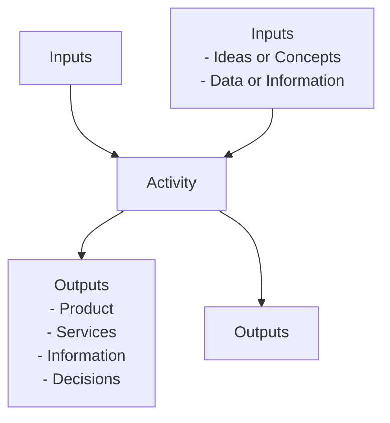
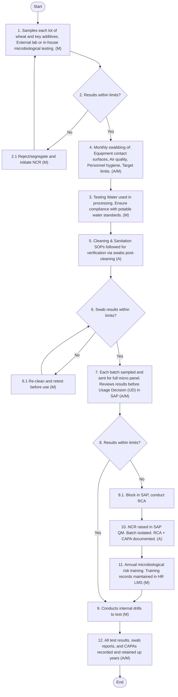
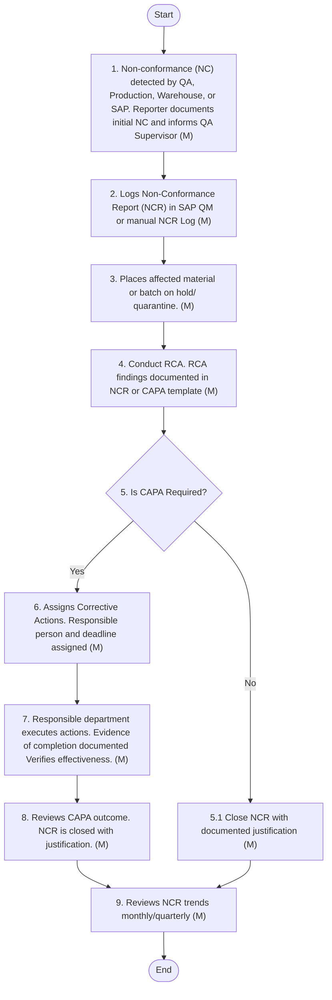
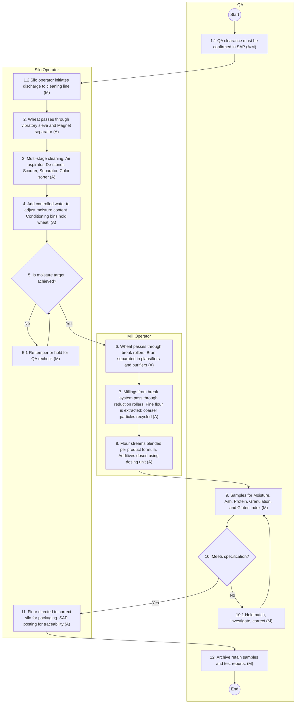
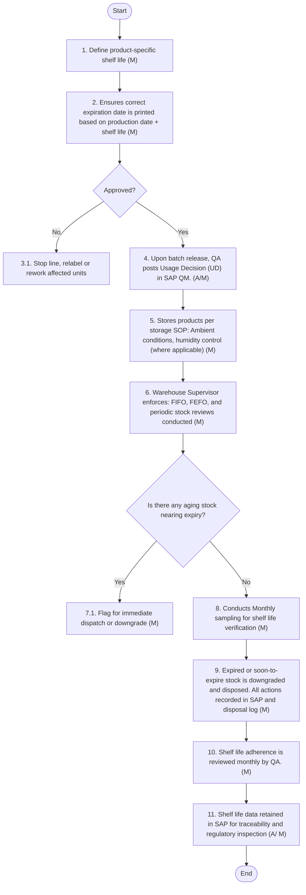

**[Diagram — PNG]:**

المطاحن  
Arabian Mills
PRODUCTION MANUAL (FLOUR)

| Accessibility: | ☒ Confidential | ☐ Controlled |  |  |
| --- | --- | --- | --- | --- |
| Version: | ☐ Draft | ☐ Revised Draft | ☒ Final Draft | ☐ Approved |
| Revision cycle | ☒ Annually |  |  |  |
DOCUMENT INFORMATION

| Category | Information |
| --- | --- |
| Document | Production Manual |
| Department | Manufacturing – Flour Mill |
| Created by | Deloitte |
| Reviewed by | Branch Manager; Production Director and Quality team |
| Approved by |  |
| Owner of the document | COO |
DOCUMENT REVISION HISTORY

| Description | Version Ref. | Rationale for Revision | **Created**<br>
- by | Creat ion date | **Reviewed**<br>
- by | **Review**<br>
- date |
| --- | --- | --- | --- | --- | --- | --- |
| Original Version | 1.0 | New Document | Deloitte | 3 July 2025 | Branch Manager ; Production Director and Quality team | 29 July 2025 |
| 1 st Update | --- |  |  |  |  |  |
| 2 nd Update | --- |  |  |  |  |  |
| 3 rd Update | --- |  |  |  |  |  |
| 4 th Update | --- |  |  |  |  |  |
| 5 th Update | --- |  |  |  |  |  |
DISTRIBUTION LIST

| Department | Designation |
| --- | --- |
| Production | COO |
| Maintenance | Maintenance Director |
| Supply Chain | Supply Chain Director |
| Quality | HOD Qual ity |
| All branches | Branch Managers |

Arabian Mills for Food Products Company (the “Company” or “Arabian Mills”) is a Saudi Closed Joint Stock Company registered in Riyadh, Kingdom of Saudi Arabia under commercial registration numbered 1010465464 dated 10 Safar 1438H (corresponding to 10 November 2016). The Company’s licensed activities include Packing and grinding wheat, packing and grinding grits, semolina, and bulgur, manufacture of concentrated feed for animals, manufacture of livestock feed, wholesale of bakery products, trade of specialty and healthy foods, land transportation of goods, storage in ports and customs or free zones, and integrated office administrative services activities.
On 6 Jumada Al-Ula 1445H (corresponding to 20 November 2023), the shareholders of the Company resolved to change the name of the Company to Arabian Mills for Food Products Company.
The Company sells products under following brands:

- Finah: Various types of flour including Chapati Flour, Pizza Flour, Patent Flour, Superior Flour, Whole Wheat Flour, and Vitamin D – All Purpose Flour.

- Kamil: A range of animal feeds including Broiler Starter Feed, Pigeon Feed, Cobb Breeder Feeds, Layer Feeds, Livestock Feeds, Horse Feed, Rabbit Feed, and Experimental Animal Feed.

- Master Mills: Various types of products including Premium Flour, Pasta, Semolina, Cake Mixes, Gluten Free products, Durum Wheat Harees and Jareesh, and Oats.
The Production Policy and Procedure Manual has been prepared to provide clear and specific guidance to Arabian Mills’ production operations, detailing the mandatory requirements for flour manufacturing, in-process quality control, consumer safety, and hygiene practices.
This manual is aligned with the principles of HACCP (Hazard Analysis and Critical Control Points) and incorporates relevant PRPs (Prerequisite Programs) and OPRPs (Operational Prerequisite Programs) across applicable process steps.
It serves as a foundational reference to support safe and consistent operations, complementing the formal HACCP plan and providing a structured approach to both quality assurance and food safety risk control.
To consistently produce safe and high-quality products in alignment with Arabian Mill’s core mission, every branch within Arabian Mills must implement these measures and adhere fully to the requirements outlined in this document.
These manual addresses product safety and quality across Arabian Mills operations, encompassing storage, distribution, and, to a certain extent, third-party suppliers and manufacturers. To comply with this document, each branch must establish and maintain the necessary capabilities and systems that safeguard product safety and quality across the entire supply chain—from raw material sourcing, pre-processing, production, packaging, and storage, through to distribution and eventual use by the consumer.
The emphasis of the systems and internal controls implemented should be on prevention, rather than detection, by designing safe products, processes, and infrastructure from the outset. In addition, it is critical that employees receive proper training to ensure they understand and can effectively execute the necessary procedures and requirements.
Arabian Mills is also committed to ensuring compliance with local legal requirements. In cases where local regulations are stricter than those outlined in this document, local laws will take precedence. Conversely, if the standards set forth by Arabian Mills are stricter than those prescribed by local laws, the company’s internal policies will govern operations. This approach ensures that our practices remain in full compliance with all applicable legal and regulatory frameworks.
To maintain compliance and continuously improve operations, regular reviews must be conducted across all branches. These reviews should assess adherence to consumer safety standards, product quality, relevant process legislation, and internal policies and procedures. Any exemptions granted by branches or designated individuals should be properly documented to ensure transparency and accountability.

The purpose of this Production Policy and Procedure Manual (the “Manual”) is to establish a uniform approach to all operational activities.
i. Enhance product quality and ensure food safety.
ii. Improve operational efficiency through well-defined SOPs.
iii. Ensure compliance with national and international regulatory frameworks (e.g., SFDA, ISO 22000, GSO 9:2013).
iv. Facilitate employee training and performance monitoring.
v. Provide a robust interface with the SAP ERP to enable real-time traceability, automated alerts, and compliance reporting.
vi. Build a risk-based food safety culture that emphasizes continuous improvement.
The manual serves to achieve the following objectives:

- Standardization of Process:
By establishing standardized financial practices and guidelines, the manual aims to promote consistency across the organization. This consistency will help in achieving compliance with relevant laws (including applicable SFDA regulations), rules, and industry standards.

- Clear Accountability:
Each section of the manual will precisely define the roles and responsibilities of all personnel engaged in various production processes and procedures. This will ensure clear accountability, foster a culture of compliance, and minimize potential risks. Further, it promotes transparency in operations and processes by providing clear and detailed documentation of production policies and procedures.

- Decision Making:
The manual will serve as an indispensable reference for the Company's Management. It will assist in making informed decisions, ensuring adherence to financial best practices, and reinforcing a robust internal control environment.

- Achieving the Company’s Strategic Objectives:
This manual will ensure that all operational activities of the Company are in line with the Company’s strategic objectives.

- Training and Development:
The manual will act as a comprehensive training tool for new employees, helping them understand the Company’s production policies and procedures. It will also serve as a reference guide for existing staff, ensuring they follow the correct procedures.

- Risk Management:
Identifies and mitigates financial risks through well-defined procedures. Ensures that potential issues are addressed promptly and effectively, safeguarding the Company’s financial health.

- Efficiency and Accuracy:
Streamlines production processes, improving efficiency and reducing the likelihood of errors. Enhances operational efficiency and effectiveness.

- Continuous Improvement:
The manual will be a living document, subject to periodic reviews and updates to adapt to changing business needs, industry trends, and regulatory requirements. Continuous improvement will be emphasized to enhance the effectiveness of financial operations.

This manual applies to:
i. All employees involved in flour milling operations.
ii. Procurement and supplier management personnel.
iii. Quality assurance teams and regulatory bodies.
iv. Logistics and distribution teams handling the final product.
v. Maintenance and engineering teams managing milling equipment.
vi. SAP end users, key users, and business process owners who are responsible for data integrity and transaction compliance.
vii. External third-party processors and co-packers, where applicable.
The Manual shall be reviewed on an <annual basis> or <as needed>, to update it in line with the applicable standards and interpretations.

The Process Map Key serves as a standardized reference to interpret the visual Process Flow Diagrams included in the manual documentation. It defines the symbols, terminologies, and flow notations used to map out operational steps, responsibilities, decision points, and system interfaces across various milling stages.
1.4.1 Following key symbols are used in the process maps in this manual:

| Figure | Explanation | Figure | Explanation |
| --- | --- | --- | --- |
|  | This symbol represents a decision. Decisions are typically phrased as yes/ no questions. This symbol usually precedes a yes / no path |  | This symbol represents input to a process. Inputs are typically information, materials or outputs from a different process |
|  | Used to display the beginning and end of a process. |  | This symbol represents a process or an activity and its usually automated process. |
|  | This symbol represents information output such as a report or document. |  | This symbol represents a set of activities that have already been defined as a process separately |
|  | This symbol represents archiving. |  | This symbol represents a link to another page with certain relevance |
|  | Legend (M) in each symbol represents nature of the control that is “Manual” should be in place for this process |  | Legend (A) in each symbol represents nature of the control that is “Automated” should be in place for this process |
|  | Legend (A/M) in each symbol represents nature of the control that is “Semi-Automated” should be in place for this process |  |  |
A procedure changes inputs into outputs, using resources and according to defined rules:

**[Diagram — EMF→PNG]:**

**Process Name:** Activity  

**Roles / Swimlanes:** None specified in the diagram.

---

### Steps

| Step # | Role | Action | Decision/Next Step |
|--------|------|--------|--------------------|
| 1 | Not specified | Receive **Inputs** from the left:  - Ideas or Concepts  - Data or Information | Proceed to Step 2 (Activity) |
| 2 | Not specified | Perform **Activity** (central process box labeled “Activity”) receiving **Inputs** from the top (label: “Inputs”) and from the left (detailed list above). | Proceed to Step 3 (Outputs) |
| 3 | Not specified | Produce **Outputs** to the right:  - Product  - Services  - Information  - Decisions; and also produce **Outputs** downward (label: “Outputs”). | End of process |

---

### Text Exactly as Appearing in the Diagram

- Top label above the central box: `Inputs`
- Left-side heading: `Inputs`
  - `- Ideas or Concepts`
  - `- Data or Information`
- Central box label: `Activity`
- Right-side heading: `Outputs`
  - `- Product`
  - `- Services`
  - `- Information`
  - `- Decisions`
- Bottom label below the central box: `Outputs`

---

### Mermaid Diagram



# 1.5 Production Procedures
## List of Equipment:

2.0 Production Procedures:
2.1 List of Equipment & Salient Features:
The Arabian Flour Mill operates with a fully automated infrastructure, incorporating advanced mechanical, pneumatic, and digital control systems designed for high-efficiency and precision. This section outlines the key equipment components that are already in operation.
While much of the core machinery and support infrastructure is already established, this list aims to complement the current setup by providing a comprehensive reference for all critical equipment categories—from raw material intake to finished product dispatch. It supports continuous improvement by identifying opportunities to integrate or upgrade technologies based on emerging leading practices, regulatory expectations, and operational optimization strategies.
The inclusion of this equipment overview ensures:
i. Enhanced traceability and process transparency
ii. Compliance with leading quality and safety standards
iii. Improved product consistency, hygiene, and throughput
iv. Readiness for audit, training, and maintenance planning
It also serves as a baseline reference for plant operators, maintenance teams, and quality assurance personnel when verifying the operational readiness and performance reliability of the milling lines.
2.1.1 Intake & Pre-Cleaning Equipment:
The first stage in milling involves receiving, cleaning, and preparing wheat before it enters the grinding process.
i. Track Carrier (Wheat Receiving & Transport)
  a. Function: Transfers wheat from trucks, or other transportation sources to the storage silos.
  b. Key Features:
    i. Bulk grain handling with integrated weighbridge compatibility.
    ii. Dust suppression systems for hygiene and air quality.
    iii. SAP Interface: weight integration with MM module.
ii. House Cleaning Equipment
  a. Function: Ensures a hygienic processing environment by removing residual grain dust and contaminants.
  b. Key Features:
    i. Industrial-grade vacuum cleaners for dust and debris.
    ii. Floor sweepers and automated air filtration systems.
    iii. Essential for compliance with ISO 22000 food safety requirements.
iii. Magnets & Metal Detectors
  a. Function: Removes metallic contaminants from incoming wheat.
  b. Key Features:
    i. Neodymium magnets to capture ferrous metals.
    ii. Metal detectors for non-ferrous contaminants.
    iii. Installed at multiple stages to ensure no contamination enters processing.
iv. De-stoners & Aspirators
  a. Function: Removes stones, husks, and foreign matter from wheat grains using air separation and density differences.
  b. Key Features:
    i. Adjustable airflow control for fine-tuning separation efficiency.
    ii. Removes up to 99.5% of heavy impurities from raw wheat.
    iii. Multiple layered controls in place and De-Stoner are an OPRP.
v. Barley & Oats Separator
  a. Function: Eliminates barley, oats, and other unwanted grains.
  b. Key Features:
    i. Precision sieving mechanism.
    ii. Adjustable separation settings for different grain types.
2.1.2 Wheat Conditioning & Preparation Equipment:
Conditioning ensures that the wheat is at optimal moisture and cleanliness before grinding.
i. Sievers for Separation of Impurities
  a. Function: Removes fine dust and broken grains using a vibration and screening process.
  b. Key Features:
    i. Multi-layer sieving units with different mesh sizes.
    ii. Prevents entry of defective grains into milling.
ii. Scrub Device (Wheat Surface Cleaning)
  a. Function: Removes dirt, bacteria, and mold from the outer surface of wheat grains.
  b. Key Features:
    i. High-speed rotary brushes and air suction.
    ii. Reduces microbial contamination risk.
    iii. Supports ISO 21527 mold count limits.
iii. Water Conditioning System
  a. Function: Moistens wheat grains to an optimal level before grinding to improve flour yield and quality. Improper water addition may pose microbial contamination risks if water quality or dosing control fails.
  b. Key Features:
    i. Automatic water dosing system with filtration safeguards.
    ii. Industry Standard: Wheat moisture is adjusted to 14–16% for proper milling efficiency and end-product quality.
    iii. CCP Designation: Water addition is classified as a Critical Control Point (CCP) due to potential microbial contamination risk; parameters such as water source quality, dosing volume, and final wheat moisture must be closely monitored and controlled.
    iv. SAP Integration: Moisture and dosing parameters are captured through batch master data for traceability and control.
iii. Humidity Control Devices
  a. Function: Maintains controlled humidity in the conditioning chamber to ensure moisture consistency.
  b. Key Features:
    i. Automated humidity sensors.
    ii. Essential for wheat storage stability.
iv. Pull Channel Device
  a. Function: Separates heavier particles such as stones from wheat based on density.
  b. Key Features:
    i. Adjustable airflow settings.
    ii. Works in conjunction with de-stoners; enhances purity.
2.1.3 Milling & Grinding Equipment:
ii. Roller Mills (Italian/German)
  a. Function: Breaks and grinds wheat grains into fine flour.
  b. Key Features:
    i. Precision roller gaps for fine-tuned grinding.
    ii. Temperature-controlled rollers to prevent gluten damage.
    iii. Configurable for different flour grades (fine, semolina, whole grain).
    iv. Integrated with SAP Production module for batch traceability.
iii. Spiral Conveyors
  a. Function: Moves wheat and flour between processing units.
  b. Key Features:
    i. Stainless steel, food-grade material.
    ii. Enclosed design to prevent contamination.
iv. Plansifters
  a. Function: Separates flour into various grades by particle size.
  b. Key Features:
    i. Multi-tier sieving mechanism.
    ii. Automated vibration control for efficiency.
v. Purifiers
  a. Function: Refines flour by removing bran and fine impurities.
  b. Key Features:
    i. Airflow-controlled separation.
    ii. Improves flour texture and quality.
2.1.4 Post-Milling & Quality Control:
After milling, flour undergoes further quality checks before storage and packaging.
i. Weighing, Fortification & Dosing Systems
a) Function: Ensures precise measurement of flour and consistent addition of micronutrients (e.g., vitamins, iron, folic acid) as per fortification standards. This step is critical for compliance with regulatory and nutritional requirements.
b) Key Features:
    i. PLC-controlled dosing accuracy maintained within ±0.1%.
    ii. SAP Integration: Flour flow and premix dosing data captured in batch record for traceability and audit readiness.
    iii. CCP Designation: Vitamin dosing is a Critical Control Point due to its direct impact on product safety and regulatory compliance.
    iv. Flow-Linked Control: Dosing of premix (e.g., vitamin-mineral blends) is electronically linked to flour output flowrate, ensuring proportionate delivery.
ii. Silos & Storage Bins
  a. Function: Bulk storage for processed flour before packaging.
  b. Key Features:
    i. Temperature-controlled storage.
    ii. FIFO (First-In-First-Out) management system.
    i. Packaging Machines
  c. Function: Automates flour bagging, sealing, and labeling.
  d. Key Features:
    i. High-speed packaging up to 50 bags/min.
    ii. Vacuum-sealing for longer shelf life.
2.1.5 Automation & Safety Systems:
Ensuring efficiency, safety, and compliance with food safety standards.
i. Programable Logical Control (PLC-)Based Control System
  a. Function: Centralized automation of all milling operations.
  b. Key Features:
    i. Real-time monitoring of all processing stages.
    ii. Automatic troubleshooting and alerts.
ii. Quality Control Laboratory Equipment
  a. Function: Ensures compliance with industry standards for flour quality.
  b. Key Equipment:
    i. Near-Infrared Spectroscopy (NIR) – For real-time protein and gluten analysis.
    ii. Moisture Analyzer (ISO 712) – Wheat moisture should be ≤14%.
    iii. Mycotoxin Screening (ISO 16050) – Checks for aflatoxins and ochratoxins.
    iv. Ash Content Tester (ISO 2171) – Determines mineral content for flour classification.
    v. Microbial Testing Lab – Checks for Salmonella, E. coli, and mold.
iii. UV Sterilization System
  a. Function: Reduces microbial load in flour and prevents contamination.
  b. Key Features:
    i. Installed at final packaging stage.
    ii. Industry standard for extended shelf life.
iv. Air Jet Filters & Baghouse Dust Collection System
  a. Function: Maintains air quality and prevents flour dust accumulation.
  b. Key Features:
    i. HEPA filters for clean air circulation.
    ii. OSHA-compliant dust explosion prevention.
v. Grain Color Sorters
  a. Function: Optical sorting for defect-free grains.
  b. Key Features:
    i. Detects discolored, infected, or damaged grains.
vi. Vibratory Bran Finishers
  a. Function: Enhances bran separation for improved flour yield.
  b. Key Features:
    i. High-speed vibration for residue removal.
vii. Automated Pest Control System
  a. Function: Monitors and prevents insect activity.
  b. Key Features:
    i. Heat & CO2 treatment systems.
viii. Flour Fortification Dosing Units
a. Function: Nutritional enhancement as per Saudi standards.
b. Key Features:
    i. Fortifies with Iron, Folic Acid, Vitamin B12 as per Saudi Food Authority.
    ii. SFDA-compliant fortification log in SAP batch record.

Efficient material flow is fundamental to the operational integrity of a flour mill. It ensures raw material traceability, minimizes cross-contamination, and optimizes production efficiency across all stages—from grain intake to flour dispatch. The flow of materials in a modern flour mill is characterized by a systematic, controlled, and traceable movement of inputs and outputs, both physically and digitally, supported by automation and SAP integration.
This section outlines the key components of material flow, categorized into Inbound Flow, Processing Flow, Outbound Flow, and SAP Touch Points, ensuring end-to-end visibility and compliance with food safety and quality standards.
3.1.1 Inbound Flow:
The inbound flow begins with the receipt and intake of raw grains, typically wheat, which undergoes an initial screening and cleaning process before storage or direct milling. This stage includes:
i. Receiving & Sampling:  of Wheat from Silos pass through conveyor, sampled, and inspected for quality compliance.
ii. Grading & Approval: Incoming grains are evaluated based on moisture, protein content, foreign matter, and other key criteria.
iii. Temporary Holding / Silos: Approved grains are transferred to designated silos based on grade classification and intended use.
Control Points:
i. Intake Weighbridge Logs
ii. Sampling and Lab Testing Records
iii. Silo Allocation Tags
3.1.2 Processing Flow:
Once approved, raw grains follow a structured internal movement through various processing stages that convert wheat into refined flour. The core steps in this flow include:
i. Cleaning & Conditioning: Grains are cleaned, de-stoned, and conditioned to optimal moisture for milling.
ii. Grinding: Conditioned grains pass through a series of rollers and sifters that progressively reduce the particle size and separate bran, germ, and endosperm.
iii. Purification & Fortification: The flour is purified to remove impurities and, where applicable, fortified with micronutrients.
iv. Blending: Different flour streams are blended to achieve specific customer requirements.
v. Packing & Labeling: The finished flour is weighed, packed into consumer or industrial packaging, and labeled for traceability.
Control Points:
i. Process parameters (moisture, extraction rate, etc.)
ii. Inline metal detection and sifting checks
iii. Label verification and packaging inspection.
3.1.3 Outbound Flow:
Once packed, finished products follow the outbound logistics stream to storage, staging, and dispatch:
i. Storage: Packed flour is stored under controlled conditions to maintain product integrity.
ii. Order Fulfillment: Based on delivery schedules and customer orders, pallets are staged for dispatch.
iii. Dispatch: Final products are scanned, weighed, and loaded for delivery with all necessary documentation and traceability tags.
Control Points:
i. Inventory reconciliation.
ii. Shelf-life monitoring
iii. Dispatch log entries and vehicle checks.

4.1 Purpose:
To establish a structured, SAP integrated and well-documented procedure for receiving, inspecting, and transferring wheat into silos, ensuring quality, safety, and compliance with industry standards. This process aims to minimize contamination risks, improve traceability, and enhance process efficiency through robust monitoring and control mechanisms. The process should ensure:
i. Compliance with food safety regulations (ISO 22000, Codex Alimentarius).
ii. Quality assurance of wheat used in production.
iii. Integration with SAP for traceability and process control.
iv. Improved efficiency through automated monitoring technologies.
v. Enhanced risk-based monitoring and control mechanisms.
4.2 Policy Statement:
The flour mill shall operate under stringent quality and food safety protocols and follow a structured approach to wheat receipt and storage to:
i. Standardize quality control measures across all shipments.
ii. Reduce human errors through automated testing and monitoring.
iii. Ensure compliance with applicable ISO and food safety standards.
iv. Integrate real-time tracking using SAP for full visibility.
v. Implement a risk-based approach to testing and monitoring.
vi. All staff must be trained and held accountable for executing procedures correctly and consistently.
4.3 Scope:
This policy applies to all employees involved in flour milling operations, covering:
i. The receipt of wheat from external sources
ii. Wheat receipt inspection & documentation
iii. Transfer of wheat into silos
iv. Automated & manual wheat quality assessment
v. Chemical, physical, and microbiological testing
vi. Environmental & storage controls
vii. Pest control management
viii. Quarantine procedures for non-conforming wheat & rejection handling.
ix. Integration with SAP for traceability
x. Supplier verification & COA validation.
4.4 Applicable Standards & References:
i. ISO 9001:2015 - Quality Management
ii. ISO 22000:2018 - Food Safety
iii. Codex Alimentarius – Grain Storage & Handling Standards
iv. General Food Security Authority (GFSA) Regulations
v. ISO 712: Moisture Content in Cereals
vi. ISO 3093: Gluten & Falling Number in Wheat
vii. ISO 16050: Mycotoxin Detection in Grains
viii. ASTM E220 - Standard Test Method for Calibration of Temperature Sensors
ix. ASTM D1513 - Standard Test Method for Foreign Material Detection in Grains
x. Company’s Internal Quality & Food Safety Standards
4.5 Policy - Raw Wheat Receipt into Silos:
4.5.1 Pre-Transfer Inspection of Silos:
i. All silos must be inspected prior to any internal or external material transfer.
ii. Inspections include visual cleanliness, review of fumigation logs, sensor calibration verification, pest controls, temperature, aeration, mechanical integrity, and product condition.
iii. SAP inspection records must be updated before transfer approval.
iv. No transfer is permitted without clearance from QA and maintenance.
v. Rejected silos must be locked out and marked in SAP as “BLOCKED”.
4.5.2. Wheat Delivery, Receipt & Initial Inspection:
i. Every wheat consignment must be accompanied by a Delivery Note and weighed at the gate.
ii. Visual inspection must be carried out for physical contamination: stones, mould, discoloration, or insect infestation.
iii. Sampling must be conducted at receiving using sampling probes, as per random lot protocol.
iv. Initial tests include:
  a. Mechanical sieves & metal detectors at intake
  b. Sensory checks
  c. Foreign matter
  d. Infestation
v. Results must be logged in SAP QM module.
vi. Loads failing minimum criteria are rejected or quarantined.
vii. GRN to be performed in SAP MM module.
viii. FIFO shall be enforced through barcode/RFID batch tracking via SAP.
4.5.3 Quality Monitoring (Chemical & Physical Analysis):
i. All intake materials shall under chemical and physical analysis using calibrated samplers as per documented sampling plan.
ii. Key parameters include moisture, protein, gluten, mycotoxins, pH, foreign matter, grain size and hardness, test weight, and NIR testing.
iii. All tests must be conducted using calibrated and validated equipment as per approve methods.
iv. Alert and action limits for all parameters must be pre-defined and programmed in SAP.
v. Batches exceeding critical thresholds must be placed on hold in SAP and root cause analysis initiated.
vi. Supplier compliance review must be initiated in parallel for all batches exceeding critical thresholds.
vii. All analysis must be entered in SAP QM module for traceability and batch release decisions (Accept/Reject/Quarantine).
4.5.4. Microbiological / Risk-Based Testing:
i. Microbiological testing is conducted based on risk assessment using random representative sampling methods as per defined frequency:
ii. Pathogen E. coli, Salmonella, yeast/mould/fungal, total plate count (TPC), coliforms and Aflatoxin B1.
iii. Proper sampling controls must be implemented to ensure sample integrity and traceability.
iv. Environmental swabs taken periodically from silos, conveyors and grain triers, bag cutters and funnels.
v. Higher-frequency testing must be applied to raw material from new/unverified suppliers or regions and / or high-risk shipment defined as: > 7 days transit, tropical origin, or flagged supplier.
vi. External lab testing certificates to be uploaded in SAP and archived.
vii. All analysis must be entered in SAP QM module for traceability and batch release decisions (Accept/Reject/Quarantine).
4.5.5. Silo Transfer and Environmental Controls:
i. Wheat/flour transfers between silos must follow FIFO and allergen segregation rules.
ii. Transfers are to be recorded in SAP batch log.
iii. Aeration systems must be verified frequently.
iv. Silo temperature and humidity must be logged and monitored.
v. Silos must undergo regular fumigation and silo cleaning.
vi. Limit light exposure and maintain airtight closure to prevent condensation and mould.
vii. Any deviations must be escalated via CAPA (Corrective Action Preventive Action) protocols.
4.5.6. Pest Management Monitoring:
i. Integrated Pest Management (IPM) must be implemented across all storage and processing areas.
ii. Traps, glue boards, and UV light devices are monitored weekly and logged in Pest log sheets.
iii. Monthly inspections should be carried out by approved pest control contractors.
iv. Pest control strategy should be regularly reviewed based on actual logs, history and data trends.
v. All pest management activities are recorded in SAP PM module.
vi. Any deviation / infestation should lead to immediate product quarantine, root cause investigation, and treatment and must be escalated via CAPA (Corrective Action Preventive Action) protocols.
4.5.7 Grain Circulation Cycle:
i. Grain circulation must be scheduled regularly, based on grain type, moisture content, and storage duration, to maintain grain quality and prevent compaction or spoilage.
ii. To prevent moisture stratification, pest harbourage, and quality deterioration, grain in steel silos shall undergo a full circulation at minimum every 15–20 calendar days, and concrete silos every 25–30 calendar days, or more frequently as indicated by real-time monitoring of temperature, moisture, and CO2 levels. This allows for dynamic adjustment based on actual conditions, which is best practice for large-scale operations. Consider a risk assessment to define circulation frequency based on grain type and ambient conditions.
iii. Grain in any silo must not remain static beyond 60 days (or shorter for high-risk grains) without at least one full circulation cycle. Any storage extending beyond 60 days shall be subject to a documented QA risk review and written approvals by both the Branch Manager and QA Manager. For critical or sensitive grain types, this duration may be significantly shorter based on a specific risk assessment.
iv. Before initiating circulation, the responsible Silo Operator shall complete the pre-transfer inspection protocol, checking for insect activity (including visual inspection and pheromone traps where applicable), moisture build-up, off-odors, or mechanical integrity. QA must validate clearance to proceed, documenting any deviations and corrective actions taken.
v. Each circulation event shall include visual inspections during movement to detect clumping, discoloration, mold growth, or infestation. Continuous temperature and moisture monitoring within the silo (if available) should be utilized in addition to readings before and two hours after circulation, capturing readings at three depths (top, mid, bottom) to confirm uniformity and absence of stratification. Any deviation beyond thresholds (temperature >30 °C or RH >65% or other pre-defined critical limits based on grain type) shall trigger immediate corrective action such as aeration, fumigation, or re-inspection, with documented follow-up to ensure efficacy. It’s important for Saudi Arabia environment that RH >65% is quite high; mold can grow at even lower RH levels depending on temperature and grain type, therefore, it’s recommended to consider lowering this threshold or specifying it per grain.
vi. All circulation activities shall be recorded in SAP with source and destination silo IDs, quantity circulated, date and time of cycle, QA remarks (including any observations or corrective actions), linked Lot/Bin ID, and environmental data (temperature and moisture) from inside the silo and ambient conditions before and after each cycle. This data should be easily retrievable for trend analysis.
vii. Regular reviews of circulation logs and environmental trends shall be conducted at least quarterly, or more frequently during periods of high risk (e.g., hot/humid seasons) by QA and Production teams. These reviews should aim to refine circulation intervals, introduce enhanced controls, and identify opportunities for process optimization and energy efficiency.
viii. Any missed circulation schedule, abnormal inspection finding, or extended storage beyond defined limits must be escalated immediately to QA and relevant Production team. All such incidents shall be recorded in SAP for thorough root cause analysis and corrective action, with defined responsibilities and timelines for resolution.
4.5.8. Quarantine and Rejection Handling:
i. Suspect or failed materials must be segregated and labelled “QUARANTINED” with date and reason.
ii. SAP inventory status must be updated accordingly.
iii. Secondary testing must be performed for test results close to limit.
iv. Root Cause Analysis (RCA) must be performed with CAPA.
v. Rejected lots must be disposed o3ff or returned to supplier, following documented approval.
vi. Reprocessing of quarantined material shall only be allowed after successful retesting and QA release.
4.5.9. Final Batch Release:
i. Only QA can authorize final release of wheat batches post-lab testing and process checks.
ii. Release Criteria:
  a. All in-process and final quality parameters passed.
  b. Microbiological results within limits
  c. Traceability data complete
  d. Batch status changed to “RELEASED” ins SAP
iii. Batches not released withing 30 days are subject to revalidation or disposal review.
4.5.10. Record Keeping:
i. All inspection, test, and transfer data must be recorded in SAP.
ii. Physical records (if any) must be signed, dated, and filed for 3 years minimum.
iii. Electronic backups maintained by IT/QA in compliance with applicable regulatory requirements.
iv. Any manual overrides or exceptions must be justified in writing and approved by Branch Manager.
4.5.11 Supplier Performance Monitoring:
i. All wheat suppliers must be evaluated jointly by Quality, Procurement and Production teams regularly based on quality, delivery, timelines, compliance and service responsiveness.
4.6 Procedure - Raw Wheat Receipt into Silos:
This section outlines the standard procedure followed for daily flour milling operations, ensuring hygiene, product integrity, and compliance with regulatory and customer requirements.
The "Raw Wheat Receipt into Silos" procedure forms a foundational part of flour mill operations, serving as the critical bridge between inbound raw material logistics and controlled storage. This multi-step process ensures that only safe, high-quality, and compliant wheat is accepted, tested, and stored under scientifically controlled conditions to preserve integrity and traceability.
Wheat, whether sourced from local suppliers or imported channels, is subject to stringent pre-receipt, intake, and post-intake protocols. These include inspection of silo conditions, sampling, quality testing, environmental monitoring, pest control, fumigation, and segregation or quarantine of non-compliant batches. Each step is governed by pre-defined acceptance criteria, risk-based decision points, and corrective actions based on technical data, aligned with international food safety standards such as Codex Alimentarius and ISO 22000.
Integration with enterprise systems (e.g., SAP ERP – QM, MM, and PM modules) facilitates digital traceability, regulatory compliance, and audit-readiness. Scientific controls such as microbial testing, ATP monitoring, aeration management, and silo environment control reduce the risk of contamination and spoilage. Operational disciplines like FIFO, grain rotation, and supplier performance scoring ensure both product quality and supply chain accountability.
By following this structured procedure, the mill ensures that raw wheat is safely and systematically handled, setting the stage for consistent flour quality, food safety assurance, and efficient downstream processing.
4.6.1 - Step 1:  Pre-Transfer Inspection of Silos:
Before any wheat can be accepted into storage, the structural and hygienic condition of the silo must be thoroughly verified. This step ensures that residual material, microbial contamination, or pest infestation from previous batches do not compromise the integrity of incoming grain. Scientifically, this step mitigates cross-contamination risks and ensures that silos meet the prerequisites for food-grade grain storage. It aligns with GMP and HACCP protocols by enforcing a controlled and documented verification process before transfer.

| Sr. No | Procedure Description | Responsibility | Frequency |
| --- | --- | --- | --- |
| 1. | **Visual Inspection of Silos**<br>
- The Silo Operator must inspect all accessible internal surfaces of the silo (walls, hopper, roof area) using a flashlight and pre-inspection checklist. If there are "inaccessible" areas that pose a risk (e.g., hidden ledges), this should be noted for engineering solutions or alternative monitoring. The inspection should also cover the immediate conveying systems and transfer points leading into the silo for accumulation of old wheat, dust, or pest activity. This is a common bottleneck for hygiene.<br>
- The goal is to confirm the absence of old wheat, mold growth, insect debris, or moisture damage. This prevents cross-contamination or microbial carryover into the new batch.<br>
- It is mandatory that all inspections must be conducted in strict adherence to the mill's Confined Space Entry Permit (CSEP) procedures and safety protocols. This is paramount for perso nal Safety.<br>
- Schedule:<br>
- Mandatory before every wheat transfer into the silo.<br>
- A full visual inspection of each silo must be performed at least once every 30 days even if NO transfer is planned, to ensure ongoing hygienic status.<br>
- Records of both routine and pre transfer inspections shall be maintained in SAP and the silo inspection log.<br>
- Consider the following as well:<br>
- After heavy rain or high humidity periods: S pecifically check for moisture ingress.<br>
- After a prolonged shutdown/idle period: Before restarting operations, a thorough inspection is critical.<br>
- After any maintenance work inside the silo: Thorough inspection is a MUST to ensure no tools, debris, or contaminants were left behind.<br>
- ✔ Acceptance: Silo surfaces are clean, dry, free from mold, pests, or residual material; checklist fully completed and signed.<br>
- ✖ Rejection: Presence of old wheat, clumps, visible mold, insect debris, or signs of moisture ingress. Additionally, Foul or musty odors, accumulation of excessive dust or webbing (for spider mites/month).<br>
- Actions on Rejection :<br>
-
i) Silo Operator to immediately halt intake and flag the silo status as “Not Ready” in SAP. ii) QA Analyst to document findings and raise a maintenance/cleaning work order. iii) Maintenance team to carry out cleaning and sanitation as per Maintenance SOP. iv) QA Analyst to re inspect and record clearance in SAP before use .<br>
-
v) QA Specialist to re-inspects before clearance is granted.<br>
- vi) QA Specialist to escalates via email to the Silo Supervisor, with copy to Production Manager, Branch Manager and Procurement Manager ’ s. | **Silo Operator / Silo Supervisor / QA Specialist**<br>
- (for respective actions) | Before each wheat transfer |
| 2. | **Review of Fumigation Log**<br>
- QA Specialist verifies that fumigation has been carried out according to schedule (e.g., within the last 21–30 days), and that all fields in the fumigation log—including date, product, dosage, and temperature—are properly recorded by the Silo Operator. This ensures insect control is active. ✔ Accept ance : Valid fumigation date and temperature recorded. Log is signed and dated. ✖ Reject ion : Fumigation is overdue, missing, or log is incomplete. Actions on Rejection :<br>
-
i) QA Specialist to issue pest control request. No intake will be allowed until silo is re-fumigated and withholding period observed.<br>
- ii) QA Specialist to give formal Clearance by email or other modes of internal communication, once post-treatment is verified. | QA Specialist | Before each wheat transfer |
| 3. | **ATP Swab Testing for Microbial Cleanliness**<br>
- QA Analyst to performs ATP (Adenosine Triphosphate) swab testing at critical points inside the silo (inlet, cone wall, manhole cover) using a luminometer. Target ATP reading must be < 100 RLU to ensure low microbial presence. Results are uploaded to the QA module. ✔ Accept ance : ATP reading < 100 RLU — silo passes hygiene standard. ✖ Reject ion : ATP ≥ 100 RLU — indicates microbial residue. Actions on Rejection :<br>
-
i) QA Analyst to email the Silo Operator, copying Production and Branch Managers about the Rejection.<br>
- ii) Silo Operator to initiate the Cleaning and re-aeration.<br>
- iii) Silo remains “Not Ready” until QA Analyst performs the retesting, and it’s passes. | QA Analyst, Silo Operator (for respective actions) | Before each wheat transfer |
| 4. | **Sensor Calibration Verification**<br>
- Automation Engineer to check temperature and humidity sensors installed in the silo and to verify calibration against traceable standards (e.g., ASTM E220). It is to be ensured that real -time silo monitoring is accurate and reliable. ✔ Accept ance : Calibration is current and documented. Sensors are functioning. ✖ Reject ion : Calibration expired or sensor malfunction. Actions on Rejection :<br>
-
i) Automation Engineer to log the issue and raise the maintenance request.<br>
- ii) Automation Engineer to inform the Silo Operator to block the Silo from use.<br>
- iii) Silo Operator to inform QA Analyst to check the sensor after maintenance and give formal clearance for use. | Automation Engineer, Silo Operator, QA Analyst ( for respective actions) | Monthly and prior to major transfers |
| 5. | **Start Aeration Cycle (if required)**<br>
- Silo Operator to start the aeration cycle based on current season and ambient humidity levels. Aeration is important to prevent moisture build-up and mo u ld growth. Silo Operator to record the air flow rate, duration, and fan status in the silo log. ✔ Accept ance : Aeration started appropriately, and airflow data logged. ✖ Reject ion : No aeration done in high-humidity conditions; log data missing. Actions on Rejection :<br>
-
i) QA Specialist to instruct immediate aeration to Silo Operator.<br>
- ii) Silo Operator to document the Aeration period and humidity levels in the Silo. | Silo Operator, QA Specialist (for respective actions) | As per seasonal schedule |
| 6. | **Pest Control (if required) - Over & above current practice**<br>
- If any insect activity is detected during inspection, QA Analyst to organize pest control treatment (e.g., phosphine fumigation or thermal fogging) and logs treatment data. Post-treatment re-inspection is mandatory before intake. ✔ Accept ance : No live pest signs post-treatment; treatment log complete. ✖ Reject ion : Live insects detected post-treatment. Actions on Rejection :<br>
-
i) Repeat fumigation or alternative treatment applied. Silo Operator to defer the Intake during the withholding period.<br>
- ii) QA Analyst to sign off on re-inspection before silo is cleared. | QA Analyst, Silo Operator, QA Analyst (for respective actions) | As needed |
| 7. | **Raise Maintenance Order in SAP (PM Module)**<br>
- If any rejection occurs in Steps 1–6, Data Entry Operator to raise a PM order in SAP for cleaning, inspection, or repair. This ensures all corrective actions are traceable. ✔ Accept ance : PM order created, maintenance completed, silo status updated to “Ready for Use.” ✖ Reject ion : No PM order raised, or order left incomplete. Action on Rejection :<br>
-
i) Data Entry Operator to notify via email or any other internal communication system, to the Maintenance and QA Manager.<br>
- ii) Silo Operator to ensure that all loading is halted.<br>
- iii) Data Operator to update the SAP record with incident log. | Data Entry Operator, QA, Maintenance Manager’s, Silo Operator (for respective actions) | Immediately after rejection |
| 8. | **QA Clearance for Silo Usage in SAP**<br>
- QA Analyst to review all inspection documents (visual check, ATP results, calibration, fumigation, pest control) and verifies maintenance closure. Only after review, QA Analyst to update the silo status to “Ready for Use” in SAP. No wheat transfer allowed without this clearance. ✔ Accept ance : All logs valid, PM order closed, SAP updated. ✖ Reject ion : Documentation incomplete or silo status not cleared. Actions on Rejection :<br>
-
i) QA to inform the Silo Operator to hold and initiate the required corrective action.<br>
- ii) Wheat intake deferred until cleared by the QA Analyst. | QA Analyst, Silo Operator (for respective actions) | Before each wheat transfer |
4.6.2 - Step 2: Wheat Delivery Receipt & Initial Inspection:
This step governs the initial physical transfer of raw wheat from transport to facility, with sampling being the foundation of all subsequent quality assurance decisions. Scientific integrity of quality control begins here — proper sampling ensures that representative data is collected for physical, chemical, and microbiological analysis. Mistakes at this stage may lead to acceptance of inferior or contaminated grain, thus compromising both product safety and mill yield performance.

| S r . No. | Procedure Description | Responsibility | Frequency |
| --- | --- | --- | --- |
| 1. | **Document Verification**<br>
- Silo Operator to match COA, Supplier ID, and Country of Origin with Purchase Order in SAP<br>
- ✔ Accept ance : All documents match purchase order. ✖ Reject ion : Missing or mismatched COA or delivery note.<br>
- Actions on Rejection:<br>
-
i) Silo Operator, not to unload and inform Procurement Manager via email and flag delivery in SAP MM. Attach deviation tag on the lot.<br>
- ii) QA Specialist to initiate the investigation. | Silo Operator, QA Specialist, Procurement Manager (for respective actions) | For each incoming truck |
| 2. | **Apply deviation modelling tools for Risk Assessment**<br>
- The QA Manager and Automation Engineer must:<br>
-
i) Extract historical wheat quality data (moisture, protein, FM, etc.) from SAP-QM and past COAs .<br>
- ii) Input data into deviation modelling software (e.g., Power BI, Python-based tools).<br>
- iii) Generate predictive flags for outlier lots.<br>
- iv) Configure SAP to flag incoming trucks that deviate from defined baselines.<br>
-
v) Use this as a risk-ranking tool for increased sampling or testing.<br>
- ✔ Acceptance:<br>
-
i) Deviation model successfully run and integrated with SAP alerts. ii) All flagged lots reviewed before unloading.<br>
- ✖ Rejection:<br>
-
i) No modelling done, or risk categories not defined.<br>
- ii) High-risk lots not evaluated.<br>
- Actions on Rejection:<br>
-
i) QA Analyst to immediately review the trucks flagged by system and inform Production Manager.<br>
- ii) QA Analyst to increases test scope before UD. iii) If model reveals consistent supplier deviation, inform Procurement Manager and initiate Supplier CAPA. | QA Analyst, Automation Engineer, Production and Procurement Manager (for respective tasks) | Bi-annually |
| 3. | **Truck Sampling**<br>
- Silo Operator to use a manual or automated grain sampler probe to draw samples from at least 3–5 different depths and positions in the truck (front, middle, rear). Ensure sample is representative of the full load. Use clean sampling tools. Combine sub-samples into a composite sample (~2–3 kg). Label with truck ID and sampling time and send to lab for quality validation.<br>
- ✔ Accept ance : A composite sample is properly collected, representative of full load (not just surface), with no cross-contamination or spillage. Sampler probe is clean and functioning. Sample integrity maintained.<br>
- ✖ Reject ion : Sampling not performed from multiple depths; surface-only sample; sampler malfunction; sample container dirty or mislabelled ; insufficient quantity (<2kg).<br>
- Actions on Rejection:<br>
-
i) Silo Operator to re-perform sampling under QA supervision. ii) If repeated failure: stop unloading and record deviation in SAP QM module. iii) QA Analyst to assess whether truck should be rejected or isolated pending further checks. iv) Silo Operator to inform the Mechanic to check sampling equipment if malfunction suspected. | Silo Operator, QA Analyst, Mechanic (for respective actions) | Each truck |
| 4. | **Implement SAP-driven sampling**<br>
- The QA Manager, Maintenance Manager, and SAP Key User must:<br>
-
i) Categorize suppliers based on history (A/B/C risk levels).<br>
- ii) Define corresponding sampling frequency in SAP QM (e.g., every truck, alternate truck, weekly).<br>
- iii) Calibrate automated samplers at truck intake to match SAP logic.<br>
- iv) Ensure sampling logs are captured in SAP for traceability.<br>
- ✔ Accept ance :<br>
-
i) Sampling frequency is correctly linked to risk level in SAP. ii) Automated samplers work as per logic.<br>
- ✖ Reject ion :<br>
-
i) Sampling logic not aligned with supplier category.<br>
- ii) Manual override without justification.<br>
- Actions on Rejection:<br>
-
i) QA Manager to initiate audit sampling compliance. ii) QA Manager to report deviations in sampling execution. iii) QA Manager to inform Production Manager to Suspend supplier intake if logic is consistently bypassed. | QA Manager, Maintenance Manager, Production Manager, SAP Key User (for respective actions) | Annual review (or upon major supplier/process change) |
| 5 . | **Visual Inspection**<br>
- QA Analyst to perform visual inspection of wheat for physical contamination: stones, mould , discoloration, or insect infestation. ✔ Accept ance : Clean appearance; <0.5% foreign matter; no visible mould or pest infestation ✖ Reject ion : Foreign material > 0.5%, visible pest activity.<br>
- Actions on Rejection:<br>
-
i) QA Analyst to inform WH Supervisor to Isolate the truck and log the deviation in SAP QM.<br>
- ii) QA Analyst to notify QA Specialist via email and tag the lot as “Hold”; for potential rejection or re-testing. | QA Analyst, WH Supervisor, QA Specialist (for respective actions) | Each truck |
| 6. | **Operate Mechanical Sieves & Metal Detectors at Intake**<br>
- Silo Operator to activate the intake line's mechanical sieves and inline metal detector as the wheat is unloaded. Monitor the automatic ejection system and alarms. Collect sieved-out foreign matter for analysis. Ensure metal detection test is verified with test pieces (Fe, Non-Fe, SS) before use.<br>
- ✔ Accept ance :<br>
-
i) Metal Detector detects standard test pieces (Fe 2.0mm, non-Fe 2.5mm, SS 3.0mm). ii) Sieve rejects ≤ 0.5% by weight of total truck load (foreign matter such as husk, chaff, or small stones). iii) No metal alarm triggered during unloading.<br>
- ✖ Reject ion :<br>
-
i) Metal Detector fails to detect test pieces. ii) Alarm triggered during unloading. iii) Sieve rejects > 0.5% of truck weight. iv) Presence of sharp metal fragments or hardware contamination.<br>
- Actions on Rejection:<br>
-
i) Silo Operator to stop unloading immediately. ii) Isolate truck and raise deviation in SAP QM. iii) QA Analyst to perform root cause investigation (check prior truck load, unloading line hygiene). iv) QA Analyst to initiate rejection/quarantine decision in SAP.
v) Automation Engineer to inspect and recalibrate metal detector if test pieces not detected. vi) If foreign matter >0.5%: QA Analyst to retest composite sample for grading. QA Analyst to notify Production and Procurement Manager via email.<br>
- vii) Procurement Manager to inform via email to the Supplier if two consecutive trucks fail. | **Silo Operator, QA Analyst, Automation Engineer, Procurement Manager**<br>
- (for respective actions) | During unloading |
| 7 . | **Sensory Check**<br>
- QA Analyst to take 500g from the composite wheat sample and crush a handful to evaluate smell and rub between fingers to check moisture and feel. Ensure sample is at ambient temperature to avoid masking odour .<br>
- ✔ Accept ance:<br>
-
i) Smell: Fresh, natural wheat aroma ii) Touch: Grains are firm, dry, non-sticky, and non-slimy<br>
- ✖ Reject ion:<br>
-
i) Smell: Sour, musty, or fermented odour ii) Touch: Slimy, sticky, or excessively damp grains iii) Signs of sprouting or clumping<br>
- Actions on Rejection:<br>
-
i) WH Supervisor to immediately isolate the truck from unloading. ii) QA Analyst to record deviation in SAP QM as “Sensory Failure”. iii) QA Analyst to send sample for expedited lab testing (moisture, fungal growth, microbiological if required). iv) QA Analyst to notify Production Manager, Branch Manager and Procurement Manager within 1 hour.
v) If confirmed unsuitable by Quality analysis, QA Specialist should raise “Rejection Report” and SAP Usage Decision (UD) is set to ‘Rejected’. vi) WH Supervisor to return the truck or initiate disposal as per supplier agreement. vii) QA Specialist to initiate the Supplier quality incident report for recurring incidents from same supplier | **QA Analyst, QA Specialist, WH Supervisor**<br>
- (for respective actions) | Each truck |
| 8 . | **Document Deviations and Foreign Matter**<br>
- QA Analyst to documents any foreign matter, odour , insect, or parameter deviation once visual, sensory, and mechanical inspection is done. Use SAP QM module to enter inspection result and deviation classification (foreign matter, odour , infestation, etc.). If deviation exceeds the acceptable threshold, flag the batch in SAP and move truck to holding area physically and digitally.<br>
- ✔ Accept ance:<br>
-
i) Minor deviations recorded in SAP but within acceptable limits.<br>
- ii) Batch cleared for unloading after QA signs off.<br>
- iii) SAP Usage Decision (UD) status: "Accepted" ✖ Reject ion:<br>
-
i) Deviations exceed specification thresholds (e.g., foreign matter >0.5%, confirmed pest infestation, abnormal odour , mould , etc.) ii) Inspection status fails in SAP QM<br>
- Actions on Rejection:<br>
-
i) QA Analyst to flags lot as “Quarantined” in SAP QM. ii) Weighbridge Supervisor to move truck to designated QA-hold area, block access to intake point. iii) QA Analyst to initiate “Investigation Form” in SAP referencing Inspection Lot No. iv) QA Analyst to inform Procurement, Warehouse, and Production Managers by email and SAP workflow.
v) If further lab tests are needed, QA Analyst to send expedited samples. vi) QA Specialist to evaluates findings and sets SAP Usage Decision to “Rejected” if non-conformance is confirmed. vii) Rejected truck is either:<br>
- Returned to supplier (logged by Procurement & Weighbridge), or<br>
- Disposed per waste SOP if deemed unsafe.<br>
- viii) Procurement Manager to inform the Supplier about the rejection and share Quality Incident Report (QIR) via email. | **QA Analyst, QA Specialist, Procurement Manager, Weighbridge Supervisor**<br>
- (for respective actions) | Each truck |
| 9. | **Capture truck weight before and after unloading :**<br>
-
i) Weighbridge Operator to weigh the truck before unloading at the inbound weighbridge station and enter gross weight into SAP. ii) After unloading wheat at the intake point, weigh the truck again to obtain tare weight. iii) System automatically calculates net wheat weight (Gross – Tare). iv) Compare with declared net weight on delivery documents (e.g., COA or invoice).
v) Document any variation in weight compare against declared vs. actual. Tolerance limit is ±2%.<br>
- ✔ Accept ance:<br>
-
i) Declared vs. actual weight difference is ≤ ±2%. ii) Both weights are properly logged in SAP.<br>
- ✖ Reject ion:<br>
-
i) Weight variance is > ±2%. ii) Missing weighment data or truck not weighed twice.<br>
- Actions on Rejection :<br>
-
i) Weighbridge Operator does not proceed with QA clearance until weight issue is resolved. ii) Re-weigh the truck to confirm measurement accuracy. If error persists:<br>
- QA Analyst to issue deviation report.<br>
- QA Analyst to notify Procurement for informing the Supplier.<br>
- QA Analyst to Block or hold the stock in SAP MM.<br>
- QA and Procurement to decide about returning the truck if significant discrepancy is confirmed. | **Weighbridge Operator, QA Analyst**<br>
- (for respective actions) | Each truck |
| 10. | SAP Actions: |  |  |
| 10 .1 | **Create Goods Receipt Note (GRN) in SAP MM**<br>
- Data Entry Operator to logs in to SAP MM module by using the relevant Purchase Order (PO) to create GRN for incoming wheat truck. Attach COA and delivery note.<br>
- ✔ Accept ance:<br>
-
i) GRN created successfully against PO. ii) Documents attached and stored digitally.<br>
- ✖ Reject ion:<br>
-
i) PO mismatch or missing line item. ii) GRN cannot be posted.<br>
- Actions on Rejection:<br>
-
i) Data Entry Operator to contact Procurement Supervisor to verify PO. ii) Weighbridge Operator to hold the truck at weighbridge until GRN is posted. | Data Entry Operator, Procurement Supervisor, Weighbridge Operator (for respective actions) | Immediately upon physical receipt of wheat |
| 10 .2 | **Link COA and Delivery Note in SAP :**<br>
- QA Analyst to scans and uploads COA and delivery note to the GRN record. Ensure COA matches PO specs (protein, moisture, etc.)<br>
- ✔ Accept ance:<br>
-
i) COA correctly linked. ii) All key fields match SAP PO spec.<br>
- ✖ Reject ion:<br>
-
i) Missing or unlinked COA. ii) Discrepancy in analytical values.<br>
- Actions on Rejection:<br>
-
i) Reject load per QA rejection SOP. ii) Trigger non-conformance report (QIR). iii) Block in SAP and notify Procurement. | QA Analyst | At time of GRN posting |
| 10 .3 | **Initiate Inspection Lot in SAP QM**<br>
- Automatically triggered once GRN is posted. SAP generates Inspection Lot No. QA Analyst to assign result recording and test parameters.<br>
- ✔ Accept ance:<br>
-
i) Inspection Lot successfully created. ii) Correct test plan assigned.<br>
- ✖ Reject ion:<br>
-
i) Inspection Lot not created due to system or config error.<br>
- Actions on Rejection:<br>
-
i) QA Analyst to notify SAP Key User to troubleshoot.<br>
- ii ) WH Operator to not proceed with unloading. iii) QA Analyst to hold process until lot is active. | QA Analyst, SAP Key User, WH Operator (for respective actions) | Automatically triggered upon GRN posting |
| 10 .4 | **Truck Weight Recorded through SAP-Weighbridge Interface**<br>
- Weighbridge Operator to log inbound and outbound weight. System auto-links weight to GRN via truck ID.<br>
- ✔ Accept ance:<br>
-
i) Inbound and outbound weights logged correctly. ii) SAP calculates net wheat quantity.<br>
- ✖ Reject ion:<br>
-
i) Weight entry missing or mismatch (tolerance > ±2%).<br>
- Actions on Rejection:<br>
-
i) Weighbridge Operator to investigate truck scale accuracy. ii) Re-weigh truck. iii) Weighbridge Operator to notify QA Analyst and Procurement Supervisor if discrepancy persists. | Weighbridge Operator, Procurement Supervisor (for respective actions) | At inbound and outbound truck movement |
| 10 .5 | **Stock Updated Post QA Approval (UD)**<br>
- After QA Analyst approves wheat, Usage Decision (UD) is set in SAP QM. Stock is transferred to unrestricted status in MM.<br>
- ✔ Accept ance:<br>
-
i) UD set to “Accepted”. ii) Stock visible in inventory.<br>
- ✖ Reject ion :<br>
- UD cannot be set due to open defects.<br>
- Actions in Rejection:<br>
-
i) QA Analyst must resolve inspection result and document justification. ii) If non-conforming, UD set to “Rejected” by QA Analyst and blocked stock created. | QA Analyst , SAP Data Entry Operator (for respective actions) | Upon Usage Decision (UD) approval |
| 1 1 . | **Enforce FIFO through barcode/RFID batch tracking via SAP**<br>
- The Warehouse S ection Head , QA Specialist, and SAP Data Entry Operator must: 1. Generate barcode/RFID tag for each wheat batch at intake. 2. Scan tag to record bin and timestamp into SAP (MM/WM module). [ WM module currently not in use] 3. Configure system to allow material issue on FIFO basis only.<br>
- 4. Periodically verify material flow logs and audit FIFO movement.<br>
- ✔ Accept ance:<br>
-
i) Each batch tagged and scanned upon intake. ii) FIFO constraint active in SAP.<br>
- ✖ Reject ion:<br>
-
i) Tags not created or scanned. ii) SAP permits material issue out of sequence<br>
- Action on Rejection:<br>
-
i) Data Operator to lock batch in SAP until re-tagged and inform QA Specialist. ii) QA Specialist to initiate internal non-conformance report (NCR). iii) QA Specialist to inform Production Manager and escalate to Automation Specialist or SAP Admin for logic correction. | Warehouse S ection Head , QA Specialist, Automation Specialist, Production Manager, SAP Data Entry Operator (for respective actions) | Review Monthly |
4.6.3 - Step 3: Quality Monitoring (Chemical & Physical Analysis):
Physical and Chemical analysis provides the scientific basis for accepting or rejecting wheat loads. Moisture, protein, gluten, and contaminant levels are tested against predefined thresholds. SAP integration ensures traceability by tagging each load with a unique identifier, linking it with test results and future process stages. This step enforces a data-driven gatekeeping mechanism, aligning with ISO 22000 and Codex grain handling practices.

| S r . No. | Procedure Description | Responsibility | Frequency |
| --- | --- | --- | --- |
| 1. | **Sample Collection and Logging**<br>
- QA Analyst to collect representative samples from each truck/batch at intake using calibrated samplers as per documented sampling plan. Label samples and log them in SAP QM under the specific Inspection Lot number. ✔ Accept ance : Sample collected as per sampling SOP; correctly logged in SAP. ✖ Reject ion : Improper sampling, mislabelled or missing log.<br>
- Actions on Rejection: QA Analyst to discard the sample, re-sample immediately, and raise non-conformance in SAP if recurring. | QA Analyst | Each wheat lot |
| 2. | **Moisture Content Test**<br>
- QA Analyst to conduct moisture test using calibrated Moisture Analyzer as per ISO 712. Enter results into SAP QM. ✔ Accept ance : ≤ 14%. ✖ Reject ion :  >14% (risk of spoilage). Actions on Rejection:<br>
-
i) QA Analyst to flag lot as “To Be Quarantined” in SAP and inform Procurement Manager to raise NCR with supplier.<br>
- ii) QA Analyst to escalate to QA Manager, Production Manager and Procurement Manager in case Possible rejection of full truckload is happening due to not within corrective threshold limits. | QA Analyst, QA Manager, Production Manager, Procurement Manager (for respective actions) | Each truck or as per plan |
| 3. | **Protein Content Test**<br>
- QA Analyst to perform the Protein test as per Kjeldahl Method on collected samples. Compare against product specifications. ✔ Accept ance : 10.5%–13.5%. ✖ Reject ion : <10.5% or mismatch with PO. Actions on Rejection:<br>
-
i) QA Analyst to escalate to QA Manager to decide hold/rejection.<br>
- ii) QA Analyst to inform Procurement Manager via email with copy to Production Manager to review supplier compliance.<br>
- iii) QA Analyst to Hold lot in SAP until decision. | QA Analyst, QA Production, Procurement Manager’s (for respective actions) | Per sample |
| 4. | **Gluten Strength / Falling Number**<br>
- QA Analyst to perform as per ISO 3093 Falling Number test. Record results in SAP. ✔ Accept ance : 250–400 sec. ✖ Reject ion : <250 sec. (indicates sprouting risk). Actions on Rejection:<br>
-
i) QA Analyst to isolate the batch and escalate to QA Manager.<br>
- ii) QA Analyst to Mark SAP lot status as "Hold" and notify Production Manager if reallocation required. | QA Analyst, QA, Production Manager’s (for respective actions) | Per batch |
| 5. | **Mycotoxins Screening (DON etc.)**<br>
- QA Analyst to screen for mycotoxins using ELISA or HPLC as per ISO 16050. ✔ Accept ance : Values below Codex/national limits (e.g., DON <1000 µg/kg). ✖ Reject ion : Exceeds limits. Actions on Rejection:<br>
-
i) QA Analyst to raise SAP quarantine request, notify QA Manager, Production and Branch Manager.<br>
- ii) QA Manager to initiate supplier non-compliance review in coordination with Procurement Manager. | QA Analyst, QA/Production/Branch/ Procurement Managers | Each incoming shipment |
| 6. | **pH Testing**<br>
- QA Analyst to test pH using calibrated meters. Record observations in lab sheet and SAP QM. ✔ Accept ance : pH 6.0–6.5. ✖ Reject ion : <5.8 or >6.7. Actions on Rejection :<br>
-
i) QA Analyst to re-confirm reading; if confirmed, isolate lot and escalate to QA Manager for further micro testing or rejection. | QA Analyst, QA Manager (for respective actions) | Spot check for high-risk loads |
| 7. | **Foreign Matter Sieve Test**<br>
- QA Analyst to weigh sample and pass-through sieve mesh to check non-wheat particles. ✔ Accept ance : ≤ 0.5%. ✖ Reject ion : > 0.5%. Actions on Rejection:<br>
-
i) QA Analyst to document in SAP and isolate truckload.<br>
- ii) QA Analyst to inform QA and Production Manager, and initiate root cause with supplier through Procurement Manager. Raise NCR if repeated. | QA Analyst, QA/Production , Procurement Manager’s (for respective actions) | Per sample |
| 8. | **Grain Size & Hardness**<br>
- QA Analyst to analyse size distribution and hardness via mechanical sizer. ✔ Accept ance : Consistent kernel size, fines ≤ 10%. ✖ Reject ion : Fines >10%, uneven grains. Actions on Rejection :<br>
-
i) QA Analyst to flag lot as “ Deviated “and inform Production team about possible process impact.<br>
- ii) QA Manager to decide hold or downgrade. | QA Analyst, QA Manager, Production Team (for respective actions) | Per batch |
| 9. | **Test Weight ( Hectolitre Weight)**<br>
- QA Analyst to use hectolitre scale. Compare against wheat type standard. ✔ Accept ance : ≥76 kg/hL (soft), ≥78 kg/hL (hard). ✖ Reject ion : <74 kg/hL. Actions on Rejection:<br>
-
i) QA Analyst to document in SAP and inform QA Manager<br>
- ii) If multiple loads show similar issue, then QA Manager to inform Procurement Manager for supplier audit. | QA Analyst, QA/Procurement Manager’s (for respective actions) | Per sample |
| 10. | **Instrument Calibration**<br>
- QA Specialist to verify calibration tags and log calibration certificates. ✔ Accept ance : Calibration within due date. ✖ Reject ion : Expired or unverified calibration. Actions on Rej e ction:<br>
-
i) QA Analyst to halt tests, replace instrument, and repeat affected analyses. Log deviation in QA records.<br>
- ii) QA Analyst to inform Automation Engineer for necessary corrective actions. | QA Analyst, Automation Engineer (for respective actions) | Monthly / Before use |
| 11. | **NIR Testing (Near-Infrared)**<br>
- QA Analyst to scan wheat using NIR Spectrometer (ASTM D8190) for real-time profile. ✔ Accept ance : Protein, moisture, gluten values within SAP tolerance. ✖ Reject ion : Any value outside control band. Actions on Rejection:<br>
-
i) QA Analyst to re-test; if confirmed, isolate lot.<br>
- ii) QA Manager to review cumulative test data and take final action in SAP. | QA Analyst, QA Manager (for respective actions) | Per truck or as per protocol |
4.6.4 - Step 4: Microbiological / Risk-Based Testing:
Microbiological and risk-based testing of incoming wheat is a critical control point in raw material acceptance and a central component of food safety assurance. This step verifies the absence of harmful pathogens (e.g., Salmonella, E. coli) and assesses microbial load to evaluate grain hygiene, storage condition prior to delivery, and transportation contamination. ATP swab testing, rapid detection kits, or culture-based assays may be used depending on facility capabilities and risk classification.
The frequency and scope of testing follow a risk-based approach — factoring in the wheat source (imported vs. domestic), historical supplier performance, seasonal risk trends, and any deviations noted in visual/sensory checks. This step ensures that no unsafe raw wheat enters the food chain, supports preventive actions (like fumigation or rejection), and fulfils regulatory mandates under national food safety standards.

| Sr. No. | Procedure Description | Responsibility | Frequency |
| --- | --- | --- | --- |
| 1. | **Sampling for Micro Testing**<br>
- QA Analyst to collect representative grain samples from silo hatches or intake trucks using a sanitized grain sampler, following ISO 24333 sampling method. Samples must be stored in sterile Whirl-Pak bags and labelled with batch ID. ✔ Accept ance : Samples collected aseptically and logged correctly. ✖ Reject ion : Improper sampling, unlabelled/mixed samples. Actions on Rejection:<br>
-
i) QA Analyst to discard sample and repeat sampling under supervision of QA Specialist. | QA Analyst, QA Specialist (for respective actions) | Weekly / per shipment |
| 2. | **Pathogen Testing**<br>
- QA Analyst to submit 100g sample to in-house or external lab for detection of Salmonella spp. and E. coli via ISO 6579 and ISO 16649. ✔ Accept ance : ND (Not Detected) or ≤ 10 CFU/g. ✖ Reject ion : > 10 CFU/g or detected .<br>
- Actions on Rejection:<br>
-
i) QA Analyst to inform QA Manager to quarantine the lot and inform Procurement Manager to notify the supplier.<br>
- ii) QA Analyst to resample for verification before escal at ing.<br>
- iii) QA Manager to initiate the Root cause analysis (RCA) initiated. | QA Analyst, QA Manager , Procurement Manager (for respective actions) | High-risk: each lot; others: monthly |
| 4. | **Fungal Contamination (Spore ID)**<br>
- QA Analyst to perform microscopic analysis using serial dilution plating or direct plating on PDA agar. Identify genera like Aspergillus, Fusarium. ✔ Accept ance : Rare/isolated growth < detection limit. ✖ Reject ion : Moderate/heavy growth of toxigenic fungi. Actions on Rejection:<br>
-
i) QA Analyst to initiate confirmatory mycotoxin test and hold the batch.<br>
- ii) QA Analyst to inform QA Manager.<br>
- iii) Enhanced Sampling for extensive monitoring. | QA Analyst, QA Manager (for respective actions) | Bi-weekly or monthly |
| 5. | **Total Plate Count (TPC)**<br>
- QA Analyst to plate homogenized samples on Plate Count Agar (ISO 4833), incubate 30°C for 48h. ✔ Accept ance : ≤ 10⁴ CFU/g. ✖ Reject ion : > 10⁵ CFU/g. Actions on Rejection:<br>
-
i) QA Analyst to hold batch.<br>
- ii) QA to initiate cleaning validation at intake area and notify Production Manager if trend continues. | QA Analyst, QA Manager, Production Manager (for respective actions) | Weekly |
| 6. | **Mycotoxin-Producing Mould s**<br>
- QA Analyst to use mould -selective media (e.g., DG18) to detect colonies. Confirm Aspergillus flavus/ ochraceous via morphology. ✔ Accept ance : < 100 CFU/g; no visible mould . ✖ Reject ion : > 100 CFU/g or visible fungal colonies. Actions on Rejection:<br>
-
i) QA Analyst to hold batch and send for quantitative Aflatoxin screening (Step 7).<br>
- ii) QA Analyst to inform QA Manager to review previous cleaning logs. | QA Analyst, QA Manager (for respective actions) | Weekly |
| 7. | **Aflatoxin B1 Quantification**<br>
- QA Analyst to submit composite sample to HPLC or ELISA for Aflatoxin B1 (ISO 16050). Comply with country-specific limits. ✔ Accept ance : ≤ 2 µg/kg (EU), ≤ 5 µg/kg (Codex). ✖ Reject ion : > 5 µg/kg. Actions on Rejection:<br>
-
i) QA Analyst to reject batch and QA Manager, Production Manager and Branch Manager.<br>
- ii) QA Manager to Procurement Manager to notify the supplier. i ii) Data Entry Operator to document in SAP. | QA Analyst, QA , Productio n, Branch & Procurement Manager’s , Data Entry Operator (for respective actions | Weekly |
| 8. | **High-Risk Shipment Testing**<br>
- QA Analyst to test all microbiological parameters (ATP, TPC, Pathogens, Mould s, Aflatoxins). Defined as: > 7 days transit, tropical origin, or flagged supplier. ✔ Accept ance : All tests pass. ✖ Reject ion : Any one test fails. Actions on Rejection:<br>
-
i) QA Analyst to Conduct re-sampling and verify the results.<br>
- ii) QA Analyst to hold batch and trigger for joint review by QA/Procurement.<br>
- iii) QA Manager to initiate Corrective Action Request (CAR) and involved all relevant functions. | QA Analyst, QA/Procurement Manager’s & Others relevant (for respective actions) | Mandatory for flagged batches |
| 9. | **Swab Testing of Sampling Equipment**<br>
- QA Analyst to swab grain triers, bag cutters, funnels using sterile swabs with neutralizing buffer. Plate on TSA/Yeast Extract Agar. ✔ Accept ance : < 10 CFU/cm². ✖ Reject ion : > 10 CFU/cm². Actions on Rejection:<br>
-
i) QA Analyst to clean and sanitize equipment and repeat swabbing before next use.<br>
- ii) QA Analyst to Document as CAPA if recurrent. | QA Analyst | Monthly or post-positive |
| 10. | **SAP Data Entry & Batch Decision**<br>
- Data Entry Operator to log test results into SAP QM. Batch disposition to be automatically generated by SAP based on thresholds:<br>
- Accept / Reject / Quarantine. Actions (on flag):<br>
-
i) QA Manager to review batch if flagged “Quarantine” or “Rejected”.<br>
- ii) Data Entry Operator to adjust the status post-confirmation for QA. | Data Entry Operator | Real-time |
Flowchart:

**[Diagram — Visio-EMF→PNG]:**

**Process Name:** Micro Risk Control  

**Roles / Swimlanes:**
- QA  
- HR/QA  

---

### Steps

| Step # | Role  | Action (verbatim text) | Decision / Next Step |
|--------|-------|------------------------|----------------------|
| Start | QA | Start | Proceeds to **1. Samples each lot of wheat and key additives. External lab or in-house microbiological testing. (M)** |
| 1 | QA | 1. Samples each lot of wheat and key additives. External lab or in-house microbiological testing. (M) | Proceeds to **2. Results within limits?** |
| 2 | QA | 2. Results within limits? | **Yes →** Proceeds to **4. Monthly swabbing of: Equipment contact surfaces, Air quality, Personnel hygiene, Target limits. (A/M)**.  **No →** Proceeds to **2.1 Reject/segregate and initiate NCR (M)**. |
| 2.1 | QA | 2.1 Reject/segregate and initiate NCR (M) | Arrows back to **1. Samples each lot of wheat and key additives. External lab or in-house microbiological testing. (M)** |
| 4 | QA | 4. Monthly swabbing of: Equipment contact surfaces, Air quality, Personnel hygiene, Target limits. (A/M) | Proceeds to **3. Testing Water used in processing. Ensure compliance with potable water standards. (M)** |
| 3 | QA | 3. Testing Water used in processing. Ensure compliance with potable water standards. (M) | Proceeds to **5. Cleaning & Sanitation SOPs followed for verification via swabs post-cleaning (A)** |
| 5 | QA | 5. Cleaning & Sanitation SOPs followed for verification via swabs post-cleaning (A) | Proceeds to **6. Swab results within limits?** |
| 6 | QA | 6. Swab results within limits? | **Yes →** Proceeds to **7. Each batch sampled and sent for full micro panel. Reviews results before Usage Decision (UD) in SAP (A/M)**. **No →** Proceeds to **6.1 Re-clean and retest before use (M)**. |
| 6.1 | QA | 6.1 Re-clean and retest before use (M) | Arrows back to **6. Swab results within limits?** |
| 7 | QA | 7. Each batch sampled and sent for full micro panel. Reviews results before Usage Decision (UD) in SAP (A/M) | Proceeds to **8. Results within limits?** |
| 8 | QA | 8. Results within limits? | **Yes →** Proceeds to **9. Conducts internal drills to test (M)**. **No →** Proceeds to **8.1. Block in SAP, conduct RCA**. |
| 8.1 | QA | 8.1. Block in SAP, conduct RCA | Proceeds to **10. NCR raised in SAP QM. Batch isolated. RCA + CAPA documented. (A)** |
| 10 | QA | 10. NCR raised in SAP QM. Batch isolated. RCA + CAPA documented. (A) | Proceeds to **11. Annual microbiological risk training. Training records maintained in HR LMS (M)** |
| 11 | HR/QA | 11. Annual microbiological risk training. Training records maintained in HR LMS (M) | Proceeds to **9. Conducts internal drills to test (M)** |
| 9 | QA | 9. Conducts internal drills to test (M) | Proceeds to **12. All test results, swab reports, and CAPAs recorded and retained up years (A/M)** |
| 12 | QA | 12. All test results, swab reports, and CAPAs recorded and retained up years (A/M) | Proceeds to **End** |
| End | QA | End | — |

**Yes/No Branches (explicit):**

- **Step 2 – Results within limits?**  
  - Yes → 4  
  - No → 2.1  

- **Step 6 – Swab results within limits?**  
  - Yes → 7  
  - No → 6.1 (loop back to 6)  

- **Step 8 – Results within limits?**  
  - Yes → 9  
  - No → 8.1 → 10 → 11 → 9  

---

### Mermaid.js Flow


4.6.5 – Step 5: Silo Transfer & Environmental Controls for Storage:
Long-term grain storage demands strict control of internal environment — particularly temperature and humidity — to suppress microbial and pest activity. This step regulates silo allocation, internal aeration, and environmental monitoring. From a scientific perspective, it prevents condensation, maintains equilibrium moisture content (EMC), and prolongs grain viability. Fumigation and pest prevention activities are synchronized here to maintain a sterile environment.

| Sr. No. | Procedure Description | Responsibility | Frequency |
| --- | --- | --- | --- |
| 1. | **Stock Transfer Posting in SAP**<br>
- Silo Operator to initiate stock transfer posting in SAP from GR point to assigned silo bin using Movement Type. Ensure accurate silo bin code and quantity. Cross-check physical vs. system records. ✔ Accept ance : SAP stock reflects actual physical transfer and correct bin. ✖ Reject ion : Discrepancy in weight or incorrect bin. Actions on Rejection:<br>
-
i) Silo Operator to halt process, notify SAP Analyst.<br>
- ii) QA Analyst to reconcile actual vs. posted stock. Correct posting with reference to weighing slips and batch tags. | Silo Operator, QA Analyst (for respective actions) | Per transfer |
| 2. | **Monitor Silo Temperature & Humidity**<br>
- Mechanic to monitor environmental conditions via silo-integrated sensors or SCADA. Maintain ≤ 30°C and RH ≤ 65%. Check for stratification and condensation zones. Log hourly readings. ✔ Accept ance : Stable conditions within threshold. ✖ Reject ion : Exceeding either limit. Actions on Rejection:<br>
-
i) Mechanic to activate aeration or heating/cooling system. If RH persistently > 70%.<br>
- ii) QA Specialist to assess risk of fungal growth and recommend preventive fumigation and logged for CAPA. | Mechanic, QA Specialist (for respective actions) | Continuous (automated); Hourly log |
| 3. | **Aeration System Operation**<br>
- Silo Operator to verify proper operation of aeration system, fans, vents, ducts. Manual check daily; auto activation via moisture/CO₂ sensors. Inspect for airflow uniformity using manometers or CO₂ equalization. ✔ Accept ance : Aeration functional and evenly distributed. ✖ Reject ion : Blocked ducts, condensation observed, or uneven grain temp zones. Actions on Rejection:<br>
-
i) Silo Operator to pause intake and inform Engineering Technician for fan repair.<br>
- ii) QA Analyst to initiate deep core sampling and visual inspection. Restart only after clearance. | Silo Operator, Engineering Technician, QA Analyst (for respective actions) | Daily (every shift) |
| 4. | **Fumigation & Silo Cleaning**<br>
- QA Analyst to execute fumigation using approved agents (e.g., Aluminium Phosphide) under controlled conditions. Follow SOP for dosage, sealing, exposure period, and ventilation. Log treatment with date, duration, agent used. ✔ Accept ance : Treatment verified, logs signed, silo labelled as “Fumigated.” ✖ Reject ion : Overdue fumigation or missing log. Actions on Rejection:<br>
-
i) QA Analyst to isolate silo, reschedule treatment and notify QA Manager.<br>
- ii) Pest presence to trigger full fumigation plus follow-up inspection after 72 hours by QA Analyst. | QA Analyst, QA Manager (for respective actions) | Monthly / as needed |
| 5. | **F IFO Policy Enforcement**<br>
- Distribution Centre Specialist to issue wheat based on FIFO principle, verified via SAP batch date. Regularly review dispatch logs and silo depletion sequence. ✔ Accept ance : Oldest batch always dispatched first. ✖ Reject ion : If newer batch dispatched before older stock. Actions on Rejection:<br>
-
i) Distribution Specialist to place hold on dispatch. Investigate discrepancy.<br>
- ii) QA Manager to audit FIFO log and stock history. Non-compliance to be escalated to SC Planner for Inventory Control. | Distribution Centre Specialist, QA Manager, SC Planner (for respective actions) | Every batch issue |
| 6. | **Corrective Action on Environmental Deviation**<br>
- Silo Operator to respond to any deviation alerts (e.g., spike in CO₂, RH, or temp). Trigger corrective actions: increase aeration, reduce grain depth, consider fumigation. Document interventions. ✔ Accept ance: Conditions restored within 12–24 hrs. ✖ Reject ion : If deviation persists or recurrence >2 times/month. Actions on Rejection:<br>
-
i) Silo Operator to escalate to Engineering Coordinator and initiate the Root cause analysis.<br>
- ii) QA Analyst to increase monitoring frequency and report in monthly KPI’s. | Silo Operator, QA Analyst, Engineering Coordinator (for respective actions) | Immediate (on deviation) |
4.6.6 - Step 6: Pest Management Monitoring:
Pest infestation poses a significant threat to raw grain storage, both in terms of physical contamination and potential mycotoxin development. This step establishes an evidence-based, continuous pest surveillance and control system through data logging, fumigation schedules, and trend analysis. It is aligned with scientific risk-based control models (e.g., IPM — Integrated Pest Management) and ensures the facility maintains zero-tolerance compliance for pest presence in grain handling zones.

| Sr. No. | Procedure Description | Responsibility | Frequency |
| --- | --- | --- | --- |
| 1. | **Implement Structured Pest Control Program**<br>
- QA Manager to implement a documented pest control plan that includes site zoning (e.g., grain storage, transit, and packaging), inspection schedules, third-party service contracts, and bait map layout. Ensure the plan is site-specific and meets ISO 22000 / IPM standards. ✔ Accept ance : Valid pest control plan in place, contract active, inspection schedule followed. ✖ Reject ion : No plan, expired contract, or gaps in execution.<br>
- Actions on Rejection:<br>
-
i) QA Analyst to escalate non-conformance to QA Manager.<br>
- ii) QA Manager to immediately suspend receiving/storage in uncontrolled zones and initiate pest service re-contracting and emergency inspection. | QA Analyst, QA Manager (respective actions) | Weekly inspections |
| 2. | **Maintain Pest Monitoring Logs**<br>
- QA Specialist to record trap counts, species identified (e.g., insects, rodents), and sighting events in a pest log sheet. Use standardized code per zone. Include corrective actions, e.g., repositioning traps, increasing frequency. ✔ Accept ance : Accurate, complete weekly records available for each zone. ✖ Reject ion : Missing log, outdated data, or generic entries. Actions on Rejection:<br>
-
i) QA Specialist to re-inspect affected zone, fill missing log, and file a deviation report.<br>
- ii) QA Specialist to trigger pest control verification sweep and notify Silo Supervisor and Production Manager. | QA Specialist, Silo Supervisor, Production Manager (for respective actions) | Weekly |
| 3. | **Monthly Trend Analysis of Pest Activity**<br>
- QA Analyst to analyse monitoring data for emerging patterns (e.g., increased insect activity in warmer months or rodent access points). Use graphs or heatmaps by area. Adjust trap layout or frequency based on hot spots. ✔ Accept ance : Monthly summary report prepared with recommendations. ✖ Reject ion : No trend report, data unutilized. Actions on Rejection:<br>
-
i) QA Analyst to submit delayed report immediately to QA Manager for review. Failure to adjust control measures leads to audit non-conformance. | QA Analyst | Monthly |
| 4. | **Fumigation Based on Risk Zones**<br>
- Silo Operator to schedule fumigation based on infestation risk (e.g., frequent sightings, seasonal temperature > 30°C, stored duration > 2 months). Use approved fumigants (e.g., Phosphine). Follow isolation and re-entry protocols. ✔ Accept ance : Fumigation schedule matches risk level. ✖ Reject ion : Missed treatment in known infestation area. Actions on Rejection:<br>
-
i) Silo Operator to report missed treatment to QA Manager.<br>
- ii) QA Manager to advise the Silo Operator to ‘mark the Zone’ as high-risk and sealed the silo until fumigation is completed. | Silo Operator, QA Manager (for respective actions) | Monthly / As needed |
| 5 . | **Install and Maintain Pest Traps / Barriers**<br>
- QA Specialist with Engineering Coordinator to install and service physical barriers and traps in silo rooms, intake zones, and transfer corridors. Ensure trap numbers match site map. Maintain barrier integrity (e.g., sealed doors, mesh). ✔ Accept ance : Traps/barriers functional and recorded in the master bait map. ✖ Reject ion : Missing, damaged, or displaced traps. Actions on Rejection:<br>
-
i) Engineering Coordinator to replace faulty units immediately.<br>
- ii) QA Specialist to conduct snap audit of site compliance. | QA Specialist / Engineering Coordinator (for respective actions) | Quarterly or per inspection |
| 6. | **Review Pest Control Strategy**<br>
- QA Analyst to evaluate pest control efficiency by correlating trend data, site inspection reports, and infestation history. Propose updates to trap layout, inspection frequency, or supplier change if performance is poor. ✔ Accept ance : Strategy revised as per data review. ✖ Reject ion : Outdated strategy despite ongoing pest issues. Actions on Rejection:<br>
-
i) QA Manager to initiate CAPA process and review pest service SLA and immediate review to be initiated with service provider. | QA Analyst, QA Manager (for respective actions) | Monthly |
| 7. | **SAP Logging and Automation**<br>
- Data Entry Operator or QA Analyst to log fumigation and inspection schedules in the SAP PM module or custom form (whichever is used). Flag bins with detected activity for automated work order generation.<br>
- ✔ Accept ance : Digital records match physical logs. ✖ Reject ion : Missing entries, batch not flagged in system. Actions on Rejection:<br>
-
i) Data Entry Operator to re-enter the missing data and QA Analyst to verify SAP linkage. Missed automated alerts to be documented and reported. | Data Entry Operator / QA Analyst (for respective actions) | Real-time logging + Monthly audit |
4.6.7 - Step 7 Grain Circulation Management:
Grain circulation is a scientifically validated technique used to prevent moisture stratification, suppress localized microbial hotspots, and ensure uniform physical and chemical characteristics of stored wheat. Especially relevant in climates with fluctuating humidity, this practice improves grain aeration and is a proactive safeguard against spoilage and clumping. It also facilitates real-time inspection, making it a critical layer in post-storage quality preservation protocols.

| Sr. No. | Procedure Description | Responsibility | Frequency |
| --- | --- | --- | --- |
| 1. | **Plan and Schedule Circulation**<br>
- Silo Operator to plan grain circulation in line with defined intervals:<br>
- steel silos every 15–20 days,<br>
- concrete silos every 25–30 days.<br>
- QA Specialist to verify schedule against SAP records and confirm upcoming due cycles. ✔ Accept ance : Circulation plan prepared within defined interval and approved in SAP. ✖ Reject ion : Interval exceeded, or plan not prepared. Actions on Rejection:<br>
-
i) Silo Operator to immediately prepare overdue plan and notify QA<br>
- ii) QA Specialist to review and approve revised plan<br>
- iii) QA Manager to escalate if repeated delay is noted. | Silo Operator, QA Specialist, QA Manager (for respective actions) | As per defined interval (steel silos 15–20 days; concrete silos 25–30 days) |
| 2. | **Pre Transfer Inspection**<br>
- Before initiating circulation, Silo Operator to conduct pre transfer inspection as per protocol (check insect activity, moisture build up, mechanical integrity). QA Analyst to validate readiness. ✔ Accept ance : Silo surfaces clean, no pest or moisture issues, QA validation received. ✖ Reject ion : Presence of clumping, pests, or mechanical fault. Actions on Rejection:<br>
-
i) Silo Operator to halt circulation<br>
- ii) QA Analyst to document findings in SAP<br>
- iii) Engineering Coordinator to rectify faults<br>
- iv) QA Analyst to re inspect and approve prior to circulation. | Silo Operator, QA Analyst, Engineering Coordinator (for respective actions) | Before each scheduled circulation |
| 3. | **Execute Circulation**<br>
- The Silo Operator activates internal grain transfer (mechanical or pneumatic) from the bottom of the silo back to the top inlet. The circulation cycle should be calculated to ensure 1.5x full silo turnover. Conduct activity during cooler times of day (preferably early morning) to minimize condensation risk. Grain movement must be steady, avoiding bottlenecks or bridging.<br>
- ✔ Accept ance : Smooth transfer, no blockage, no abnormal dust or noise. ✖ Reject ion : Flow obstruction, equipment noise, incomplete circulation. Actions on Rejection:<br>
-
i) Silo Operator to stop operation and log deviation in SAP<br>
- ii) Inform Engineering Coordinator for troubleshooting<br>
- iii) Resume only after corrective actions and QA clearance. | Silo Operator, Engineering Coordinator, QA Analyst (for respective actions) | Every scheduled cycle |
| 4. | **Monitor Temperature & Moisture**<br>
- Instrument Mechanic and QA Analyst perform readings using silo-embedded probes or manual thermocouple devices. Check 3 vertical depths (top, middle, base) and 2 lateral positions. Parameters are recorded before and 2 hours after circulation.<br>
- ✔ Accept ance : Temperature ≤30°C, RH ≤65% and stable post circulation. ✖ Reject ion : Temperature >30°C, RH >65% or stratification persists. Actions on Rejection:<br>
-
i) QA Analyst to initiate aeration or fumigation<br>
- ii) Silo Operator to isolate affected silo in SAP<br>
- iii) QA Manager to review and approve further actions. | Instrument Mechanic, QA Analyst, Silo Operator (for respective actions) | Before and after each cycle |
| 5. | **Visual Inspection During Circulation**<br>
- QA Analyst to observe moving grain for clumping, discoloration, or insects. ✔ Accept ance : Grain free of visible contamination, consistent color and flow. ✖ Reject ion : Off odors, clumping, insect presence. Actions on Rejection:<br>
-
i) QA Analyst to stop process and sample grain<br>
- ii) QA Manager to review results and decide on reprocessing or disposal<br>
- iii) Silo Operator to log deviation in SAP. | QA Analyst, QA Manager, Silo Operator (for respective actions) | During each cycle |
| 6. | **Document Circulation Parameters in SAP**<br>
- Silo Operator logs circulation cycle in manual or digital silo circulation log. Capture the following:<br>
- Start/end time<br>
- Air velocity (if applicable)<br>
- Ambient weather<br>
- Internal readings<br>
- Silo ID & batch lot<br>
- Attach log to shift report or upload in internal system (share folder or ERP-linked document).<br>
- ✔ Accept ance : All data accurately recorded and linked in SAP. ✖ Reject ion : Missing or incorrect records. Actions on Rejection:<br>
-
i) Data Entry Operator to correct entries immediately<br>
- ii) QA Specialist to verify completeness<br>
- iii) Internal audit to review if recurrent. | Data Entry Operator, QA Specialist (for respective actions) | Immediately after each circulation |
4.6.8 - Step 8 Periodic Stored Wheat Condition Monitoring:
Periodic monitoring of stored wheat is essential to preserve grain quality and detect latent deterioration that may not be evident through environmental parameters alone. Over time, stored wheat can undergo biochemical and microbiological changes due to factors such as residual moisture, fungal growth, temperature fluctuations, or pest activity.
This step introduces a structured surveillance program incorporating visual inspection, chemical testing, and microbiological evaluation at predefined intervals post-storage. It ensures early detection of spoilage, mycotoxin development, or microbial contamination — particularly in long-stored batches.
In alignment with GFSI-aligned food safety standards and internal quality assurance protocols, this routine enhances traceability, informs inventory decision-making (e.g., rotation or disposal), and ensures compliance with regulatory and export quality criteria. It provides scientific evidence for storage stability over time and supports preventive grain preservation strategies within the silo management lifecycle.

| Sr. No. | Procedure Description | Responsibility | Frequency |
| --- | --- | --- | --- |
| 1. | **Visual Inspection of Stored Wheat**<br>
- Visual inspection must be conducted by the Silo Operator after one week of initial wheat storage to assess any signs of discoloration, mould growth, insect activity, or condensation. Silo Operator to document the Inspection details in the silo logbook, with photographic evidence if abnormalities are observed.<br>
- ✔ Accept ance : Grain appears clean, uniform colour , no signs of infestation or mould .<br>
- ✖ Reject ion : Visible mould , discoloration, or insect presence.<br>
- Actions on Rejection:<br>
-
i) QA Analyst to collect grain sample for analysis. If required escalate the matter to QA Manager and Production Manager for urgent chemical/micro analysis.<br>
- ii) Silo must be aerated, isolated, and fumigated if pest activity is confirmed. | Silo Operator, QA Analyst, QA/Production Manager’s (for respective actions) | After 1 week of storage |
| 2. | **Chemical Analysis of Stored Wheat**<br>
- After one month of storage, QA Analyst shall perform chemical testing to detect moisture increase, fat acidity, mycotoxin levels (aflatoxins, DON), and protein deterioration. Sampling to follow ISO 24333. All results to be logged in QA LIMS system and SAP QM Module.<br>
- ✔ Accept ance : All results within internal and regulatory specifications.<br>
- ✖ Reject ion : Mycotoxin above legal limit, significant moisture rise, or protein degradation.<br>
- Actions on Rejection:<br>
-
i) Silo Operator to immediately segregate the Silo and inform QA Manager.<br>
- ii) QA Manager to determine if wheat can be reconditioned (e.g., blending/drying). Otherwise, batch must be rejected and notified to Procurement and Branch Manager’s | QA Manager, Silo Operator, Procurement , Branch Manager’s (for respective actions) | After 1 month of storage |
| 3. | **Microbiological Testing of Stored Wheat**<br>
- After three months, QA Analyst to perform the microbiological testing including total plate count (TPC), mould s/yeasts, Bacillus cereus , and Enterobacteriaceae . Testing to follow ISO 4833 and ISO 21527 guidelines. SAP QM record must reflect final status.<br>
- ✔ Accept ance : Microbial load within product specs and hygiene limits.<br>
- ✖ Reject ion : TPC > 10^4 CFU/g, or any pathogenic indicators found.<br>
- Actions on Rejection:<br>
-
i) QA Analyst to ensure that Batch must be quarantined and inform QA Manager<br>
- ii) QA Specialist to initiate the Root cause investigation to assess possible storage failure. Notify QA Manager and Production for decision on reprocessing or disposal. | QA Analyst, QA Specialist, QA Manager, Production Manager (for respective actions) | After 3 months of storage |
| 4. | **SAP Logging & Traceability**<br>
- Each inspection (visual, chemical, micro) must be logged in SAP QM Module under respective silo batch with test references and acceptance/rejection disposition. Use custom inspection lot creation or standard batch classification.<br>
- ✔ Accept ance : Complete data trail with digital sign-off.<br>
- ✖ Reject ion : Missing or delayed entries, mismatch between lab data and SAP.<br>
- Actions on Rejection:<br>
-
i) Data Entry Operator to review missing fields and consult QA Lab for resubmission. QA Analyst to verify correction and close the record. | Data Entry Operator, QA Analyst (for respective actions) | Post every inspection |
4.6.9 – Step 9: Quarantine & Rejection Handling:
Rejection protocols form the defensive wall of any food safety system. This step ensures that non-conforming wheat loads — due to physical, chemical, or biological reasons — are effectively quarantined, re-tested, and either reprocessed, returned, or discarded based on scientific investigation. Root cause analysis and documentation provide traceability, uphold compliance with food safety standards, and protect downstream processing from compromised raw material.

| Sr. No. | Procedure Descriptio n | Responsibility | Frequency |
| --- | --- | --- | --- |
| 1. | **Quarantine batch if any test fails (micro, chem, or physical)**<br>
- QA Analyst to immediately isolate any batch failing acceptance criteria (e.g., mycotoxin > max limit, high foreign matter, failed protein content) by posting to a 'Blocked' location in SAP QM/MM. Label silo/bags with "QUARANTINE" tags. ✔ Accept ance : Batch visible in blocked stock in SAP and physically tagged. ✖ Reject ion : Batch left in production flow or not tagged. Actions on Rejection:<br>
-
i) QA Analyst to initiate non-conformance report (NCR), halt usage, and isolate physically. Conduct traceability check to ensure no contaminated product moved forward. | QA Analyst | On failed test result |
| 2. | **Perform secondary testing**<br>
- QA Analyst to request retesting (e.g., if aflatoxin is close to limit or inconsistent kernel moisture). Use validated analytical methods and duplicate samples from retained batch. ✔ Accept ance : Retest confirms or clarifies result. ✖ Reject ion : No retest conducted or poor documentation. Actions on Rejection:<br>
-
i) QA Analyst to file deviation report. Hold lot until confirmed disposition.<br>
- ii) Escalate to QA Manager for decision. | QA Analyst, QA Manager (for respective actions) | As needed |
| 3. | **Root cause investigation**<br>
- QA Specialist to lead root cause analysis (RCA) using 5 Whys, Ishikawa Diagram or similar method. Assess whether failure is due to supplier, handling, or internal error. ✔ Accept ance : Investigation conducted with documented evidence and corrective action. ✖ Reject ion : No RCA or incomplete analysis. Actions on Rejection:<br>
- QA Manager to issue Corrective Action Request (CAR). Block further intake from supplier if recurrence noted. | QA Specialist | Upon failure |
| 4. | **Decision Tree: Reprocess  Return  Dispose**<br>
- Department Manager (Procurement + QA) to apply triage logic: – Reprocess : if safe and contamination can be removed. – Return : if failure originates from vendor (e.g., pest-infected wheat). – Dispose : if contamination is toxic or non-recoverable. ✔ Accept ance : Decision matches RCA and is logged. ✖ Reject ion : Unjustified reprocessing or delay in action. Actions on Rejection:<br>
-
i) QA/Procurement Manager’s to escalate to respective directors and share their recommendations for decision.<br>
- ii) QA Manager to review supplier certification. | Department Manager (Procurement + QA) - for respective actions | Per incident |
| 5. | **Document all actions in SAP**<br>
- Data Entry Operator to enter all QA dispositions in SAP QM module: Block codes, usage decision, investigation outcome, supplier response (MM), and photographic records if needed. ✔ Accept ance : All entries traceable by batch. ✖ Reject ion : Missing or delayed entries. Actions on Rejection:<br>
- Internal Audit Coordinator to conduct SAP data audit. Invalidate batch if critical trail is lost. | Data Entry Operator, Internal Auditor (for respective actions) | Per incident |
4.6.10 – Step 10 Final Batch Release, Record Keeping & Supplier Interface:
The final validation of wheat readiness for processing is governed by this step. It involves ensuring that all analytical data, visual inspections, circulation cycles, pest controls, and SAP records are closed, clean, and traceable. This step certifies that the batch meets process entry standards and regulatory readiness, allowing transition to the milling process. It also forms the core documentation layer for both internal audits and external food safety inspections.

| Sr. No. | Procedure Description | Responsibility | Frequency |
| --- | --- | --- | --- |
| 1. | **Maintain detailed logs of testing, inspections, deviations**<br>
- QA Analyst and Data Entry Operator to record all quality operations in physical logs and SAP (QM module). Include analytical test reports, deviation forms, CAPAs, and sampling data. ✔ Accept ance : Records complete, signed, and organized per batch. ✖ Reject ion : Logs missing, unsigned, or data inconsistent. Actions on Rejection:<br>
-
i) QA Analyst to issue documentation deviation report. Conduct file recovery or revalidation. | Data Entry Operator , QA Analyst (for respective actions) | Ongoing |
| 2. | **Monthly internal audits to verify quality system compliance**<br>
- Internal Auditor or QA Specialist to review random samples of wheat batches, documentation, and SAP entries. Cross-check batch release decisions, pest control data, and lab certificates. ✔ Accept ance : All workflows match SOP, no major findings. ✖ Reject ion : Evidence of skipped steps, poor traceability. Actions on Rejection:<br>
-
i) Auditor to issue the Internal Audit Report. Assign CAPAs and deadlines.<br>
- ii) Repeat audit in 2 weeks to verify the actions compliance. | Internal Auditor , QA Specialist (for respective actions) | Monthly |
| 3. | **Synchronize SAP QM and MM data**<br>
- Data Entry Operator to cross-check batch release status across Quality (QM) and Material Management (MM) modules. Ensure batch is visible as "Unrestricted Use" in MM only if UD is " Accepted ". ✔ Accept ance : SAP status synchronized; lot traceable. ✖ Reject ion : Status mismatch, ghost batches. Actions on Rejection:<br>
-
i) QA Specialist to investigate the root cause. Trigger IT support if SAP interface failed and initiate blocking of incorrect batches. | Data Entry Operator, QA Specialist (for respective actions) | Per batch closure |
| 4. | **Supplier Performance Monitoring**<br>
- Procurement Manager to evaluate supplier performance based on delivery compliance, wheat quality, complaint trends, and rejection frequency. Scorecard is to be updated annually and formalize the sourcing strategy accordingly. ✔ Accept ance : Supplier meets KPIs; no repeated quality issues. ✖ Reject ion : Supplier underperforms repeatedly. Actions on Rejection:<br>
-
i) Procurement Manager to escalate to Procurement Director and placed the supplier under probation or de-list whatever is appropriate depending on the impact and severity. | Procurement Manager, Procurement Director (for respective actions) | Annual |
| 5. | **Centralized Supplier Quality Database**<br>
- Cross-functional team of Procurement, Quality and Production to maintain a central database tracking for batch quality attributes (protein, gluten, moisture). This is important to support the traceability, trend analysis, and complaint resolution. ✔ Accept ance : Database updated and used in sourcing decisions. ✖ Reject ion : Missing or outdated quality data. Actions on Rejection:<br>
-
i) Internal Audit Manager triggered the issue and recorded as non-compliance. Procurement Manager to drive the Action plan created for correction and closure of the issues. | Procurement, Quality, Production Team appointed by the respective Department Managers. | Annual |
| 6. | **Quarterly Supplier Trend Analysis**<br>
- Quality, Procurement, and Production teams to jointly review quality performance of government and imported wheat via scorecard analytics. Findings are to be used for supplier rating and feedback. ✔ Accept ance : Trends align with performance KPIs. ✖ Reject ion : Negative trends with no corrective action. Actions on Rejection:<br>
- Procurement to initiate the Supplier performance review and appropriately escalate to Procurement Director for reviewing the Sourcing continuation. | Procurement, Quality, Production Team appointed by the respective Department Managers. | Annual |
Flowchart:

**[Diagram — Visio-EMF→PNG]:**

Process Name: **Incoming Wheat**

Roles / Swimlanes:
- **QA**

Additional role explicitly mentioned within steps:
- **QA Manager**

---

### Steps

| Step # | Role | Action | Decision/Next Step |
|--------|------|--------|--------------------|
| Start | QA | Start | Next step: 1 |
| 1 | QA (M) | Check delivery note and verify Purchase Order (PO). Record truck entry time (M) | Next step: 2 |
| 2 | QA (M) | Inspects for: Seal integrity, Certificate of Analysis (COA), Bill of Lading (M) | Next step: 3 (Decision) |
| 3 (Decision) | QA | 3. Is Seal intact? | If **Yes** → Step 4. If **No** → Step 3.1 |
| 3.1 | QA / QA Manager (M) | 3.1 Immediately quarantine the truck. Notify the QA Manager (M) | No further step indicated in diagram (leaf of “No” branch from Step 3) |
| 4 | QA (M) | 4. Draw representative wheat sample. Follow approved Sampling Plan. Record sample traceability. (M) | Next step: 5 |
| 5 | QA (M) | 5. Perform tests: moisture, foreign matter, protein, infestation, etc. (M) | Next step: 6 (Decision) |
| 6 (Decision) | QA | 6. Does wheat meet specifications? | If **Yes** → Step 7. If **No** → Step 6.1 |
| 6.1 | QA (M) | 6.1. Immediately place the truck on hold. (M) | No further step indicated in diagram (leaf of “No” branch from Step 6) |
| 7 | QA (A/M) | 7. Create Goods Receipt Note (GRN) in SAP MM. Link wheat lot number and supplier batch (A/M) | Next step: 8 |
| 8 | QA (M) | 8. Direct wheat to pre-assigned silo. Operator to record stock transfer in SAP MM (M) | Next step: 9 |
| 9 | QA (M) | 9. Retain sample as per retention policy. Archive lab results in SAP QM (M) | Next step: End |
| End | QA | End | None (process ends) |

---

### Mermaid.js Diagram

```mermaid
graph TD

    Start([Start])
    S1[1. Check delivery note and verify Purchase Order (PO). Record truck entry time (M)]
    S2[2. Inspects for: Seal integrity, Certificate of Analysis (COA), Bill of Lading (M)]
    D3{3. Is Seal intact?}
    S3_1[3.1 Immediately quarantine the truck. Notify the QA Manager (M)]
    S4[4. Draw representative wheat sample. Follow approved Sampling Plan. Record sample traceability. (M)]
    S5[5. Perform tests: moisture, foreign matter, protein, infestation, etc. (M)]
    D6{6. Does wheat meet specifications?}
    S6_1[6.1. Immediately place the truck on hold. (M)]
    S7[7. Create Goods Receipt Note (GRN) in SAP MM. Link wheat lot number and supplier batch (A/M)]
    S8[8. Direct wheat to pre-assigned silo. Operator to record stock transfer in SAP MM (M)]
    S9[9. Retain sample as per retention policy. Archive lab results in SAP QM (M)]
    End([End])

    Start --> S1 --> S2 --> D3
    D3 -- Yes --> S4
    D3 -- No --> S3_1
    S4 --> S5 --> D6
    D6 -- Yes --> S7
    D6 -- No --> S6_1
    S7 --> S8 --> S9 --> End
```
4.7. Emergency Procedures:
4.7.1.  Silo Contamination or System Failure:

| Sr. No. | Procedure Description | Responsibility | Frequency |
| --- | --- | --- | --- |
| 1. | **Detection of Contamination or Residue in Silos**<br>
- If microbial residue, excessive dust, or pest activity is observed during pre-transfer inspection, the Silo Operator halts wheat transfers and isolates the silo.<br>
- ✔ Acceptance : No visible contamination, clean inspection, normal odor profile.<br>
- ✖ Rejection : Presence of mold, foul odor, pest residue, or unusual dust build-up.<br>
- Actions on Rejection:<br>
-
i) Silo Operator to immediately halt the operations. Isolate silo and seal all entry points.<br>
- ii) Silo Operator to notify QA Analyst to initiate testing (ATP, visual, Odor ). | Silo Operator | On-detection |
| 2. | **Trigger ATP & Visual Inspection**<br>
- QA Analyst to conducts ATP swab test, sensory (odor) check, and visual inspection. Past fumigation and cleaning records are reviewed. ✔ Accept ance : ATP result <100 RLU, no mold or off-odors. ✖ Reject ion : ATP >100 RLU, visible contamination, or deviation from acceptable logs.<br>
- Actions on Rejection:<br>
-
i) QA Analyst to classify contamination as minor or severe.<br>
- ii) Inform Production Manager and escalate to Branch Manager if needed. | QA Analyst, Production/Branch Manager’s (for respective actions) | Upon Contamination Trigger |
| 3. | **Cleaning & Fumigation**<br>
- For minor issues: Activate cleaning & fumigation per SOP.<br>
- For severe contamination: Initiate Emergency Cleaning & Decontamination Plan. ✔ Accept ance : Post-cleaning ATP <100 RLU, no mold or pest traces. ✖ Reject ion : Re-test failure or recurring contamination. Actions on Rejection:<br>
-
i) QA Specialist to Repeat full decontamination and notify the relevant people in Production and Compliance.<br>
- ii) Silo Operator to maintain silo in “Blocked” SAP status. | QA Specialist, Production Manager, Compliance Manager, Silo Operator (for respective actions) | As Required |
| 4. | **Escalation Protocol**<br>
- For all Minor issues should be handled by QA & Production Manager’s. However, if unresolved, escalate to Branch Manager.<br>
- For issues related to safety/legal exposure, QA Manager to inform Government Relations Specialist and Production Director. ✔ Accept ance : Proper escalation and timely resolution. ✖ Reject ion : Unresolved issues or delayed escalation. Actions on Rejection:<br>
-
i) Branch Manager to form the Emergency team for liaison with regulators (if required). | QA/Production/Branch Manager’s (for respective actions) | Upon Escalation |

| Sr. No. | Procedure Description | Responsibility | Frequency |
| --- | --- | --- | --- |
| 5. | **Mechanical Inspection**<br>
- Post-cleaning, Engineering Coordinator to check all silo components for damage or wear (vents, filters, inlets). ✔ Accept ance : Silo structurally intact, all systems functional. ✖ Reject ion : Damage to mechanical parts, poor airflow, structural weakness. Actions on Rejection:<br>
-
i) Engineering Coordinator to raise SAP maintenance order.<br>
- ii) Replace/repair components and inform QA Specialist to inspect and approve.<br>
- iii) QA Specialist to inform Silo Operator to change the status in SAP to “Ready for Use”<br>
- iv) QA Specialist to initiate Root Cause Analysis. All findings, tests, actions logged in SAP. Notify Branch Manager to review the completeness of all actions. | Engineering Coordinator, QA Specialist, Silo Operator, Branch Manager (for respective actions) | Before Silo Use, Post Incident |
4.7.2. Sensor Malfunction or Calibration Failure:

| Sr. No. | Procedure Description | Responsibility | Frequency |
| --- | --- | --- | --- |
| 1. | **Detection of Sensor Malfunction**<br>
- If temperature or humidity sensors display abnormal, inconsistent, or no readings, the Wheat Transfer Operation must be stopped immediately to avoid spoilage or condensation-related risks.<br>
- ✔ Accept ance : Sensor readings consistent with process conditions and trend history.<br>
- ✖ Reject ion : Sensor shows erratic, zero, or out-of-spec readings<br>
- Actions on Rejection:<br>
- Stop transfer operations.<br>
- Isolate affected silo.<br>
- Inform Maintenance Department Manager. | Silo Operator | On-detection |
| 2. | **Deploy Backup Monitoring**<br>
- Use handheld calibrated hygrometers and thermometers to record temperature/humidity. Compare manual readings with historical records and expected norms. ✔ Accept ance : Manual readings are within acceptable range; stable trends. ✖ Reject ion : Manual readings indicate unsafe storage conditions. Actions on Rejection:<br>
-
i) Silo Supervisor to escalate to QA & Production Manager.<br>
- ii) Silo Operator to re-check manual readings after 1 hour. If unsafe, assess wheat condition for possible spoilage. | Silo Operator, Silo Supervisor, QA & Production Manager’s (for respective actions) | Immediate |
| 3. | **Technical Diagnosis & Repair**<br>
- If readings are inaccurate: Conduct calibration using certified method per ASTM E220.<br>
- If sensor is non-functional: Remove and replace with calibrated sensor. ✔ Accept ance : Sensor recalibrated and functioning within tolerance. ✖ Reject ion : Sensor unable to recalibrate or still non-responsive. Actions on Rejection:<br>
-
i) Automation Engineer to replace sensor and Retest system using standard probe.<br>
- ii) Automation Engineer to record work order in SAP Maintenance Module. | Automation Engineer | On issue detection |

| Sr. No. | Procedure Description | Responsibility | Frequency |
| --- | --- | --- | --- |
| 4. | **Post-Repair Validation**<br>
- Validate new sensor readings against handheld equipment and trend lines. Conduct sensor system check to confirm operational integrity. ✔ Accept ance : Readings consistent and trend aligned. ✖ Reject ion : Fluctuation or mismatch persists. Actions on Rejection:<br>
-
i) Automation Engineer to investigate possible software / configuration errors.<br>
- ii) Contact vendor if sensor failure persists post-installation.<br>
- iii) Inform QA Manager to validate compliance. | QA Manager, Automation Engineer (for respective actions) | Before Resuming Operations |
|  | **Escalation & Emergency Approval**<br>
- Minor calibration should be handled by Maintenance. In case of urgent sensor replacement is required then escalate to Production Manager.<br>
- For compliance threats, Government Relations Specialist to be informed. ✔ Accept ance : Proper escalation and documented approvals. ✖ Reject ion : Delay in corrective response or unauthorized reactivation. Actions on Rejection:<br>
-
i) QA Specialist to raise non-conformance report.<br>
- ii) Production Manager to investigate escalation lapses and inform the Branch Manager. | Engineering Coordinator, QA Specialist, Government Relations Specialist, Production Manager, Branch Manager (for respective actions) | As required |
| 5. | **Documentation & Reporting**<br>
- All readings, actions, and replacements logged in SAP Maintenance Module.<br>
- Root Cause Analysis (RCA) to be conducted if repeated failures occur. ✔ Accept ance : Logs complete and RCA filed (if required). ✖ Reject ion : Missing test logs or incomplete RCA. Actions on Rejection:<br>
-
i) QA Manager to request correction.<br>
- ii) Engineering Coordinator to initiate the Preventive action planning. | Data Entry Operator, QA Manager, Engineering Coordinator (for respective actions) | Post-actions |
4.7.3. Structural Damage or Mechanical Malfunction:

| Sr. No. | Procedure Description | Responsibility | Frequency |
| --- | --- | --- | --- |
| 1. | **Detection of Structural or Mechanical Failure**<br>
- If silo wall cracks, buckling, conveyor malfunction, or blockage is noticed, immediately suspend wheat intake and isolate the affected silo. ✔ Accept ance : Equipment and structure intact and stable. ✖ Reject ion : Visible cracks, instability, or mechanical breakdown. Actions on Rejection:<br>
-
i) Silo Operator to immediately suspend silo operation.<br>
- ii) Inform Engineering Coordinator and Production Manager. | Silo Operator, Engineering Coordinator, Production Manager | On detection |
| 2. | **Conduct Structural & Mechanical Inspection**<br>
- Perform visual inspection of silo wall, roof, discharge mechanism, conveyor belts. If any doubt on integrity, use ultrasonic thickness testing or other non-destructive testing (NDT). ✔ Accept ance : No evidence of structural degradation or mechanical wear. ✖ Reject ion : Cracks, leaks, wear, metal thinning, or vibration. Actions on Rejection:<br>
-
i) Engineering Coordinator to escalate to Maintenance Department Manager and inform Branch Manager.<br>
- ii) Inform the Safety Specialist and secure the area to prevent safety risks. | Engineering Coordinator, Safety Specialist (for respective actions) | Immediate |
| 3. | **Decision on Corrective Action**<br>
- Minor damage: Reinforce and validate silo stability before reuse.<br>
- Major damage: a. Isolate silo. b. Initiate emergency repairs. c. Engage external engineering consultant if required. ✔ Accept ance : Repairs completed and stability validated. ✖ Reject ion : Incomplete repair, risk of collapse, or structural non-compliance. Actions on Rejection:<br>
-
i) Silo Operator to suspend operations.<br>
- ii) Do not resume until written clearance from Engineering Coordinator is received and Production Manager cleared the use. | Engineering Coordinator, Production Manager | Based on severity |
| 4. | **Communication & Escalation**<br>
- Level 1: Engineering Mechanic handles minor issues.<br>
- Level 2: Severe issues escalated to Production Manager & Engineering Department Manager.<br>
- Level 3: Safety-critical cases reported to Branch Manager, Production Director & External Engineers. ✔ Accept ance : Timely escalation and communication logs maintained. ✖ Reject ion : Delay or gaps in escalation chain. Actions on Rejection:<br>
-
i) Engineering Coordinator to review SOP compliance.<br>
- ii) Production Manager to conduct disciplinary review if negligence observed. | Engineering Mechanic, Production/Engineering Department Manager’s, Branch Manager (for respective actions) | As needed |

| Sr. No. | Procedure Description | Responsibility | Frequency |
| --- | --- | --- | --- |
| 5. | **Record, Report, and Preventive Review**<br>
- Document structural issue, repair logs, and downtime in SAP Asset Management System. Conduct Root Cause Analysis and review Preventive Maintenance Program. ✔ Accept ance : Complete digital documentation and action tracking. ✖ Reject ion : Missing records or unresolved preventive gaps. Actions on Rejection:<br>
-
i) QA Specialist to issue non-compliance notice.<br>
- ii) Engineering Coordinator to update preventive checklist and schedule. | QA Specialist, Engineering Coordinator (for respective actions) | Post Incident |
D. Processing / Milling Operation:
Milling is the central transformation stage in flour production—where cleaned, tempered wheat kernels are broken down and refined into flour through a systematic sequence of grinding (reduction) and sifting (separation) processes. It is both a physical and a functional operation that directly defines the quality, yield, and consistency of the final product.
This stage is not just about crushing grain; it’s about selectively extracting the endosperm while minimizing contamination from bran and germ. The precision with which this is done determines key flour parameters such as:
i. Ash content (a proxy for bran contamination),
ii. Granulation profile (particle size distribution),
iii. Starch damage (impacting water absorption and dough behavior)
iv. Color and whiteness.
v. Functional performance across applications (bread, cake, biscuit, pasta, etc.).
Milling also plays a major role in extraction rate optimization; balancing yield with quality to meet both commercial targets and customer specifications. Even slight misalignments in feed rate, roll pressure, sieve efficiency, or air aspiration can cascade into:
i. Unstable product quality,
ii. Increased rework or waste,
iii. Lower customer satisfaction,
iv. And reduced profitability.
With advances in automation and sensor technologies, modern milling operations rely on real-time data from PLCs, moisture sensors, and roller diagnostics to make minute adjustments that maintain process stability. But human expertise remains crucial, particularly in analyzing trends, responding to raw wheat variability, and interpreting subtle process shifts that automation may not fully capture.
The milling process serves as the pivotal stage where raw wheat variability is controlled through precision equipment, technical expertise, and continuous monitoring to deliver consistent flour quality. It combines scientific principles of grain processing with hands-on operational skill to ensure that every batch meets stringent quality, safety, and performance standards. As such, milling is one of the most critical control points—directly influencing product compliance, downstream application performance, and customer confidence.
5.1 Purpose:
The purpose of this policy and procedure is to standardize and control the wheat milling process through an automated, precision-driven system to ensure product quality, food safety, and operational efficiency. Utilizing advanced milling technologies from manufacturers such as Buhler and controlled via PLC- or SCADA-based automation platforms, this process enables consistent execution of each milling phase—from cleaning and conditioning to grinding, sifting, and final flour separation.
Key objectives include:
i. Ensuring optimal break-release ratios and sifting efficiency through controlled roller gap settings and sieve calibration.
ii. Minimizing flour ash content and bran contamination by maintaining correct roller speed differentials and effective purification steps.
iii. Reducing energy losses by standardizing pneumatic conveying, mechanical load balancing, and enforcing preventive maintenance schedules.
iv. Preventing microbial or physical contamination through in-line metal detection, allergen segregation protocols, and frequent sanitation of equipment.
This procedure plays a critical role in meeting regulatory requirements and standards such as HACCP, ISO 22000, and ISO 9001, ensuring that the final product is safe, traceable, and aligned with customer satisfaction.
5.2 Policy Statement:
i. All milling operations within the facility shall be conducted under strict process controls to ensure product consistency, regulatory compliance, and operational efficiency.
ii. The facility mandates the use of validated process parameters, equipment calibration, energy optimization, and robust in-process quality checks to maintain high product standards.
iii. Deviations from specified control limits shall trigger immediate corrective action as per defined protocols.
iv. All relevant process data shall be accurately recorded in the SAP system to ensure full traceability, audit readiness, and continuous improvement of milling performance.
v. It is the responsibility of all personnel involved in milling to adhere to this policy and contribute to the ongoing optimization of product quality and manufacturing efficiency.
5.3 Scope:
This procedure applies to the complete spectrum of milling operations within the facility, encompassing wheat cleaning, separation, conditioning (moisturization), grinding, milling, yield optimization, energy management, and in-process quality assurance activities. It is applicable to all relevant functions, including Production, Maintenance, and Quality Assurance department, and governs the consistent execution of milling processes across all shifts and product categories. The scope also supports alignment with regulatory requirements, customer specifications, and corporate quality standards.
5.4 Applicable Standards & References:
The procedure aligns with the following internationally recognized standards and best practices:
i. ISO 22000: Food Safety Management Systems
ii. ISO 50001: Energy Management Systems
iii. ISO 9001: Quality Management Systems
iv. Good Manufacturing Practices (GMP) for Food Processing
v. HACCP Guidelines: Hazard Analysis and Critical Control Points
vi. Occupational Safety and Health Administration (OSHA) Regulations
vii. Local Regulatory Food & Safety Laws
5.5 Policies – Milling Processes:
5.5.1 Cleaning - Foreign Material Removal & Pre-Processing Quality Assurance:
i. All raw wheat received must be subjected to mechanical cleaning processes, including aspiration, magnetic separation, and destoning, prior to storage or milling.
ii. Each lot of received wheat shall trigger an inspection process with results captured in the SAP system against the relevant goods receipt document.
iii. Rejected material must be blocked from further use, and its disposition documented via a system-based usage decision workflow.
5.5.2 Moisturization:
i. Only potable, approved water may be used for moisturizing wheat to the specified target moisture (e.g., 14–16%), with values monitored and recorded in production batch records.
ii. Moisture testing must be conducted as an in-process quality check and logged in the batch characteristics profile.
iii. Moisturization settings and rest periods (tempering) must be standardized per the production routing and verified before wheat moves to grinding.
5.5.3 Grinding & Milling:
i. Milling operations must be executed using SAP system-defined production orders aligned with product-specific routings and formulas.
ii. Roller mill settings, feed rates, and extraction ratios must be as per SAP system-stored master recipes and monitored for compliance.
iii. In-process quality parameters such as ash content, granulation, and moisture must be tested and recorded during milling; deviations shall trigger quality notifications and product holds.
iv. All production data shall be traceable by lot and batch via the SAP system.
5.5.4 Milling Start-Up & Shutdown Protocol:
i. Prior to milling start-up, a documented equipment inspection and line clearance checklist must be completed and confirmed.
ii. Start-up must include verification of cleanliness and readiness, and shutdown procedures must include emptying and cleaning of all product contact surfaces.
5.5.5 Cross-Lot / Cross-Product Changeover Controls:
i. Full cleaning and sanitation must be performed during changeovers between lots or products, especially where allergens or specifications differ.
ii. Verification of cleaning effectiveness must be recorded as part of the lot changeover process, and a new batch number must be generated for the next run.
iii. Changeover time and related sanitation activities must be reflected in system production logs for traceability and efficiency analysis.
5.5.6 Flour Rework Management:
i. Rework material must be identified, segregated, and evaluated for suitability before reintroduction into the process.
ii. Rework is only permitted within the same product family and must be linked to the original and new production batches through system-managed batch derivation.
iii. Rework limits must be defined in the production parameters and require QA approval before execution.
5.5.7 Process Air Quality Management:
i. All air used in product zones must meet established food-grade air quality standards, with filtration units maintained on a scheduled basis.
ii. Air quality test results must be recorded in the quality module, and equipment maintenance records must reflect timely filter replacements and inspections.
iii. Any deviation in air quality must be escalated for immediate corrective action, and impacted production batches flagged for review.
5.5.8 Metal & Foreign Object Management:
i. Metal detectors and magnets shall be installed at designated critical control points and must be tested and validated at defined intervals.
ii. System logs must include records of detector calibration, test results, and any product rejection events.
iii. Detected contaminants require immediate investigation, with all actions and outcomes documented within the quality notification process.
5.5.9 Finished Product Sieving & Screening:
i. All flour must undergo final sieving using mesh sizes that meet defined product specifications, with the condition of sieves verified prior to each run.
ii. Oversized or tailing material must be evaluated for rework or disposal, with decisions documented and linked to relevant batch numbers.
iii. Mesh integrity and screening effectiveness must be routinely verified, and findings logged in the in-process quality control section.
5.5.10 Milling Equipment Cleaning & Hygiene Controls:
i. Cleaning frequencies for all equipment (daily, weekly, monthly) must be predefined and tracked using the maintenance task scheduler embedded in the system.
ii. Cleaning completion must be confirmed with supporting records such as hygiene checklists and swab test results where applicable.
iii. Any equipment found unclean or damaged during inspections must be locked out and scheduled for maintenance with system-generated service requests.
5.5.11 Environmental Monitoring in Milling Area:
i. The milling area must be monitored for microbial, particulate, and allergen contamination through a defined sampling program.
ii. Sampling points, frequency, and acceptable limits must be mapped and reviewed periodically based on risk assessment.
iii. Results must be logged against predefined monitoring points and trended for early identification of contamination risks.
iv. Corrective actions and preventive measures must be system-documented and reviewed during periodic audits.
5.6 Procedure - Milling Process:
5.6.1 Cleaning - Foreign Material Removal & Pre-Processing Quality Assurance:
The cleaning process is the first and most critical step in the flour milling operation. It ensures that all incoming wheat is free from physical, chemical, and biological contaminants before entering the core milling system. This step not only protects downstream equipment from damage but also safeguards the quality and safety of the final product.
Through a combination of mechanical separation, magnetic traps, air classification, and optical sorting, foreign materials such as stones, metals, dust, weed seeds, insect fragments, and spoiled grains are systematically removed. Effective cleaning reduces the microbial and mycotoxin load, prevents cross-contamination, and stabilizes milling performance.
By consistently monitoring foreign matter levels, pest presence, and physical integrity of the grain, this step lays the foundation for a safe, compliant, and high-performing milling process. A well-executed cleaning operation also improves yield, reduces process variation, and strengthens traceability right from the start of the supply chain.

| Sr. No. | Procedure Details | Responsibility | Frequency |
| --- | --- | --- | --- |
| 1. | **Pre-Cleaning**<br>
- Pass incoming raw wheat through vibrating sieves to remove large debris (straw, pods, etc.). Magnetic separators remove ferrous particles. Check all equipment for blockages or wear. ✔ Acceptance: No visible large debris; magnetic traps clean. ✖ Rejection : Presence of metal, straw, or clumps post-screening. Actions on Rejection:
i) Mill Operator to pause unloading via SAP intake screen. ii) Inform the Maintenance Technician to inspect/clear screens/magnets. iii) QA Specialist to verify the cleaning status and allow resumption in SAP after re-verification. | Mill Operator , Maintenance Technician , QA Specialist (for respective actions) | Continuous during shift |
| 2. | **Main Cleaning**<br>
- Run cleaned wheat through de-stoners, optical sorters, and air aspirators. Adjust sorter sensitivity based on visual feedback or wheat origin. ✔ Acceptance : Foreign Matters ≤ 0.5%, no visual discoloration or broken kernels. ✖ Rejection : Visible stones, high Foreign Matters, fungal grains. Actions on Rejection:
i) Mill Operator to flag batch in SAP (Inspection Lot HOLD status). ii) QA Specialist to verify and record results in SAP QA module. iii) Mill Operator to Re-route batch for additional cleaning if feasible. | Mill Operator , QA Specialist (for respective actions) | Continuous during shift |
| 3. | **In-Process Acceptance Check**<br>
- Hourly grab samples shall be collected from the cleaned wheat output for inspection. Each sample will be examined for:<br>
- Presence of foreign matter<br>
- Signs of mold<br>
- Pest activity or infestation<br>
- 
- All samples must be traceable to their corresponding SAP batch number to ensure full process traceability.
- Inspection results shall be recorded, and any deviations shall be handled as per the defined rejection and corrective action procedures.<br>
- ✔ Acceptance: FM ≤ 0.5%; no mold or live insects. ✖ Rejection: FM > 0.5% or visual contamination. Actions on Rejection:
i) QA Specialist to update Inspection Lot results in SAP QA module and notify Production Manager. ii) QA Specialist to document the Root cause under SAP Quality Notification. | QA Specialist | Hourly |
| 4. | **In-Process Rejection Response**<br>
- On rejection due to high FM or contamination, following needs to be taken by the Quality Analyst;
i) Stop intake. ii) Tag and move the batch to a physical hold area. iii) Raise SAP Quality Notification or Block Stock Transfer. ✔ Acceptance: Not applicable. ✖ Rejection : Confirmed non-conformance. Actions on Rejection:
i) QA Analyst to document NCR in SAP. ii) Mill Operator to isolate material physically and in SAP iii) Mill Manager to inform the Production, Procurement and QA Manager to initiate necessary actions at respective areas. | QA Analyst, Mill Operator, Procurement , Production & QA Manager’s (for respective actions) | As identified |
5.6.2 Moisturization:
Moisturization, also referred to as conditioning, is a critical pre-milling stage designed to optimize the milling performance of wheat. Controlled addition of water softens the bran layers while enhancing endosperm elasticity, promoting efficient separation during grinding. Maintaining correct moisture levels reduces starch damage, enhances flour extraction, and improves ash content. The pH and mineral content of the added water, as well as consistent tempering temperature, significantly affect bran toughness and milling yield. Poorly conditioned wheat results in excessive bran fragmentation, reduced flour whiteness, and inefficient sifting. Therefore, this step must be executed with precision and verified through systematic in-process checks with full SAP traceability and QA validation.

| Sr. No. | Procedure Description | Responsibility | Frequency |
| --- | --- | --- | --- |
| 1. | **Water Addition & Moisture Adjustment**<br>
- Mill Utility Operator to initiate automated water dosing system (linked to inline moisture sensor) and to record cumulative water usage per batch and per shift in SAP. Production Supervisor to monitor and correlate water input with milling consistency and optimize water utilization. QA Analyst to test and record initial wheat moisture (SAP QM Inspection Lot). QA to test water pH (6.5–7.5) and hardness (per spec ppm CaCO₃). Continuous monitoring of dosing parameters and adjustments to be made in real time. Batch dosing parameters should be logged. QA Analyst to record the Initial and final moisture, pH/hardness to in SAP QM. ✔ Acceptance: 14–16% moisture. pH and hardness within limits. ✖ Rejection: Out-of-range moisture, pH, hardness, or sensor drift > ±0.5%. Actions on Rejection:
i) Mill Operator to Stop dosing and investigate system or water supply. ii) Mill Operator to Re-sample from the sample point batch. Made the Correction and re-dose. iii) Log corrective actions in SAP QM / PM modules. | Mill Utility Operator , QA Analyst (for respective actions) | At the Start |
| 2. | **Conditioning / Tempering**<br>
- Mill Supervisor to transfer wetted wheat to tempering bins. Record bin ID, time, temperature (≤25°C). Set target tempering time (8–24 hours) and Monitor bin temperature every 4 hours. Mill Operator to log in the respective SAP module, Bin assignment, tempering time and temperature monitoring details. ✔ Acceptance: Temp ≤25°C, time within target. ✖ Rejection: Temp >25°C, mold /condensation observed. Actions on Rejection:
i) Mill Operator to Isolate batch and initiate Bin sanitation.<br>
- ii) Inform QA for ATP testing. iii) Mill Supervisor to Hold batch in SAP. iv) QA Analyst to approve prior to verification of the corrective actions. | Mill Supervisor, Mill Operator, QA Analyst (for respective actions) | 4-hourly during tempering |
| 3. | **Moisture Monitoring (Pre, Mid, Post-Tempering)**<br>
- QA Analyst to perform manual moisture checks: - Post-watering - Mid-tempering - Post-tempering Results validated against inline sensors. QA Analyst to log the moisture test results in SAP QM. ✔ Acceptance: 14–16% moisture across all checks. ✖ Rejection: Variance > ±0.5% or out of spec. Actions on Rejection:
i) Mill Operator to adjust batch moisture and Re-homogenize. ii) Hold in SAP until conformance confirmed and verified by QA Analyst. | QA Analyst, Mill Operator (for respective actions) | Pre, mid, post tempering |
| 4. | **In-Process Foreign Matter & Contamination Check**<br>
- QA Analyst to visually inspect conditioned wheat prior to milling for Foreign matter, Pest activity, Mold QA Analyst to log the inspection details against batch in SAP QM. ✔ Acceptance: Foreign matter < 0.5%, no pests/ mold . ✖ Rejection: FM > 0.5%, pest/ mold observed. Actions on Rejection:
i) Mill Operator to Quarantine batch and inform QA. ii) QA Analyst to initiate Bin sanitation and check with ATP for any mold , pest infestation. iii) QA Specialist to clear the batch if results are conformed. | QA Analyst, Mill Operator, QA Specialist (for respective actions) | Continuous prior to milling |
| 5. | **Inline Moisture Sensor Calibration & Verification**<br>
- Engineering Technician shall verify the accuracy and calibration of the inline moisture sensors used in the conditioning line. Calibration checks must be traceable to ASTM standards. The technician shall perform spot verification by comparing sensor readings with reference laboratory tests conducted on grab samples of wheat. This ensures that the sensors are operating within defined tolerances and providing accurate real-time data for process control.<br>
- Calibration records and verification test results must be entered in SAP QM and linked to the relevant Inspection Lot for traceability.<br>
- If deviation or drift is detected beyond acceptable limits, the maintenance team shall initiate a corrective Work Order in SAP PM.<br>
- ✔ Acceptance: Sensor is functioning correctly, and readings are within ±0.5% of the reference lab method. ✖ Rejection: Sensor drift exceeds ±0.5% or sensor is non-functional.<br>
- Actions on Rejection:<br>
-
i) Engineering Technician shall immediately switch process control to manual sampling.<br>
- ii) Maintenance team to perform sensor recalibration or replacement.<br>
- iii) QA Specialist must validate sensor performance post-maintenance and approve before resuming automated operation.<br>
- iv) All corrective actions shall be logged in SAP QM and SAP PM. | Engineering Technician, QA Specialist (for respective actions) | Continuous |
| 6. | **Final Moisture Release Check & Batch Posting**<br>
- The QA Specialist is responsible for performing a comprehensive review of the entire batch records prior to releasing the tempered wheat for milling. The review must include verification of:<br>
- All moisture readings (pre-, mid-, and post-tempering),<br>
- Bin temperature logs to ensure tempering was controlled below target thresholds,<br>
- QA Analyst to perform ATP swab test (rapid hygiene verification) on bin surfaces periodically — especially during high humidity seasons or following downtime.<br>
- Results of all contamination checks (ATP swabs, visual inspections for pests/ mold , foreign matter).<br>
- Once the QA Specialist confirms that all batch parameters meet the required specifications, they will authorize the batch to be posted as "Ready for Milling" in SAP. No wheat shall be transferred to the milling line unless this release is complete. Any deviations or non-conformances are documented in SAP as part of batch history.<br>
- ✔ Acceptance: ATP result <100 RLU. All other criteria (moisture, temperature, contamination, batch record completeness) are met and documentation is complete. ✖ Rejection: ATP >100 RLU. One or more criteria not met; incomplete data; process deviation detected.<br>
- Actions on Rejection:<br>
- QA Analyst to place the Batch on HOLD in SAP and flagged for investigation.<br>
- QA Analyst to initiate root cause analysis (RCA) in collaboration with the Mill Supervisor and Maintenance team. Depending on findings:<br>
- If correctable, batch may undergo reconditioning (e.g., additional tempering or bin rotation).<br>
- If unfit, batch may be downgraded for other use or disposed of according to the mill’s waste handling SOP.<br>
- All corrective actions and disposition decisions must be documented in SAP QM with full audit trail. | QA Specialist, QA Analyst, Data Entry Operator (for respective actions) | Continuous |
5.6.3 Detailed Procedure - Grinding & Milling
The Grinding & Milling process is the core conversion stage in flour production, transforming conditioned wheat kernels into refined flour with defined particle size, functional characteristics, and food safety assurance. The process integrates mechanical precision, process control, and quality assurance to consistently deliver high-performance flour aligned with customer and regulatory requirements.
Success in this stage relies on:
i. Optimizing the break and reduction milling sequence to maximize endosperm separation while minimizing bran contamination and starch damage.
ii. Carefully managing roller speed differentials (shear ratios), roller gap settings, and roller surface condition (corrugation profile and smoothness) to balance break-release efficiency with product quality.
iii. Controlling pneumatic airflow rates to avoid starch gelatinization, heat buildup (>50°C), or condensation within conveying lines, which can negatively affect shelf life and gluten functionality.
iv. Maintaining sifter and purifier performance to ensure optimal granulation, uniform flour grades, and desired ash levels.
The grinding and milling step have a direct influence on the final flour’s granulation and its functional performance in downstream baking and food processing. It also impacts the product’s shelf life, appearance (whiteness), and overall consumer acceptability. Additionally, this stage ensures regulatory compliance by controlling critical parameters such as starch damage, ash content, and the absence of physical or chemical contaminants. Finally, milling efficiency and energy performance are optimized here to achieve target yield while maintaining operational cost-effectiveness.

| Sr. No. | Procedure Description | Responsibility | Frequency |
| --- | --- | --- | --- |
| 1. | **Break Milling**<br>
- The Milling Operator shall operate the corrugated break rollers to systematically open wheat kernels, releasing the endosperm while minimizing bran fragmentation. The operator must adjust roller speed differentials (shear ratio) and maintain the correct roller gap settings in accordance with the product specification and current wheat characteristics (kernel hardness, moisture). Continuous monitoring of roller surface temperature (< 50°C) must be performed using in-line sensors to prevent starch damage and gluten denaturation.<br>
- In mills equipped with roller pressure sensors and temperature sensors (or planned IoT/automation upgrades), the operator shall monitor real-time roller pressure trends to detect abnormal force/load conditions that may cause uneven grinding or excessive starch damage. The QA and Engineering teams shall review roller pressure and temperature trends during daily process review to ensure stable performance, especially under variable wheat conditions.<br>
- Any deviation in pressure or temperature from control bands must trigger investigation and adjustment (via roller gap correction, line speed adjustment, or maintenance action as required), logged in SAP PM/QM.<br>
- ✔ Acceptance: Clean break release, minimal bran smearing, roller discharge temperature < 50°C. ✖ Rejection: Excessive bran smearing, excessive fines, roller temperature > 50°C. Actions on Rejection :
i) Mill Operator to halt the milling process and Readjust roller gap and shear ratio. ii) Inspect roller surface for wear or glaze and Clean rollers if buildup is present. iii) Notify Head Miller for further inspection or roller replacement if excessive wear is suspected. iv) Data Entry Operator to log the Maintenance activity in SAP PM and production deviation in SAP QM. | Milling Operator, Head Miller, Data Entry Operator (for respective actions) | Continuous |
| 2. | **Reduction Milling**<br>
- The Head Miller shall manage the reduction roller section to refine semolina into fine flour, ensuring product quality and yield optimization. Roller gaps, rotational speed, grinding pressure, and product feed rate must be continuously monitored and adjusted based on flour specifications and incoming semolina consistency.<br>
- Target flour particle size is maintained between 200–300 microns depending on product grade, with discharge temperature controlled below 50°C to prevent starch gelatinization and preserve gluten functionality.<br>
- Where installed, automated roller pressure and temperature monitoring (IoT or PLC-integrated) must be actively reviewed by the operator and Engineering to detect overload conditions, abnormal wear, or thermal drift.<br>
- QA and the Head Miller shall conduct trend reviews and log all process adjustments in SAP QM and PM. Any deviation outside process parameters must result in line stoppage, adjustment, or corrective maintenance as per escalation protocol for ensuring product uniformity and compliance.<br>
- ✔ Acceptance: Uniform particle size within target, no overheating, consistent feed rate. ✖ Rejection: Flour < 200 microns or > 300 microns, flour temperature > 50°C. Actions on Rejection :
i) Mill Operator to Pause production line and recalibrate roller gap and pressure settings. ii) Conduct roller surface inspection and perform roller cleaning if overheating is detected. Inform Head Miller for deviation. iii) Data Entry Operator to record all deviation in the respective SAP QM and PM modules. | Mill Operator, Head Miller, Data Entry Operator (for respective actions) | Continuous |
| 3. | **Sifting & Purification**<br>
- The Sifter Operator shall operate and monitor the high-speed sifters and purifiers. Sifter mesh condition and airflow purification must be controlled to ensure optimal separation of fine flour from bran and coarse fractions. Regular checks of sieve mesh integrity and cleanliness must be conducted per shift, and airflow must meet design specifications. ✔ Acceptance: Bran separation > 98%, sifter mesh intact, flour uniform and within specified granulation. ✖ Rejection: Torn sifter mesh, bran carry-over > 2%, uneven flour grade. Actions on Rejection :
i) Mill Operator to Stop production and replace damaged or clogged sifter mesh. ii) Clean sifter housing and air channels. iii) Notify QA and Head Miller for verification. iv) Corrective maintenance logged in SAP PM; batch flagged in SAP QM if deviation affects product. | Sifter Operator, Head Miller, QA Specialist (for respective actions) | Continuous |
| 4. | **Pneumatic Conveying**<br>
- The Maintenance Technician shall monitor and maintain the pneumatic conveying system, ensuring smooth and continuous transport of flour. Airflow parameters must be validated using system gauges and alarms. Daily inspection of filters and cyclones must be performed to prevent dust buildup and condensation risks, which may compromise product quality. ✔ Acceptance: Stable airflow, no condensation, filters clean, system operating within parameters. ✖ Rejection: Blocked lines, low airflow alarms, excessive dust accumulation. Actions on Rejection :
i) Mill Operator to Halt conveying line, Clean and clear blockages. ii) Maintenance Technician to replace clogged filters. iii) Mill Operator to verify system integrity post-repair and record all corrective actions for future reference. iv) Maintenance work recorded in SAP PM; QA Specialist to be informed for impact assessment and notes updated in SAP QM if necessary. | Maintenance Technician, Mill Operator, QA Specialist (for respective actions) | Daily check |
| 5. | **Air System Monitoring**<br>
- Maintenance Technician to inspect Air Washer performance per shift and verify air temperature, humidity, and flow stability per mill. ✔ Acceptance: Air temp/humidity within spec for optimal milling. ✖ Rejection: System offline or temp drift.<br>
- Actions on Rejection :<br>
- i). Maintenance to raise the work order for corrective actions.<br>
- ii) Data Entry Operator to log in SAP PM. | Maintenance Technician, Data Entry Operator (for respective actions) | Weekly check |
| 6. | **In-Process Flour Quality Checks**<br>
- The QA Analyst shall conduct hourly sampling of finished flour for the following quality parameters: - Particle size (target 200–300 microns) - Flour temperature (< 50°C) - Metal detection (zero tolerance — must pass) Testing to be performed using validated equipment and results logged into SAP QM to maintain traceability. ✔ Acceptance: All parameters within target range; metal detector passes. ✖ Rejection: Particle size out-of-spec, temperature > 50°C, or metal detected. Actions on Rejection :
i) QA Analyst to advise Mill Operator for Immediately quarantine of the affected batch. ii) Mill Operator to Stop production line and initiate full product inspection. iii) Notify QA Specialist and Head Miller. iv) Data Entry Operator to record the Deviation in SAP QM and batch marked as “Blocked.” | QA Analyst, Mill Operator, QA Specialist, Head Miller, Data Entry Operator (for respective actions) | Hourly |
| 7. | **In-Process Non-Conformance Management**<br>
- The QA Specialist is responsible for verifying non-conformance cases and coordinating corrective actions. A Root Cause Analysis (RCA) must be conducted to identify the issue (equipment fault, operator error, or raw material deviation). Based on findings: - If rework is feasible, initiate corrective processing. - If not, batch is downgraded or disposed of following waste management procedures. ✔ Acceptance: Non-conforming batch isolated, RCA completed, corrective actions initiated. ✖ Rejection: Failure to isolate non-conforming batch or incomplete investigation. Actions on Rejection :
i) QA Specialist to escalate to Production and Branch Manager’s. ii) Data Entry Operator to Place hold in SAP QM on all related batches. iii) QA Manager to assign and monitor corrective actions using SAP CAPA module if available otherwise record manually. iv) Production Manager to close the loop through QA verification and release or final disposition. | QA Specialist, QA Manager, Production Manager, Data Entry Operator (for respective actions) | As triggered by QC result |
Flowchart:

**[Diagram — Visio-EMF→PNG]:**

**Process Name:** QA Non-Conformance Management (NCM)

**Roles / Swimlanes:**
- Issuer/ QA Admin Officer
- QA

---

### Steps

| Step # | Role | Action | Decision / Next Step |
|--------|------|--------|----------------------|
| Start | Issuer/ QA Admin Officer | Start | Proceeds to Step 1 |
| 1 | Issuer/ QA Admin Officer | Non-conformance (NC) detected by QA, Production, Warehouse, or SAP. Reporter documents initial NC and informs QA Supervisor (M) | Proceeds to Step 2 |
| 2 | Issuer/ QA Admin Officer | Logs Non-Conformance Report (NCR) in SAP QM or manual NCR Log (M) | Proceeds to Step 3 |
| 3 | Issuer/ QA Admin Officer | Places affected material or batch on hold/ quarantine. (M) | Proceeds to Step 4 |
| 4 | Issuer/ QA Admin Officer | Conduct RCA. RCA findings documented in NCR or CAPA template (M) | Proceeds to Step 5 |
| 5 | Issuer/ QA Admin Officer | Is CAPA Required? | If **Yes**, go to Step 6. If **No**, go to Step 5.1 |
| 5.1 | Issuer/ QA Admin Officer | Close NCR with documented justification (M) | Proceeds to Step 9 |
| 6 | QA | Assigns Corrective Actions. Responsible person and deadline assigned (M) | Proceeds to Step 7 |
| 7 | QA | Responsible department executes actions. Evidence of completion documented Verifies effectiveness. (M) | Proceeds to Step 8 |
| 8 | QA | Reviews CAPA outcome. NCR is closed with justification. (M) | Proceeds to Step 9 |
| 9 | QA | Reviews NCR trends monthly/quarterly (M) | Proceeds to End |
| End | QA | End | — |

---


5.6.4 Milling Start-Up & Shutdown Protocol:
A structured Start-Up & Shutdown Protocol in milling is essential to prevent product cross-contamination, protect mechanical equipment from damage due to incorrect sequencing, and ensure food safety compliance. In modern flour mills, equipment warm-up, product flow stabilization, and controlled shutdown protect against flour contamination from metal fragments (caused by cold starts), uneven flour granulometry, and energy spikes. Best practices require that transitions between production cycles be validated and documented in SAP, with first/last flour sampling and mill clearance verification.

| Sr. No. | Procedure Description | Responsibility | Frequency |
| --- | --- | --- | --- |
| 1. | **Pre-Start-Up Checks**<br>
- The Mill Supervisor performs pre-start equipment inspections (rollers, sifters, conveying systems). All machine guards, air filters, and vibration limits checked. Utilities confirmed (compressed air, ventilation). Bins checked for residual materials. ✔ Acceptance: All equipment clean, no residual product, guards in place. ✖ Rejection: Contamination or equipment fault detected. Action on Rejection:<br>
- Stop process, Maintenance team to be called, defect logged in SAP PM. | Mill Supervisor | Before each start-up |
| 2. | **Gradual Equipment Start-Up**<br>
- Milling Operator initiates controlled start-up in sequence: conveyors → sifters → break rolls → reduction rolls. Warm-up time observed to stabilize roller temperature. ✔ Acceptance: All temperatures stable, no abnormal vibration, sound or alarms. ✖ Rejection: Irregular start, vibration, or excessive heat. Action on Rejection:<br>
- Stop affected unit, investigate, log issue in SAP. | Milling Operator | Every production start |
| 3. | **First Flour Hold**<br>
- First 10–15 mins of flour after cold start are held for inspection (possible metal debris, granulometry instability). Sample analyzed by QA: granulation, temp, metal detection. ✔ Acceptance: First flour passes inspection. ✖ Rejection: Fail result in any parameter. Actions on Rejection:<br>
- Continue holding flour, conduct full mill inspection, record corrective actions in SAP QM. | QA Analyst | Each start-up |
| 4. | **Shutdown Procedures**<br>
- On planned stops, Mill Supervisor sequences shutdown: reduction → break → sifters → conveyors. Residual product is cleared using air blasts or vacuum as per SOP. ✔ Acceptance: Equipment emptied; no residual flour left in conveying lines. ✖ Rejection: Flour residues detected. Actions on Rejection:<br>
- Repeat cleaning, document corrective action in SAP. | Mill Supervisor, Maintenance Technician (for respective actions) | Each planned shutdown |
| 5. | **Post-Stop Cleaning**<br>
- QA to verify cleanliness post-shutdown. ATP tests if stop > 12 hrs. Ensure no pest ingress risk during downtime. ✔ Acceptance: ATP pass, equipment clean. ✖ Rejection: Failed ATP / visible residue. Actions on Rejection:<br>
- Sanitation, QA to approve re-start. | QA Analyst | Each shutdown or > 12 hr. stop |
| 6. | **SAP Interface**<br>
- - Pre-start-up check record in SAP Maintenance Checklist. - First Flour Hold logged in SAP QM as batch note. - Equipment status update in SAP PM post-shutdown. | Data Entry Operator | Each occurrence |
5.6.5 Cross-Lot / Cross-Product Changeover Controls:
Cross-Lot / Cross-Product Changeover Control is critical in a modern flour milling operation where multiple flour grades and customer-specific products are produced on shared equipment. Inadequate control during product changeover can result in residual carry-over, label non-compliance, customer complaints, and even allergen or foreign body risk. The aim of this procedure is to standardize verification and cleaning protocols, ensuring regulatory compliance (SFDA, Codex), traceability, and food safety integrity during every product or lot change on shared milling lines. Documentation in SAP is key for audit trail and full product genealogy.

| Sr. No. | Procedure Description | Responsibility | Frequency |
| --- | --- | --- | --- |
| 1. | **Changeover Planning**<br>
- QA Manager to verify product changeover matrix (high-to-low risk transitions) and approve planned sequence. Changeover risk level documented in SAP Batch Master. ✔ Acceptance: Changeover plan validated, low-risk transitions where possible. ✖ Rejection: High-risk transitions without planned controls. Actions on Rejection:<br>
- Delay changeover, escalate to Production Manager, revise plan. | QA Manager, Production Manager (for respective actions) | Before each changeover |
| 2. | **Line Purging & Cleaning**<br>
- Milling Operator performs mechanical purging of lines, conveying systems, sifters. Air blow-down or vacuum used. Visual inspection by QA to confirm cleanliness. ✔ Acceptance: No visible residual flour or product from previous batch. ✖ Rejection: Residues found. Actions on Rejection:<br>
- Repeat purge, document in SAP PM Cleaning Log. | Milling Operator , QA Analyst (for respective actions) | Each changeover |
| 3. | **First Product Verification**<br>
- First product post-changeover is held and tested: granulation, whiteness, ash, allergens (if applicable), metal detection. First samples released only after QA approval. ✔ Acceptance: Conforms to new product specs. ✖ Rejection: Non-conforming first product. Actions on Rejection:<br>
- Continue flushing product, hold material, investigate cause, document in SAP QM. | QA Analyst | Each changeover |
| 4. | **SAP Lot Segregation**<br>
- Data Entry Operator creates new production batch record in SAP QM/MM. No carry-over of previous lot is permitted in stock postings. Time stamp and material ID verified. ✔ Acceptance: New batch record created; clear lot separation in SAP. ✖ Rejection: Incorrect lot posting. Actions on Rejection:<br>
- Correct postings, escalate to QA Manager. | Data Entry Operator, QA Manager (for respective actions) | Each changeover |
| 5. | **Allergen / Special Grade Handling**<br>
- For allergen-handling lines or special grades (gluten-free, fortified), full sanitation (wet clean + ATP test) performed prior to start. QA signs off in SAP. ✔ Acceptance: ATP Pass, visual clearance. ✖ Rejection: Fail ATP or incomplete cleaning. Actions on Rejection:<br>
- Re-clean, re-test, QA to approve restart. | QA Specialist | Per allergen changeover |
| 6. | **Documentation & Verification**<br>
- QA to maintain Changeover Verification Log (SAP QM). Any deviations documented and approved by Mill Manager. ✔ Acceptance: All records complete, deviation closed. ✖ Rejection: Incomplete record. Actions on Rejection:<br>
- Investigate, QA Specialist closure in SAP. | QA Specialist | Each changeover |
5.6.6 Flour Rework Management:
In any high-capacity flour milling operation, rework management is critical to controlling process losses and ensuring product consistency. “Rework” refers to flour or intermediary product that does not initially meet specification (due to granulation, temperature, contamination control, or process deviation), but is still food-safe and suitable for controlled reintegration into the process.
Improper rework handling can lead to quality deterioration, microbiological risks, or labeling non-conformance. Therefore, best practice requires that any rework be clearly segregated, identified, tested, and controlled through documented procedures — with full traceability in SAP QM/MM. Flour rework management also plays a key role in waste minimization and sustainability objectives.
5.6.6.1 Detailed Procedure:

| Sr. No. | Procedure Description | Responsibility | Frequency |
| --- | --- | --- | --- |
| 1. | **Identification of Rework Material**<br>
- Milling Operator identifies flour material unsuitable for immediate packaging (off-spec particle size, excess bran, temperature deviation, etc.). Physically segregate rework from finished flour. ✔ Acceptance: Rework material clearly labeled and isolated. ✖ Rejection: Material not identified or mixed with regular product. Actions on Rejection:<br>
- Stop line, notify QA Manager to investigate and advise next steps. | Milling Operator, QA Manager (for respective actions) | As needed |
| 2. | **Inspection and Approval for Rework**<br>
- QA Analyst samples and tests rework for safety:
- Moisture content
- Granulation
- Microbiological status ✔ Acceptance: All parameters within safety and reprocess criteria. ✖ Rejection: Fails safety/quality standards. Actions on Rejection:<br>
- Quarantine and dispose of material per Waste Management SOP. Notify the Production Manager. | QA Analyst, Production Manager (for respective actions) | Per lot of reworks |
| 3. | **Rework Classification & Documentation**<br>
- QA Specialist classifies approved rework as:
- "Approved for Rework"
- "Reject for Disposal" Update SAP MM and QM records to assign material status. ✔ Acceptance: Status recorded in SAP. ✖ Rejection: Mislabeling or incomplete status update. Actions on Rejection:<br>
- Correct the records and inform QA to verify. | QA Specialist | As needed |
| 4. | **Controlled Reintroduction of Rework**<br>
- Milling Operator to reintroduce approved rework gradually into upstream process (pre-sifter / feed bin). Addition rate must not exceed 5% of new batch weight unless otherwise approved. ✔ Acceptance: Addition rate controlled and documented. ✖ Rejection: Excessive rework usage or no documentation. Actions on Rejection:<br>
- Halt line, isolate product, adjust addition rates. | Milling Operator | At addition of Rework |
| 5. | **Monitoring Rework Impact on Quality**<br>
- QA Analyst monitors product quality after rework addition (moisture, granulation, contamination). ✔ Acceptance: Product meets finished spec. ✖ Rejection: Negative impact on product. Actions on Rejection:<br>
- Stop line, isolate affected batch, investigate. | QA Analyst | Hourly when rework used |
| 6. | **SAP Interface**<br>
- Rework tagging, approval, rework batch linkage, and final product batch traceability must be updated in SAP MM/QM. ✔ Acceptance: Full traceability achieved. ✖ Rejection: Missing batch links. Actions on Rejection:<br>
- Correct in SAP, notify QA Manager. | QA Specialist, Data Entry Operator (for respective actions) | At Rework usage |
5.7 Process Air Quality Management:
Air quality management in flour milling is often an underappreciated control point yet plays a vital role in maintaining hygiene, preventing cross-contamination, and ensuring consistent flour quality. Milling is an inherently dusty process, and airborne particles (dust, spores, microbes) can circulate throughout the mill if HVAC and dust extraction systems are not properly designed, maintained, and monitored.
Clean, filtered air prevents recontamination of cleaned wheat and finished flour and protects operators from excessive dust exposure. International standards (e.g. GFSI, ISO 22000, AIB International Consolidated Standards for Inspection of Flour Mills) require routine verification of process air quality, effectiveness of dust extraction systems, and HVAC performance.
This section defines systematic controls for process air including ventilation, filtration, and environmental monitoring with traceability captured in SAP PM/QM modules.
5.7.1 Detailed Procedure – Process Air Quality Management:

| Sr. No. | Procedure Description | Responsibility | Frequency |
| --- | --- | --- | --- |
| 1. | **HVAC and Air Handling Maintenance**<br>
- Engineering Technician to perform routine maintenance of HVAC systems supplying process areas:
- Replace HEPA / fine filters per spec (HEPA if in final milling zones)
- Inspect ductwork for leaks, condensation, or debris ✔ Acceptance: Filters clean & intact; air ducts free from debris. ✖ Rejection: Dirty/damaged filters, visible buildup in ducts. Actions on Rejection :<br>
- Replace filters; clean ducts; log corrective work in SAP PM. | Engineering Technician | Monthly |
| 2. | **Dust Extraction System Monitoring**<br>
- Maintenance Technician to check cyclone separators, bag filters, and local extraction fans:
- Differential pressure gauges checked
- Dust capture efficiency verified ✔ Acceptance: Target DP readings, no visible bypass of dust. ✖ Rejection: Excessive DP, dust escape observed. Actions on Rejection :<br>
- Service extraction unit; change filter bags; notify QA for verification. | Maintenance Technician | Weekly |
| 3. | **Compressed Air Quality**<br>
- QA Analyst to test compressed air quality used for product contact (e.g. pneumatic lines in flour transfer or packing):
- Particle count
- Moisture content
- Oil mist ✔ Acceptance: Per ISO 8573-1: Class 1 or better. ✖ Rejection: Test exceeds limits. Actions on Rejection :<br>
- Stop affected equipment; purge line; service compressor/dryer; retest. | QA Analyst | Quarterly |
| 4. | **Ambient Air Quality Testing**<br>
- QA Specialist to perform air plate testing in milling zones (TSA for bacteria, DG-18 for yeast & mold ):
- Sampling locations defined in Environmental Monitoring Map Target: < 50 CFU/plate (high care zones); < 100 CFU/plate elsewhere. ✔ Acceptance: Below target counts. ✖ Rejection: Excess counts. Actions on Rejection :<br>
-
i) Root Cause Analysis to be initiated; perform deep cleaning.<br>
- ii) Inform Engineering Coordinator to inspect HVAC. | QA Specialist, Engineering Coordinator (for respective actions) | Quarterly |
| 5. | **Differential Pressure Monitoring**<br>
- Engineering Technician to monitor Differential Pressure (DP) between high care (packing, final flour) and adjacent zones:
- Target: ≥ 5 Pa positive pressure in high-care areas. ✔ Acceptance: DP ≥ target. ✖ Rejection: DP < target. Actions on Rejection :<br>
- Inspect door seals; HVAC balancing; adjust airflow; log actions. | Engineering Technician | Daily |
| 6. |
- SAP Interface All air quality and HVAC maintenance records entered in SAP PM; microbiological results logged in SAP QM. ✔ Acceptance: Full records traceable. ✖ Rejection: Missing records. Actions on Rejection :<br>
- QA to escalate to Branch Manager. | QA Specialist | Ongoing |
5.8 Metal & Foreign Object Management:
Metal and foreign object control is one of the most critical food safety points in flour milling — directly linked to both consumer protection and regulatory compliance (GFSI, ISO 22000, SFDA, Codex). Despite upstream screening during wheat cleaning, it is still possible for metallic fragments (broken machine parts, bolts, wire, etc.) or other foreign matter (stones, plastic, wood) to enter flour through process wear or incidental contamination.
Milling best practice mandates multiple barriers: magnetic separators, high-sensitivity metal detectors, sieves, and strict inspection protocols. Metal detection must occur after the final sifting stage, before bagging or bulk loading. Monitoring must verify both equipment function and process records with immediate escalation if contamination is suspected. SAP QM/PM modules are used to maintain traceability of all checks, calibration status, and non-conformance handling. This section defines the detailed controls required.
5.8.1 Procedure – Metal & Foreign Object Management:

| Sr. No. | Procedure Description | Responsibility | Frequency |
| --- | --- | --- | --- |
| 1. | **Magnet Maintenance & Inspection**<br>
- Engineering Technician to inspect and clean inline magnets (post-cleaning, pre-milling, pre-bagging) as per mill layout. Document findings in SAP PM. ✔ Acceptance: Magnet strength verified; no excessive buildup. ✖ Rejection: Weak magnetism; visible metallic debris. Actions on Rejection:<br>
- Replace/recharge magnets; service unit; log in SAP PM. | Engineering Technician | Weekly |
| 2. | **Metal Detector Calibration**<br>
- QA Analyst to verify metal detector sensitivity using test wands: Ferrous (1.5 mm), Non-ferrous (2.0 mm), Stainless steel (2.5 mm). Calibrate detector per manufacturer’s instructions. ✔ Acceptance: Pass test for all targets. ✖ Rejection: Fail to detect standard test pieces. Actions on Rejection:<br>
- Remove affected product since last known good test; stop line; recalibrate; revalidate detector; QA to authorize restart. | QA Analyst | Per shift (start + 4-hourly) |
| 3. | **Sieve & Screen Integrity Monitoring**<br>
- Sifter Operator to visually inspect sifter screens for damage: Torn mesh, sagging, loose fittings. ✔ Acceptance: Screen intact; no damage. ✖ Rejection: Torn or loose screen. Actions on Rejection:<br>
-
i) Stop sifter and replace the screen and ensure complete cleaning of the system<br>
- ii) Inform QA to verify prior to restart the sifter. | Sifter Operator, QA Analyst (for respective actions) | Shift start + 8-hourly |
| 4. | **In-Process Checks — Flour Metal & Foreign Matter**<br>
- QA Analyst to conduct manual screening of flour samples (e.g. hand sieve + magnetic check). ✔ Acceptance: No foreign objects; no visible metal. ✖ Rejection: Any foreign object detected. Actions on Rejection: Isolate batch; perform full line inspection; escalate to QA Manager. | QA Analyst, QA Manager (for respective actions) | Hourly |
| 5. | **Rejection Handling**<br>
- QA Manager to lead RCA for any detection event: Identify source (equipment damage, poor handling); initiate CAPA; coordinate with Maintenance. Block affected lots in SAP QM. ✔ Acceptance: RCA documented; corrective actions completed. ✖ Rejection: Incomplete RCA or failure to block product. Actions on Rejection:<br>
- Escalate to Branch Manager; suspend related production. | QA Manager | Per event |
| 6. | **SAP Interface**<br>
- All calibration, rejection, RCA, and CAPA records are to be entered in SAP PM (maintenance) and SAP QM (quality tracking). ✔ Acceptance: Full traceability. ✖ Rejection: Missing records. Actions on Rejection:<br>
- QA to notify Branch Manager. | QA Specialist | Ongoing |
5.9 Finished Product Sieving & Screening:
Finished product sieving and screening is a vital process control in flour milling that ensures final flour is free from oversized particles, foreign matter, and any processing residues. Even with upstream cleaning and controlled milling, particle agglomeration, process debris (thread, packaging dust), or worn equipment may introduce defects at the final stage.
Best practice requires that all flour pass through calibrated fine mesh screens post-milling especially critical for flour used in sensitive applications such as bakeries, export markets, or regulatory-specified products. This control step guarantees consistent granulation, visual cleanliness, and consumer safety. It also supports compliance with Codex Alimentarius, GFSI, and SFDA standards on flour purity. Screen integrity, mesh selection, and cleaning must be validated and recorded in SAP PM & QM for full traceability. Defective screens must trigger quarantine of affected batches.
5.9.1 Procedure – Finished Product Sieving & Screening:

| Sr. No. | Procedure Description | Responsibility | Frequency |
| --- | --- | --- | --- |
| 1. | **Screen & Mesh Selection**<br>
- Head Miller to select appropriate mesh size (based on product specifications: typically, 250–300-micron mesh for standard flour; 150–180 micron for extra fine). Document mesh size in SAP batch record. ✔ Acceptance: Correct mesh used per flour type specs. ✖ Rejection: Incorrect mesh selected. Actions on Rejection:<br>
- Replace mesh; re-screen product; update batch record. | Head Miller | Continuous |
| 2. | **Screen Installation Verification**<br>
- Sifter Operator to visually check screen installation: tension, fit, frame seal integrity. ✔ Acceptance: Screen properly installed, no gaps. ✖ Rejection: Loose screen, improper seal. Actions on Rejection:<br>
- Halt process, reinstall screen correctly and inform QA to validate. | Sifter Operator, QA Analyst | Per screen change |
| 3. | **In-Process Flour Screening**<br>
- All finished flour must pass through dedicated final screen before entering packing or loading system. QA to confirm sifting performance via sieve analysis. ✔ Acceptance: Uniform granulation, no oversize or unsifted lumps. ✖ Rejection: Presence of lumps, oversize, unsifted material. Actions on Rejection:<br>
- Isolate batch, perform re-screening, inspect upstream sieving systems. | QA Analyst | Continuous |
| 4. | **Screen Cleaning & Maintenance**<br>
- Sifter Operator to perform screen cleaning: dry brushing and vacuuming every shift. Deep cleaning per validated schedule. ✔ Acceptance: Screen clean, no buildup. ✖ Rejection: Dirty screen, blocked mesh. Actions on Rejection:<br>
- Halt sifting; deep clean screen; QA to revalidate; log in SAP PM. | Sifter Operator, QA Analyst | Shift-based; deep clean weekly |
| 5. | **Mesh Integrity Inspection**<br>
- QA to perform tear test and visual inspection of mesh condition. ✔ Acceptance: Mesh intact; no tears or sagging. ✖ Rejection: Torn or sagging mesh. Actions on Rejection:<br>
- Stop packing, replace mesh, screen out affected product, QA to authorize release. | QA Analyst | Weekly |
| 6. | **SAP Interface**<br>
- All screening settings, mesh details, non-conformances and corrective actions to be logged in SAP QM (quality record) and SAP PM (maintenance). ✔ Acceptance: Full traceability. ✖ Rejection: Missing records. Actions on Rejection:<br>
- QA to notify Branch Manager. | QA Specialist | Per batch |
5.10 Milling Equipment Cleaning & Hygiene Controls:
Rigorous equipment cleaning and hygiene control is foundational to maintaining flour quality and food safety in modern milling operations. Milling equipment, including roller mills, sifters, pneumatic conveyors, and screens operates in an environment where flour dust, bran fines, and moisture can accumulate, creating potential risks of microbiological growth, cross-contamination, and foreign matter hazards.
International food safety standards (GFSI, ISO 22000, SFDA) require that equipment surfaces in contact with product remain clean, sanitary, and protected from physical, chemical, and microbiological contamination. Routine and validated cleaning schedules, visual inspections, and corrective protocols are essential to prevent product contamination, ensure regulatory compliance, and protect brand integrity.
This section defines a systematic and auditable program for Milling Equipment Cleaning & Hygiene, fully integrated with SAP PM (Preventive Maintenance) and QM (Quality Management) systems for traceability.
5.10.1 Detailed Procedure – Milling Equipment Cleaning & Hygiene Controls:

| Sr. No. | Procedure Description | Responsibility | Frequency |
| --- | --- | --- | --- |
| 1. | **Daily Visual Inspection of Milling Equipment**<br>
- The Mill Supervisor shall perform a full visual inspection of roller mill surfaces, sifter boxes, conveyors, and surrounding areas at start of each shift. Dust buildup, residue accumulation, condensation, or pest evidence must be checked. ✔ Acceptance: Surfaces visibly clean, no residue, no foreign matter. ✖ Rejection: Accumulation detected, pest evidence. Actions on Rejection:<br>
- Immediate dry clean, document issue, report to QA Manager. | Mill Supervisor, QA Manager (for respective actions) | Start of each shift |
| 2. | **Dry Cleaning of Roller Mills**<br>
- Milling Operator shall use approved methods (brushing, vacuum) to remove flour dust from roller surfaces, housings, and covers. ✔ Acceptance: Clean surfaces, no visible dust/bran. ✖ Rejection: Residual build-up. Actions on Rejection:<br>
- Repeat cleaning and inform QA to verify. | Milling Operator, QA Analyst (for respective actions) | Per shift |
| 3. | **Scheduled Deep Cleaning of Roller Mills**<br>
- Per validated Master Sanitation Schedule (MSS), deep cleaning of roller assemblies, covers, feeder mechanisms to be performed using food-grade cleaning agents. Machine to be released by QA after inspection. ✔ Acceptance: Surfaces sanitized, no residue. ✖ Rejection: Poor cleaning effectiveness. Actions on Rejection:<br>
- Re-clean; additional training to be initiated; CAPA. | Maintenance Technician, QA Analyst (for respective actions) | Weekly or as per MSS |
| 4. | **Sifter & Screen Cleaning**<br>
- Sifter Operator to remove and dry clean all screens using vacuuming, brushing. Air ducts and frames to be wiped. ✔ Acceptance: Screens clean, airflow clear. ✖ Rejection: Blocked mesh, residue buildup. Actions on Rejection:<br>
- Deep clean, record in SAP PM. | Sifter Operator | Shift-based; deep clean weekly |
| 5. | **Pneumatic Line Cleaning**<br>
- Maintenance Technician to conduct pneumatic line air flushing, filter replacement, and cyclone vacuuming. ✔ Acceptance: No flour buildup, filters serviceable. ✖ Rejection: Blocked lines, dirty filters. Actions on Rejection:<br>
- Clean system, replace filters, log in SAP PM. | Maintenance Technician | Weekly |
| 6. | **Condensation & Moisture Check**<br>
- QA Analyst to monitor moisture-prone areas for condensation risk. ✔ Acceptance: No condensation. ✖ Rejection: Condensation found. Actions on Rejection:<br>
- Address HVAC, increase airflow, log finding. | QA Analyst | Weekly |
| 7. | **SAP Interface**<br>
- All cleaning events, non-conformances, and verifications to be recorded in SAP PM (maintenance tasks), SAP QM (quality checks). ✔ Acceptance: Records complete, traceable. ✖ Rejection: Missing or incomplete records. Actions on Rejection:<br>
- Notify Plant Manager, perform record correction. | QA Specialist | Per activity |
5.11 Environmental Monitoring in Milling Area:
Environmental conditions within the milling area play a crucial role in maintaining product quality, safety, and process efficiency. Factors such as ambient temperature, relative humidity, airborne dust levels, condensation, and pest presence can directly impact the microbial load, risk of cross-contamination, and overall product integrity.
High humidity can lead to mold growth or condensation on surfaces, which may contaminate the flour. Excess airborne dust can harbor pathogens or allergens. Uncontrolled pest ingress poses a direct food safety risk. Proper environmental monitoring ensures that GFSI, SFDA, ISO 22000, and customer standards are met, and is integral to maintaining a safe food production environment.
This section outlines the procedures for environmental monitoring within the milling zones, in alignment with HACCP and hygiene zoning practices, and defines corrective actions for any deviations.
5.11.1 Procedure – Environmental Monitoring:

| Sr. No. | Procedure Description | Responsibility | Frequency |
| --- | --- | --- | --- |
| 1. | **Ambient Temperature & Humidity Monitoring**<br>
- QA Analyst to measure ambient temperature and relative humidity using calibrated devices. Maintain temp ≤ 30°C and RH ≤ 65% to prevent microbial growth. ✔ Acceptance: Temp ≤ 30°C, RH ≤ 65%. ✖ Rejection: Temp > 30°C or RH > 65%. Actions on Rejection:<br>
- Notify Maintenance; activate ventilation/air conditioning; retest after adjustment; log incident in SAP. | QA Analyst | Daily |
| 2. | **Airborne Dust Monitoring**<br>
- QA Analyst to conduct airborne dust tests in critical milling areas using settle plates or particle counters. ✔ Acceptance: Below internal airborne particle standard. ✖ Rejection: High dust level detected. Actions on Rejection:<br>
- Perform deep cleaning; adjust extraction airflow; record corrective action. | QA Analyst | Weekly |
| 3. | **Condensation Monitoring**<br>
- Milling Operator to inspect milling equipment and building surfaces for condensation points. ✔ Acceptance: No condensation observed. ✖ Rejection: Condensation detected. Actions on Rejection:<br>
-
i) Stop process in affected zone; implement moisture control; perform cleaning.<br>
- ii) Inform QA to verify before resuming. | Milling Operator, QA Analyst (for respective actions) | Daily |
| 4. | **Pest Activity Monitoring**<br>
- QA Analyst to review pest traps and fly catcher units. Inspect for pest activity (insects, rodents). ✔ Acceptance: No pest activity; traps clean. ✖ Rejection: Pest evidence found. Actions on Rejection:<br>
- Notify Pest Control team; implement control measures; quarantine affected area if necessary; log in SAP. | QA Analyst | Weekly |
| 5. | **Cleaning Verification**<br>
- QA Analyst to conduct ATP swab tests on high-risk surfaces. ✔ Acceptance: ATP < 100 RLU. ✖ Rejection: ATP > 100 RLU. Actions on Rejection:<br>
- Immediate re-cleaning; retest ATP; log result; escalate if persistent failures. | QA Analyst | Weekly |
| 6. | **SAP Interface**<br>
- All monitoring data to be logged in SAP QM or Hygiene Module for traceability. ✔ Acceptance: Records complete and audit ready. ✖ Rejection: Missing/incomplete data. Actions on Rejection:<br>
- Notify QA Manager; corrective actions recorded. | QA Specialist | Continuous |
Flowchart:

**[Diagram — Visio-EMF→PNG]:**

**Process Name:** Grinding and Milling  

**Roles / Swimlanes:**

- QA  
- Silo Operator  
- Mill Operator  

---

### Steps

| Step # | Role | Action | Decision/Next Step |
|--------|------|--------|--------------------|
| Start | QA | Start | Proceeds to Step 1.1 |
| 1.1 | QA | QA clearance must be confirmed in SAP (A/M) | After clearance is confirmed, proceed to Step 1.2 |
| 1.2 | Silo Operator | Silo operator initiates discharge to cleaning line (M) | Proceed to Step 2 |
| 2 | Silo Operator | Wheat passes through vibratory sieve and Magnet separator (A) | Proceed to Step 3 |
| 3 | Silo Operator | Multi-stage cleaning: Air aspirator, De-stoner, Scourer, Separator, Color sorter (A) | Proceed to Step 4 |
| 4 | Silo Operator | Add controlled water to adjust moisture content. Conditioning bins hold wheat. (A) | Proceed to Decision Step 5 |
| 5 | Silo Operator | Decision: Is moisture target achieved? | If **Yes**, proceed to Step 6. If **No**, proceed to Step 5.1 |
| 5.1 | Silo Operator | Re-temper or hold for QA recheck (M) | After re-tempering or QA recheck, return to Decision Step 5 to reassess moisture target |
| 6 | Mill Operator | Wheat passes through break rollers. Bran separated in plansifters and purifiers (A) | Proceed to Step 7 |
| 7 | Mill Operator | Millings from break system pass through reduction rollers. Fine flour is extracted; coarser particles recycled (A) | Proceed to Step 8 |
| 8 | Mill Operator | Flour streams blended per product formula. Additives dosed using dosing unit (A) | Proceed to Step 9 |
| 9 | QA | Samples for Moisture, Ash, Protein, Granulation, and Gluten index (M) | Proceed to Decision Step 10 |
| 10 | QA | Decision: Meets specification? | If **Yes**, proceed to Step 11. If **No**, proceed to Step 10.1 |
| 10.1 | QA | Hold batch, investigate, correct (M) | After holding, investigation, and correction, return to Step 9 for re-sampling and re-testing |
| 11 | Silo Operator | Flour directed to correct silo for packaging. SAP posting for traceability (A) | Proceed to Step 12 |
| 12 | QA | Archive retain samples and test reports. (M) | Proceed to End |
| End | QA | End | Process complete |

---



Yield Optimization is a critical operational goal in modern flour milling. It focuses on maximizing flour extraction rates while minimizing mechanical losses, reprocessing needs, and energy wastage. Achieving optimal yield requires precision in break and reduction milling settings, real-time monitoring of product flow and sifter performance, and systematic adjustment based on wheat varietal characteristics (hardness, protein, gluten quality). The condition of equipment (roller wear, sifter mesh integrity), airflow dynamics, and controlled energy use further impact extraction efficiency. Continuous feedback from SAP batch data, weighbridge output, and in-line monitoring ensures that deviations are quickly identified and corrected — maintaining a high-performance, cost-effective milling operation.
6.1 Purpose:
This section aims to maximize flour extraction efficiency while minimizing process losses, rework, and energy waste, ensuring that the milling process operates at optimal yield and product quality. Yield optimization is critical for profitability, consistency of flour grades, and raw material utilization efficiency — directly impacting production costs and customer satisfaction.
Key parameters that influence yield optimization include:
i. The condition of roller surfaces (smoothness, corrugation wear) and hardness of the steel used for rollers.
ii. The Rockwell C scale (HRC) is a standard measurement used to assess roller hardness. Mill rollers are constructed from hardened alloy steel, and their hardness typically ranges between 50 to 65 HRC, depending on manufacturer specifications and roller type.
i) If rollers are too soft (low HRC), they wear prematurely, resulting in:
     Uneven break release
     Excessive bran fragmentation
     Increased starch damage
     Lower extraction efficiency
  ii) If rollers are too hard (very high HRC), they may:
     Develop micro-cracks under load.
     Cause inefficient shearing.
     Lead to flour granulation inconsistencies or poor control of extraction parameters.
iii. The roller gap calibration, roller speed differential (shear ratio), and feed rate are crucial in controlling:
i) Break release performance.
  ii) Bran separation efficiency
  iii) Starch damage levels.
  iv) Flour extraction rates.
iv. Other key contributors to yield optimization include:
i) Proper sifter mesh selection and maintenance
  ii) Purifier airflow and oscillation control
  iii) Grain hardness and varietal adjustments (protein level, gluten index)
  iv) Energy efficiency of critical milling equipment
By systematically monitoring and adjusting these parameters — supported by data from SAP batch reporting, manual in-process checks, and preventive maintenance — the mill ensures:
i. Stable extraction yields (typically targeted at 75–80%, adjusted for wheat quality)
ii. Consistent flour performance
iii. Minimized energy usage per ton of output.
iv. Reduced material losses to bran or rework
Yield optimization is therefore not an isolated target, but an integrated part of continuous improvement in milling operations, linking process engineering, quality control, and equipment performance to business objectives.
6.2 Policy Statement:
Arabian Mills is committed to maximizing flour yield while maintaining high product quality, process efficiency, and cost competitiveness. The Yield Optimization policy ensures that:
i. Milling parameters (roller settings, airflows, sieve selection) are continuously optimized to achieve target flour extraction rates while controlling:
  a. Starch damage.
  b. Bran contamination
  c. Granulation consistency
ii. Roller condition and hardness (Rockwell C scale) are monitored to maintain optimal surface performance and prevent premature wear or process inefficiencies.
iii. Equipment energy consumption is tracked and optimized to minimize energy waste per ton of wheat processed — contributing to sustainability goals and cost reduction.
iv. SAP batch data and trend analysis are used to:
  a. Track extraction rates and machine efficiency.
  b. Identify process bottlenecks.
  c. Support data-driven decision making for continuous improvement.
v. Adjustments for wheat varietal differences are proactively implemented to maintain performance across varying wheat qualities.
vi. Preventive maintenance of key equipment (rollers, sifters, purifiers) is scheduled and linked to performance outcomes to reduce yield loss and downtime.
vii. All personnel involved in Milling operations are trained on the principles of yield optimization and are required to follow the defined procedures and acceptance criteria.
Non-conformances in extraction performance, abnormal energy usage, or roller condition must be escalated, logged in SAP, and resolved through root cause analysis and corrective action.
6.3 Scope:
This procedure applies to all stages of the Grinding & Milling process at the flour mill, from Break Milling through Reduction Milling, Purification, Sifting, and Pneumatic Conveying — covering all flour types and grades produced at the mill.
Specifically, it governs:
i. Equipment setup and adjustment for yield optimization:
  a. Break roll settings (gap, shear ratio, surface condition)
  b. Reduction roll calibration
  c. Purifier airflow and oscillation control
  d. Sifter mesh selection and maintenance
ii. Monitoring of yield efficiency parameters:
  a. Flour extraction rates by batch and by wheat type.
  b. Bran separation efficiency
  c. Energy consumption per ton of wheat processed.
  d. Roll wear rates and roller hardness compliance.
iii. Adjustment of milling parameters in response to:
  a. Variability in wheat varietals (hardness, gluten content)
  b. Seasonal or supply-driven changes in wheat quality
iv. Linkage with SAP batch data and operational dashboards to support:
  a. Yield trend monitoring.
  b. Root cause analysis for yield losses
  c. Maintenance planning and performance benchmarking
v. Cross-functional responsibilities:
  a. Production
  b. Quality Assurance
  c. Engineering / Maintenance
  d. Utility and Energy Management teams
The scope includes both routine operational controls (continuous monitoring) and periodic reviews (weekly/monthly trend analysis) — aligned with continuous improvement and best industry practices for maximizing yield and minimizing losses.
6.4 Applicable Standards & References:
i. ISO 22000:2018 — Food Safety Management
ii. ISO 9001:2015 — Quality Management
iii. Codex Alimentarius — Wheat Flour Standards
iv. ASTM E18 — Rockwell Hardness Testing Standard
v. ASTM F2810 — Conveyor System Performance Standard
vi. ASTM F2810 — Conveyor System Performance Standard
vii. GFSI Recognized Audit Schemes (e.g., BRCGS, FSSC 22000)
viii. Manufacturer Specifications — Roller Mills, Sifters, Purifiers
6.5 Policies – Yield Optimization and Operational Downtime & Loss Analysis:
6.5.1 Yield Optimization:
Standard extraction rates for each product category (e.g., refined flour, semolina, bran) must be established and configured into the SAP’s production master data.
i. These targets must be reviewed quarterly and revised based on product mix, grain quality, and operational efficiency.
ii. Yield data must be reviewed by the Production and QA teams daily, with corrective actions documented for deviations.
iii. Daily reconciliation of wheat received, processed, and converted into flour, by-products, and losses must be documented and system audited.
iv. Waste and rework must be accounted for in the same lot and reviewed during morning production meetings.
v. Roller mills, purifiers, and sifters must have their performance monitored via defined KPIs (throughput per hour, downtime, capacity utilization).
vi. Yield loss due to equipment inefficiency must be flagged through integrated downtime logs and corrected through preventive maintenance.
6.5.2 Operational Downtime & Loss Analysis:
All downtimes must be classified under predefined categories: mechanical, electrical, utility failure, raw material issues, operator delay, QA hold, planned maintenance, and others.
i. Losses must be tagged to specific equipment or process steps to enable traceability and corrective actions.
ii. RCA results and actions must be documented and linked to the relevant maintenance notifications or CAPA plans.
iii. Weekly review of planned vs. unplanned downtime must be conducted by production, maintenance, and QA.
iv. Planned maintenance effectiveness must be assessed based on reduction in breakdowns and equipment reliability indicators.
v. Frequent or recurring downtime causes must feed into the preventive maintenance plan.
vi. Progress must be reviewed monthly, with impact tracked against baseline performance metrics.
6.6 Procedures – Yield Optimization:
6.6.1 Yield Optimization:

| Sr. No. | Procedure Description | Responsibility | Frequency |
| --- | --- | --- | --- |
| 1. | **Optimizing Break Roll Settings**<br>
- The Milling Operator is responsible for adjusting break roller gaps to suit the hardness of incoming wheat, guided by the Rockwell C (HRC) scale. The roller surface is visually inspected for corrugation wear, alignment, and shear ratio settings are optimized to balance effective break release and minimize starch damage. Break release is continuously monitored for bran separation quality and flour cleanness. The settings and extraction yield (%) are logged into SAP for traceability and trend analysis. ✔ Acceptance: Efficient break release, minimal bran smearing, discharge temperature below 50°C. ✖ Rejection: Poor break performance, excess starch damage, uneven feed rate or roller temperature above 50°C. Actions on Rejection:<br>
- Mill Operator must pause the milling process, adjust roller gaps, clean rollers to remove buildup.<br>
- Mill Operator to inform the Engineering Coordinator if roller wear is detected.<br>
- All corrective actions are documented in SAP (PM Module). | Mill Operator, Engineering Coordinator, Data Entry Operator (for respective actions) | Daily and per wheat type change |
| 2. | **Optimizing Reduction Roll Settings**<br>
- The Milling Operator sets and controls roller gaps, speed, and grinding pressure across reduction rolls to minimize bran contamination and optimize flour yield. The flour particle size is targeted between 200–300 microns and is verified at two-hour intervals. All adjustments and deviations are logged into SAP QM to maintain process control. ✔ Acceptance: Consistent flour particle size within specification, clean product flow. ✖ Rejection: Excessive bran contamination or out-of-spec granulation. Actions on Rejection:<br>
- Mill Operator to immediately pause milling and inform Automation Engineer to recalibrate the roller settings.<br>
- QA Specialist to validate all corrective actions and update the SAP records. | Mill Operator, Automation Engineer, QA Specialist (for respective actions) | Continuous |
| 3. | **Purifier Optimization**<br>
- The Sifter Operator continuously manages the airflow rate and screen oscillation of purifiers to enhance separation of fine flour from bran and coarse particles. Sampling of purified product is performed every four hours to verify separation performance. ✔ Acceptance: Bran separation ≥ 98%. ✖ Rejection: More than 2% bran carryover. Actions on Rejection:<br>
- Sifter Operator to halt the operation and correct the airflow and oscillation settings.<br>
- Screens to be checked and clean if required.<br>
- QA Specialist to validate the corrective actions and deviations are logged in the SAP. | Sifter Operator, QA Specialist (for respective actions) | Every 4 hours |
| 4. |
- Sifter Mesh Calibration The QA Analyst inspects sifter mesh integrity and verifies mesh aperture sizes weekly or whenever performance anomalies are detected. The effectiveness of sieving is validated through laboratory flour analysis. ✔ Acceptance: Mesh intact, correct aperture size, free of blockages. ✖ Rejection: Torn mesh, clogged sieves, poor performance. Actions on Rejection:<br>
- Engineering Coordinator is to be informed for the replacement of Damaged mesh and cleaning of sifter assemblies.<br>
- QA Specialist to validate the corrective actions and record in SAP PM. | Engineering Coordinator, QA Specialist (for respective actions) | Weekly or as triggered |
| 5. | **Flour Extraction Monitoring**<br>
- The Production Supervisor tracks flour extraction efficiency using SAP batch records and weighbridge outputs, aiming for a yield of 75–80%, depending on wheat type. Sudden deviations or low extraction are flagged for immediate review. ✔ Acceptance: Yield ≥ 75%. ✖ Rejection: Yields < 70% or sudden negative trends. Actions on Rejection:<br>
- QA Specialist to initiate the root cause analysis (RCA) alongside with Production team.<br>
- Milling parameters are adjusted accordingly, and corrective actions logged in SAP.<br>
- QA Manager should be notified of major deviations. | Production Supervisor, QA Specialist, QA Manager (for respective actions) | Daily (per shift) |
| 6. | **Wheat Varietal Adjustment**<br>
- Head Miller and QA Manager collaboratively adjust milling parameters, such as tempering time, roller pressure, and purifier settings; to optimize performance based on hardness, protein content, and gluten index of each new wheat variety. All adjustments are documented in SAP QM for traceability. ✔ Acceptance: Process adjustments implemented; product meets required specification. ✖ Rejection: Inconsistent product quality due to inadequate adjustments. Actions on Rejection:<br>
- Mill Operator to further refined the adjustment as appropriate.<br>
- QA to verify corrections and approve product release. | Mill Operator, Head Miller, QA Manager (for respective actions) | At each wheat type change |
| 7. | **Energy Efficiency Monitoring**<br>
- The Utility Supervisor monitors energy consumption per ton of wheat processed using SAP dashboards or in-house metering systems. This is benchmarked for roller mills, sifters, and pneumatic conveyors. Data trends are analyzed weekly. ✔ Acceptance: Energy usage within ±10% of target benchmarks. ✖ Rejection: > 15% above benchmark. Actions on Rejection:<br>
- Engineering Coordinator with Milling Head to investigate high energy usage and necessary corrective actions are taken accordingly.<br>
- Corrective actions are logged in SAP PM. | Utility Supervisor, Engineering Coordinator, Milling Head (for respective actions) | Weekly |
| 8. | **Preventive Maintenance Scheduling**<br>
- The Engineering Coordinator schedules preventive maintenance activities, such as lubrication, roller replacement, and machine alignment using SAP PM module. These activities are linked to yield performance trends to detect mechanical factors influencing process efficiency. ✔ Acceptance: Preventive maintenance completed as scheduled. ✖ Rejection: Missed or delayed maintenance linked to yield loss. Actions on Rejection:<br>
- Overdue maintenance is completed immediately and schedule to be reviewed by Engineering Coordinator.<br>
- QA and Production Managers are notified, and update SAP PM. | Engineering Coordinator | Monthly |
| 9. | **In-Process Yield Acceptance**<br>
- QA Supervisor monitors flour yield performance against SAP targets and trend reports. Deviation thresholds are used to trigger further investigation. ✔ Acceptance: Yield ≥ 75%, product specifications maintained. ✖ Rejection: Repeated yield < 70% or persistent non-conformances. Actions on Rejection:<br>
- QA Manager to quarantine the non-conforming batches and raise non-conformance report (NCR).<br>
- QA Manager to halt the mill (if necessary ) and initiate the root-cause analysis (RCA). All actions to be documented in SAP QM. | QA Manager | Daily |
| 10. | **Rejection Handling & Continuous Improvement**<br>
- The QA Manager leads investigations into recurring yield losses or deviations. Corrective and preventive actions (CAPA) are updated, and process improvement opportunities identified through SAP-based trend analysis. ✔ Acceptance: RCA completed, CAPA implemented, improvements tracked. ✖ Rejection: Unresolved issues or recurrence of deviations. Actions on Rejection:<br>
- QA Manager to escalation to Continuous Improvement (CI) team and Branch Manager for higher-level corrective action.<br>
- Record all the Findings in SAP QM module. | QA Manager | Monthly |
| 11. | **Yield Loss Monitoring & Waste Control**<br>
- The QA Manager, together with the Mill Supervisor and Production Supervisor, shall implement continuous monitoring of in-process yield losses. This includes: - Monitoring flour dust emissions from cyclones/filters. - Quantifying off-spec flour, rework, and discarded product (by weight and batch). - Tracking foreign matter or excessive bran in final flour (which may indicate upstream inefficiency). - Using SAP batch yield data (input wheat vs. flour output) to calculate % losses and waste trends. ✔ Acceptance: Yield loss (dust, waste, rejects) < 2% of gross input weight. Reject / rework rate < 1% per batch. ✖ Rejection: Yield loss ≥ 2%, reject/rework ≥ 1% — triggers RCA. Actions on Rejection:
i) QA Manager leads a Root Cause Analysis (RCA). ii) Mill Supervisor to adjust break/reduction settings. iii) Maintenance to inspect filters, cyclones, and conveying lines for leaks or blockages. iv) QA Specialist to report in SAP CAPA module and document in Yield Optimization dashboard. | QA Manager (Lead) Mill Supervisor, Production Manager, Engineering Coordinator (joint team) | Daily monitoring Weekly review of SAP yield reports Monthly trend review in Continuous Improvement (CI) meetings |
6.6.2 Procedure - Operational Downtime & Loss Analysis:
Operational downtime and loss analysis are critical component of yield optimization in modern flour milling operations. Unplanned stoppages, equipment inefficiencies, and raw material losses directly impact overall extraction rates, product consistency, and energy performance.
By systematically tracking and analyzing both planned and unplanned downtime, mills can identify root causes of performance gaps, such as roller wear, sifter inefficiency, air transport losses, or operator errors; and implement corrective and preventive actions.
Accurate loss analysis also helps quantify the financial and operational impact of process inefficiencies, guiding continuous improvement programs, maintenance prioritization, and capital investments. Incorporating downtime and loss data into yield optimization ensures that targets are based on real performance, not theoretical potential, allowing teams to drive measurable improvements in milling efficiency, OEE (Overall Equipment Effectiveness), and profitability.

| Sr. No. | Procedure Description | Responsibility | Frequency |
| --- | --- | --- | --- |
| 1. | **Recording Downtime Events**<br>
- The Production Supervisor shall ensure that every instance of production downtime (planned or unplanned) is accurately recorded in the SAP downtime log (linked to Production Order). Downtime reason codes must be assigned (e.g. mechanical failure, cleaning, product changeover, operator intervention). ✔ Acceptance: Downtime records complete, correctly coded in SAP. ✖ Rejection: Missing or incomplete downtime record. Actions on Rejection:<br>
- QA Manager to investigate incomplete records, initiate correction in SAP. | Production Supervisor, QA Manager (for respective actions) | For each downtime event |
| 2. | **Loss Quantification**<br>
- QA Specialist and Production Supervisor will jointly quantify any material loss (flour, by-product, energy) linked to downtime, by comparing actual yield vs. theoretical yield in SAP batch data. ✔ Acceptance: All yield deviations explained and documented. ✖ Rejection: Unexplained yield losses > 1% of target. Actions on Rejection:<br>
- Conduct Root Cause Analysis (RCA), escalate to Branch Manager if repeated. | QA Supervisor, Production Supervisor, Branch Manager (for respective actions) | Daily summary review |
| 3. | **Trend Analysis**<br>
- QA Manager and CI (Continuous Improvement) team to conduct monthly analysis of downtime trends, identifying key drivers and systemic loss points. Reports shared with Branch Manager and Maintenance Manager. ✔ Acceptance: Downtime trend analysis completed monthly, with improvement plan. ✖ Rejection: Trend analysis delayed or not shared. Actions on Rejection:<br>
- Escalate to Plant Director, initiate CAPA for gaps. | QA Manager + CI Team, Branch Manager, Maintenance Manager (for respective actions) | Monthly |
| 4. | **Preventive Maintenance Integration**<br>
- Maintenance Planner to link frequent downtime events (due to mechanical failure) into PM planning (SAP PM module). ✔ Acceptance: PM plan updated based on downtime data. ✖ Rejection: Recurrent failures not linked to PM. Actions on Rejection:<br>
- Maintenance Department Manager to review and revise PM schedule. | Maintenance Planner, Maintenance Department Manager (for respective active actions) | Quarterly |
| 5. | **KPI Reporting**<br>
- Branch Manager to include “Downtime Hours per Ton of Flour” and “Yield Loss %” in monthly KPI reporting to Management. ✔ Acceptance: KPI reported with actionable insights. ✖ Rejection: KPI absent or data incomplete. Actions on Rejection:<br>
- QA Manager to validate, escalate for corrective review. | Branch Manager | Monthly |

7.1 Purpose:
The purpose of this procedure is to ensure that all finished flour products meet defined quality, food safety, and customer specifications prior to release. This section defines the systematic approach to monitoring, verification, and control of product attributes including physical, chemical, microbiological, packaging, and labelling quality. It ensures finished products are compliant with regulatory requirements (e.g., SFDA, Codex), market expectations, and internal standards. By implementing robust monitoring and traceability via SAP QM/MM modules, the process safeguards brand integrity, supports continuous improvement, and minimizes the risk of product recalls or non-conformance.
7.2 Policy Statement:
Arabian Mills is committed to delivering finished products that consistently meet internal, regulatory, and customer standards for safety, quality, and legal compliance. All finished products must undergo complete testing, verification, and traceability confirmation prior to release. No product shall be dispatched unless:
i. It has been approved by QA in SAP QM
ii. It is correctly labelled and packaged per the relevant SKU master data.
iii. It is free from known defects or hazards.
iv. It meets all regulatory and shelf-life requirements.
Any deviations will be managed through formal non-conformance procedures and subject to continuous improvement reviews.
7.3 Scope:
This procedure applies to all finished flour products produced and packaged at the mill, including:
i. Consumer retail packs
ii. Bulk industrial bags
iii. B2B shipments (food industry, bakery channels)
It covers:
i. Finished product testing (physical, chemical, microbiological)
ii. Packaging quality assurance
iii. Labelling verification
iv. Shelf life and storage controls
v. Release procedures via SAP QM
vi. Non-conformance handling and product disposition
Applicable to all operational teams:
i. QA
ii. Production
iii. Packaging
iv. Warehouse & Distribution
v. Document Control & Regulatory Affairs
7.4 Applicable Standards & References:
i. ISO 22000 — Food Safety Management Systems
ii. ISO 9001 — Quality Management Systems
iii. SFDA Regulations — Saudi Food and Drug Authority Standards
iv. Codex Alimentarius — International Food Standards (relevant to flour)
v. GMP (Good Manufacturing Practices)
vi. GHP (Good Hygiene Practices)
vii. Customer-specific standards (if applicable)
7.5 Policies - Finished Products:
i. All finished products must comply with pre-approved product specifications for physical, chemical, and microbiological parameters (e.g., ash content, moisture, granulation, foreign matter).
ii. Finished product testing must be conducted per defined sampling plans, with results recorded against production batch numbers.
iii. Products not meeting the release criteria must be quarantined in the system and physically isolated until a disposition decision is taken by QA.
iv. Final product conformity must be verified through system-generated Certificates of Analysis (CoA), where applicable.
v. Any product quality deviations must be investigated, documented, and subject to corrective and preventive actions (CAPA).
7.6 Procedures - Finished Products:

| Sr. No. | Procedure Description | Responsibility | Frequency |
| --- | --- | --- | --- |
| 1. | **Finished Product Sampling**<br>
- The QA Analyst must systematically collect finished flour samples from each production line immediately after packaging and before the product is released to storage or shipment. Sampling must strictly follow the approved Sampling Plan and Matrix, which considers batch size, product type, and historical risk profile. Each sample must be traceable to the SAP Batch ID and logged in SAP QM. Sampling must be conducted in a manner that ensures representativeness (e.g., collecting at different times during the run and from different packing points). ✔ Acceptance: Samples collected correctly, recorded in SAP, traceable to batch. ✖ Rejection: Missed sampling, incomplete traceability. Actions on Rejection:<br>
- QA Analyst to immediately initiate NCR; repeat sample collection as per Sampling Plan; record deviation in SAP QM and inform QA Manager for follow-up review. | QA Analyst | Per line |
| 2. | **Laboratory Analysis of Product Attributes**<br>
- The QA Analyst must perform detailed laboratory analysis on each finished flour sample. Tests shall include Moisture (14.0–14.5%), Ash Content (as per spec), Protein %, Granulation Profile (target particle size), Colour (Hunter Lab or equivalent), Gluten Strength, and Full Microbiological Panel (Total Viable Count, Yeast & Mould , Coliforms, Pathogens as per SFDA requirements). All results must be recorded in SAP QM Inspection Lot. The laboratory must follow accredited methods (ISO, AACC, AOAC), and equipment must be properly calibrated. ✔ Acceptance: All parameters fall within product specifications. ✖ Rejection: Any parameter fails specification. Actions on Rejection:<br>
-
i) Block the affected batch in SAP; initiate NCR; perform root cause investigation; define corrective action plan and document in SAP QM<br>
- ii) Escalate to QA Manager if needed. | QA Analyst | Per line |
| 3. | **Metal Detection**<br>
- The Packaging Line Operator must verify the correct functioning of metal detectors at the start of shift, hourly, and after any stoppage or changeover. Challenge tests using ferrous, non-ferrous, and stainless-steel test sticks must be performed and logged. The metal detector must remain continuously active during packing. All reject bins must be checked for proper operation. If any actual contamination is detected, or a test failure occurs, the entire affected lot must be isolated, and full re-screening and investigation must be performed. ✔ Acceptance: No metal detected; all challenge tests passed. ✖ Rejection: Detector failure or contamination event. Actions on Rejection:<br>
-
i) Stop the packaging line immediately; isolate the affected batch.<br>
- ii) QA Analyst to conduct full investigation and testing; raise NCR in SAP; arrange full re-screening of product if appropriate<br>
- iii) Only release after QA Manager’s approval. | Packaging Line Operator, QA Analyst, QA Manager (for respective actions) | Start of shift, Hourly, per changeover |
| 4. | **Packaging Material Verification**<br>
- The QA Analyst must verify that all packaging materials (bags, bulk sacks, FIBCs) meet approved specifications for strength, print quality, seal integrity, and regulatory compliance. Labels must be verified for content, accuracy (batch code, expiry date), legibility, and alignment with the approved label master. QA must also check sealing strength by performing manual seal tests and observing packaging quality during operations. Any discrepancies must be immediately reported, and the affected packaging batch quarantined if necessary. ✔ Acceptance: Packaging material fully compliant, labelling correct and legible. ✖ Rejection: Label errors, poor print, weak seals. Actions on Rejection:<br>
- Immediately hold affected packs and segregate defective packaging materials; initiate necessary rework to correct packaging; document action and NCR in SAP; verify corrections prior to further production or release. | QA Analyst | Per line |
| 5. | **Final Release Decision (SAP Usage Decision)**<br>
- The QA Manager must review all laboratory results, in-process control checks, metal detection logs, packaging verification outcomes, and micro results before final release of each batch/lot. If all requirements are satisfied, the QA Manager shall approve the Usage Decision in SAP QM and update batch status to “Released”. If any result is pending, failed, or unresolved, the batch must remain blocked in SAP. ✔ Acceptance: All release criteria met; batch marked “Released” in SAP QM. ✖ Rejection: Failed tests or incomplete release record. Actions on Rejection:<br>
-
i) Block batch in SAP; document NCR and investigation findings in SAP QM<br>
- ii) Escalate to Production Manager for further review and resolution.<br>
- iii) QA Manager to initiate the investigation and document all corrective and preventive actions (CAPA) | QA Manager , Production Manager (for respective actions) | Per lot |
| 6. | **Finished Goods Storage & Shelf Life Monitoring**<br>
- The Warehouse S ection Head must ensure that all released products are stored under appropriate conditions; controlled temperature and humidity to maintain product quality and shelf life. FIFO (First-In, First-Out) stock rotation must be enforced. Environmental parameters must be logged, and deviations must trigger investigation. QA will conduct shelf-life verification sampling monthly to confirm compliance with declared shelf life. ✔ Acceptance: FIFO maintained, storage conditions within spec. ✖ Rejection: Storage deviations, aged stock present. Actions on Rejection:<br>
-
i) Quarantine the affected stock immediately; inform QA Manager and Production Manager<br>
- ii) Conduct root cause investigation; determine stock disposition (rework, downgrade, or disposal)<br>
- iii) Document corrective action in SAP and stock records.<br>
- Please refer ‘Warehouse section’ of Supply Chain Management Manual for finished goods GR and storage process. | Warehouse S ection Head , QA Analyst, QA & Production Manager’s (for respective actions) | Weekly & Monthly |
| 7. | **Dispatch Release Verification**<br>
- Prior to shipping, the Warehouse Section He ad must verify that only SAP “Released” batches are dispatched. The correct labels, batch documents, and customer-specific instructions must match the SAP data and delivery note. The Shipping Coordinator must ensure traceability by maintaining shipment logs linked to SAP. ✔ Acceptance: Batch “Released”, documents accurate, traceability maintained. ✖ Rejection: Unreleased stock or document mismatch. Actions on Rejection:<br>
- Place an immediate hold on dispatch; correct documentation or batch status discrepancy; QA verification and sign-off required prior to releasing the product for shipment.<br>
- Please refer ‘Warehouse section’ of Supply Chain Management Manual for finished goods GR and storage process. | Warehouse Section Head , QA Analyst (for respective actions) | Each Lot |
7.7 Packaging Quality (Finished Product):
7.7.1 Purpose:
The purpose of this procedure is to define a structured and systematic approach for ensuring the quality, safety, and compliance of all packaged flour products. It establishes the controls required to verify that packaging materials, processes, and finished product presentation meet regulatory, customer, and internal specifications. This procedure ensures packaging integrity, accurate labelling, traceability, and protection of product quality during storage and distribution. It also aims to minimize packaging defects, prevent mislabelling, and safeguard consumer confidence through clear accountability and process validation across all packaging operations.
7.7.2 Policy Statement:
All packaged flour products must be produced under controlled and validated packaging processes that ensure the accuracy, integrity, and compliance of the final product. Packaging operations shall meet all applicable food safety, quality, and regulatory standards, including SFDA, GSO, Codex, and customer-specific requirements. Only pre-approved packaging materials that comply with migration and suitability standards shall be used. All printed materials and labels shall undergo verification prior to use, with packaging line controls ensuring correct label application and legibility. Packaging integrity (seal strength, pack weight, contamination control) shall be verified per defined sampling plans. Packaging traceability shall be maintained through SAP batch control from packaging to warehouse dispatch. No product shall be released for storage or distribution unless the packaging has been verified and the batch approved in SAP QM.
7.7.3 Scope:
This procedure applies to all flour packaging operations conducted at the facility, covering the handling, inspection, and control of packaging materials; operation of packaging equipment for both retail and bulk pack formats; application of product labelling; verification of sealing integrity; and all quality assurance checks required prior to release for storage or dispatch. It encompasses all personnel involved in packaging, including operators, quality assurance staff, and warehouse personnel, and is applicable to all finished flour products produced under the facility’s scope of certification and licensing (SFDA, GSO, Codex). The scope also includes integration with SAP systems for traceability and batch release.
7.7.4 Applicable Standards & References:
The following standards and regulatory requirements apply to this Finished Product Packaging Quality Procedure:
i. SFDA (Saudi Food and Drug Authority) Food Packaging & Labelling Regulations
ii. Codex Alimentarius (CODEX STAN 1-1985) General Standard for the Labelling of Prepackaged Foods
iii. GCC Standardization Organization (GSO) Standards for Food Packaging Materials and Labelling
iv. ISO 22000 Food Safety Management System
v. ISO 9001 Quality Management System – Packaging Quality
vi. ISO 11607 Packaging for Terminally Sterilized Medical Devices – relevant clauses for seal integrity testing
vii. EN 868 Packaging Materials — applicable sections for transportation durability
viii. Saudi Standards, Metrology and Quality Organization (SASO) applicable for packaging materials used in food industry.
ix. Internal Customer Specifications & Export Market Requirements (for specialized or export SKU’s)
7.7.5 Policies - Packaging Quality (Finished Product):
i. Only QA-approved packaging materials (bags, liners, sacks) shall be used, as defined in the bill of materials and stored in ERP material master.
ii. Packaging materials must undergo incoming quality checks for seal integrity, tensile strength, print clarity, contamination, and compliance with food contact safety.
iii. Final packaging integrity of finished product must be checked visually and functionally (e.g., weight tolerance, seal strength, tamper-proofing) at defined intervals during packing.
iv. Rejected packaging materials must be blocked in the system and physically labelled as “Not for Use”.
v. Packaging performance issues during production must be logged and escalated for supplier or material review.
7.7.6 Procedures – Packaging Quality (Finished Product):

| Sr. No. | Procedure Description | Responsibility | Frequency |
| --- | --- | --- | --- |
| 1. | **Packaging Material Selection & Verification**<br>
- Packaging Supervisor to ensure only approved packaging materials are used (bags, liners, labels, sacks). Verify material specs (thickness, GSM, barrier properties, print quality, seal integrity, tensile strength, food safety compliance etc.) against procurement specs. ✔ Acceptance: Materials meet all internal and external standards. ✖ Rejection: Off-spec materials detected. Actions on Rejection:<br>
- Quarantine the rejected materials immediately; notify QA and Procurement for supplier follow-up; update SAP MM records to reflect rejection; initiate replacement material request if required. | Packaging Supervisor , QA Analyst (for respective actions) | Per delivery and lot issue |
| 2. | **Pre-Use Material Inspection**<br>
- QA Analyst to conduct pre-use inspection for defects (e.g., print clarity, seal ability ). ✔ Acceptance: No defects, clear printing, correct SKU and batch label. ✖ Rejection: Visual defects or mismatch to job order. Actions on Rejection:<br>
-
i) Isolate the defective batch of packaging material.<br>
- ii) Escalate issue to QA Manager; log non-conformance in SAP; arrange replacement material as needed before production can continue. | QA Analyst , QA Manager (for respective actions) | Per lot received |
| 3. | **Bag Printing & Label Verification**<br>
- Packaging Operator to validate on-line printer (or pre-printed bag) for SKU, batch code, expiry, regulatory text. Conduct start-up check, hourly check, and change-over check. ✔ Acceptance: Print clear, legible, correct per spec. ✖ Rejection: Print defects, missing info. Actions on Rejection:<br>
- Immediately isolate affected bags; conduct rework or replacement of defective items as per SOP; update corrective action and results in SAP QM; verify correct printing before resuming line operation. | Packaging Operato r, QA Analyst (for respective actions) | At start-up, hourly, change-over |
| 4. | **Product Filling & Weight Check**<br>
- Operator to verify filler calibration and fill weight (± tolerance). Inline checkweigher must be used if available. ✔ Acceptance: Fill weight within spec (as per packaging). ✖ Rejection: Under/overfilled. Actions on Rejection:<br>
- Adjust filler calibration immediately; isolate non-conforming bags; document corrective action and affected quantities in SAP; verify correction before resuming packing. | Packaging Operator | Continuous; hourly QC verification |
| 5. | **Bag Sealing Integrity Check**<br>
- QA Analyst to verify seal strength using standard pull/peel test. Random sample bags pulled every hour. ✔ Acceptance: Strong seal, no leaks, no delamination. ✖ Rejection: Weak seal, peel failures. Actions on Rejection:<br>
- Stop packaging line; recalibrate sealing system; inspect last one hour’s production output; quarantine non-conforming product; resume line only after successful verification by QA. | QA Analyst | Hourly |
| 6. | **Visual Inspection (Final)**<br>
- QA to perform visual QC at end-of-line conveyor: bag print, seal, product appearance. ✔ Acceptance: Clean, well-sealed bags, correct label. ✖ Rejection: Dirty, damaged, or misprinted bags. Actions on Rejection:<br>
-
i) Immediately remove non-conforming product from conveyor, log defect rate trends.<br>
- ii) If repeat issues are observed, escalate to Packaging Supervisor and QA Manager for corrective actions and possible line adjustment. | QA Analyst | Continuous + hourly samples |
| 7. | **Metal Detection**<br>
- All packed flour must pass through calibrated metal detector. ✔ Acceptance: Metal detector pass, no alarms. ✖ Rejection: Alarm triggered. Actions on Rejection:<br>
-
i) Stop conveyor immediately; isolate suspect product; conduct full re-screening of the batch.<br>
- ii) Perform root cause analysis; update SAP QM batch records; accordingly, resume line after QA verification and approval. | QA Analyst | Continuous with hourly verification |
| 8. | **Palletization & Label Check**<br>
- Packaging Operator to verify correct stacking, pallet labelling and wrapping. Pallet label must match job order and SAP batch. ✔ Acceptance: Label correct, pallet stable, no damage. ✖ Rejection: Incorrect label, unstable stack. Actions on Rejection:<br>
- Rework pallet to correct stacking or labelling ; update corrected label information in SAP MM/WM; verify pallet integrity before release for warehouse storage. | Packaging Operator | Per pallet |
| 9. | **SAP Posting & Traceability Linkage**<br>
- Data Entry Operator to post finished goods in SAP (MM/WM). Ensure correct batch, pallet, and label linkage for traceability. ✔ Acceptance: Complete and accurate SAP posting. ✖ Rejection: Incomplete/mismatched entry. Actions on Rejection:<br>
- Correct SAP entry immediately; notify QA for verification and approval of corrected record; confirm traceability data is complete and audit-ready before moving product.<br>
- Please refer ‘Warehouse section’ of Supply Chain Management Manual for finished goods GR and storage process. | Data Entry Operator, QA Manager (for respective actions) | Per lot |
Flowchart:

**[Diagram — Visio-EMF→PNG]:**

**Process Name:** Packaging Quality  

**Roles / Swimlanes:**
- Packaging Supervisor
- QA
- Packaging Operator
- Data Entry Operator  

---

### Steps and Decisions

| Step # | Role | Action | Decision / Next Step |
|--------|------|--------|----------------------|
| Start | Packaging Supervisor | Start | Next Step: 1. Ensure only approved packaging materials are used. (M) |
| 1 | Packaging Supervisor | Ensure only approved packaging materials are used. (M) | Next Step: 2. Checks Visual defects. Correct SKU and label match. Defective material is quarantined. (M) |
| 2 | QA | Checks Visual defects. Correct SKU and label match. Defective material is quarantined. (M) | Next Step: 3. Performs Start-up validation of batch code, expiry date, product label. (M) |
| 3 | Packaging Operator | Performs Start-up validation of batch code, expiry date, product label. (M) | Next Step: 4. Print and label correct? |
| 4 | Packaging Operator | Print and label correct? | If **Yes** → 5. Verify filler calibration and fill weight (M). If **No** → 4.1 Halt and Correct (M). |
| 4.1 | Packaging Operator | Halt and Correct (M) | Next Step: Loop back to 3. Performs Start-up validation of batch code, expiry date, product label. (M) |
| 5 | QA | Verify filler calibration and fill weight (M) | Next Step: 6. Conducts seal integrity testing. Peel/pull strength tests every hour. Visual inspection for leaks (M). |
| 6 | QA | Conducts seal integrity testing. Peel/pull strength tests every hour. Visual inspection for leaks (M) | Next Step: 7. Checks bags on conveyor. (M) |
| 7 | QA | Checks bags on conveyor. (M) | Next Step: 8. All finished packs pass through a calibrated metal detector (A). |
| 8 | QA | All finished packs pass through a calibrated metal detector (A) | Next Step: Decision “Approved?”. |
| Approved? | QA | Approved? | If **Yes** → 10. Ensures stable pallet stacking, correct pallet label, proper shrink wrapping (M). If **No** → 9.1 Stop line, isolate affected output (M). |
| 9.1 | QA | Stop line, isolate affected output (M) | Next Step: 12. Any deviation: NCR raised by QA. Root cause analysis conducted. CAPA documented and linked in SAP QM (A/M). |
| 10 | Packaging Operator | Ensures stable pallet stacking, correct pallet label, proper shrink wrapping (M) | Next Step: 11. Posts batch data into SAP MM/WM. (M) |
| 11 | Data Entry Operator | Posts batch data into SAP MM/WM. (M) | Next Step: 12. Any deviation: NCR raised by QA. Root cause analysis conducted. CAPA documented and linked in SAP QM (A/M). |
| 12 | QA | Any deviation: NCR raised by QA. Root cause analysis conducted. CAPA documented and linked in SAP QM (A/M) | Next Step: End |
| End | QA | End | — |

---

```mermaid
graph TD

    start((Start))
    s1[1. Ensure only approved packaging materials are used. (M)]
    s2[2. Checks Visual defects. Correct SKU and label match. Defective material is quarantined. (M)]
    s3[3. Performs Start-up validation of batch code, expiry date, product label. (M)]
    d4{4. Print and label correct?}
    s41[4.1 Halt and Correct (M)]
    s5[5. Verify filler calibration and fill weight (M)]
    s6[6. Conducts seal integrity testing. Peel/pull strength tests every hour. Visual inspection for leaks (M)]
    s7[7. Checks bags on conveyor. (M)]
    s8[8. All finished packs pass through a calibrated metal detector (A)]
    dAppr{Approved?}
    s91[9.1 Stop line, isolate affected output (M)]
    s10[10. Ensures stable pallet stacking, correct pallet label, proper shrink wrapping (M)]
    s11[11. Posts batch data into SAP MM/WM. (M)]
    s12[12. Any deviation: NCR raised by QA. Root cause analysis conducted. CAPA documented and linked in SAP QM (A/M)]
    end((End))

    start --> s1 --> s2 --> s3 --> d4
    d4 -- Yes --> s5
    d4 -- No --> s41 --> s3
    s5 --> s6 --> s7 --> s8 --> dAppr
    dAppr -- Yes --> s10 --> s11 --> s12 --> end
    dAppr -- No --> s91 --> s12
```
7.8 Product Labelling:
7.8.1 Purpose:
The purpose of this section is to ensure that all finished flour products are labelled accurately, legibly, and in full compliance with regulatory, customer, and internal requirements. The labelling process supports legal traceability, product identity, and consumer protection. Accurate labelling is critical to meeting SFDA and GSO standards, facilitating recalls if necessary, preventing food fraud, and safeguarding consumer health by ensuring transparency regarding ingredients, allergens, shelf life, and batch traceability.
7.8.2 Policy Statement:
Arabian Mills is fully committed to ensuring that all finished flour products are labelled accurately and consistently in compliance with regulatory standards, customer expectations, and internal quality requirements. Product labelling is treated as a critical control point in the supply chain, supporting legal compliance, consumer protection, and traceability.
All products must be clearly and legibly labelled with complete information prior to release from the facility. Labels shall reflect validated product specifications, shelf life, batch identity, allergen declarations, and all legally mandated information.
Only QA-approved and validated label templates may be used for production. No product may be dispatched unless it has passed label verification and is formally approved by the QA Manager or his nominee for release in SAP. Any errors or deviations in labelling, including but not limited to incorrect content, misalignment, missing codes, or illegibility will trigger immediate product hold, investigation, and corrective action. Label non-conformances are treated as a priority food safety risk and will be managed through the company's corrective action program.
All labelling operations must be fully traceable within the SAP system, including label material usage and batch reconciliation. Label equipment must be maintained and calibrated to ensure consistent print quality and performance. All personnel involved in labelling must be trained and qualified for their respective roles.
7.8.3 Scope:
This procedure applies to all flour products manufactured and packaged at Arabian Mills — including but not limited to:
i. Consumer retail packs,
ii. Bulk sacks (25–50 kg),
iii. Industrial and commercial SKUs.
It covers all stages of labelling from design approval through application, verification, and post-release traceability:
i. Label design and regulatory approval processes.
ii. Generation of artwork and master label templates.
iii. Label printing or verification of pre-printed packaging.
iv. Label application on packaging lines.
v. In-process and post-process label verification.
vi. Control of labelling materials inventory.
vii. Documentation of label lot usage in SAP.
viii. Non-conformance management and corrective actions.
This policy is applicable to personnel across:
i. Packaging operations,
ii. Quality Assurance (QA),
iii. Warehouse & Logistics,
iv. Document Control,
v. Regulatory Affairs & Compliance.
7.8.4 Applicable Standards & References:
i. Saudi Food and Drug Authority (SFDA) Food Labelling Requirements
ii. GSO 9/2013 (GCC Standardization Organization) — Labelling of Prepackaged Foods
iii. Codex Alimentarius — General Standard for the Labelling of Prepackaged Foods (Codex Stan 1-1985)
iv. ISO 22000 — Food Safety Management Systems
v. GFSI Benchmarking Requirements — Label Management Controls
vi. Internal Company Specifications — Product Label Templates, Brand Guidelines
vii. SAP QM / WM / MM Modules — for traceability and inventory management of labelling materials
7.8.5 Policies – Product Labelling:
i. Product labels must display mandatory information: product name, net weight, ingredient list, nutrition facts (if applicable), batch number, date of packing, shelf life, storage instructions, manufacturer details, and regulatory declarations.
ii. All label content must be pre-approved by QA and Regulatory Affairs and stored as version-controlled templates.
iii. Label data must be system-generated based on actual production batch characteristics to avoid manual entry errors.
iv. Label print quality, alignment, and correctness must be inspected at start-up, during batch changeover, and periodically during production.
v. Mislabelling incidents must be treated as critical non-conformances, requiring batch hold and formal incident reporting.
7.8.6 Procedures — Product Labelling:

| Sr. No. | Procedure Step | Responsibility | Frequency |
| --- | --- | --- | --- |
| 1. | **Label Design & Approval**<br>
- Regulatory Affairs Specialist, in coordination with QA Manager and Marketing, prepares and approves master artwork and label content. All label templates must be approved per SFDA, Codex, and applicable Saudi and GCC regulations, with formal document control versioning. ✔ Acceptance: Label template approved, master file archived in Document Control, version control maintained. ✖ Rejection: Missing approvals, outdated template. Actions on Rejection:<br>
-
i) Immediately stop use of unapproved labels, initiate artwork revision through Regulatory & QA<br>
- ii) Obtain necessary approvals prior to release; document action in Document Control register and SAP Document Module. | Regulatory Affairs Specialist , QA Manager , Marketing Manager (for respective actions) | Upon new product or label revision |
| 2. | **Label Generation**<br>
- QA Specialist to verify the latest approved template is used prior to printing. Printer settings (resolution, alignment, ink quality) must be checked and verified before batch start. ✔ Acceptance: Correct version loaded; printer setup validated. ✖ Rejection: Incorrect version or poor print quality. Actions on Rejection:<br>
-
i) Immediately halt printing process; reload correct label template; recalibrate printer settings.<br>
- ii) QA to perform verification check and approve resumption of printing. | QA Specialist | Before batch printing |
| 3. | **Label Printing**<br>
- Packaging Operator to print labels or operate label applicator with pre-printed materials. QA to verify first-off label sample and sign-off on batch label start sheet. ✔ Acceptance: Print quality meets specification, batch details accurate. ✖ Rejection: Illegible, smudged, misaligned or missing information. Actions on Rejection:<br>
-
i) Stop the production line immediately; isolate and segregate any affected printed materials; correct print settings or replace faulty label stock<br>
- ii) QA Analyst to verify corrections and approve restart. | Packaging Operator , QA Analyst (for respective actions) | At start of each production line |
| 4. | **Label Application**<br>
- Packaging Operator to monitor label application — ensuring correct positioning and adhesion on packaging. Line checks every 30 minutes to verify consistency. ✔ Acceptance: Label applied correctly, no skew or detachment. ✖ Rejection: Misaligned, detached, or missing label. Actions on Rejection:<br>
-
i) Hold and segregate all affected packaged product; adjust label applicator equipment as required; perform verification check on corrective adjustment<br>
- ii) QA Analyst to approve before restarting production. | Packaging Operator , QA Analyst (for respective actions) | 30 min interval during shift |
| 5. | **Label Verification (In-Process)**<br>
- QA Analyst conducts hourly line inspections to verify: - product name.<br>
- - net weight<br>
- - ingredient list<br>
- - shelf life<br>
- - Storage instructions<br>
- - manufacturer details<br>
- - Legibility - Correct product information - Date code/lot code clarity - Regulatory declarations ✔ Acceptance: Fully compliant labelling . ✖ Rejection: Labelling error identified. Actions on Rejection:<br>
- QA Analyst to immediately stop line operation; quarantine affected batch for further inspection.<br>
- ii) Issue Non-Conformance Report (NCR); perform 100% label inspection if required and update records in SAP QM<br>
- iii) Initiate corrective and preventive actions where necessary. | QA Analyst | Hourly during shift |
| 6. | **Post-Packaging Label Verification**<br>
- QA Supervisor performs random verification of finished product in the warehouse pre-dispatch: - Correct SKU - Label match - No mix-up or stock contamination. ✔ Acceptance: Matches batch record, traceable. ✖ Rejection: Label mismatch or non-conformance. Actions on Rejection:<br>
-
i) Immediately quarantine affected stock, initiate root cause analysis with relevant departments.<br>
- ii) Document corrective action plan; ensure proper updates are logged in SAP.<br>
- iii) Release product only after QA Manager’s confirmation. | QA Supervisor , QA Manager (for respective actions) | Per line, pre-dispatch |
| 7. | **Label Material Control**<br>
- Warehouse Section Head to ensure label rolls / sheets are issued per batch and reconciled post-production. Leftover labels returned and controlled. ✔ Acceptance: Label inventory reconciled and logged in SAP. ✖ Rejection: Label stock not reconciled. Actions on Rejection:<br>
-
i) Conduct full physical inventory count of label materials; investigate discrepancies between issued and returned labels.<br>
- ii) Notify QA and Procurement of variance; implement corrective measures. | Warehouse Section Head , QA & Procurement Manager’s (for respective actions) | Per batch issue |
| 8. | **Non-Conformance Handling**<br>
- QA Manager to manage any labelling deviation: - Raise NCR - Conduct root cause analysis (RCA) - Implement corrective/preventive actions (CAPA). ✔ Acceptance: Non-conformance closed with documented CAPA. ✖ Rejection: Repeated labelling deviations. Actions on Rejection:<br>
-
i) Escalate issue to Production Manager and cross-functional team for systemic review; initiate detailed review of processes and staff competency; revise SOP or provide targeted retraining as required; document preventive measures. | QA Manager | As needed (non-conformance) |
| 9. | **SAP Interface**<br>
- - All label version approvals tracked in SAP Document Module. - Label material batch usage recorded in SAP MM. - Label verification (in-process / post-process) logged in SAP QM. - Non-conformance, NCR and CAPA entered in SAP QM. ✔ Acceptance: SAP fully updated; audit ready . ✖ Rejection: Missing SAP records or incomplete data. Actions on Rejection:<br>
- Data Entry Operator to immediately update missing SAP entries; verify all related SAP data accuracy with QA Supervisor; confirm readiness for audit review. | Data Entry Operator , QA Supervisor (for respective actions) | Per batch closure |
Flowchart:

**[Diagram — Visio-EMF→PNG]:**

**Process Name:** Product Labelling  

**Roles / Swimlanes:**
- Regulatory Affairs Specialist  
- QA  
- Packaging Operator  
- Warehouse Supervisor  

---

### Steps

| Step # | Role                       | Action                                                                                                                                      | Decision/Next Step                                                                                                  |
|--------|----------------------------|---------------------------------------------------------------------------------------------------------------------------------------------|---------------------------------------------------------------------------------------------------------------------|
| Start  | Regulatory Affairs Specialist | Start                                                                                                                                       | Next: Step 1                                                                                                        |
| 1      | Regulatory Affairs Specialist | Prepares master artwork and Label content. Obtain Approvals from QA and Document Control and archive. (A/M)                               | Next: Step 2                                                                                                        |
| 2      | QA                         | Verify the latest approved template is used and Printer settings (M)                                                                       | Next: Step 3                                                                                                        |
| 3      | QA                         | **Decision:** Correct template version available?                                                                                           | If **Yes**: go to Step 4. If **No**: go to Step 3.1                                                                 |
| 3.1    | QA                         | Halt printing, load correct version                                                                                                         | After loading correct version, return to Step 3                                                                     |
| 4      | Packaging Operator         | print labels or operate label applicator with pre-printed materials. (M)                                                                   | Next: Step 4.1                                                                                                      |
| 4.1    | QA                         | Check first-off sample: Legibility, Accuracy, log start of batch printing in SAP (M)                                                       | Next: Step 5                                                                                                        |
| 5      | QA                         | Performs hourly line inspection (M)                                                                                                        | Next: Step 6                                                                                                        |
| 6      | QA                         | **Decision:** Correct template version available?                                                                                           | If **Yes**: go to Step 7. If **No**: go to Step 6.1                                                                 |
| 6.1    | QA                         | Stop line, isolate affected units, issue NCR                                                                                                | Next: Step 9                                                                                                        |
| 7      | Packaging Operator         | Ensure correct label placement and adhesion. (M)                                                                                            | Next: Step 8                                                                                                        |
| 8      | QA                         | Verifies Label match with SKU, Correct batch linkage, No stock mix-up, Sample pulled from warehouse before dispatch (M)                    | Next: Step 10                                                                                                       |
| 9      | QA                         | Any labeling deviation: Raised as NCR/CA + CAPA conducted. QA to document in SAP QM (A/M)                                                  | Next: Step 10                                                                                                       |
| 10     | Warehouse Supervisor       | Reconciles label rolls issued vs. used. Returns leftovers to store. (M)                                                                    | Next: Step 11                                                                                                       |
| 11     | Warehouse Supervisor       | Label version, batch usage, inspections, and non-conformance logs are updated (M)                                                          | Next: End                                                                                                           |
| End    | Warehouse Supervisor       | End                                                                                                                                         | —                                                                                                                   |

---

### Explicit Yes/No Branches

- **Step 3 – Correct template version available?**  
  - **Yes →** Step 4 (print labels or operate label applicator).  
  - **No →** Step 3.1 (Halt printing, load correct version, then return to Step 3).

- **Step 6 – Correct template version available?**  
  - **Yes →** Step 7 (Ensure correct label placement and adhesion).  
  - **No →** Step 6.1 (Stop line, isolate affected units, issue NCR → Step 9).

---

### Mermaid.js Flow

```mermaid
graph TD

    Start([Start]) --> S1[1. Prepares master artwork and Label content. Obtain Approvals from QA and Document Control and archive. (A/M)]
    S1 --> S2[2. Verify the latest approved template is used and Printer settings (M)]
    
    D3{3. Correct template version available?}
    S2 --> D3
    D3 -- Yes --> S4[4. print labels or operate label applicator with pre-printed materials. (M)]
    D3 -- No --> S3_1[3.1 Halt printing, load correct version]
    S3_1 --> D3

    S4 --> S4_1[4.1 Check first-off sample: Legibility, Accuracy, log start of batch printing in SAP (M)]
    S4_1 --> S5[5. Performs hourly line inspection (M)]

    D6{6. Correct template version available?}
    S5 --> D6
    D6 -- Yes --> S7[7. Ensure correct label placement and adhesion. (M)]
    D6 -- No --> S6_1[6.1 Stop line, isolate affected units, issue NCR]

    S7 --> S8[8. Verifies Label match with SKU, Correct batch linkage, No stock mix-up, Sample pulled from warehouse before dispatch (M)]
    S6_1 --> S9[9. Any labeling deviation: Raised as NCR/CA + CAPA conducted. QA to document in SAP QM (A/M)]

    S8 --> S10[10. Reconciles label rolls issued vs. used. Returns leftovers to store. (M)]
    S9 --> S10

    S10 --> S11[11. Label version, batch usage, inspections, and non-conformance logs are updated (M)]
    S11 --> End([End])
```

8.1 Purpose:
The purpose of this procedure is to ensure that all flour products manufactured at Arabian Mills are fully traceable — from raw material intake through processing, packaging, storage, and distribution enabling rapid identification, location, and control of any batch at any point in the supply chain.
This system supports:
i. The ability to isolate and manage non-conforming products.
ii. Effective and timely execution of product recalls (where required)
iii. Compliance with SFDA, ISO 22000, and customer traceability requirements
iv. Maintenance of brand reputation and consumer trust
This procedure also enables root cause investigations for any food safety, quality, or regulatory incident through accurate product history and movement records — maintained and verified through the SAP system.
8.2 Policy Statement:
Arabian Mills maintains a fully integrated and verifiable traceability system designed to ensure that every batch of wheat, raw materials, in-process products, packaging, and finished goods can be tracked from receipt through processing, packaging, storage, dispatch, and distribution.
The system shall provide clear visibility of material flow across all processing stages to facilitate:
i. Rapid identification and isolation of affected product batches in the event of any quality or safety concern.
ii. Full compliance with SFDA, GFSI (FSSC 22000 or BRC), and Codex requirements.
iii. Support for transparent communication with regulators, customers, and supply chain partners.
iv. Maintenance of consumer trust through effective risk management.
Traceability data shall be managed primarily through SAP MM, QM, and WM modules, with seamless integration between procurement, production, QA, and dispatch processes. All records will be maintained in an audit-ready state to ensure swift retrieval during regulatory inspections or internal verifications.
8.3 Scope:
This procedure applies to all materials including wheat, additives, processing aids, packaging materials, and finished flour products, processed and distributed by Arabian Mills. It covers:
i. Raw material intake and silo storage.
ii. Processing, milling, conditioning, and packaging operations.
iii. Finished goods warehousing and distribution.
iv. Inter-company transfers and third-party logistics.
It applies to all personnel in:
i. Procurement
ii. Production & Milling
iii. QA/QC
iv. Warehouse & Dispatch
v. IT (supporting SAP system integrity).
8.4 Applicable Standards & References:
i. SFDA Technical Regulations on Food Traceability
ii. GFSI Benchmarking Requirements (FSSC 22000 / BRC)
iii. Codex Alimentarius CAC/GL 60-2006 (Principles for Traceability)
iv. ISO 22005:2007 Food Chain Traceability
v. Company Quality Manual & QMS procedures
8.5 Policies - Product Traceability:
i. Each finished product must be linked to a unique batch number that captures full backward (raw materials, rework, packaging) and forward (customers, distributors) traceability.
ii. All traceability information must be system-managed and retrievable within 2 hours of a request (internal, regulatory, or customer).
iii. Daily traceability checks must be conducted and documented to verify linkage between input materials and output batches.
iv. Lot tracking must extend to all packing and labelling materials, with issuance and usage reconciled in system transactions.
v. Periodic traceability drills (mock recalls) must be conducted to validate traceability system integrity and responsiveness.
8.6 Procedures - Product Traceability:

| Sr. No. | Procedure Description | Responsibility | Frequency |
| --- | --- | --- | --- |
| 1. | **Supplier Lot Recording**<br>
- Procurement team shall ensure that all incoming materials (wheat, additives, packaging) are linked to a unique supplier lot number and purchase order in SAP at Goods Receipt Note (GRN) posting. Supplier Certificate of Analysis (COA) and batch number are attached digitally in SAP. ✔ Acceptance: Complete lot number and COA recorded. ✖ Rejection: Missing COA or lot number. Actions on Rejection:<br>
- I) Procurement Officer to hold the material immediately in SAP system; notify QA Analyst for evaluation; contact supplier to urgently provide missing COA or lot documentation.<br>
- ii) Do not release material for use until all records are complete and verified. | Procurement Officer , QA Analyst (for respective actions) | Per delivery |
| 2. | **Raw Wheat Traceability in Silo Transfers**<br>
- Silo Operator shall perform stock transfers in SAP MM to link raw wheat lots to specific silo bins, recording transfer date, lot, and QA clearance. QA Analyst to verify batch-silo linkage weekly. ✔ Acceptance: Transfer correctly posted with lot linked to silo. ✖ Rejection: Unlinked or incorrect lot posting. Actions on Rejection:<br>
-
i) Block usage of the affected lot; correct SAP posting; perform re-verification of batch-silo linkage<br>
- ii) QA to confirm accuracy before allowing lot use. | Silo Operator , QA Analyst (for respective actions) | Daily posting, weekly verification |
| 3. | **In-Process Batch Linking**<br>
- Milling Operator must ensure that each processing lot is linked to raw wheat lot ID in SAP batch master. Usage Decision (UD) posting must confirm QA clearance for batch progression. ✔ Acceptance: Complete batch linking to raw wheat lot. ✖ Rejection: Incomplete batch record in SAP. Actions on Rejection:<br>
- Hold the lot in SAP; perform correction of traceability records; notify QA Manager.<br>
- ii) Verify correction and obtain QA approval prior to batch progression. | Milling Operator , QA Manager (for respective actions) | Per lot |
| 4. | **Packaging Material Traceability**<br>
- Packaging Supervisor must ensure packaging material batch numbers are posted against finished product batches in SAP. QA to cross-check during production and after packaging. ✔ Acceptance: Accurate linkage of packaging batch to product lot. ✖ Rejection: Missing packaging batch linkage. Actions on Rejection:<br>
-
i) Quarantine the affected finished product; update packaging traceability records in SAP; re-verify packaging linkage<br>
- ii) Obtain QA approval before release of affected stock. | Packaging Supervisor , QA Packaging Specialist (for respective actions) | Per batch |
| 5. | **Finished Product Lot Traceability**<br>
- QA Specialist shall ensure that each finished product lot is fully linked in SAP to raw wheat lot, packaging materials, production date, and QA release (UD). ✔ Acceptance: Traceability complete and accurate. ✖ Rejection: Traceability incomplete. Actions on Rejection:<br>
-
i) Block lot in SAP from dispatch; correct lot linkage in system; re-verify linkage for completeness<br>
- ii) Obtain QA sign-off prior to product release. | QA Specialist | Per Lot |
| 6. | **Dispatch Traceability**<br>
- Dispatch Officer shall ensure that each delivery note in SAP SD module is correctly linked to the corresponding finished product lots, maintaining forward traceability. ✔ Acceptance: Full linkage from delivery note to lot. ✖ Rejection: Incomplete or incorrect linkage. Actions on Rejection:<br>
-
i) Block dispatch in SAP; correct delivery lot linkage; perform re-verification with QA.<br>
- ii) Obtain QA release approval before proceeding with dispatch. | Dispatch Office , QA Packaging Specialist (for respective actions) | Per shipment |
| 7. | **Traceability Verification Exercises**<br>
- QA Manager shall conduct mock traceability tests quarterly (both backward and forward) to verify the completeness and accuracy of lot traceability in SAP. Target retrieval time <2 hours. ✔ Acceptance: Complete traceability demonstrated. ✖ Rejection: Gaps found in lot linkage. Actions on Rejection:<br>
-
i) Issue NCR immediately; perform correction of identified gaps; conduct staff retraining where needed.<br>
- ii) Document corrective action; retest traceability to confirm system integrity. | QA Manager | Quarterly |
| 8. | **Traceability Record Retention**<br>
- IT team, together with QA, shall ensure that traceability records (lot linkage, COAs, UD, GRN) are retained in SAP for at least 5 years. ✔ Acceptance: Records archived per retention policy. ✖ Rejection: Missing or incomplete archived records. Actions on Rejection:<br>
- Initiate CAPA process; conduct full audit of archive records; update any incomplete records; QA Manager to confirm audit readiness. | IT Specialist , QA Manager (for respective actions) | Annual audit |
Flowchart:

**[Diagram — Visio-EMF→PNG]:**

**Process Name:** Product Traceability  

**Roles / Swimlanes:**
- Procurement Officer  
- Silo Operator  
- Milling Operator  
- Packaging Supervisor  
- QA  
- Dispatch Officer  

### Steps

| Step # | Role               | Action | Decision/Next Step |
|--------|--------------------|--------|--------------------|
| Start  | Procurement Officer | Start | Next step: 1 |
| 1 | Procurement Officer | Ensures Each delivery has a unique Supplier Lot No. (M) | Next step: 2 |
| 2 | Silo Operator | Performs transfers wheat to silo. Links lot to specific bin in SAP. (M) | Next step: 3 |
| 3 | Milling Operator | Links production batch to raw wheat lot in SAP. Ensures UD from QA is posted in SAP QM. (M) | Next step: 4 |
| 4 | Packaging Supervisor | Issues packaging materials via SAP (MM). Links packaging lot to product batch in SAP (M) | Next step: 5 |
| 5 | QA | QA posts UD in SAP QM to release finished product. (M) | From here the flow proceeds in parallel: to step 6 (Dispatch) and to step 7 (QA traceability drills). |
| 6 | Dispatch Officer | Ensures Only SAP QReleased batches are dispatched. Each delivery note links to corresponding product batch in SAP SD. (A) | Process for dispatching finished product completes after this step; overall process continues with QA steps 7–9. |
| 7 | QA | Conducts quarterly traceability drills from product to wheat/ packaging and from raw material to customer (M) | Next step: 8 |
| 8 | QA | Ensures all traceability records retained in SAP for up  years (A/M) | Next step: 9 |
| 9 | QA | If linkage is missing or incomplete*: QA initiates NCR. Blocks batch in SAP. Corrective action logged (M) | If linkage is missing or incomplete → QA initiates NCR, blocks batch in SAP, corrective action logged, then End. If linkage is not missing or incomplete → End. |
| End | QA | End | — |

\*The asterisk appears after the word “incomplete*” in the step text.

---

```mermaid
graph TD

    A0[Start\n(Procurement Officer)] --> A1
    A1[1. Ensures Each delivery has a unique Supplier Lot No. (M)\n(Procurement Officer)] --> B2
    B2[2. Performs transfers wheat to silo. Links lot to specific bin in SAP. (M)\n(Silo Operator)] --> C3
    C3[3. Links production batch to raw wheat lot in SAP. Ensures UD from QA is posted in SAP QM. (M)\n(Milling Operator)] --> D4
    D4[4. Issues packaging materials via SAP (MM). Links packaging lot to product batch in SAP (M)\n(Packaging Supervisor)] --> E5
    E5[5. QA posts UD in SAP QM to release finished product. (M)\n(QA)] --> F6
    E5 --> G7

    F6[6. Ensures Only SAP QReleased batches are dispatched. Each delivery note links to corresponding product batch in SAP SD. (A)\n(Dispatch Officer)] --> HEnd[End]

    G7[7. Conducts quarterly traceability drills from product to wheat/ packaging and from raw material to customer (M)\n(QA)] --> H8
    H8[8. Ensures all traceability records retained in SAP for up  years (A/M)\n(QA)] --> I9
    I9[9. If linkage is missing or incomplete*: QA initiates NCR. Blocks batch in SAP. Corrective action logged (M)\n(QA)] --> JDec

    JDec{Linkage missing or incomplete?} -->|Yes| KEndNCR[End\n(after NCR, batch blocked, corrective action logged)]
    JDec -->|No| HEnd
```

9.1 Purpose:
To define a structured and effective process for identifying, managing, and executing the recall of any flour product that poses a risk to food safety, legal compliance, or customer confidence.
The procedure aims to minimize risk to consumers, comply with regulatory requirements, protect company reputation, and enable fast and accurate product recovery in case of incident.
9.2 Policy Statement:
Arabian Mills is committed to ensuring that all finished products comply with food safety, quality, and legal standards. If any product is identified as unsafe, mislabelled, or non-conforming, an immediate product recall will be initiated.
Recall management is fully linked to:
i. SAP product traceability system
ii. Batch coding and labelling.
iii. Distribution and delivery records
iv. Raw material and packaging traceability
Arabian Mills maintains a documented Recall / Return Procedure as part of the Food Safety Management System — including periodic validation through mock recalls / returns.
9.3 Scope:
This procedure applies to all flour products manufactured by Arabian Mills that have been:
i. Released for sale or export.
ii. Stored in external warehouses.
iii. Delivered to customers or retail partners.
It covers:
i. Voluntary recalls
ii. Regulatory-mandated recalls
iii. Market withdrawals
iv. Export country recalls.
9.4 Applicable Standards & References:
i. SFDA Food Safety Regulations
ii. ISO 22000 — Food Safety Management System
iii. BRC Global Standard for Food Safety
iv. Codex Alimentarius — Principles for Food Recall
v. Saudi MoCI Consumer Protection Regulations
vi. Import/Export Regulations of receiving countries.
9.5 Policies - Product Recall / Return:
i. A formal product recall / return procedure must exist, including roles, responsibilities, communication channels, regulatory notification, and product retrieval logistics.
ii. Recall / return decisions can be triggered by internal QA findings, customer complaints, regulatory instructions, or adverse health reports.
iii. Upon initiation, all affected batch numbers must be immediately identified through traceability tools and blocked in the ERP system to prevent dispatch or sale.
iv. Recall / return progress must be monitored through a centralized log, tracking quantity identified, recovered, destroyed, or revalidated.
v. Post-recall / return reviews must include a root cause analysis, CAPA plan, and preventive system enhancement.
vi. Mock recall / return tests must be conducted at least twice at least once annually to evaluate the effectiveness and speed of the recall process.
9.6 Procedures - Product Recall / Return:
Types of Recall / Return:

| Recall Class | Description |
| --- | --- |
| Class I (Severe) | Product poses a serious health risk (allergen presence, pathogen contamination, toxins) |
| Class II (Moderate) | Product may cause temporary or reversible illness |
| Class III (Mild) | Non-compliance with labelling or minor quality issue (no health risk) |
Notes: Qualification for Class III Actions (Market Withdrawal):
For Class III situations (minor labelling non-compliance or quality issues or near expiry / expired finished goods that present no food safety risk), the product removal shall be managed internally as a market withdrawal rather than a regulator-notified recall.
i. All standard retrieval, traceability, and documentation steps defined in the recall procedure shall still be followed to maintain full control and audit readiness.
ii. Regulatory authorities do not need to be notified for these withdrawals unless explicitly required by applicable local regulations.
iii. QA and Supply Chain teams shall ensure that the withdrawn product is segregated, disposition is documented in SAP, and corrective actions are initiated to prevent recurrence.
iv. These withdrawals shall be recorded and reviewed during periodic management reviews to support continual improvement.

| Sr. No. | Procedure Description | Responsibility | Frequency |
| --- | --- | --- | --- |
| 1. | **Recall / Return Initiation**<br>
- QA Manager to evaluate risk based on issue report; Recall / Return Committee to formally approve recall decision. ✔ Acceptance: Risk evaluated; recall decision documented. ✖ Rejection: Delayed or missing risk assessment. Actions on Rejection:<br>
-
i) Escalate to Branch Manager and Recall Committee. ii) QA to initiate immediate risk review. Note: For this procedure, the term ‘Recall’ also encompasses internal withdrawals initiated for quality or labelling non-compliances (Class III) that may not involve a food safety risk or regulatory notification. The same structured protocol applies in proportion to the severity and classification of the issue. | QA Manager Recall , Return Committee | As needed |
| 2. | **Recall / Return Notification**<br>
- Notify regulatory authorities (SFDA), distributors, customers using approved templates. ✔ Acceptance: Notifications sent within 24 hrs. ✖ Rejection: Notification delay. Actions on Rejection:<br>
- Branch Manager and COO to be notified; expedite notification process. | QA Manager , Branch Manager , External Affairs Manager (for respective actions) | As needed |
| 3. | **Recall / Return Traceability & Product Identification**<br>
- Using SAP batch records and delivery data to identify and track affected lots. ✔ Acceptance: Traceability complete; affected stock identified. ✖ Rejection: Gaps in traceability. Actions on Rejection:<br>
- QA Manager to coordinate corrective action on traceability gaps. | QA Manager | As needed |
| 4. | **Recovery of Affected Product**<br>
- Coordinate with logistics and customers to recover products. Ensure quarantine of returned stock. ✔ Acceptance: Affected stock recovered and held. ✖ Rejection: Gaps in recovery. Actions on Rejection:<br>
- Expand recall scope; inform regulators; perform corrective action.<br>
- R efer ‘Logistics and Warehouse Section s’ of Supply Chain Management Manual for detail process and procedures for Product Recalls / Returns. | QA Manager, Logistics Manager (for respective actions) | As needed |
| 5. | **Disposal of Recalled / Returned Product**<br>
- Dispose of affected product under QA supervision; records maintained. ✔ Acceptance: Product disposed with record. ✖ Rejection: Missing or improper disposal. Actions on Rejection:<br>
- QA to halt disposal until full documentation is ensured.<br>
- R efer ‘Logistics and Warehouse Section s’ of Supply Chain Management Manual for detail process and procedures for Product Recalls / Returns. | QA Manager, Admin Manager (for respective actions) | As needed |
| 6. | **Recall / Return Effectiveness Check**<br>
- Verify % recovery achieved; perform post-recall / return assessment and corrective actions. ✔ Acceptance: >95% recovery and effectiveness documented. ✖ Rejection: Low recall effectiveness. Actions on Rejection:<br>
- Recall / Return Committee to escalate; retrace products; update recall plan. Root Cause Analysis, CAPA plan review and take corrective actions.<br>
- R efer ‘Logistics and Warehouse Section s’ of Supply Chain Management Manual for detail process and procedures for Product Recalls / Returns. | QA Manager, Branch Manager, Recall Committee (for respective actions) | Post-recall |
Explanatory Note: Definition and Scope of Recall / Return
In the context of this Policy & Procedure, the term "Recall / Return" refers to any action taken to remove products from distribution, sale, or use that are deemed non-compliant with company quality standards or regulatory requirements.
This includes:

- Regulatory Recalls (Class I & II): Where there is an actual or potential food safety risk, requiring notification to SFDA or other authorities.

- Market Withdrawals (Class III): Where the product is removed due to non-safety issues such as labelling errors, customer complaints, near expiry / expired items or internal quality triggers, without the involvement of regulators.
The recall / return process as defined here is structured to apply proportionately to both types, ensuring swift response, traceability, recovery, and documentation whether the action is legally mandated or voluntarily initiated by the company as a preventive quality assurance measure.
Flowchart:

**[Diagram — Visio-EMF→PNG]:**

**Process Name:** Recall Process  

**Roles / Swimlanes:**

- QA Manager  

---

### Steps

| Step # | Role       | Action                                                                                                                                                                                                                         | Decision / Next Step                                                                                                                                                                       |
|--------|------------|--------------------------------------------------------------------------------------------------------------------------------------------------------------------------------------------------------------------------------|--------------------------------------------------------------------------------------------------------------------------------------------------------------------------------------------|
| Start  | QA Manager | Start                                                                                                                                                                                                                          | Proceed to Step 1.                                                                                                                                                                         |
| 1      | QA Manager | 1. Identifies a potential: Safety risk, Labeling error; Non-conformance. (M)                                                                                                                                                   | Proceed to Step 2.                                                                                                                                                                         |
| 2      | QA Manager | 2. Conducts risk assessment and review of traceability data in SAP (M)                                                                                                                                                        | Proceed to Step 3.                                                                                                                                                                         |
| 3      | QA Manager | 3. Is recall required?                                                                                                                                                                                                         | If Yes, go to Step 4. If No, go to Step 3.1.                                                                                                                                               |
| 3.1    | QA Manager | 3.1 Record incident, monitor (M)                                                                                                                                                                                               | End of this branch (no further steps shown from 3.1).                                                                                                                                      |
| 4      | QA Manager | 4. Notify cross-functional Recall Team. Assign Recall Coordinator. Initiate Recall Decision Form (M)                                                                                                                           | Proceed to Step 5.                                                                                                                                                                         |
| 5      | QA Manager | 5. If recall is public health related: Notify SFDA and other relevant authorities (M)                                                                                                                                         | Proceed to Step 6. (Executed when recall is public health related.)                                                                                                                        |
| 6      | QA Manager | 6. Use SAP traceability reports to: Identify affected batches, customers, markets. Determine raw material and packaging lots involved (A/M)                                                                                   | Proceed to Step 7.                                                                                                                                                                         |
| 7      | QA Manager | 7. Notify all affected distributors/customers. Arrange retrieval of stock from market. Block all affected batches in SAP (M)                                                                                                  | Proceed to Step 8.                                                                                                                                                                         |
| 8      | QA Manager | 8. Returned products are quarantined. Disposal conducted with record retention (M)                                                                                                                                            | Proceed to Step 9.                                                                                                                                                                         |
| 9      | QA Manager | 9. Conduct Root Cause Analysis (RCA). Implement and document. Link NCR and recall report (M)                                                                                                                                  | Proceed to Step 10. Also, when recall is not effective (from Step 11, “No”), process is escalated (Step 11.1) and then loops back to this step to reinitiate scope expansion.             |
| 10     | QA Manager | 10. Conducts reconciliation of recovered quantity Internal audit on recall process. (M)                                                                                                                                       | Proceed to Step 11.                                                                                                                                                                        |
| 11     | QA Manager | 11. Was recall effective?                                                                                                                                                                                                      | If Yes, go to Step 12. If No, go to Step 11.1.                                                                                                                                            |
| 11.1   | QA Manager | 11.1 Escalate to management; reinitiate scope expansion (M)                                                                                                                                                                   | After escalation and scope expansion, loop back to Step 9 to continue investigation and corrective actions.                                                                               |
| 12     | QA Manager | 12. Prepare final Recall Summary Report. (M)                                                                                                                                                                                  | Proceed to Step 13.                                                                                                                                                                        |
| 13     | QA Manager | 13. Performed annually to validate readiness. Documented and reviewed in Management Review (A/M)                                                                                                                              | Proceed to End.                                                                                                                                                                            |
| End    | QA Manager | End                                                                                                                                                                                                                            | Process complete.                                                                                                                                                                          |

---

### Yes/No Branch Tracing

- **Step 3 – “Is recall required?”**  
  - **Yes →** Step 4  
  - **No →** Step 3.1 (Record incident, monitor), which terminates this branch.

- **Step 11 – “Was recall effective?”**  
  - **Yes →** Step 12 → Step 13 → End  
  - **No →** Step 11.1 (Escalate to management; reinitiate scope expansion) → loop back to Step 9.

---

```mermaid
graph TD

    A[Start]
    B[1. Identifies a potential: Safety risk, Labeling error; Non-conformance. (M)]
    C[2. Conducts risk assessment and review of traceability data in SAP (M)]
    D{3. Is recall required?}
    E[3.1 Record incident, monitor (M)]
    F[4. Notify cross-functional Recall Team. Assign Recall Coordinator. Initiate Recall Decision Form (M)]
    G[5. If recall is public health related: Notify SFDA and other relevant authorities (M)]
    H[6. Use SAP traceability reports to: Identify affected batches, customers, markets. Determine raw material and packaging lots involved (A/M)]
    I[7. Notify all affected distributors/customers. Arrange retrieval of stock from market. Block all affected batches in SAP (M)]
    J[8. Returned products are quarantined. Disposal conducted with record retention (M)]
    K[9. Conduct Root Cause Analysis (RCA). Implement and document. Link NCR and recall report (M)]
    L[10. Conducts reconciliation of recovered quantity Internal audit on recall process. (M)]
    M{11. Was recall effective?}
    N[11.1 Escalate to management; reinitiate scope expansion (M)]
    O[12. Prepare final Recall Summary Report. (M)]
    P[13. Performed annually to validate readiness. Documented and reviewed in Management Review (A/M)]
    Q[End]

    A --> B --> C --> D
    D -- "No" --> E
    D -- "Yes" --> F
    F --> G --> H --> I --> J --> K --> L --> M
    M -- "Yes" --> O
    M -- "No" --> N
    N --> K
    O --> P --> Q
```

10.1 Purpose:
The purpose of this procedure is to establish a controlled, systematic approach for the quality assurance of storage, handling, inventory management, and transportation of finished flour products and it should be read in conjunction with Warehouse and Logistics Sections of the Supply Chain Management Manual. This ensures that all products maintain their specified quality, safety, and compliance characteristics throughout the post-production phase until final dispatch. By applying best industry practices for warehouse conditions, stock rotation, traceability, and transportation hygiene, this procedure minimizes the risk of product degradation, contamination, or mis delivery thereby supporting regulatory compliance, customer satisfaction, and brand integrity.
10.2 Policy Statement:
Arabian Mills is committed to ensuring that all finished flour products are stored, handled, and transported in a manner that preserves product safety, quality, traceability, and regulatory compliance. Storage and warehousing conditions must be rigorously maintained to prevent contamination, pest infestation, temperature and humidity deviations, and packaging integrity issues that may affect product quality or shelf life.
This policy forms a critical component of Arabian Mills' food safety management system and supports compliance with local and international regulatory frameworks, including SFDA, ISO 22000, GFSI standards, and Codex Alimentarius.
10.3 Scope:
This procedure applies to all activities involved in the storage, inventory management, and transportation of finished flour products at Arabian Mills. It encompasses:
i. Finished product receipt from production (post-packaging)
ii. Warehouse storage and handling conditions
iii. Inventory control and stock rotation (FIFO / FEFO)
iv. Monitoring of warehouse temperature, humidity, and pest control
v. Packaging integrity verification during storage
vi. Transport vehicle hygiene and loading checks.
vii. Dispatch of finished products to customers or external distribution centres
It is applicable to Warehouse & Dispatch teams, QA & Compliance personnel, Inventory Controllers, Distribution & Transport coordinators, and External Logistics Providers operating under the site’s quality system.
10.4 Applicable Standards & References:
i. SFDA Food Storage & Transport Regulations
ii. ISO 22000:2018
iii. GFSI Requirements (BRCGS or FSSC 22000)
iv. Saudi Ministry of Commerce Warehousing Guidelines
v. Codex Alimentarius – General Principles of Food Hygiene
vi. SFDA Traceability Guidelines
10.5 Policies – Quality Assurance of Storage of Finished Product:
i. All finished products must be stored in clean, dry, pest-free environments with adequate ventilation and protection from moisture, sunlight, and cross-contamination.
ii. Storage areas must be temperature-monitored and routinely inspected for hygiene, stacking discipline, and access control.
iii. Inventory must be controlled through accurate, real-time SAP stock management systems, utilizing FIFO and FEFO principles to optimize rotation and minimize product aging or expiry risk.
iv. Pallets must be used to prevent floor contact, and food-grade covers must be used for exposed products.
v. Segregation must be maintained between different product categories, rework lots, quarantined goods, and market-ready stock.
vi. Transportation of finished products must comply with food-grade standards to maintain hygiene during delivery, ensuring that customer satisfaction and food safety are protected throughout the distribution chain.
vii. Any non-conformances must be documented, investigated, and resolved in a controlled and auditable manner.
10.6 Procedures — Quality Assurance of Storage of Finished Product:

| Sr. No. | Procedure Description | Responsibility | Frequency |
| --- | --- | --- | --- |
| 1. | **Warehouse Hygiene and Condition Monitoring**<br>
- Warehouse Section Head and QA Specialist to conduct weekly inspections of all storage areas to ensure: - Floors, walls, ceilings, pallets, racks are intact and clean - No presence of dirt, foreign matter, pests - No signs of water ingress or mould - Records to be maintained and non-conformance to be logged in SAP Maintenance Module. ✔ Acceptance: Warehouse clean, pest-free, no damage or water ingress. ✖ Rejection: Visible dirt, pest evidence, mould , structural damage. Actions on Rejection:<br>
-
i) Immediately isolate affected area ii) Perform deep cleaning iii) Initiate pest control measures iv) Log maintenance request in SAP PM
v) Notify QA Manager if issue persists after corrective action. | QA Specialist , Warehouse Section Head (for respective actions) | Weekly |
| 2. | **Environmental Condition Monitoring**<br>
- Warehouse Section Head to monitor and record temperature & relative humidity using calibrated devices: - Storage targets: ≤ 30°C & ≤ 65% RH - Records to be reviewed weekly - Corrective actions to be initiated promptly for any excursions. ✔ Acceptance: Storage conditions within limits. ✖ Rejection: Temperature or RH outside targets. Actions on Rejection:<br>
-
i) Investigate root cause (e.g., HVAC issue, insulation problem) ii) Adjust ventilation or climate control iii) Log maintenance request iv) Escalate to Engineering if required
v) Record action in SAP. | Warehouse Section Head , QA Analyst, Engineering Coordinator (for respective actions) | Daily checks / Weekly review |
| 3. | **Inventory Management and FIFO/FEFO Control**<br>
- Warehouse Section Head to implement strict FIFO/FEFO and ensure: - Daily stock movement to match SAP MM/WM records - Regular checks to verify physical stock vs SAP - Any mismatch to be rectified promptly. ✔ Acceptance: Physical stock aligned with FIFO/FEFO and SAP. ✖ Rejection: Stock out-of-sequence or SAP mismatch. Actions on Rejection:<br>
-
i) Immediate stock reconciliation ii) Correct SAP entries iii) Re-train staff if needed iv) QA to verify corrections. | Warehouse Section Head , QA Specialist (for respective actions) | Daily |
| 4. | **Product Palletization and Stacking**<br>
- Forklift Operators and Warehouse Section Head to ensure proper palletization: - Food-grade pallets only - Max stacking height 1.5 m (or as per internal Specs) - Adequate aisle spacing and airflow - Weekly visual checks to confirm compliance.<br>
- - Segregation between different product categories, rework lots, quarantined goods, and market ready stock. ✔ Acceptance: Proper stacking, safe and stable. ✖ Rejection: Unstable stacks, collapsed pallets, blocked airflow. Actions on Rejection:<br>
-
i) Restack product and remove damaged pallets ii) Investigate cause iii) Log in SAP if product damage suspected
v) QA to inspect and verify . | Forklift Operator , Warehouse Section Head , QA Analyst (for respective actions) | Ongoing / Weekly |
| 5. | **Pest Control in Warehouse**<br>
- QA Specialist to manage pest control: - Coordinate monthly with pest control contractor - Monitor traps, bait stations, trend analysis - Detect and address hotspots. ✔ Acceptance: No pest activity. ✖ Rejection: Evidence of pest activity. Actions on Rejection:<br>
-
i) Intensify pest control and isolate suspected stock ii) Conduct inspection and initiate corrective action iii) Record in SAP iv) QA to report in monthly review. | QA Specialist | Monthly |
| 6. | **Handling of Damaged Goods**<br>
- Warehouse Section Head to immediately segregate any damaged product: - QA Analyst to inspect & determine disposition: → Rework → Downgrade → Disposal - Post non-conforming stock as "Blocked Stock" in SAP. ✔ Acceptance: Damaged stock segregated and logged. ✖ Rejection: Damaged product mixed with good stock. Actions on Rejection:<br>
-
i) Immediate segregation and perform inspection ii) QA to initiate quarantine iii) QA Specialist to initiate CAPA if repeat issue. | Warehouse Section Head , QA Analyst, QA Specialist (for respective actions) | As needed |
| 7. | **Pre-Dispatch Vehicle Inspection**<br>
- Warehouse Team to inspect vehicles before loading: - Ensure interior is clean, odour -free, dry, no contamination - Meets SFDA transport standards. ✔ Acceptance: Vehicle meets standards. ✖ Rejection: Vehicle not compliant. Actions on Rejection:<br>
-
i) Reject vehicle and notify the transporter ii) Arrange the replacement vehicle iii) Document incident in SAP
v) QA to review trend if frequent occurrences.<br>
- Refer ‘ Logistics Section ’ of Supply Chain Management Manual for detail process and procedures for loading and unloading activities. | Warehouse Team , QA Specialist (for respective actions) | Per shipment |
| 8. | **Loading & Traceability of Finished Product**<br>
- Warehouse Team to load per SAP pick list: - Verify lot code traceability with QA - Transport documents to match SAP records. ✔ Acceptance: Correct batch and traceability. ✖ Rejection: Lot code mismatch or incorrect documents. Actions on Rejection:<br>
-
i) Hold loading ii) Correct SAP data iii) QA to verify before release.<br>
- R efer ‘ Logistics Section ’ of Supply Chain Management Manual for detail process and procedures for loading and unloading activities. | Warehouse Section Head , QA Analyst (for respective actions) | Per shipment |
| 9. | **Temperature Monitoring During Transport (where applicable)**<br>
- For premium or specified flours: - Transport Contractor to use temp monitoring devices - QA to review data post-delivery. ✔ Acceptance: Temp within acceptable range. ✖ Rejection: Temperature excursions detected. Actions on Rejection:<br>
-
i) QA to assess product safety ii) Notify customer iii) Record in SAP QM iv) QA Specialist to conduct root cause analysis (RCA).<br>
- R efer ‘ Logistics Section ’ of Supply Chain Management Manual for detail process and procedures for loading and unloading activities. | Transport Contractor , QA Analyst , QA Specialist (for respective actions) | Per shipment (if applicable) |
10.7 Procedures - Inventory Management:

| Sr. No. | Procedure Description | Responsibility | Frequency |
| --- | --- | --- | --- |
| 1. | **SAP-based Stock Entry & Update**<br>
- Warehouse Section Head to ensure real-time SAP entry for all finished products at time of palletization: - Use batch numbers linked to Production Order - Enter shelf life / expiry details - Verify data matches physical product - QA to verify SAP vs physical stock alignment before release for dispatch. ✔ Acceptance: SAP entry accurate and matches physical product. ✖ Rejection: Missing or incorrect SAP entry. Actions on Rejection:<br>
-
i) Warehouse Section Head to correct SAP entry ii) QA Analyst to verify correction iii) Hold release for dispatch until verified. | Warehouse Section Head , QA Analyst (for respective actions) | Every Lint/Lot / Real-time |
| 2. | **Cycle Counting & Reconciliation**<br>
- Warehouse Manager to perform weekly cycle counting: - Reconcile SAP inventory vs physical stock - Check batch number, quantity, and location - Document variances. ✔ Acceptance: Variance <1%. ✖ Rejection: Variance ≥1%. Actions on Rejection:<br>
-
i) Investigate root cause and record correction in SAP ii) Document findings and actions iii) Implement preventive measures if systemic issue. | Warehouse Manager | Weekly |
| 3. | **Shelf-Life Monitoring (Aging Report)**<br>
- Warehouse Manager to generate monthly SAP Aging Report: - Identify products within 60 days of expiry (or as per defined internal specs by Arabian Mills) - Flag for priority dispatch, rework, or disposal. ✔ Acceptance: No product aging beyond acceptable shelf life. ✖ Rejection: Product past or near expiry not flagged or unaddressed. Actions on Rejection:<br>
-
i) Escalate to Sales & Marketing for priority sale ii) QA to assess for possible disposal or rework iii) Update SAP status accordingly iv) Document action taken. | Warehouse Manager , QA Analyst , Sales Team (for respective actions) | Monthly |
| 4. | **FIFO Verification at Picking**<br>
- Warehouse Pickers to pick based on FIFO: - Follow SAP batch records and physical pallet labels - Supervisor to verify FIFO compliance on floor. ✔ Acceptance: Correct FIFO observed. ✖ Rejection: FIFO violation. Actions on Rejection:<br>
-
i) Picker to immediately stop ii) Inform Supervisor iii) Correct picking iv) Document non-conformance if repeated
v) Conduct retraining if necessary. | Warehouse Section Head , Pickers (for respective actions) | Every Picking Activity |
| 5. | **Inventory Accuracy KPI Monitoring**<br>
- Warehouse Manager to track and report monthly KPI’s: - Inventory accuracy (% variance vs target) - Report findings to Production Head & QA Manager. ✔ Acceptance: KPI target met (<1% variance). ✖ Rejection: KPI not met. Actions on Rejection:<br>
-
i) Warehouse Manager & QA to investigate and prepare action plan ii) Implement and monitor improvements iii) Report follow-up to Production Manager & QA Manager. | Warehouse Manager , Production Head , QA Manager (for respective actions) | Monthly |
Flowchart:

**[Diagram — Visio-EMF→PNG]:**

**Process Name:** Storage & Inventory  

**Roles / Swimlanes:**
- QA  
- Warehouse  
- Warehouse Supervisor  

---

### Steps

| Step # | Role | Action | Decision/Next Step |
|--------|------|--------|--------------------|
| Start | QA | Start | Next step: 1 |
| 1 | QA | Receive SAP “Released” batches from production. QA verifies batch release status and approves transfer (M) | Next step: 1.1 |
| 1.1 | Warehouse | Warehouse team updates transfer in SAP WM/MM (M) | Next step: 2 |
| 2 | Warehouse | Assign storage location. Check warehouse environmental conditions. Physically move product to designated location (M) | Next step: 3 |
| 3 | Warehouse | Affix pallet label with batch number, SKU, and production/expiry date. Verify barcode or QR code readability. Cross-check label with SAP batch information (M) | Next step: 4 |
| 4 | Warehouse | Label and Batch Match | **Decision:** Yes → 5; No → 4.1 |
| 4.1 | Warehouse | Quarantine and inform QA (M) | Flow for quarantined stock stops at this activity in the diagram (no further step shown). |
| 5 | Warehouse | Post quantity and storage bin. Confirm FIFO placement and system alignment. Reconcile physical count. (M) | Next step: 6 |
| 6 | Warehouse Supervisor | Enforce FIFO/FEFO policy. Flag any aging stock. Conduct routine inspection (M) | Next step: 7 |
| 7 | Warehouse Supervisor | Any Expired or Damaged Stock? | **Decision:** Yes → 7.1; No → 8 |
| 7.1 | Warehouse Supervisor | Trigger disposal/segregation process (A) | Flow for this disposal/segregation branch stops at this activity in the diagram (no further step shown). |
| 8 | Warehouse Supervisor | Conduct weekly warehouse walk-throughs. Monthly stock count vs SAP records. Generate warehouse utilization report (M) | Next step: End |
| End | Warehouse Supervisor | End | — |

---

```mermaid
graph TD

    %% Roles (for visual grouping only via comments)
    %% QA
    %% Warehouse
    %% Warehouse Supervisor

    Start([Start])
    S1[1. Receive SAP "Released" batches from production. QA verifies batch release status and approves transfer (M)]
    S1_1[1.1 Warehouse team updates transfer in SAP WM/MM (M)]
    S2[2. Assign storage location. Check warehouse environmental conditions. Physically move product to designated location (M)]
    S3[3. Affix pallet label with batch number, SKU, and production/expiry date. Verify barcode or QR code readability. Cross-check label with SAP batch information (M)]
    D4{4. Label and Batch Match}
    S4_1[4.1. Quarantine and inform QA (M)]
    S5[5. Post quantity and storage bin. Confirm FIFO placement and system alignment. Reconcile physical count. (M)]
    S6[6. Enforce FIFO/FEFO policy. Flag any aging stock. Conduct routine inspection (M)]
    D7{7. Any Expired or Damaged Stock?}
    S7_1[7.1 Trigger disposal/segregation process (A)]
    S8[8. Conduct weekly warehouse walk-throughs. Monthly stock count vs SAP records. Generate warehouse utilization report (M)]
    End([End])

    Start --> S1
    S1 --> S1_1
    S1_1 --> S2
    S2 --> S3
    S3 --> D4

    D4 -- Yes --> S5
    D4 -- No --> S4_1

    S5 --> S6
    S6 --> D7

    D7 -- Yes --> S7_1
    D7 -- No --> S8

    S8 --> End
```

11.1 Purpose:
To ensure that all finished flour products are transported under conditions that maintain product quality, integrity, safety, and full traceability, from dispatch at the mill to final delivery to customers or export destinations.
This procedure ensures compliance with Saudi and international transport regulations, minimizes risk of contamination or damage, and preserves customer confidence and it should be read in conjunction with Logistics Section of the Supply Chain Management Manual.
11.2 Policy Statement:
Arabian Mills is committed to ensuring that all finished products are transported using approved, hygienic, and fit-for-purpose vehicles that meet defined standards for cleanliness, loading practices, and documentation.
Transportation is managed as an Operational Prerequisite Program (O-PRP) under ISO 22000.
11.3 Scope:
This procedure applies to:
i. All finished flour products loaded from Arabian Mills’ warehouse or storage facilities.
ii. Both domestic market and export shipments
iii. All modes of transport used (bulk, bagged, palletized)
iv. All 3rd party transporters and in-house vehicles
11.4 Applicable Standards & References:
i. SFDA Food Transport & Handling Guidelines
ii. GSO / GCC Standards on Food Transportation
iii. ISO 22000 — Food Safety Management System
iv. ISO 9001 — Quality Management
v. WTO Codex CAC/RCP 47-2001 — Code of Hygienic Practice for the Transport of Food
vi. Ministry of Commerce & Industry, Saudi Arabia
vii. Export regulations for country of destination (where applicable)
11.5 Policies – Quality Assurance of Transportation of Finished Products:
i. Only approved transporters using food-grade, clean, pest-free, and covered vehicles shall be used for dispatch.
ii. Vehicles must be inspected prior to loading using a standard checklist covering cleanliness, odour, leaks, prior loads, and condition of cargo space.
iii. Loading must be carried out in designated dispatch zones under hygienic conditions, and loading personnel must follow PPE protocols.
iv. All dispatches must be accompanied by a delivery note containing batch numbers, quantity, destination, and transporter details.
v. Temperature-sensitive or export shipments must include additional precautions per contract or regulatory requirements.
vi. Each consignment must be fully traceable via SAP and transport records and must comply with customer requirements and applicable regulatory standards. This applies to both domestic deliveries and export shipments.
11.6 - Procedures – Quality Assurance of Transportation of Finished Products:

| Sr. No. | Procedure Description | Responsibility | Frequency |
| --- | --- | --- | --- |
| 1. | **Transporter Qualification**<br>
- Logistics Manager and Procurement to ensure that only approved transporters are used, who: - Meet food-grade hygiene standards - Hold valid permits & certifications - Undergo periodic performance and hygiene review - Updated transporter list to be maintained. ✔ Acceptance: Approved transporter selected. ✖ Rejection: Unapproved transporter. Actions on Rejection:<br>
-
i) Arrange alternate approved transporter ii) Update approved transporter list iii) Notify QA Manager of any changes.<br>
- R efer ‘ Logistics Section ’ of Supply Chain Management Manual for detail process and procedures for loading and unloading activities. | Logistics Manager , Procurement , QA Manager (for respective actions) | Annually reviewed; Per load verified |
| 2. | **Truck Pre-loading Inspection**<br>
- Logistics Supervisor to inspect each truck before loading: - Must be clean, dry, odour -free, and free from contamination - Inspection Checklist to be completed prior to loading. ✔ Acceptance: Truck passed inspection. ✖ Rejection: Truck failed inspection. Actions on Rejection:<br>
-
i) Reject truck and arrange alternate vehicle ii) Log incident in Non-conformance Register iii) Review with transporter if repeated issues occur.<br>
- R efer ‘ Logistics Section ’ of Supply Chain Management Manual for detail process and procedures for loading and unloading activities. | Logistics Supervisor | Per truck |
| 3. | **Correct Loading Practices**<br>
- Warehouse Loading Team to ensure correct loading: - Pallets loaded securely - No contamination risk - No unauthorised double stacking - Protective covers used when required. ✔ Acceptance: Correct loading verified. ✖ Rejection: Unsafe or incorrect loading. Actions on Rejection:<br>
-
i) Stop loading ii) Correct the issue before proceeding iii) Retrain loading staff if repeated non-conformance iv) Notify Warehouse Manager for review.<br>
- R efer ‘ Logistics Section ’ of Supply Chain Management Manual for detail process and procedures for loading and unloading activities. | Loading Team , Warehouse Manager (for respective actions) | Per truck |
| 4 . | **Traceability & Record Keeping**<br>
- Each shipment to be fully traceable to production batch in SAP: - All records to meet traceability requirements - Quarterly audits by QA Supervisor. ✔ Acceptance: Traceability confirmed. ✖ Rejection: Missing or incomplete traceability. Actions on Rejection:<br>
-
i) QA Specialist to investigate ii) Correct traceability entry in SAP iii) Escalate to QA Manager if repeated. iv) Include in quarterly audit review.<br>
- R efer ‘ Logistics Section ’ of Supply Chain Management Manual for detail process and procedures for loading and unloading activities. | Logistics Manage r, QA Specialist , QA Manager (for respective actions) | Per shipment; Quarterly audit |
| 5 . | **Export Container Handling**<br>
- Export Manager to inspect export containers: - Physical condition check - Record seal number - Supervise loading - Ensure compliance of all customs/export documents. ✔ Acceptance: Container and documents compliant. ✖ Rejection: Container or documents non-compliant. Actions on Rejection:<br>
-
i) Reschedule loading and notify Export Manager and QA ii) Take corrective action iii) Report issue to Management if required. | Export Manager , QA Analyst (for respective actions) | Per export shipment |
| 6 . | **Temperature / Time-sensitive Products (if applicable)**<br>
- Transport provider and QA Analyst to verify temperature-controlled transport: - Check at dispatch & receipt - Maintain temperature log. ✔ Acceptance: Temperature within specified range. ✖ Rejection: Out-of-spec temperature. Actions on Rejection:<br>
-
i) QA Analyst to hold load and conduct product safety assessment ii) Escalate to QA Manager for decision iii) Communicate with customer if necessary. | QA Analyst , Transport provider , QA Manager (for respective actions) | Per load (if applicable) |
| 7 . | **Transporter Hygiene Records Review**<br>
- Procurement to review hygiene records: - Check validity of transporter hygiene certificates & cleaning logs - Records to be reviewed quarterly with QA Manager. ✔ Acceptance: Records updated & valid. ✖ Rejection: Missing or expired records. Actions on Rejection:<br>
-
i) Procurement to notify transporter ii) Suspend transporter if compliance not resolved iii) Update transporter status in approved vendor list iv) Inform QA Manager.<br>
- R efer ‘Procurement Section ’ of Supply Chain Management Manual for detail process and procedures for Supplier Performance Evaluation. | Procurement , QA Manager (for respective actions) | Quarterly |
Flowchart:

**[Diagram — Visio-EMF→PNG]:**

**Process Name:** Finished Product Transportation  

**Roles / Swimlanes:**

- Logistics  
- QA  
- Warehouse Loading Team  

---

### Steps and Decisions

| Step # | Role | Action / Decision Text (exact) | Decision / Next Step |
|--------|------|---------------------------------|----------------------|
| Start | Logistics | Start | Next: Step 1 |
| 1 | Logistics | 1. Generates customer order. Warehouse picks assigned batch from storage. (M) | Next: Step 2 |
| 2 | QA | 2. Verifies product batch is SAP Released and correct. Packaging is checked. Document completeness is confirmed. (M) | Next: Step 3 |
| 3 | QA | 3. Product & Document Match? | **Decision:** If **Yes**, go to Step 4. If **No**, go to Step 3.1 |
| 3.1 | QA | 3.1 Hold loading and escalate | Next step not specified in diagram (result of “No” from Step 3) |
| 4 | Logistics | 4. Transport vehicle arrives and is inspected. Vehicle details recorded in dispatch log (M) | Next: Step 5 |
| 5 | Logistics | 5. Vehicle Suitable? | **Decision:** If **Yes**, proceed along branch labeled “Yes” towards subsequent loading/sealing/dispatch steps (Steps 6–8). If **No**, go to Step 5.1 |
| 5.1 | Logistics | 5.1. Reject vehicle and request replacement (M) | After replacement, vehicle is re‑inspected – returns to Step 4 |
| 6 | Warehouse Loading Team | 6. Load pallets with care. Segregate different SKUs. Pallets securely arranged to avoid movement. Dispatch team records each pallet against Delivery Note (M) | Next: Step 7 |
| 7 | Logistics | 7. Truck is sealed with numbered tamper-evident seal. (M) | Next: Step 8 |
| 8 | Logistics | 8. Final dispatch posting is done. Batch-wise linkage between product and delivery maintained. (A) | Next: Step 9 |
| 9 | Logistics | 9. Monitor route, delays. Alert sent for delays ≥2 hours or temperature excursions (M) | Next: Step 10 |
| 10 | Logistics | 10. Customer confirms delivery. POD scanned and uploaded in SAP. (A/M) | Next: End |
| End | Logistics | End | — |

**Explicit Yes/No Branch Traces**

- **Decision 3 – “Product & Document Match?”**  
  - **Yes →** Step 4: “Transport vehicle arrives and is inspected. Vehicle details recorded in dispatch log (M)”  
  - **No →** Step 3.1: “Hold loading and escalate”

- **Decision 5 – “Vehicle Suitable?”**  
  - **Yes →** (branch labeled “Yes”) continues through normal loading and dispatch flow:  
    - Step 6: “Load pallets with care. Segregate different SKUs. Pallets securely arranged to avoid movement. Dispatch team records each pallet against Delivery Note (M)”  
    - Step 7: “Truck is sealed with numbered tamper-evident seal. (M)”  
    - Step 8: “Final dispatch posting is done. Batch-wise linkage between product and delivery maintained. (A)”  
    - Step 9: “Monitor route, delays. Alert sent for delays ≥2 hours or temperature excursions (M)”  
    - Step 10: “Customer confirms delivery. POD scanned and uploaded in SAP. (A/M)”  
    - End  
  - **No →** Step 5.1: “Reject vehicle and request replacement (M)” → back to Step 4 for inspection of the replacement vehicle.

---

```mermaid
graph TD

    Start((Start))
    End((End))

    S1[1. Generates customer order. Warehouse picks assigned batch from storage. (M)]
    S2[2. Verifies product batch is SAP Released and correct. Packaging is checked. Document completeness is confirmed. (M)]
    D3{3. Product & Document Match?}
    S31[3.1 Hold loading and escalate]
    S4[4. Transport vehicle arrives and is inspected. Vehicle details recorded in dispatch log (M)]
    D5{5. Vehicle Suitable?}
    S51[5.1. Reject vehicle and request replacement (M)]
    S6[6. Load pallets with care. Segregate different SKUs. Pallets securely arranged to avoid movement. Dispatch team records each pallet against Delivery Note (M)]
    S7[7. Truck is sealed with numbered tamper-evident seal. (M)]
    S8[8. Final dispatch posting is done. Batch-wise linkage between product and delivery maintained. (A)]
    S9[9. Monitor route, delays. Alert sent for delays ≥2 hours or temperature excursions (M)]
    S10[10. Customer confirms delivery. POD scanned and uploaded in SAP. (A/M)]

    Start --> S1 --> S2 --> D3
    D3 -- Yes --> S4
    D3 -- No --> S31

    S4 --> D5
    D5 -- Yes --> S6
    D5 -- No --> S51 --> S4

    S6 --> S7 --> S8 --> S9 --> S10 --> End
```
K. Food Safety & Contamination Control:
12.1 Purpose:
The purpose of the Food Safety and Contamination Control measures in flour milling is to systematically prevent, detect, and eliminate physical, chemical, and microbiological hazards throughout the milling process. These controls are essential to protect consumer health, ensure regulatory compliance (e.g., HACCP, ISO 22000, FSSC), and uphold brand integrity.
To ensure that all potential sources of product contamination are identified, controlled, and monitored across all stages of flour milling, packaging, storage and transport.
This section ensures that critical control points (CCPs) are monitored, sanitation protocols are rigorously followed, and corrective actions are immediately taken if any deviation is found. These efforts directly support the safe production of high-quality flour, safeguard downstream processing (like baking and food manufacturing), and build customer trust in the finished product.
12.2 Policy Statement:
Arabian Mills recognizes that flour is a widely consumed staple ingredient with a unique risk profile while it is a low-moisture product, it is still vulnerable to contamination from physical, chemical, and microbiological sources if controls are not maintained at every stage.
Due to the open nature of milling systems, airborne dust, handling practices, worn equipment, pest ingress, or foreign materials can introduce hazards that affect product safety and brand integrity. Therefore, a structured, risk-based program for Food Safety & Contamination Control is implemented across all areas of the facility — from wheat cleaning to milling, packaging, storage, and transportation. The program is designed to proactively identify potential sources of contamination and implement effective preventive and monitoring measures.
Control measures include:

- Hygienic design of equipment and premises

- Personnel hygiene and behaviour standards

- Controlled cleaning and sanitation

- Prevention of foreign bodies through engineering and procedural controls

- Pest control with trend analysis

- Environmental monitoring to detect airborne or surface contamination

- Where applicable, allergen risk management
This program forms an integral part of Arabian Mills’ Food Safety Management System, and is maintained as an Operational Prerequisite Program (O-PRP) under ISO 22000.
12.3 Scope:
This procedure applies to all processes, equipment, premises, packaging, storage, and transportation systems involved in the production of flour at Arabian Mills. It also applies to all employees, contractors, and visitors entering the production and storage areas.
It covers the following contamination risks:

- Physical — foreign objects such as metal, plastic, glass, insects

- Chemical — residues, lubricants, cleaning agents

- Biological — microorganisms, spores, pests, cross-contamination from environment or personnel
Controls apply across:

- Raw wheat intake and pre-cleaning

- Milling operations

- Packaging lines

- Finished product storage and loading

- Transport vehicles

- Waste handling areas

- Utility areas (compressed air, ventilation, water, steam)
The scope also includes monitoring and verification activities to ensure the effectiveness of the contamination control measures and defines responsibilities for all relevant staff.
12.4 Applicable Standards & References:
i. SFDA Food Hygiene & Safety Standards
ii. ISO 22000 — Food Safety Management System
iii. ISO 9001 — Quality Management System
iv. BRC Global Standard for Food Safety
v. Codex Alimentarius General Principles of Food Hygiene
vi. Ministry of Commerce & Industry — Saudi Arabia
12.5 Policies – Food Safety & Contamination Control:
i. All handling areas and equipment must be regularly cleaned and sanitized. Cleaning schedules and records must be maintained and verified.
ii. Physical contaminants (e.g., glass, metal, wood), pest infestations, and chemical exposure must be strictly controlled through preventive systems (e.g., screens, seals, segregated zones, pest traps).
iii. All personnel involved in product handling must receive regular food safety and hygiene training, with compliance monitored through audits.
iv. Incidents of contamination must be reported immediately, with affected stock quarantined and subjected to QA evaluation and decision.
12.6 Procedures - Food Safety & Contamination Control:

| S.No. | Procedure Description | Responsibility | Frequency |
| --- | --- | --- | --- |
| 1. | **Facility Hygiene & Cleaning**<br>
- Production Supervisor and QA Specialist to ensure full implementation of Master Sanitation Schedule (MSS): - All production areas cleaned as per MSS - Cleaning records maintained and signed - QA to verify and audit cleaning effectiveness monthly. ✔ Acceptance: Cleaning records complete and verified. ✖ Rejection: Missing or incomplete cleaning. Actions on Rejection:<br>
-
i) Stop operations in affected area and perform thorough cleaning ii) QA Specialist to verify before restart iii) Document in Cleaning Verification Log iv) Escalate to Production Manager if repeated. | Production Supervisor , QA Specialist , Production Manager (for respective actions) | Daily, Monthly Audit |
| 2. | **Personnel Hygiene**<br>
- QA Manager and HR to ensure strict compliance to personnel hygiene policy: - Clean factory clothing, hairnets, no jewellery , no watches - Wounds covered with blue plaster - Proper handwashing before entry - Entry controls in place. ✔ Acceptance: Full compliance with hygiene standards. ✖ Rejection: Hygiene violations observed. Actions on Rejection:<br>
-
i) Remove non-compliant personnel from area ii) Provide retraining iii) Implement disciplinary action if repeated iv) Record incident and corrective action. | QA Manager , HR (for respective actions) | Daily monitoring |
| 3. | **Foreign Body Prevention (Glass, Metal, Plastics)**<br>
- QA Manager and Maintenance Manager to ensure control measures are in place: - Shatterproof bulbs and covers - Controlled use of glass & plastics - Process magnets, screens, sieves maintained - Monthly Foreign Body Audit performed. ✔ Acceptance: No foreign body risks detected. ✖ Rejection: Potential foreign body source found. Actions on Rejection:<br>
-
i) Isolate affected area ii) Conduct inspection and cleaning iii) Initiate corrective action iv) Conduct retraining if required
v) Document findings in Non-conformance Register. | QA Manager , Maintenance Manager (for respective actions) | Monthly |
| 4. | **Pest Control**<br>
- QA Manager to ensure Pest Control Program is strictly followed: - Devices (traps, bait stations) monitored per plan - Pest Control Contractor to act on findings - Trend analysis performed quarterly. ✔ Acceptance: No pest activity detected. ✖ Rejection: Pest activity or poor control observed. Actions on Rejection:<br>
-
i) Escalate to QA Director and Branch Manager ii) Pest Control Contractor to conduct corrective action iii) Quarantine affected areas if required iv) Increase monitoring frequency
v) Review Pest Control Program effectiveness. | QA Manager , Pest Control Contractor (for respective actions) | Weekly monitoring; Quarterly audit |
| 5. | **Environmental Monitoring (Air, Surfaces)**<br>
- QA Specialist to implement Environmental Monitoring Plan: - Air and surface swab testing performed per plan (based on ISO 14644 Food Zones) - Results reviewed and trended. ✔ Acceptance: No out-of-spec microbiological results. ✖ Rejection: Out-of-spec results detected. Actions on Rejection:<br>
-
i) Investigate source increase cleaning & sanitation ii) Conduct follow-up testing and verify corrective action iii) Record and report to QA Manager. | QA Specialist , QA Manager (for respective actions) | Monthly |
| 6. | **Allergen Control (if applicable)**<br>
- QA Manager and Production Manager to ensure allergen control measures are in place where applicable: - Identified allergen zones - Segregation procedures enforced - Dedicated equipment if required - Labelling control procedures followed. ✔ Acceptance: Allergen control verified. ✖ Rejection: Cross-contact or labelling issue observed. Actions on Rejection:<br>
-
i) Isolate affected product ii) Conduct root cause investigation iii) Correct labelling iv) Retrain staff
v) Conduct additional verification before product release. | QA Manager , Production Manager (for respective actions) | Monthly |
L. Microbiological Risk Management:
13.1 Purpose:
To systematically identify, control, and monitor microbiological risks in flour milling operations, ensuring that all finished products meet legal and customer requirements for food safety and hygiene. Although flour is a low-moisture product, it can carry microbiological hazards such as Bacillus cereus spores, moulds, and pathogens such as Salmonella and E. coli O157:H7 if poor controls are in place. This procedure defines the management of microbiological risks at each relevant stage of the milling process.
13.2 Policy Statement:
Arabian Mills acknowledges that raw wheat, milling equipment, and the processing environment can act as potential sources of microbiological contamination. Furthermore, improper cleaning, poor storage conditions, or cross-contamination can create conditions where certain bacteria or moulds survive or proliferate.
Microbiological controls are therefore embedded as an integral part of the Food Safety Management System, linked to HACCP studies and are implemented across:

- Raw wheat intake

- Cleaning and tempering

- Milling operations

- Packaging

- Finished product storage

- Loading and transportation
The policy aims to minimize risk through:

- Supplier quality controls

- Cleaning and sanitation programs

- Environmental monitoring

- Air quality and dust management

- Moisture control during storage

- Testing of raw materials and finished products as per risk level
The program is implemented as part of Operational PRPs and monitored through Verification & Review processes to ensure compliance with SFDA, ISO 22000, and Codex requirements.
13.3 Scope:
This procedure applies to all operations at Arabian Mills that influence microbiological risk:

- Raw material (wheat) sourcing and testing

- Cleaning and tempering operations

- Milling system design and maintenance

- Product packaging

- Finished goods storage and transport

- Environmental and personnel hygiene controls
It applies to the following types of microbiological hazards:

- Pathogenic bacteria: Salmonella spp., E. coli O157:H7

- Spore-formers: Bacillus cereus

- Moulds and yeasts: Aspergillus spp., Penicillium spp.

- Enterobacteriaceae (as hygiene indicator organisms)
13.4 Applicable Standards & References:

- SFDA Food Safety Standards

- ISO 22000 — Food Safety Management System

- ISO 17025 — Testing and calibration requirements (for lab testing)

- BRC Global Standard for Food Safety

- Codex Alimentarius General Principles of Food Hygiene

- Ministry of Commerce & Industry — Saudi Arabia
13.5 Policies – Microbiological Risk Management:

- Finished product specifications must include microbiological criteria (e.g., total plate count, yeast/mould, coliforms, pathogens), based on product type and market requirements.

- Routine sampling and testing of finished goods must be performed by trained personnel or certified laboratories, with results linked to batch records.

- Environmental microbiological monitoring must be in place for storage and dispatch zones, with action thresholds and corrective plans.

- Equipment, containers, and packaging surfaces that contact food must be sanitized using validated methods and verified via surface swab tests.

- In case of microbial failure, affected product must be immediately blocked, and a root cause investigation must be conducted to prevent recurrence.

- Trends in microbial results must be reviewed monthly by the QA team for proactive mitigation and risk control.
13.6 Procedures - Microbiological Risk Management:

| S.No. | Procedure Description | Responsibility | Frequenc y |
| --- | --- | --- | --- |
| 1. | **Raw Wheat Microbiological Testing**<br>
- QA Analyst to perform microbiological testing on incoming wheat : - Sampling based on risk profile & customer requirements - Parameters as per product specs - Results documented & reviewed. ✔ Acceptance : Wheat meets microbiological criteria. ✖ Rejection : Out-of-spec results. Actions on Rejection:<br>
-
i) Block the lot and inform Procurement & QA Manager ii) Hold for rework, return, or disposal iii) Record non-conformance and follow CAPA if repeated issue. | QA Analyst , Procurement & QA Manager’s (for respective actions) | As per Sampling Plan |
| 2. | **Cleaning & Sanitation of Milling Equipment**<br>
- Maintenance Manager & QA Specialist to ensure all milling & packaging equipment cleaned per schedule : - Verified with cleaning records and swab results - Additional swabs taken as required. ✔ Acceptance: Cleaning records and swabs acceptable. ✖ Rejection: Swabs show unacceptable contamination. Actions on Rejection:<br>
-
i) Stop affected equipment and perform re-cleaning ii) Conduct re-swabbing iii) QA Manager to authorize restart iv) Escalate if repeated issue. | Maintenance Manager , QA Supervisor (for respective actions) | Daily / Weekly |
| 3. | **Environmental Monitoring Program (EMP)**<br>
- QA Specialist to implement EMP : - Defined zones monitored for air, dust & surfaces - Target organisms: Enterobacteriaceae, yeasts, moulds - Trend analysis performed. ✔ Acceptance: EMP results within limits. ✖ Rejection: EMP results out of limits. Actions on Rejection:<br>
-
i) Intensify cleaning in affected areas and conduct root cause analysis ii) Perform resampling iii) Escalate to QA Manager, Document findings and actions. | QA Specialist | Monthly |
| 4. | **Compressed Air Quality Control**<br>
- QA Specialist & Maintenance Manager to test compressed air used in product zones : - Tests performed per ISO 8573-7 standard - Results documented. ✔ Acceptance: Air quality meets standard. ✖ Rejection: Contaminated air. Actions on Rejection:<br>
-
i) Isolate affected air lines ii) Service or replace filters iii) Retest before restarting operations iv) Record results in maintenance & QA logs. | Maintenance Manager , QA Specialist (for respective actions) | Quarterly |
| 5. | **Finished Product Microbiological Testing**<br>
- QA Analyst to perform microbiological testing of flour batches : - Pathogens & indicator organisms - Sampling frequency as per risk profile & finished product sampling plan. ✔ Acceptance: Product meets specifications. ✖ Rejection: Out-of-spec results. Actions on Rejection:<br>
-
i) Block affected batch ii) Activate traceability iii) QA Manager to lead investigation iv) Implement corrective actions
v) Notify regulatory authority if required. | QA Analyst , QA Manager (for respective actions) | As per Finished Product Sampling Plan |
| 6. | **Personnel Hygiene Monitoring (Hand Swabs)**<br>
- QA Specialist to conduct hygiene swabs of hands/gloves of production staff : - Testing performed periodically - Results recorded and trended. ✔ Acceptance: Hygiene swabs within limits. ✖ Rejection: Out-of-spec swabs. Actions on Rejection:<br>
-
i) Immediate retraining of individual ii) Increase hygiene monitoring frequency iii) Conduct root cause review iv) Record findings and follow CAPA if repeated. | QA Specialist | Quarterly |
M. Process Waste Management:
14.1 Purpose:
To establish a systematic and controlled approach for managing all waste materials generated during the milling process in a manner that ensures food safety, regulatory compliance, environmental responsibility, and operational efficiency.
This procedure aims to:
i. Prevent cross-contamination between waste and product.
ii. Minimize environmental impact.
iii. Ensure compliance with legal and customer requirements.
iv. Support operational cleanliness and pest control.
14.2 Policy Statement:
Arabian Mills is committed to managing all forms of waste generated from flour milling operations in a controlled and hygienic manner. Due to the continuous nature of milling and the presence of dust, by-products, packaging debris, maintenance residues and domestic waste, poor waste management can lead to contamination risks, pest attraction, and regulatory non-compliance.
Waste must be:
i. Identified and segregated at the point of generation.
ii. Collected in appropriate containers.
iii. Stored safely.
iv. Removed at defined frequencies.
v. Disposed of through approved waste handlers in compliance with environmental and local regulations
The Process Waste Management Program forms part of the mill’s Operational PRPs and contributes to overall food safety and environmental stewardship.
14.3 Scope:
This procedure applies to all types of waste generated within Arabian Mills' operations:
i. Production areas (milling, packaging, storage)
ii. Maintenance activities
iii. Administrative and support functions
Types of waste covered include:
i. Food process waste (bran, off-grade product, tailings)
ii. Packaging waste (paper, plastic, strapping, labels)
iii. Maintenance waste (lubricants, parts, rags)
iv. Pest control residues
v. Office/domestic waste
vi. Environmental waste (air filter dust, vacuum cleaner contents)
Excluded: Effluent — no process water used in flour milling.
14.4 Applicable Standards & References:
i. SFDA Food Safety Standards
ii. ISO 22000 — Food Safety Management System
iii. ISO 14001 — Environmental Management System
iv. MEWA (Saudi Ministry of Environment, Water and Agriculture) Waste Regulations
v. Codex Alimentarius — General Principles of Food Hygiene
vi. Local Municipality & Environmental Requirements
14.5 Policies - Process Waste Management:
i. All process waste (e.g., dust, off-spec flour, bran overs, packaging rejects) must be categorized as reusable, recyclable, or disposable and managed accordingly.
ii. Reusable by-products (e.g., bran) may be diverted for animal feed or industrial use if approved and tracked with traceability.
iii. Non-conforming or contaminated product must be securely stored and disposed of following documented QA protocols and local environmental regulations.
iv. Daily waste logs must be reviewed by production, QA, and maintenance for reduction opportunities and root cause analysis.
14.6 Procedures - Process Waste Management:

| Sr. No. | Procedure Description | Responsibility | Frequency |
| --- | --- | --- | --- |
| 1. | **Identification and Segregation of Waste**<br>
- Production & QA to ensure: - Waste correctly identified and segregated by type - Labelled containers used at source - No mixing of waste types. ✔ Acceptance : Waste properly segregated. ✖ Rejection: Mixed/misclassified waste. Actions on Rejection:<br>
-
i) QA Supervisor to issue NC ii) Retraining of staff iii) Immediate correction at site. | Production Supervisor , QA Analyst (for respective actions) | Daily checks |
| 2. | **Storage of Waste**<br>
- - Waste stored in closed, pest-proof containers - Quickly removed from production zones - Moved to designated waste storage. ✔ Acceptance: Waste storage controlled. ✖ Rejection: Open waste, pest risk. Actions on Rejection:<br>
-
i) Immediate correction ii) Increase monitoring iii) Notify Pest Control team if required. | Production Supervisor , QA Analyst (for respective actions) | Daily checks |
| 3. | **Removal of Waste**<br>
- - Waste removed on set frequencies - Removal records maintained. ✔ Acceptance: Waste removed as per schedule. ✖ Rejection: Waste accumulation. Actions on Rejection:<br>
-
i) Escalate to Branch Manager ii) Organise immediate removal iii) Issue NC if repeated. | Waste Handling Te am, Facilities Manager (for respective actions) | Daily / Weekly (by type) |
| 4. | **Disposal of Waste**<br>
- - Only approved contractors used - Disposal documented with permits, receipts. ✔ Acceptance: Approved contractor used; records complete. ✖ Rejection: No record or unapproved disposal. Actions on Rejection:<br>
-
i) QA Manager to investigate ii) Procurement to verify contractor iii) Stop unapproved disposal.<br>
- R efer ‘Procurement Section ’ of Supply Chain Management Manual for detail process and procedures for Disposal of Waste Materials . | Facilities Manager , Procurement Manager (for respective actions) | Monthly review |
| 5. | **Pest Control Waste Management**<br>
- - Pest residues (dead pests, bait waste) disposed separately. ✔ Acceptance: Controlled disposal. ✖ Rejection: Improper handling. Actions on Rejection:<br>
-
i) QA to issue NC ii) Retrain Pest Control team. | QA Specialist , Pest Control Contractor (for respective actions) | As generated |
| 6. | **Maintenance Waste Handling**<br>
- - Used lubricants, filters, parts managed separately - Disposal via licensed contractors. ✔ Acceptance: Correct handling and disposal. ✖ Rejection: Improper disposal. Actions on Rejection:<br>
-
i) QA to issue NC ii) Maintenance Manager to correct process. | Maintenance Manager , Facilities Manager (for respective actions) | Monthly |
N. Product Shelf-Life Management:
15.1 Purpose:
To establish a structured system for managing product shelf life across all flour and related SKUs to ensure compliance with Saudi Food and Drug Authority (SFDA) regulations, uphold product integrity, and minimize expired product risk throughout the supply chain.
15.2 Policy Statement:
Arabian Mills is committed to proactively managing the shelf life of its flour and related products through scientifically established expiration parameters, SAP-integrated monitoring, and strict distribution controls. The company shall:
i. Ensure shelf life is determined based on product-specific stability studies in accordance with SFDA.GSO 150-2.
ii. Prevent the dispatch of products nearing expiry through defined minimum shelf-life requirements.
iii. Implement SAP controls for expiry tracking, alerts, and quality notifications.
iv. Follow First-Manufactured-First-Out (FMFO) discipline across the supply chain.
v. Ensure full compliance with SFDA.FD 150-1, SFDA.FD/GSO 9:2013, and SASO packaging and labelling standards.
vi. Conduct routine inspections, audits, and traceability checks to enforce shelf-life control and regulatory compliance.
15.3 Scope:
This policy applies to:
i. All flour and related food products produced, stored, distributed, or sold by Arabian Mills.
ii. All entities in the supply chain: factory warehouses, distributors, retailers, and sales outlets.
iii. All departments responsible for production, quality, supply chain, and regulatory compliance.
15.4 Applicable Standards & References:
i. SFDA.FD 150-1:2021 (Mandatory Expiry Requirements)
ii. SFDA.FD/GSO 150-2:2013 (Voluntary Expiry Guidelines)
iii. SFDA.FD/GSO 9:2013 (Labelling of Prepackaged Food)
iv. ISO 22000 and Codex Alimentarius Guidelines
v. Saudi SASO Labelling & Packaging Standards
15.5 Policies - Product Shelf-Life Management:
i. Each product must have a clearly defined shelf life based on scientific and regulatory justification (e.g., 3–6 months for flour), approved by QA and documented in the product specification file.
ii. Shelf life must be linked to batch records and system expiry dates at the time of production confirmation.
iii. Products must be labelled with production and expiry dates based on system-driven calculations to prevent manual error.
iv. Inventory must be rotated using FEFO (First Expiry, First Out) to reduce expiry-related wastage.
v. Near-expiry inventory must be system-flagged and reviewed weekly for clearance, re-validation (where permitted), or controlled destruction.
vi. Product returns due to expired shelf life must be logged, analysed, and presented in monthly quality and inventory reviews.
15.6 Procedures - Product Shelf-Life Management:

| S r . No . | Procedure Description | Responsibility | Frequency |
| --- | --- | --- | --- |
| 1. | **Shelf-Life Determination**<br>
- Based on product stability, packaging, and storage, scientifically determine shelf life as per SFDA.GSO 150-2. Document the shelf life in product master data. Shelf life linked to batch records and system expiry dates at the time of production confirmation.<br>
- ✔ Acceptance: Scientific studies completed and documented.<br>
- ✖ Rejection: No documentation for shelf-life justification.<br>
- Actions on Rejection:<br>
-
i) QA to initiate shelf-life testing.<br>
- ii) QA to block distribution until documentation is complete.<br>
- iii) Update SAP master data upon approval.<br>
- iv) Notify SFDA if labelling change is required. | QA Manager | Product Launch / Review |
| 2. | **FMFO Principal Enforcement**<br>
- Implement First-Manufactured-First-Out logic in SAP and enforce physical picking accordingly.<br>
- ✔ Acceptance: Older batches dispatched first.<br>
- ✖ Rejection: Newer batch dispatched before older.<br>
- Actions on Rejection:<br>
-
i) Warehouse team to reverse dispatch.<br>
- ii) Re-assign correct batch via SAP.<br>
- iii) QA to raise deviation log. | Warehouse Section Head | Ongoing |
| 3. | **Shelf-Life Labelling**<br>
- Ensure production date, expiry date, and batch code are printed legibly on all packages as per SFDA.GSO 9:2013. No use of stickers allowed.<br>
- ✔ Acceptance: Clear, printed date info.<br>
- ✖ Rejection: Missing/faded dates, stickers used.<br>
- Actions on Rejection:<br>
- Batch to be held; QA to inspect and decide on relabel or reprocess; escalate repeat issues to Printing Technician for equipment calibration. | Production Supervisor, QA Analyst (for respective actions) | Per Line |
| 4. | **SAP Shelf-Life Configuration**<br>
- Configure SAP material and batch master’s with shelf-life parameters, expiry thresholds, and alerts. Near-expiry must be system flagged, reviewed weekly.<br>
- ✔ Acceptance: SAP alerts triggered correctly.<br>
- ✖ Rejection: Dispatch allowed despite short shelf life.<br>
- Actions on Rejection:<br>
- SAP Coordinator to update configuration, test logic, and inform QA; QA to validate system response. | SAP Coordinator | As Needed or weekly |
| 5. | **Non-Conforming & Expired Product Handling**<br>
- Expired or low-shelf-life products must be quarantined and dispositioned through respective SAP workflows.<br>
- ✔ Acceptance: Product isolated, logged in SAP.<br>
- ✖ Rejection: Expired product found in circulation.<br>
- Actions on Rejection:<br>
- Immediate hold, root cause analysis by QA; raise SAP Quality Notification; management review for systemic lapse. | QA Analyst | Per Occurrence |
| 6. | **Monitoring & Traceability**<br>
- Use SAP batch reports and expiry dashboards to track shelf-life status and identify at-risk batches. Product returns due to expired shelf life must be logged and investigated for the root cause. Recording of data to be ensured and reviewed periodically.<br>
- ✔ Acceptance: System flags and alerts active.<br>
- ✖ Rejection: Missed alerts or expired stock dispatched.<br>
- Actions on Rejection:<br>
- SAP to review logic; QA to conduct traceability test and issue NCR for any process breakdown. | Distribution Manager | Weekly or Monthly |
| 7. | **Training & Awareness**<br>
- Train all stakeholders on shelf-life policy, SAP usage, and visual inspection practices.<br>
- ✔ Acceptance: Training records maintained.<br>
- ✖ Rejection: Staff unaware of shelf-life SOP.<br>
- Actions on Rejection:<br>
- HR to reschedule training; QA to assess knowledge gaps via quiz; reissue SOP summaries to floor staff. | HR , QA Trainer (joint responsibility) | Annual / New Joiner |
Flowchart:

**[Diagram — Visio-EMF→PNG]:**

**Process Name:** Shelf Life Stability  

**Roles / Swimlanes:**

- QA Manager  
- Packaging Operator  
- Warehouse Manager  
- SAP Coordinator  

---

### Steps and Decisions

| Step # / Decision | Role               | Action                                                                                                                                        | Decision / Next Step                                                                                                                                                              |
|-------------------|--------------------|-----------------------------------------------------------------------------------------------------------------------------------------------|-----------------------------------------------------------------------------------------------------------------------------------------------------------------------------------|
| Start             | QA Manager         | Start                                                                                                                                        | Next: **1. Define product-specific shelf life (M)**                                                                                                                               |
| 1                 | QA Manager         | Define product-specific shelf life (M)                                                                                                       | Next: **2. Ensures correct expiration date is printed based on production date + shelf life (M)**                                                                                |
| 2                 | Packaging Operator | Ensures correct expiration date is printed based on production date + shelf life (M)                                                        | Next: Decision **“Approved?”**                                                                                                                                                    |
| Approved?         | QA Manager         | Decision point labeled “Approved?”                                                                                                           | If **Yes**: go to **4. Upon batch release, QA posts Usage Decision (UD) in SAP QM. (A/M)**. If **No**: go to **3.1. Stop line, relabel or rework affected units**.               |
| 3.1               | QA Manager         | Stop line, relabel or rework affected units                                                                                                  | End of this branch (no further steps shown).                                                                                                                                     |
| 4                 | QA Manager         | Upon batch release, QA posts Usage Decision (UD) in SAP QM. (A/M)                                                                            | Next: **5. Stores products per storage SOP: Ambient conditions, humidity control (where applicable) (M)**                                                                        |
| 5                 | Warehouse Manager  | Stores products per storage SOP: Ambient conditions, humidity control (where applicable) (M)                                                | Next: **6. Warehouse Supervisor enforces: FIFO, FEFO, and periodic stock reviews conducted (M)**                                                                                 |
| 6                 | Warehouse Manager  | Warehouse Supervisor enforces: FIFO, FEFO, and periodic stock reviews conducted (M)                                                         | Next: Decision **“Is there any aging stock nearing expiry?”**                                                                                                                    |
| Is there any aging stock nearing expiry? | Warehouse Manager  | Decision point labeled “Is there any aging stock nearing expiry?”                                                                            | If **Yes**: go to **7.1. Flag for immediate dispatch or downgrade (M)**. If **No**: go to **8. Conducts Monthly sampling for shelf life verification (M)**.                      |
| 7.1               | Warehouse Manager  | Flag for immediate dispatch or downgrade (M)                                                                                                | End of this branch (no further steps shown).                                                                                                                                     |
| 8                 | QA Manager         | Conducts Monthly sampling for shelf life verification (M)                                                                                   | Next: **9. Expired or soon-to-expire stock is downgraded and disposed. All actions recorded in SAP and disposal log (M)**                                                        |
| 9                 | QA Manager         | Expired or soon-to-expire stock is downgraded and disposed. All actions recorded in SAP and disposal log (M)                               | Next: **10. Shelf life adherence is reviewed monthly by QA. (M)**                                                                                                                |
| 10                | QA Manager         | Shelf life adherence is reviewed monthly by QA. (M)                                                                                         | Next: **11. Shelf life data retained in SAP for traceability and regulatory inspection (A/ M)**                                                                                  |
| 11                | SAP Coordinator    | Shelf life data retained in SAP for traceability and regulatory inspection (A/ M)                                                           | Next: **End**                                                                                                                                                                    |
| End               | SAP Coordinator    | End                                                                                                                                         | Process terminates.                                                                                                                                                              |

---


O. Governance Framework for Cross-Functional Collaboration:
16.1 Purpose:
To define and implement a governance structure that enables effective cross-functional collaboration between Production, Quality Assurance, Maintenance, Supply Chain, Sales, and supporting functions. The objective is to ensure operational alignment, shared accountability, and transparent decision-making to support food safety, compliance, and continuous improvement.
16.2 Policy Statement:
Arabian Mills is committed to fostering a collaborative environment by institutionalizing structured communication, documented workflows, and defined responsibilities between departments. All operational decisions impacting food safety, product quality, or customer satisfaction shall be made within an integrated governance framework.
Key governance principles:
i. Structured inter-departmental coordination and timely escalation protocols.
ii. SAP-enabled integration to enhance visibility and traceability.
iii. Respectful communication and culturally sensitive collaboration.
iv. Inclusive participation across nationalities and roles.
16.3 Scope:
This framework applies to all functions directly or indirectly involved in flour production, packaging, storage, distribution, quality control, and regulatory compliance. It is relevant to both factory-level and corporate-level governance with an objective to ensure internal collaboration protocols for issue resolution, planning and continuous improvement.
16.4 Guiding Principles:

| Principle | Description |
| --- | --- |
| Respect & Dignity | Communication must reflect cultural respect, especially across hierarchical lines. Meetings should be scheduled formally with proper etiquette, honouring Saudi traditions. |
| Collaborative Decision-Making | While final authority may reside with specific functions (e.g., Production or QA), decisions must be preceded by collaborative discussions and impact assessments. |
| Inclusivity | Encourage full participation of both Saudi and non-Saudi team members. Multinational inputs are to be valued, especially in problem-solving or policy reviews. |
| Escalation Without Conflict | Issues must be escalated respectfully and within defined channels. Direct confrontation is discouraged; instead, seek mediated resolution through department heads. |
| Confidentiality & Integrity | All departments must uphold discretion regarding sensitive information, especially during audits, recalls, or incident handling. |
16.5 Policies - Governance Framework for Cross-Functional Collaboration:
i. A Cross-Functional Committee (CFC) shall be established comprising department heads or appointed leads, meeting bi-weekly or monthly based on criticality.
ii. CFGC shall be responsible for reviewing KPIs, quality incidents, customer complaints, project status, compliance risks, and cross-functional action items.
iii. All strategic and corrective actions requiring multi-departmental coordination (e.g., recalls, major downtime, new product launches) must be routed through CFC.
iv. Meeting outcomes shall be documented, action-tracked, and integrated into departmental work plans with system-linked responsibilities and timelines.
v. Escalation pathways must be clearly defined for critical issues that require CEO/Executive intervention.
vi. Cross-functional workflows must be supported by shared access to real-time data through dashboards and SAP reports for transparency and accountability.
16.6 Procedures - Governance Framework for Cross-Functional Collaboration:

| Sr. No. | Procedure Description | Responsibility | Frequency |
| --- | --- | --- | --- |
| 1. | **Cross-Functional Batch Approval**<br>
- Trigger: Initiation of new flour type or supplier<br>
- Production submits request to QA.<br>
- QA performs raw material validation and lab clearance.<br>
- Supply Chain updates and releases batch in SAP (Module: PP/MM)<br>
- ✔ Acceptance: Batch approved and released in SAP after validation. ✖ Rejection: Incomplete validation or batch blocked in SAP. Actions on Rejection:<br>
- Hold batch in SAP.<br>
- Notify Supply Chain & QA Manager<br>
- Investigate cause before re-initiation. | QA , Production , Supply Chain (for respective actions) | As Required |
| 2. | **Non-Conformance Handling**<br>
- Trigger: Quality or operational deviation during or after production.<br>
- QC logs deviation in SAP-QM.<br>
- RCA conducted by cross-functional team.<br>
- CAPA tracked in SAP (Module: QM).<br>
- ✔ Acceptance: Deviation resolved and CAPA verified in SAP. ✖ Rejection: Incomplete RCA or unresolved issue. Actions on Rejection:<br>
- Flag for management review.<br>
- Escalate unresolved issues to committee.<br>
- Revalidate after corrective actions. | QA , Production , Maintenance Manager’s (for respective actions) | On-going |
| 3. | **Equipment Downtime Escalation**<br>
- Trigger: Any failure in production or packaging.<br>
- Maintenance logs downtime in SAP-PM.<br>
- Production reschedules impacted activities.<br>
- QA authorizes restart post-cleanup validation.<br>
- ✔ Acceptance: Downtime resolved, and QA cleared restart. ✖ Rejection: Restart without clearance or unresolved issue. Actions on Rejection:<br>
- Restart blocked until QA clearance.<br>
- Maintenance inspection scheduled.<br>
- Escalate repeated failures to Plant Manager | QA , Production , Maintenance Manager’s (for respective actions) | As Needed |
| 4. | **Finished Goods Release Protocol**<br>
- Trigger: Post-packaging and prior to dispatch.<br>
- QA conducts sampling.<br>
- Lab test results entered in SAP-QM.<br>
- Sales accesses batch status via SAP-MM.<br>
- ✔ Acceptance: Test results pass, batch released in SAP. ✖ Rejection: Failed results or incomplete release. Actions on Rejection:<br>
- Block in SAP<br>
- Initiate retesting or rework<br>
- Notify Sales for revised plan. | QA , Sales , Logistics Managers (for respective actions) | Every Lot |
| 5. | **Governance Committee Reviews**<br>
- Committees formed to review KPIs, issues, traceability:<br>
- Quality & Operations (Bi-weekly)<br>
- Shelf Life (Monthly)<br>
- SAP Governance (Quarterly)<br>
- Emergency Response (As needed)<br>
- ✔ Acceptance: Actions tracked, and minutes recorded in SAP-DMS. ✖ Rejection: Delayed or unresolved committee actions. Actions on Rejection:<br>
- Escalate delay.<br>
- Reassign owners.<br>
- Log in governance dashboard. | Committee Heads , QA Manager (joint responsibility) | Per Committee Calendar Meeting |
| 6. | **Performance Monitoring and Escalation**<br>
- Daily: Rejections, NCs, plan adherence<br>
- Weekly: Pest & downtime<br>
- Monthly: Governance KPIs<br>
- Escalations logged in SAP reports.<br>
- ✔ Acceptance: Reports generated and KPIs improving. ✖ Rejection: Gaps not addressed or recurring NCs. Actions on Rejection:<br>
- Escalate to Corporate QA<br>
- Trigger internal audit.<br>
- Track in review dashboard. | QA , Plant Manager , D epartment Heads (joint responsibility) | Daily / Weekly / Monthly |

17.1 Purpose:
This policy establishes a formal, proactive compliance system that ensures Arabian Mills meets all applicable food safety, labelling, traceability, and regulatory requirements established by Saudi national authorities (SFDA, SASO, Municipalities) and international standards, especially U.S. FDA regulations for export. This procedure aims to:
i. Protect consumer safety and public health.
ii. Ensure legal and brand integrity.
iii. Enable seamless local and international market access.
iv. Support SAP-linked audit readiness and traceability.
17.2 Policy Statement:
Arabian Mills is committed to full compliance with:
i. All SFDA and SASO laws governing flour safety, shelf life, labelling, and fortification.
ii. Local municipal hygiene and environmental regulations
iii. U.S. FDA FSMA rules for export markets including CGMPs, HARPC, and Bioterrorism Act compliance.
iv. Integration of regulatory controls into SAP and documentation management systems
v. Employees are regularly trained on applicable standards and compliance responsibilities in a culturally respectful, inclusive, and professional manner.
All teams must ensure that regulatory requirements are embedded within operational procedures, and any updates to regulations are promptly reflected in SOPs, labels, and SAP workflows.
17.3 Scope:
This P&P applies to:
i. All flour production, processing, packaging, storage, labelling, and distribution activities.
ii. All functional areas including Production, QA, Regulatory Affairs, Maintenance, Warehouse, Sales, and Export
iii. All finished goods and raw material compliance assessments.
iv. Internal audits, third-party inspections, regulatory filings, and certification management
17.4 Applicable Standards & References:

| Regulatory Body | Key Regulations & Codes | Scope of Coverage |
| --- | --- | --- |
| SFDA | SFDA.FD 150-1, SFDA.FD/GSO 9:2013, GSO 150-2 | Shelf life, fortification, labelling , recall, food safety |
| SASO | Barcode, packaging, Arabic labelling requirements | Traceability, logistics, packaging compliance |
| Municipalities | Local hygiene, pest control, industrial licenses | Facility hygiene, safety inspection readiness |
| FDA (U.S.) | FSMA (21 CFR 117), 21 CFR 101, Bioterrorism Act | HARPC plan, facility registration, traceability, labelling |
17.5 Policies – Regulatory Compliance:
i. All operations must comply with applicable laws, such as food safety acts, packaging/labelling regulations, and environmental codes issued by national authorities or export markets.
ii. Regulatory updates must be monitored continuously, and all applicable changes must be incorporated into operations through controlled document updates and training.
iii. All necessary licenses (e.g., food manufacturing, export, health certifications) must be up-to-date and accessible for audit or inspection.
iv. Compliance audits (internal or third-party) must be conducted periodically; non-conformances must be documented with corrective actions and closure timelines.
v. Regulatory documentation (product registrations, lab certificates, test results, batch records) must be maintained for a minimum retention period as per jurisdictional requirements.
vi. Any breach of compliance must be immediately escalated to senior management and handled as per the product incident response protocol.
17.6 Procedures - Regulatory Compliance:

| Sr. No. | Procedure Description | Responsibility | Frequency |
| --- | --- | --- | --- |
| 1. | **Regulatory Watch & Interpretation**<br>
- Monitor changes in SFDA, SASO, and FDA regulations. Document and interpret updates, circulate to concerned departments.<br>
- ✔ Acceptance: Latest regulations logged and circulated.<br>
- ✖ Rejection: No evidence of updates shared.<br>
- Actions on Rejection:<br>
- Regulatory Affairs Officer to identify the missed updates.<br>
- Issue non-conformance report.<br>
- Conduct immediate briefing sessions for all impacted departments.<br>
- Ensure required SOPs, labels, and SAP master data are updated and version controlled. | Regulatory Affairs Officer | Quarterly |
| 2. | **SFDA Compliance**<br>
- Ensure shelf life, flour fortification, hygiene standards, and labelling meet SFDA.FD 150-1 and GSO 150-2.<br>
- ✔ Acceptance: Labels, formulations, and licenses are compliant.<br>
- ✖ Rejection: Label non-compliance or expired permit<br>
- Actions on Rejection:<br>
- Hold the affected product batch in SAP.<br>
- Notify QA and Packaging for label correction or relabelling.<br>
- Contact SFDA for urgent license renewal.<br>
- Conduct root cause analysis and escalate repeat violations to Branch Manager. | QA Manager | Monthly Audit |
| 3. | **SASO Packaging & Labelling Norms**<br>
- Ensure all flour bags meet barcode placement, packaging durability, and Arabic labelling requirements.<br>
- ✔ Acceptance: SASO conformity verified.<br>
- ✖ Rejection: Barcode/label missing or non-compliant.<br>
- Actions on Rejection:<br>
- QA to reject the batch and document non-conformance.<br>
- Packaging team to fix labelling /barcode placement.<br>
- Conduct supplier review if material non-conformance is repeated.<br>
- Procurement to initiate vendor corrective action request | QA Analyst , Packaging Manager , QA Manager (for respective actions) | Per Lot |
| 4. | **Municipality Hygiene & Licensing**<br>
- Maintain site hygiene logs, pest control records, fire safety, and ensure valid municipality license.<br>
- ✔ Acceptance: License displayed; logs up to date.<br>
- ✖ Rejection: Expired license or non-compliance.<br>
- Actions on Rejection:<br>
- Notify Facilities Manager immediately.<br>
- Arrange expedited license renewal or inspection clearance.<br>
- Activate deep-cleaning and corrective pest control measures.<br>
- Log corrective actions and report during monthly compliance meeting | Facilities Manager | Monthly Review |
| 5. | **U.S. FDA FSMA Compliance (Export)**<br>
- Implement Hazard Analysis and Risk-Based Preventive Controls (HARPC) Plan, Food Défense procedures, and facility registration for export readiness.<br>
- ✔ Acceptance: FSMA documentation complete.<br>
- ✖ Rejection: Missing or outdated HARPC/FDA registration.<br>
- Actions on Rejection:<br>
- Regulatory Affairs to revise HARPC plan in consultation with QA and Production<br>
- Renew FDA facility registration and verify Unique Facility Identifier (UFI)<br>
- Hold export batch in SAP until clearance is documented.<br>
- Ensure electronic traceability meets 21 CFR Part 11 | Export Compliance Officer | Per Export |
| 6. | **SAP Compliance Controls**<br>
- All regulatory documents, batch controls, label templates, expiry tracking, and audit logs integrated in SAP.<br>
- ✔ Acceptance: SAP workflows reflect legal controls.<br>
- ✖ Rejection: Gaps in SAP-linked traceability.<br>
- Actions on Rejection:<br>
- SAP Coordinator to configure controls; QA to test before release.<br>
- SAP Coordinator to update master data and control logic.<br>
- QA to validate data mapping and perform mock audit.<br>
- Users to be retrained and corrective action logged in CAPA register.<br>
- Any breach of compliance must be escalated to respective Heads and document the outcome in data log. | SAP Coordinator , Regulatory Affairs , QA Manager’s (for respective actions) | Ongoing |
| 7. | **Training & Internal Audit**<br>
- Annual training on food law, labelling norms, SAP traceability, and regulatory SOPs. Organize Compliance audits (internal & third-party) on periodical intervals and NCR issued must be documented and closed.<br>
- ✔ Acceptance: Attendance and quiz records maintained.<br>
- ✖ Rejection: Staff unaware of regulatory updates.<br>
- Actions on Rejection:<br>
- Retraining scheduled; Regulatory team to issue training bulletin.<br>
- HR and QA to reschedule missed training.<br>
- Deliver refresher module with quiz.<br>
- Escalate repeated training violations to department head | QA Manager, HR (for respective actions) | Audit Quarterly, Training Annually |

# ANNEXURES
## ANNEXURE I - Flour Mill - Wheat Receiving & Quality Control Log Sheet

Section A: General Information:

- Date: _______________

- Time of Inspection: _______________

- Batch/Lot Number: _______________

- Supplier Name: _______________

- Truck/Container No.: _______________

- Inspector Name: _______________
Section B: Pre-Transfer Silo Inspection: (To be completed before wheat transfer into silos)

| Inspection Parameter | Criteria | Pass/Fail | Corrective Action (if applicable) |
| --- | --- | --- | --- |
| Silo Cleanliness | No residual wheat, no dust accumulation |  |  |
| Fumigation Record Check | Valid record available |  |  |
| ATP Swab Testing | Below microbial threshold |  |  |
| Temperature & Humidity Sensors | Functional & calibrated |  |  |
| Aeration System | Operational |  |  |
| Pest Control Status | No active infestation |  |  |
| QA Clearance Received | Yes/No |  |  |
Section C: Wheat Receipt & Initial Inspection: (To be completed upon receiving wheat shipments)

| Inspection Parameter | Criteria | Pass/Fail | Corrective Action (if applicable) |
| --- | --- | --- | --- |
| Shipment Documents | COA, supplier details verified |  |  |
| Random Sampling | Conducted before unloading |  |  |
| Foreign Material Removal | Sieves & metal detectors used |  |  |
| Visual Inspection | No discoloration, mold , or damage |  |  |
| Sensory Evaluation | No off-smell or texture issues |  |  |
| Shipment Weight | Within 2% declared weight |  |  |
| Data Entered into SAP | Yes/No |  |  |
Section D: Quality Monitoring - Chemical & Physical Tests: (Conducted during wheat intake process)

| Test Type | Standard | Result | Pass/Fail | Corrective Action (if applicable) |
| --- | --- | --- | --- | --- |
| Moisture Content | ≤ 14% (ISO 712) |  |  |  |
| Protein Content | **11–13%**<br>
- (depending on flour type) |  |  |  |
| Gluten & Falling Number | **Falling Number ≥ 250 seconds**<br>
- (ISO 3093) |  |  |  |
| Mycotoxin Screening | Aflatoxin B1 ≤ 2 µg/kg; Total Aflatoxins (B1+B2+G1+G2) ≤ 4 µg/kg (ISO 16050) |  |  |  |
| Foreign Matter | <0.5% |  |  |  |
| Grain Hardness | Within acceptable range for intended flour type |  |  |  |
| Hectoliter Weight | ≥ 76 kg/hl |  |  |  |
Note: The protein content requirement may vary based on the specific type of flour being produced.
Section E: Microbiological Testing: (Periodic testing for microbiological hazards)

| Test | Frequency | Criteria | Pass/Fail | Corrective Action (if applicable) |
| --- | --- | --- | --- | --- |
| Pathogen Detection | Random Sampling | **Absence of Salmonella,**<br>
- E. coli |  |  |
| Fungal & Mold Growth | Periodic | Below detectable limits |  |  |
| High-Risk Shipment Testing | As required | Based on risk assessment |  |  |
Section F: Environmental & Pest Control Monitoring: (To be logged daily/weekly/monthly based on requirement)

| Parameter | Frequency | Recorded Value | Criteria | Pass/Fail | Corrective Action (if applicable) |
| --- | --- | --- | --- | --- | --- |
| Silo Temperature | Continuous |  | 15–25°C |  |  |
| Silo Humidity | Continuous |  | 55–65% |  |  |
| Ventilation/Aeration | Weekly |  | Operational |  |  |
| Pest Monitoring | Weekly |  | No active infestation |  |  |
| Fumigation Status | As scheduled |  | Completed as per schedule |  |  |
| FIFO Rotation Compliance | Monthly |  | Adherence to FIFO policy |  |  |
Section G: Quarantine & Rejection Handling: (For any non-conforming wheat shipments)

| Issue Identified | Quarantine Date | Root Cause Analysis | Final Disposition |
| --- | --- | --- | --- |
Section H: Emergency Procedures Log: (To be filled in case of an emergency situation)

| Emergency Type | Date/Time | Action Taken | Responsible Person |
| --- | --- | --- | --- |
| Equipment Malfunction |  |  |  |
| Contamination Detection |  |  |  |
| Pest Infestation |  |  |  |
| Wheat Spoilage |  |  |  |
Sign-Off & Validation:

- QA Inspector Signature: _______________

- Operations Manager Signature: _______________

- Date of Final Review: _______________
References:

- ISO 712: Determination of moisture content in cereals and cereal products.

- ISO 3093: Determination of the falling number in cereals.

- ISO 16050: Determination of aflatoxin B1 and total content of aflatoxins B1, B2, G1, and G2 in cereals.

a. Cleaning – Monitoring Log Sheet:

| S r . No. | Monitoring Parameter | Target Standard | Frequency | Responsibility | Record Location |
| --- | --- | --- | --- | --- | --- |
| 1. | Pre-cleaning: removal of coarse foreign matter (stones, straw, etc.) | No large debris | Per truck / lot | Mill Operator | Cleaning Log / SAP QM |
| 2. | Magnetic separator function | No metal contamination detected | Continuous | Mill Operator | Operator Log Sheet |
| 3. | De-stoner performance | Stones removed effectively | Hourly | Mill Operator | Mill Log |
| 4. | Optical sorter performance | Defective grains < 0.5% | Hourly | QA Analyst | SAP QM |
| 5. | Air aspiration system | Dust & husk removal effective | Hourly | QA Analyst | SAP QM |
| 6. | Foreign matter % after cleaning | < 0.5% | Hourly | QA Analyst | SAP QM |
| 7. | Pest Activity Visual Check | No pest signs | Daily | QA Analyst | Pest Logbook / SAP |
| 8. | Cleaning system sanitation | Verified as per cleaning schedule | Per schedule | QA Analyst | Cleaning Log (SAP PM or Manual) |
b. Cleaning – QA Audit Checklist:

| S r . No. | Audit Item | Audit Standard / Target | Frequency | Responsibility | Audit Record |
| --- | --- | --- | --- | --- | --- |
| 1. | Visual cleanliness of vibrating sieves and mechanical areas | No visible debris, mold , or pest activity | Weekly | QA Manager | Audit Form |
| 2. | Magnetic separator calibration & test | Verified with test pieces | Monthly | QA Manager | Calibration Record |
| 3. | De-stoner operation & maintenance | Verified functional, maintenance up to date | Weekly | QA Manager + Engineering Coordinator | Audit Form |
| 4. | Optical sorter performance trends | Reject rates in control | Monthly trend review | QA Manager | QA Report |
| 5. | Air aspiration ductwork hygiene | No buildup or dust | Monthly | QA Manager + Engineering Coordinator | Maintenance Log |
| 6. | Pest management program compliance | No pest activity or corrective actions closed | Weekly | QA Manager | Pest Management Log |
| 7. | Deep Cleaning verification post-scheduled maintenance | Full cleaning completed, signed off in SAP/Log | Quarterly per Schedule | QA Manager + Engineering Coordinator | QA Report |
| 8. | Cleaning & sanitation records review | Up-to-date and compliant with schedule | Weekly | QA Manager | SAP PM / Cleaning Log |
| 9. | GMP Compliance Audit (Cleaning & hygiene standards) | 100% GMP compliance | Quarterly | QA Manager + HSE Officer + Production Department Manager | GMP Manual |
c. Cleaning Critical Control Points – CCP’s:

| S r . No. | CCP Description | Verification Activity | Responsible | Frequency |
| --- | --- | --- | --- | --- |
| 1. | Removal of physical contaminants (stones, metals) | Foreign matter < 0.5% verified by QA | QA Analyst | Hourly |
| 2. | Magnetic separation | Verification of magnet performance | QA Manager | Monthly |
| 3. | Pest Activity Control | Visual inspections, trap monitoring | QA Manager | Weekly |

  a. Moisturization (Conditioning) Monitoring Log Sheet:

| S r . No. | Monitoring Parameter | Target Standard | Frequency | Responsibility | Record Location |
| --- | --- | --- | --- | --- | --- |
| 1. | Initial wheat moisture content | As per SAP QM material master (typical 11–12%) | Continuous | QA Analyst | SAP QM |
| 2. | Water pH | 6.5 – 7.5 | Continuous | QA Analyst | SAP QM |
| 3. | Water hardness | Within site specification (ppm CaCO₃) | Continuous | QA Analyst | SAP QM |
| 4. | Final wheat moisture after watering | 14 – 16% (depending on wheat type) | Continuous | QA Analyst | SAP QM |
| 5. | Bin temperature during tempering | ≤ 25°C | Every 4 hours | Mill Supervisor | Tempering Bin Log / SAP |
| 6. | Visual bin inspection ( mold / condensation / pest activity) | No mold , condensation or pests | Continuous | QA Analyst | SAP QM |
| 7. | Inline moisture sensor calibration | ± 0.5% tolerance | Monthly or after maintenance | Engineering Technician | Calibration Record (SAP PM) |
| 8. | Mid-tempering moisture check | Stable moisture profile maintained | Continuous | QA Analyst | SAP QM |
| 9. | Final moisture checks before milling | 14 – 16% | Continuous | QA Analyst | SAP QM |
| 10. | SAP batch status posting | Status: Ready for Milling | Continuous | QA Analyst / Data Entry Operator | SAP MM / QM |
  b. Moisturization (Conditioning) QA Audit Checklist:

| S r . No. | Audit Item | Audit Standard / Target | Frequency | Responsibility | Audit Record |
| --- | --- | --- | --- | --- | --- |
| 1. | Water addition system (automated dosing & inline sensor) | Automated system operational; sensor calibrated & verified | Weekly | QA Analyst | Audit Log in SAP |
| 2. | Water pH and hardness verification | pH 6.5–7.5; hardness within mill spec | Weekly | QA Analyst | Audit Log in SAP |
| 3. | Bin temperature management | ≤ 25°C during tempering | Weekly | QA Analyst | Audit Log in SAP |
| 4. | Inline moisture sensor calibration | Calibration within ± 0.5% | Monthly or post-maintenance | Engineering Technician | Calibration Record SAP PM |
| 5. | Completeness of batch record in SAP (moisture, bin temp, visual checks) | 100% completed prior to milling | Monthly | QA Manager | Audit Log in SAP |
| 6. | Correct handling of non-conforming batches | Quarantine, RCA performed, documented | As needed (upon NC detection) | QA Manager | SAP QM CAPA |
| 7. | ATP swab rapid test conducted and documented | target <100 RLU | Weekly | QA Analyst | Audit Log in SAP |
| 8. | Water usage tracking | Log completed for each mill | Weekly | QA Analyst | Audit Log in SAP |
| 9. | CCP monitoring & corrective action records | CCP fully documented; no missed records | Monthly | QA Manager | CCP Record Review |
  c. Critical Control Points (CCPs) – Moisturization (Conditioning:

| S r . No. | Monitoring Parameter | Critical Limit | Monitoring Frequency | Responsibility | Corrective Action | Record Location |
| --- | --- | --- | --- | --- | --- | --- |
| 1. | Final wheat moisture post-tempering | 14%–16% | Continuous | QA Analyst | Quarantine lot; reconditioning; RCA | SAP QM |
| 2. | Bin temperature during tempering | ≤ 25°C | 4-hourly | Mill Supervisor | Adjust HVAC / isolate lot / sanitize bin | SAP PM |
| 3. | Inline moisture sensor calibration | ± 0.5% | Monthly | Engineering Coordinator | Calibrate; document in SAP PM | SAP PM |
| 4. | Foreign Matter / Pest Contamination | Visual = no pests, mold ; Foreign matter < 0.5% | 4-hourly checks | QA Analyst | Cooling, hold batch, sanitation if needed | SAP QM |

a. Grinding & Milling – Monitoring Log Sheet:

| S r . No. | Monitoring Parameter | Target Standard | Frequency | Responsibility | Record Location |
| --- | --- | --- | --- | --- | --- |
| 1. | Break roll temperature | < 50°C | Hourly | Milling Operator | SAP QM Log |
| 2. | Break release condition | Clean break, minimal bran smearing | Hourly | Milling Operator | Operator Log |
| 3. | Reduction roll temperature | < 50°C | Hourly | Milling Operator | SAP QM Log |
| 4. | Flour particle size | 200 – 300 microns | Hourly | QA Analyst | SAP QM Inspection Lot |
| 5. | Metal detection result | Zero tolerance (pass only) | Hourly | QA Analyst | SAP QM Log |
| 6. | Sifter performance (bran separation) | Bran separation > 98% | Hourly | Sifter Operator | Operator Log |
| 7. | Airflow in pneumatic conveying | Stable, no blockages | Daily | Maintenance Technician | Maintenance Log |
| 8. | Filter / cyclone cleanliness | No dust buildup | Daily | Maintenance Technician | Maintenance Log |
| 9. | Inline flour temperature | < 50°C | Hourly | QA Analyst | SAP QM |
| 10. | In-process non-conformance handling | Non-conforming batch isolated, RCA performed | As required | QA Manager | SAP QM CAPA Module |
| 11 . | SAP posting (lot release) | Ready for use / Quarantined (if applicable) | Aa required | QA Manager | SAP QM |
b. Grinding & Milling – QA Audit Checklist:

| S r . No. | Audit Item | Audit Standard / Target | Frequency | Responsibility | Audit Record |
| --- | --- | --- | --- | --- | --- |
| 1. | Break roller condition & settings | Corrugation within spec, proper shear ratio | Weekly | QA Analyst / Senior Miller | Audit Log in SAP |
| 2. | Reduction roller temperature monitoring | < 50°C maintained | Weekly | QA Analyst | Audit Log in SAP |
| 3. | Flour particle size verification | 200–300 microns | Weekly | QA Analyst | SAP QM |
| 4. | Metal detection verification | Zero tolerance — pass only | Weekly | QA Manager | SAP QM |
| 5. | Sifter mesh integrity & cleaning | Mesh intact, > 98% bran separation | Weekly | QA Analyst | Audit Log |
| 6. | Pneumatic conveying airflow & filter condition | No blockages, filters clean | Weekly | Engineering Coordinator | Maintenance Log |
| 7. | Air Washer performance checked | functional across all mills | Weekly | Engineering Coordinator | Maintenance Log |
| 8. | Roller temperature & pressure trending monitored | deviation alerts actioned | Weekly | Engineering Coordinator | Maintenance Log |
| 9. | SAP batch posting verification | Accurate posting of lot status | Monthly | QA Manager | SAP QM |
| 10. | Non-conformance management | Correct RCA & closure in SAP CAPA | Monthly | QA Manager | SAP QM CAPA |
| 11. | CCP monitoring & corrective action records | CCP fully documented; no missed records | Monthly | QA Manager | CCP Record Review |
c. Grinding & Milling Critical Control Points (CCP):

| S r . No. | Monitoring Parameter | Critical Limit | Monitoring Frequency | Responsibility | Corrective Action | Record Location |
| --- | --- | --- | --- | --- | --- | --- |
| 1. | Flour temperature | ≤ 50°C | Hourly | QA Analyst | Stop milling, inspect rollers & settings | SAP QM |
| 2. | Metal detection | Zero tolerance (no metal detected) | Hourly | QA Analyst | Quarantine lot, stop line, conduct full inspection | SAP QM |
| 3. | Flour particle size | 200–300 microns | Hourly | QA Analyst | Investigate milling settings, adjust process | SAP QM |

  a. Flour Rework Monitoring Log Sheet:

| S r . No. | Monitoring Parameter | Target Standard | Frequency | Responsibility | Record Location |
| --- | --- | --- | --- | --- | --- |
| 1. | Identification and segregation of rework | 100% | Per event | Milling Operator | SAP MM/QM |
| 2. | QA inspection and approval of rework | 100% tested | Per lot | QA Technician | SAP QM |
| 3. | Rework addition rate control | ≤ 5% of batch | Per batch | Milling Operator | Batch log + SAP |
| 4. | Final product quality post-rework | Meets all specs | Hourly | QA Analyst | QA log / SAP QM |
| 5. | SAP traceability of rework | 100% | Per batch | QA Specialist | SAP |
  b. Flour Rework Management – QA Audit Checklist:

| S r . No. | Audit Item | Audit Standard / Target | Frequency | Responsibility | Audit Record |
| --- | --- | --- | --- | --- | --- |
| 1. | Segregation and labeling of rework | 100% compliant | Monthly | QA Manager | Audit log |
| 2. | Rework safety testing records | 100% complete | Monthly | QA Manager | SAP QM |
| 3. | Controlled rework addition | Max 5% per batch | Monthly | QA Manager | QA Audit |
| 4. | Impact on product quality | No adverse impact | Monthly | QA Manager | QA Audit |
| 5. | SAP traceability and batch linkage | 100% complete | Monthly | QA Manager | SAP QM |
  c. Critical Control Points (CCP) – Flour Rework:

| S r . No. | CCP | Critical Limit | Monitoring | Corrective Action | Responsibility |
| --- | --- | --- | --- | --- | --- |
| 1. | Microbiological safety of rework | Must pass spec | Per lot | Reject & dispose if failed | QA Technician |
| 2. | Rework addition rate | ≤ 5% | Per batch | Adjust rates or isolate batch | Milling Operator |
| 3. | Final product meets specs | 100% pass | Hourly | Stop line if failed | QA Technician |

            a. Process Air Quality Monitoring Log Sheet:

| S r . No. | Monitoring Parameter | Target Standard | Frequency | Responsibility | Record Location |
| --- | --- | --- | --- | --- | --- |
| 1. | HVAC filter integrity | Clean & intact | Monthly | Engineering Technician | SAP PM |
| 2. | Duct cleanliness | No visible buildup | Monthly | Engineering Technician | SAP PM |
| 3. | Extraction system DP | Within spec | Weekly | Maintenance Technician | SAP PM |
| 4. | Compressed air microbiology | ISO 8573-1 Class 1 | Quarterly | QA Analyst | SAP QM |
| 5. | Ambient air CFU/plate | < 50–100 CFU/plate | Quarterly | QA Specialist | SAP QM |
| 6. | High care room DP | ≥ 5 Pa | Daily | Engineering Technician | SAP PM |
            b. QA Audit Checklist – Process Air Quality:

| S r . No. | Audit Item | Audit Standard / Target | Frequency | Responsibility | Audit Record |
| --- | --- | --- | --- | --- | --- |
| 1. | HVAC maintenance & filter records | 100% up to date | Monthly | QA Manager | Audit log |
| 2. | Extraction unit performance checks | 100% compliance | Monthly | QA Manager | Audit log |
| 3. | Compressed air testing completed | 100% on schedule | Quarterly | QA Manager | Audit log |
| 4. | Ambient air testing done per schedule | 100% on schedule | Quarterly | QA Manager | Audit log |
| 5. | DP monitoring records in place | 100% compliance | Monthly | QA Manager | Audit log |
c.     Critical Control Points (CCPs) – Process Air Quality:

| S r . No. | CCP | Critical Limit | Monitoring | Corrective Action | Responsibility |
| --- | --- | --- | --- | --- | --- |
| 1. | Compressed air for product contact | ISO 8573-1 Class 1 | Quarterly | Stop line; retest after service | QA Analyst |
| 2. | Differential pressure in high-care zones | ≥ 5 Pa | Daily | Adjust HVAC; repair seals | Engineering Technician |
| 3. | Ambient air CFU in critical zones | < 50 CFU/plate | Quarterly | Deep clean; HVAC service | QA Specialist |

              a. Process Monitoring Log Sheet – Metal & Foreign Object Control:

| S r . No. | Monitoring Parameter | Target Standard | Frequency | Responsibility | Record Location |
| --- | --- | --- | --- | --- | --- |
| 1. | Magnet strength and cleanliness | Verified, no excessive debris | Weekly | Engineering Technician | SAP PM |
| 2. | Metal detector calibration check | Detect standard test wands | Shift start + 4-hourly | QA Analyst | SAP QM |
| 3. | Sieve integrity | Intact mesh, no damage | Shift start + 8-hourly | Sifter Operator | SAP QM |
| 4. | In-process flour checks | No metal or foreign matter | Hourly | QA Analyst | SAP QM |
| 5. | Rejection handling | All cases fully logged | Per event | QA Manager | SAP QM |
              b. QA Audit Checklist – Metal & Foreign Object Control:

| S r . No. | Audit Item | Audit Standard / Target | Frequency | Responsibility | Audit Record |
| --- | --- | --- | --- | --- | --- |
| 1. | Magnet inspection records complete | 100% on schedule | Monthly | QA Manager | Audit log |
| 2. | Metal detector calibration records complete | 100% compliance | Monthly | QA Manager | Audit log |
| 3. | Sieve inspection logs complete | 100% compliance | Monthly | QA Manager | Audit log |
| 4. | Rejection events and RCA complete | All resolved correctly | Monthly | QA Manager | Audit log |
| 5. | CAPA close-out for foreign matter | 100% completion | Monthly | QA Manager | Audit log |
            c. Critical Control Points (CCPs) – Metal & Foreign Object Management:

| S r . No. | CCP | Critical Limit | Monitoring | Corrective Action | Responsibility |
| --- | --- | --- | --- | --- | --- |
| 1. | Final metal detector before bagging/loading | Detect 1.5 mm Fe, 2.0 mm non-Fe , 2.5 mm SS | Shift start + 4-hourly | Line stops ; affected product isolated; RCA | QA Analyst |
| 2. | Inline magnet strength | Must retain ferrous debris | Weekly | Service/replace magnet | Engineering Technician |
| 3. | Sifter screen integrity | No torn mesh | Shift start + 8-hourly | Stop sifter; replace screen | Sifter Operator |

              a. Process Monitoring Log Sheet – Finished Product Sieving & Screening:

| S r . No. | Monitoring Parameter | Target Standard | Frequency | Responsibility | Record Location |
| --- | --- | --- | --- | --- | --- |
| 1. | Mesh size & type used | Correct mesh per product spec | Per shift | Head Miller | SAP QM |
| 2. | Screen installation integrity | Proper fit and seal | Per screen change | Sifter Operator | SAP PM |
| 3. | Final flour sifting result | No oversized particles | Per shift | QA Analyst | SAP QM |
| 4. | Screen cleanliness | No buildup or blockages | Per shift | Sifter Operator | SAP PM |
| 5. | Mesh integrity | No tears or sagging | Weekly | QA Inspector | SAP QM |
              b. QA Audit Checklist – Finished Product Sieving & Screening:

| S r . No. | Audit Item | Audit Standard / Target | Frequency | Responsibility | Audit Record |
| --- | --- | --- | --- | --- | --- |
| 1. | Correct mesh selection documented | 100% batches | Monthly | QA Manager | Audit log |
| 2. | Screen installation verification | 100% changes | Monthly | QA Manager | Audit log |
| 3. | Screening non-conformances logged | All events | Monthly | QA Manager | Audit log |
| 4. | Screen cleaning record | 100% complete | Monthly | QA Manager | Audit log |
| 5. | Mesh integrity inspection | 100% completed | Monthly | QA Manager | Audit log |
              c. Critical Control Points (CCPs) – Finished Product Sieving & Screening:

| S r . No. | CCP | Critical Limit | Monitoring | Corrective Action | Responsibility |
| --- | --- | --- | --- | --- | --- |
| 1. | Final screen mesh integrity | No tears; correct mesh size | Per screen change + weekly | Replace mesh; isolate affected batch | QA Analyst |
| 2. | Product screening result | No oversized particles | Per shift | Re-screen; isolate affected batch | QA Analyst |

a. Process Monitoring Log Sheet – Milling Equipment Cleaning & Hygiene:

| S r . No. | Monitoring Parameter | Target Standard | Frequency | Responsibility | Record Location |
| --- | --- | --- | --- | --- | --- |
| 1. | Visual inspection cleanliness | Visibly clean | Per shift | Mill Supervisor | SAP QM |
| 2. | Roller mills dry cleaning | No dust/bran | Per shift | Milling Operator | SAP PM |
| 3. | Deep roller mill sanitation | No residue | Weekly | Maintenance / QA | SAP PM |
| 4. | Sifter screen cleanliness | Mesh clear | Per shift | Sifter Operator | SAP PM |
| 5. | Pneumatic line condition | No buildup | Weekly | Maintenance | SAP PM |
| 6. | Condensation check | No condensation | Weekly | QA Analyst | SAP QM |
  a. QA Audit Checklist – Milling Equipment Cleaning & Hygiene:

| S r . No. | Audit Item | Audit Standard / Target | Frequency | Responsibility | Audit Record |
| --- | --- | --- | --- | --- | --- |
| 1. | Cleaning & hygiene records complete | 100% of activities logged | Monthly | QA Manager | Audit log |
| 2. | Deep cleaning completed per MSS | 100% per schedule | Monthly | QA Manager | Audit log |
| 3. | Non-conformances addressed | 100% corrective action | Monthly | QA Manager | Audit log |
| 4. | SAP PM & QM traceability | No missing records | Monthly | QA Manager | Audit log |
| 5. | Pest/foreign matter prevention | No adverse findings | Monthly | QA Manager | Audit log |
  b. Critical Control Points (CCPs) – Milling Equipment Cleaning & Hygiene:

| S r . No. | CCP | Critical Limit | Monitoring | Corrective Action | Responsibility |
| --- | --- | --- | --- | --- | --- |
| 1. | Cleanliness of food contact surfaces | No visible residue, no pest evidence | Per shift | Clean, QA verify | Senior Miller / QA Inspector |
| 2. | Sifter mesh integrity | No tears / blockages | Weekly | Replace mesh | QA Inspector |

              a. Process Monitoring Log Sheet – Environmental Monitoring:

| S r . No. | Monitoring Parameter | Target Standard | Frequency | Responsibility | Record Location |
| --- | --- | --- | --- | --- | --- |
| 1. | Ambient Temp & RH | Temp ≤ 30°C, RH ≤ 65% | Daily | QA Analyst | SAP QM |
| 2. | Airborne Dust | < internal standard | Weekly | QA Analyst | SAP QM |
| 3. | Condensation presence | No condensation | Daily | Milling Operator | SAP QM |
| 4. | Pest activity | No pest presence | Weekly | QA Analyst | SAP QM |
| 5. | ATP swab (surface hygiene) | < 100 RLU | Weekly | QA Analyst | SAP QM |
              b. QA Audit Checklist – Environmental Monitoring:

| S r . No. | Audit Item | Audit Standard / Target | Frequency | Responsibility | Audit Record |
| --- | --- | --- | --- | --- | --- |
| 1. | Temperature and RH log complete | 100% recorded in SAP | Monthly | QA Manager | Audit log |
| 2. | Airborne dust monitored and within target | ≤ internal standard | Monthly | QA Manager | Audit log |
| 3. | No condensation zones in operation | No open deviation | Monthly | QA Manager | Audit log |
| 4. | Pest monitoring logs complete | 100% trap checks complete | Monthly | QA Manager | Audit log |
| 5. | ATP verification records complete | All high-risk surfaces tested | Monthly | QA Manager | Audit log |
              c. Critical Control Points (CCPs) – Environmental Monitoring:

| S r . No. | CCP | Critical Limit | Monitoring | Corrective Action | Responsibility |
| --- | --- | --- | --- | --- | --- |
| 1. | Ambient RH/Temp in Milling Area | Temp ≤ 30°C, RH ≤ 65% | Daily | HVAC/ventilation adjustment | QA Inspector |
| 2. | ATP Hygiene on Critical Surfaces | ATP < 100 RLU | Weekly | Re-clean, retest | QA Inspector |
| 3. | Pest Control in Milling | No pest activity | Weekly | Pest control intervention | QA Inspector |

              a. Yield Optimization Monitoring Log Sheet:

| Sr. No. | Monitoring Parameter | Target Standard | Frequency | Responsibility | Record Location |
| --- | --- | --- | --- | --- | --- |
| 1. | Break roll gap & settings | Per spec for wheat type (based on Rockwell C hardness) | Daily check | Milling Operator | SAP QM / Shift Log |
| 2. | Reduction roll pressure & settings | Optimized for extraction 75–80% | Shift start + mid-shift | Milling Operator | SAP QM |
| 3. | Purifier airflow & oscillation | As per purifier specs (vendor manual) | 4-hourly | Sifter Operator | SAP QM |
| 4. | Sifter mesh integrity | Mesh intact, matching product grade | Daily | QA Analyst | SAP QM |
| 5. | Flour extraction % | 75–80% (by wheat type) | Per shift | Production Supervisor | SAP Production Batch Record |
| 6. | Energy consumption per ton | Benchmark kWh/ton based on equipment | Weekly | Utility Supervisor | Energy Dashboard |
| 7. | Roller corrugation condition | Meets OEM profile; wear within limits | Weekly | Engineering Coordinator | SAP PM |
| 8. | SAP batch posting accuracy | Correct lot, extraction % posted | Per shift | QA Specialist | SAP QM/MM |
              b. Yield Optimization – QA Audit Checklist:

| Sr. No. | Audit Item | Audit Standard / Target | Frequency | Responsibility | Audit Record |
| --- | --- | --- | --- | --- | --- |
| 1. | Break roller condition & settings | Per OEM spec; proper wear profile | Weekly | QA Analyst / Milling Operator | Audit Log |
| 2. | Reduction roller pressure & particle size | Extraction within target range (200–300 microns) | Weekly | QA Analyst | SAP QM |
| 3. | Purifier performance | 98% bran separation | Weekly | QA Analyst | SAP QM |
| 4. | Sifter mesh integrity | Mesh intact, product grade matched | Weekly | QA Analyst | Audit Log |
| 5. | Flour extraction monitoring | 75–80% | Weekly | QA Analyst | SAP Batch Summary |
| 6. | Energy consumption review | Within kWh/ton benchmark | Monthly | QA Manager | Energy Dashboard Audit |
| 7. | Maintenance plan compliance | PMs for rollers / sifters / conveyors on time | Monthly | QA Manager | SAP PM |
| 8. | Corrective actions on deviations | CAPA records in SAP | Monthly | QA Manager | SAP CAPA Review |
| 9. | CCP monitoring completeness | All CCPs documented, verified | Monthly | QA Manager | CCP Record Review |
              c. Yield Optimization Critical Control Points (CCP’s):

| Sr. No. | Monitoring Parameter | Critical Limit | Monitoring Frequency | Responsibility | Corrective Action | Record Location |
| --- | --- | --- | --- | --- | --- | --- |
| 1. | Flour extraction % | 75–80% | Per shift | Production Supervisor | Investigate roller settings, reprocess if required | SAP QM |
| 2. | Roller surface condition (corrugation & wear) | OEM spec (verified against Rockwell C profile) | Weekly | Senior Miller / Maintenance Lead | Roller replacement, recalibrate process | SAP PM |
| 3. | Energy usage efficiency | < 15% above benchmark | Weekly | Utility Supervisor | RCA; maintenance adjustments | Energy Dashboard & SAP PM |

              a. Operational Downtime & Loss Analysis Monitoring Log Sheet:

| Sr. No. | Monitoring Parameter | Target Standard | Frequency | Responsibility | Record Location |
| --- | --- | --- | --- | --- | --- |
| 1. | % Planned vs Unplanned Downtime | Unplanned < 10% | Weekly | Production Manager | SAP PM Reports |
| 2. | Downtime Events > 5 min logged | 100% | Daily | Production Supervisor | SAP PM Downtime Log |
| 3. | Major RCA (> 60 min downtime) completed | 100% | Monthly | QA Manager / CI Team | RCA Log / SAP |
| 4. | CAPA Completion % | 100% on time | Monthly | QA Manager | SAP CAPA |
| 5. | OEE % (Overall Equipment Effectiveness) | Target > 85% | Monthly | CI Manager | SAP KPI Dashboard |
| 6. | Cost of Loss per ton | Year on Year Improvement | Quarterly | Branch Manager | CI Report |
              b. QA Operational Downtime & Loss Analysis Audit Checklist:

| Sr. No. | Audit Item | Audit Standard / Target | Frequency | Responsibility | Audit Record |
| --- | --- | --- | --- | --- | --- |
| 1. | All downtime logged in SAP | 100% | Monthly | QA Manager | QA Audit |
| 2. | Downtime categorization accuracy | 100% | Monthly | QA Manager | QA Audit |
| 3. | RCA of major events completed | 100% | Quarterly | QA Manager | QA Audit |
| 4. | CAPAs closed on time | 100% | Monthly | QA Manager | QA Audit |
| 5. | CI reviews conducted | 100% | Quarterly | Branch Manager | CI Meeting Minutes |
              c. Operational Downtime & Loss Analysis Critical Control Points (CCP):

| Sr. No. | CCP | Critical Limit | Monitoring | Corrective Action | Responsibility |
| --- | --- | --- | --- | --- | --- |
| 1 . | Unplanned Downtime % | < 10% of total time | Weekly | Review RCA and CAPA | Production Manager |
| 2 . | RCA of Major Downtime | 100% completed | Monthly | Escalate unresolved issues | QA Manager |
| 3 . | On-time CAPA Closure | 100% | Monthly | Escalate overdue CAPAs | QA Manager |

              a. Finished Product Monitoring Log Sheet:

| Sr. No. | Monitoring Parameter | Target Standard | Frequency | Responsibility | Record Location |
| --- | --- | --- | --- | --- | --- |
| 1. | Sampling as per plan | Sampling Plan Matrix adhered to; traceable to batch | Per line - continuous | QA Analyst | SAP QM Inspection Lot |
| 2. | Moisture % | 14.0% – 14.5% | Per line - continuous | QA Laboratory Technician | SAP QM |
| 3. | Ash Content | Within product spec | Per line - continuous | QA Laboratory Technician | SAP QM |
| 4. | Protein % | Within product spec | Per line - continuous | QA Laboratory Technician | SAP QM |
| 5. | Particle Size / Granulation | 200–300 microns (typical) | Per line - continuous | QA Laboratory Technician | SAP QM |
| 6. | Colour / Whiteness | As per spec (Hunter Lab or visual standard) | Per line - continuous | QA Laboratory Technician | SAP QM |
| 7. | Gluten Strength | Within spec | Per line - continuous | QA Laboratory Technician | SAP QM |
| 8. | Metal Detection | No metal detected, challenge test pass | Start of shift, hourly, changeover | Packaging Line Operator | Metal Detector Logbook & SAP QM |
| 9. | Packaging Verification | Label accuracy, print quality, seal strength | Per lot | QA Analyst | Packaging QC Record, SAP QM |
| 10. | Final Release Status | Batch “Released” or “Blocked” | Per lot | QA Manager | SAP QM Usage Decision |
| 11. | Warehouse Storage Conditions | Temp & Relative Humidity within spec | Weekly | Warehouse Section Head | Environmental Log |
| 12. | Shelf-Life Verification | Shelf life met, no deterioration | Monthly | QA Analyst | Shelf-Life Monitoring Log |
              b. Finished Product QA Audit Checklist:

| Sr. No. | Audit Item | Audit Standard / Target | Frequency | Responsibility | Audit Record |
| --- | --- | --- | --- | --- | --- |
| 1. | Sampling compliance vs Plan | 100% adherence to Sampling Matrix | Weekly | QA Supervisor | QA Audit Log |
| 2. | Lab equipment calibration (moisture, ash, protein) | Calibration current and verified | Monthly | QA Supervisor | Calibration Certificates |
| 3. | Metal Detector Function & Logs | All challenge tests documented | Weekly | QA Supervisor | Metal Detector Log |
| 4. | Labelling compliance | 100% correct per Master Label Approval | Weekly | QA Supervisor | Packaging Audit Record |
| 5. | Packaging material traceability | Material matches release documents | Monthly | QA Supervisor | Packaging Traceability Log |
| 6. | Storage temperature & humidity | Within specified range | Weekly | QA Supervisor | Environmental Log |
| 7. | Shelf-life monitoring program | On schedule, data complete | Monthly | QA Supervisor | Shelf-Life Monitoring Log |
| 8 . | Batch “Release” process in SAP | Usage Decision correctly recorded | Weekly | QA Supervisor | SAP Audit Report |
              c. Critical Control Points (CCP’s) – Finished Product Section:

| Sr. No. | Critical Control Point | Monitoring Parameter | Target Limit | Frequency | Responsibility | Record |
| --- | --- | --- | --- | --- | --- | --- |
| 1. | Metal Detection | Zero tolerance – no metal contamination | Detection sensitivity: ≤ 1.5 mm (Fe), 2.0 mm (non-Fe), 2.5 mm (SS) | Continuous with hourly challenge test | Packaging Line Operator / QA Analyst | Metal Detector Log, SAP QM |
| 2. | Microbiological Safety | Total Plate Count (TPC), Yeast & Mold Count, Coliforms, Salmonella (as applicable) | Within SFDA and Codex limits | Per shift | QA Lab Analyst | SAP QM Inspection Lot |
Clarification Note on Metal Detection CCP (SFDA Alignment):
Regulatory Interpretation:
The Saudi Food and Drug Authority (SFDA) operates on a risk-based HACCP model, in line with international benchmarks such as Codex Alimentarius, BRCGS, and FDA compliance guidelines. In this framework, metal detection is classified as a Critical Control Point (CCP) in flour production, with the following key principles:
a. Zero Tolerance Principle:
There is no permissible level of hard or sharp metal fragments in flour. Any detectable contamination constitutes a safety non-conformance and triggers product rejection or corrective action.
b. Defined Detection Sensitivity:
While SFDA does not prescribe fragment sizes numerically, industry-aligned benchmarks used in regulatory and customer audits include:
  a. Ferrous: ≤ 1.5 mm
  b. Non-ferrous: ≤ 2.0 mm
  c. Stainless steel: ≤ 2.5 mm
These values represent typical critical limits for flour-like products in dry, free-flowing applications.
c. Critical Control Monitoring:
The metal detector must be validated and tested using certified test pieces (covering all three metal types) at a defined frequency (e.g., hourly verification) to ensure continuous compliance with the target sensitivity.
d. Documentation and Recordkeeping:
All verification activities, challenge tests, deviations, and corrective actions must be logged in SAP QM and the Metal Detector Log Sheet, as specified in the CCP matrix.
              d. Sampling Plan – Finished Product:

| Sr. No. | Sampling Activity | Frequency | Sample Size | Acceptance Criteria | Rejection Criteria | Responsibility |
| --- | --- | --- | --- | --- | --- | --- |
| 1. | Routine Product Sampling | Per lot | As per Sampling Plan Matrix | All results within spec | Any result fails | QA Analyst |
| 2. | Retention Samples | Monthly retention | 500g per product mix | Stored at controlled temp | Any deterioration | QA Analyst |
| 3. | Shelf-Life Verification Sample | Monthly | 2 packs per lot | Meets declared shelf life | Degradation detected | QA Analyst |

              a. Sampling Plan – Packaging Quality (Finished Product):

| Sr. No. | Sampling Activity | Frequency | Sample Size | Acceptance Criteria | Rejection Criteria | Responsibility |
| --- | --- | --- | --- | --- | --- | --- |
| 1. | Packaging Material (Incoming) | Per delivery | 5 samples per batch of bags/labels | Matches procurement spec, no visual defects | Non-compliant spec, visual defect, wrong SKU | QA Analyst |
| 2. | On-line Label & Print Verification | At start-up, every hour, and after change-over | 3 samples per verification | Clear, legible print, correct batch/date info | Missing/incorrect print, smudged/illegible | Packaging Operator / QA Analyst |
| 3. | Fill Weight Verification | Hourly | 10 samples per hour | ± Spec tolerance | Underfill/overfill | QA Analyst |
| 4. | Seal Strength Test | Hourly | 5 bags | Seal strength ≥ minimum test force | Seal failure, delamination | QA Analyst |
| 5. | Final Visual QC (end of line) | Continuous + hourly sample | 10 bags | Clean, sealed, correct label | Defective, dirty, damaged, off-spec print | QA Analyst |
| 6. | Metal Detection Verification | Hourly test of detector | 3 metal test sticks (Fe, Non-Fe, SS) | Detector passes on all 3 | Failure to detect test piece | QA Analyst |
| 7. | Pallet Label Verification | Per pallet | 100% check | Correct label, correct batch linkage | Incorrect label, mismatch | Packaging Operator / QA Analyst |
              b. Monitoring Log Sheet – Packaging Quality (Finished Product):

| Sr. No. | Monitoring Parameter | Target Standard | Frequency | Responsibility | Record Location |
| --- | --- | --- | --- | --- | --- |
| 1. | Packaging material conformity | Approved spec, no defect | Per delivery | QA Analyst | Packaging Material Receipt Log (SAP MM) |
| 2. | Label print clarity & correctness | Legible, correct SKU & batch/date | Hourly, start-up, change-over | Packaging Operator / QA Analyst | Packaging Line Logbook (SAP QM) |
| 3. | Fill weight accuracy | Within ± tolerance of pack spec | Hourly | QA Analyst | SAP QM Batch Record |
| 4. | Seal strength | Meets seal force requirement | Hourly | QA Analyst | SAP QM Batch Record / Lab Log |
| 5. | Metal detection function | Pass with test pieces | Hourly | QA Analyst | Metal Detection Log (SAP QM or manual) |
| 6. | Final visual QC | No packaging defects or label errors | Hourly sample + continuous | QA Analyst | SAP QM Batch Record / Line Logbook |
| 7. | Pallet labelling | Correct pallet label with batch link | Per pallet | Packaging Operator / QA Analyst | Pallet Traceability Record (SAP WM/MM) |
              c. QA Audit Checklist – Packaging Quality (Finished Product):

| Sr. No. | Audit Item | Audit Standard / Target | Frequency | Responsibility | Audit Record |
| --- | --- | --- | --- | --- | --- |
| 1. | Packaging material compliance with approved specs | Verified against latest material spec (revision controlled) | Weekly | QA Specialist | Weekly QA Audit Report (SAP or Manual) |
| 2. | Supplier COA verification on each packaging delivery | COA available and meets specs | Weekly | QA Specialist | Supplier COA File (SAP or Manual) |
| 3. | Packaging storage conditions | Dry, pest-free, undamaged cartons/pallets | Weekly | QA Specialist | Packaging Material Warehouse Audit Log |
| 4. | Label version control | Labels match product specs and regulatory updates | Weekly | QA Specialist | Label Master File Review Log |
| 5. | Metal detector calibration and verification | Calibrated, test passed | Weekly | QA Specialist | Metal Detection Calibration Log |
| 6. | Print legibility and correctness | Clear print, batch/date accurate | Daily (Line audit) | QA Specialist | Daily Line Audit Report |
| 7. | Seal integrity performance | Meets defined pull test requirement | Weekly | QA Specialist | Seal Strength Audit Report |
| 8. | Traceability & pallet labelling compliance | Full batch traceability demonstrated | Monthly | QA Specialist | Monthly Traceability Compliance Audit |
| 9. | Handling of non-conforming packaging | Non-conforming packs quarantined and logged | Monthly | QA Specialist | Non-Conformance Register |
| 10. | Records completeness (SAP / manual) | All packaging records up-to-date and audit ready | Monthly | QA Specialist | Internal Audit Report |
              d. Critical Control Points (CCP) – Packaging Quality (Finished Product):

| Sr. No. | CCP | Why Critical? | Monitoring Method | Frequency | Responsibility | Corrective Action if Out of Control |
| --- | --- | --- | --- | --- | --- | --- |
| 1. | Metal Detection | Prevents metal contamination in packaged flour | Inline metal detector with test standards | Start & end of each shift, after changeover, and every 2 hours | QA Specialist / Line Supervisor | Stop line, segregate affected product, retest metal detector, quarantine product, conduct RCA, document in SAP |
| 2. | Labelling Accuracy | Ensures correct allergen, nutritional and legal information | Line-side label verification (against approved spec) | Every line start, label roll change, and hourly visual check | QA Specialist / Packaging Operator | Stop line, quarantine affected stock, replace incorrect labels, retrain if repeat issue, document deviation |
| 3. | Seal Integrity | Prevents contamination and ensures shelf life | Seal pulls test and visual inspection | Every 2 hours or as per defined SOP | QA Specialist | Stop packing line, reject affected packs, adjust sealing parameters, verify correction, document in SAP |

              a. Monitoring Log Sheet — Product Labelling:

| Sr. No. | Monitoring Parameter | Target Standard | Frequency | Responsibility | Record Location |
| --- | --- | --- | --- | --- | --- |
| 1. | Label template approval version control | Approved template (latest version) | Prior to start | QA Specialist | SAP Document Control Module |
| 2. | Printer settings verification | Aligned, legible, correct colour /contrast | Before line start | QA Specialist / Packaging Operator | Label Start Sheet |
| 3. | First-off label verification | 100% accurate and approved | At start of each line | QA Inspector | Label Start Sheet |
| 4. | In-process label quality (print clarity, adhesion, positioning) | Fully compliant | Every 30 min | Packaging Operator / QA Inspector | In-Process Label Inspection Log |
| 5. | Date / batch / regulatory code check | Fully legible, accurate | Hourly | QA Inspector | In-Process Label Inspection Log |
| 6. | Post-packaging label verification (SKU match, correct label) | 100% compliant | Per line pre-dispatch | QA Supervisor | Dispatch QA Report |
| 7. | Label inventory reconciliation | Matched to production use | Per line | Warehouse Section Head | Label Usage Log / SAP MM |
| 8. | SAP record update (verification & usage) | 100% accurate, audit ready | Per line closure | QA Data Specialist | SAP QM/MM |
              b. QA Audit Checklist — Product Labelling:

| Sr. No. | Audit Item | Audit Standard / Target | Frequency | Responsibility | Audit Record |
| --- | --- | --- | --- | --- | --- |
| 1. | Label template approval status | Current version in Document Control | Quarterly | QA Manager | QA Audit Report |
| 2. | Label start verification documentation | Start sheet completed & signed | Monthly | QA Manager | QA Audit Report |
| 3. | Printer calibration record | Maintenance/calibration record current | Monthly | QA Manager | QA Audit Report |
| 4. | Line checks documented | No missing checks in In-Process Label Log | Monthly | QA Manager | QA Audit Report |
| 5. | Post-packaging verification record | Available & compliant | Monthly | QA Manager | QA Audit Report |
| 6. | Label stock control | No discrepancies or unrecorded stock | Monthly | QA Manager / Warehouse Manager | QA Audit Report |
| 7. | NCR / CAPA for label deviations | Correctly closed, no overdue items | Monthly | QA Manager | NCR/CAPA Log |
              c. CCP Table — Product Labelling:

| Sr. No. | CCP Step | Critical Parameter | Monitoring Method | Frequency | Responsibility | Action on Deviation |
| --- | --- | --- | --- | --- | --- | --- |
| 1. | Label application (in-process) | Correct product identity, traceability, regulatory declaration | Visual check + sample verification | Hourly | QA Inspector | Stop line, isolate batch, conduct 100% recheck, raise NCR |
| 2. | Post-packaging verification | Correct SKU, batch coding, label match | Visual audit against batch record | Per batch | QA Supervisor | Block stock, raise NCR, conduct full review prior to dispatch |

              a. Traceability Monitoring Log Sheet:

| Sr. No. | Monitoring Parameter | Target Standard | Frequency | Responsibility | Record Location |
| --- | --- | --- | --- | --- | --- |
| 1. | Supplier lot & COA capture in SAP GRN | 100% GRN with valid lot ID & COA | Per delivery | Procurement Officer / QA Analyst | SAP MM / Supplier Docs |
| 2. | Silo transfer & lot linkage | 100% stock transfers correctly posted | Daily | Silo Operator / QA Analyst | SAP MM |
| 3. | In-process lot-to-raw wheat linkage | 100% batches correctly linked | Per lot | Milling Operator / QA Specialist | SAP PP / QM |
| 4. | Packaging material traceability | Packaging material batch linked to product line/lot | Per line | Packaging Supervisor / QA Packaging Specialist | SAP PP / Packaging Logs |
| 5. | Finished product batch traceability | 100% lot records linked | Per lot | QA Specialist | SAP QM / MM |
| 6. | Dispatch batch linkage | Delivery note linked to lot in SAP SD | Per shipment | Dispatch Officer / QA Packaging Specialist | SAP SD / Delivery Docs |
| 7. | Traceability mock test (backward & forward) | Complete linkage demonstrated within <2 hours | Quarterly | QA Manager | QA Verification Records |
| 8. | Record retention in SAP | Min 5 years retention | Annual audit | IT Specialist / QA Manager | SAP Archive |
              b. Traceability QA Audit Checklist:

| Sr. No. | Audit Item | Audit Standard / Target | Frequency | Responsibility | Audit Record |
| --- | --- | --- | --- | --- | --- |
| 1. | Supplier lot & COA correctly linked in GRN | 100% of entries accurate and verifiable | Quarterly | QA Manager | QA Audit Report |
| 2. | Silo transfer records correctly maintained | 100% of stock transfers traceable | Quarterly | QA Specialist | SAP Audit Trail |
| 3. | Batch-to-raw wheat linkage accuracy | 100% of lots correctly linked | Quarterly | QA Specialist | SAP QM Audit |
| 4. | Packaging material linkage to product batch | All packaging materials traceable to finished product | Quarterly | QA Packaging Specialist | QA Packaging Audit |
| 5. | Dispatch records completeness | All dispatches traceable to lot | Quarterly | QA Specialist | Dispatch Audit Report |
| 6. | Effectiveness of traceability mock drill | Mock drill response <2 hours | Bi-Annually | QA Manager | Mock Drill Report |
| 7. | Archive integrity and retrieval capability | 100% retrieval within defined time | Annual | QA Manager / IT | Archive Audit Log |
| 8. | Training of key personnel on traceability | 100% trained and current (training log verified) | Annual | QA Manager | Training Records |

              a. Product Recall / Return - Escalation Protocol:

| Situation | Escalate To | Timeline |
| --- | --- | --- |
| Delay in recall decision or risk classification (> 2 hrs) | QA Manager → COO Manager | Immediate |
| Delay in notification to SFDA or customers (> 24 hrs) | QA Manager → COO → Legal/Government Relations Specialist | Immediate |
| Failure in traceability identification (batch cannot be found in SAP) | QA Manager → SAP Specialist → Branch Manager  Production Director  COO | Immediate |
| Incomplete product recovery (< 95% target recovery) | QA Manager → Recall Committee → Production Director  COO | Within 24 hrs of issue detection |
| Any deviation in disposal or records | QA Manager → Production Director | Immediate |
| Repeated recall or systemic issue | QA Manager → Production Director → Board Representative | Within 48 hrs |
              b. Product Recall / Return - Records & Documentation:

| Record Name | Purpose | Location | Retention Period |
| --- | --- | --- | --- |
| Recall / Return Decision Form | To document official decision to initiate recall | QA Department Files / SAP QM | Minimum 3 years |
| Risk Assessment Reports | To assess risk and classify recall severity | QA Department Files / SAP QM | Minimum 3 years |
| Recall / Return Notification Records | Record of notifications sent to SFDA, customers, other authorities | QA Department Files / SAP QM | Minimum 3 years |
| Traceability Reports (SAP) | Full traceability for affected batch(es) | SAP Traceability Module | Minimum 3 years |
| Product Recovery Logs | Detailed log of recovered product quantities and locations | QA Department Files / SAP QM | Minimum 3 years |
| Disposal Records | Document controlled disposal of affected product | QA Department Files / SAP QM | Minimum 3 years |
| Recall / Return Effectiveness Reports | Summary of recovery % and recall outcome | QA Department Files / SAP QM | Minimum 3 years |
| Mock Recall Reports | Evidence of periodic testing of recall system | QA Department Files / SAP QM | Minimum 3 years |
| Corrective Action Reports (Post-recall) | Document corrective and preventive actions after recall | QA Department Files / SAP QM | Minimum 3 years |
              c. Product Recall / Return - Verification & Review:

| Verification Activity | Responsibility | Frequency | Output / Record |
| --- | --- | --- | --- |
| Conduct Mock Recall (full test of traceability and recovery) | QA Manager | Annually (minimum) | Mock Recall Report |
| Review and update Recall Plan and Team roles | QA Manager | Annually | Revised Recall Plan Document |
| Report effectiveness of mock recalls in Management Review | QA Manager | Annually (part of Management Review) | Management Review Minutes |
| Implement continuous improvement based on test results and real recall learnings | QA Manager + Recall Team | After each recall or mock recall | Updated Recall Procedure / Corrective Action Report |
              d. Flowchart:

**[Diagram — Visio-EMF→PNG]:**

**Process Name:** Product Recall Escalation  

**Roles / Swimlanes:**
- QA  
- Regulatory Affairs  

---

### Steps

| Step # | Role / Swimlane | Action / Decision | Decision / Next Step |
|--------|------------------|-------------------|----------------------|
| Start | QA | Start | Proceed to Step 1. |
| 1 | QA | Identifies a potential issue. Logs incident in SAP QM and initiates internal investigation (M). | Proceed to Step 2. |
| 2 | QA | Assess severity, product scope, and potential consumer impact. (M) | Proceed to Step 3. |
| 3 | QA | Decision: Is Escalation Warranted? | **Yes:** Proceed to Step 4.  **No:** Proceed to Step 3.1. |
| 3.1 | QA | Close issue as non-recall deviation with CAPA (M). | Process ends (implicit). |
| 4 | QA | Informs the Recall Committee. Formal Recall Decision Form is initiated. Risk assessment report is completed (M). | Proceed to Step 5. |
| 5 | Regulatory Affairs | Drafts notification letter. Notify SFDA or other relevant authority. Provide traceability, quantity affected, and risk details (M). | Proceed to Step 6. |
| 6 | QA | Prepare product withdrawal notice. Communicate via email, phone, or official letters. Record acknowledgment. (M) | Proceed to Step 7. |
| 7 | QA | Stop all shipments of affected batches. Quarantine available stock. Coordinate with customers and record returned quantities (MO | Proceed to Step 8. |
| 8 | QA | Recall status reviewed daily. Any delays, non-cooperation, or serious findings are escalated to CEO. (M) | Proceed to Step 9. |
| 9 | Regulatory Affairs | Conduct recall effectiveness check. Prepare and Submit report to SFDA and archive per retention policy (M) | Proceed to End. |
| End | Regulatory Affairs | End | — |

---

```mermaid
graph TD

    start((Start))

    s1[1. Identifies a potential issue. Logs incident in SAP QM and initiates internal investigation (M).]
    s2[2. Assess severity, product scope, and potential consumer impact. (M)]
    d3{3. Is Escalation Warranted?}
    s31[3.1 Close issue as non-recall deviation with CAPA (M).]
    s4[4. Informs the Recall Committee. Formal Recall Decision Form is initiated. Risk assessment report is completed (M).]
    s5[5. Drafts notification letter. Notify SFDA or other relevant authority. Provide traceability, quantity affected, and risk details (M).]
    s6[6. Prepare product withdrawal notice. Communicate via email, phone, or official letters. Record acknowledgment. (M)]
    s7[7. Stop all shipments of affected batches. Quarantine available stock. Coordinate with customers and record returned quantities (MO]
    s8[8. Recall status reviewed daily. Any delays, non-cooperation, or serious findings are escalated to CEO. (M)]
    s9[9. Conduct recall effectiveness check. Prepare and Submit report to SFDA and archive per retention policy (M)]
    end((End))

    start --> s1 --> s2 --> d3

    d3 -- "No" --> s31 --> end
    d3 -- "Yes" --> s4 --> s5 --> s6 --> s7 --> s8 --> s9 --> end
```

              a. Finished Product Storage – Monitoring Log Sheet:

| Sr. No. | Monitoring Parameter | Target Standard | Frequency | Responsibility | Record Location |
| --- | --- | --- | --- | --- | --- |
| 1. | Warehouse cleanliness | No dust, pests, or mould | Weekly | QA Specialist / Warehouse Section Head | Warehouse Inspection Log / SAP PM |
| 2. | Storage temperature | ≤ 30°C | Daily | Warehouse Section Head | Temp Monitoring Log / SAP QM |
| 3. | Relative humidity | ≤ 65% RH | Daily | Warehouse Section Head | Humidity Monitoring Log / SAP QM |
| 4. | Stock FIFO/FEFO compliance | FIFO or FEFO observed | Daily | Warehouse Section Head | Stock Movement Log / SAP MM/WM |
| 5. | Pallet condition & stacking | Food-grade pallets, correct stacking height | Weekly | Warehouse Section Head | Stacking Inspection Log |
| 6. | Pest control monitoring | No pest activity | Monthly | QA Specialist | Pest Control Log / SAP QM |
| 7. | Handling of damaged stock | All damaged stock isolated and logged | As needed | Warehouse Section Head / QA Analyst | Blocked Stock Report / SAP QM |
| 8. | Vehicle hygiene pre-loading | Transport vehicle meets hygiene standards | Per shipment | Warehouse Section Head | Vehicle Inspection Log |
| 9. | Traceability checks pre-dispatch | Correct batch codes, full traceability | Per shipment | Warehouse Section Head / QA Analyst | Shipment Release Record / SAP QM |
| 10. | Temperature monitoring during transport (if applicable) | Temp within acceptable range | Per shipment (if applicable) | QA Analyst | Transport Temp Record / SAP QM |
b. Finished Product Storage – QA Audit Checklist:

| Sr. No. | Audit Item | Audit Standard / Target | Frequency | Responsibility | Audit Record |
| --- | --- | --- | --- | --- | --- |
| 1. | Warehouse hygiene program (cleaning schedule, records) | Documented, followed per plan | Monthly | QA Manager | QA Audit Report |
| 2. | Pest control program review | Pest Control Plan implemented, no evidence of infestation | Monthly | QA Manager | Pest Control Audit Report |
| 3. | Warehouse temperature & RH records | Daily records complete, within limits | Monthly | QA Manager | Warehouse Temp/RH Audit |
| 4. | FIFO/FEFO compliance | Verified vs SAP stock movements | Monthly | QA Manager | FIFO/FEFO Compliance Audit |
| 5. | Non-conformance management | All damaged/expired product isolated & documented | Monthly | QA Manager | Blocked Stock Review |
| 6. | Finished product traceability test | Simulated recall or mock drill traceable within 4 hours | Bi-Annually | QA Manager | Traceability Test Report |
| 7. | Packaging integrity during storage | No deformation, moisture ingress, or contamination | Monthly | QA Manager | Packaging Integrity Audit |
| 8. | Transport vehicle hygiene validation (3rd party transporters) | Clean, food-safe vehicles verified pre-loading | Quarterly | QA Manager | Transport Vendor Audit |
| 9. | Calibration status of temp/humidity sensors | All calibrated within due dates | Quarterly | Engineering / QA Manager | Calibration Audit Report |
| 10. | Records retention & SAP data accuracy | All storage records complete, traceable in SAP | Quarterly | QA Manager | SAP Data Integrity Audit |
c. Finished Product Storage – CCP / Critical Control Points:

| Sr. No. | CCP / Critical Control Point | Critical Limit | Monitoring Method | Frequency | Responsibility | Corrective Action |
| --- | --- | --- | --- | --- | --- | --- |
| 1. | Warehouse temperature & humidity (T&H) | Temperature ≤ 25°C; RH ≤ 65% | Digital thermometer / RH logger (manual + SAP record) | Daily | Warehouse Section Head | Adjust ventilation / AC; isolate affected stock; QA review |
| 2. | Packaging integrity | No visible damage, tear, moisture ingress, or deformation | Visual inspection by warehouse and QA | Daily | Warehouse Section Head + QA Analyst | Quarantine affected pallets; record in SAP; notify QA for decision |
| 3. | FIFO/FEFO stock rotation | FIFO/FEFO compliance per SAP stock movements | SAP stock report vs physical checks | Weekly | Warehouse Section Head + QA | Investigate deviations; corrective posting in SAP; retraining if needed |
| 4. | Pest activity in storage zones | Zero live pest activity; no droppings or contamination | Pest traps / visual checks; pest control contractor report | Weekly | QA Manager | Isolate affected stock; initiate deep cleaning + pest treatment; record incident in SAP |
| 5. | Transportation vehicle condition (before loading) | Vehicle cleaned, food-grade, no previous contamination | Visual check & hygiene checklist | Each shipment | Warehouse Section Head + QA Analyst | Reject vehicle; arrange alternate transport; record deviation in SAP |
              e. Storage Facility Requirements:

| Area | Requirement |
| --- | --- |
| Flooring | Crack-free, washable, smooth concrete; no stagnant water |
| Walls | Painted, washable, no peeling paint |
| Lighting | Adequate illumination with shatterproof covers |
| Temperature & Humidity | 20–30°C; RH < 65% |
| Ventilation | Proper air circulation to avoid condensation |
| Pest Control | Active plan with routine monitoring and reporting |
| Security | Restricted access; CCTV monitoring |
| Fire Safety | Extinguishers, smoke detectors, emergency exits clearly marked |
| Cleaning | Scheduled daily and deep cleaning monthly |

              a. Transportation Dispatch Log Sheet:

| Field | Entry |
| --- | --- |
| Date of Dispatch |  |
| Dispatch Time |  |
| Sales Order / Delivery Note No. |  |
| Customer / Destination |  |
| Transporter Name |  |
| Transporter Approval Status | Approved / Not Approved |
| Vehicle No. / Truck No. |  |
| Driver Name |  |
| Truck Cleanliness Inspection Passed | Yes / No |
| Loading Supervised by |  |
| Product Description | Flour type, Bag size |
| Batch Numbers |  |
| Quantity (MT / Bags) |  |
| SAP Outbound Delivery No. |  |
| COA Attached (if applicable) | Yes / No |
| Export Container No. & Seal No. (for export) |  |
| Dispatch Signature (Logistics Supervisor) |  |
| QA Release Signature |  |
| Receiving Party Name & Signature (at delivery) | (if applicable — for export or direct customer deliveries) |
              b. Transport Hygiene & Compliance Audit Checklist:

| Sr. No. | Audit Item | Compliance | Remarks |
| --- | --- | --- | --- |
| 1. | Is transporter on Approved List? | Yes / No |  |
| 2. | Valid Transporter Hygiene Certificates available? | Yes / No |  |
| 3. | Transporter’s vehicle cleaning records up to date? | Yes / No |  |
| 4. | Trucks inspected prior to loading (recent records)? | Yes / No |  |
| 5. | No evidence of contamination, foreign objects, odours in trucks? | Yes / No |  |
| 6. | Safe loading practices followed (Palletised / Protected)? | Yes / No |  |
| 7. | SAP Outbound Delivery records complete? | Yes / No |  |
| 8. | Transporter non-conformances in last 3 months? | Yes / No — if yes , list details |  |
| 9. | Export shipments — all Export Clearance & Container Records maintained? | Yes / No |  |
| 10. | Any complaints received related to transportation (damage, contamination, delays)? | Yes / No |  |
|  | Audit Performed by | Name, Title (QA Supervisor / QA Manager) |  |
|  | Audit Frequency | Quarterly (4 times per year minimum) |  |
|  | Audit Date |  |  |
|  | Corrective Actions Required | Yes / No — if yes , list |  |
|  | Transporter Status | Continued Approval / Conditional / Suspended |  |
|  | QA Manager Approval Signature |  |  |

a. Food Safety & Contamination Controls — Monitoring Log Sheet:

| Date | Area / Zone | Item Monitored | Monitoring Activity | Observation / Result | Corrective Action (if any) | Verified By (QA / Production) | Remarks |
| --- | --- | --- | --- | --- | --- | --- | --- |
|  | Facility Hygiene & Cleaning | Verify MSS completion |  |  |  |  |  |
|  | Personnel Hygiene Compliance | Observe personnel hygiene compliance |  |  |  |  |  |
|  | Foreign Body Prevention | Visual inspection of magnets, sieves, glass/plastic controls |  |  |  |  |  |
|  | Pest Control | Trap/monitor inspection |  |  |  |  |  |
|  | Environmental Monitoring (Air, Surfaces) | Swab result review / air test |  |  |  |  |  |
|  | Allergen Control (if applicable) | Segregation / labelling / zoning verification |  |  |  |  |  |
Responsibility:

- To be completed daily, weekly, monthly, as per the Procedure

- QA Specialist and Production Supervisor to jointly maintain this record.

- Corrective Actions to be tracked with follow-up.

- Part of Monthly Internal Food Safety Audit
b. Food Safety & Contamination Control Verification Log:
(To be maintained by QA Specialist — Monthly)

| Date | Area / Zone | Visual Cleanliness | Foreign Body Control | Pest Control Devices | Personnel Hygiene Monitoring | Environmental Monitoring Status | Corrective Actions (if any) | Verified by (QA) |
| --- | --- | --- | --- | --- | --- | --- | --- | --- |
| DD/MM/YYYY | Example: Packaging Line 1 | OK / Not OK | Describe action taken if required | Name & Signature |  |  |  |  |
c. Food Safety & Contamination Control Audit Checklist:

| Sr. No. | Audit Item | Compliance | Remarks |
| --- | --- | --- | --- |
| 1. | Facility hygiene (floors, walls, ceilings) maintained? | Yes / No |  |
| 2. | Personnel hygiene practices followed? | Yes / No |  |
| 3. | Foreign body prevention devices (magnets, sieves) maintained? | Yes / No |  |
| 4. | Pest Control Devices monitored, and trend records up to date? | Yes / No |  |
| 5. | Environmental monitoring results within acceptable limits? | Yes / No |  |
| 6. | Any contamination-related complaints / incidents in last quarter? | Yes / No — if yes , list |  |
| 7. | Corrective actions from previous audit completed? | Yes / No |  |
|  | Audit Performed by | Name, Title (QA Manager) |  |
|  | Audit Frequency | Quarterly |  |
|  | Audit Date |  |  |
|  | Corrective Actions Required | Yes / No — if yes , list |  |
|  | QA Manager Approval Signature |  |  |

              a. Microbiological Risk Monitoring Log Sheet:

| Sr. No. | Monitoring Parameter | Target Standard | Frequency | Responsibility | Record Location |
| --- | --- | --- | --- | --- | --- |
| 1. | Incoming wheat micro testing | Within spec (pathogen-free) | Per lot | QA Analyst | SAP QM |
| 2. | Equipment surface swabs (TVC / Enterobacteriaceae) | Within spec | Monthly | QA Specialist | SAP |
| 3. | Air quality (CFU/plate) | < 50 CFU/plate | Quarterly | QA Specialist | SAP |
| 4. | Finished product micro testing | No pathogen detection | Per batch | QA Analyst | SAP |
              b. Microbiological Risk Audit Checklist:

| Sr. No. | Audit Item | Audit Standard / Target | Frequency | Responsibility | Audit Record |
| --- | --- | --- | --- | --- | --- |
| 1. | Incoming wheat micro testing performed & records in SAP | 100% | Monthly | QA Manager | SAP |
| 2. | Environmental swabbing on schedule | 100% | Monthly | QA Manager | SAP |
| 3. | Equipment cleaning & micro verification (swabs) | 100% | Monthly | QA Manager | SAP |
| 4. | Air quality checks documented | 100% | Quarterly | QA Manager | SAP |
| 5. | Training completion for relevant staff | 100% | Annual | QA Manager / Training Officer | HR LMS |
              c. Microbiological Risk Verification Log:

| Date | Zone / Location | Test Type (EMP / Air / Hand Swab / Product) | Result | Action Taken (if any) | Verified by (QA) |
| --- | --- | --- | --- | --- | --- |
| DD/MM/YYYY | Example: Packaging Room | EMP — Surface Swab | Within limit / Out of spec | Describe action taken if required | Name & Signature |

a. Process Waste Management Verification Log:

| Date | Area/Zone | Waste Segregation | Waste Storage | Pest Risk Observed | Corrective Actions (if any) | Verified by (QA) |
| --- | --- | --- | --- | --- | --- | --- |
| DD/MM/YYYY | e.g. Packaging Area | OK / Not OK | Yes / No | Describe action taken | Name & Signature |  |
b. Process Waste Management Audit Checklist:

| Sr. No. | Audit Item | Compliance | Remarks |
| --- | --- | --- | --- |
| 1. | Waste properly identified and segregated? | Yes / No |  |
| 2. | Waste storage areas clean and controlled? | Yes / No |  |
| 3. | Waste removal on schedule? | Yes / No |  |
| 4. | Waste disposal through approved contractors? | Yes / No |  |
| 5. | Pest control waste handled correctly? | Yes / No |  |
| 6. | Maintenance waste disposed correctly? | Yes / No |  |
| 7. | Corrective actions from last audit closed? | Yes / No |  |
|  | Audit Performed by | Name, Title (QA Manager) |  |
|  | Audit Frequency | Quarterly |  |
|  | Audit Date |  |  |
|  | Corrective Actions Required | Yes / No — if yes , list |  |
|  | QA Manager Approval Signature |  |  |
c. Documentation & Record Retention:

| Record Type | Retention Period | System/Location |
| --- | --- | --- |
| Shelf-Life Study Reports | 5 years | QA Documentation System |
| SAP Batch Master Data | 5 years | SAP (MM/PP) |
| Training Attendance & Quiz Records | 3 years | HR/QA SharePoint |
| Expired Product Logs | 3 years | SAP QM Module |
d. Verification & Review:

| Activity | Responsible | Frequency | Tool/Method |
| --- | --- | --- | --- |
| Shelf-Life Compliance Audit | QA Lead | Monthly | SAP Reports & Physical Checks |
| FMFO Traceability Test | Warehouse Manager | Quarterly | SAP Batch Flow Simulation |
| Expired Product Review | Corporate Quality | Quarterly | SAP QM Reports, NCR Analysis |
| SAP Alert Logic Review | SAP Led & QA | Bi-Annual | SAP Custom Alerts Testing |

To institutionalize structured collaboration, decision-making transparency, and collective accountability across departments, the following governance committees shall be formally established. These forums serve not only as operational alignment platforms but also as escalation channels for issue resolution, forward planning, and continuous improvement.
Each committee is mandated to:
i. Drive cross-functional engagement on key operational themes.
ii. Ensure timely identification and resolution of recurring issues.
iii. Review KPIs, trends, and non-conformances for systemic action.
iv. Document minutes and actions through SAP DMS or equivalent.
v. Promote cultural sensitivity, inclusion, and professionalism during deliberations.

| Committee | Frequency | Led By | Core Members | Purpose |
| --- | --- | --- | --- | --- |
| Operations & Quality Review | Bi-Weekly | QA Manager | Production, QC, Maintenance | Review NCs, quality trends, yield losses. |
| Shelf Life & Compliance Team | Monthly | Supply Chain Head | Sales, QA, Production | Monitor expired stock, FMFO adherence, redistribution decisions. |
| SAP Governance & Traceability | Quarterly | IT Manager | QA, Production, Supply Chain | Review data consistency, alerts, user needs, audit logs. |
| Emergency Response Group | As Needed | Branch Manager | QA, Maintenance, Regulatory | Coordinate during contamination, system failure, pest infestations. |
Note: Meetings must include proper agenda circulation, with Arabic-English bilingual formats where needed, and formal minutes shared via SAP DMS or internal platform.
a. Performance Monitoring & Review:
Cross-functional collaboration performance is reviewed as follows:
i. Daily Reports: Production vs. Plan, Non-conformance logs, Rejection trend.
ii. Weekly Reviews: Downtime analysis, Pest control outcomes, Process audit.
iii. Monthly Governance Reports: Shared with Corporate, covering KPI trends, improvement actions, and cross-functional challenges.
iv. Bi-Annual Review: Benchmarking and best practice sessions should also cover cultural awareness workshops for expatriate staff.

              a. Roles & Responsibilities – Regulatory Compliance:

| Role | Responsibility |
| --- | --- |
| Regulatory Affairs | Track regulation changes, lead inspections, update SOPs, communicate updates. |
| QA Head | Ensure on-ground compliance and internal audits. |
| SAP Coordinator | Maintain SAP configuration for regulatory workflows and document controls. |
| Production Manager | Ensure compliance during batch release, formulation, and packaging. |
| Export Compliance Officer | Manage FDA registrations, HARPC plan updates, export readiness, and audit facilitation. |
| HR | Schedule training, record attendance, and ensure training completion on compliance topics. |
b. Documentation & Record Retention – Regulatory Compliance:

| Record Type | Retention Period |
| --- | --- |
| SFDA/FDA registration certificates | 5 years |
| Audit reports and inspection logs | Minimum 3 years |
| Electronic records (SAP) | 5 years (per 21 CFR Part 11) |
| Label proofs and packaging approvals | 2 years |
c. Verification & Review – Regulatory Compliance:

| Activity | Frequency |
| --- | --- |
| Monthly compliance audits by QA | Monthly |
| Annual regulatory review by Regulatory Affairs | Annual |
| CAPA tracking in SAP for non-conformances | Ongoing |
| Mock FDA/SFDA audit simulations | Bi-Annual |
ANNEXURE XXV - Note on CCPs, OPRPs and HACCP
The Critical Control Points (CCPs) identified across this Policy & Procedure Manual have been defined with due consideration to the plant's operational configuration, equipment design, regulatory context, and industry best practices. These CCPs reflect the control points necessary to mitigate significant food safety risks within the scope of daily operations.
It is important to reaffirm that the purpose of this manual is to consolidate operational practices for on-ground implementation and routine reference, not to replace or replicate the company’s HACCP Plan, which remains the formal food safety risk control framework.
Interface Between This Manual and Existing HACCP Plan:
i. Operational Alignment with CCPs:
The CCPs indicated in this manual have been defined in accordance with observable risks and known failure points. As a part of continuous improvement and good governance, the Arabian Mills HACCP team may, at their discretion, review these CCPs against the formal HACCP study to ensure ongoing alignment and traceability. This is a routine validation step and not a pre-condition for implementing this manual.
ii. Referencing Hazard Analysis Diagrams:
Where the HACCP documentation already includes a hazard analysis flow or decision tree, it is encouraged to annex or reference that documentation alongside this manual for integrated understanding and audit readiness.
iii. OPRPs in the Manual:
Several controls outlined in this P&P (such as air quality monitoring, allergen changeover, or certain cleaning validations) are best classified as Operational Prerequisite Programs (OPRPs). These are not CCPs but still form part of the food safety control framework and may be cross-referenced in HACCP records if deemed necessary by the site team.
iv. Optional Attachment of HACCP Diagrams:
For ease of training and inspection readiness, it is recommended that relevant hazard analysis diagrams from the current HACCP plan be optionally attached as an annex to this manual.
Stepwise Hazard Classification Decision Tree:
To assist with internal validation and ISO 22000:2018 alignment, a Stepwise Decision Tree has been included below. This tool supports the distinction between CCPs and OPRPs during hazard classification and review.
START

Q1: Does this process step involve a control measure essential to prevent, eliminate, or reduce a significant food safety hazard to an acceptable level?

- NO → Not a specific food safety control. Manage under general PRPs (e.g., cleaning, pest control, hygiene zoning).

- YES → Proceed to Q2.

Q2: Is the control measure applied specifically at this step to address the identified hazard?

- NO → Control may be integrated earlier in the process or via design. Not classified as CCP/OPRP.

- YES → Proceed to Q3.

Q3: Is failure of this control likely to lead to the hazard being present at unacceptable levels in the final product, with potential risk to consumer health or regulatory non-compliance?

- NO → Classify as an OPRP (important operational control but not safety-critical; monitored through predefined QA measures).

- YES → Proceed to Q4.

Q4: Can the control be measured or monitored in real time at this step, and can critical limits be established?

- YES → Classify as a CCP (requires critical limits, continuous or batch-wise monitoring, deviation response plan).

- NO → Classify as an OPRP (control remains important but monitoring may be based on indirect parameters or offline checks).
Quick Comparison Table: CCP vs OPRP:

| Attribute | CCP | OPRP |
| --- | --- | --- |
| Hazard Impact | Direct food safety risk | Significant, but less direct impact |
| Control Type | Must eliminate or reduce hazard to acceptable level | Prevents hazard or maintains conditions below threshold |
| Monitoring | Real-time, measurable (e.g., time, temp, dosage) | Trend-based, periodic or indirect (e.g., sieve, ATP swab) |
| Deviation Management | Requires immediate corrective action and documentation | Managed via QA SOPs, not always requiring immediate halt |
| Examples in Mill | Vitamin addition, water dosing in tempering (CCP) | Metal detection, storage temp control, sieving (OPRP) |
| Verification Requirement | CCP validation and audit trails | Periodic verification and trend reviews |