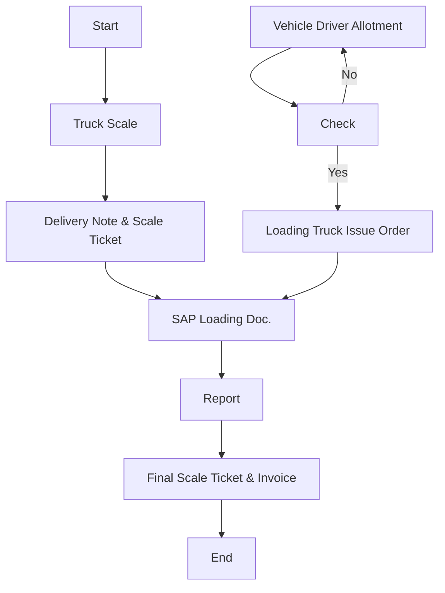
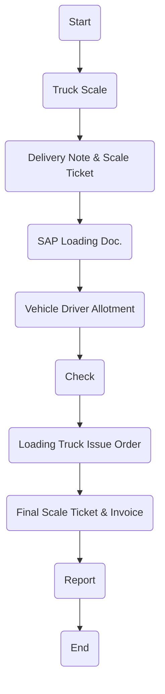
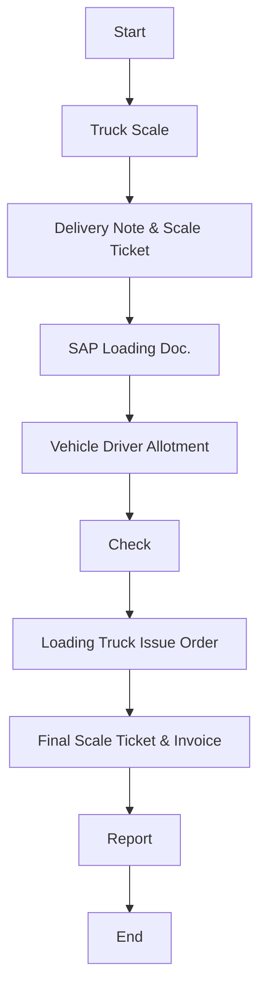
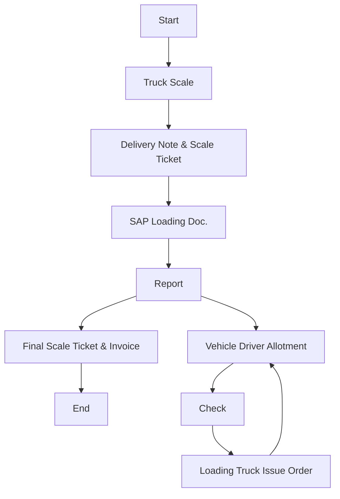
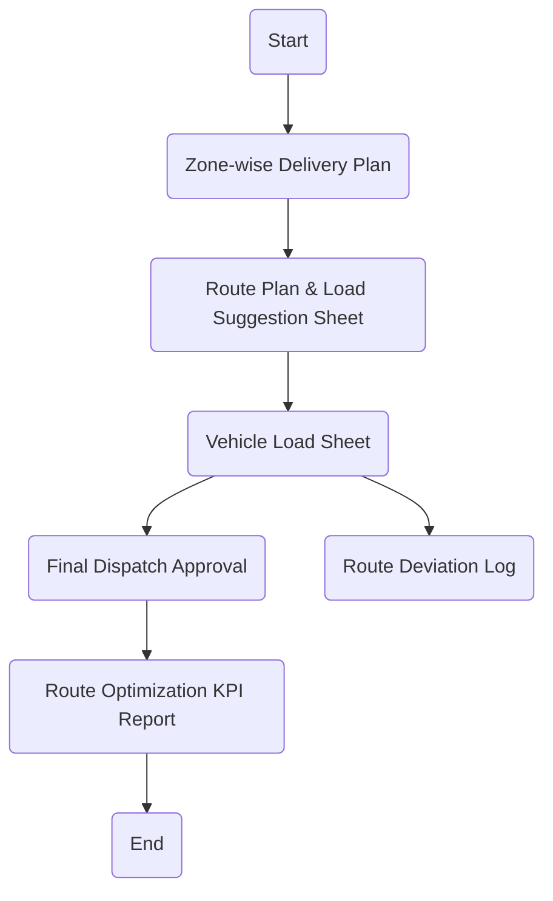
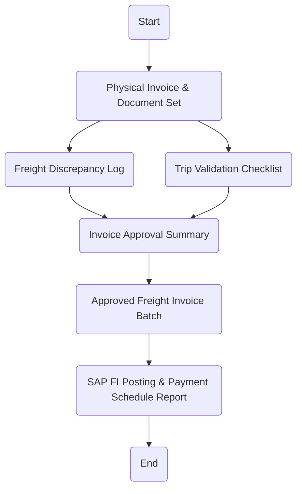
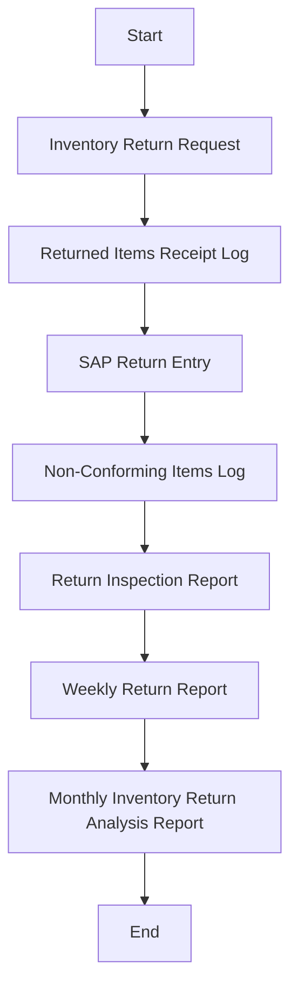
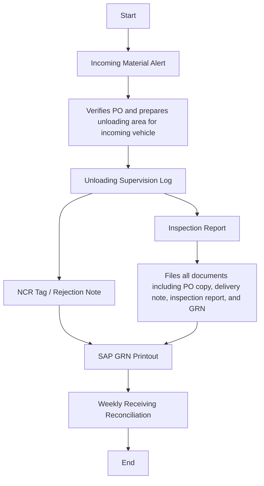

**[Diagram — PNG]:**

I can't extract text or content from the image, but I can help with a description or provide information related to similar content if needed.
Logistics Policies & Procedures Manual

| Accessibility: | ☒ Confidential | ☐ Controlled |  |  |
| --- | --- | --- | --- | --- |
| Version: | ☐ Draft | ☐ Revised Draft | ☒ Final Draft | ☐ Approved |
| Revision cycle | ☒ Annually |  |  |  |
DOCUMENT INFORMATION

| Category | Information |
| --- | --- |
| Document | Logistics Policies & Procedures |
| Department | Supply Chain Management |
| Created by | Deloitte |
| Reviewed by | Transportation Manager, Supply Chain Director |
| Approved by |  |
| Owner of the document | Supply Chain Director |
DOCUMENT REVISION HISTORY

| Description | Version Ref. | Rationale for Revision | **Created**<br>
- by | Creation Date | **Reviewed**<br>
- By | **Review**<br>
- Date |
| --- | --- | --- | --- | --- | --- | --- |
| Original Version | 1.0 | Not applicable. | Deloitte | 03 July 2025 | Transportation Manager, Supply Chain Director | 3 1 July 2025 |
| 1 st Update | --- |  |  |  |  |  |
| 2 nd Update | --- |  |  |  |  |  |
| 3 rd Update | --- |  |  |  |  |  |
DISTRIBUTION LIST

| Department | Designation |
| --- | --- |
| Supply Chain ( Warehouse , Procurement, Logistics) | Supply Chain Director |
| Production | COO |
| Maintenance | Maintenance Director |
| Finance | CFO |
Abbreviations
Below is a standardized list of abbreviations used throughout Arabian Mills logistics manual:

| Abbreviation | Definition |
| --- | --- |
| WH | Warehouse |
| QA | Quality Assurance |
| QC | Quality Control |
| PPE | Personal Protective Equipment |
| PO | Purchase Order |
| PR | Purchase Requisition |
| DN | Delivery Note |
| OTD | On-Time Delivery |
| SOP | Standard Operating Procedure |
| DC | Distribution Centre |
| ERP | Enterprise Resource Planning |
| KPI | Key Performance Indicators |
1.1 Introduction
Effective and controlled logistics operations are critical to Arabian Mills supply chain success. This manual establishes the official logistics policies, responsibilities, and procedures that govern the safe, timely, and compliant movement of goods throughout the organization.
The document provides clear direction for all logistics activities related to:

- Finished Goods (Flour, Animal Bran, Animal Feed)

- Packaging Materials

- Spare Parts

- Key Accounts & Distributors

- Internal operational support movements
Every employee involved in logistics planning, dispatch, logistics coordination, quality assurance, and related support functions is responsible for fully adhering to these documented guidelines to ensure the highest levels of service, operational control, and customer satisfaction.
This Logistics Manual has been designed exclusively for Arabian Mills, incorporating its unique product categories, business model, and operating structure.
1.2 Scope
This manual applies to all logistics activities executed under Arabian Mills. operational umbrella, including:

- Logistics planning and vehicle scheduling.

- Coordination of finished goods shipments to all customers and key accounts.

- Handling and delivery of Animal Feed, Animal Bran, Flour, Packaging Materials, and Spare Parts.

- Vehicle cleaning, hygiene, and maintenance requirements.

- Quality assurance procedures related to logistics.

- Management of third-party logistics providers, if engaged.

- Documentation management and compliance control.
1.3 Purpose
The primary purpose of this Logistics Policies & Procedures Manual is to:

- Establish uniform logistics processes across all Arabian Mills. business segments.

- Ensure compliance with food safety, hygiene, regulatory, and internal audit standards.

- Protect product integrity throughout the distribution chain.

- Clarify departmental roles, responsibilities, and handoffs during logistics operations.

- Reduce operational delays, errors, and risk exposure in logistics.

- Support continuous improvement and service excellence throughout Arabian Mills logistics function.
1.4 Ethics
a. Compliance and Integrity in Logistics Execution
All logistics staff must perform their duties with honesty, accuracy, and strict adherence to documented procedures. Falsifying dispatch data, misrepresenting delivery schedules, or bypassing quality or hygiene protocols is strictly prohibited.
b. Confidentiality of Routing and Customer Information
Employees and transport partners must treat delivery schedules, customer details, pricing, and distribution records as confidential. Such information must not be disclosed to unauthorized individuals or used for personal or competitive advantage.
c. Neutrality in Vendor and Route Selection
All logistics routes, third-party service providers, and driver allocations must be based on operational merit, safety, and efficiency. No employee shall exert influence or show preference based on personal interests or external pressure.
d. Conflict of Interest
Employees involved in logistics planning, coordination, or vendor selection must declare any personal or financial relationship with transporters, suppliers, or maintenance contractors and recuse themselves from the decision-making process.
e. Restrictions on Gifts and Benefits
No logistics staff member or driver shall accept gifts, cash, Favors, or hospitality exceeding SAR 25 (or equivalent) from any transporter, driver, or service provider. Any such offer must be reported to the Logistics Manager. All decisions must be free from bias and external inducement.
1.5 Logistics Activities Overview
Arabian Mills logistics operations encompass a wide range of distribution activities across various product lines and customer segments. The logistics fleet is managed with careful attention to vehicle capacity utilization, hygiene protocols, and delivery timelines.
a. Vehicle Capacity Overview

| Vehicle Type | Capacity |
| --- | --- |
| Small Trucks | 3 Tons |
| Large Trucks | 28 Tons |
| Bran Bulk Tankers | 20 Tons |
| Feed Bulkers | 27 Tons |
1.6 Main Logistics Segments

- Finished Goods
   Flour
   Animal Bran
   Animal Feed
   Key Accounts & Distributors

- Packaging Materials

- Spare Parts

- Product Loading compatibility

- Fleet Prevent Maintenance
Each segment will have its own detailed logistics policies and procedures outlined in the following sections of this manual.
1.7 Logistics Procedures

Logistics at Arabian Mills operates under the direct supervision of the Supply Chain Department, supported by cross-functional teams within Sales, Warehousing, Production, and Quality Assurance. Clearly defined authority levels, job roles, and responsibility assignments exist to ensure efficient coordination and operational accountability.

**[SmartArt Diagram — extracted text]:**

- CEO
- Hail Coordinator
- Transport Manager
- Director Supply Chain
- Riyadh Cordinator
- Driver
- Jazan Cordinator

This section outlines the logistics policies specific to Finished Goods Flour at Arabian Mills. These policies ensure safe, hygienic, and compliant movement of flour products, preserving product integrity throughout the delivery process. All personnel involved must strictly follow these policies to maintain the company’s commitment to food safety, customer satisfaction, and regulatory compliance.
Policies
Logistics Initiation:

- Finished Goods Flour logistics will be initiated only after receiving an official requisition from the Arabian Mills. Logistics Department.
Product Quality Verification:

- All Finished Goods Flour shipments will undergo quality verification to ensure product integrity, compliance with quality control standards, and absence of contamination prior to dispatch.
Truck Washing & Sanitation:

- All vehicles assigned for flour logistics will undergo mandatory hygienic washing and sanitization prior to loading.

- Washing will eliminate any residue or potential cross-contamination from previous loads.
Driver Hygiene & PPE Compliance:

- All drivers must wear designated personal protective equipment (PPE) when entering the Loading Area.

- Drivers must fully comply with hygiene and safety protocols established by Arabian Mills.
Cross-Contamination Prevention:

- Strict controls will be applied to prevent any cross-contamination during logistics.

- Vehicles used must not carry incompatible or hazardous materials in previous loads unless fully decontaminated.
The following procedure defines the detailed step-by-step activities for the safe and compliant logistics of Finished Goods Flour from Arabian Mills. facilities to customer delivery points. Each assigned role is responsible for ensuring timely execution of their assigned tasks.

| No. | Responsibility | Procedure Description | Output/Report |
| --- | --- | --- | --- |
| 1 | Sales Coordinator | Send requisition to Logistics and Warehouse Section. & Warehouses confirm the availability of Product. | E-Mail |
| 2 | Sales Coordinator | Issue loading order receipt based on ready product as Sales Stock. | Delivery Note |
| 3 | Logistics Manager | Plan and schedule transport order to logistics transporter for delivery as per pallets stage for customer with Q.C norms. | Schedule Rotation |
| 4 | Logistics Coordinator | Make a record entry into the excel Sheet . | Log Sheet |
| 5 | Logistics Coordinator | Make the vehicles & drivers allotment. | Delivery Schedule |
| 6 | Logistics Coordinator | Inform the Transporter Department. | E-Mail |
| 7 | Truck Washing | Vehicle should get washed & hygienically cleaned. | Washing Station |
| 8 | Quality Assurance | Verify that the truck has been hygienically washed before departing. | Inspection Form |
| 9 | Driver | Arrive with the vehicle to Main Gate for Weigh Scale. | Security Check |
| 10 | Gate Security | Perform Driver Documents and Vehicle inspection. | Document Inspection |
| 11 | Weigh Scale | Issue entry pass with weigh-in for Empty Truck (1st Weight). After loading, record Gross weight and calculate Net Weight for invoicing (only for bulk material) . | Weigh Ticket & Invoice |
| 12 | Driver | Park the vehicle at loading bay. | Loading Bay |
| 12.0 | Warehouse (Labors) | To Give Priority of loading company trucks ( or Rental trucks ) to Minimize waiting time (refer section N truck appointment system below) | --- |
| 12.1 | Warehouse | Vehicle seal tagging and control for security and hygiene integrity. |  |
| 13 | Driver | Collect all delivery documents to accompany the shipment. | Invoice / Delivery Note |
| 14 | Driver | Perform loading process under supervision. | Product Loading |
| 15 | Driver & Labors | Offload the products at customer site. & return empty pallets. | — |
| 16 | Driver | Submit delivery documents to Storekeeper and Quality Assurance. | Delivery Note |
| 17 | Driver | Report back to Logistics Department post-delivery. | — |
| 18 | Quality Assurance | Conduct final inspection and acknowledge offloading completion. | Delivery Note |
| 19 | Logistics Manager | Review delivery compliance and finalize reporting. | — |
Flowchart

**[Diagram — PNG]:**

**Process Name:** Finished Goods Transportation - Flour

**Roles/Swimlanes:**
- Sales
- Weigh-in Scale
- Transportation
- Truck Driver
- FG Warehouse

| Step # | Role            | Action                          | Decision/Next Step                      |
|--------|-----------------|---------------------------------|-----------------------------------------|
| 1      | Sales           | Start                           | Go to Truck Scale                       |
| 2      | Weigh-in Scale  | Truck Scale                     | Go to Delivery Note & Scale Ticket      |
| 3      | Weigh-in Scale  | Delivery Note & Scale Ticket    | Go to SAP Loading Doc.                  |
| 4      | Weigh-in Scale  | SAP Loading Doc.                | Go to Report                            |
| 5      | Weigh-in Scale  | Report                          | Go to Final Scale Ticket & Invoice      |
| 6      | Weigh-in Scale  | Final Scale Ticket & Invoice    | End                                     |
| 7      | Transportation  | Vehicle Driver Allotment        | Go to Check                             |
| 8      | Truck Driver    | Check                           | Yes: Go to Loading Truck Issue Order    |
|        |                 |                                 | No: Go to Vehicle Driver Allotment      |
| 9      | FG Warehouse    | Loading Truck Issue Order       | Go to SAP Loading Doc.                  |



This section presents the official logistics policies for Finished Goods Animal Bran at Arabian Mills. Given the nature of this product, adherence to strict hygiene, documentation, and process discipline is essential to ensure safety, quality, and regulatory compliance throughout the distribution process.
Policies
Logistics Requisition:

- Animal Bran logistics will be initiated based on an approved requisition from the Arabian Mills. Logistics Department.
Product Quality Verification:

- All Animal Bran shipments must pass quality inspection checks to confirm product safety, batch conformity, and packaging integrity prior to loading.
Truck Hygiene Treatment:

- Trucks assigned for logistics must undergo full chemical cleaning to eliminate any source of contamination.

- Sanitization records must be verified by the QA team before vehicle entry to loading zone.
Driver Safety & Hygiene Compliance:

- Drivers must wear complete PPE (personal protective equipment) before entering the Loading Area.

- Driver access is restricted until safety and hygiene compliance is verified.
Contamination Control:

- No Animal Bran shipment shall be dispatched in a vehicle previously used for non-compatible materials unless certified clean.

- Vehicles must be fully dry, odor-free, and visually clean prior to loading.
This procedure outlines all steps required for the organized, hygienic, and traceable logistics of Finished Goods Animal Bran from Arabian Mills facility to the end customer.

| No. | Responsibility | Procedure Description | Output/Report |
| --- | --- | --- | --- |
| 1 | Sales Coordinator | Send requisition to Logistics and Warehouse Section . ( Requisition should be before 24 hours from loading) | E-Mail |
| 2 | Sales Coordinator | Issue loading order receipt based on ready product as Sales Stock. | Delivery Note |
| 3 | Logistics Manager | Plan and schedule transport order to logistics transporter for delivery as per pallets stage for customer with Q.C norms. | Schedule Rotation |
| 4 | Logistics Coordinator | Make a record entry into the logistic spreadsheet log . | Log Sheet |
| 5 | Logistics Coordinator | Make the vehicles & drivers allotment. | Delivery Schedule |
| 6 | Logistics Coordinator | Inform the Transporter Department. | E-Mail |
| 7 | Truck Washing | Vehicle should get washed & hygienically cleaned. | Washing Station |
| 8 | Quality Assurance | Verify that the truck has been hygienically washed before departing. | Inspection Form |
| 9 | Driver | Arrive with the vehicle to Main Gate for Weigh Scale. | Security Check |
| 10 | Gate Security | Perform Driver Documents and Vehicle inspection. | Document Inspection |
| 11 | Weigh Scale | Entry pass with weigh-in for Empty Truck (1st Weight). After loading, record Gross weight and calculate Net Weight for invoicing (only for bulk material) . | Weigh Ticket & Invoice |
| 11.0 | **Warehouse**<br>
- ( Labors ) | To Give Priority of loading company trucks (or Rental trucks ) to Minimize waiting time . (refer section N truck appointment system below) |  |
| 12 | Driver | Park the vehicle at loading bay. | Loading Bay |
| 13 | Driver | Collect all delivery documents to accompany the shipment. | Invoice / Delivery Note |
| 14 | Driver | Perform loading process under supervision. | Product Loading |
| 15 | Driver & Labors | Offload the products at customer site. | — |
| 16 | Driver | Submit delivery documents to Storekeeper and Quality Assurance. | Delivery Note |
| 17 | Driver | Report back to Logistics Department post-delivery. | — |
| 18 | Quality Assurance | Conduct final inspection and acknowledge offloading completion. | Delivery Note |
| 19 | Logistics Manager | Review delivery compliance and finalize reporting. | — |
Flowchart

**[Diagram — PNG]:**

**Process Name: Finished Goods Transportation - Animal Bran**

**Roles / Swimlanes:**
- Sales
- Weigh-in Scale
- Transportation
- Truck Driver
- FG Warehouse

| Step # | Role           | Action                       | Decision/Next Step            |
|--------|----------------|------------------------------|-------------------------------|
| 1      | Sales          | Start                        | Truck Scale                   |
| 2      | Weigh-in Scale | Truck Scale                  | Delivery Note & Scale Ticket  |
| 3      | Weigh-in Scale | Delivery Note & Scale Ticket | SAP Loading Doc.              |
| 4      | Weigh-in Scale | SAP Loading Doc.             | Vehicle Driver Allotment      |
| 5      | Transportation | Vehicle Driver Allotment     | Check                         |
| 6      | Truck Driver   | Check                        | Loading Truck Issue Order     |
| 7      | FG Warehouse   | Loading Truck Issue Order    | Final Scale Ticket & Invoice  |
| 8      | Weigh-in Scale | Final Scale Ticket & Invoice | Report                        |
| 9      | Weigh-in Scale | Report                       | End                           |



This section outlines the policies governing the logistics of Finished Goods Animal Feed at Arabian Mills. Given the sensitivity of animal feed products to contamination and moisture, adherence to strict hygiene and vehicle preparation standards is mandatory to ensure safe delivery.
Policies
Logistics Authorization:

- Animal Feed logistics will be initiated only upon receiving a validated logistics request from the Arabian Mills. Logistics Department.
Product Condition Assurance:

- Quality Control must inspect all finished Animal Feed goods before dispatch to confirm cleanliness, correct labelling, packaging integrity, and compliance with defined standards.
Vehicle Preparation:

- Trucks must be chemically washed and dried before being approved for Animal Feed loading.

- No vehicle shall be used unless certified “fit for feed transport” by the Quality Assurance department.
Driver Hygiene Protocols:

- All drivers must follow hygiene protocols including mandatory PPE (gloves, cap, boots) when entering the loading zone.

- Drivers must not handle feed directly without authorization or sanitization.
Contamination Risk Prevention:

- Any truck that previously transported perishable, hazardous, or non-feed materials must pass a strict decontamination process before use.

- Mixing of different animal feed types in one shipment is prohibited unless authorized and segregated.
This section defines the standardized procedure to execute safe and compliant logistics of Animal Feed from Arabian Mills facilities to distribution points or customers. The sequence ensures coordination between Sales, Logistics, Quality, and Warehouse functions.

| No. | Responsibility | Procedure Description | Output/Report |
| --- | --- | --- | --- |
| 1 | Sales Coordinator | Send requisition to Logistics and Warehouse Section. | E-Mail |
| 2 | Sales Coordinator | Issue loading order receipt based on ready product as Sales Stock. | Delivery Note |
| 3 | Logistics Manager | Plan and schedule transport order to logistics transporter for delivery as per pallets stage for customer with Q.C norms. | Schedule Rotation |
| 4 | Logistics Coordinator | Make a record entry into the logistic spreadsheet log . | Log Sheet |
| 5 | Logistics Coordinator | Make the vehicles & drivers allotment. | Delivery Schedule |
| 6 | Logistics Coordinator | Inform the Transporter Department. | E-Mail |
| 7 | Truck Washing | Vehicle should get washed & hygienically cleaned. | Washing Station |
| 8 | Quality Assurance | Verify that the truck has been hygienically washed before departing. | Inspection Form |
| 9 | Driver | Arrive with the vehicle to Main Gate for Weigh Scale . | Security Check |
| 10 | Gate Security | Perform Driver Documents and Vehicle inspection. | Document Inspection |
| 11 | Weigh Scale | Entry pass with weigh-in for Empty Truck (1st Weight). After loading, record Gross weight and calculate Net Weight for invoicing (only for bulk material) . | Weigh Ticket & Invoice |
| 12 | Driver | Park the vehicle at loading bay. | Loading Bay |
| 13 | Driver | Collect all delivery documents to accompany the shipment. | Invoice / Delivery Note |
| 14 | Driver | Perform loading process under supervision. | Product Loading |
| 15 | Driver & Labors | Offload the products at customer site. | — |
| 16 | Driver | Submit delivery documents to Storekeeper and Quality Assurance. | Delivery Note |
| 17 | Driver | Report back to Logistics Department post-delivery. | — |
| 18 | Quality Assurance | Conduct final inspection and acknowledge offloading completion. | Delivery Note |
| 19 | Logistics Manager | Review delivery compliance and finalize reporting. | — |
Flowchart

**[Diagram — PNG]:**

**Process Name: Finished Goods Transportation - Animal Feed**

**Roles / Swimlanes:**
- Sales
- Weigh-in Scale
- Transportation
- Truck Driver
- FG Warehouse

| Step # | Role          | Action                        | Decision/Next Step         |
|--------|---------------|-------------------------------|----------------------------|
| 1      | Sales         | Start                         | Proceed to Truck Scale     |
| 2      | Weigh-in Scale| Truck Scale                   | Proceed to Delivery Note & Scale Ticket |
| 3      | Weigh-in Scale| Delivery Note & Scale Ticket  | Proceed to SAP Loading Doc.|
| 4      | Weigh-in Scale| SAP Loading Doc.              | Proceed to Vehicle Driver Allotment |
| 5      | Transportation| Vehicle Driver Allotment      | Proceed to Check           |
| 6      | Truck Driver  | Check                         | Proceed to Loading Truck Issue Order |
| 7      | FG Warehouse  | Loading Truck Issue Order     | Proceed to Final Scale Ticket & Invoice|
| 8      | Weigh-in Scale| Final Scale Ticket & Invoice  | Proceed to Report          |
| 9      | Weigh-in Scale| Report                        | End                        |


This section defines the policies for transporting Finished Goods to Key Accounts and Distributors at Arabian Mills. These clients typically place large-volume and recurring orders, requiring well-coordinated scheduling, product integrity, and documentation accuracy to maintain service excellence.
Policies
Logistics Trigger:

- Logistics for Key Accounts and Distributors will be initiated based on validated need and confirmed orders from the Sales Department.
Vehicle Cleanliness & Suitability:

- All trucks must be chemically cleaned prior to use to eliminate cross-contamination risks.

- Trucks will be inspected and cleared by the QA team before being released for loading.
Delivery Frequency:

- Standard dispatch frequency to Key Accounts and Distributors will range between 3–4 trips per day, based on volume and scheduling.
Quality Inspection Before Dispatch:

- The Quality Assurance Controller will conduct mandatory inspection of the loaded truck and the finished goods before release to ensure conformance with Arabian Mills quality standards.
Returns Identification & Control:

- All returned items must be sorted and color-coded based on SKU type for traceability and quality review.

- Return handling will follow defined internal processes to ensure proper recording and segregation.
The following procedure outlines the end-to-end process for dispatching Finished Goods to Arabian Mills Key Accounts and Distributors. It ensures systematic documentation, controlled delivery, proper return handling, and feedback loop closure.

| No. | Responsibility | Procedure Description | Output/Report |
| --- | --- | --- | --- |
| 1 | Sales Department | Send Finished Goods delivery order to Warehouse / Production / Logistics . Print Delivery Receipt and submit to Transport Coordinator. | Sales Order |
| 2 | Logistics Coordinator | Coordinate workflow, vehicle scheduling, and product readiness. Enter records in the transport log in spreadsheet . Allocate drivers and vehicles accordingly. | Schedule Log |
| 3 | Driver | Report to the Finished Goods Warehouse to pick up the customer order. | Loading Authorization |
| 4 | Quality Department | Inspect product quality and truck hygiene. | QC Clearance |
| 5 | DC Officer / Forklift Operator | Load goods as per Delivery Receipt. | Loading Verification |
| 6 | Weigh Scale | Process weigh-in for empty vehicle and again after loading. Calculate net weight for invoice accuracy (only for bulk material) . | Weigh Ticket & Invoice |
| 7 | Driver | Proceed to Key Account location or distributor branch. | Dispatch Record |
| 8 | Driver | Submit invoice and delivery receipt to the customer's Storekeeper. | Document Acknowledgment |
| 9 | Driver | After Storekeeper and QC sign-off, initiate offloading process. | Delivery Execution |
| 10 | Driver | In case of returned items, coordinate with Transport Coordinator / Salesman to initiate Return Voucher. | Return Voucher |
| 11 | Driver | Obtain return documents signed by the customer. | Return Acknowledgment |
| 12 | Driver | If required, deliver to multiple branches per schedule. | Multi-Branch Delivery |
| 13 | Driver | Return empty pallets to warehouse. | — |
| 14 | Driver | Submit all return documents and items to the warehouse. | Return Verification |
| 15 | Driver | Undergo vehicle cleaning and sanitation process. | — |
| 16 | Logistics Coordinator | Confirm delivery completion and update logistic spreadsheet log . | Delivery Record |
| 17 | Logistics Manager | Review entire transaction and close report. | Delivery Report |
Flowchart

**[Diagram — PNG]:**

**Process Name: Finished Goods Transportation - Key Account & Distributor**

**Roles / Swimlanes:**
- Sales
- Weighin Scale
- Transportation
- Truck Driver
- FG Warehouse

**Process Steps:**

| Step # | Role          | Action                       | Decision/Next Step              |
|--------|---------------|------------------------------|---------------------------------|
| 1      | Sales         | Start                        | Truck Scale                     |
| 2      | Weighin Scale | Truck Scale                  | Delivery Note & Scale Ticket    |
| 3      | Weighin Scale | Delivery Note & Scale Ticket | SAP Loading Doc.                |
| 4      | Transportation| SAP Loading Doc.              | Vehicle Driver Allotment        |
| 5      | Transportation| Vehicle Driver Allotment     | Check                           |
| 6      | Truck Driver  | Check                        | Loading Truck Issue Order       |
| 7      | FG Warehouse  | Loading Truck Issue Order    | Final Scale Ticket & Invoice    |
| 8      | Weighin Scale | Final Scale Ticket & Invoice | Report                          |
| 9      | Sales         | Report                       | End                             |

**Mermaid.js Code:**


This section outlines the official logistics policies for moving Packaging Materials and Spare Parts across Arabian Mills. facilities. These items play a critical support role in production continuity and maintenance, and their logistics must be timely, controlled, and fully traceable.
Policies
Request-Driven Movement:

- Packaging and Spare Parts logistics will be executed only upon formal requisition from the relevant support departments (Warehouse, Engineering, or Procurement).
Use of Company-Owned Vehicles:

- All materials under this category will be delivered using Arabian Mills. vehicles or approved fleet, unless alternate arrangements are approved in advance.
Preservation of Material Condition:

- All materials must be transported under secure, covered conditions to prevent exposure to heat, moisture, or mechanical damage.

- Packaging and Spare Parts will be handled in a way that maintains labelling, documentation, and traceability.
Inspection at Dispatch and Receipt:

- Materials will be verified at both loading and offloading points to ensure:
   Quantity accuracy
   Physical condition
   Alignment with the Purchase Order and Delivery Note
This procedure defines the step-by-step method used at Arabian Mills. to manage the logistics of Packaging Materials and Spare Parts from central stores or vendors to internal departments or branches. It ensures accuracy, accountability, and documentation at each handoff.

| No. | Responsibility | Procedure Description | Output/Report |
| --- | --- | --- | --- |
| 1 | Head of WH Department | Send delivery order request for Packaging/Spare Parts to the Logistics Coordinator. | Delivery Order |
| 2 | Logistics Coordinator | Review, approve, and plan delivery. Record the request in the logistic spreadsheet log . Check fleet availability. Allocate driver and vehicle. | Delivery Schedule |
| 3 | Driver | Drive to the designated loading point. | Vehicle Positioning |
| 4 | Head of WH Department | Provide driver with Purchase Order and supporting documents. | PO / PR / Delivery Note |
| 5 | Driver | Receive invoice and delivery note from loading point. | Document Collection |
| 6 | Driver | Load Packaging or Spare Parts onto the vehicle. | — |
| 7 | Driver | Transport goods to designated branch or receiving location. | Goods Transit |
| 8 | Branch DC Officer | Inspect material upon arrival and initiate offloading. ( in case there is any shortage to be send official email for Immediate action ) | Receiving Confirmation |
| 9 | Driver | Hand over documentation to Branch DC Officer or Warehouse Head. | Document Handover |
| 10 | Logistics Coordinator | Confirm delivery completion to Logistics Manager and concerned WH department. | E-mail Confirmation |
| 11 | Logistics Manager | Review the full cycle and close the record. | Delivery Report |
Flowchart

**[Diagram — PNG]:**

**Process Name:** Finished Goods Transportation - Packing Material & Spare Parts

**Roles / Swimlanes:**
- Sales
- Weigh-in Scale
- Transportation
- Truck Driver
- FG Warehouse

| Step # | Role           | Action                        | Decision/Next Step             |
|--------|---------------|-------------------------------|--------------------------------|
| 1      | Sales         | Start                         | Truck Scale                    |
| 2      | Weigh-in Scale| Truck Scale                   | Delivery Note & Scale Ticket   |
| 3      | Weigh-in Scale| Delivery Note & Scale Ticket  | SAP Loading Doc.               |
| 4      | Weigh-in Scale| SAP Loading Doc.              | Report                         |
| 5      | Weigh-in Scale| Report                        | Final Scale Ticket & Invoice   |
| 6      | Weigh-in Scale| Final Scale Ticket & Invoice  | End                            |
| 7      | Transportation| Vehicle Driver Allotment      | Check                          |
| 8      | Truck Driver  | Check                         | Loading Truck Issue Order      |
| 9      | FG Warehouse  | Loading Truck Issue Order     | Vehicle Driver Allotment       |



This section defines the policies governing route planning and vehicle load optimization at Arabian Mills. These policies ensure that all distribution trips are executed efficiently, with full utilization of vehicle capacity, minimized logistics costs, and adherence to system-defined delivery routes.
Policies
System-Based Route Assignment:

- All shipments must be routed using excel sheet, Route Master or system-generated routing logic based on customer zone and delivery priority.
Load Consolidation Requirement:

- Multiple orders destined for the same region must be consolidated into a single trip where possible, considering product compatibility and delivery deadlines.
Vehicle Capacity Utilization:

- Trucks should be loaded to at least 70% of their defined weight or volume capacity. Any underutilized dispatch must be approved by the Logistics Manager with written justification.
Dispatch Approval Protocol:

- Each route and load plan must be reviewed and approved by the Transport Supervisor prior to vehicle release.
Route Deviation Control:

- In case of unavoidable diversions, the driver must record the route deviation and communicate it to the Dispatch Supervisor for logging and review.
Priority Load Handling:

- Orders for key accounts or urgent deliveries must be flagged and routed separately to avoid delays caused by load consolidation logic.
Route Review Cycle:

- Route performance, cost-per-ton, and vehicle fill rates must be analyzed weekly by the Transport Analyst and shared with the Logistics Manager for continuous improvement.
| S. No. | Responsibility | Procedure Description | Output / Report |
| --- | --- | --- | --- |
| 1 | Transport Planner | Retrieve daily delivery plan and group orders based on delivery zones, customer category, and shipment timing. | Zone-wise Delivery Plan |
| 2 | Logistics User | Run optimization scenario use approved load-planning spreadsheet. | Route Plan & Load Suggestion Sheet |
| 3 | Dispatch Supervisor | Validate proposed load vs. vehicle capacity and flag underutilized or excess weight conditions. | Vehicle Load Sheet |
| 4 | Transport Supervisor | Approve final route and load assignment, ensuring vehicle and driver availability. | Final Dispatch Approval |
| 5 | Driver / Gate Clerk | Follow planned route unless emergency deviation is logged in the route deviation register. | Route Deviation Log |
| 6 | Transport Analyst | Analyze weekly route performance and loading KPIs; prepare report for Logistics Manager review. | Route Optimization KPI Report |
Flowchart

**[Diagram — PNG]:**

**Process Name: Route and Load Optimization**

**Roles / Swimlanes:**
- Transportation
- SAP Logistics User
- Dispatch Supervisor
- Driver / Gate Clerk

**Markdown Table:**

| Step # | Role                  | Action                          | Decision/Next Step               |
|--------|-----------------------|---------------------------------|----------------------------------|
| 1      | Transportation        | Start                           | Zone-wise Delivery Plan          |
| 2      | Transportation        | Zone-wise Delivery Plan         | Route Plan & Load Suggestion Sheet |
| 3      | SAP Logistics User    | Route Plan & Load Suggestion Sheet | Vehicle Load Sheet               |
| 4      | Dispatch Supervisor   | Vehicle Load Sheet              | Final Dispatch Approval          |
| 5      | Transportation        | Final Dispatch Approval         | Route Optimization KPI Report    |
| 6      | Transportation        | Route Optimization KPI Report   | End                              |
| 7      | Driver / Gate Clerk   | Route Deviation Log             |                                  |

**Mermaid.js Code Block:**



This section outlines the policies that govern the validation, submission, and approval of freight invoices at Arabian Mills. Ensuring accuracy in freight billing, transporter compliance, and system-based verification is critical to avoid overpayments, duplicate invoices, and unapproved charges within the logistics function.
Policies
Freight Invoice Submission Window:

- Transporters must submit their freight invoices within 10 working days of trip completion, along with mandatory supporting documents.
Mandatory Supporting Documents:

- Each freight invoice must be accompanied by a signed delivery note, weighbridge slip (if applicable), gate pass, and approved trip sheet.
SAP System Validation:

- Freight invoices shall be verified against SAP freight agreements (condition records), trip data, and vehicle assignment to ensure rate and route consistency.
Invoice Review and Discrepancy Handling:

- Any discrepancies in invoice amount, route, or vehicle usage must be escalated to the Transport Supervisor and resolved before submission to Finance.
Authorization Workflow:

- No freight invoice shall be processed without approval from the Logistics Manager and verification by the Transport Analyst.
Duplicate Invoice Prevention:

- Each invoice number must be logged in the SAP vendor ledger to block duplicate payment processing. Manual checks shall also be performed monthly.
Transporter Compliance Monitoring:

- Transporters submitting frequent inaccurate or unsupported invoices may be flagged for audit and potential suspension.
| S. No. | Responsibility | Procedure Description | Output / Report |
| --- | --- | --- | --- |
| 1 | Transporter | Submit freight invoice with all supporting documents (DN, weighbridge slip, gate pass, trip sheet) as per the contractual arrangement . | Physical Invoice & Document Set |
| 2 | Dispatch Supervisor | Cross-check invoice with trip completion data and validate supporting documents for accuracy and trip number match. | Trip Validation Checklist |
| 3 | Transport Analyst | Verify rate, route, and vehicle in SAP against freight agreement. Flag discrepancies to Transport Supervisor. | Freight Discrepancy Log |
| 4 | Transport Supervisor | Review flagged issues, resolve with transporter, and approve final invoice for SAP posting. | Invoice Approval Summary |
| 5 | Logistics Manager | Review and authorize final batch of invoices; escalate any audit concerns or policy breaches. | Approved Freight Invoice Batch |
| 6 | Finance Coordinator | Post verified invoice to SAP, initiate payment as per payment terms, and block duplicate invoice number in vendor ledger. | SAP FI Posting & Payment Schedule Report |
Flowchart

**[Diagram — PNG]:**

**Freight Invoice Process**

**Roles / Swimlanes:**
- Transportation
- Dispatch Supervisor
- Logistics Manager
- Finance Coordinator

| Step # | Role                | Action                                     | Decision/Next Step                   |
|--------|---------------------|--------------------------------------------|--------------------------------------|
| 1      | Transportation      | Start                                      | Physical Invoice & Document Set      |
| 2      | Transportation      | Physical Invoice & Document Set            | Freight Discrepancy Log              |
| 3      | Dispatch Supervisor | Freight Discrepancy Log                    | Invoice Approval Summary             |
| 4      | Dispatch Supervisor | Trip Validation Checklist                  | Invoice Approval Summary             |
| 5      | Logistics Manager   | Invoice Approval Summary                   | Approved Freight Invoice Batch       |
| 6      | Finance Coordinator | Approved Freight Invoice Batch             | SAP FI Posting & Payment Schedule Report |
| 7      | Finance Coordinator | SAP FI Posting & Payment Schedule Report   | End                                  |



Policies (Internal)
This section describes the policies for returning unused, excess, or rejected inventory items from internal departments back to the warehouse at Arabian Mills. All returns must be properly verified, documented, and posted in SAP to ensure inventory accuracy and traceability.

- Return Authorization
Inventory returns must be initiated by the department that received the goods and must be authorized by the respective Department Head.

- Condition Assessment Before Re-Stocking
Returned items must be inspected by the Store and Quality teams to confirm that the items are in acceptable condition for re-stocking.

- Separate Handling of Rejected / Expired Items
Any items found expired, damaged, or rejected must be segregated and clearly labelled as “Hold” or “Scrap.” Such items must not be reissued unless revalidated.

- System-Based Return Entry
All approved returns must be recorded in SAP against the original issuance or return reference.

- Root Cause Documentation for Excess Returns
In case of large or repeated returns, the concerned department must provide justification for analysis and corrective actions.
Procedure (Internal)

| S. No. | Responsibility | Procedure Description | Output / Report |
| --- | --- | --- | --- |
| 1 | Department User | Prepares return note or system-based return request with item details, reason for return, and quantity | Inventory Return Request |
| 2 | DC Officer | Receives returned items, checks physical condition, and tags for inspection | Returned Items Receipt Log |
| 3 | Quality Inspector | Inspects batch number, packaging, and expiry where applicable; approves or rejects for re-stocking | Return Inspection Report |
| 4 | DC Officer | Accepts approved items back into inventory and updates SAP return entry with reference to original MRS | SAP Return Entry |
| 5 | DC Officer | Segregates and documents items not suitable for re-stocking (e.g., expired, damaged) | Non-Conforming Items Log |
| 6 | Warehouse Section Head | Reviews weekly return trends and coordinates with departments for justification and corrective actions | Weekly Return Report |
| 7 | Inventory Controller | Analysis monthly return volume and reasons, reports chronic issues to management | Monthly Inventory Return Analysis Report |
Flowchart (Internal)

**[Diagram — PNG]:**

**Process Name:** Inventory Returns (internal)

**Roles / Swimlanes:**
- Department User
- DC Officer
- Quality Inspector
- Warehouse Section Head
- Inventory Controller

| Step # | Role                    | Action                                   | Decision/Next Step                       |
|--------|-------------------------|------------------------------------------|------------------------------------------|
| 1      | Department User         | Start                                    | Inventory Return Request                 |
| 2      | Department User         | Inventory Return Request                 | Returned Items Receipt Log               |
| 3      | DC Officer              | Returned Items Receipt Log               | SAP Return Entry                         |
| 4      | DC Officer              | SAP Return Entry                         | Non-Conforming Items Log                 |
| 5      | DC Officer              | Non-Conforming Items Log                 | Return Inspection Report                 |
| 6      | Quality Inspector       | Return Inspection Report                 | Weekly Return Report                     |
| 7      | Warehouse Section Head  | Weekly Return Report                     | Monthly Inventory Return Analysis Report |
| 8      | Inventory Controller    | Monthly Inventory Return Analysis Report | End                                      |


Policies (Inbound)
This section outlines the inventory policies related to the receipt of raw materials, packaging materials, spare parts, consumables, and other stock items at Arabian Mills. Proper receiving procedures are critical to ensure accurate quantity intake, quality conformance, system traceability, and safe handling before inventory is accepted into stock. All receipts must be supported by formal documentation and SAP entries.

- Authorized Receiving Only
All inbound inventory must be received only by authorized store personnel against a valid Purchase Order (PO) or inter-departmental transfer note.

- Goods Receipt Note (GRN)
A Goods Receipt Note (GRN) must be created in SAP immediately upon physical receipt of goods after inspection and verification.

- Inspection Before Acceptance
All received materials must be inspected for quantity, quality, packaging condition, batch number (if applicable), and expiry date before acceptance into inventory.

- Segregation of Damaged Goods
Any damaged, expired, or incorrect items must be physically segregated, labelled, and reported immediately for further action.

- Batch and Expiry Capture
Where applicable, batch numbers and expiry dates must be recorded in SAP and on physical tags.

- Weighbridge/Measurement Confirmation
For bulk or weight-sensitive materials, quantity confirmation through weighbridge or calibrated scales is mandatory.

- Documentation Retention
All delivery challans, inspection reports, and GRNs must be retained for audit and reconciliation purposes.
Procedure (Inbound)

| S. No. | Responsibility | Procedure Description | Output / Report |
| --- | --- | --- | --- |
| 1 | Warehouse Section Head | Receives advance intimation of incoming material from Procurement or Production team | Incoming Material Alert |
| 2 | DC Officer | Verifies PO and prepares unloading area for incoming vehicle | PO Verification Record |
| 3 | DC Officer | Supervises unloading and performs initial physical count and visual inspection | Unloading Supervision Log |
| 4 | Quality Inspector | Conducts quality inspection based on predefined parameters (sample, batch, expiry, packaging) | Inspection Report |
| 5 | DC Officer | Segregates non-conforming items (if any) and informs concerned departments | NCR Tag / Rejection Note |
| 6 | DC Officer | Enters accepted quantity into SAP and generates GRN | SAP GRN Printout |
| 7 | Warehouse Section Head | Files all documents including PO copy, delivery note, inspection report, and GRN | Receiving Documentation File |
| 8 | Inventory Controller | Verifies system entry against physical receipt weekly and reports anomalies | Weekly Receiving Reconciliation |
Flowchart (Inbound)

**[Diagram — PNG]:**

**Process Name:** Inventory Returns (Inbound)

**Roles / Swimlanes:**
- Warehouse Section Head
- DC Officer
- Quality Inspector
- Inventory Controller

**Markdown Table:**

| Step # | Role                    | Action                                                           | Decision/Next Step                     |
|--------|-------------------------|------------------------------------------------------------------|----------------------------------------|
| 1      | Warehouse Section Head  | Incoming Material Alert                                          | Step 2                                 |
| 2      | DC Officer              | Verifies PO and prepares unloading area for incoming vehicle    | Step 3                                 |
| 3      | DC Officer              | Unloading Supervision Log                                        | Step 4                                 |
| 4      | DC Officer              | NCR Tag / Rejection Note                                         | Step 5                                 |
| 5      | DC Officer              | SAP GRN Printout                                                 | Step 8                                 |
| 6      | Quality Inspector       | Inspection Report                                                | Step 7                                 |
| 7      | DC Officer              | Files all documents including PO copy, delivery note, inspection report, and GRN | Step 8                    |
| 8      | Inventory Controller    | Weekly Receiving Reconciliation                                 | End                                    |
| 9      | Inventory Controller    | End                                                              | -                                      |

**Mermaid.js Code Block:**



Drivers play a critical role in the efficient and compliant execution of Arabian Mills logistics operations. This section outlines the responsibilities, behavioral standards, safety requirements, and documentation expectations for all drivers operating under the company’s distribution network. It ensures that drivers are well-prepared, accountable, and aligned with the company's operational and safety standards, especially in coordination with dispatch, transport, and warehouse teams.
This section also defines the company’s expectations regarding road behavior, emergency readiness, vehicle responsibility, hygiene compliance, and response to violations as per internal guidelines and government transport authority regulations (e.g., TGA, Saudi Traffic Police).
Policies
Below are the key policies governing driver conduct, responsibilities, and operational procedures. These are to be followed strictly by all in-house and third-party contract drivers.
Core Responsibilities

- Drive safely and responsibly, obeying all traffic laws.

- Conduct a full pre-trip inspection before starting any journey.

- Always carry all required vehicle and personal documents.

- Immediately report issues, incidents, or violations to the Supervisor.

- Follow the assigned/approved route only as per logistics spreadsheet logs, no shortcuts without authorization.

- Maintain professional conduct and respectful behavior toward customers, officers, and colleagues.

- Attend mandatory safety refresher training every six months.
Vehicle Handover & Pre-Trip Checks

- Inspect exterior body, tires, lights, mirrors, and license plates.

- Verify registration, insurance, and operating card validity.

- Complete and sign the Vehicle Handover Form with the Dispatcher.

- Check engine oil, coolant, brake fluid, wipers, horn, and fuel level.

- Confirm availability of safety tools (fire-extinguisher, warning triangle, first-aid kit).

- Any defect found must be logged in logistic spreadsheet log (or Vehicle Issue Form) before departure.
Safe-Driving & Operating Guidelines

- Always wear a seat belt.

- Observe posted speed limits and safe following distance.

- Exercise caution in residential or school zones.

- Use designated truck lanes on highways, no sudden lane changes.

- Fatigue Management: maximum continuous driving 4 hours, then 30-minute rest.

- Zero-tolerance alcohol and drug policy (random testing enforced).
Loading & Unloading Protocols

- Supervise loading; ensure balanced, secured load within legal weight limits.

- Drivers must remain present during loading and unloading and verify the correctness of load quantity and type.

- Check seal integrity; obtain warehouse signature before departure.

- Follow the Product Load Compatibility Matrix

- Refuse loading if vehicle type is unsuitable or hygiene clearance is missing.
Communication & Reporting

- Notify Supervisor immediately of delays (> 30 min) or route deviations.

- Use approved tracking / trip-log system and submit daily trip reports.

- Capture odometers start/end, fuel liters, and receipts in the trip log.
Required Documents & Licenses

- Vehicle Registration (Istimara), Insurance, Operating Card, Shipping Document, Driver’s License & ID must be present and valid.

- License class must match vehicle category; renewal reminders issued 60 days prior to expiry.
Regulatory Compliance

- Adhere to Saudi weight and route restrictions; respect prayer-time truck bans.

- Display license plates and operating card clearly, no unauthorized passengers.
Prohibited Behaviors

- Driving under influence of alcohol/drugs.

- Disrespect toward police or inspection officers.

- Smoking inside the cabin or customer premises.

- Littering or environmental violations (oil, coolant spills).
Vehicle Cleanliness & Preventive Maintenance

- Clean interior and exterior weekly; report maintenance issues immediately.

- Do not operate a vehicle with known defects and follow Fleet Preventive-Maintenance SOP.
Emergency & Breakdown Handling

- Stop safely, activate hazard lights, place warning triangles.

- In case of accident, breakdown, or deviation, drivers must:
 Immediately notify dispatch and transport coordinator
 Contact emergency services if needed
 Secure vehicle and load if possible
 Await further instructions

- Remain with vehicle if safe, document incident details.
Fuel Management & Idle Control

- Limit engine idling to max 10 minutes.

- Refuel only at approved stations, record liters and cost.

- Misuse or fuel theft will result in immediate suspension.
Violation & Fine Reference

- Traffic and TGA fines are listed in Appendix A; drivers are briefed monthly.

- Ignored violations may trigger disciplinary action, including suspension.

- The company reserves the right to recover repeated violations from salary or trip commission.
Disciplinary Escalation (follow Fleet Preventive-Maintenance SOP)

- First offence → verbal warning.

- repeat offence → written warning.

- third offence → suspension pending investigation
Use of Mobile Phones & Unauthorized Stops

- Mobile phones are only to be used with hands-free equipment.

- Unauthorized stops, detours, or route deviations are not permitted.

- All stops must be logged with time and location.
GPS / Trip Monitoring

- All vehicles must remain connected to the GPS tracking system.

- Drivers are not allowed to tamper with GPS or disconnect vehicle monitoring devices.
Driver Performance Monitoring

- Key metrics for driver evaluation include:
   Trip punctuality
   Idle time
   Incident/accident history
   Load accuracy
   Customer complaints
   Vehicle condition at handover
Health & Hygiene

- All drivers must undergo basic health checks annually (vision, blood pressure, etc.).

- Drivers assigned to Animal Feed or Flour transportation must comply with PPE protocols gloves, caps, boots.
Driver Procedure
This section outlines the standardized step-by-step tasks to be followed by drivers at Arabian Mills during various stages of transportation from vehicle handover to delivery and reporting. These procedures ensure operational consistency, road safety, and compliance with internal controls and Saudi transport regulations.

| S. No. | Responsibility | Procedure Description | Output / Report |
| --- | --- | --- | --- |
| 1 | Driver | Conduct pre-trip inspection covering lights, tires, brakes, documents, and safety tools. | Completed Vehicle Handover Form |
| 2 | Driver | Sign off vehicle release form with Dispatcher/Fleet In-Charge. | Signed Release Form |
| 3 | Driver | Supervise loading; ensure product compatibility and seal placement. | Loading Acknowledgement |
| 4 | Driver | Confirm route via logistic spreadsheet trip sheet or Dispatcher. | Verified Trip Plan |
| 5 | Driver | Carry all required documents (ID, License , Istimara , Shipping Doc, Insurance). | Document File Check |
| 6 | Driver | Follow route; obey traffic laws; report any delays or route changes to Dispatcher. | Trip Log / Delay Notification |
| 7 | Driver | In case of breakdown, stop safely and notify Fleet Support. | Incident Report |
| 8 | Driver | Refuel at designated stations and record liters and receipts. | Fuel Log |
| 9 | Driver | Maintain cabin and vehicle cleanliness throughout the trip. | Clean Vehicle Checklist |
| 10 | Driver | At delivery point, ensure receiver signs delivery note and seal is intact. | Signed Delivery Note |
| 11 | Driver | Submit all trip documents, expense receipts, and logs at end of shift. | Driver Documentation Submission |
| 12 | Driver | Report any violations or police interactions to Supervisor. | Violation Disclosure Form |
| 13 | Driver | Participate in periodic safety briefings and training sessions. | Training Attendance Log |
| 14 | Driver Supervisor | Monitor trip KPIs (delivery time, fuel use, delays, violations) using system data. | Driver Performance Scorecard |
| 15 | Driver Supervisor | Conduct monthly review of driver compliance and initiate disciplinary actions if needed. | Disciplinary Log / Corrective Action File |
Violation & Fine
This section provides a reference list of traffic and logistics-related violations applicable to drivers at Arabian Mills. Each violation type is linked to the responsible authority and the consequence management protocol. Drivers are briefed monthly on these items to reduce risk and liability.

| S. No. | Violation Type | Issuing Authority | Description / Cause | Penalty / Fine |
| --- | --- | --- | --- | --- |
| 1 | Over-speeding | Traffic Police | Exceeding posted speed limit | SAR 300–500 |
| 2 | Unauthorized route deviation | Arabian Mills | Using a non-approved route without Dispatcher approval | Warning → Written Warning |
| 3 | Missing vehicle documents ( Istimara , Insurance) | Traffic Police | Failure to produce valid documents | SAR 150–300 |
| 4 | Hygiene non-compliance | QA | Dirty vehicle cabin, load compartment, or driver hygiene issues | Vehicle rejection |
| 5 | Tampering with seal or documentation | Arabian Mills | Altering shipment documents, tags, or product seals | Immediate suspension |
| 6 | Distracted driving (mobile use) | Traffic Police | Use of phone while driving without hands-free kit | SAR 150 |
| 7 | Aggressive driving or lane violations | Traffic Police | Dangerous overtaking, tailgating, or sudden lane shifts | SAR 300 |
| 8 | Disrespect toward police or logistics officers | Arabian Mills / Police | Verbal or physical misconduct | Written warning |
| 9 | Failure to follow loading/unloading SOPs | Arabian Mills | Skipping inspection, wrong vehicle use, loading before seal | Trip cancellation |
| 10 | Unauthorized fueling | Arabian Mills | Fueling at a non-approved vendor or without receipt | Deduction from salary |
| 11 | Excessive idling | Arabian Mills | Leaving engine running beyond 10 minutes without justification | KPI deduction |
| 12 | Littering or environmental violation | Traffic Police | Disposing of coolant, waste, or trash improperly | SAR 100 |
Note: Repeated violations (3+ in one month) will trigger a root cause analysis and possible reassignment or termination as per HR and Operations policy.
Driver Onboarding & Disciplinary Matrix
The structured onboarding process for new drivers at Arabian Mills and the disciplinary protocol to handle violations and non-compliance. These measures promote a professional, safety-first culture across all transportation operations.
    a. Driver Onboarding Process

| Step | Activity | Responsibility | Documentation |
| --- | --- | --- | --- |
| 1 | Submission of personal & legal documents | Driver / HR | IQAMA , License , Istimara, Insurance Copy |
| 2 | Verification of documents and background | HR + Admin | Background Check Log |
| 3 | Initial road safety and SOP briefing | Transport Supervisor + QA | Briefing Attendance Sheet |
| 4 | Hands-on training and ride-along with senior driver | Fleet Manager | Training Evaluation Form |
| 5 | Introduction to SAP trip module (if implemented ) | Logistics Coordinator | SAP Access Form |
| 6 | Trial period performance monitoring (7–15 days) | Transport Supervisor | Daily Trip Log + Review Sheet |
| 7 | Formal sign-off and deployment | HR + Operations | Onboarding Completion Checklist |
    b. Disciplinary Matrix for Driver Violations
This matrix ensures consistent handling of driver misconduct and policy breaches, following the principles of fairness, traceability, and escalation control.

| Violation Type | 1st Offense | 2nd Offense | 3rd Offense |
| --- | --- | --- | --- |
| Minor route deviation | Verbal Warning | Written Warning | Route Reassignment |
| Late document submission | Reminder | Written Warning | Daily reporting restriction |
| Repeated hygiene non-compliance | Warning + Rewash | Deduction from Allowance | Temporary Suspension |
| Traffic fine (non-criminal) | Deducted from driver | Written Warning | Logged to HR file |
| Mobile phone use while driving | Written Warning | 1-day Suspension | Referral to HR for CAP |
| Aggressive/reckless driving | Written Warning | 3-day Suspension | HR Disciplinary Panel Review |
| Seal tampering / document manipulation | Immediate Suspension | N/A | Termination |
| Alcohol / Drug influence | Immediate Termination | N/A |  |
All disciplinary actions are documented and reviewed monthly in the Logistics HR Escalation Meeting.
Monitoring & KPI
At Arabian Mills, all driver performance is tracked using clearly defined KPIs. These metrics ensure that driving behavior, trip completion, vehicle care, and documentation standards align with the company's logistics goals, safety culture, and regulatory compliance.
    a. Monitoring Mechanism

| Monitoring Tool | Maintained By | Frequency |
| --- | --- | --- |
| Logistics spreadsheet Trip Logs | Logistics Coordinator | Per Trip |
| Daily Driver Checklist | Driver + Dispatcher | Daily |
| Incident & Delay Reports | Transport Supervisor | Real-time / Daily |
| Fuel & Idle Time Reports | Fleet Manager | Weekly |
| Violation & Fine Summary | Admin + QA | Monthly |
| Driver Scorecard Review | Logistics Manager + HR | Monthly |
| Refresher Training Attendance | HR Department | Quarterly |
    b. Driver KPIs

| KPI | Target / Threshold | Escalation Level |
| --- | --- | --- |
| On-Time Delivery % | ≥ 95% | Supervisor → Manager |
| Route Deviation Cases (per month) | 0 (unless pre-approved) | Written Warning |
| Vehicle Cleanliness Score | 100% inspection compliance | QA → Fleet Manager |
| Number of Traffic Violations | Max 1/month | HR Disciplinary Matrix |
| Fuel Efficiency ( litres /km) | Benchmarked per vehicle type | Fleet Supervisor |
| Idle Time per Trip | Max 10 minutes | Dispatcher Alert |
| Documentation Submission Timeliness | 100% on same day of trip | Transport Coordinator |
| Trip Completion Rate | 100% of assigned trips | Dispatcher |
    c. Performance Action Plan

- Low performers (3 or more KPIs below target in a month) will enter a Corrective Action Plan (CAP).

- Repeated underperformance may lead to reassignment, suspension, or exit in coordination with HR.
Driver Forms & Templates
To support consistency, documentation, and accountability, the following standard forms and checklists are used by all drivers at Arabian Mills. These are submitted to the Dispatcher or Transport Coordinator as per the logistics SOP and maintained in departmental records for audit purposes.
Standard Forms

| Form Name | Purpose | Maintained By |
| --- | --- | --- |
| Vehicle Handover Checklist | Verifies vehicle condition before and after each shift | Driver & Dispatcher |
| Driver Daily Trip Sheet | Records start/end odometer, route, time, fuel, remarks | Driver |
| Delivery Acknowledgement Form | Confirms successful delivery and receiver signature | Driver |
| Fuel Receipt Log | Tracks fuel purchases with receipts | Driver |
| Violation & Fine Disclosure Form | Declares any traffic violations during trip | Driver |
| Incident / Breakdown Report | Reports vehicle breakdown, accident, or road issues | Driver / Transport Supervisor |
| Route Deviation Justification Form | Required if alternate route was taken | Driver |
| Driver Scorecard Template | Summarizes monthly KPI performance | Logistics Manager |

This section establishes the escalation structure for managing operational exceptions during transportation activities at Arabian Mills. It defines the scenarios that trigger escalation, assigns responsibility, and outlines time-bound responses. This ensures operational continuity, rapid issue resolution, and traceable decision-making across all logistics activities including dispatch, hygiene, vehicle management, and transporter coordination.
Policies
Escalation Scenario Awareness:

- All operations staff must be trained on both standard and extended escalation scenarios to ensure proactive management.
Multi-Level Escalation Response:

- Each scenario shall be escalated through a defined vertical chain (Officer → Supervisor → Manager) based on severity.
Immediate Action Thresholds:

- Scenarios such as hygiene failure, wrong dispatch, or tampering must be responded to immediately to prevent regulatory or customer issues.
Digital Escalation Logs:

- All escalations must be logged digitally via email and/or internal systems to maintain traceability and prevent recurrence.
Repetitive Issue Tracking:

- If the same issue type repeats more than twice in a month, a root cause investigation must be launched by the Logistics Manager.
Decision Authority Matrix:

- Only designated roles can authorize decisions like trip continuation after hygiene non-compliance or reloading in case of mismatch.
Escalation Reporting Review:

- All escalation cases must be part of the weekly logistics dashboard shared with department heads.
This procedure outlines how Arabian Mills addresses operational exceptions through an organized escalation workflow. Each scenario is tagged to a responsible role and response time to ensure minimal disruption and audit-compliant resolution.

| S. No. | Escalation Scenario | First Action | Escalation Point | Response Time |
| --- | --- | --- | --- | --- |
| 1 | Vehicle Rejection | Notify alternate vehicle, document reason | Fleet Manager | 30 minutes |
| 2 | Hygiene Non-Compliance | Send vehicle for re-wash; QA reinspection | QA Supervisor → Transport Head | Immediate |
| 3 | Seal Tampering | Hold vehicle, inspect, and file internal incident report | QA Officer → Logistics Manager | On the Spot |
| 4 | Load Mismatch / Dispatch Error | Halt loading, cross-check STO, report | Warehouse Supervisor | 15 minutes |
| 5 | Trip Delay > 2 Hours | Log reason, notify customer | Logistics Manager | 1 hour |
| 6 | Driver No-Show | Arrange replacement driver or reassign trip | Transport Coordinator → Fleet Manager | 30 minutes |
| 7 | Overloading at Weighbridge | Cancel trip, unload excess, reschedule | Dispatch Supervisor → Fleet Supervisor | Immediate |
| 8 | Dispatch Against Wrong Request | Block vehicle, verify with planning | Dispatch Supervisor → Logistics Manager | 15 minutes |
| 9 | Vehicle Breakdown During Transit | Contact fleet support, arrange alternate vehicle if required | Transport Head → Logistics Manager | 1 hour |
| 10 | Wrong Vehicle Type Dispatched | Stop loading, reassign vehicle | QA → Dispatch Officer → Fleet Manager | Immediate |
| 11 | Late Vehicle Arrival at Loading | Record incident, issue warning if repeated | Dispatch Supervisor → Transport Head | 30 minutes |
| 12 | Missing Loading Equipment | Notify Maintenance; reschedule loading | Warehouse In-Charge → Maintenance Supervisor | 1 hour |
| 13 | Transporter Refusal to Accept Load | Document issue, coordinate with Procurement | Transport Coordinator → Logistics Manager | Immediate |
| 14 | Repeated Hygiene Failures | Track vehicle history, blacklist if necessary | QA Supervisor → Fleet Manager | Monthly Review |
Escalation Documentation List
List of following documents required to initiate the escalation process.

- Escalation Incident Report Form

- Email Log in spreadsheet

- Dispatch Sheet Remarks

- QA Rejection Form / Tamper Report

- Maintenance Work Order (if applicable)

- Driver Availability / Assignment Sheet

- Weekly Escalation Dashboard Entry
Control & Monitoring Mechanism

| Control Point | Responsible | Frequency |
| --- | --- | --- |
| Escalation Tracker Sheet (Digital) | Logistics Coordinator | Real-time |
| Weekly Escalation Summary | Logistics Manager | Weekly |
| Root Cause Analysis for Repeat Issues | Fleet / QA / Dispatch Heads | Monthly |
| Corrective Action & Prevention Log (CAPA) | QA + Operations Head | Monthly |
| SAP Exception Dashboard (If enabled) | IT + Logistics Planning | Real-time |

To establish a structured, proactive maintenance system for Arabian Mills fleet to ensure roadworthiness, safety, reduced breakdowns, and regulatory compliance. This policy standardizes inspection frequencies, roles, reporting channels, and links to vehicle availability to support efficient logistics planning.
Policies
Mandatory Visual Inspections:

- Drivers must conduct a visual inspection of their assigned vehicle before every trip, covering key safety and performance areas.
Weekly Preventive Maintenance Checks:

- A standardized weekly preventive checklist must be completed and signed by the designated Fleet Coordinator.
Condition-Based Maintenance Execution:

- Workshop teams or approved 3rd-party vendors shall execute maintenance tasks based strictly on checklist results or reported issues.
Timely Reporting & Tracking:

- All vehicle issues must be reported through formal channels by Sunday each week and logged in the official Fleet Maintenance Log System.
Vehicle Availability Control:

- Vehicles flagged with critical defects are immediately marked “unavailable” in the transport planning schedule. Reinstatement is allowed only after clearance by an authorized technician.
Real-Time Dashboard Integration:

- Vehicle availability status and maintenance clearance must be reflected in the Weekly Fleet Dashboard to support dispatch accuracy.
Audit Compliance:

- All maintenance logs, checklists, and issue reports shall be auditable and retained for at least one fiscal year.
This procedure defines the step-by-step method used at Arabian Mills to conduct, monitor, and document preventive maintenance across its growing fleet. It ensures each vehicle remains compliant, safe, and available for transport, while creating clear accountability across departments and service vendors.

| S. No. | Responsibility | Procedure Description | Output / Report |
| --- | --- | --- | --- |
| 1 | Driver / Dispatcher | Perform visual inspection of vehicle before trip; check tires, lights, leaks, tools, and cleanliness. | Daily Vehicle Visual Checklist |
| 2 | Fleet Coordinator | Complete Weekly Preventive Maintenance Checklist; review for any flags or concerns. | Signed Weekly Maintenance Checklist |
| 3 | Workshop / 3rd Party | Perform mechanical repairs or service only for flagged items. | Maintenance Work Order / Service Log |
| 4 | Fleet Coordinator | Update vehicle status (available/unavailable) based on issue severity and technician clearance. | Vehicle Availability Sheet / SAP Entry |
| 5 | Authorized Technician | Certify return-to-service only after repairs meet quality and safety criteria. | Clearance Certificate / Dashboard Tag |
| 6 | Fleet Admin | Log all reports, certificates, and forms into the Fleet Maintenance Log and archive for audit trail. | Maintenance Log Register |
Reporting Process

- Mediums:
   Email
   Standard Vehicle Issue Form (manual or digital)

- Timeline:
   Reports must be submitted by Sunday each week

- System Logging:
   All submitted reports are logged in the Fleet Maintenance Log System
Integration with Vehicle Availability

- Any vehicle marked with critical maintenance issues shall be flagged as “Unavailable” in the Transport Planner Schedule

- Return to service is authorized only after technical clearance

- Weekly updates are posted on the Fleet Dashboard used by Planning & Dispatch teams

This section outlines the policies for aligning product types with appropriate loading equipment and transportation vehicles at Arabian Mills. The goal is to maintain product integrity, vehicle hygiene, and regulatory compliance while supporting fleet scalability and efficient logistics planning.
Policies
Product-Vehicle Matching Requirement:

- Each product type must be assigned only to those vehicles and loading equipment that meet its defined compatibility, hygiene, and safety standards.

| Product-to-Vehicle Compatibility Reference : |  |  |
| --- | --- | --- |
| Product Type | Recommended Vehicle Type | Operational Rationale |
| Bulk Animal Feed | Bulk tankers (hopper or pressure) | Preserves flowability, avoids contamination |
| Flour (Bagged) | Flatbed truck with side curtains | Easy handling and protects from dust and moisture |
| Animal Bran | Closed trailer or bulk tipper | Prevents spillage due to loose texture |
| Packaging Materials | Enclosed box truck | Requires a clean and enclosed environment |
| Spare Parts | Small van or closed pickup | Low volume, high value, needs secure storage |
Dedicated Loading Equipment:

- Use of predefined equipment (e.g., bulk loader, forklift, shovel) for each product is mandatory and must be aligned with warehouse layout and dispatch scale.
Hygiene Protocol for Food-Grade Products:

- Vehicles used for Flour and Animal Feed must undergo chemical wash and visual QA inspection before every loading activity.
Cross-Product Loading Prohibition:

- No vehicle shall transport different product types (e.g., Animal Feed with Packaging Material) unless segregation measures are implemented and approved.
Equipment Utilization Compliance:

- Warehouse teams must follow the approved equipment category and use-case sheet maintained by the Logistics Supervisor. Makeshift methods are strictly prohibited.
Exception Handling:

- Any deviation from the approved load compatibility rules must be justified in writing and authorized by the Logistics Manager before dispatch.
Fleet Expansion Integration:

- All new vehicles added to Arabian Mills fleet must be evaluated against the load compatibility matrix and updated in the SAP Vehicle Master and Route Planning Register.
This procedure outlines the systematic steps followed at Arabian Mills to ensure that every product whether Animal Feed, Flour, Bran, Packaging Material, or Spare Parts is assigned to an appropriate vehicle and loaded using the correct equipment. It ensures safe handling, hygiene compliance, product integrity, and proper documentation, especially as fleet size and product diversity grow.

| S. No. | Responsibility | Procedure Description | Output / Report |
| --- | --- | --- | --- |
| 1 | Dispatch Supervisor | Refer to the Product Load Compatibility Matrix and assign vehicles accordingly based on product category. | Vehicle Assignment Sheet |
| 2 | Warehouse Loader | Use assigned loading equipment (e.g., forklift for flour, bulk loader for bran) to prevent spillage or contamination. | Load Plan Execution Sheet |
| 3 | Quality Assurance Officer | For Feed or Flour dispatches, inspect vehicle and approve hygiene certification prior to loading. | QA Hygiene Clearance Certificate |
| 4 | Transport Planner | Check that selected vehicle capacity matches product volume, road restrictions, and customer access needs. | Load Compatibility Log |
| 5 | Fleet Supervisor | Update SAP Vehicle Master with new truck types, verify product alignment, and monitor usage trends. | Vehicle-Product Mapping Sheet |
Documentation Requirements

- Vehicle Assignment Register – Used to map product with transport mode

- Pre-Loading Checklist – QA checks for Feed & Flour trucks

- Load Equipment Usage Log – Maintained by Warehouse Supervisor

- Deviation Log (if any) – For exceptions approved by Logistics Manager

- Vehicle Master File in SAP – Updated by Fleet Supervisor

To establish a standardized, traceable, and SAP-integrated process for all internal stock movements between Arabian Mills warehouses and branches (e.g., Riyadh to Jizan), covering finished goods, raw materials, packaging materials, and spare parts. This process ensures inventory control, product accountability, vehicle compliance, and accurate system reconciliation.
Policies
System-Based Authorization:

- All inter-warehouse transfers must be initiated through a Stock Transfer Order (STO) generated in SAP. No manual dispatch will be allowed.
Approval Protocol:

- The STO must be approved by either the Supply Chain Planning Head or the respective Warehouse Manager before execution.
Approved Transport Use Only:

- Internal transfers will be executed only through company-owned vehicles or approved third-party transporters enlisted by Arabian Mills.
Product-Vehicle Compatibility:

- Vehicle selection must reflect the product’s handling needs — e.g., reefer trucks for temperature-sensitive items, covered trucks for flour and bran.
Loading Compliance:

- All materials must be scanned, weighed, and loaded as per the STO item list. Seal placement is mandatory before dispatch.
FIFO Discipline:

- Unless specifically exempted, FIFO (First-In-First-Out) shall apply for inventory release. LIFO (Last-In-First-Out) is only permissible with Planning Head’s approval and documented justification.
Receiving Verification:

- Receiving Warehouse must verify seal integrity, weight, and quantity prior to SAP posting. All discrepancies must be recorded immediately and escalated.
Documentation Integrity:

- Transfer-related documentation must be complete, stamped, and archived digitally in the SAP document management module.
Timeliness & Escalation:

- Delays, shortages, or seal tampering must be escalated to the Transport Supervisor and Logistics Head within 2 working hours.
Inventory Traceability:

- Each transfer must be traceable by STO number, vehicle ID, transporter name, and receiving confirmation in SAP.
This procedure outlines the standardized process followed by Arabian Mills to execute internal stock transfers between warehouses or branches. It ensures product accuracy, transportation compliance, real-time inventory reconciliation in SAP, and strict documentation control. The steps below detail responsibilities from initiation to final receipt posting.

| Step | Responsibility | Procedure Description | Output / Report |
| --- | --- | --- | --- |
| 1 | Warehouse Supervisor | Create a Stock Transfer Order (STO) in SAP and get it approved | Approved STO Printout |
| 2 | Transport Coordinator | Assign vehicle based on product type and volume | Vehicle Assignment Log |
| 3 | Warehouse Staff | Scan and weigh all items listed in the STO | Loading Sheet |
| 4 | QA Officer / Supervisor | Inspect vehicle cleanliness and apply seal after loading | Dispatch Seal Log |
| 5 | Driver / Dispatcher | Dispatch material to the destination branch | Trip Sheet |
| 6 | Receiving Clerk | Verify seal, scan and weigh incoming goods, and post receipt in SAP | Receiving Checklist + SAP GRN |
| 7 | Inventory Supervisor | Investigate and escalate any quantity or seal discrepancy | Discrepancy Report |
| 8 | Document Control Officer | File all transfer documents and upload scanned versions to SAP archive | Digital Archive Folder |
Flow Chart

**[Diagram — PNG]:**

**Process Name: Internal Stock Transfers Between Warehouses/Branches**

**Roles/Swimlanes:**
- Warehouse
- Transport Coordinator
- QA Officer/Supervisor
- Driver/Dispatcher
- Receiving Clerk
- Inventory Supervisor
- Document Control Officer

**Steps:**

| Step # | Role                   | Action                                                                                   | Decision/Next Step                 |
|--------|------------------------|------------------------------------------------------------------------------------------|------------------------------------|
| 1      | Warehouse              | Start                                                                                    |                                    |
| 2      | Warehouse              | Create a Stock Transfer Order (STO) in SAP and get it approved                           |                                    |
| 3      | Transport Coordinator  | Assign vehicle based on product type and volume                                          |                                    |
| 4      | Warehouse              | Scan and weigh all items listed in the STO                                               |                                    |
| 5      | QA Officer/Supervisor  | Inspect vehicle cleanliness and apply seal after loading                                 |                                    |
| 6      | Driver/Dispatcher      | Dispatch material to the destination branch                                              |                                    |
| 7      | Receiving Clerk        | Verify seal, scan and weigh incoming goods, and post receipt in SAP                      |                                    |
| 8      | Inventory Supervisor   | Discrepancy Report                                                                       |                                    |
| 9      | Document Control Officer | Digital Archive Folder                                                                      |                                    |
| 10     | Document Control Officer | End                                                                                       |                                    |

**Mermaid.js Code Block:**

```mermaid
graph TD
    A[Start] --> B[Create a Stock Transfer Order (STO) in SAP and get it approved]
    B --> C[Assign vehicle based on product type and volume]
    B --> D[Scan and weigh all items listed in the STO]
    D --> E[Inspect vehicle cleanliness and apply seal after loading]
    E --> F[Dispatch material to the destination branch]
    F --> G[Verify seal, scan and weigh incoming goods, and post receipt in SAP]
    G --> H[Discrepancy Report]
    H --> I[Digital Archive Folder]
    I --> J[End]
```

This policy defines the framework for scheduling, controlling, and monitoring truck access to Arabian Mills facilities through a structured Appointment System. It integrates the operational, documentary, and system-level controls already established under the company’s Transportation Policies, ensuring compliance, safety, and efficiency in both inbound and outbound logistics.
Policies
Appointment System Governance
Mandatory Scheduling:
All inbound and outbound trucks must obtain an appointment slot before arrival. No unscheduled truck shall be permitted inside the premises without written approval from the Branch Manager.
System Role Management & Access Control:

- Only authorized users: Logistics Coordinators, Warehouse Supervisors, and Branch Logistics Officers. will have login credentials to create, modify, or cancel appointments.

- Access rights shall be role-based and managed by the System Administrator (IT) in coordination with the Supply Chain Director.

- Each appointment entry must include the name, designation, and digital signature of the responsible user.
Appointment Request Validation:
Prior to creating an appointment, the user must confirm:

- Material readiness status (confirmed by Planning/Warehouse).

- Truck and driver availability (confirmed by Transporter).

- Compliance with road timing regulations and shipment documentation.
Appointment Record Integrity:
All records created in the Appointment System must be maintained for a minimum of 365 days and shall be auditable by the Supply Chain Management Department.
Truck Documentation and Information
Required Information Before Appointment:
The following truck details must be recorded in the system before confirming the slot:

- Truck registration number and type (flatbed, box, reefer, etc.)

- Transporter company name

- Driver name, mobile number, and ID number

- Expected arrival and departure times

- Nature of shipment (inbound/outbound, product category)

- Load weight and quantity as per Delivery Note or Gate Pass
Shipping Documents:
Each truck must carry all applicable documents as defined in the Transportation Manual:

- For Outbound: Delivery Note, Scale Ticket, Customer Dispatch Advice, and any required Permit or Customer PO copy.

- For Inbound: Supplier Invoice, Delivery Note, and Gate Entry Form.

- Security shall verify the document set before granting gate entry.
Truck Safety & Compliance:
Only trucks meeting company safety and hygiene requirements (vehicle fitness, tarpaulin coverage, sealed container where applicable) shall be allowed. Non-compliant trucks must be rejected or replaced before entry.
Appointment System Operating Policy
Login Credentials:

- User IDs will be assigned by the IT Department on request from the Supply Chain Director.

- Unauthorized access, password sharing, or off-site login shall be treated as a policy violation.

- System audit trails will be reviewed monthly.
System Downtime or Manual Backup:
In case the Appointment System is offline, manual scheduling shall be performed using the approved Appointment Register. The data must later be updated in the system once restored.
Transport & Regulatory Compliance
KSA Road Timing for Heavy Vehicles:
Truck movement to or from the factory must comply with Saudi road timing restrictions for heavy and commercial vehicles.
Appointment slots must be planned considering restricted hours (for example, morning and evening city limits) to avoid violations or penalties.
Transport Coordination:
The Logistics Team must inform transporters of their scheduled time at least one day in advance and monitor compliance to prevent congestion and driver waiting.
Alignment with Transportation Policy:
All rules related to safety, truck inspection, route planning, emergency handling, and incident reporting as already defined in the approved Transportation Policies & Procedures Manual (Transportation DOC) shall remain applicable and cross-referenced with this Appointment Policy.
Emergency or Urgent Deliveries
Definition:
Emergency or urgent deliveries refer to unforeseen or critical shipments requiring immediate dispatch or receipt due to production continuity, customer urgency, or regulatory requirements.
Approval Process:

- Such deliveries may bypass the standard appointment procedure only with written approval from the Supply Chain Director (for HQ) or Branch Manager (for regional sites).

- Any changes / cancellation of confirmed appointments requested by customer or cancellations / changes by staff due to any reason would require written approval from the Supply Chain Director (for HQ) or Branch Manager (for regional sites).

- The approving authority must record justification in the Truck Appointment Log.

- All relevant departments (Warehouse, Security, and Logistics) must be informed immediately to prioritize handling and minimize disruption.
Documentation:
Emergency deliveries must still comply with all shipping document requirements and vehicle safety standards defined in the Transportation Manual.
Time Tolerance Policy
Tolerance Window:
Each truck shall be allowed a time tolerance of ±30 minutes from its scheduled appointment slot.

- Trucks arriving within this window will be treated as on-time arrivals.

- Trucks arriving outside this window may lose priority and will be rescheduled based on gate and dock availability.
Repeated Delays:

- Chronic late or early arrivals by a specific transporter will be recorded and reported in the Transporter Performance Evaluation Report.

- Repeated non-compliance may lead to written warning or suspension from appointment privileges.
Force Majeure or Road Blockage:
Any delay due to external causes (accidents, police checks, road closures, etc.) must be communicated immediately by the transporter to the Logistics Coordinator for slot rescheduling.
Review & Continuous Improvement (Optional)
The Supply Chain Director shall review appointment system performance every six months using key KPIs such as average truck waiting time, on-time arrival rate, and truck turnaround time. Feedback from logistics staff, transporters, and warehouse teams  shall be used to continually improve planning accuracy and reduce site congestion.
Roles & responsibilities:

| Department / Job Title | Key Responsibilities |
| --- | --- |
| Supply Chain Director |
- Approves and oversees the implementation of the Truck Appointment System across all company sites.<br>
- Authorizes any emergency or unscheduled deliveries at the main site.<br>
- Reviews system performance reports (truck waiting time, on-time arrivals, turnaround time) every six months.<br>
- Ensures continuous alignment between appointment system operation and company’s transportation policy framework.<br>
- Coordinates with the IT Department for system enhancement and access management. |
| Branch Manager |
- Enforces the Truck Appointment Policy at branch warehouses and local sites.<br>
- Approves emergency or exceptional truck entries within the branch premises.<br>
- Reviews weekly truck performance and congestion reports for his respective site.<br>
- Ensures coordination between Warehouse, Security, and Logistics personnel for on-time vehicle flow.<br>
- Report serious violations or repeated delays to the Supply Chain Director. |
| Head of Logistics / Logistics Coordinator |
- Acts as the main owner of the Truck Appointment System.<br>
- Schedules for all inbound and outbound truck appointments based on material readiness and warehouse availability.<br>
- Verifies accuracy of truck information, shipping documents, and transporter compliance before confirming any slot.<br>
- Communicates confirmed time slots to transporters, warehouse teams, and security at least one day in advance.<br>
- Records and reports all deviations, late arrivals, or missed appointments in the Truck Appointment Log.<br>
- Monitors truck waiting times and recommend improvements to reduce congestion. |
| Warehouse Supervisor |
- Ensures loading and unloading plans are aligned with confirmed truck appointments.<br>
- Prepares designated loading bays and manpower as per the daily schedule.<br>
- Confirms material readiness status to Logistics before appointments are created.<br>
- Coordinates with Security for safe truck movement within the premises.<br>
- Reports any operational delay (due to packing, equipment breakdown, or manpower shortage) immediately to the Logistics Coordinator. |
| Security In charge / Security Officer |
- Controls truck entry and exit strictly according to the daily appointment list.<br>
- Verifies vehicle registration, driver ID, and shipping documents before entry.<br>
- Maintains records of truck arrival and departure times in the Truck Movement Register .<br>
- Prevents parking congestion in the external area and ensures trucks only move to loading zones when called.<br>
- Reports any violation of access rules or unauthorized entry attempts to the Branch Manager or Logistics Coordinator. |
| Transporter / Driver |
- Must obtain appointment confirmation before arriving at the gate.<br>
- Shall carry all required documents (Delivery Note, Invoice, Permit, etc.) as applicable.<br>
- Must adhere to KSA road timing restrictions and the assigned appointment slot (±30 minutes tolerance).<br>
- Must comply with Arabian Mills safety, hygiene, and speed regulations within the premises.<br>
- Report any delay or unforeseen incident (e.g., breakdown, roadblock ) to the Logistics Coordinator immediately. |
| IT Department |
- Manages appointment system user access and credentials under the authorization of the Supply Chain Director.<br>
- Maintains system uptime, performs regular backups, and ensures data security.<br>
- Provides technical support in case of system malfunction or downtime.<br>
- Ensures audit trail functionality to record system user activities for review. |
| Planning / Production Department |
- Confirms production readiness and dispatch schedule to Logistics daily.<br>
- Provides priority list of orders requiring urgent or time-sensitive dispatch.<br>
- Ensures no truck appointment is made for materials not ready for shipment.<br>
- Coordinates closely with Warehouse and Logistics for sequence dispatches and deliveries. |
| Administration / Facility Department |
- Ensures external and internal parking areas are properly marked, maintained, and free from obstructions.<br>
- Provides adequate signage and lighting in the truck waiting area for safe vehicle movement.<br>
- Coordinates with Security and Logistics during high-traffic periods or special dispatch events. |
Procedures for the Truck Appointment System

| S. No. | Job Title | Procedure Description | Output / Report |
| --- | --- | --- | --- |
| 1 | Logistics Coordinator | Receive truck appointment requests from supplier, customer, or transporter (for inbound or outbound shipment). Verify shipment type, quantity, and expected date. | Appointment Request Form / Email |
| 2 | Logistics Coordinator | Check material readiness with Warehouse or Planning team. Confirm loading/unloading slot availability before confirming the appointment. | Material Readiness Confirmation |
| 3 | Logistics Coordinator | Log into the Truck Appointment System and enter all required information: truck number, transporter name, driver details, shipment type, material weight, and expected arrival/departure times. | System Appointment Entry |
| 4 | Logistics Coordinator | Cross-verify KSA road timing restrictions for heavy vehicles and assign appointment slots accordingly to prevent violations. | Appointment Schedule |
| 5 | Logistics Coordinator | Share confirmed appointment details (date/time/slot) with transporter, warehouse, and security at least one day before the scheduled arrival via system . | Daily Appointment Schedule |
| 6 | Security Incharge | On arrival, verify truck registration, driver ID, and appointment reference. Deny entry to trucks without a valid appointment or authorization from Supply Chain Director/Branch Manager. | Truck Entry Log |
| 7 | Security Incharge | Record arrival time in the Truck Movement Register. Direct truck to external waiting area until called by warehouse. | Truck Movement Register |
| 8 | Warehouse Supervisor | Prepare loading/unloading area and manpower as per the daily appointment list. Confirm readiness to Security before allowing truck inside the operational area. | Daily Loading/Unloading Plan |
| 9 | Security Incharge | Allow truck entry into the premises as per warehouse readiness confirmation. Record gate-in time and hand over to warehouse team. | Gate Entry Record |
| 10 | Warehouse Supervisor | Perform loading/unloading operations as per material type and safety standards. Verify shipping documents (Delivery Note, Scale Ticket, etc.) against physical goods. | Loading/Unloading Record |
| 11 | Warehouse Supervisor | In case of discrepancy (quantity, damage, or document mismatch), inform Logistics Coordinator and hold delivery until the issue is resolved. | Discrepancy Report |
| 12 | Logistics Coordinator | For emergency or urgent deliveries or cancellations / rescheduling , obtain written approval from Supply Chain Director ( for HQ ) or Branch Manager (branch site) before truck entry. Ensure documentation is complete. | Emergency Delivery / Cancellation / Rescheduling Authorization |
| 13 | Transporter / Driver | Arrive within the assigned time slot (±30 minutes tolerance). Any delay or early arrival must be communicated to Logistics Coordinator for rescheduling. | Communication Record |
| 14 | Warehouse Supervisor | After loading/unloading completion, confirm sealing (if required), sign delivery documents, and inform Security for gate-out clearance. | Loading/Unloading Completion Note |
| 15 | Security Incharge | Verify signed documents and record exit time. Ensure the truck leaves the premises safely without delay. | Gate Exit Log |
| 16 | Logistics Coordinator | Review daily records (arrival time, waiting time, turnaround time) and prepare report for Branch Manager or Supply Chain Director. | Daily Truck Appointment Summary |
| 17 | Branch Manager / Supply Chain Director | Review weekly/monthly KPI reports for average waiting time, turnaround performance, and transporter compliance. Recommend corrective actions if needed. | Weekly KPI Dashboard |
Flow Chart

**[Diagram — PNG]:**

Process Name: Procedures for the Truck Appointment System

Roles / Swimlanes:
- Logistic Coordinator
- Security Incharge
- Warehouse Supervisor
- Branch Manager / Supply Chain Director

| Step # | Role                                  | Action                                                                       | Decision/Next Step                                           |
|--------|---------------------------------------|------------------------------------------------------------------------------|--------------------------------------------------------------|
| 1      | Logistic Coordinator                  | Start                                                                        |                                                              |
| 2      | Logistic Coordinator                  | Receive appointment request                                                  |                                                              |
| 3      | Logistic Coordinator                  | Verify shipment & confirm material readiness with Warehouse                  |                                                              |
| 4      | Logistic Coordinator                  | Check slot + KSA heavy-vehicle timing                                        |                                                              |
| 5      | Logistic Coordinator                  | Enter appointment in system (Output: System Entry)                           |                                                              |
| 6      | Logistic Coordinator                  | Share confirmed slot with Transporter, Warehouse & Security                  |                                                              |
| 7      | Logistic Coordinator                  | Logistics compiles Daily Truck Appointment Summary                           |                                                              |
| 8      | Security Incharge                     | Truck arrives → Verify appointment, driver ID & truck reg                     | If invalid, deny entry or require Supply Chain Director/Branch Manager approval |
| 9      | Security Incharge                     | Record arrival & hold in external waiting area                               |                                                              |
| 10     | Warehouse Supervisor                  | Warehouse confirms readiness                                                 |                                                              |
| 11     | Warehouse Supervisor                  | Gate-in & handover                                                           |                                                              |
| 12     | Warehouse Supervisor                  | Loading/unloading; verify docs vs goods                                      |                                                              |
| 13     | Warehouse Supervisor                  | Raise Discrepancy Report if any and hold goods, Logistics investigates       |                                                              |
| 14     | Warehouse Supervisor                  | Complete operations: seal (if required), sign docs & notify Security         |                                                              |
| 15     | Security Incharge                     | Gate-out; record exit time (Output: Gate Exit Log)                           |                                                              |
| 16     | Branch Manager / Supply Chain Director| Review weekly/monthly KPI dashboard & approves corrective actions           |                                                              |
| 17     |                                       | End                                                                          |                                                              |

```mermaid
graph TD;
    A[Start] --> B[Receive appointment request];
    B --> C[Verify shipment & confirm material readiness with Warehouse];
    C --> D[Check slot + KSA heavy-vehicle timing];
    D --> E[Enter appointment in system (Output: System Entry)];
    E --> F[Share confirmed slot with Transporter, Warehouse & Security];
    F --> G[Logistics compiles Daily Truck Appointment Summary];
    G --> H{Truck arrives → Verify appointment, driver ID & truck reg};
    H -->|Invalid| I[deny entry or require Supply Chain Director/Branch Manager approval];
    I --> J[Record arrival & hold in external waiting area];
    H -->|Valid| K[Warehouse confirms readiness];
    K --> L[Gate-in & handover];
    L --> M[Loading/unloading; verify docs vs goods];
    M --> N[Raise Discrepancy Report if any and hold goods, Logistics investigates];
    N --> O[Complete operations: seal (if required), sign docs & notify Security];
    O --> P[Gate-out; record exit time (Output: Gate Exit Log)];
    P --> Q[Review weekly/monthly KPI dashboard & approves corrective actions];
    Q --> R[End];
```
Monitoring and Key Performance Indicators (KPIs)
The performance of the Truck Appointment System shall be regularly monitored to ensure its effectiveness in reducing congestion, minimizing waiting time, and improving loading/unloading efficiency. The Supply Chain Department, along with Branch Managers, shall review these indicators at defined intervals and initiate corrective actions where necessary.
Monitoring Method
1. The Logistics Coordinator shall record all truck movements daily, including arrival, waiting, loading/unloading, and exit times.
2. The Security In charge shall maintain the Truck Movement Register for cross-verification.
3. Branch Managers shall review daily performance and summarize weekly trends.
4. Supply Chain Director shall review monthly performance reports, evaluate KPIs, and identify areas requiring process improvement.
5. All reports shall be archived for a minimum of three months for audit or management review purposes.
Key Performance Indicators (KPIs)

| S. No. | KPI | Formula / Definition | Target / Frequency | Responsible |
| --- | --- | --- | --- | --- |
| 1 | Average Truck Waiting Time | (Total waiting time of all trucks ÷ No. of trucks handled) | ≤ 30 minutes per truck / Daily | Logistics Coordinator |
| 2 | Truck Turnaround Time (TAT) | (Exit time – Entry time) per truck | ≤ 90 minutes / Daily | Logistics Coordinator |
| 3 | On-Time Arrival Rate | (No. of trucks arrived within scheduled window ÷ Total trucks) × 100 | ≥ 90% / Weekly | Branch Manager |
| 4 | Appointment Adherence Rate | (No. of trucks handled as per appointment ÷ Total trucks arrived) × 100 | ≥ 95% / Weekly | Logistics Coordinator |
| 5 | Emergency Delivery Ratio | (No. of emergency trucks ÷ Total trucks handled) × 100 | ≤ 5% / Monthly | Supply Chain Director |
| 6 | Transporter Compliance Index | (Compliant trips ÷ Total trips) × 100 based on punctuality, documentation, and safety | ≥ 95% / Monthly | Branch Manager |
| 7 | System Utilization Rate | (No. of appointments created in system ÷ Total trucks handled) × 100 | 100% / Monthly | Head of Logistics |
| 8 | System Downtime | Hours of system unavailability per month | ≤ 2 hours / Monthly | IT Department |
Corrective and Preventive Actions (CAPA)
1. Any KPI deviation beyond tolerance levels must be reported immediately to the Supply Chain Director.
2. Root cause analysis shall be conducted jointly by Logistics, Warehouse, and Security teams.
3. Corrective actions may include:

- Rescheduling of appointment slots.

- Revision of manpower allocation.

- Transporter performance warning or replacement.

- System configuration updates to prevent recurrence.
4. CAPA records shall be maintained by the Logistics Coordinator and reviewed monthly.
Review Frequency

- Daily Review: By Logistics Coordinator for operational adjustments.

- Weekly Review: By Branch Manager to track congestion and transporter performance.

- Monthly Review: By Supply Chain Director for KPI consolidation and process improvement.

- Quarterly Review: Joint review by Supply Chain, Warehouse, and IT Departments to evaluate system efficiency, transporter performance, and policy compliance.

# Appendices
## Standard Logistics KPI

| No. | KPI Description | Measurement Criteria | Reporting Frequency |
| --- | --- | --- | --- |
| 1 | On-Time Delivery (OTD) | Percentage of deliveries completed on or before scheduled time | Monthly |
| 2 | Vehicle Utilization | Truck load efficiency per trip | Monthly |
| 3 | Downtime Report | Total hours vehicles are non-operational | Monthly |
| 4 | Truck Washing Compliance | Percentage of vehicles washed as per hygiene schedule | Weekly |
| 5 | Delivery Accuracy | Number of orders delivered with no documentation or product issues | Monthly |
| 6 | Driver Hygiene Compliance | Percentage of drivers meeting hygiene and safety standards | Monthly |
| 7 | Weighbridge Accuracy | Incidence of mismatched weight records vs invoice | Monthly |
| 8 | Claims and Disputes | Number of delivery claims or complaints received | Monthly |
| 9 | Cost per Ton Transported | Average cost per ton for delivery based on fuel, vehicle, and Labor cost | Monthly |
| 10 | Return Handling Efficiency | Percentage of returns processed with correct documentation | Monthly |

| No. | Report Title | Purpose | Frequency |
| --- | --- | --- | --- |
| 1 | Daily Dispatch Log | Summarize daily delivery records | Daily |
| 2 | Weekly Utilization Report | Monitor vehicle usage and idle time | Weekly |
| 3 | Monthly Hygiene Compliance | Report on vehicle and driver hygiene adherence | Monthly |
| 4 | Incident Register | Track delivery complaints or quality issues | As Occurred |
| 5 | Monthly Delivery Dashboard | Present performance overview with visual trends | Monthly |
| 6 | Return Materials Report | Document all product returns with reason codes | Monthly |
| 7 | Driver Compliance Report | Monitor driver safety gear usage and protocol adherence | Weekly |

| Product Type | Loading Equipment | Recommended Vehicle Type | Remarks |
| --- | --- | --- | --- |
| Flour | Forklift, Pallet Jack | Flatbed with Side Curtains | Requires clean, dry vehicle; avoid moisture contamination |
| Animal Feed | Bulk Loader, Sanitized Shovel | Hopper/Pressure Tanker | Requires hygiene clearance before loading |
| Animal Bran | Front-End Loader | Bulk Tipper or Covered Trailer | Handles large loose volume |
| Packaging Material | Forklift with Cage Attachment | Enclosed Box Truck | Avoid pressure/crushing; no feed vehicle reuse |
| Spare Parts | Manual Handling Tools | Small Van or Pickup Truck | Securely packed in crates or boxes |

- Engine oil & coolant levels

- Brake system functionality

- Tire pressure and wear

- Lighting system check

- Suspension and alignment components

- Interior and exterior cleanliness

- Fire extinguisher and safety tools

- Air system leakage or pressure drop

- Trailer coupling and hydraulic lines