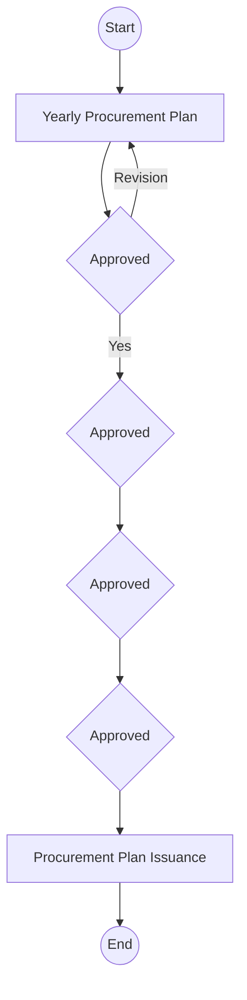
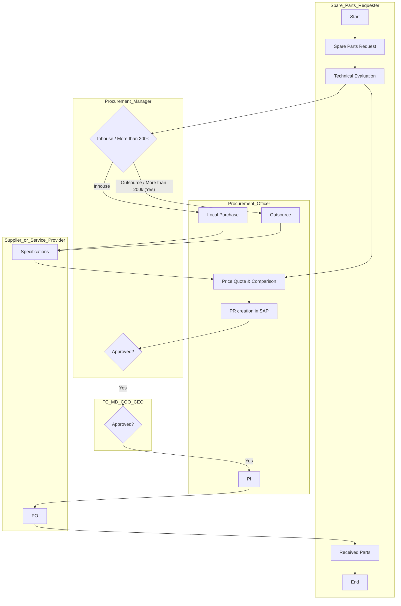
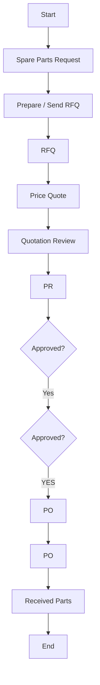
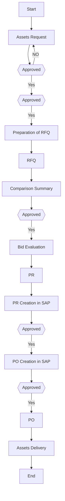
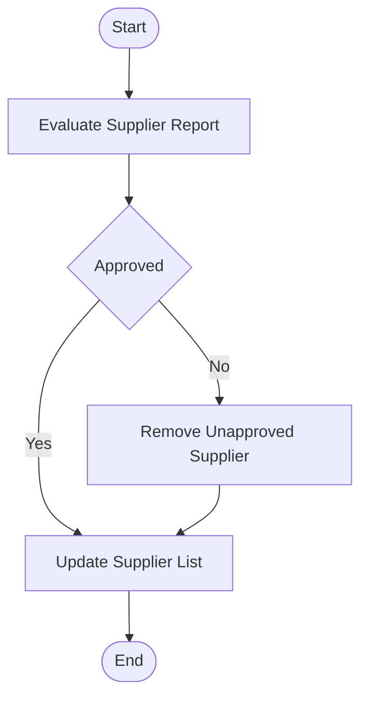
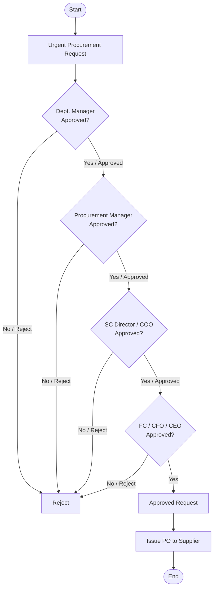
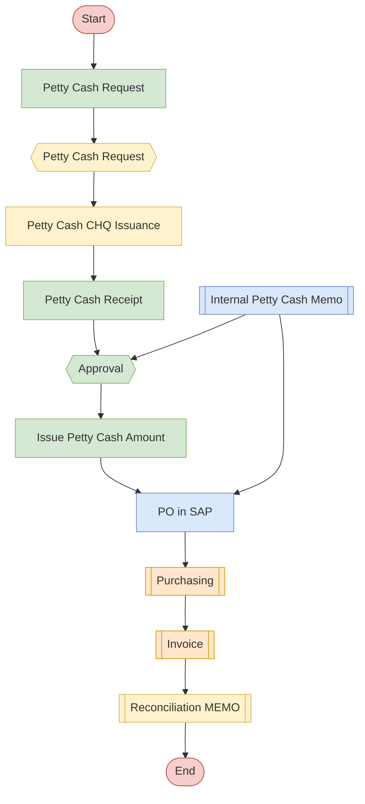
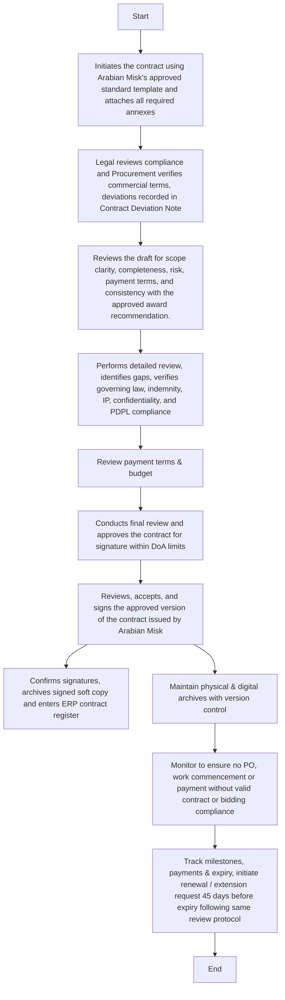

**[Diagram — PNG]:**

- The image contains a logo consisting of:
  - A stylized gold icon at the top made of three leaf- or grain-shaped elements forming a plant-like or wheat-symbol figure.
  - Beneath the icon, there are two lines of text:
    - First line (in Arabic): المطاحن العربية  
    - Second line (in English): Arabian Mills
Procurement Manual

| Accessibility: | ☒ Confidential | ☐ Controlled |  |  |
| --- | --- | --- | --- | --- |
| Version: | ☐ Draft | ☐ Revised Draft | ☒ Final Draft | ☐ Approved |
| Revision cycle | ☒ Annually |  |  |  |
DOCUMENT INFORMATION

| Category | Information |
| --- | --- |
| Document | Procurement |
| Department | Supply Chain Management |
| Created by | Deloitte |
| Reviewed by | Procurement Manager, Supply Chain Director |
| Approved by |  |
| Owner of the document | Supply Chain Director |
DOCUMENT REVISION HISTORY

| Description | Version Ref. | Rationale for Revision | **Created**<br>
- by | Creation Date | **Reviewed**<br>
- By | **Review**<br>
- Date |
| --- | --- | --- | --- | --- | --- | --- |
| Original Version | 1.0 | Not applicable. | Deloitte | 07 July 2025 | Procurement Manager, Supply Chain Director | 06 August 2025 |
| 1 st Update | --- |  |  |  |  |  |
| 2 nd Update | --- |  |  |  |  |  |
| 3 rd Update | --- |  |  |  |  |  |
DISTRIBUTION LIST

| Department | Designation |
| --- | --- |
| Supply Chain ( Warehouse , Procurement, Logistics) | Supply Chain Director |
| Production | COO |
| Maintenance | Maintenance Director |
| Finance | CFO |
Abbreviations
Below is a standardized list of abbreviations used throughout Arabian Mills’ transportation manual.

| Abbreviation | Full Form |
| --- | --- |
| CEO | Chief Executive Officer |
| CFO | Chief Financial Officer |
| PR | Purchase Requisition |
| PO | Purchase Order |
| RFQ | Request for Quotation |
| SAP | Systems, Applications, and Products (ERP System) |
| NCR | Non-Conformance Report |
| HOD | Head of Department |
| KPI | Key Performance Indicator |
| SR | Saudi Riyals |
| OEM | Original Equipment Manufacturer |
| SLA | Service Level Agreement |
| IT | Information Technology |
| GRN | Goods Received Note |
| CAPEX | Capital Expenditure |
| R&M | Repair and Maintenance |
1.1 Introduction
The Procurement Policies & Procedures Manual establishes the official procurement framework for Arabian Mills It outlines the principles, roles, policies, and procedures governing procurement activities across all departments. These documented standards ensure transparency, accountability, and efficiency in all purchasing processes.
This manual provides clear direction for executing procurement tasks related to:

- Raw Materials and Production Inputs

- Spare Parts

- Departmental and Administrative Items

- Outsourced Maintenance

- Transportation Services

- Capital Expenditures (Assets & Equipment)

- Corporate and Technical Services
Every individual involved in procurement including planning, supplier selection, order placement, and contract management is expected to comply with these standardized procedures to support operational excellence and financial stewardship.
1.2 Purpose
The primary purpose of this Procurement Manual is to:

- Establish a standardized, transparent approach to all procurement activities.

- Ensure compliance with internal controls, audit standards, and regulatory requirements.

- Promote cost-effective, quality-driven, and timely purchasing decisions.

- Enhance coordination between departments and procurement personnel.

- Strengthen supplier relationships through clear and ethical practices.
1.3 Scope
This manual applies to all procurement activities undertaken by Arabian Mills, including but not limited to:

- Procurement planning and budgeting

- Supplier qualification and registration

- Purchase requisition and order processing

- Tendering and contract management

- Goods receipt, inspection, and documentation

- Payment terms and conditions

- Procurement reporting and performance monitoring
All departments initiating or involved in any procurement transaction must adhere to the principles, policies, and procedures outlined herein.
1.4 Ethics
a. General
Arabian Mills is committed to maintaining the highest standards of ethics and integrity in all procurement-related activities. This section establishes a dedicated Code of Conduct for the Procurement Department, which supplements the company’s overall Code of Conduct and applies to all employees, officers, and managers involved in supplier interactions, sourcing decisions, and contract administration.
b. Conflicts of Interest
Employees involved in procurement shall not participate—directly or indirectly—in the selection, evaluation, award, or oversight of any contract where a real or perceived conflict of interest exists. A conflict may arise when an individual, or someone closely related to them, holds a personal or financial interest in a vendor, contractor, or service provider dealing with Arabian Mills.
This includes (but is not limited to):

- Relatives such as parents, children, siblings, in-laws, or extended family.

- Business partners or close personal associates.

- Any organization where such individuals are employed or are in negotiation for employment.
Such relationships must be disclosed in writing, and the employee must recuse themselves from all related decisions.
c. Gifts, Gratuities, and Confidential Information
Procurement staff must not request or accept gifts, Favors, or gratuities exceeding SAR 25 (or equivalent in local currency) from suppliers, service providers, or potential vendors. All procurement decisions must remain impartial, and merit based.
Additionally, confidential information—including pricing, bid details, supplier strategies, and contract terms—must not be used for personal gain or shared with unauthorized parties. Any misuse of confidential information is a serious violation of company policy.
d. Prohibition of Contingent Fees
Arabian Mills prohibits vendors or suppliers from hiring agents, intermediaries, or consultants to secure business through commissions, brokerage fees, or contingent arrangements, unless such individuals represent a registered and bona fide commercial agency approved by the company.
e. Ethical Supplier Engagement
All suppliers must be treated fairly, transparently, and without favoritism. Procurement personnel are expected to:

- Avoid coercive practices or misrepresentation.

- Provide equal opportunity to qualified suppliers.

- Act professionally in all business dealings.

- Immediately report unethical behavior, attempts at bribery, or non-compliance.
1.5 Responsibilities
The roles and responsibilities related to procurement are defined to ensure effective governance, control, and execution. These responsibilities include:

- Supply Chain Director (SCD): Overall procurement governance, policy oversight, and performance monitoring.

- Procurement Manager: Execution of procurement operations, vendor negotiations, and compliance enforcement.

- Procurement Officers: Day-to-day procurement processing, coordination with departments, and documentation.

- Department Heads: Identifying requirements, preparing requisitions, and coordinating with procurement for timely acquisitions.

- Finance Department: Budget validation, invoice processing, and financial compliance checks.

- Quality Assurance (where applicable): Evaluation of goods/services against defined specifications.

- Warehouse: Receiving, inspection and movement of inventory and other items store in warehouse.
1.6 Procurement function
At Arabian Mills, the procurement function operates under the Supply Chain Department. It plays a strategic role in ensuring timely availability of materials, services, and equipment across the organization. Procurement integrates with departments including Marketing, Sales, Production, Quality, Maintenance, IT, Administration, Legal, Safety, Project and Finance to support cross-functional operations and business continuity.
The procurement team is responsible for:

- Managing vendor selection and qualification processes

- Executing procurement plans aligned with sales and production forecasts

- Monitoring compliance with purchasing policies

- Reporting procurement performance to senior management
1.7 Procurement document segmentation
To ensure clarity and accessibility, this manual is segmented into the following standardized structure:
1. 1.1- 1.9: Document Introduction & Organizational Structure
2. A: Procurement Policy Framework
3. B: General Procurement Policies
4. C–P: Procurement Categories (Policies, Procedures, Flowchart)
5. Abbreviations
6. KPIs & Reports
Each procurement category (e.g., Raw Materials, Spare Parts, Capital Assets) has a dedicated section covering policies, procedures, and process flow references.
1.8 Procurement group

**[SmartArt Diagram — extracted text]:**

- Procurement Group
- Corporate Service
- CAPEX
- Vehicle & Equipmental Rental
- Outsourced Maintenance
- Departmental & Administration Item
- Spare Parts
- Raw Material & Production Input Items
- Corn,Soya,
- Barley,
- Bran,Semolina,
- Vitamins and iron
- Mixture ,
- Additives,
- Packaging
- materials
- Disinfectants
- Vehicle Spare Parts,
- Machinery Spare Parts
- Sales & Marketing Items TQM Items,
- HR Items,
- Warehouse Cleaning materials,
- stationery
- &
- other consumable items
- Third party vehicle
- machinery maintenance
- Transportation
- Lease & rental
- Buildiing Rentals
- Capital Equipment
- Legal & financial Service
- like General auditing,Taxation,
- Marketing Agencies,
- Consultancies
- etc
1.9 Procurement Manual Procedures
Organization Chart

**[Flowchart — Word Shapes]:**

1. Document Controller

**[Flowchart — Structured]:**

### Step Table

| ID  | Name               | Type    | Description                          | Yes Path | No Path |
|-----|--------------------|---------|--------------------------------------|----------|---------|
| S1  | Document Controller| Process | Step where documents are controlled. | —        | —       |

### Mermaid Diagram


**[SmartArt Diagram — extracted text]:**

- Supply Chain Director
- Procurement Manager
- CEO
- Commodities Officer
- Senior Technical Officer
- Wheat, Corn, Soya
- Riyadh Officer
- Feed, Wheat,additives
- Chemical Material
- Disposal
- Jizan & Hail Senior Officer
- Planets verse Spare Parts for Machines, Silos
- MC Projects assets, vehicles, handling equipment, Machines tools
- Packaging Material, Small Tools
- Hardware, software
- Local plant Spare parts Machines, compressors, Safety tools Generators.
- Vehicles, handling Spares, small devices, Logistic pls, Vehicle’s GPS packages
- Stationary, Cleaning Materials, and printing material
- Party Maintenance one shot long terms
- Local plant Spare parts Machines, compressors, Safety tools, and Generators
- Vehicles, handling Spares, small devices, and logistic pls
- Stationary, Cleaning Material

Procurement Policy Principles
This section outlines the foundational principles that govern procurement operations at Arabian Mills These principles serve as the ethical and operational backbone of all purchasing decisions, ensuring transparency, fairness, and accountability across the organization.

- Procurement at Arabian Mills is defined as the process of identifying and obtaining goods and services, including sourcing, purchasing, and managing the full lifecycle from supplier identification to delivery.

- Purchasing is the specific function responsible for the actual buying of goods and services, while sourcing refers to identifying and managing relationships with appropriate suppliers.

- The procurement system is designed to:
   Ensure transparency, fairness, and fraud prevention.
   Provide equal opportunity for suppliers to compete.
   Promote economy and efficiency by acquiring goods and services at their true value.
   Deliver effectiveness by ensuring procurement supports organizational objectives.

- Effective implementation of this procurement system offers the following benefits:
   Demonstrates responsible stewardship of financial and material resources.
   Improves efficiency and simplifies the procurement process.
   Enhances transparency and accountability across procurement staff.
   Acts as a fraud prevention mechanism.
   Facilitates documentation for audit and review purposes.
Procurement Categories
Arabian Mills classifies all purchases into seven key procurement categories. Each category has distinct characteristics and operational procedures. Staff initiating a purchase must identify and assign it to one of the following:
1. Raw Materials and Production Inputs:
Includes raw materials, packaging materials, and all components required for production.
2. Spare Parts:
Covers machine spare parts used for corrective, preventive, or emergency maintenance.
3. Departmental and Administrative Items:
Includes stationery, office equipment, and other administrative supplies.
4. Outsourced Maintenance:
Refers to externally sourced services and spare parts for machine and equipment repair.
5. Transportations:
Encompasses purchase or rental of transportation vehicles and related services.
6. Assets and Equipment (CAPEX):
Involves acquisition, maintenance, or improvement of fixed assets such as buildings, equipment, instruments, and land. It includes costs for design, architectural, or consultancy services.
7. Corporate Services:
Covers intellectual and non-intellectual services, including consultants, technical experts, and research contracts.
Procurement Planning Guidelines
Procurement planning at Arabian Mills ensures that purchasing activities are proactively aligned with departmental needs and business goals. The planning process adheres to the following principles:

- Specific procurement procedures should be identified and defined early in the project or operational cycle.

- Planning ensures timely implementation of procurement activities without delays to operations, especially in emergencies.

- Identification of procurement activities and requirements helps ensure:
   Transparency in supplier selection.
   Proper documentation and approval cycles.
   Prevention of contract splitting for budget circumvention.

- Procurement planning should be based on collaboration between Supply Chain and all relevant departments, ensuring timely and accurate data sharing.
Steps For Designing the Procurement Plan
This section outlines the step-by-step process for developing a comprehensive procurement plan at Arabian Mills:
1. List all goods, supplies, services, and works needed based on departmental budgets and operational forecasts.
2. Refer to the approval summary and internal procedures to determine the appropriate procurement method for each item.
3. Cross-check procurement requirements with the expected delivery timeline to prioritize purchase actions.
4. Identify any procedures that may require exemption or waiver and determine the appropriate approval authority for each case.
Additional Considerations
During procurement plan design, the following points must also be considered to ensure efficiency and compliance:

- Items naturally grouped (e.g., vehicles and spare parts) should remain consolidated in the plan to avoid artificial contract splitting.

- Include all procurement-related costs in the plan, such as advertising tenders or sourcing expenses.

- If items will be consumed from existing stock, ensure they are clearly documented in the procurement plan and verified for availability.
Summary of Procurement Policies
This final sub-section summarizes the policy intent and expectations for procurement execution at Arabian Mills:

- Procurement policies provide structured guidance for managing purchases across all categories.

- They establish criteria for decision-making, supplier engagement, and purchasing protocols.

- They support staff training, enhance internal controls, and improve transparency in all procurement transactions.

- These policies are designed to serve as a management tool for better decision-making and resource optimization across the organization.

The following policies define the core procurement governance standards at Arabian Mills These general policies are applicable to all types of purchases across departments and ensure operational consistency, fairness in sourcing, and compliance with internal and external requirements.
Number of Suppliers

- For every item or service to be procured under the procurement system, a Request for Quotation (RFQ) must be sent to a minimum of Three suppliers or service providers.

- In exceptional circumstances — such as urgent procurement or pre-defined suppliers for specific categories (e.g., branding services) — the above rule may be waived based on justified CEO approval.
Approved Vendors List

- An approved vendor list must be created and maintained by the Supply Chain Department and regularly updated through a structured qualification process.

- Suppliers and service providers will be selected based on defined selection criteria and can be removed from the list based on performance evaluations.

- Wherever the term "Supplier" is used, it includes "Service Provider" as applicable.
Bulk Payment Limit

- The Chief Executive Officer (CEO) of Arabian Mills is authorized to endorse bulk payments ranging from SAR 1 to SAR 200 million as per internal financial governance policies.
Bulk and Continuous Deals Agreements

- For bulk purchases or recurring procurement activities, long-term contractual agreements must be established to ensure pricing stability and supply continuity.
Payment Currency

- All supplier payments must be made in Saudi Riyals (SAR), unless the procurement agreement specifies payment in other foreign currencies such as Euro (EUR) or US Dollars (USD) for international transactions.
Ethical Practices
Procurement activities at Arabian Mills must be conducted with integrity and ethical accountability. The following practices are mandatory:

- Conflict of Interest: All staff involved in procurement must declare any personal or professional interests that may influence procurement decisions.

- Integrity: Procurement staff must avoid favoritism, collusion, or any improper influence in supplier selection.

- Confidentiality: All procurement-related information, including supplier quotations and pricing, must be kept confidential.

- Declaration of Interests: Any potential conflicts must be disclosed to the Supply Chain Director before initiating procurement.

- Supplier Relations: Supplier interactions must be professional and free from coercion, favoritism, or undue influence.

Policies
This section defines the core policies governing how procurement plans are developed at Arabian Mills. These policies ensure that the planning process is collaborative, data-driven, performance-monitored, and aligned with company objectives.
Procurement Plan Philosophy

- The development of the procurement plan must be coordinated with all department heads to ensure alignment with organizational needs.

- The Supply Chain Director is responsible for managing the planning process, which must receive formal approval from the Chief Executive Officer (CEO).
Planning Frequency

- A new procurement plan must be developed yearly ensuring continuous alignment with evolving operational and financial requirements.
Plan Accuracy

- The procurement plan must be developed using the most accurate inputs available from all affected departments to minimize deviations and ensure reliability.
Plan Execution

- All procurement activities must be executed strictly in accordance with the approved procurement plan, including quantities, specifications, and timelines of items to be procured.
Procurement Plan Execution Performance

- The performance of the procurement plan execution must be continuously monitored and measured through internal reporting mechanisms to the CEO.

- Any deviations or variances must be documented and considered during the development of the next procurement plan cycle.
Changes to Plan

- Any required changes to the procurement plan must be evaluated for impact, justified appropriately, and the plan updated accordingly.
Financial Considerations

- The procurement plan must be developed with a strong emphasis on maximizing value for money in all purchasing activities.

- This includes exploring cost-effective alternatives and leveraging bulk purchasing opportunities where applicable.
Quality Considerations

- The procurement plan must fully comply with quality specifications provided by the respective process owner or item requester to ensure procurement meets operational standards.
Ethical Practices
The procurement planning process must uphold the following ethical standards:

- Conflict of Interest: Avoid any undue influence or bias in selecting planned vendors or items.

- Integrity: Ensure truthful representation of needs and supplier capabilities.

- Confidentiality: Protect sensitive supplier and pricing data during the planning phase.

- Declaration of Interests: Disclose any conflicts that may affect sourcing or planning.

- Supplier Relations: Maintain transparency and fairness in engagement with suppliers during planning.
Plan Amendment

- Any amendments to the procurement plan must be formally approved by the relevant Department Manager, the Supply Chain Director, and the COO before implementation.
The following table presents the step-by-step procedure to be followed at Arabian Mills when developing the procurement plan.

| S. No | Responsibility | Procedure Description | Output / Report |
| --- | --- | --- | --- |
|  | Procurement Manager |
- Send a request to the Sales Department for the annual sales forecast , and to the Production Department to provide the production plan and procurement needs for the upcoming 6 months , followed by the next period. Categorize requisition items into: Raw Materials, Packaging Materials, Production Consumables, Machinery Spare Parts, Machineries and Equipment, and Other Materials and Items.<br>
- Notes: The forecast or planning report should be shared by the Head of the department to Procurement manager | Procurement Needs Report |
|  | Procurement Officer | Send a request to the Sales Department to provide the sales plan and procurement needs for the upcoming 6 months . | Procurement Needs Report |
|  | Procurement Officer | Send a request to the Maintenance Department to provide procurement needs for the upcoming 6 months , which may include: Spare Parts, Maintenance Disposables, Productivity Items, and Other Materials. * | Procurement Needs Report |
|  | Procurement Officer | Send a request to the HR & Administrative Department to provide procurement needs for the upcoming 6 months , which may include: Stationery, Consumables, Printer Ink, Toners, Ribbons, and Administrative Items. * | Procurement Needs Report |
|  | Procurement Officer | Send a request to all other departments to provide their procurement needs for the upcoming 6 months , based on operational requirements. * | Procurement Needs Report |
|  | Procurement Officer |
- The procurement plan for Raw Materials and Packaging Materials is reviewed by the Material Planner under the guidance of the Supply Chain Director.<br>
- Procurement department doesn’t’ having the material planner | Procurement Needs Report |
|  | Transportation Manager | Evaluate the Product Sheet for each truck and assess spare part requirements as per the recommendations of vehicle dealers. Every two months , prepare a list of fast-moving and frequently consumed spare parts. Coordinate with dealers, leasing companies, or service centers for maintenance schedules. Receive the Sales Plan at the beginning of the year and conduct a load assessment to match required vs. available vehicle capacity. Coordinate vehicle acquisition (buy/lease) as needed. | **Product Sheet**<br>
- It’s not for the procurement |
|  | Procurement Manager | Receive contracting work requirements from concerned departments. Discuss the contract's technical sheet with the responsible engineer to set selection criteria and choose a contractor. For vehicle needs, analyze the capacity gap and cover it through buying or leasing based on geography, volume, transaction size, and financial feasibility. | Contracting Requirement Summary |
|  | Material Planning Manager | Every two months , prepare a list of fast-moving and consumable spare parts required frequently for operational continuity. Should be from the maintenance department planner | Email |
|  | Procurement Manager / Supply Chain Director | Review and approve expected procurement items based on: Current Year Procurement Plan, Department Budgets, Expected Next Year Sales and Projects, and Current Year Procurement Performance. Budget monitoring and validation with the Finance department | Email Approval |
|  | Procurement Manager | Conduct in-depth market research by category and provide feedback to Procurement Officers on: Preferred suppliers, Price ranges, Alternative options, Supplier capabilities, Economic & shipping conditions, Technology/quality factors, Lead times, Customs considerations, Financial health of suppliers, and Strengths/Weaknesses. | Market Intelligence Email |
|  | Procurement Officer | Send RFQs for each item with complete specifications, quantities, and delivery timelines to a minimum of 3 pre-qualified suppliers/contractors . | RFQs Issued |
|  | Suppliers and Contractors | Submit price quotations to the Procurement Officer in response to RFQs. | Price Quotations |
|  | Procurement Officer | Review and evaluate commercial terms for each quotation. Prepare a comparison sheet and share it with the Procurement Manager, Supply Chain Director, and Head of Department. | Quotation Comparison Sheet |
|  | Procurement Manager | After receiving technical evaluations from requesters, initiate negotiation with shortlisted suppliers regarding price and delivery terms. If agreed, instruct suppliers to lock quantities and prices. Prepare and sign contracts for CEO approval. Share final contract with contractors and finance . | Signed Contracts |
|  | Procurement Manager | If agreement cannot be reached with the preferred supplier, discuss with requesters whether trade-off is justified. If yes, proceed; if not, consider the next supplier in the ranking. | Justification Email |
|  | Procurement Officer | Prepare a bid evaluation form with a recommendation. Send both soft and hard copies to the Procurement Manager, Supply Chain Director, and HOD for review and approval. | Bid Evaluation Form |
|  | Procurement Manager | Review and sign the bid evaluation form, confirming selection decision. | Approved Bid Evaluation Form |
|  | Procurement Manager | Ensure payment approval limit aligns with policy: CEO approval required for payments from SAR 1 to SAR 200 million . | PR Form |
|  | Procurement Officer / Material Planner |
- Consolidate all approved information to prepare the Next Year Procurement Plan , including Item Name, Opening Stock, Monthly Demand, Unit Cost, and Total Purchase Value.<br>
- Should come from the requestor's department (planner). | Draft Procurement Plan |
|  | Supply Chain Director | Review the Draft Procurement Plan with all Department Managers, incorporate amendments, and obtain approvals and signatures. | Signed Procurement Plan |
|  | CEO | Review, approve, and sign the Final Procurement Plan. | Approved Procurement Plan |
|  | Department Managers | Submit a formal request for any change, replacement, or cancellation of items listed in the approved plan. | Internal Memorandum |
|  | Supply Chain Director | Review the requested changes and evaluate their impact. Consult with Department Heads and submit final recommendation to CEO for review and approval. | Internal Memorandum |
|  | CEO | Review and approve/reject proposed changes to the Procurement Plan. | CEO-Approved Memo |
|  | Procurement Officer | Reflect approved changes in the Procurement Plan and forward the updated version to the Supply Chain Director for final processing post-COO , HOD approval. | Amended Procurement Plan |
* Notes: The reports should be shared by the procurement manager to the officer
Flowchart

**[Diagram — PNG]:**

**Process Name:** Procurement Planning Flowchart  

**Roles / Swimlanes:**

- Procurement Manager  
- SC Director  
- COO  
- CFO  
- CEO  

---

### Steps

| Step # | Role                | Action                          | Decision/Next Step                                                                 |
|--------|---------------------|---------------------------------|------------------------------------------------------------------------------------|
| 1      | Procurement Manager | Start                           | Proceeds to Step 2                                                                 |
| 2      | Procurement Manager | Yearly Procurement Plan         | Proceeds to Step 3                                                                 |
| 3      | SC Director         | Approved                        | Branch “Yes” to Step 4; branch “Revision” back to Step 2                           |
| 4      | COO                 | Approved                        | Proceeds to Step 5                                                                 |
| 5      | CFO                 | Approved                        | Proceeds to Step 6                                                                 |
| 6      | CEO                 | Approved                        | Proceeds to Step 7                                                                 |
| 7      | *Not specified*     | Procurement Plan Issuance       | Proceeds to Step 8                                                                 |
| 8      | *Not specified*     | End                             | Flow terminates                                                                    |

Connector labels present in the diagram:
- “Revision” (arrow from “Approved” under SC Director back to “Yearly Procurement Plan”)  
- “Yes” (arrow from “Approved” under SC Director to the next “Approved” under COO)

---



Policies
This section outlines the specific procurement policies governing the purchase of raw materials and production inputs at Arabian Mills These materials are essential for production continuity, and their procurement must comply with quality, shelf-life, and documentation standards.
Minimum Number of Suppliers

- There must be a minimum of Three (3) suppliers for every procured raw material and production item to ensure competitive pricing and supply security.
Request for Quotation

- All purchases must be conducted through a Request for Quotation (RFQ) process.

- The RFQ must be sent to a minimum of Three (3) suppliers selected from the pre-approved vendor list.
Approved Vendors List

- A formal list of approved vendors must be maintained by the Procurement Department, developed through a structured selection and qualification procedure.

- The approved list must be used consistently when issuing RFQs for raw materials and production inputs.
Shelf Life

- All raw materials and production items must have more than 9 months depending on the material of remaining shelf life at the time of procurement.

- In cases where this is not feasible, procured items must retain at least 75% of their original shelf life upon receipt.
Payment to Suppliers

- Payments to suppliers may be made in cash Advance or on credit, based on the nature of the transaction.

- The Procurement Department is fully responsible for determining the most suitable payment terms on a case-by-case basis.

- All payments must strictly follow the agreed contractual terms with the supplier.
Payment Currency

- The standard payment currency is Saudi Riyals (SAR).

- Exceptions apply for international purchases, where payments may be made in USD or EUR, as stated in the supplier agreement.
Storage Conditions

- Appropriate storage conditions must be ensured for all purchased items.

- Storage areas must be selected to preserve product integrity in accordance with manufacturer recommendations, especially for temperature- or humidity-sensitive items.
Materials Compliance

- All materials procured must strictly adhere to the pre-defined technical specifications communicated to suppliers during the RFQ process.
The following procedure defines the standardized steps required for purchasing raw materials and production inputs at Arabian Mills It ensures structured procurement through requisition, RFQs, evaluations, SAP entry, approvals, and supplier coordination.

| S. No | Responsibility | Procedure Description | Output / Report |
| --- | --- | --- | --- |
|  | Material Planning Manager / Dept. Coordinator |
- Fill out the Purchase Request (PR) form and submit it to the Department Manager for review and approval. Once approved, forward the PR to the Procurement Officer for processing.<br>
- PR should be from the Requestor department | Purchase Request (PR) |
|  | Procurement Officer | Send the approved Purchase Request to the Procurement Manager and Supply Chain Director for further review and authorization. | Approved PR |
|  | Procurement Manager and Supply Chain Director | Review the submitted PR and sign for formal approval. | PR |
|  | Procurement Officer | Send RFQ by email to at least Three (3) suppliers listed in the qualified vendor list. Attach item specifications and all relevant terms and conditions. | RFQ |
|  | Suppliers | Submit price quotations for the requested raw materials, including specifications, pricing, delivery timelines, and payment terms , to the Procurement Officer. | Price Quotation |
|  | Procurement Officer | Review technical specifications from the received quotations. Share the documents with the Quality Team for technical approval. Begin vendor negotiations to finalize pricing and delivery terms with preferred suppliers as per evaluation recommendations. | Technical Report |
|  | Procurement Manager | Negotiate final pricing and delivery terms. If discrepancies exist, the Procurement Manager and Process Owner must jointly review and approve the justification provided by the Process Owner. | Pricing Decision |
|  | Procurement Officer | Prepare a Bid Evaluation Report , print it, and obtain signatures from the Procurement Manager, Supply Chain Director, and relevant Head of Department. | Bid Evaluation Form |
|  | Material Planning Manager / Dept. Coordinator | Enter the approved PR details into the SAP system , including item specifications and quantities. Submit for approval by the Plant Manager and HOD. | SAP PR |
|  | Procurement Officer | Upon receiving SAP approval, update PR with pricing and supplier details. Convert the PR into a Purchase Order (PO) in the system. | SAP PO |
|  | Procurement Officer | Route the PO for multi-level approval: Procurement Manager, Supply Chain Director, Finance Controller, HOD, Finance Manager, CFO, and CEO. | PO |
|  | Procurement Officer | Print the approved PO and send it along with all related documents ( Comparison Sheet, Bid Evaluation, PR ) to the Procurement Manager for final review and signature. | PO and Documents |
|  | Procurement Manager | Sign the final PO and return it to the Procurement Officer for onward sharing with the supplier. | Signed PO |
|  | Procurement Officer | If payment involves an advance or partial transaction , copy all documents and send them to the Finance Department. | Documents Copy |
|  | Procurement Officer | If the payment is on credit , send original invoices and the Goods Received Note (GRN) to the Finance Department after materials are received. | GRN |
|  | Procurement Officer | For storage and receiving coordination, send a copy of the PO to the Warehouse Unit for reference. | PO Copy |
|  | Procurement Officer | Coordinate with the supplier for on-time delivery and required documentation for custom clearance (if applicable). Work with the clearance agent where needed. | Email |
|  | Procurement Officer | Upon successful delivery and warehouse acknowledgment, archive the Purchase Order and all related documentation . | PO and Supporting Documents |
Flowchart

**[Diagram — Visio-EMF→PNG]:**

Policies
This section defines the procurement policies that apply specifically to the purchase of vehicle spare parts at Arabian Mills These items are essential to maintaining the company’s transportation fleet, and procurement must ensure authenticity, suitability, and compliance with warranty and sourcing guidelines.
Minimum Number of Suppliers

- A minimum of Three (3) suppliers must be considered for every vehicle spare part to ensure competitive sourcing and pricing.

- This requirement may be waived if the part is exclusive to a vehicle dealer who provides genuine OEM parts.
Request for Quotation

- In the absence of a vehicle dealership, all spare parts procurement must be initiated through an RFQ process.

- RFQs must be sent to a minimum of three (3) qualified spare parts suppliers from the pre-approved vendor list.
Approved Vendors List

- A formal approved vendor list must be maintained by the Procurement Department.

- The list must be developed using a defined selection and qualification procedure and must be referred to before issuing any RFQ.
Payment to Suppliers

- Payments to suppliers may be executed in cash or on credit, depending on the nature and urgency of the procurement.

- All payments must follow the terms and conditions stipulated in the procurement agreement.
Payment Currency

- The standard currency for supplier payments is Saudi Riyals (SAR).

- Foreign currencies such as USD or EUR may be used only if specified in international agreements.
Outsourcing

- In the case of outsourced repairs, the same procurement process must be followed as for spare parts — replacing the spare parts dealers with authorized service centers.
Spare Part Compliance

- All procured vehicle spare parts must comply with pre-defined technical specifications as communicated during the sourcing process.
Parts Provider Selection

- If a genuine spare part is available through the authorized vehicle agent, it should be purchased directly from them.

- If not available, the Procurement Officer must follow the standard process to procure from alternate qualified suppliers.
Vehicle Warranty

- In the case of vehicle malfunction, the vehicle warranty terms must be reviewed prior to any procurement.

- If the issue falls under warranty coverage, the vehicle dealer must be contacted for resolution.
This procedure outlines the specific steps to be followed for sourcing, evaluating, and procuring spare parts required for the maintenance and repair of company vehicles. The process ensures technical and commercial due diligence, compliance with financial limits, and alignment with warranty terms.

| S. No | Responsibility | Procedure Description | Output / Report |
| --- | --- | --- | --- |
|  | Logistics Coordinator | In case of a vehicle malfunction, send a spare part request to the Supply Chain Director. The request must include a technical assessment or defect report. | **Spare Part Request and Technical**<br>
- Report |
|  | Supply Chain Director | **Review the technical report and decide whether the vehicle should be repaired**<br>
- in-house or outsourced to a service center . | **Technical**<br>
- Report |
|  | Procurement Officer | **If in-house repair is selected, conduct market research and gather price lists**<br>
- from local vendors for the required part. | Price List |
|  | Procurement Officer | **Report findings to the Supply Chain Director. If the part cost is less than**<br>
- SAR 2,000 , proceed with cash purchase. If above SAR 2,000 , obtain at least<br>
- two quotations and forward to the Supply Chain Director for review. | Supplier Quotations |
|  | Supply Chain Director | **If cost is above SAR 2,000 , reassess the in-house vs outsourcing decision based**<br>
- on price, urgency, and operational feasibility. | **Approval**<br>
- Email / Discussion Summary |
|  | Procurement Officer | **If proceeding in-house, send the part specifications to an authorized dealer or**<br>
- pre-approved suppliers and request official quotations. | Quotation Request |
|  | Procurement Officer | **After receiving quotations, forward them to the Logistics Coordinator for**<br>
- technical review and evaluation. | **Quotation**<br>
- Price |
|  | Procurement Officer | **Upon receiving the technical recommendation, prepare a comparison sheet in**<br>
- case of multiple suppliers and get it signed by the Supply Chain Director. | Comparison Sheet |
|  | Logistics Coordinator | Prepare a Purchase Requisition (PR) in the SAP system and send it to the Plant Manager and Supply Chain Director for approval. | SAP PR |
|  | Procurement Officer | **Upon PR approval, issue a Purchase Order (PO) in SAP and send it to the**<br>
- selected supplier. If payment is in cash , send the PO with all supporting<br>
- documents (PR, Comparison Sheet, Bid Evaluation) to the Finance Department. | PO |
|  | Procurement Officer | **If payment is on credit , submit the PO along with the Goods Received Note**<br>
- (GRN) and supporting documents to the Finance Department after receiving<br>
- the parts. | GRN |
|  | Procurement Officer |
- If the repair is outsourced , follow the same process, but replace spare parts suppliers with authorized service centers as the source of quotations and<br>
- services. | **Outsourcing PO and**<br>
- Supporting<br>
- Docs |
Flowchart

**[Diagram — Visio-EMF→PNG]:**

**Process Name:** Purchase Of Vehicle Spare Parts  

**Roles / Swimlanes:**

1. Spare Parts Requester  
2. Procurement Officer  
3. Procurement Manager  
4. FC/MD/COO/CEO  
5. Supplier or Service Provider  

---

### Steps Table

| Step # | Role                           | Action / Decision                                                                 | Decision / Next Step                                                                                                                                                     |
|--------|---------------------------------|------------------------------------------------------------------------------------|--------------------------------------------------------------------------------------------------------------------------------------------------------------------------|
| 1      | Spare Parts Requester          | **Start**                                                                          | Flows to Step 2: Spare Parts Request.                                                                                                                                   |
| 2      | Spare Parts Requester          | **Spare Parts Request**                                                            | Flows to Step 3: Technical Evaluation.                                                                                                                                  |
| 3      | Spare Parts Requester          | **Technical Evaluation**                                                           | Main flow goes to Step 4: decision “Inhouse / More than 200k”. A separate visible connector also leads directly down to Step 8: Price Quote & Comparison.               |
| 4      | Procurement Manager            | **Decision – diamond labeled:** “Inhouse” / “More than 200k” (with “Outsource”).   | Branch “Inhouse” → Step 5: Local Purchase. Branch labeled “Outsource” / “More than 200k” (with green “Yes”) → Step 6: Outsource. No “No” branch is explicitly shown.    |
| 5      | Procurement Officer            | **Local Purchase**                                                                 | Flows down to Step 7: Specifications (Supplier or Service Provider).                                                                                                    |
| 6      | Procurement Officer            | **Outsource**                                                                      | Flows down to Step 7: Specifications (Supplier or Service Provider).                                                                                                    |
| 7      | Supplier or Service Provider   | **Specifications**                                                                 | Flows up to Step 8: Price Quote & Comparison.                                                                                                                           |
| 8      | Procurement Officer            | **Price Quote & Comparison**                                                       | Receives input from Technical Evaluation (Step 3) and from Specifications (Step 7). Flows to Step 9: PR creation in SAP.                                               |
| 9      | Procurement Officer            | **PR creation in SAP**                                                             | Flows up to Step 10: Approved? (Procurement Manager).                                                                                                                   |
| 10     | Procurement Manager            | **Decision – diamond labeled:** “Approved?”                                        | Branch labeled “Yes” (green) → Step 11: Approved? (FC/MD/COO/CEO). No “No” branch or alternate flow is shown in the diagram.                                           |
| 11     | FC/MD/COO/CEO                  | **Decision – diamond labeled:** “Approved?”                                        | Branch labeled “Yes” (green) → Step 12: PI (Procurement Officer). No “No” branch or alternate flow is shown in the diagram.                                            |
| 12     | Procurement Officer            | **PI**                                                                             | Flows down to Step 13: PO (Supplier or Service Provider).                                                                                                               |
| 13     | Supplier or Service Provider   | **PO**                                                                             | Flows up to Step 14: Received Parts (Spare Parts Requester).                                                                                                            |
| 14     | Spare Parts Requester          | **Received Parts**                                                                 | Flows to Step 15: End.                                                                                                                                                  |
| 15     | Spare Parts Requester          | **End**                                                                            | Process terminates.                                                                                                                                                     |

---

### Mermaid.js Flow



Policies
This section outlines the procurement policies applicable to spare parts and consumables required for the repair, maintenance, and operation of machinery and plant equipment at Arabian Mills These policies ensure that items are sourced reliably, in compliance with specifications, and within warranty conditions.
Minimum Number of Suppliers

- Every spare part must be sourced from a minimum of three (3) suppliers to ensure competitive pricing and quality assurance.

- This requirement may be waived if a machine agent or authorized dealer is the exclusive provider of the required spare part.
Request for Quotation

- All spare parts and consumables must be procured through a structured RFQ process.

- The RFQ must be issued to a minimum of three (3)   pre-qualified suppliers for each purchase.
Approved Vendors List

- An official approved vendor list must be maintained by the Supply Chain Department.

- This list must be created using a defined selection and qualification procedure and must be referred to for all procurement activities.
Payment to Suppliers

- Payments to suppliers may be made in cash or on credit, based on the nature and urgency of the procurement.

- All payments must follow the terms and conditions specified in the supplier agreement.
Payment Currency

- The default currency for procurement is Saudi Riyals (SAR).

- Payments in USD or EUR are permitted for international purchases as stated in the supplier agreement.
Spare Part / Consumables Compliance

- All spare parts and consumables must comply with pre-defined specifications shared with the supplier at the RFQ stage.

- Non-compliant deliveries must be rejected and returned according to the company’s quality assurance protocol.
Parts Provider Selection

- If a genuine part is available from an authorized machine agent, it must be purchased directly.

- If unavailable, the part should be procured from other approved suppliers following the standard RFQ process.
Machine Warranty

- Prior to procurement, the machine warranty must be reviewed.

- If the issue is covered by warranty, the supplier or agent must be contacted, and the warranty claim procedure followed.
Spare Part Installation

- If applicable, the installation of spare parts may be carried out by the parts provider to ensure proper fitment and validation.
Spare Part Warranty

- Procured spare parts may carry a supplier-issued warranty that guarantees their operational performance for a specified period.

- The warranty terms must be verified and documented at the time of procurement.
This procedure defines the systematic steps to be followed for procuring spare parts and consumables used in machinery and plant operations at Arabian Mills It ensures supplier qualification, quotation review, warranty compliance, and SAP-based transaction tracking.

| S. No | Responsibility | Procedure Description | Output / Report |
| --- | --- | --- | --- |
|  | Department Coordinator | Send a Spare Part Request to the Procurement Officer by email. The request must include the part name and serial number to ensure accurate sourcing. | Spare Part Request |
|  | Procurement Officer | Check if the required spare part is exclusive to an authorized dealer . If so, send the RFQ directly to that dealer. If not, issue RFQ to a minimum of three (3) qualified suppliers. | RFQ |
|  | Procurement Officer | In all cases, review the existing agreement with the supplier. If using an authorized dealer, ensure any pre-agreed discounts or pricing terms are included in the quotation. | Email |
|  | Procurement Officer | Once quotations are received, forward them to the Technical Manager for evaluation and clarification. | Quotations |
|  | Head of Maintenance | Review the quotations. If technical queries arise, send them to the Procurement Officer for supplier clarification. | Quotations |
|  | Procurement Officer | Forward the technical queries to the relevant suppliers and follow up for detailed responses. | Email |
|  | Head of Maintenance | After resolving technical queries, classify the suppliers based on price, quality, and lead time. Create and submit a Purchase Requisition (PR) in the SAP system. | PR on SAP |
|  | Procurement Officer | If the spare part is new or not in the system, initiate a New Item Registration Form . Send it to the Finance Department for SAP entry after approval from the Supply Chain Director . | Item Registration Form |
|  | Procurement Officer | Upon PR generation, if there is only one source, issue the PO directly to the selected supplier. If multiple suppliers are evaluated, prepare a Bid Evaluation Form , then create a PO in SAP and submit for approval. | PO or Bid Evaluation + PO |
|  | Procurement Officer | Send a copy of the PO to the Supplier and the Warehouse . Also print all supporting documents ( PR, Comparison Sheet, and Bid Evaluation Form ) and submit to Finance in case of cash deal or where advance payment is required. | PO and Supporting Documents |
|  | Procurement Officer | If the purchase is on credit , send the PO, all supporting documents , and the Goods Received Note (GRN) to the Finance Department after material delivery . | GRN |
Flowchart

**[Diagram — Visio-EMF→PNG]:**

**Process Name:** Purchase Of Spare Parts for Machine & Plant  

**Roles / Swimlanes:**

1. Technical Manager  
2. Procurement Officer  
3. Procurement Manager / SCM Director  
4. F/COO/CEO (exact text partially unclear; transcribed as visible)  
5. Supplier Or Service Dealer  

---

### Process Steps

| Step # | Role                                | Action / Decision Label | Decision / Next Step |
|--------|-------------------------------------|-------------------------|----------------------|
| 1      | Technical Manager                  | Start                   | Proceeds to Step 2: “Spare Parts Request”. |
| 2      | Procurement Officer                | Spare Parts Request     | Proceeds to Step 3: “Prepare / Send RFQ”. |
| 3      | Procurement Officer                | Prepare / Send RFQ      | Proceeds to Step 4: “RFQ” (Supplier Or Service Dealer). |
| 4      | Supplier Or Service Dealer         | RFQ                     | Proceeds to Step 5: “Price Quote” (back to Procurement Officer). |
| 5      | Procurement Officer                | Price Quote             | Proceeds to Step 6: “Quotation Review” (Technical Manager). |
| 6      | Technical Manager                  | Quotation Review        | Proceeds to Step 7: “PR”. |
| 7      | Procurement Officer                | PR                      | Proceeds to Step 8: Decision “Approved?” (Procurement Manager / SCM Director). |
| 8      | Procurement Manager / SCM Director | Approved?               | Yes → Step 9: Decision “Approved?” (F/COO/CEO). No path is not shown in the diagram. |
| 9      | F/COO/CEO                          | Approved?               | Yes → Step 10: “PO” (Procurement Officer). No path is not shown in the diagram. |
| 10     | Procurement Officer                | PO                      | Proceeds to Step 11: “PO” (Supplier Or Service Dealer). |
| 11     | Supplier Or Service Dealer         | PO                      | Proceeds to Step 12: “Received Parts” (Technical Manager). |
| 12     | Technical Manager                  | Received Parts          | Proceeds to Step 13: “End”. |
| 13     | Technical Manager                  | End                     | Process terminates. |

Yes/No branches explicitly:

- Step 8 “Approved?” (Procurement Manager / SCM Director)  
  - Yes → Step 9 “Approved?” (F/COO/CEO)  
  - No → Not indicated in the diagram (no return or alternate flow shown).

- Step 9 “Approved?” (F/COO/CEO)  
  - Yes → Step 10 “PO” (Procurement Officer)  
  - No → Not indicated in the diagram (no return or alternate flow shown).

---

### Mermaid Diagram

```mermaid
graph TD

%% Roles noted in comments for clarity
    A1[Start\n(Technical Manager)] --> A2[Spare Parts Request\n(Procurement Officer)]
    A2 --> A3[Prepare / Send RFQ\n(Procurement Officer)]
    A3 --> B1[RFQ\n(Supplier Or Service Dealer)]
    B1 --> A4[Price Quote\n(Procurement Officer)]
    A4 --> A5[Quotation Review\n(Technical Manager)]
    A5 --> A6[PR\n(Procurement Officer)]
    A6 --> D1{Approved?\n(Procurement Manager / SCM Director)}
    D1 -->|Yes| D2{Approved?\n(F/COO/CEO)}
    D1 -->|No (not shown)| D1_No[(No path specified\nin source diagram)]
    D2 -->|Yes| A7[PO\n(Procurement Officer)]
    D2 -->|No (not shown)| D2_No[(No path specified\nin source diagram)]
    A7 --> B2[PO\n(Supplier Or Service Dealer)]
    B2 --> A8[Received Parts\n(Technical Manager)]
    A8 --> A9[End\n(Technical Manager)]
```

Policies
This section outlines the specific procurement policies for acquiring consumable spare parts used in machinery, tools, and operational maintenance at Arabian Mills These items are typically used regularly and require reliable sourcing and adherence to technical specifications.
Minimum Number of Suppliers

- All consumable spare parts must be sourced from a minimum of three (3) suppliers to ensure fair competition and optimal value.

- This requirement may be waived only if the part is exclusive to an authorized dealer or sole source provider.
Request for Quotation

- Every consumable spare part purchase must be initiated through an RFQ.

- The RFQ must be issued to a minimum of three (3) pre-qualified suppliers unless the part is only available through an authorized source.
Approved Vendors List

- All consumable parts must be procured from vendors listed on the approved vendor list, maintained by the Supply Chain Department.

- The list must be developed using defined selection and qualification criteria and updated periodically.
Payment to Suppliers

- Supplier payments may be made in cash or on credit, depending on transaction nature and urgency.

- All payments must comply with the contractual terms agreed between Arabian Mills and the supplier.
Payment Currency

- The standard payment currency is Saudi Riyals (SAR).

- For international purchases, USD or EUR may be used where specified in the agreement.
Spare Part / Consumables Compliance

- All consumables must comply with technical specifications shared with suppliers at the RFQ stage.

- Non-compliant materials must be rejected upon receipt in line with Arabian Mills’ quality protocols.
Parts Provider Selection

- If the item is available from an authorized agent or manufacturer, it must be procured directly from that source.

- If unavailable, follow the standard RFQ process to select from approved alternative suppliers.
Machine Warranty

- Before purchasing consumable parts for machines under warranty, the warranty terms must be reviewed to avoid voiding coverage.

- If the issue is warranty-covered, the authorized dealer or service provider must be contacted for resolution.
Spare Part Installation

- Where applicable, the installation of consumable parts may be performed by the supplier or their authorized technician to ensure proper usage and validation.
Spare Part Warranty

- Certain consumables may carry a limited operational warranty provided by the supplier.

- These terms must be reviewed during procurement and recorded for follow-up.
This procedure provides the structured steps for acquiring consumable spare parts used in daily operations at Arabian Mills It ensures traceability, compliance with supplier agreements, and proper documentation throughout the procurement process.

| S. No | Responsibility | Procedure Description | Output / Report |
| --- | --- | --- | --- |
|  | Department Coordinator | Send a Spare Part Request to the Procurement Officer via email. Include part name , serial number , and other relevant specifications to ensure clarity and traceability. | Spare Part Request |
|  | Procurement Officer | Verify whether the item is exclusive to an authorized dealer . If so, send the RFQ directly to that dealer. Otherwise, issue the RFQ to a minimum of three (3) qualified suppliers. | RFQ |
|  | Procurement Officer | In either case, review any existing agreement with the supplier. For authorized dealers, apply pre-agreed pricing and discount terms (if applicable). | Email |
|  | Procurement Officer | Once supplier quotations are received, forward them to the Technical Manager for review and technical evaluation. | Quotations |
|  | Head of Maintenance | Review the submitted quotations. If clarifications are needed, contact the Procurement Officer to initiate supplier query. | Quotations |
|  | Procurement Officer | Contact suppliers to resolve any technical inquiries received from the Maintenance Department and forward responses accordingly. | Email |
|  | Head of Maintenance | If all quotations are clear and validated, classify the suppliers and issue a Purchase Requisition (PR) in the SAP system. | PR on SAP |
|  | Procurement Officer | If the item is new or not registered in SAP, initiate a New Item Registration Form and send it to the Finance Department. Add the item to the system after obtaining approval from the Supply Chain Director. | Item Registration Form |
|  | Procurement Officer | Upon PR approval, if there is only one qualified supplier, issue the PO directly . If multiple options exist, prepare a Bid Evaluation Form , create the PO in SAP, and route it for approval. | PO or Bid Evaluation + PO |
|  | Procurement Officer | Send a copy of the PO to both the Supplier and the Warehouse . For cash purchases or those requiring advance payment , print and submit all supporting documents (PR, Comparison Sheet, Bid Evaluation) to the Finance Department. | PO and Supporting Documents |
|  | Procurement Officer | For credit-based purchases , submit the PO along with all required supporting documents and the Goods Received Note (GRN) to the Finance Department after material receipt. | GRN |
Flowchart

**[Diagram — Visio-EMF→PNG]:**

**Process Name**

Purchasing Consumable Spare Parts

---

**Roles / Swimlanes**

- Technical Manager  
- Procurement Officer  
- Procurement Manager / SCM Director  
- FC/MD/OPS/CEO  
- Supplier Or Service Dealer  

---

**Process Steps**

| Step # | Role                                | Action                | Decision/Next Step                                                                 |
|--------|-------------------------------------|-----------------------|------------------------------------------------------------------------------------|
| 1      | Technical Manager                   | Start                 | Flows to “Spare Parts Request”.                                                   |
| 2      | Procurement Officer                 | Spare Parts Request   | Flows to “Prepare / Send RFQ”.                                                    |
| 3      | Procurement Officer                 | Prepare / Send RFQ    | Flows down to “RFQ”.                                                              |
| 4      | Supplier Or Service Dealer          | RFQ                   | Flows up to “Price Quote”.                                                        |
| 5      | Procurement Officer                 | Price Quote           | Flows up to “Quotation Review”.                                                   |
| 6      | Technical Manager                   | Quotation Review      | Flows down to “PR”.                                                               |
| 7      | Procurement Officer                 | PR                    | Flows to decision “Approved?” (Procurement Manager / SCM Director).              |
| 8      | Procurement Manager / SCM Director  | Approved?             | Yes → flows down to next decision “Approved?” (FC/MD/OPS/CEO). No branch not shown in the diagram. |
| 9      | FC/MD/OPS/CEO                       | Approved?             | YES (label shown) → flows to “PO” (Procurement Officer). No branch otherwise shown in the diagram. |
| 10     | Procurement Officer                 | PO                    | Flows down to “PO” (Supplier Or Service Dealer).                                  |
| 11     | Supplier Or Service Dealer          | PO                    | Flows up to “Received Parts”.                                                     |
| 12     | Technical Manager                   | Received Parts        | Flows to “End”.                                                                   |
| 13     | Technical Manager                   | End                   | Process terminates.                                                               |

---



Policies
The following policies are established to govern the procurement of departmental and administrative items at Arabian Mills These ensure standardization, supplier accountability, and compliance with internal procurement controls.
Items Procurement Frequency

- Procurement of departmental and administrative items shall be carried out on a need basis. Requests are to be submitted formally via email by the requesting department.
Minimum Number of Suppliers

- Each procurement activity must consider quotations from a minimum of two (2) suppliers to ensure market competitiveness and fairness.
Request for Quotation

- All purchases must be initiated through a Request for Quotation (RFQ), which must be sent to at least two (2) pre-defined and approved suppliers.
Approved Vendors List

- Procurement activities must be executed using suppliers from the Approved Vendors List. This list is developed and maintained by the Supply Chain Department through a structured qualification process and must be referred to when issuing any RFQ.
Payment to Suppliers

- Payment terms may be on a cash or credit basis depending on the nature of the procurement. The Supply Chain Department shall determine the most appropriate method based on supplier agreements, and all payments must align with agreed contractual terms.
Payment Currency

- The default currency for payments is Saudi Riyals (SR). However, for international purchases, alternative currencies such as USD or EUR may be used as specified in the respective agreements.
Items Compliance

- All departmental and administrative items procured must adhere to predefined technical or operational specifications provided by the requester. These specifications must be clearly shared with suppliers at the RFQ stage.
Local Buying

- Preference shall be given to local suppliers for departmental and administrative items to ensure faster response time, easy availability of maintenance support, replacement parts, and access to valid warranties.
This procedure outlines the steps to be followed when purchasing office-related and departmental. It ensures purchases are initiated through formal requests, evaluated, and processed through SAP with full documentation and approvals.

| S. No . | Responsibility | Procedure Description | Output / Report |
| --- | --- | --- | --- |
|  | Department Coordinator | Send an item request to the Procurement Officer via email, including complete details such as item name, quantity, specification, and any required justification. | Item Request |
|  | Procurement Officer | Forward the received request to the Procurement Manager for review and initiation of the process. | PR |
|  | Procurement Officer | Obtain necessary approvals in SAP from the Plant Manager and Head of Department (HOD). | PR |
|  | Procurement Officer | Send an RFQ to at least three ( 3 ) suppliers listed in the approved vendor list. RFQ must include specifications, quantities, delivery terms, and payment terms. | RFQ |
|  | Suppliers | Submit price quotations to the Procurement Officer including item specifications, pricing, and expected delivery schedule. | Price Quotation |
|  | Procurement Officer | Collect and review all quotations. Summarize commercial and technical terms into a comparison sheet for evaluation. | Quotations Comparison Sheet |
|  | Procurement Manager | Negotiate pricing and delivery terms with suppliers, if required. In case of price gaps or justification, the Procurement Manager, Supply Chain Director, and HOD must jointly review. | Negotiation Notes |
|  | Procurement Officer | Prepare a bid evaluation report and obtain signatures from the Procurement Manager, Supply Chain Director, and HOD. | Bid Evaluation Form |
|  | Department Coordinator | Prepare the PR in SAP with the approved specifications and quantities. Submit it for final approval from the Plant Manager and HOD. | PR on SAP |
|  | Procurement Officer | After approval, update the PR with prices, payment terms, and selected supplier details. | PR |
|  | Procurement Officer | Convert the approved PR into a Purchase Order (PO). | Purchase Order Form |
|  | Procurement Officer | Print the PO after completion of SAP approval cycle. Attach all required documentation (Comparison Sheet, Bid Evaluation, and PR) and submit to the Procurement Manager for signature. | PO and Supporting Documents |
|  | Procurement Manager | Sign the PO and return it to the Procurement Officer for sharing with the supplier. | Signed PO |
|  | Procurement Officer | If advance payment is required, prepare a document copy set and submit it to the Finance Department. | Documents Copy |
|  | Procurement Officer | For credit payments, submit the original invoice along with the GRN (Goods Received Note) to the Finance Department after item receipt. | GRN and Invoices |
|  | Procurement Officer | If items require storage, send a copy of the PO to the warehouse for receiving and record-keeping. | PO Copy |
|  | Procurement Officer | Coordinate with suppliers by phone or email to confirm timely delivery. For international shipments, arrange and track required customs clearance documentation. | Email Follow-up / Customs Clearance |
|  | Procurement Officer | Archive the PO and all associated documentation upon acknowledgment from the warehouse. | PO Archive File |
Flowchart

**[Diagram — Visio-EMF→PNG]:**

**Process Name:** Purchasing Departmental & Administration Items  

**Roles / Swimlanes:**

- Item Requester  
- Procurement Officer  
- Procurement Manager / SCM Manager  
- FC/HOD/PC/CEO  
- Supplier or Service Provider  

---

### Steps

| Step # | Role                               | Action                                                | Decision/Next Step                                                                                                      |
|--------|------------------------------------|--------------------------------------------------------|-------------------------------------------------------------------------------------------------------------------------|
| 1      | Item Requester                     | **Start**                                              | Proceeds to Step 2.                                                                                                     |
| 2      | Procurement Officer                | **Item Request**                                      | Proceeds down to Step 3 for approval.                                                                                   |
| 3      | Procurement Manager / SCM Manager  | **Approved?** (decision under “Item Request”)         | **Yes** (green) → Step 4. **No** (red) → Return to Step 2 “Item Request”.                                              |
| 4      | FC/HOD/PC/CEO                      | **Approved?** (second approval decision)              | **Yes** (green) → Step 5. **No** → Return to Step 2 “Item Request”.                                                    |
| 5      | Item Requester                     | **PR**                                                | Proceeds to Step 6.                                                                                                     |
| 6      | Procurement Officer                | **Preparation of RFQ**                                | Proceeds to Step 7.                                                                                                     |
| 7      | Supplier or Service Provider       | **RFQ**                                               | RFQ is received/handled by supplier or service provider; proceeds back to buyer process at Step 8.                     |
| 8      | Procurement Officer                | **Comparison Sheet**                                  | Proceeds to Step 9.                                                                                                     |
| 9      | Procurement Officer                | **PR Creation in SAP**                                | Proceeds down to Step 10 for approval.                                                                                  |
| 10     | Procurement Manager / SCM Manager  | **Approved?** (decision under “PR Creation in SAP”)   | **Yes** (green) → Step 11. **No** → Return to Step 9 “PR Creation in SAP”.                                             |
| 11     | FC/HOD/PC/CEO                      | **PO, PR, Comparison Sheet & Evaluation Form**        | Proceeds up to Step 12.                                                                                                 |
| 12     | Procurement Officer                | **PO**                                                | Proceeds down to Step 13.                                                                                               |
| 13     | Supplier or Service Provider       | **PO**                                                | Supplier/service provider processes PO and supplies item; proceeds to Step 14.                                         |
| 14     | Item Requester                     | **Received Item**                                     | Proceeds to Step 15.                                                                                                    |
| 15     | Item Requester                     | **End**                                               | Process concludes.                                                                                                      |

---

### Mermaid Flow Diagram

```mermaid
graph TD

    %% Roles as subgraphs (swimlane-style grouping for clarity)
    subgraph IR[Item Requester]
        S1(Start)
        A5(PR)
        A14(Received Item)
        E1(End)
    end

    subgraph PO[Procurement Officer]
        A2("Item Request")
        A6("Preparation of RFQ")
        A8("Comparison Sheet")
        A9("PR Creation in SAP")
        A12(PO)
    end

    subgraph PM[Procurement Manager / SCM Manager]
        D3{"Approved?"}
        D10{"Approved?"}
    end

    subgraph FC[FC/HOD/PC/CEO]
        D4{"Approved?"}
        A11("PO, PR, Comparison Sheet & Evaluation Form")
    end

    subgraph SUP[Supplier or Service Provider]
        A7(RFQ)
        A13(PO)
    end

    %% Main flow
    S1 --> A2
    A2 --> D3

    %% First approval on Item Request
    D3 -->|Yes (green)| D4
    D3 -->|No (red)| A2

    %% Second approval
    D4 -->|Yes (green)| A5
    D4 -->|No| A2

    %% PR and RFQ process
    A5 --> A6
    A6 --> A7
    A7 --> A8
    A8 --> A9
    A9 --> D10

    %% Approval of PR in SAP
    D10 -->|Yes (green)| A11
    D10 -->|No| A9

    %% PO creation and sending
    A11 --> A12
    A12 --> A13

    %% Receipt and close
    A13 --> A14
    A14 --> E1
```

Policies
The following policies are established for handling the procurement of outsourced maintenance services at Arabian Mills These policies ensure quality, compliance, and cost control across all outsourced maintenance activities.
Outsourcing Applicability

- Outsourced maintenance will be considered only when in-house execution is not feasible due to lack of skilled personnel, absence of necessary equipment/tools, or when outsourcing is determined to be more practical.
Minimum Number of Service Providers

- At least two (2) service providers must be considered for every outsourced maintenance requirement. Preference shall be given to local service providers, especially for machine-related maintenance.
Request for Quotation

- Maintenance outsourcing must be executed through a Request for Quotation (RFQ) process sent to a predefined list of service providers. A minimum of two (2) service providers must receive the RFQ.
Approved Vendors List

- An approved vendors list must be created and maintained by the Procurement Department. This list shall be based on a defined vendor selection and qualification procedure.
Payment to Service Providers

- Payments to service providers may be made either in cash or on credit, as deemed suitable. The Procurement Department holds full responsibility for determining appropriate payment terms, aligned with supplier agreements.
Payment Currency

- Payment will be made in Saudi Riyals (SR), unless otherwise specified in the agreement for international procurement (e.g., USD or EUR).
Resale or Write-Off Decision

- If the maintenance cost exceeds 40% of the market value of the asset, a decision for resale or write-off must be made. For vehicles, this decision is jointly taken by the Supply Chain Director and COO; for machines, it is taken by the Maintenance Director and COO—both requiring CEO approval.
Quality of Outsourced Maintenance

- All outsourced maintenance must comply with pre-defined terms and quality parameters. The process owner is responsible for verifying and assuring quality performance before acceptance.
This procedure outlines the standardized steps to be followed for initiating, evaluating, and approving outsourced maintenance services for vehicles, machines, and plant equipment. It ensures that all service requests are supported with justification, quotations from approved vendors, and executed with proper documentation and SAP-based controls.
Vehicle Maintenance

| S. No . | Responsibility | Procedure Description | Output / Report |
| --- | --- | --- | --- |
|  | Logistics Coordinator | Send the maintenance report via email to initiate the process. | Maintenance Request |
|  | Supply Chain Director | Evaluate the maintenance report. If the estimated cost exceeds 40% of the vehicle’s market price, initiate resale or write-off decision. | Maintenance Report and Write-Off Report |
|  | Supply Chain Director | If maintenance cost is less than 40% of market price, decide whether to purchase spare parts and proceed in-house or outsource the complete service. | Maintenance Decision |
|  | Procurement Officer | If in-house fixing is chosen, initiate spare parts procurement, issue dispatch form, and transfer parts from dry store to workshop. | Spare Parts Dispatch Form |
|  | Supply Chain Director | Sign off on the maintenance report and assign the maintenance team to carry out internal repair work. | Signed Maintenance Report |
|  | Supply Chain Director | If outsourcing is approved, send vehicle along with technician to the selected service center based on malfunction type. | Vehicle Transfer Note |
|  | Logistics Coordinator | Leave the vehicle at the service center . Upon receiving report, coordinate with Supply Chain Director and technician to finalize in-house vs. outsource. | Service Centre Report |
|  | Supply Chain Director | If outsourcing is confirmed, instruct Procurement Officer to process the Purchase Order. | Purchase Order (PO) |
Machines and Plants Maintenance

| S. No. | Responsibility | Procedure Description | Output / Report |
| --- | --- | --- | --- |
|  | Maintenance Coordinator | Send a maintenance request to both Procurement Officer and Procurement Manager. | Maintenance Request |
|  | Procurement Manager | Review the requested service and instruct Procurement Officer to proceed with contacting service centers . | Email Instruction |
|  | Procurement Officer | Contact the predefined service centers to initiate the quotation process. | Email Record |
|  | Procurement Officer | If a specific center is predefined, send RFQ to that center ; otherwise, send RFQ to a minimum of two service centers . | Request for Quotation (RFQ) |
|  | Procurement Officer | Upon receiving quotations, forward them to the Requester for technical evaluation. | Vendor Quotations |
|  | Procurement Officer | After technical evaluation is returned, prepare a Bid Evaluation Form and share it with the Head of Department (HOD). | Bid Evaluation Form |
|  | Procurement Officer | Initiate PO process and complete approval workflow in the SAP system. | Purchase Order (PO) |
|  | Procurement Officer | Send the approved PO to the selected service center and request technicians to begin the maintenance work. | Shared Purchase Order |
|  | Procurement Officer | For cash payments, submit all documents to Finance Department before service begins; for credit, submit documents after service completion. | Payment Documents |
Flowchart

**[Diagram — Visio-EMF→PNG]:**

**Process Name:** Outsourced Maintenance - Plant & Machines  

**Header text (top right):** Procurement  

**Roles / Swimlanes (top to bottom):**
1. Service Provider  
2. Requester  
3. Procurement Officer  
4. Procurement Manager / CS Manager  
5. Technical Manager*  
6. FC / HOD / CEO  

---

### Steps

| Step # | Role | Action | Decision / Next Step |
|--------|------|--------|----------------------|
| 1 | Requester | **Start** | Proceeds to Step 2: **Maintenance Request** |
| 2 | Requester | **Maintenance Request** | Proceeds to Step 3: **Preparation of RFQ's** |
| 3 | Procurement Officer | **Preparation of RFQ's** | Sent to Step 4: **Approved** (Procurement Manager / CS Manager) |
| 4 | Procurement Manager / CS Manager | **Approved** (decision related to RFQ preparation) | **Yes** (green) → Step 5: **RFQ** (Service Provider). Other outcomes not shown. |
| 5 | Service Provider | **RFQ** | Proceeds to Step 6: **Quotation & Technical Doc. submission** |
| 6 | Procurement Officer | **Quotation & Technical Doc. submission** | Proceeds to Step 7: **Technical Evaluation** |
| 7 | Requester | **Technical Evaluation** (decision) | **Pass** (green) → Step 8: **PR**. **Rejected** (red) → returns to Step 4: **Approved** (Procurement Manager / CS Manager) for RFQ-stage re-approval. |
| 8 | Requester | **PR** | Proceeds to Step 9: **Bid evaluation** |
| 9 | Procurement Officer | **Bid evaluation** | Sent to Step 10: **Approved** (Procurement Manager / CS Manager) |
| 10 | Procurement Manager / CS Manager | **Approved** (decision related to Bid evaluation / PR) | **Yes** (green) → Step 11: **PR Creation in SAP**. **No** (red) → returns to Step 4: **Approved** (Procurement Manager / CS Manager) for earlier-stage reconsideration. |
| 11 | Procurement Officer | **PR Creation in SAP** | Sent to Step 12: **Approved** (Technical Manager*) |
| 12 | Technical Manager* | **Approved** (decision) | **Yes** (green) → Step 13: **PO Creation in SAP**. Other outcomes not shown. |
| 13 | Procurement Officer | **PO Creation in SAP** | Sent to Step 14: **Approved** (FC / HOD / CEO) |
| 14 | FC / HOD / CEO | **Approved** (decision) | **Yes** (green) → Step 15: **PO** (Service Provider). Other outcomes not shown. |
| 15 | Service Provider | **PO** | Proceeds to Step 16: **Transportation Services** |
| 16 | Service Provider | **Transportation Services** | Proceeds to Step 17: **End** |
| 17 | – | **End** (process terminator) | Process complete |

---

### Branch Tracing

- **Technical Evaluation (Step 7):**
  - **Pass** → PR (Step 8) → Bid evaluation → PR Creation in SAP → Technical Manager approval → PO Creation in SAP → FC/HOD/CEO approval → PO → Transportation Services → End.
  - **Rejected** → back to Approved (Step 4, Procurement Manager / CS Manager) → if **Yes** → RFQ → Quotation & Technical Doc. submission → Technical Evaluation again.

- **Approved (Bid evaluation / PR, Step 10):**
  - **Yes** → PR Creation in SAP (Step 11) → onward approvals and PO processing.
  - **No** → back to earlier Approved (Step 4) for re-approval of RFQ stage, then RFQ and re-tendering cycle.

- **Approved (Technical Manager, Step 12):**
  - **Yes** → PO Creation in SAP (Step 13).

- **Approved (FC / HOD / CEO, Step 14):**
  - **Yes** → PO to Service Provider (Step 15) → Transportation Services (Step 16) → End (Step 17).

---

### Mermaid.js Diagram

```mermaid
graph TD

%% Nodes
A[Start]
B[Maintenance Request]
C[Preparation of RFQ's]
D{Approved<br/>(Procurement Manager / CS Manager)}
E[RFQ]
F[Quotation & Technical Doc. submission]
G{Technical Evaluation}
H[PR]
I[Bid evaluation]
J{Approved<br/>(Procurement Manager / CS Manager)}
K[PR Creation in SAP]
L{Approved<br/>(Technical Manager*)}
M[PO Creation in SAP]
N{Approved<br/>(FC / HOD / CEO)}
O[PO]
P[Transportation Services]
Q[End]

%% Main flow
A --> B --> C --> D
D -->|Yes| E
E --> F --> G
G -->|Pass| H
H --> I --> J
J -->|Yes| K
K --> L
L -->|Yes| M
M --> N
N -->|Yes| O --> P --> Q

%% Rejection / No branches
G -->|Rejected| D
J -->|No| D
```

Policies
The following policies define the rules and expectations for procuring transportation services at Arabian Mills These ensure consistency, compliance, and proper vendor management across all external transportation engagements.
Transportation Services Requisition

- Procurement of transportation services is initiated on a need basis—especially when no internal vehicles are available to fulfill the request. The requisition must be received formally via email from the requester.
Minimum Number of Service Providers

- A minimum of two (2) transportation service providers must be considered for every service requirement.
Request for Quotation

- All transportation services must be procured through an RFQ process. The RFQ shall be sent to at least two (2) pre-qualified service providers listed in the approved vendor list.
Approved Vendors List

- The Procurement Department must maintain an approved vendor list, developed through a defined supplier selection and qualification process. This list must be used when issuing RFQs.
Payment to Service Providers

- Payments to service providers may be made in cash or on credit depending on the case. The Supply Chain Department holds full responsibility for determining the appropriate payment terms, which must align with the agreement made with the service provider.
Payment Currency

- All payments will be made in Saudi Riyals (SR).
Service Compliance

- The quality of the procured transportation service must meet Arabian Mills’ service level requirements and comply with all predefined terms outlined by the requesting department.
This procedure outlines the process for procuring transportation services at Arabian Mills, including route planning, vendor selection, quotation comparison, and PO issuance. It ensures all transport arrangements are handled through approved service providers and formal documentation to support operational efficiency and compliance.

| S. No. | Responsibility | Procedure Description | Output / Report |
| --- | --- | --- | --- |
|  | Logistics Coordinator | Send transportation request to the Procurement Officer via email, including all required transportation details. This applies when internal vehicles are unavailable. | Transportation Request |
|  | Procurement Officer | Forward the transportation request to the Supply Chain Director for review and approval. | Approved Transportation Request |
|  | Procurement Officer | Send the RFQ by email to at least two (2) transportation service providers listed in the qualified supplier list. RFQ must include service details and terms. | RFQ Sent |
|  | Service Provider | Submit price quotations including service specifications, delivery timelines, and commercial terms to the Procurement Officer. | Price Quotation |
|  | Procurement Officer | Compile and review quotations. Prepare a comparison sheet and send it to the Supply Chain Director. | Quotations Comparison Sheet |
|  | Procurement Officer | Negotiate prices and service terms with service providers. If price gaps exist, escalate the matter to the Supply Chain Director and requester for resolution with justification. | Negotiation Notes |
|  | Procurement Officer | Prepare a Bid Evaluation Report. Obtain signatures from Procurement Manager and Supply Chain Director. | Bid Evaluation Form |
|  | Logistics Coordinator | Prepare the Purchase Request (PR) in the SAP system with service terms and specifications. | PR on SAP |
|  | Procurement Officer | Receive the PR. Add prices, supplier details, and payment terms. | Updated PR |
|  | Procurement Officer | Submit the PR for approval to the Plant Manager and Supply Chain Director. | Approved PR |
|  | Procurement Officer | Upon PR approval, convert the PR into a Purchase Order (PO) in SAP. | PO Generated |
|  | Procurement Officer | Print the PO and submit the complete document pack (Comparison Sheet, Bid Evaluation, PR) to Procurement Manager for review and signature. | PO and Supporting Documents |
|  | Procurement Manager | Review and sign the PO. Return it to the Procurement Officer for communication with the service provider. | Signed PO |
|  | Procurement Officer | If advance payment is required, prepare and send document copies to the Finance Department prior to service delivery. | Document Copies to Finance |
|  | Procurement Officer | If payment is on credit, send original invoices and documents to the Finance Department after the transportation service is rendered. | Invoice |
|  | Procurement Officer | Follow up with service provider and requester to ensure timely and accurate implementation of the transportation service. | Follow-up Email / Call Record |
|  | Procurement Officer | Archive the completed PO and all related documentation after successful service delivery. | Archived Documentation |
Flowchart

**[Diagram — Visio-EMF→PNG]:**

**Process Name:** Logistics Service  
(Top title bar text, right side: **Procurement**)

**Roles / Swimlanes (top to bottom):**
- Service Provider
- Requester
- User Dept / Project / Cost Center
- Procurement Manager/SC Officer
- FC/HOD
- CEO/CFO

---

### Steps

| Step # | Role | Action (as labelled in diagram) | Decision / Next Step (including Yes/No branches) |
|--------|------|----------------------------------|--------------------------------------------------|
| 1 | Requester | **Start** | Proceeds to Step 2. |
| 2 | User Dept / Project / Cost Center | **Transportation Request** | Flows to approval Step 3. |
| 3 | Procurement Manager/SC Officer | **Approved** (decision on Transportation Request) | **Yes** → Step 4. **No** (labelled “NO” in red to left of diamond) → returns back toward Step 2 Transportation Request. |
| 4 | User Dept / Project / Cost Center | **Preparation of RFQ** | After preparation, RFQ goes to Service Provider (Step 5). |
| 5 | Service Provider | **RFQ** | Process continues with internal evaluation steps (Step 6). |
| 6 | User Dept / Project / Cost Center | **Comparison Summary** | Goes to approval Step 7. |
| 7 | Procurement Manager/SC Officer | **Approved** (decision related to Comparison Summary) | **Yes** (labelled “Yes” in green) → Step 8 Bid Evaluation. (No branch not explicitly shown in diagram.) |
| 8 | User Dept / Project / Cost Center | **Bid Evaluation** | Output leads to Step 9 PR. |
| 9 | Requester | **PR** | Sent for approval in Step 10. |
| 10 | Procurement Manager/SC Officer | **Approved** (decision related to PR) | **Yes** (green “Yes”) → Step 11 PR Creation in SAP. (No branch not explicitly shown; presumed return to PR.) |
| 11 | User Dept / Project / Cost Center | **PR Creation in SAP** | Leads into subsequent approval steps and PO creation (Steps 12–14). |
| 12 | FC/HOD | **Approved** (decision) | **Yes** (green “Yes”) → passes to CEO/CFO approval Step 13 and onward to PO activities (Step 14). (No branch not explicitly shown.) |
| 13 | CEO/CFO | **Approved** (decision) | **Yes** (green “Yes”) → Step 14 PO Creation in SAP. (No branch not explicitly shown.) |
| 14 | User Dept / Project / Cost Center | **PO Creation in SAP** | Results in issuing a PO to Service Provider (Step 15). |
| 15 | Service Provider | **PO** | Leads to provision of **Transportation Services** (Step 16). |
| 16 | Service Provider | **Transportation Services** | Upon completion, flow proceeds to Step 17 End. |
| 17 | Service Provider | **End** | Process terminates. |

(Every diamond in the diagram is labelled “Approved”; text “Yes” appears in green on the accepted branches, and one “NO” in red appears on the rejection branch from the first approval.)

---

### Mermaid.js Flow

```mermaid
graph TD

%% Nodes
S1([Start]):::start
A2[Transportation Request]
D3{Approved}:::decision
A4[Preparation of RFQ]
B5[RFQ]
A6[Comparison Summary]
D7{Approved}:::decision
A8[Bid Evaluation]
A9[PR]
D10{Approved}:::decision
A11[PR Creation in SAP]
D12{Approved}:::decision
D13{Approved}:::decision
A14[PO Creation in SAP]
B15[PO]
B16[Transportation Services]
E17([End]):::end

%% Main flow
S1 --> A2
A2 --> D3
D3 -- Yes --> A4
D3 -- NO --> A2

A4 --> B5
B5 --> A6
A6 --> D7
D7 -- Yes --> A8

A8 --> A9
A9 --> D10
D10 -- Yes --> A11

A11 --> D12
D12 -- Yes --> D13
D13 -- Yes --> A14

A14 --> B15
B15 --> B16
B16 --> E17

%% Styles
classDef decision fill=#f8f8f8,stroke=#333,stroke-width:1px;
classDef start fill=#c6efce,stroke=#333,stroke-width:1px;
classDef end fill=#f4b084,stroke=#333,stroke-width:1px;
```

Policies
The following policies apply to the procurement of assets and capital equipment at Arabian Mills, ensuring strategic acquisition, proper authorization, and compliance with technical and financial controls.
Asset and Capital Equipment Requisition

- Procurement of assets or capital equipment—whether planned or unplanned—will be initiated based on a formal request by the process owner. This request must be duly approved by the CFO and CEO before proceeding.
Minimum Number of Suppliers

- At least three (3) suppliers must be considered for every asset or capital equipment procurement to ensure competitiveness and value.
Request for Quotation

- The procurement must be executed through a formal Request for Quotation (RFQ) process sent to a pre-qualified list of suppliers. A minimum of two (2) RFQs must be issued.
Approved Vendors List

- The Procurement Department shall maintain an updated approved vendors list. This list must be developed based on defined supplier qualification and selection criteria and must be referenced during RFQ issuance.
Payment to Suppliers

- Payments to suppliers may be made in cash or on credit, depending on the case. The Supply Chain Department is responsible for selecting the most appropriate payment terms, which must comply with agreed contract terms.
Payment Currency

- Standard payment currency is Saudi Riyals (SR). For international transactions, payment may be made in USD or EUR as specified in the purchase agreement.
Item Compliance

- All procured assets, and equipment must strictly conform to the predefined technical specifications submitted by the requester or process owner.
IT Devices Selection Criteria

- For IT devices, purchases should generally be made from a pre-approved brand. If no such brand is applicable, RFQs must be sent to at least two (2) suppliers. Updated replacement parts and equivalent performance standards must be considered due to ongoing technological advancements.
Petty Cash Usage

- Under urgent or exceptional conditions, assets or capital equipment may be procured directly through petty cash with proper justification and documentation.
Installation Responsibility

- The supplier shall be fully responsible for installation and assembly of all machines, equipment, IT devices, furniture, and applicable vehicles. This must be clearly stated in both the RFQ and PO.
Operational Responsibility

- Suppliers must operate the installed machinery and equipment under their direct supervision during commissioning. Arabian Mills employees must be trained in operation, maintenance, and troubleshooting by the supplier’s technical team.
Purchasing Feasibility

- The feasibility of acquiring new machinery or equipment must be carefully evaluated by comparing operational and maintenance costs against productivity benefits.
Local Suppliers

- Preference shall be given to local suppliers, particularly for IT devices and furniture, to ensure the availability of warranty services and immediate access to replacement parts.
This procedure outlines the steps for purchasing capital assets including machines, equipment, vehicles, IT devices, and office furniture. It ensures all asset procurements are based on approved requirements, technical specifications, and processed through qualified suppliers with proper documentation and approvals.
Machines and Equipment

| S. No. | Responsibility | Procedure Description | Output / Report |
| --- | --- | --- | --- |
|  | Process Owner | Plan asset/equipment requirement, obtain HOD and top management approval, and send request via email to Procurement Officer after CEO approval. | Machine and Equipment Request |
|  | Procurement Officer | Forward the request to the Procurement Manager for review and action. | Request Forwarded |
|  | Procurement Manager | Review and verify the request and authorize further procurement action. | Reviewed Request |
|  | Procurement Officer | Send RFQ via email to at least three ( 3 ) approved suppliers, attaching specifications and delivery terms. | Request for Quotation (RFQ) |
|  | Suppliers | Submit quotations including item specifications, prices, delivery schedules, and commercial terms. | Price Quotations |
|  | Procurement Officer | Compile quotations and commercial terms into a comparison sheet; share it with the Process Owner for evaluation. | Quotations Comparison Sheet |
|  | Procurement Officer | Negotiate terms and pricing with suppliers. If pricing gaps remain, escalate to Supply Chain Director and HOD for resolution. | Negotiation Summary |
|  | Procurement Officer | Prepare Bid Evaluation Form and obtain signatures from Procurement Manager, Supply Chain Director, and HOD. | Bid Evaluation Form |
|  | Process Owner | Create a Purchase Requisition (PR) in SAP, detailing specifications, delivery terms, and requirements. | PR on SAP |
|  | Procurement Officer | Receive PR, enter pricing and supplier details, and finalize data in SAP. | Finalized PR |
|  | Procurement Officer | Submit the PR for approval to the Plant Manager and HOD. | Approved PR |
|  | Procurement Officer | After full approval cycle, convert the PR into a Purchase Order (PO) and route for approvals (Procurement Manager, Supply Chain Director, Finance Controller, HOD, CFO, CEO). | PO Generated and Routed for Approval |
|  | Procurement Officer | Print and compile PO with all related documents (Comparison Sheet, Evaluation Form, PR); submit to Supply Chain Director for review and signature. | PO Package |
|  | Procurement Manager | Sign the PO and return it to Procurement Officer for communication to the supplier. | Signed PO |
|  | Procurement Officer | If advance payment is required, submit full document copies to Finance Department. | Payment Documents |
|  | Procurement Officer | If full credit applies, submit original invoice and documents to Finance after delivery. | Invoice |
|  | Procurement Officer | Follow up with supplier for timely delivery, coordinate documentation for customs clearance, and liaise with clearing agent if required. | Follow-Up and Clearance Coordination |
Vehicles

| S. No. | Responsibility | Procedure Description | Output / Report |
| --- | --- | --- | --- |
|  | Process Owner | Send vehicle request to Procurement Officer and HOD after receiving CEO approval. | Vehicle Request |
|  | Procurement Officer | Forward the vehicle request to Procurement Manager for processing. | Forwarded Request |
|  | Procurement Manager | Review and authorize the vehicle request for procurement. | Reviewed Request |
|  | Procurement Officer | Email RFQ to at least three ( 3 ) pre-qualified suppliers with detailed vehicle specs and delivery terms. | RFQ |
|  | Suppliers | Submit quotations including specifications, prices, and delivery terms. | Price Quotations |
|  | Procurement Officer | Prepare a quotation comparison sheet and share it with the vehicle requester for review. | Quotations Comparison Sheet |
|  | Procurement Officer | Negotiate commercial terms. If price variations exist, escalate to Supply Chain Director and HOD with justification from the requester. | Negotiation Summary |
|  | Procurement Officer | Prepare Bid Evaluation Form; obtain signatures from Supply Chain Director and Process Owner. | Bid Evaluation Form |
|  | Process Owner | Create PR in SAP listing vehicle details and requirements. | PR in SAP |
|  | Procurement Officer | Input pricing, terms, and supplier info into SAP and finalize PR. | Finalized PR |
|  | Procurement Officer | Submit PR for SAP approval (Plant Manager and HOD) and generate PO post-approval. | PO Generated |
|  | Procurement Officer | Compile PO package and submit for review and signature by Procurement Manager. | PO and Documents |
|  | Supply Chain Director | Sign PO and return it to Procurement Officer to share with vehicle supplier. | Signed PO |
|  | Procurement Officer | If advance payment is required, send document copies to Finance. | Advance Payment Package |
|  | Procurement Officer | If payment is on credit, send invoice and supporting documents to Finance after delivery. | Invoice |
|  | Procurement Officer | Follow up with supplier for timely delivery, obtain customs documentation, and coordinate with clearing agent as necessary. | Delivery Follow-Up |
|  | Procurement Officer | Archive PO and related documents after delivery confirmation. | Archived Documentation |
Furniture & IT Eq.

| S. No. | Responsibility | Procedure Description | Output / Report |
| --- | --- | --- | --- |
|  | Department Coordinator | Send a request for IT devices or furniture via email to the Procurement Officer and Procurement Manager. This includes needs for new items or replacement of existing ones. CEO approval must be obtained prior to initiating IT device purchases. | IT Device / Furniture Request |
|  | Procurement Officer | Forward the IT device or furniture request to the Procurement Manager for evaluation and further action. | Request Forwarded |
|  | Procurement Manager | Review the request and approve it for procurement action. | Reviewed Request |
|  | Procurement Officer | For IT devices, if a predefined brand is applicable, proceed with procurement from the approved brand. For other items or furniture, issue RFQ to at least two (2) qualified suppliers with item specs and delivery terms. | RFQ Sent |
|  | Suppliers | Submit price quotations including item specifications, delivery timeline, cost, and terms. | Price Quotations |
|  | Procurement Officer | Compile all received quotations into a comparison sheet and share with the item requester for review and recommendation. | Quotations Comparison Sheet |
|  | Procurement Officer | Negotiate prices and commercial terms with suppliers. In case of pricing gaps, escalate to Supply Chain Director and HOD with justification from requester. | Negotiation Summary |
|  | Procurement Officer | Prepare the Bid Evaluation Form and obtain required approvals from Procurement Manager, Supply Chain Director, and IT Manager. | Bid Evaluation Form |
|  | Item Requester | Create the Purchase Requisition (PR) in SAP, including item specifications, terms, and delivery details. | PR on SAP |
|  | Procurement Officer | Review the PR, add pricing, payment terms, and supplier information. | Finalized PR |
|  | Procurement Officer | Send the PR to the relevant Head of Department (HOD) for approval. | Approved PR |
|  | Procurement Officer | After receiving PR approval, convert the PR into a Purchase Order (PO) in SAP. | PO Generated |
|  | Procurement Officer | Print the PO and submit it with supporting documents (Comparison Sheet, Evaluation Form, PR) to Supply Chain Director for review and signature. | PO and Supporting Documents |
|  | Supply Chain Director | Review and sign the PO and return it to Procurement Officer for supplier communication. | Signed PO |
|  | Procurement Officer | If advance payment is required, prepare and send document copies to the Finance Department before initiating delivery. | Advance Payment Documents |
|  | Procurement Officer | If payment is on credit, submit the original invoice and related documents to Finance Department after delivery is completed. | Invoice |
|  | Procurement Officer | If items are to be stored, send a copy of the PO to the Warehouse Unit for receipt and verification. | PO Copy to Warehouse |
|  | Procurement Officer | Follow up with the supplier for timely delivery and coordinate documentation required for customs clearance, if applicable. | Follow-up Record |
|  | Procurement Officer | Archive the PO and all related documents after acknowledgment from the Warehouse. | Archived PO and Documentation |
Flowchart

**[Diagram — Visio-EMF→PNG]:**

**Process Name:** Assets & CAPEX (Procurement)

---

### Roles / Swimlanes

- Service Provider  
- Requester  
- LOB / Budget Proponent / *[final word illegible]*  
- Procurement Manager & Checker  
- FC / HOD  
- CEO / CFO  

---

### Steps and Flow

| Step # | Role | Action / Decision | Decision / Next Step |
|--------|------|-------------------|----------------------|
| 1 | Requester | **Start** | Flows to Step 2 (Assets Request). |
| 2 | LOB / Budget Proponent / *[illegible]* | **Assets Request** | Flows down to Step 3 (Approved – Procurement Manager & Checker). |
| 3 | Procurement Manager & Checker | **Approved** (decision under “Assets Request”) | **Yes:** Flows to Step 4 (Approved – FC / HOD). **No:** (arrow labeled **NO** in red) loops back left/up to Step 2 (Assets Request). |
| 4 | FC / HOD | **Approved** (decision, left side) | **Yes:** Flows up to Step 5 (Preparation of RFQ). *(No “No” path shown in diagram.)* |
| 5 | LOB / Budget Proponent / *[illegible]* | **Preparation of RFQ** | Flows up to Step 6 (RFQ). |
| 6 | Service Provider | **RFQ** | Flows down to Step 7 (Comparison Summary). |
| 7 | LOB / Budget Proponent / *[illegible]* | **Comparison Summary** | Flows down to Step 8 (Approved – Procurement Manager & Checker). |
| 8 | Procurement Manager & Checker | **Approved** (decision under “Comparison Summary”) | **Yes:** Flows up to Step 9 (Bid Evaluation). *(No “No” path shown in diagram.)* |
| 9 | LOB / Budget Proponent / *[illegible]* | **Bid Evaluation** | Flows up to Step 10 (PR). |
| 10 | Requester | **PR** | Flows down to Step 11 (PR Creation in SAP). |
| 11 | LOB / Budget Proponent / *[illegible]* | **PR Creation in SAP** | Flows down to Step 12 (Approved – FC / HOD, mid/right). |
| 12 | FC / HOD | **Approved** (decision under “PR Creation in SAP”) | **Yes:** Flows up to Step 13 (PO Creation in SAP). *(No “No” path shown in diagram.)* |
| 13 | LOB / Budget Proponent / *[illegible]* | **PO Creation in SAP** | Flows down to Step 14 (Approved – CEO / CFO). |
| 14 | CEO / CFO | **Approved** (decision under “PO Creation in SAP”) | **Yes:** Flows up to Step 15 (PO). *(No “No” path shown in diagram.)* |
| 15 | Requester | **PO** | Flows right to Step 16 (Assets Delivery). |
| 16 | Service Provider | **Assets Delivery** | Flows right to Step 17 (End). |
| 17 | Service Provider (lane alignment by position) | **End** | Process terminates. |

---

### Mermaid.js Flow (graph TD)



Policies
The following policies govern the procurement of corporate services at Arabian Mills These ensure service quality, vendor accountability, and alignment with internal control standards.
Corporate Services Requisition

- Whether planned or unplanned, the procurement of corporate services will only be initiated through a formal request submitted by the process owner based on an identified business need.
Minimum Number of Service Providers

- For every corporate service procurement, a minimum of two (2) service providers must be considered to ensure competitiveness and service quality.
Request for Quotation

- All corporate service procurements must be executed through a Request for Quotation (RFQ) process. The RFQ must be issued to at least two (2) pre-qualified service providers from the approved list.
Approved Vendors List

- An approved vendors list must be established and maintained by the Supply Chain Department. This list shall be developed based on a structured supplier selection and qualification process and used for all RFQ issuances.
Payment to Suppliers

- Payment for corporate services may be made in cash or on credit depending on the procurement terms. The Supply Chain Department is responsible for determining the most suitable payment arrangement, which must comply with contractual terms.
Payment Currency

- Payment will be made in Saudi Riyals (SR) unless otherwise agreed in the contract for international services, where currencies such as USD or EUR may be used.
Item Compliance

- All procured corporate services must comply with predefined specifications or service expectations outlined by the process owner or requester.
Local Suppliers

- Preference shall be given to local suppliers for corporate services to ensure the availability of after-sales support, warranty coverage, and immediate service resolution.
This procedure defines the process for procuring corporate services at Arabian Mills, including catering and branding. It ensures that service requests are properly justified, routed through approved suppliers, and completed with competitive quotations, approvals, and documentation in accordance with company policy.
Catering Services

| S. No. | Responsibility | Procedure Description | Output / Report |
| --- | --- | --- | --- |
|  | Department Head | Send a catering service request via email to the Procurement Officer and Procurement Manager. | Catering Request |
|  | Procurement Officer | Coordinate with the Procurement Manager to decide whether to proceed with cash purchase or initiate a formal procurement process. | E-mail Instruction |
|  | Procurement Officer | For cash procurement of known items, purchase from a predefined local supplier as per past practice. | Purchase Confirmation |
|  | Procurement Officer | If the item is new or not previously traded, collect offers from the local market for review. | Offers |
|  | Procurement Officer | Discuss collected offers with the Procurement Manager and Supply Chain Director to finalize the supplier decision. | Decision Notes |
|  | Department Coordinator | If system procurement is preferred, raise a Purchase Requisition (PR) in SAP and send it for approval from Plant Manager and Head of Department. | PR on SAP |
|  | Procurement Officer | Upon receiving PR approval, convert the PR into a Purchase Order (PO). | PO Generated |
|  | Procurement Officer | Print PO and compile full documentation (Comparison Sheet, Bid Evaluation, PR). Submit to Procurement Manager, Supply Chain Director, and HOD for review. | PO and Supporting Documents |
|  | Procurement Manager | Review and sign the PO, then return it to Procurement Officer for supplier coordination. | Signed PO |
|  | Procurement Officer | If payment is advance, submit document copies to Finance Department before the service begins. | Advance Payment Documents |
|  | Procurement Officer | If payment is on credit, send invoices and supporting documents to Finance after catering service completion. | Invoice |
|  | Procurement Officer | Follow up with supplier to ensure timely receipt of catering services. | Follow-Up Record |
|  | Procurement Officer | Archive PO and all related documentation upon acknowledgment of delivery from requester. | Archived Documentation |
Branding Services

| S. No. | Responsibility | Procedure Description | Output / Report |
| --- | --- | --- | --- |
| 1 | Marketing Department | Send a branding service request to the Procurement Officer when new cars or chillers are received. | Branding Service Request |
| 2 | Procurement Officer | Forward the branding request to the Procurement Manager for review and approval. | Request Forwarded |
| 3 | Procurement Manager | Review and approve the request to proceed with procurement. | Approved Branding Request |
| 4 | Procurement Officer | Send RFQ via email to at least two (2) qualified service providers, including required design specifications, delivery schedule, and commercial terms. | Request for Quotation (RFQ) |
| 5 | Service Providers | Submit quotations for the requested branding services with details of cost, lead time, and scope. | Price Quotations |
| 6 | Procurement Officer | Compile all quotations into a comparison sheet and share with the Marketing Department for assessment and decision. | Quotations Comparison Sheet |
| 7 | Marketing Department | Evaluate received quotations and recommend the most suitable service provider for the task. | Evaluation Recommendation |
| 8 | Procurement Officer | Negotiate prices and finalize terms. Escalate any pricing gap to Supply Chain Director and Marketing Department along with requester justification. | Negotiation Notes |
| 9 | Procurement Officer | Prepare Bid Evaluation Form, obtain required signatures from Procurement Manager, Supply Chain Director, and Marketing Department. | Bid Evaluation Form |
| 10 | Marketing Department | Create a Purchase Requisition (PR) in SAP with branding service details and forward it for necessary approvals. | PR on SAP |
| 11 | Procurement Officer | Finalize the PR by entering pricing, terms, and supplier details. | Finalized PR |
| 12 | Procurement Officer | Upon CFO or CEO approval, convert the PR into a Purchase Order (PO). | Purchase Order |
| 13 | Procurement Officer | Print the PO and compile supporting documents (Comparison Sheet, Evaluation Form, PR). Submit for Supply Chain Director’s review and signature. | PO and Documents |
| 14 | Procurement Manager | Review and sign the PO. Return to Procurement Officer for sharing with the selected service provider. | Signed PO |
| 15 | Procurement Officer | If advance payment is required, prepare and send document copies to Finance Department. | Advance Payment Documents |
| 16 | Procurement Officer | If payment is on credit, send invoice and documents to Finance after service completion. | Invoice |
| 17 | Procurement Officer | Follow up with service provider to ensure on-time execution of branding services. | Follow-Up Email |
| 18 | Procurement Officer | Archive the PO and related documentation upon completion and confirmation by the Marketing Department. | Archived PO and Documentation |
Flowchart

**[Diagram — Visio-EMF→PNG]:**

**Process Name:** Corporate Service – Procurement

**Roles / Swimlanes (top to bottom):**
1. Service Provider  
2. Requester  
3. User Dept / PR Creator  
4. SC Officer  
5. CFO / COO  
6. CEO  

---

### Steps

| Step # | Role | Action | Decision/Next Step |
|--------|------|--------|--------------------|
| 1 | Requester | **Start** | Proceed to Step 2 (Service Request). |
| 2 | User Dept / PR Creator | **Service Request** – initiate service request. | Proceed to Step 3 (Approval – SC Officer). |
| 3 | SC Officer | **Approved** (decision diamond below Service Request). | If **Yes** → Step 4. If **No** → back to Step 2 (Service Request). |
| 4 | User Dept / PR Creator | **Preparation of RFQ** – prepare RFQ. | Proceed to Step 5 (RFQ with Service Provider) and Step 6 (Approval – CFO/COO). |
| 5 | Service Provider | **RFQ** – receive RFQ from User Dept / PR Creator. | RFQ information flows back to Step 7 (Quotation Approval). |
| 6 | CFO / COO | **Approved** (decision diamond connected to Preparation of RFQ). | If **Yes** → Step 7 (Quotation Approval). |
| 7 | User Dept / PR Creator | **Quotation Approval** – review and approve quotation. | Proceed to Step 8 (Approval – SC Officer). |
| 8 | SC Officer | **Approved** (decision diamond below Quotation Approval). | If **Yes** → Step 9 (PR). |
| 9 | Requester | **PR** – prepare Purchase Requisition. | PR is sent both to Step 10 (PR Creation in SAP) and Step 13 (PO). |
| 10 | User Dept / PR Creator | **PR Creation in SAP**. | Proceed to Step 11 (Approval – CFO/COO). |
| 11 | CFO / COO | **Approved** (decision diamond below PR Creation in SAP). | If **Yes** → Step 12 (PR Creation in SAP → PO Creation in SAP). |
| 12 | User Dept / PR Creator | **PO Creation in SAP**. | Proceed to Step 14 (Approval – CEO). |
| 13 | Procurement (within same diagram; in Requester/Service Provider context) | **PO** – purchase order document (shown in Procurement area). | Linked from both PR and PO Creation in SAP, then proceeds to Step 15 (Service Delivery). |
| 14 | CEO | **Approved** (decision diamond below PO Creation in SAP). | If **Yes** → connects forward into the PO / Procurement path (Step 13). |
| 15 | Service Provider | **Service Delivery** – deliver the service based on PO. | Proceed to Step 16 (End). |
| 16 | (Procurement / overall process) | **End** – process completed. | Terminal state. |

**Yes/No Branches Explicitly:**

- **Service Request Approval (SC Officer):**  
  - **Yes:** to Preparation of RFQ.  
  - **No:** back to Service Request.

- **Preparation of RFQ Approval (CFO / COO):**  
  - **Yes:** to Quotation Approval.

- **Quotation Approval (SC Officer):**  
  - **Yes:** to PR.

- **PR Creation in SAP Approval (CFO / COO):**  
  - **Yes:** to PO Creation in SAP.

- **PO Creation in SAP Approval (CEO):**  
  - **Yes:** into PO (Procurement) step.

*(No explicit “No” branches are drawn for the last three approvals.)*

---

### Mermaid.js Diagram

```mermaid
graph TD

%% Swimlanes noted in comments

%% Requester
A1[Start\n(Requester)] --> A2

%% User Dept / PR Creator
A2[Service Request\n(User Dept / PR Creator)] --> D1

%% SC Officer
D1{Approved?\n(SC Officer)} -- Yes --> A3
D1 -- No --> A2

%% User Dept / PR Creator
A3[Preparation of RFQ\n(User Dept / PR Creator)] --> B1
A3 --> D2

%% Service Provider
B1[RFQ\n(Service Provider)] --> A4

%% CFO / COO
D2{Approved?\n(CFO / COO)} -- Yes --> A4

%% User Dept / PR Creator
A4[Quotation Approval\n(User Dept / PR Creator)] --> D3

%% SC Officer
D3{Approved?\n(SC Officer)} -- Yes --> B2

%% Requester
B2[PR\n(Requester)] --> A5
B2 --> C1

%% User Dept / PR Creator
A5[PR Creation in SAP\n(User Dept / PR Creator)] --> D4

%% CFO / COO
D4{Approved?\n(CFO / COO)} -- Yes --> A6

%% User Dept / PR Creator
A6[PO Creation in SAP\n(User Dept / PR Creator)] --> D5

%% CEO
D5{Approved?\n(CEO)} -- Yes --> C1

%% Procurement / Service Provider
C1[PO\n(Procurement)] --> B3

%% Service Provider
B3[Service Delivery\n(Service Provider)] --> E1

%% End
E1[End]
```

Policies
The following policies govern the supplier qualification process at Arabian Mills to ensure that only competent, reliable, and compliant vendors are approved for procurement activities.
Approved Vendors List

- An official Approved Vendors List must be established and maintained by the Supply Chain Department. This list shall be developed based on a structured supplier selection and qualification procedure and must be used for all RFQ issuances.
Data Collection

- Comprehensive data must be collected for both existing and potential suppliers or service providers. This includes technical and financial data, which will assist in evaluating and selecting suitable suppliers.
Data Integrity and Security

- All supplier-related data collected during the qualification process must be treated as confidential. This information is not to be shared externally or with unauthorized personnel.
Ethical Practices
The supplier qualification process must be conducted in adherence to ethical principles, including:
   Avoidance of conflicts of interest
   Integrity in data handling
   Confidentiality of supplier information
   Transparent declarations of interests
   Ethical supplier engagement and relationship management
Transparency

- Qualification and selection criteria must be clearly communicated and transparent to all participating suppliers. Suppliers that are not selected must be informed of the reasons for rejection to support future improvement.
Fairness

- All suppliers and service providers must be granted equal opportunity to qualify based on their technical capabilities, financial strength, and performance. No preferential treatment shall be allowed.
This procedure outlines the steps for qualifying new suppliers at Arabian Mills It includes public invitation, data collection, evaluation against predefined criteria, and formal approval to ensure that only competent and reliable vendors are added to the Approved Vendors List.

| S. No. | Responsibility | Procedure Description | Output / Report |
| --- | --- | --- | --- |
|  | Procurement Officer | Publish an advertisement in a local newspaper, Government Tender Bulletin, or issue direct invitations to prospective suppliers to apply for registration in relevant commodities and service categories. This process must be repeated every two years. | Advertisement |
|  | Prospective Providers and Suppliers | Submit a formal letter or application expressing their interest in registering as a supplier with Arabian Mills The company must compile and maintain a list of all applicants. | Official Letter / Supplier List |
|  | Procurement Officer | Request the listed suppliers to submit essential documents for supplier profiling, including entity name, registration numbers, address, ownership details, Zakat certificate, bank details, product/service list, capacity, references, etc. | Supplier Profile Information |
|  | Procurement Officer | Collect additional background information on each listed supplier using available internal and external sources (sales reps, trade journals, directories, experience, online research, etc.). | Supplier Background Data |
|  | Procurement Manager | Evaluate each supplier’s compliance with basic requirements and assess against 10 defined evaluation criteria. Each criterion carries 10 marks, with a total of 100. A minimum score of 70 is required for approval. | Evaluation Report / E-mail |
|  | Procurement Manager | Prepare the list of qualified suppliers based on evaluation results and submit it to the Supply Chain Director and COO for formal approval. | Approved Suppliers List |
|  | Procurement Officer | Notify any supplier that fails to meet qualification requirements. The rejection notice must include reasons for non-selection to support future improvement. | Rejection Notification Email |
Flowchart

**[Diagram — Visio-EMF→PNG]:**

**Process Name:** Supplier Qualification  

**Header (top-right of diagram):** Procuremment  

**Roles / Swimlanes (from top to bottom):**
1. Existing & New Supplier  
2. Procurement Officer  
3. Procurement Manager, SC Director  
4. COO  
5. CFO / CEO  

---

### Steps

| Step # | Role                             | Action / Step Name                           | Decision / Next Step                                                                                                                                                          |
|--------|----------------------------------|----------------------------------------------|--------------------------------------------------------------------------------------------------------------------------------------------------------------------------------|
| 1      | Procurement Officer              | **Start**                                    | Flow begins at “Start” and moves to **Advertisement**.                                                                                                                        |
| 2      | Procurement Officer              | **Advertisement**                            | Next: **Invitation Letter and Application** (in Existing & New Supplier lane).                                                                                                |
| 3      | Existing & New Supplier          | **Invitation Letter and Application**        | Next: **Evaluation Document**.                                                                                                                                                |
| 4      | Existing & New Supplier          | **Evaluation Document**                      | Next: **Evaluation Report** (in Procurement Officer lane).                                                                                                                    |
| 5      | Procurement Officer              | **Evaluation Report**                        | Next: **Submitted Prospective Supplier List**.                                                                                                                                |
| 6      | Procurement Officer              | **Submitted Prospective Supplier List**      | Next: sent for approval to COO via decision **“Aproved”**.                                                                                                                   |
| 7      | COO                              | **Aproved** (decision diamond)               | If **Yes** (labelled “Yes” in green): flow continues to **Approved Prospective Supplier List**. If **No** (labelled “No” in red): flow does not continue (process ends / not approved). |
| 8      | Procurement Officer              | **Approved Prospective Supplier List**       | Next: sent for approval to CFO / CEO via decision **“Aproved”**.                                                                                                             |
| 9      | CFO / CEO                        | **Aproved** (decision diamond)               | If **Yes** (labelled “Yes” in green): flow continues to **End**. If **No** (labelled “No” in red): flow does not continue (process ends / not approved).                      |
| 10     | Procurement Officer              | **End**                                      | Process terminates.                                                                                                                                                           |
| —      | Procurement Manager, SC Director | *(no explicit steps or shapes shown)*        | This swimlane appears in the diagram but contains no activities or decisions.                                                                                                 |

Red text “No” appears next to the rejection paths from each “Aproved” decision.  
Green text “Yes” appears next to the approval paths from each “Aproved” decision.

---

### Mermaid.js diagram

```mermaid
graph TD

    %% Swimlane-style grouping (for visual clarity only)
    subgraph Existing_&_New_Supplier
        INV["Invitation Letter and Application"]
        EDOC["Evaluation Document"]
    end

    subgraph Procurement_Officer
        START["Start"]
        ADV["Advertisement"]
        EREP["Evaluation Report"]
        SUBLIST["Submitted Prospective Supplier List"]
        APPLIST["Approved Prospective Supplier List"]
        END["End"]
    end

    subgraph Procurement_Manager_SC_Director
        PMSCD[/"(No explicit steps shown)"/]
    end

    subgraph COO
        COOAPP{"Aproved"}
    end

    subgraph CFO_CEO
        CFOAPP{"Aproved"}
    end

    %% Main flow
    START --> ADV
    ADV --> INV
    INV --> EDOC
    EDOC --> EREP
    EREP --> SUBLIST

    %% COO decision
    SUBLIST --> COOAPP
    COOAPP -->|Yes (green "Yes")| APPLIST
    COOAPP -->|No (red "No")| REJECT1[/"No - Not approved (process ends)"/]

    %% CFO/CEO decision
    APPLIST --> CFOAPP
    CFOAPP -->|Yes (green "Yes")| END
    CFOAPP -->|No (red "No")| REJECT2[/"No - Not approved (process ends)"/]
```

Policies
The following policies govern the assessment of suppliers at Arabian Mills, ensuring consistent performance evaluation and enabling continuous improvement in supplier relationships.
Supplier Assessment Frequency

- Supplier assessment must be conducted for every procurement or service engagement. This evaluation must occur both during and after the execution of a contract to ensure compliance with performance expectations.
Supplier Assessment Ethical Practices

- The assessment process must adhere to core ethical principles including transparency, fairness, and confidentiality throughout the evaluation cycle.
Assessment Factors
Suppliers and service providers shall be assessed based on multiple performance factors including:
   Quality of goods and services delivered
   Internal management systems and organizational style
   Financial strength and performance
   Cost-effectiveness and value delivery
   On-time delivery and adherence to timelines
   Technical capabilities and innovation
Suppliers Assessment Results
Based on the assessment results, suppliers may be removed from the Approved Vendors List if their performance is unsatisfactory.
   Suppliers receiving poor marks may be delisted.
   Rejected suppliers must be notified in writing with reasons for delisting to allow corrective action for future qualification opportunities.
This procedure defines the process for evaluating supplier performance during and after contract execution. It ensures that suppliers are assessed based on quality, delivery, cost, and compliance, supporting continuous improvement and informed vendor management decisions.

| S. No. | Responsibility | Procedure Description | Output / Report |
| --- | --- | --- | --- |
|  | Procurement Officer | Evaluate supplier performance after each delivery of goods or services. For ongoing contracts, assessments must also be conducted during the contract period. Assign evaluation marks independently along with the item requester. | Supplier Evaluation Form |
|  | Calculate the final evaluation score as the average of marks given by both the Procurement Officer and the item requester. | Consolidated Evaluation Score |  |
|  | Use a 100-mark scale divided as follows:
- Quality (PPM Defect Performance): 25 marks
- Management Capability: 10 marks
- Financial Conditions: 10 marks
- Cost Structure: 20 marks
- Delivery Performance: 20 marks
- Technical Capabilities: 15 marks | Weighted Evaluation Criteria |  |
|  | Apply the following performance scale: (0–19): Poor (20–39): Weak (40–59): Marginal (60–79): Qualified (80–100): Outstanding | Evaluation Rating Scale |  |
|  | Procurement Officer and Requester | Submit completed evaluation forms and results to the Procurement Manager for review and final approval. | Submitted Evaluation Form |
|  | Procurement Manager | Review the assessment results, validate scoring, and approve the final evaluation. | Approved Evaluation Form |
|  | Procurement Officer | If any of the following conditions apply, remove the supplier from the Approved Vendors List:
- More than two Marginal or lower evaluations
- Business closure, death of sole proprietor, or company liquidation
- Repeated non-delivery or ongoing non-compliance
- Fraud, legal violations, or mutual termination requests | Amended Approved Suppliers List |
Flowchart

**[Diagram — Visio-EMF→PNG]:**

**Process Name:** Supplier Assessment  

**Department Label (top-right):** Procurement  

**Roles / Swimlanes:**
- Procurement Officer
- Procurement Manager

---

### Steps

| Step # | Role                | Action                         | Decision/Next Step                                                                 |
|--------|---------------------|--------------------------------|------------------------------------------------------------------------------------|
| 1      | Procurement Officer | Start                          | Proceed to Step 2 – Evaluate Supplier Report                                      |
| 2      | Procurement Officer | Evaluate Supplier Report       | Proceed to Step 3 – Decision “Approved”                                           |
| 3      | Procurement Manager | Approved (decision point)      | If **Yes (Approved)** → Step 4A – Update Supplier List; If **No (Not Approved)** → Step 4B – Remove Unapproved Supplier |
| 4A     | Procurement Officer | Update Supplier List           | (Branch where supplier is **Approved**) Proceed to Step 5 – End                   |
| 4B     | Procurement Officer | Remove Unapproved Supplier     | (Branch where supplier is **Not Approved**) Proceed to Step 5B – Update Supplier List |
| 5B     | Procurement Officer | Update Supplier List           | (After removal of unapproved supplier) Proceed to Step 6 – End                    |
| 5      | Procurement Officer | End                            | Process completed                                                                 |
| 6      | Procurement Officer | End                            | Process completed                                                                 |

*(Note: In the diagram, both branches converge before the End event; “End” appears once at the far right.)*

---

### Mermaid.js Flow



Policies
The following policies guide the urgent procurement process at Arabian Mills These policies ensure appropriate justification, control, and documentation when standard procurement timelines cannot be followed due to critical operational needs.
Urgent Procurement Need

- Urgent procurement is permitted when early delivery is of critical importance, and standard procurement procedures are impractical or impossible to follow due to the urgency of the situation.
Urgent Buying Limit

- The maximum allowable limit for any urgent procurement is SAR 100,000 per case. All such cases must be formally approved by the CEO before execution.
Urgent Buying Cases

- Urgent procurement may be applied in specific critical cases, including:
   Procurement of essential production materials
   Emergency acquisition of manufacturing assets
   Immediate purchase of spare parts for breakdown maintenance
Number of Suppliers

- For urgent procurement, it is permissible to proceed with only one (1) supplier to expedite the process.
Urgent Procurement Time

- The full urgent procurement cycle—from request to delivery—must be executed as quickly as possible due to the immediate nature of the need.
| S. No. | Responsibility | Procedure Description | Output / Report |
| --- | --- | --- | --- |
|  | Urgent Procurement Requester |
- Submit a formal urgent procurement request to the Department Manager. The request must include:<br>
- 
- Nature of urgency
- Date and time of request
- Description of required action
- Expected outcome if standard process is followed
- Three quotations (if feasible) from prospective suppliers | Urgent Procurement Request |
|  | Requester's Department Manager | Review and validate the urgency and completeness of the request. Once verified, forward the request to the Procurement Manager for further processing. | Approved Request from Department Head |
|  | Procurement Manager | Review the request and submit the file to the CEO for final approval. Ensure documentation meets all urgent procurement policy requirements, including financial limits and justification. | Request Forwarded to CEO |
|  | CEO | Approve or reject the urgent procurement request based on the justification and financial threshold (not exceeding SAR 100,000). | CEO Approval |
|  | Procurement Officer | Upon CEO approval, proceed to issue the Purchase Order to the selected supplier and coordinate with the concerned department for immediate delivery and follow-up. | Purchase Order (PO) |
|  | Procurement Officer | Ensure the PO and all related documentation (request form, justification, quotations, approvals) are archived for audit and compliance reference. | Archived Documentation |
Flowchart

**[Diagram — Visio-EMF→PNG]:**

**Process Name:** Urgent Procurement  
(Top-right header text: **Procuremment**)

**Roles / Swimlanes (from top to bottom):**
- Initiator
- Dept. Manager
- Procurement Manager
- SC Director / COO
- FC / CFO / CEO

### Steps

| Step # | Role                   | Action (Shape Text)        | Decision / Next Step |
|--------|------------------------|----------------------------|----------------------|
| 1      | Initiator             | **Start**                  | Proceeds to Step 2. |
| 2      | Initiator             | **Urgent Procurement Request** | Proceeds to Step 3. |
| 3      | Dept. Manager         | **Approved** (decision)    | Yes/Approved → Step 4. No/Reject → Reject (process stops – not further detailed in diagram). |
| 4      | Procurement Manager   | **Approved** (decision)    | Yes/Approved → Step 5. No/Reject → **Reject** (explicit red label; process stops). |
| 5      | SC Director / COO     | **Approved** (decision)    | Yes/Approved → Step 6. No/Reject → Reject (process stops – not further detailed in diagram). |
| 6      | FC / CFO / CEO        | **Approved** (decision)    | Yes (green “Yes”) → Step 7. No/Reject → Reject (process stops – not further detailed in diagram). |
| 7      | Procurement Manager   | **Approved Request**       | Proceeds to Step 8. |
| 8      | Procurement Manager   | **Issue PO to Supplier**   | Proceeds to Step 9. |
| 9      | Procurement Manager   | **End**                    | Process terminates. |

(Only one explicit “Reject” label is shown in red beside the Procurement Manager approval; other reject/No outcomes are implied by the decision diamonds but not drawn in detail.)

### Mermaid.js flow



Policies
The following policies apply to the use of petty cash for procurement at Arabian Mills These guidelines ensure that low-value purchases are handled efficiently while maintaining accountability and departmental oversight.

- Petty cash amounts are transferred to a dedicated central bank account, distinct from other operational accounts, and accessible only by designated custodians at each location.

- The Treasury Team oversees these funds, with designated custodians at each site ensuring all expenses are properly documented and regularly reviewed.

- Every payment must be supported by a receipt and must not exceed the transaction limit of SAR 1,000, unless approved by the CFO and CEO.

- Petty cash limits must be reviewed annually.

- Petty cash is the joint responsibility of Finance and Procurement.

- The centralized bank account must maintain a minimum balance of SAR 25,000 and a maximum balance of SAR 100,000, with limits reviewed annually.

- The petty cash required value is determined by monthly departmental needs and must not exceed SAR 25,000 per department.

- Petty cash covers minor, incidental costs necessary for day-to-day operations that are impractical to process through the PO system, including:
   Office Supplies: Stationery (pens, paper, envelopes); Small office equipment (staplers, calculators).
   Employee Reimbursements: Travel expenses (local transportation, parking fees); Meals and refreshments for meetings.
   Minor Repairs and Maintenance: Small-scale repairs (light bulbs, plumbing fixes); Maintenance supplies (cleaning materials).
   Miscellaneous Expenses: Postage and courier services; Minor hospitality expenses (tea, coffee, snacks for guests).
   Event and Meeting Costs: Decorations and supplies for small events; Refreshments for meetings and workshops.
   Emergency Purchases: Immediate, unforeseen expenses that require prompt payment.
This procedure details the process for making low-value purchases through petty cash at Arabian Mills It ensures controlled disbursement, proper documentation, and timely reconciliation to support routine departmental needs without engaging the full procurement cycle.

| S. No. | Responsibility | Procedure Description | Output / Report |
| --- | --- | --- | --- |
|  | Buying Requester |
- For item-specific petty cash purchases, fill out an internal memorandum stating the required item , suppliers bank account and amount of the transaction .<br>
- Send the memorandum to the Department Manager for further action.<br>
- Confirms the date of transaction when service is availed. | Internal Memorandum |
|  | Procurement Manager |
- Review and approve the petty cash request.<br>
- Submit a petty cash request via internal memorandum to the Finance team (designated custodian) .<br>
- Execute the purchase using the approved suppliers list<br>
- C onfirms the date of transaction when service is availed. | Internal Memorandum |
|  | Finance Team |
- After review, add suppliers bank account as a beneficiary.<br>
- Transfer amount to supplier’s bank account on the date of transactions.<br>
- Records the entry as per accounting manual. | Petty Cash Cheque |
|  | Buyer / Procurement Manager | Obtain individual invoices for each transaction within 2 working days . Sign each invoice and submit to the Department Manager for countersignature. | Invoices |
|  | Finance Team | Review all submitted petty cash invoices and records entry as per accounting manual | Approved Invoices |
|  | Procurement Manager | Reconcile the petty cash with Finance Department using signed invoices on monthly basis. | Invoices / Internal Memorandum |
Flowchart

**[Diagram — Visio-EMF→PNG]:**

**Process Name:** Petty Cash Procurement  

**Additional Header Text (top right):** Procurement  

**Roles / Swimlanes:**
- Local Buyer
- Procurement Manager
- CFO / Finance
- Supplier  

---

### Steps

| Step # | Role               | Action / Step Name          | Decision / Next Step                                                                                                                                                  |
|--------|--------------------|-----------------------------|------------------------------------------------------------------------------------------------------------------------------------------------------------------------|
| 1      | Procurement Manager | Start                       | Proceed to **Petty Cash Request** (Procurement Manager).                                                                                                              |
| 2      | Procurement Manager | Petty Cash Request          | Request is sent to **Petty Cash Request** (CFO / Finance).                                                                                                            |
| 3      | CFO / Finance      | Petty Cash Request          | Proceed to **Petty Cash CHQ Issuance**.                                                                                                                               |
| 4      | CFO / Finance      | Petty Cash CHQ Issuance     | Proceed to **Petty Cash Receipt** (Procurement Manager).                                                                                                             |
| 5      | Procurement Manager | Petty Cash Receipt          | Proceed to **Approval** (Procurement Manager).                                                                                                                        |
| 6      | Local Buyer        | Internal Petty Cash Memo    | Flows into **Approval** (Procurement Manager) and also to **PO in SAP** (Local Buyer).                                                                               |
| 7      | Procurement Manager | Approval                    | Decision point (shown as diamond) but no Yes/No branches are labeled; single outgoing flow proceeds to **Issue Petty Cash Amount**.                                  |
| 8      | Procurement Manager | Issue Petty Cash Amount     | Proceeds to **PO in SAP** (Local Buyer).                                                                                                                              |
| 9      | Local Buyer        | PO in SAP                   | Proceeds to **Purchasing** (Supplier).                                                                                                                                |
| 10     | Supplier           | Purchasing                  | Proceeds to **Invoice** (Supplier).                                                                                                                                   |
| 11     | Supplier           | Invoice                     | Proceeds to **Reconciliation MEMO** (CFO / Finance).                                                                                                                  |
| 12     | CFO / Finance      | Reconciliation MEMO         | Proceeds to **End**.                                                                                                                                                  |
| 13     | CFO / Finance      | End                         | Process terminates.                                                                                                                                                   |

*No explicit Yes/No branches are labeled in the diagram; the only decision shape (“Approval”) has a single outgoing path.*

---

### Mermaid.js Flow



The Supplier Diversification Policy establishes the minimum requirements and control measures to ensure that all primary and critical materials at Arabian Mills are sourced from multiple qualified suppliers. The goal is to balance cost competitiveness, supply continuity, and risk management while maintaining full compliance with the company’s Procurement Policy Framework.
Alignment with Existing Policies
This policy shall be read and implemented in conjunction with the following Arabian Mill’s Procurement Manual sections:

- Procurement Policy Framework

- General Procurement Policies

- Bid Plan

- Technical and Commercial Evaluation Sheets

- Single Source Justification Note

- Emergency Procurement Note
Policies
Supplier Base Strategy

- Arabian Mill’s shall maintain a diversified and approved supplier base for each primary or strategic material to avoid dependency on any single source.

- Diversification shall be achieved by developing, qualifying, and maintaining at least two approved suppliers for each primary material category — wherever technically and commercially feasible.

- Where dual sourcing is not possible (e.g., proprietary materials or region-specific supply), a Single Source Justification Note must be prepared and approved by the Supply Chain Director and Head of Finance.
Supplier Qualification and Approval

- All suppliers participating in the diversification program must be prequalified and approved as per the Supplier Evaluation and Registration Policy.

- Prequalification shall include verification of:
   Technical capability and product specification compliance.
   Financial stability and performance history.
   Regulatory approvals, licenses, and quality certifications (where applicable).
   Capacity to deliver within required lead time and logistics constraints.

- Newly identified alternate suppliers must complete trial evaluation before commercial allocation.

- Procurement shall maintain an updated Approved Supplier List (ASL) with at least two active vendors per critical material.
Allocation of Procurement Volume

- Supply allocation among approved suppliers shall be based on a performance-weighted ratio (e.g., 70/30, 60/40) considering price competitiveness, quality, reliability, and delivery performance.

- Allocation ratios must be reviewed quarterly and adjusted according to Supplier Performance Evaluation Reports.

- Any supplier receiving more than 70% share of annual purchases for a primary item must be reported in the Procurement Risk Register for review.

- Allocation decisions shall be documented and retained in the Procurement File for audit purposes.
Competitive Sourcing Requirement

- All primary material procurements must involve competitive bidding from multiple qualified suppliers unless justified under approved single-source conditions.

- The RFQ must include at least two approved suppliers for every primary category.

- Procurement shall ensure that tender participation reflects the diversification intent and avoids over-reliance on any individual supplier.

- Exceptions to competitive sourcing must be approved through the Single Source Justification Note and recorded in the Procurement Log.
Risk Management and Business Continuity

- Procurement shall monitor supplier dependency, geopolitical factors, and supply risks for each critical item.

- Where dependency risk exceeds acceptable levels, alternate sourcing, buffer stock, or framework agreements shall be established to secure continuity.

- Production Planning and Procurement function shall jointly assess the impact of potential supplier disruption on production and activate contingency plans when necessary.

- Procurement must coordinate with Warehouse to maintain safety stock levels that align with diversification status and lead time risk.
Documentation and Reporting

- Procurement shall maintain a Supplier Diversification Register summarizing supplier count, allocation ratio, dependency level, and risk classification for each primary material.

- The Diversification Register shall be reviewed quarterly by the Supply Chain Director and attached to the Procurement Performance Report.

- Any single-source dependency identified during review must have a corrective action plan with a target date for developing an alternate supplier.

- All supporting documentation (evaluation forms, price comparisons, approvals) shall be retained as per the company’s Procurement Record Retention Policy.

The Related Party Transactions (RPT) Policy establishes a uniform process for identifying, approving, documenting, and disclosing all transactions with related entities or individuals. It ensures that all such dealings are executed transparently, with due authorization, proper justification, and in compliance with both internal and external audit and regulatory requirements.
Integration with Other Policies
This policy shall be read in conjunction with the following Arabian Mill’s governance documents:

- Procurement Policy Framework

- General Procurement Policies

- Ethics and Conflict of Interest Policy

- Supplier Evaluation and Registration Policy

- Finance and Audit Reporting Procedures

- Authority Matrix
Policies
Definition and Identification of Related Parties

- Related Parties include individuals or entities connected to Arabian Mill’s through ownership, control, or management influence, as defined by accounting and governance standards.

- The Finance Department, in coordination with Human Resources and Procurement, shall maintain a Related Party Register identifying all directors, shareholders, key management personnel, and their affiliated entities.

- The Related Party Register shall be reviewed annually and updated immediately when any change in ownership, management, or relationship occurs.

- All employees responsible for procurement, contracting, or approvals must refer to this register before initiating any commercial engagement.
Transaction Controls and Principles

- All related party transactions (RPTs) must comply with the Procurement Policy Framework, following the same process, approvals, and documentation required for independent third-party transactions.

- No related party shall receive preferential treatment regarding price, payment terms, delivery priority, or any commercial advantage.

- All RPTs shall be conducted strictly on an arm’s-length basis, ensuring that transaction value and terms are comparable to those available in open market conditions.

- Where market comparison is possible, at least one independent quotation must be obtained to validate the fairness of price and terms.

- In case of unique or specialized goods/services, justification for the absence of comparison must be recorded and approved by the Supply Chain Director.

- Recurring RPTs (e.g., annual service contracts or continuous supply agreements) must be reviewed every 12 months for compliance with current market conditions.
Review and Approval Process

- All transactions with related parties must be declared at the requisition stage and approved in advance as per approved Authority Matrix.

- For any RPT exceeding the normal approval limit, additional written endorsement must be obtained by the Head of Finance and Supply Chain Director.

- High-value, long-term, or strategic RPTs shall require final review and authorization by the Chief Executive Officer (CEO).

- Each RPT must be supported with a Related Party Declaration Form indicating the relationship and justification for selection.

- The Finance Department shall verify approval compliance before releasing payment or recording the transaction.
Documentation and Disclosure Requirements

- Procurement shall retain complete documentation of all RPTs, including purchase requisition, approval note, supplier quotation, evaluation sheet, and related party declaration.

- The Finance Department shall maintain a Related Party Transaction File for audit and annual financial disclosure.

- A Quarterly RPT Summary Report shall be prepared by Finance and reviewed by the Supply Chain Director and Head of Finance.

- Annual disclosure of RPTs shall be prepared by Finance in line with statutory reporting and audit requirements, reflecting transaction nature, value, and relationship details.

- Any omission or failure to disclose a related transaction shall be treated as a breach of company policy.
Conflict of Interest and Employee Declarations

- All employees involved in procurement, contracting, or approvals must disclose any personal, family, or financial interest with potential suppliers or contractors.

- Employees must complete a Conflict-of-Interest Declaration Form annually and update it if any new relationship arises.

- Failure to disclose a known conflict will be treated as a policy violation and may lead to serious disciplinary action including termination.

- HR shall maintain an Employee Declaration Register for reference during audits or investigations.
Audit, Review, and Compliance

- The Internal Audit Department shall review related party transactions annually to verify arm’s-length pricing, fairness, and approval compliance.

- Any irregularities or deviations identified by Audit shall be immediately reported to the Supply Chain Director and Head of Finance for corrective action.

- All RPT findings and management responses shall be documented in the Annual Procurement and Financial Compliance Report.

- Persistent or deliberate violations may lead to disciplinary action and management escalation.

Scope
To set when and how Arabian Mills bidding process for high-value or critical procurement. Applies to new needs and to changes to ongoing purchase orders if the value passes the limit or risk becomes critical. All goods, services, rentals, and projects purchased by Arabian Mill’s, except for emergency cases or approved single-source cases described below.
Policies
When bidding is required

- Any procurement with estimated total value equal to or above SAR 1,000,000.

- Any “critical” procurement (business-critical, safety-critical, quality-critical, regulatory-critical), even if value is below SAR 1,000,000.

- Any variation or change order on an existing PO that pushes the total award to or above SAR 1,000,000 or materially changes scope, specs, risk, or supplier concentration.
Minimum competition

- Get at least three qualified bids where the market allows.

- If the market is limited (e.g., OEM only), record the reason and follow the single-source rules below.
Compliance of Ongoing and New Procurement Activities

- All ongoing or new procurement actions that meet the bidding criteria defined in this policy shall be immediately aligned with the approved bidding procedure.

- Any requisition, purchase, or commitment initiated without competition or required documentation must be stopped immediately until a proper bidding process is completed in accordance with this manual.

- Procurement staff and end users are responsible for ensuring that no purchase order, supplier commitment, or payment request is processed outside the approved bidding procedure and Delegation of Authority (DoA).

- The Supply Chain Director may suspend or cancel any non-compliant procurement and initiate corrective action to bring it under bidding control.
Single-source and emergency exceptions

- Single source: allowed only with written justification approved by the Supply Chain Director before commitment.

- Emergency: only for urgent health, safety, or plant protection needs. Head of User department and Supply Chain Director must confirm in writing. Convert to a normal process as soon as practical.
Bidding Committees
To strengthen transparency and evaluation quality, a formal committee shall be constituted for all high-value or critical bids:

- Bidding Evaluation Committee:  responsible for evaluating compliance to specifications, scope of work, quality, and technical capability; in addition to evaluating price, payment terms, delivery, warranty, and total cost of ownership.
Committee Composition and Responsibilities
Composition

- Subject Matter Expert(s) from the respective department.

- One representative from Procurement

- One representative from Quality or Engineering (as applicable)

- One representative from Finance

- Procurement Lead/Director Supply Chain
Key Responsibilities:

- Review technical submissions strictly against the pre-declared criteria and weightages.

- Ensure all mandatory requirements, certifications, and specifications are met.

- Document findings and assign scores using the approved Technical Evaluation Sheet.

- Submit a signed Technical Evaluation Report (TER) to Procurement within the defined timeline.

- Maintain confidentiality of all technical data during and after evaluation.

- Open and review only the commercial bids of qualified suppliers.

- Verify compliance with payment terms, delivery, warranty, and total cost of ownership.

- Ensure all clarifications are handled through Procurement and recorded in the Clarification Log within the team.

- Prepare the Commercial Evaluation Report (CER) with complete financial comparison and justification.
Independence and Governance

- The Bid Evaluation Committee shall sign its respective report to confirm due diligence and fairness.

- Any conflict of interest must be declared in writing before evaluation begins.

- The Supply Chain Director retains authority to review or reconstitute committee as required.
Governance Structure and Role Responsibilities

- Requester or End User: Responsible for initiating requisition, defining technical requirements, and confirming post-delivery acceptance.

- Procurement (Category Lead/Buyer): Manages the end-to-end bidding process, documentation, and award recommendation.

- Bid Evaluation Committee: Conduct evaluations as per defined criteria and submit formal reports to Procurement and ensure independence.

- Finance: Ensures financial compliance, budget validation, and payment term feasibility.

- Supply Chain Director: Reviews and approves the final recommendation in accordance with the DoA, ensuring procedural fairness and compliance.
Integrity and fairness

- No conflict of interest. All evaluators must sign a conflict-of-interest and confidentiality note.

- No sharing of one supplier’s commercial offer with another.

- Questions from suppliers go through Procurement only.

- All bidder clarifications, meetings, or presentations must be arranged and minutes by Procurement to maintain equal opportunity and audit transparency.
Bid Documentation Framework
The standard bid documentation framework shall include the following components:

- Instructions to Bidders

- Scope of Work / Technical Specifications / Drawings

- Commercial Terms (delivery, payment, taxes, warranties, LDs, performance securities, etc.)

- Evaluation Criteria and Assigned Weightage

- Submission Forms (Technical Bid, Commercial Bid, Deviation List, Compliance Checklist)
Timing guidance

- Normal bids: minimum 10 working days to submit.

- Complex/Capex bids: minimum 20 working days.

- Pre-bid meeting or site visit when helpful.
Bid Evaluation and award approval process

- All high-value or critical procurements shall follow the two-envelope method, where Technical Bids are evaluated first and Commercial Bids open only after technical qualification.

- All evaluations shall use scored evaluation sheets with pre-declared criteria aligned with templates or with committee members.

- Any clarifications from bidders must be requested and responded to in writing only, through Procurement.

- Final evaluation shall consider the total cost of ownership and risk profile, rather than lowest price alone.

- The Bid Evaluation Committee shall conduct the technical review and issue a signed Technical Evaluation Report.

- The Bid Evaluation Committee shall review the commercial offers of technically qualified suppliers and prepare a Commercial Evaluation Report.

- Procurement shall consolidate both committee reports and submit the Award Recommendation to the Supply Chain Director for approval as per DoA.

- Upon approval, a Letter of Award (LoA) shall be issued, followed by formal contract or Purchase Order (PO).
Performance Security (where applicable)

- For contracts exceeding defined thresholds or involving advance payments, the supplier may be required to submit a bank guarantee or performance security as specified in the RFP. Procurement and Finance shall ensure compliance prior to contract signing.
Records and audit

- Keep the full file: requisition, approvals, RFP, bidder list, minutes, questions log, bids, evaluation sheets, recommendation, approvals, LoA, contract, acceptance and any change orders.

- Procurement shall maintain a live Tender Status Register in ERP identifying each bid’s stage (issued, evaluated, awarded, closed). A monthly summary shall be reviewed by the Supply Chain Director to monitor cycle times and compliance.
Data privacy, HSE, compliance

- Suppliers must meet applicable laws and HSE rules.

- Sensitive data handled per company policy.
Link to Delegation of Authority

- The above-mentioned policy goes concurrently with the approved DoA. In case of extra approvals, both are to be followed.
Procedure Table for Bidding

| S. No. | Job Title / Responsible | Step / Activity | Output / Report | Target Time |
| --- | --- | --- | --- | --- |
|  | Requester / End User | Raise Requisition with specifications, drawings, SoW, and budget reference. | Approved Requisition | Day 0 |
|  | Procurement Officer | Check if bidding is required based on value, criticality, or variation. | Bid Decision Note | Day 1 |
|  | Category Lead | Develop Bid Plan: strategy, bidder list, timeline, evaluation committees, and evaluation methodology. | Bid Plan | Day 2 |
|  | Procurement Officer | Prepare RFP Pack including Instructions, SoW/Specs, Terms, and Standard Forms. | RFP Pack | Day 3–5 |
|  | Procurement Officer | Obtain Finance endorsement on budget availability and payment term compliance. | Budget / Terms Check | Day 5 |
|  | Procurement Officer | Issue RFP to shortlisted suppliers and arrange pre-bid meeting (if applicable). | RFP Issued, Minutes | Day 6 |
|  | Suppliers | Submit Technical and Commercial bids in two separate sealed envelopes by deadline. | Bid Submissions | By Due Date |
|  | Procurement Officer | Open Technical bids only; log and securely store Commercial bids unopened. | Bid Opening Minutes | Due Date + 1 |
|  | Bid Evaluation Committee | Review technical bids for compliance with specifications, SoW, and quality standards; assign scores using approved Technical Evaluation Sheet. | Technical Evaluation Report | +3–5 Days |
|  | Procurement Officer | Forward approved TEC report to Procurement and prepare for commercial opening. | TEC Submission Log | +1 Day |
|  | Bid Evaluation Committee | Open Commercial bids for technically qualified suppliers; evaluate pricing, payment, warranty, delivery, and total cost of ownership. | Commercial Evaluation Report | +2–5 Days |
|  | Procurement Officer | Consolidate results of both committees; prepare Clarification Log (if needed) and ensure all records are signed. | Clarification Log | As Needed |
|  | Category Lead | Prepare Award Recommendation attaching both TEC and CEC reports and propose LoA terms. | Recommendation Note | +1–2 Days |
|  | Bid Evaluation Committee | Review process compliance, fairness, and evaluation results; endorse recommendation for management approval. | Committee Minutes | +1–2 Days |
|  | Supply Chain Director | Approve and sign Letter of Award / Contract within Delegation of Authority (DoA) limits. | Signed LoA / Contract | +1–3 Days |
|  | Requester / QA / End User | Conduct inspection or acceptance as per contract or PO terms. | Inspection / Acceptance Report | As per Delivery |
|  | Procurement Officer | File complete bid documentation (RFP, Bids, Reports, LoA) for record and audit. | Complete Bid Dossier | Closeout |
Flow Chart

**[Diagram — PNG]:**

**Process Name:** Bidding  

**Additional Heading on Diagram:** Procurement  

**Roles / Swimlanes:**

1. Requester / End User  
2. Procurement Officer  
3. Category Lead  
4. Suppliers  
5. Bid Evaluation Committee  
6. Supply Chain Director  

*(No explicit Yes/No decision branches are labeled in the diagram.)*

---

### Steps

| Step # | Role / Swimlane           | Action                                                                                                                                           | Decision / Next Step                                                                                             |
|--------|---------------------------|--------------------------------------------------------------------------------------------------------------------------------------------------|------------------------------------------------------------------------------------------------------------------|
| 1      | Requester / End User     | Start                                                                                                                                           | Proceeds to Step 2.                                                                                              |
| 2      | Requester / End User     | Raise Requisition with specifications, drawings, SoW, and budget reference.                                                                     | Proceeds to Step 3.                                                                                              |
| 3      | Procurement Officer      | Check if bidding is required based on value, criticality, or variation.                                                                         | Proceeds to Step 4 (Develop Bid Plan) and then Step 5 (Prepare RFP Pack). No alternative path is shown.         |
| 4      | Category Lead            | Develop Bid Plan                                                                                                                                 | Proceeds to Step 5.                                                                                              |
| 5      | Procurement Officer      | Prepare RFP Pack including Instructions, SoW/ Specs, Terms, and Standard Forms.                                                                 | Proceeds to Step 6.                                                                                              |
| 6      | Procurement Officer      | Obtain Finance endorsement on budget availability and payment term compliance.                                                                  | Proceeds to Step 7.                                                                                              |
| 7      | Procurement Officer      | Issue RFP to shortlisted suppliers and arrange pre-bid meeting (if applicable).                                                                 | Proceeds to Step 8.                                                                                              |
| 8      | Suppliers                | Submit Technical and Commercial bids in two separate sealed envelopes by deadline.                                                              | Proceeds to Step 9.                                                                                              |
| 9      | Procurement Officer      | Open Technical bids only; log and securely store Commercial bids unopened.                                                                      | Proceeds to Step 10.                                                                                             |
| 10     | Bid Evaluation Committee | Review technical bids for compliance with specifications, SoW, and quality standards.                                                           | Proceeds to Step 11.                                                                                             |
| 11     | Procurement Officer      | Forward approved TEC report to Procurement and prepare for commercial opening.                                                                  | Proceeds to Step 12.                                                                                             |
| 12     | Bid Evaluation Committee | Open Commercial bids                                                                                                                             | Proceeds to Step 13.                                                                                             |
| 13     | Bid Evaluation Committee | Review and endorse recommendation for management approval.                                                                                      | Proceeds to Step 14.                                                                                             |
| 14     | Procurement Officer      | Consolidate results of both committees; prepare Clarification Log and ensure all records are signed.                                            | Proceeds to Step 15.                                                                                             |
| 15     | Category Lead            | Prepare Award Recommendation and propose LoA terms.                                                                                              | Proceeds to Step 16.                                                                                             |
| 16     | Supply Chain Director    | Approve and sign Letter of Award / Contract within Delegation of Authority (DoA) limits.                                                        | Proceeds to Step 17.                                                                                             |
| 17     | Requester / End User     | Conduct inspection or acceptance as per contract or PO terms.                                                                                   | Proceeds to Step 18.                                                                                             |
| 18     | Procurement Officer      | File complete bid documentation (RFP, Bids, Reports, LoA) for record and audit.                                                                 | Proceeds to Step 19.                                                                                             |
| 19     | Procurement Officer      | End                                                                                                                                              | Process ends.                                                                                                    |

---

### Mermaid.js Flow


```mermaid
graph TD

  S1["Start"]
  S2["Raise Requisition with specifications, drawings, SoW, and budget reference."]
  S3["Check if bidding is required based on value, criticality, or variation."]
  S4["Develop Bid Plan"]
  S5["Prepare RFP Pack including Instructions, SoW/ Specs, Terms, and Standard Forms."]
  S6["Obtain Finance endorsement on budget availability and payment term compliance."]
  S7["Issue RFP to shortlisted suppliers and arrange pre-bid meeting (if applicable)."]
  S8["Submit Technical and Commercial bids in two separate sealed envelopes by deadline."]
  S9["Open Technical bids only; log and securely store Commercial bids unopened."]
  S10["Review technical bids for compliance with specifications, SoW, and quality standards."]
  S11["Forward approved TEC report to Procurement and prepare for commercial opening."]
  S12["Open Commercial bids"]
  S13["Review and endorse recommendation for management approval."]
  S14["Consolidate results of both committees; prepare Clarification Log and ensure all records are signed."]
  S15["Prepare Award Recommendation and propose LoA terms."]
  S16["Approve and sign Letter of Award / Contract within Delegation of Authority (DoA) limits."]
  S17["Conduct inspection or acceptance as per contract or PO terms."]
  S18["File complete bid documentation (RFP, Bids, Reports, LoA) for record and audit."]
  S19["End"]

  S1 --> S2
  S2 --> S3
  S3 --> S4
  S4 --> S5
  S5 --> S6
  S6 --> S7
  S7 --> S8
  S8 --> S9
  S9 --> S10
  S10 --> S11
  S11 --> S12
  S12 --> S13
  S13 --> S14
  S14 --> S15
  S15 --> S16
  S16 --> S17
  S17 --> S18
  S18 --> S19
```

Additional Notes

- The Bid Evaluation Committee must sign their respective evaluation reports prior to award recommendation.

- Procurement maintains all evaluation documents, committee approvals, and meeting minutes.

- For variations triggering new bidding, repeat steps 3 to 15.

- For emergency procurement, document justification and complete post-facto records.
Standard Forms and Templates (to attach in Annexes)
Annex 1: RFP Pack (Instructions to Bidders, SoW/Specs, Terms, Forms)
Annex 2: Conflict of Interest and Confidentiality Note
Annex 3: Technical and Commercial Evaluation Sheets
Annex 4: Recommendation and Approval Note
Annex 5: Letter of Award template
Summary Index of Bidding & Tendering Annexes

| Annex No. | Annex Title | Purpose / Description | Used By |
| --- | --- | --- | --- |
| Annex 1 | RFP Pack (Instructions to Bidders, SoW/Specs, Terms, and Forms) | Standard RFP document containing bid instructions, scope, commercial terms, and submission forms. | Procurement Department |
| Annex 2 | Conflict of Interest and Confidentiality Note | Signed declaration by evaluators and involved staff confirming impartiality and confidentiality. | All Evaluators / Procurement Staff |
| Annex 3 | Technical and Commercial Evaluation Sheets | Templates to assess and score supplier bids (technical and commercial) with transparent criteria. | Evaluation Team |
| Annex 4 | Recommendation and Approval Note | Summarizes evaluation results and documents management approval for award decision. | Procurement / Category Lead / Supply Chain Director |
| Annex 5 | Letter of Award (LoA) Template | Official letter notifying successful bidder of award before formal contract signing. | Procurement Department |
Post-Bidding Procurement Handover and Contract Finalization SOP
Once the bidding process is completed and the successful bidder has been selected, the Procurement Department shall ensure that the subsequent contract preparation and approval process follows a consistent, compliant approach as defined below:
Award Confirmation
Procurement shall issue a formal Letter of Award (LoA) to the successful bidder after management approval. The LoA must clearly reference the bid number, scope, and validity period for contract finalization.
Contract Preparation: Company Template
If Arabian Mill’s issuing its own contract, Procurement shall initiate the process using the approved standard contract template, attaching all annexes (Scope of Work, Delivery Schedule, Pricing, Terms, etc.) as per the award recommendation. The draft contract must then proceed through the Contract Review & Approval Process outlined in Section XX.
Contract Preparation: Supplier Template
If the selected vendor submits its own contract draft, Procurement must follow the Supplier-Initiated Contract Review Process (refer to Section XX, Step 1A). Legal and Finance must review the draft to ensure compliance with Arabian Mills policies and Saudi legal requirements before signing.
Document Linkage
The finalized and signed contract must reference the corresponding RFP Number, Bid Evaluation Report, and Award Recommendation to maintain traceability and audit compliance.
Record Update
Procurement shall record the finalized contract details in the ERP contract register, marking the related bid as “Closed and Contracted.”
Compliance Reminder
No purchase order, invoice, or payment shall be processed unless the corresponding contract has been finalized, approved, and archived.

This policy applies to all contracts drawn up by Arabian Mill’s for the procurement of goods, services, work, or outsourcing arrangements, including both local and international vendors. It covers contract drafting, internal reviews, approvals, and retention.
Policies
Standard Contract Templates Must Be Used
Procurement teams must initiate all contracts using Faizan & Co’ pre-approved templates for goods, services, or long-term agreements.
Legal Review is Mandatory for Non-Standard Contracts
Any clause changes, deviations, or new contract types require Legal Department review and approval.
Supplier-Initiated Contract Templates
If a supplier or service provider submits its own contract draft or template, it shall be treated as a non-standard contract and must undergo mandatory review by the Legal and Finance Departments. Legal shall ensure compliance with Saudi laws and company policies, while Procurement shall confirm commercial and operational accuracy. Any deviations from Arabian Mill’s approved templates require written approval from the Supply Chain Director before signing. No purchase order or commitment shall proceed until the supplier-initiated contract has been fully reviewed, approved, and registered in the contract log.
Contract Thresholds for Review
Contracts exceeding monetary thresholds (to be defined in the DoA) must undergo mandatory legal and finance review.
Enforcement of Bidding and Contract Compliance
All ongoing or new procurement activities that fall within the defined bidding or contract criteria must fully comply with the approved procedures outlined in this manual. Any procurement action initiated without following the prescribed bidding process or without a valid contract shall be immediately suspended until the correct process is completed. Procurement staff and requesting departments are jointly responsible for ensuring that no purchase order, work commencement, or payment is processed outside the approved workflow and Delegation of Authority (DoA). The Supply Chain Director holds the authority to review, suspend, or reject any procurement activity that is found to be non-compliant with the company’s bidding or contract requirements.
Cross-Functional Collaboration is Required
Procurement, Legal, Finance, and Technical Teams must collaborate on contract scope, terms, risks, and deliverables before finalization.
Contract Must Be Finalized Before PO Issuance
No Purchase Order (PO) shall be raised unless the signed contract is archived and logged in the contract register.
Digital & Physical Record Retention
Finalized contracts must be stored in both soft (digital) and hard copy formats in centralized systems (ERP, SharePoint, etc.).
Annual Template Review
The Legal Department must review and update standard templates annually or as per regulatory changes (e.g., Saudi PDPL, VAT, import/export laws).
Procedure Table for Contract Review & Finalization

| S. No. | Job Title / Responsible | Procedure Description | Output / Report |
| --- | --- | --- | --- |
|  | Procurement Officer | Initiates the contract using Arabian Mill’s’s approved standard template and attaches all required annexes (Technical Specifications, Delivery Schedule, Scope of Work, etc.). | Draft Contract with Annexes |
| 1A. | Procurement Officer / Legal Department / Finance | If the supplier provides its own contract draft, Procurement must forward it to Legal and Finance for review. Legal reviews for compliance with Saudi laws, company policy, and standard clauses; Procurement verifies commercial and operational terms. Any deviations from approved templates must be recorded in a Contract Deviation Note and endorsed by both Legal and the Supply Chain Director before signing. | Reviewed Supplier Contract / Contract Deviation Note |
|  | Procurement Manager | Reviews the draft for scope clarity, commercial risk, payment terms, and consistency with the approved award recommendation. | Internal Review Note |
|  | Legal Officer | Performs detailed legal review, identifies gaps, validates governing law, indemnity, IP, confidentiality, and PDPL compliance, and confirms alignment with Arabian Mill s contract standards. | Legal Review Comments |
|  | Finance Representative | Reviews payment terms, budget availability, and financial exposure to ensure compliance with DoA and financial policy. | Finance Endorsement |
|  | Supply Chain Director | Conducts final review and approves the contract for signature within DoA limits. Ensures all mandatory reviews (Legal and Finance) are completed before approval. | SCM Approval Record |
|  | Vendor / Supplier | Reviews, accepts, and signs the approved version of the contract issued by Arabian Mill’s | Signed Contract Copy from Vendor |
|  | Procurement Officer | Confirms both parties’ signatures are obtained, archives the signed soft copy, and enters contract details in the ERP contract register. | Final Contract Log / ERP Entry |
|  | Legal & Procurement | Jointly maintain physical and digital archives of all signed contracts with version control and ensure easy retrieval for audit. | Contract Archive (Soft & Hard Copy) |
|  | Procurement Officer / SCM Department | Monitors ongoing procurement to ensure that no PO, work commencement, or payment is processed without a valid contract or prior bidding compliance, in accordance with the Enforcement of Bidding and Contract Compliance policy. | Compliance Record / Contract Register Audit Log |
|  | Contract Performance Review | Procurement shall coordinate with User and Finance teams to track key milestones, payments, and contract expiry. Renewal or extension requests must be initiated at least 30 days before expiry and follow the same review protocol |  |
Flow Chart

**[Diagram — Visio-EMF→PNG]:**

**Process Name:** Contract Review & Finalization  
**Department Header (top-right):** Procurement  

---

### Roles / Swimlanes (from top to bottom, left side)

1. Procurement Officer  
2. Procurement Officer/ Legal Department  
3. Procurement Manager  
4. Legal Officer  
5. Finance Representative  
6. Supply Chain Director  
7. Vendor / Supplier Representative  
8. Legal & Procurement  
9. Procurement Officer/ SCM Department  
10. Contract Review Executive  

---

### Steps

| Step # | Role | Action (exact text from diagram) | Decision / Next Step |
|--------|------|-----------------------------------|----------------------|
| 1 | Procurement Officer | Start | Next: Step 2 |
| 2 | Procurement Officer | Initiates the contract using Arabian Misk's approved standard template and attaches all required annexes | Next: Step 3 |
| 3 | Procurement Officer/ Legal Department | Legal reviews compliance and Procurement verifies commercial terms, deviations recorded in Contract Deviation Note | Next: Step 4 |
| 4 | Procurement Manager | Reviews the draft for scope clarity, completeness, risk, payment terms, and consistency with the approved award recommendation. | Next: Step 5 |
| 5 | Legal Officer | Performs detailed review, identifies gaps, verifies governing law, indemnity, IP, confidentiality, and PDPL compliance | Next: Step 6 |
| 6 | Finance Representative | Review payment terms & budget | Next: Step 7 |
| 7 | Supply Chain Director | Conducts final review and approves the contract for signature within DoA limits | Next: Step 8 |
| 8 | Vendor / Supplier Representative | Reviews, accepts, and signs the approved version of the contract issued by Arabian Misk | Next: Step 9 and Step 10 (parallel follow‑up activities) |
| 9 | Procurement Officer | Confirms signatures, archives signed soft copy and enters ERP contract register | Flow for registration/recording ends after this step (no further steps shown from this box) |
| 10 | Legal & Procurement | Maintain physical & digital archives with version control | Next: Step 11 |
| 11 | Procurement Officer/ SCM Department | Monitor to ensure no PO, work commencement or payment without valid contract or bidding compliance | Next: Step 12 |
| 12 | Contract Review Executive | Track milestones, payments & expiry, initiate renewal / extension request 45 days before expiry following same review protocol | Next: Step 13 |
| 13 | Contract Review Executive | End | Terminal step |

---

### Mermaid.js Flow


Key Notes

- All contracts initiated by suppliers must be treated as non-standard and undergo mandatory Legal and SCM approval before execution.

- Procurement is responsible for maintaining traceable records of all contract deviations and approvals.

- No purchase order, invoice, or payment shall be processed without completion of the above steps and registration of the approved contract in ERP.
Contract Threshold Summary, Review & Approval Matrix

| Nature of Procurement | Contract Template Required | Legal Review Required | Finance Review Required | Final Approval Authority |
| --- | --- | --- | --- | --- |
| Routine consumables or services | Optional | No | Department Head |  |
| Standard supplies / small jobs | Yes – Standard Template | No (unless non-standard) | Yes | SCM Manager / Procurement Lead |
| Services / CAPEX / local works | Yes | Yes (template compliance) | Yes | Supply Chain Director |
| High-value or long-term supply | Yes | Yes (full legal review) | Yes | Supply Chain Director + CFO |
| Strategic / foreign contracts | Yes – Customized as needed | Yes (full legal review) | Yes | CEO / Managing Director |
This manual shall be read in conjunction with Arabian Mills Procurement Policies and Procedures Manual. Each contract type defined in the preceding table corresponds to the nature and value of the procurement activity carried out by the company. Procurement department must identify the applicable contract category based on the sourcing method, value threshold, and associated risk level.
Once a procurement falls within the criteria requiring a formal contract, the process defined in this Contract Manual shall apply for contract preparation, review, and approval. All contracts must be supported by evidence of competitive bidding or approved sourcing, as outlined in the Procurement Manual, before execution. No contract shall be signed or processed without completion of the relevant procurement procedure and documentation trail.
Note: Procurement shall refer to the Procurement Manual to confirm the applicable sourcing and approval process before initiating a contract.
Contract Classification Criteria by Nature of Procurement

| Contract Type | Definition / Criteria |
| --- | --- |
| Routine Consumables or Services | Low-value, recurring requirements that are operational in nature, with limited commercial or technical complexity. Usually short-term and based on fixed prices or blanket agreements. |
| Standard Supplies / Small Jobs | Medium-value or limited-scope works requiring standard contract terms and formal quotation. Typically, non-critical and low risk. |
| Services / CAPEX / Local Works | High-value or asset-related contracts require detailed SoW, installation, or commissioning. It must include defined deliverables and risk assessment. |
| High-Value or Long-Term Supply | Contracts exceeding defined DoA thresholds or extending beyond one fiscal year. Usually includes performance obligations and penalties. |
| Strategic / Foreign Contracts | Cross-border or high-risk agreements involving significant value, foreign currency exposure, or long-term commitments. Requires full legal and finance review. |
Appendix 1
Standard Procurement Key Performance Indicators (KPIs)

| No. | KPI Name | Description | Frequency | Responsib i l it y |
| --- | --- | --- | --- | --- |
| 1 | Purchase Requisition to PO Lead Time | Measures the average time taken from PR initiation to PO issuance | Monthly | Procurement Officer |
| 2 | Supplier On-Time Delivery Rate | Percentage of deliveries received on or before the promised date | Monthly | Procurement Officer |
| 3 | Procurement Cost Savings | Total savings achieved through negotiation or competitive sourcing | Quarterly | Procurement Manager |
| 4 | PR to PO Accuracy Rate | Percentage of PRs accurately converted to POs without rework | Monthly | Procurement Officer |
| 5 | % Spend via Approved Vendors | Share of total spend executed through pre-qualified suppliers | Quarterly | Procurement Manager |
| 6 | Number of Urgent Procurement Cases | Tracks the number of purchases processed as urgent cases | Monthly | Procurement Officer |
| 7 | Supplier Evaluation Coverage | Percentage of suppliers assessed during or after contract completion | Quarterly | Procurement Manager |
| 8 | Petty Cash Utilization Compliance | Tracks adherence to petty cash policy (limits, documentation, approvals) | Monthly | Department Manager |
| 9 | Bid Compliance Rate | Percentage of POs issued with complete documentation and approvals | Monthly | Procurement Officer |
Appendix 2
Standard Transportation Reports

| Report Name | Purpose / Description | Prepared By | Reviewed By | Frequency |
| --- | --- | --- | --- | --- |
| Monthly Procurement Summary Report | Summary of PRs, POs, spend, savings, delays, and category-wise breakdown | Procurement Officer | Procurement Manager | Monthly |
| Supplier Performance Evaluation Report | Scorecards based on supplier assessments and evaluation forms | Procurement Officer | Procurement Manager | Quarterly |
| Urgent Procurement Register | Record of all urgent cases with justifications and approvals | Procurement Officer | CFO / Supply Chain Director | Monthly |
| Petty Cash Reconciliation Report | Detailed report of petty cash usage and reimbursement status | Procurement Manager | Finance Manager | Monthly |
| Procurement Non-Conformance Report (NCR) | Captures deviations from procurement policies and corrective actions | Procurement Officer | Supply Chain Director | As Needed |
| Approved Vendors Master List | Updated list of pre-qualified vendors with commodity categorization | Procurement Officer | Procurement Manager | Bi-Annual |
| Procurement Planning vs. Actual Report | Compares procurement plan against actual execution and identifies variances | Procurement Officer | Supply Chain Director | Quarterly |