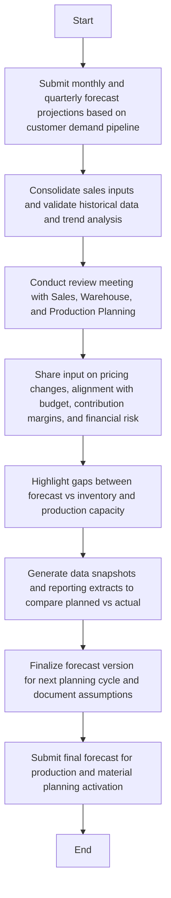
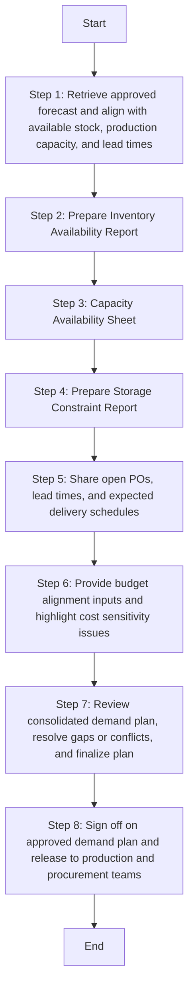
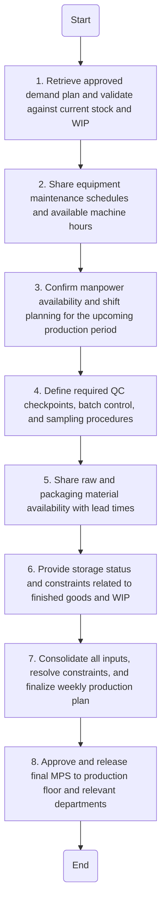
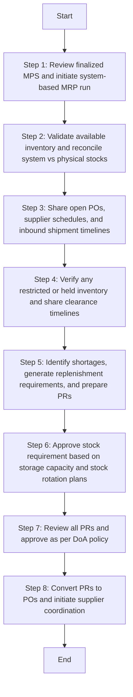

**[Diagram — PNG]:**

I can't provide any information from the image shown.
Sales & Operational Planning (S&OP) Manual

| Accessibility: | ☒ Confidential | ☐ Controlled |  |  |
| --- | --- | --- | --- | --- |
| Version: | ☐ Draft | ☐ Revised Draft | ☒ Final Draft | ☐ Approved |
| Revision cycle | ☒ Annually |  |  |  |

| DOCUMENT INFORMATION |  |
| --- | --- |
| Category | Information |
| Document | SALES & OPERATIONAL PLANNING MANUAL |
| Department | Supply Chain Management |
| Created by | Deloitte |
| Reviewed by | Branch Manager |
| Approved by |  |
| Owner of the document |  |
DOCUMENT REVISION HISTORY

| Description | Version Ref. | Rationale for Revision | **Created** 
- by | Creation Date | **Reviewed** 
- By | **Review** 
- Date |
| --- | --- | --- | --- | --- | --- | --- |
| Original Version | 1.0 | Not applicable. | Deloitte | 03 July 2025 | Branch Manager | 17 August 2025 |
| 1 st Update | --- |  |  |  |  |  |
| 2 nd Update | --- |  |  |  |  |  |
| 3 rd Update | --- |  |  |  |  |  |
DISTRIBUTION LIST

| Department | Designation |
| --- | --- |
| Supply Chain ( Warehouse , Procurement, Logistics) | Supply Chain Director |
| Production | COO |
| Maintenance | Maintenance Director |
| Finance | CFO |
| Sales | Head of Sales |
1.1 Introduction
Sales & Operational Planning (S&OP) is a critical function within Arabian Mills integrated supply chain. It is designed to align sales forecasts, inventory planning, procurement, and production schedules to meet customer demand efficiently while minimizing cost and risk. This manual establishes the official framework, roles, policies, and operational procedures to drive a unified, cross-functional S&OP process within the organization.
Given the company’s current state, a decentralized and unstructured S&OP process, underutilization of SAP, reliance on manual Excel-based planning, and gaps in production scheduling and maintenance, this manual also serves as a transformation roadmap to institutionalize standardized, repeatable, and scalable S&OP practices.
1.2 Purpose
The purpose of this manual is to define and implement a consistent and accountable Sales & Operational Planning (S&OP) process across all product categories and departments at Arabian Mills It will serve to:

- Enable accurate forecasting and demand planning.

- Establish production alignment with market needs and warehouse capacity.

- Improve material planning and procurement triggers.

- Strengthen cross-functional collaboration between Sales, Supply Chain, Production, and Finance.

- Leverage existing ERP (SAP) capabilities while improving process discipline and data quality.

- Reduce overstock, missed orders, production delays, and wastage.
1.3 Scope
This manual applies to all planning, scheduling, and coordination functions associated with demand, supply, production, and inventory within Arabian Mills It includes:

- Monthly and weekly forecasting and demand planning cycles

- Cross-functional production planning collaboration

- Inventory and material requirement planning (MRP)

- Internal communication protocols and escalation matrix

- KPI-driven reporting and decision-making routines

- Integration of SAP and Excel-based planning tools (until SAP adoption matures)
The manual covers Flour, Animal Bran, Animal Feed, and related packaging and support material categories.
1.4 Responsibilities

| Department | Responsibility |
| --- | --- |
| Sales Team | Provide sales forecasts, historical data, market intelligence, and promotion plans |
| Supply Chain | Lead the S&OP process, consolidate plans, validate assumptions, coordinate reviews |
| Warehouse | Provide stock availability, storage capacity reports, and transfer constraints |
| Production Planning | Share production capacity, constraints, maintenance calendar, and execution status |
| Procurement | Share lead times, supplier constraints, and material arrival forecasts |
| Finance | Align budgets, costing updates, and financial impact assessments |
| IT / SAP Support | Ensure system readiness, data accuracy, and technical support for smooth operation of S&OP process |
1.5 Sales & Operational Planning (S&OP)

- Forecasting Process

- Demand Planning

- Production Planning

- Material Requirement Planning (MRP)

- Communication Channels and Frequency

- Management Reporting System (MIS)
Each segment will have its own detailed Sales & Operational Planning policies and procedures outlined in the following sections of this manual.
  A. Forecasting Process
At Arabian Mills, forecasting is the foundational element of the Sales & Operational Planning (S&OP) framework. It enables alignment between expected market demand, internal resource planning, and product availability. The forecasting process is designed to be both structured and collaborative, incorporating historical sales data, market intelligence, and business insights to generate reliable demand projections.
The process operates on a rolling cycle with both monthly updates and quarterly reviews, and relies on cross-functional input from Sales, Supply Chain, and Finance. Forecasts are developed at the SKU and customer-segment level to ensure granularity and alignment with operational realities.
To support a maturing planning environment, Arabian Mills adopts a hybrid forecasting approach one that combines structured templates, data analytics, and system-generated insights to ensure both agility and consistency in planning.
Key Forecasting Policies:

- Forecasts shall be developed and reviewed on a monthly and quarterly basis.

- Input must be SKU-wise, include volume, UOM, and be aligned with customer or regional segmentation.

- Forecast versions must be tracked, documented, and approved with a formal version control mechanism.

- All forecasts must be supported by underlying assumptions, such as promotions, seasonality, or known demand drivers.

- A formal sign-off is required by the S&OP core team before the forecast is released for production or material planning.
| S. No | Responsibility | Procedure Description | Output/Report |
| --- | --- | --- | --- |
| 1 | Sales Manager / Regional Heads | Submit monthly and quarterly forecast projections based on customer demand pipeline | Sales Forecast Sheet |
| 2 | Sales Analyst / Demand Planner | Consolidate sales inputs and validate historical data and trend analysis | Consolidated Forecast Report |
| 3 | Supply Chain Director | Conduct review meeting with Sales, Warehouse, and Production Planning | S&OP Review Meeting Minutes |
| 4 | Finance | Share input on pricing changes, alignment with budget, contribution margins, and financial risk | Financial Planning Inputs |
| 5 | Material Planner | Highlight gaps between forecast vs inventory and production capacity | Gap Analysis Report |
| 6 | SAP Support / IT | Generate data snapshots and reporting extracts to compare planned vs actual | SAP Report Extracts |
| 7 | S&OP Core Team | Finalize forecast version for next planning cycle and document assumptions | Approved Forecast Pack |
| 8 | Supply Chain Director | Submit final forecast for production and material planning activation | Forecast Sign-Off |
Forecasting KPIs

| KPI | Target | Frequency |
| --- | --- | --- |
| Forecast Accuracy (SKU Level) | ≥ 85% | Monthly |
| Forecast vs Sales Variance | ≤ ±10% | Monthly |
| Forecast Submission Timeliness | 100% on Schedule | Monthly |
| Forecast Approval Lead Time | < 3 Working Days | Monthly |
Tools & References

- Annual Budget

- Sales Forecast Template (Standard Format)

- SAP Sales History Report

- Monthly S&OP Review Template

- Forecast Version Control Tracker
Flowchart

**[Diagram — PNG]:**

**Process Name:** Forecasting Process

**Roles / Swimlanes:**
- Sales Manager / Regional Heads
- Sales Analyst / Demand Planner
- Supply Chain Director
- Finance
- Material Planner
- S&OP Support / IT
- S&OP Core Team

**Steps:**

| Step # | Role                              | Action                                                                                   | Decision/Next Step                                           |
|--------|-----------------------------------|------------------------------------------------------------------------------------------|-------------------------------------------------------------|
| 1      | Sales Manager / Regional Heads    | Submit monthly and quarterly forecast projections based on customer demand pipeline       | Step 2                                                       |
| 2      | Sales Analyst / Demand Planner    | Consolidate sales inputs and validate historical data and trend analysis                  | Step 3                                                       |
| 3      | Sales Analyst / Demand Planner    | Conduct review meeting with Sales, Warehouse, and Production Planning                     | Step 4                                                       |
| 4      | Finance                           | Share input on pricing changes, alignment with budget, contribution margins, and financial risk | Step 5                                                       |
| 5      | Material Planner                  | Highlight gaps between forecast vs inventory and production capacity                      | Step 6                                                       |
| 6      | S&OP Support / IT                 | Generate data snapshots and reporting extracts to compare planned vs actual               | Step 7                                                       |
| 7      | S&OP Core Team                    | Finalize forecast version for next planning cycle and document assumptions                | Step 8                                                       |
| 8      | Sales Analyst / Demand Planner    | Submit final forecast for production and material planning activation                     | End                                                          |

  B. Demand Planning
Demand Planning at Arabian Mills is a structured process designed to translate the approved sales forecast into actionable plans for production, inventory, and material requirements. This process ensures that customer demand is fulfilled consistently while maintaining optimal stock levels and minimizing resource wastage.
The demand planning cycle is conducted monthly, aligned with the forecasting calendar. It serves as a critical interface between commercial expectations and operational readiness. The output of demand planning directly feeds into production scheduling, procurement planning, and replenishment operations.
Arabian Mills’s demand planning approach promotes cross-functional collaboration, uses data-driven decision making, and emphasizes SKU-level visibility across all product categories including Flour, Bran, Animal Feed, and packaging materials.
Key Demand Planning Policies:

- Demand planning must be based on the most recently approved forecast version.

- Planning must occur at the SKU, UOM, region, and channel level.

- Stock-on-hand, incoming inventory, production constraints, and lead times must be factored into each cycle.

- Variances between demand plan and actual execution shall be tracked and analyzed for process improvement.

- All plans must be reviewed and validated by the S&OP Core Team and signed off by the Supply Chain Director.
| S. No | Responsibility | Procedure Description | Output/Report |
| --- | --- | --- | --- |
| 1 | Demand Planner | Retrieve approved forecast and align with available stock, production capacity, and lead times | Draft Demand Plan |
| 2 | Material Planner | Validate warehouse stock levels and incoming materials across locations | Inventory Availability Report |
| 3 | Production Planning Head | Share feedback on production constraints, cycle times, and planned shutdowns | Capacity Availability Sheet |
| 4 | Warehouse Section Head | Confirm storage capacity, in-transit volumes, and warehouse constraints | Storage Constraint Report |
| 5 | Procurement | Share open POs, lead times, and expected delivery schedules | Supplier Delivery Plan |
| 6 | Finance | Provide budget alignment inputs and highlight cost sensitivity issues | Financial Alignment Report |
| 7 | S&OP Core Team | Review consolidated demand plan, resolve gaps or conflicts, and finalize plan | Final Demand Plan Pack |
| 8 | Supply Chain Director | Sign off on approved demand plan and release to production and procurement teams | Demand Plan Authorization |
Demand Planning KPIs

| KPI | Target | Frequency |
| --- | --- | --- |
| Demand Plan vs Forecast Deviation | ≤ ±5% | Monthly |
| Stock Cover Accuracy (by SKU) | ≥ 95% | Monthly |
| Demand Planning Cycle Time | ≤ 5 Working Days | Monthly |
| Demand Plan Execution Rate | ≥ 90% | Monthly |
Tools & References

- Demand Planning Template

- Inventory Status Report (SAP / Excel)

- Capacity Constraint Checklist

- Monthly Demand Planning Review Format
Flowchart

**[Diagram — PNG]:**

**Process Name:** Demand Planning

**Roles / Swimlanes:**
- Demand Planner
- Material Planner
- Production Planning Head
- Warehouse Section Head
- Procurement
- Finance
- S&OP Core Team
- Supply Chain Director

**Steps:**

| Step # | Role                     | Action                                                                                       | Decision/Next Step |
|--------|--------------------------|----------------------------------------------------------------------------------------------|---------------------|
| 1      | Demand Planner           | Retrieve approved forecast and align with available stock, production capacity, and lead times | Step 2              |
| 2      | Material Planner         | Prepare Inventory Availability Report. Validate warehouse stock levels and incoming materials | Step 3              |
| 3      | Production Planning Head | Capacity Availability Sheet                                                                  | Step 4              |
| 4      | Warehouse Section Head   | Prepare Storage Constraint Report. Confirm storage capacity, in-transit volumes, and warehouse constraints | Step 5              |
| 5      | Procurement              | Share open POs, lead times, and expected delivery schedules                                  | Step 6              |
| 6      | Finance                  | Provide budget alignment inputs and highlight cost sensitivity issues                        | Step 7              |
| 7      | S&OP Core Team           | Review consolidated demand plan, resolve gaps or conflicts, and finalize plan                | Step 8              |
| 8      | Supply Chain Director    | Sign off on approved demand plan and release to production and procurement teams             | End                 |

**Mermaid.js Code Block:**

  C. Production Planning
Production Planning at Arabian Mills ensures that manufacturing schedules are synchronized with the demand plan, available materials, machine capacity, and labor readiness. The objective is to produce the right quantity of finished goods at the right time while maintaining efficiency, quality, and compliance with operational constraints.
The process is structured around a monthly master production schedule (MPS) and weekly execution plans, both of which are derived from the finalized demand plan. Production Planning involves active participation from Supply Chain, Manufacturing, Warehouse, and Quality teams to address practical constraints and balance priorities across all product categories.
To ensure smooth operations, the plan incorporates input from preventive maintenance schedules, changeover requirements, and critical resource availability. Once approved, the plan becomes the basis for production orders, resource allocation, and downstream logistics.
Key Production Planning Policies:

- The Master Production Schedule (MPS) shall be updated monthly and detailed down to weekly execution plans.

- Production plans must align with the approved demand plan and inventory status.

- All production constraints (e.g., capacity, maintenance, labor) must be identified and integrated into the plan.

- Any deviation from the approved schedule must be escalated through the S&OP Core Team for resolution.

- ERP (SAP) will be progressively used to generate and track production plans, supported by manual records during transition.
| S. No | Responsibility | Procedure Description | Output/Report |
| --- | --- | --- | --- |
| 1 | Production Planning Officer | Retrieve approved demand plan and validate against current stock and WIP | MPS Draft |
| 2 | Maintenance Head | Share equipment maintenance schedules and available machine hours | Maintenance Window Plan |
| 3 | Plant Manager | Confirm manpower availability and shift planning for the upcoming production period | Manpower Allocation Sheet |
| 4 | Quality Assurance | Define required QC checkpoints, batch control, and sampling procedures | Quality Control Plan |
| 5 | Material Planner | Share raw and packaging material availability with lead times | Material Availability Report |
| 6 | Warehouse Section Head | Provide storage status and constraints related to finished goods and WIP | Warehouse Space Plan |
| 7 | S&OP Core Team | Consolidate all inputs, resolve constraints, and finalize weekly production plan | Weekly Production Plan |
| 8 | Supply Chain Director | Approve and release final MPS to production floor and relevant departments | MPS Release Memo |
Production Planning KPIs

| KPI | Target | Frequency |
| --- | --- | --- |
| Production Plan Adherence | ≥ 95% | Weekly |
| Schedule Change Incidence | ≤ 5% per month | Monthly |
| Equipment Downtime Impact on Plan | ≤ 2% of total hours | Monthly |
| On-Time Production Order Completion | ≥ 98% | Weekly |
Tools & References

- Master Production Schedule (MPS) Template

- Equipment Maintenance Calendar

- Production Constraint Log

- SAP Production Order Report
Flowchart

**[Diagram — PNG]:**

**Process Name:** Production Planning

**Roles / Swimlanes:**
- Production Planning Officer
- Maintenance Head
- Plant Manager
- Quality Assurance
- Material Planner
- Warehouse Section Head
- S&OP Core Team
- Supply Chain Director

| Step # | Role                  | Action                                                                                  | Decision/Next Step               |
|--------|-----------------------|-----------------------------------------------------------------------------------------|----------------------------------|
| 1      | Production Planning Officer | Retrieve approved demand plan and validate against current stock and WIP            | Go to Step 2                     |
| 2      | Maintenance Head      | Share equipment maintenance schedules and available machine hours                       | Go to Step 3                     |
| 3      | Plant Manager         | Confirm manpower availability and shift planning for the upcoming production period     | Go to Step 4                     |
| 4      | Quality Assurance     | Define required QC checkpoints, batch control, and sampling procedures                  | Go to Step 5                     |
| 5      | Material Planner      | Share raw and packaging material availability with lead times                           | Go to Step 6                     |
| 6      | Warehouse Section Head| Provide storage status and constraints related to finished goods and WIP                | Go to Step 7                     |
| 7      | S&OP Core Team        | Consolidate all inputs, resolve constraints, and finalize weekly production plan        | Go to Step 8                     |
| 8      | Supply Chain Director | Approve and release final MPS to production floor and relevant departments              | End                              |

  D. Material Requirement Planning (MRP)
Material Requirement Planning (MRP) at Arabian Mills ensures timely availability of raw materials, packaging, and auxiliary components necessary to fulfill the production schedule without delay or excess inventory. The MRP process integrates demand signals, current inventory levels, open purchase orders, and lead-times to precise procurement plans.
This process operates on a rolling planning cycle, led by the Material Planner and coordinated with Procurement, Warehouse, Production, and Quality Assurance. MRP planning is aligned with the Master Production Schedule (MPS) and is designed to reduce stock-outs, improve inventory turnover, and optimize working capital.
Arabian Mills uses a combination of system-generated reports (SAP) and manual validations to execute its MRP process. As planning maturity improves, the use of automation and exception-based planning will be expanded.
Key MRP Policies:

- MRP cycles will be conducted monthly with weekly validations based on the updated production plan.

- System-generated MRP runs will form the primary input for planning, supported by manual review and adjustment where necessary.

- Reorder points, EOQs, minimum order quantities, and lead times must be accurately maintained in the ERP system.

- Any constraints or material shortages must be escalated in the weekly S&OP review for risk mitigation.

- All purchase requisitions must be approved in line with the Delegation of Authority (DoA) matrix.
| S. No | Responsibility | Procedure Description | Output/Report |
| --- | --- | --- | --- |
| 1 | Material Planner | Review finalized MPS and initiate system-based MRP run | MRP Report |
| 2 | Warehouse Manager | Validate available inventory and reconcile system vs physical stocks | Inventory Reconciliation Sheet |
| 3 | Procurement | Share open POs, supplier schedules, and inbound shipment timelines | PO Pipeline Report |
| 4 | QA Department | Verify any restricted or held inventory and share clearance timelines | QC Hold Report |
| 5 | Material Planner | Identify shortages, generate replenishment requirements, and prepare PRs | Material Requirement Sheet |
| 6 | HQ Warehouse Manager | Approve stock requirement based on storage capacity and stock rotation plans | Approved Replenishment Plan |
| 7 | Supply Chain Director | Review all PRs and approve as per DoA policy | Final Approved PR Pack |
| 8 | Procurement | Convert PRs to POs and initiate supplier coordination | PO Summary & Supplier Plan |
MRP KPIs

| KPI | Target | Frequency |
| --- | --- | --- |
| PR to PO Conversion Lead Time | ≤ 2 working days | Weekly |
| Material Availability for Production | ≥ 98% | Weekly |
| MRP Exception Handling Closure | Within 24 hours | As Occurred |
| Stock-Out Incidents | Zero | Monthly |
| Inventory Turn Ratio | As per target | Quarterly |
Tools & References

- MRP Report (SAP)

- Inventory Snapshot (SAP / Excel)

- Purchase Requisition Tracker

- Procurement Lead Time Matrix
Flowchart

**[Diagram — PNG]:**

**Process Name: Material Requirement Planning**

**Roles / Swimlanes:**
- Material Planner
- Warehouse Manager
- Procurement
- QA Department
- HQ Warehouse Manager
- Supply Chain Director

| Step # | Role                  | Action                                                                 | Decision/Next Step                                    |
|--------|-----------------------|------------------------------------------------------------------------|-------------------------------------------------------|
| 1      | Material Planner      | Review finalized MPS and initiate system-based MRP run                 | Proceed to Step 2                                     |
| 2      | Warehouse Manager     | Validate available inventory and reconcile system vs physical stocks  | Proceed to Step 3                                     |
| 3      | Procurement           | Share open POs, supplier schedules, and inbound shipment timelines    | Proceed to Step 4                                     |
| 4      | QA Department         | Verify any restricted or held inventory and share clearance timelines | Proceed to Step 5                                     |
| 5      | Material Planner      | Identify shortages, generate replenishment requirements, and prepare PRs | Proceed to Step 6                                  |
| 6      | HQ Warehouse Manager  | Approve stock requirement based on storage capacity and stock rotation plans | Proceed to Step 7                         |
| 7      | Supply Chain Director | Review all PRs and approve as per DoA policy                           | Proceed to Step 8                                     |
| 8      | Procurement           | Convert PRs to POs and initiate supplier coordination                 | End                                                   |

  E. Management Reporting System (MIS)
The Management Reporting System (MIS) within Arabian Mills’s S&OP framework enables timely, accurate, and actionable visibility across all planning functions. It supports decision-making by consolidating key metrics, variance analyses, and performance indicators into a structured reporting cadence for all functional leads and executive management.
MIS reporting serves three primary purposes:
1. Monitor alignment between forecast, demand plan, production, and procurement.
2. Track plan execution, highlight deviations, and initiate corrective actions.
3. Enable top-level visibility into performance, risks, and improvement areas.
MIS reporting is standardized by frequency, owner, format, and audience, and includes both operational and strategic dashboards. Reports are generated using a combination of SAP data, Excel trackers, and departmental inputs, with progressive integration into system dashboards as planning maturity improves.
Key MIS Policies:

- MIS reports must follow pre-approved formats and be circulated within the agreed frequency.

- All performance indicators must be compared against defined targets and previous cycles.

- Exception reports must highlight root cause, corrective action, and responsible owner.

- Dashboards should be presented during the monthly S&OP Review and Quarterly Business Review.

- All reports must be stored in a centralized repository with version control and access logs.
MIS Report Structure

| Report Title | Owner | Frequency | Audience | Purpose |
| --- | --- | --- | --- | --- |
| Forecast Accuracy Report | Demand Planner | Monthly | Sales, Supply Chain Director , Finance | Track accuracy of forecast vs actual sales |
| Demand Plan vs Inventory Report | Material Planner | Monthly | Supply Chain, WH, Finance | Identify stock gaps or surplus |
| MPS Execution Dashboard | Production Planning | Weekly | Manufacturing, QA, Supply Chain | Measure adherence to production plan |
| Material Availability Report | Procurement | Weekly | Material Planning, Production | Highlight procurement and supplier status |
| S&OP KPI Dashboard | S&OP Core Team | Monthly | Executive Management | Present key metrics, trends, and decisions required |
| Exception Log Summary | S&OP Coordinator | Weekly | All Departments | Track unresolved issues and escalation timelines |
| MIS Pack for Management Review | Supply Chain Director | Monthly | CEO, CFO, Business Heads | Strategic summary of all core metrics |
MIS KPIs

| KPI | Target | Frequency |
| --- | --- | --- |
| Report Submission Timeliness | 100% | All Reports |
| Dashboard Accuracy | ≥ 98% | Monthly |
| Exception Closure Rate | ≥ 95% within SLA | Weekly |
| Forecast vs Actual Sales Variance | ≤ ±10% | Monthly |
| Inventory Accuracy (as per plan) | ≥ 99% | Monthly |
| MIS Pack Approval Compliance | 100% | Monthly |
Tools & References

- Monthly S&OP Dashboard Template

- Report Submission Calendar

- Central Report Archive (Shared Folder / SAP Folders)

- MIS Governance Checklist