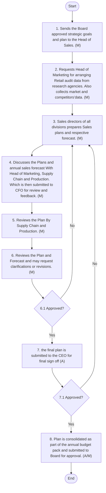
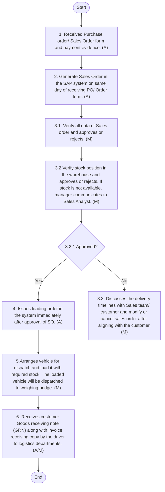
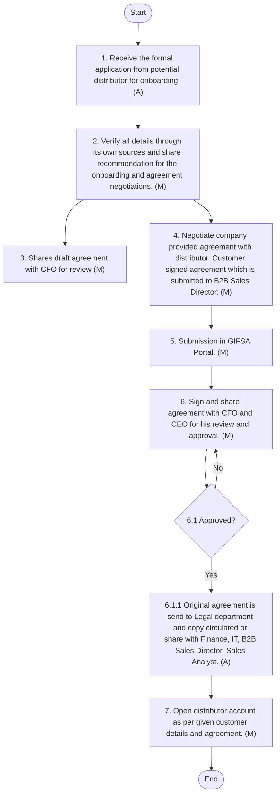

**[Diagram — PNG]:**

A stylized logo consisting of:

- A gold icon of three leaf-like shapes arranged vertically (one on top, two below) forming a plant motif.
- Beneath the icon, green Arabic text: **المطاحن العربية**
- Directly below the Arabic, green English text: **Arabian Mills**
SALES POLICY & PROCEDURE MANUAL

| Accessibility: | ☒ Confidential | ☐ Controlled |  |  |
| --- | --- | --- | --- | --- |
| Version: | ☐ Draft | ☐ Revised Draft | ☒ Final Draft | ☐ Approved |
| Revision cycle | ☒ Annually |  |  |  |
DOCUMENT INFORMATION

| Category | Information |
| --- | --- |
| Document | Sale Policy & Procedure Manual |
| Department | Sales |
| Created by | Deloitte |
| Reviewed by | B2B Director ; B2C Director |
| Approved by |  |
| Owner of the document | HOD Sales |
DOCUMENT REVISION HISTORY

| Description | Version Ref. | Rationale for Revision | **Created**<br>
- by | Creat ion date | **Reviewed**<br>
- by | **Review**<br>
- date |
| --- | --- | --- | --- | --- | --- | --- |
| Original Version | 1.0 | New Document | Deloitte | 06 July 2025 | **B2B Director;**<br>
- B2C Director | 05 October 2025 |
| 1 st Update | --- |  |  |  |  |  |
| 2 nd Update | --- |  |  |  |  |  |
| 3 rd Update | --- |  |  |  |  |  |
| 4 th Update | --- |  |  |  |  |  |
| 5 th Update | --- |  |  |  |  |  |
DISTRIBUTION LIST

| Department | Designation |
| --- | --- |
| Sales | HOD Sales |
| Marketing | HOD Marketing |
| Supply C hain | Supply Chain Director |
| Finance | CFO |

Arabian Mills for Food Products Company (the “Company” or “Arabian Mills”) is a Saudi Closed Joint Stock Company registered in Riyadh, Kingdom of Saudi Arabia under commercial registration numbered 1010465464 dated 10 Safar 1438H (corresponding to 10 November 2016). The Company’s licensed activities include Packing and grinding wheat, packing and grinding grits, semolina, and bulgur, manufacture of concentrated feed for animals, manufacture of livestock feed, wholesale of bakery products, trade of specialty and healthy foods, land transportation of goods, storage in ports and customs or free zones, and integrated office administrative services activities.
On 6 Jumada Al-Ula 1445H (corresponding to 20 November 2023), the shareholders of the Company resolved to change the name of the Company to Arabian Mills for Food Products Company
The Company sells products under following brands:

- Finah: Various types of flour including Chapati Flour, Pizza Flour, Patent Flour, Superior Flour, Whole Wheat Flour, and Vitamin D – All Purpose Flour.

- Kamil: A range of animal feeds including Broiler Starter Feed, Pigeon Feed, Cobb Breeder Feeds, Layer Feeds, Livestock Feeds, Horse Feed, Rabbit Feed, and Experimental Animal Feed.

- Master Mills: Various types of products including Premium Flour, Pasta, Semolina, Cake Mixes, Gluten Free products, Durum Wheat Harees and Jareesh, and Oats.
The Sales Policy and Procedure Manual provides clear guidelines for the sales department operations of Arabian Mills. It ensures consistency and standardization of procedures by following industry best practices. The manual outlines policies, procedures, and responsibilities related to sales activities and initiatives, promoting transparency and accountability. By adhering to this manual, Arabian Mills aims to implement clear role and responsibilities for enhanced operational efficiency and improved interdepartmental coordination.

The purpose of this Sales Policy and Procedure Manual (the “Manual”) is to document the Company's sales policies and procedures, ensuring implementation of industry best practices. The manual serves to achieve the following objectives:

- Standardisation of Process:
By establishing standardised practices and guidelines, the manual aims to promote consistency across the organization.

- Clear Accountability:
Each section of the manual precisely defines the roles and responsibilities of all personnel engaged in various processes and procedures. This ensures clear accountability, fosters a culture of compliance, and minimise potential risks. Further, it promotes improved interdepartmental collaboration and communication to optimized operations.

- Decision Making:
The manual serves as an indispensable reference for the Company's Management. It assists in making informed decisions, ensuring adherence to industry best practices, and reinforcing a robust internal control environment.

- Achieving the Company’s Strategic Objectives:
This manual ensures that all marketing activities of the Company are in line with the Company’s strategic objectives.

- Training and Development:
The manual act as a comprehensive training tool for new employees, helping them understand the Company’s marketing policies and procedures. It also serves as a reference guide for existing staff, ensuring they follow the correct procedures.

- Risk Management:
Identifies and mitigates business risks through well-defined procedures. Ensures that potential issues are addressed promptly and effectively, safeguarding the Company’s and brands perception.

- Continuous Improvement:
The manual is a living document, subject to periodic reviews and updates to adapt to changing business needs, industry trends, and regulatory requirements. It emphasises continuous improvement to enhance the effectiveness of sales operations.

This manual applies to the following departments:

- Sales Department,

- Marketing Department,

- Supply chain and

- Finance Department
The Manual shall be reviewed on an annual basis or as needed, to update it in line with the newly applicable standards and interpretations.

Following key symbols are used in the process maps in this manual:

| Figure | Explanation | Figure | Explanation |
| --- | --- | --- | --- |
|  | This symbol represents a decision. Decisions are typically phrased as yes/ no questions. This symbol usually precedes a yes / no path |  | This symbol represents input to a process. Inputs are typically information, materials or outputs from a different process |
|  | Used to display the beginning and end of a process. |  | This symbol represents a process or an activity and its usually automated process. |
|  | This symbol represents information output such as a report or document. |  | This symbol represents a set of activities that have already been defined as a process separately |
|  | This symbol represents archiving. |  | This symbol represents a link to another page with certain relevance |
|  | Legend (M) in each symbol represents nature of the control that is “Manual” should be in place for this process |  | Legend (A) in each symbol represents nature of the control that is “Automated” should be in place for this process |
|  | Legend (A/M) in each symbol represents nature of the control that is “Semi-Automated” should be in place for this process |  |  |
A procedure changes inputs into outputs, using resources and according to defined rules:

**[Diagram — EMF→PNG]:**

Diagram description:

- In the center of the diagram, there is a vertical rectangular box labeled:
  - `Activity`

- From the left side of the rectangle, a horizontal arrow points into the rectangle.  
  Next to this arrow, on the left side of the diagram, there is the heading:
  - `Inputs`
  
  Under this left-side "Inputs" heading, there are two bullet points:
  - `- Ideas or Concepts`
  - `- Data or Information`

- From the right side of the rectangle, a horizontal arrow points out of the rectangle toward the right.  
  Next to this arrow, on the right side of the diagram, there is the heading:
  - `Outputs`
  
  Under this right-side "Outputs" heading, there are four bullet points:
  - `- Product`
  - `- Services`
  - `- Information`
  - `- Decisions`

- Above the central rectangle, there is a downward-pointing vertical arrow leading into the top of the rectangle.  
  Above this arrow is the heading:
  - `Inputs`

- Below the central rectangle, there is a downward-pointing vertical arrow leading out of the bottom of the rectangle.  
  Below this arrow is the heading:
  - `Outputs`

# Sales Policy & Procedures
## Organization Chart

**[Diagram — PNG]:**

Organizational Structure – Sales

- Head of Sales  
  - Sales Analyst  
  - B2C Director  
  - B2C Director  
  - Sales Analyst  
  - Feed Sales Department Director  
  - Customer Service Director  
  - Regional Sales Manager (Central)  
    - KAM (MT)  
      - Sales Rep Riyadh  
      - Sales Rep Riyadh  
      - Sales Rep Riyadh  
      - Sales Rep Riyadh  
      - Sales Rep Riyadh  
      - Sales Rep Qassim  
    - Sales Supervisor (WS)  
      - Sales Rep Riyadh  
      - Sales Rep Riyadh  
      - Sales Rep Riyadh  
      - Sales Rep (WS/Discounter)  
      - Sales Rep Qassim  
  - Sales Supervisor (North)  
    - Sales Rep Tabuk  
    - Sales Rep Al Jouf  
    - Sales Rep Hail  
  - Regional Sales Manager (West & South)  
    - KAM (MT)  
      - Sales Rep Jazan  
      - Sales Rep Jeddah  
      - Sales Rep Jeddah  
      - Sales Rep Makkah-Taif  
    - Sales Supervisor (WS)  
      - Sales Rep Jeddah  
      - Sales Rep Makkah-Taif  
      - Sales Rep Jazan  
    - Sales Rep Madinah  
  - Regional Sales Manager (East)  
    - Sales Rep Al Ahsa  
    - Sales Rep Dammam (MT)  
    - Sales Rep Dammam (MT)  
    - Sales Rep Dammam (WS)  
  - Trade Marketing Manager  
    - Merchandising Supervisor  
  - Business Development Manager  
    - National Distributor  

Legend:

- Employed  
- Current Vacancy  
- Outsourced  
- Indirect reporting  
- Future Vacancy / Promotion  

Abbreviations:

- MT – Modern Trade  
- WS – Wholesales

#### Policy Statement
Sales planning and forecasting are pivotal functions of the Sales Department, directly influencing the Company's revenue targets. These activities shall be derived from the overarching business strategy and annual goals.
The policy shall ensure a structured and data-driven approach by incorporating cross-functional insights, particularly from the Marketing department, and by establishing alignment with Senior Management before final approvals.

- The CEO shall share strategic goals and plans with the Board of Directors by September of the ongoing fiscal year to guide the planning cycle for the next fiscal year.

- Once approved by the Board, the Sales Department shall prepare the annual sales plan and forecast accordingly.

- The forecasting shall be prepared considering market and category insights, including Retail audit data, to assess market trends, customer behaviour, avenues of growth, and potential gaps.

- The finalised sales forecast and annual plans shall be approved by Senior Management before the start of the fiscal year.

- New Products/Brands sales plans and forecasts shall be developed and shared separately from those of existing brands.

- The Company shall also focus primarily on volumetric growth, along with value growth.

- The sales forecasting process shall be performed using technology to the maximum extent possible. The Sales Promotional Calendar shall also be aligned with the Annual Marketing and Trade Marketing plans where applicable.

- Department and individual KPIs shall be developed using the SMART framework (i.e., Specific, Measurable, Achievable, Relevant, and Time-bound) to ensure effective performance management.

- In the first week of every quarter, a Management Committee Meeting (MCM), comprising all Department Heads and the CEO, shall be convened to review the previous quarter’s activities and share upcoming quarter plans of all departments, especially Sales, Marketing, and Supply Chain, to ensure organization-wide collaboration and alignment.
#### Procedure
The following procedures shall be followed to prepare the Annual Sales Plan and Forecast:

| S No. | Procedure description | Responsibility | Frequency |
| --- | --- | --- | --- |
| 1 | **Receive Strategic Goals from Board/Management:**<br>
- The Head of Sales receives the Board - approved strategic goals and plan s (one, three and five years) from the Company Secretary via email by September of the current fiscal year. | Preparer: Senior Management | Frequency: Yearly |
| 2 | **Acquire market and competitor Data :**<br>
- The Head of Sales request s Head of M arketing to arrange the Retail audit data and other relevant category data (where applicable) from research agencies to understand market dynamics , gaps and growth prospects .<br>
- In parallel, Head of S ales and Sales D irectors collect market and competitors’ data through own market intelligence and historical data of the company<br>
- All data and reports are discussed internally by end of September .<br>
- Note: Sales team s and Marke ting teams conduct rigorous formal and informal meeting s to discuss data and develop basis for annual objectives and forecast. | **Preparer: 3 rd Party A gency**<br>
- Reviewers:<br>
- Head of Sales and Head of Marketing | Frequency: Yearly |
| 3 | **Preparation of Annual Sales Plans and Forecast :**<br>
- Upon receiving the business goals and market data , Sales directors of all d i visions prepare Sales P lan s and respective forecast in Ms Excel by early October. The forecast is supported by category data and market growth dynamics. The Sales Plan s must include at least following :<br>
- Review of current scenario and expected closing of the f iscal Year .<br>
- Comprehensive competitor analysis in each product category and SWOT analysis.<br>
- Share insights , gaps and growth opportunities from Market data.<br>
- Go to market strategy : Channels , New channels , G eography are to be focused.<br>
- Current and recommended Sales D epartment structure including head counts and expected budget .<br>
- Annual Sales Forecast include s :<br>
- Current brand product category - wise volume forecast with monthly and quarterly breakdown.<br>
- All forecasts need to be National, Regional , Area wise which is further bifurcated into Channels such as Key Accounts, Wholesale , Retail/Baqala etc as applicable .<br>
- Mention key Seasonal promotional activities, campaigns periods with expected volumes by developing Sales Promotional Cal endar. | **Preparer: All Sales Directors**<br>
- Reviewer: Head of Sales | Frequency: Annually |
| 4 |
- Review with Marketing team .<br>
- The Head of Sales and Head of Marketing discuss the p lans and annual sales forecast to ensure alignment between marketing initiatives and sales targets.<br>
- The team s conduct the review through a formal meeting and resolves any inconsistencies collaboratively.<br>
- The responsible team submits the plan to the CFO , Supply chain and Production by early October via email for review and feedback after alignment. | Reviewers: Head of Marketing and Head of Sales | Frequency: Annually |
| 5 | **Review with Supply Chain and Production**<br>
- Head of Sales and Sale Directors reviews forecast along with Supply chain and Production for production capacity alignments . Repeat Procedure 3 and 4 if amendments required . | Reviewers: Production Head and Supply Chain Director |  |
| 6 | **Submission to Finance and CEO**<br>
- The CFO reviews the p lan and f orecast and may request clarifications or revisions. Upon CFO approval, the final plan is submitted to the CEO for sign - off no later than early November.<br>
- Once CEO approves the plan and forecast , it is consolidated as part of the annual budget pack and submitted to Board for approval.<br>
- If the CFO or CEO does not approve the submission, the Head of Sales revises the plan based on the feedback received and procedures 3, 4 and 5 are repeated until final approval is obtained. | **Preparer: Head of Sales**<br>
- Reviewer: CFO<br>
- Approver: CEO | Frequency: Annually |
#### Flow Chart

**[Diagram — Visio-EMF→PNG]:**

**Process Name:** Sales Planning and Forecast  

**Roles / Swimlanes:**
- Senior Management  
- Sales  
- Finance  
- CEO  

---

### Steps and Decisions

| Step # | Role | Action | Decision / Next Step |
|--------|------|--------|----------------------|
| Start | Senior Management | Start | Proceeds to Step 1. |
| 1 | Senior Management | Sends the Board approved strategic goals and plan to the Head of Sales. (M) | Proceeds to Step 2. |
| 2 | Sales | Requests Head of Marketing for arranging Retail audit data from research agencies. Also collects market and competitors’data. (M) | Proceeds to Step 3. |
| 3 | Sales | Sales directors of all divisions prepares Sales plans and respective forecast. (M) | Proceeds to Step 4. Also receives feedback/rework loops when approvals (Steps 6.1 or 7.1) are “No”. |
| 4 | Sales | Discusses the Plans and annual sales forecast With Head of Marketing, Supply Chain and Production. Which is then submitted to CFO for review and feedback. (M) | Proceeds to Step 5. |
| 5 | Sales | Reviews the Plan By Supply Chain and Production. (M) | Proceeds to Step 6. |
| 6 | Finance | Reviews the Plan and Forecast and may request clarifications or revisions. (M) | Proceeds to Decision 6.1 Approved?. |
| 6.1 | Finance | Approved? | **Yes:** Proceeds to Step 7. **No:** Returns to Step 3 for revisions of Sales plans and forecast. |
| 7 | Finance / CEO | 7. the final plan is submitted to the CEO for final sign off (A) | Proceeds to Decision 7.1 Approved?. |
| 7.1 | Finance / CEO | 7.1 Approved? | **Yes:** Proceeds to Step 8. **No:** Returns to Step 3 for revisions of Sales plans and forecast. |
| 8 | CEO | 8. Plan is consolidated as part of the annual budget pack and submitted to Board for approval. (A/M) | Proceeds to End. |
| End | CEO | End | Process terminates. |

---

### Explicit Yes/No Branches

- **Decision 6.1 Approved?**
  - **Yes →** Step 7: “7. the final plan is submitted to the CEO for final sign off (A)”.
  - **No →** Step 3: “3. Sales directors of all divisions prepares Sales plans and respective forecast. (M)”.

- **Decision 7.1 Approved?**
  - **Yes →** Step 8: “8. Plan is consolidated as part of the annual budget pack and submitted to Board for approval. (A/M)”.
  - **No →** Step 3: “3. Sales directors of all divisions prepares Sales plans and respective forecast. (M)”.

---

### Mermaid.js Flow Representation



#### Policy Statement
Arabian Mills shall follow a structured and data driven policy to price setting for all products. Pricing decisions shall be based on cost structures, market dynamics, regulatory guidelines, customer segments, and profitability targets. The Company shall review prices periodically and adjust in response to changes in raw material costs, supply chain expenses, market conditions, or strategic priorities.

- Before setting the price of any product, Sales and Marketing shall work together to evaluate the following:
o Competitors prices.
o Brand value proposition.
o Current brand positioning or future target.

- The Prices shall comply with local regulations and guidelines issued by Government authorities.

- The Finance Department shall provide a benchmark of GM or PL targets for price setting.

- The Company shall consistently communicate recommended sales prices to all trade partners and distributors.

- The CFO and CEO shall review and approve final pricing decisions for all products.

- The Company shall conduct periodic price reviews to evaluate market competitiveness and profitability.
#### Procedure
The following procedures shall be followed during price Setting Process:

| S No. | Procedure description | Responsibility | Frequency |
| --- | --- | --- | --- |
| 1 | **Research Competitors Prices :**<br>
- The Head of Sales re quest s Marketing to provide Retail audit data on competitors’ prices. The B2C Sales Director collects additional data through market intelligence on competitors’ price structures and market prices. The Head of Sales and the B2C Sales Director review all reports. Based on competitors’ price benchmarking and the policy outlined above, the B2C Sales Director develops price structures with expected margins and recommended selling prices. | **Preparer: 3 rd Part agency and B2 C Sales Director**<br>
- Reviewer:<br>
- Head of Sales | Frequency: Quarterl y |
| 2 | **Consensus Building with Marketing :**<br>
- The B2C Sales Director shares the recommended price structure with the Head of Marketing if any changes are needed. A follow-up meeting is arranged with the Head of Marketing, Marketing Manager, and Head of Sales to finalise the price structure. This review is completed within 5 working days of the Sales team submitting the price structure.<br>
- Note: Sales and M arketing teams hold formal and informal meeting s to discuss data and develop the foundation for the r ecommended p rice structure . | **Preparer: B2C Sales Director**<br>
- Reviewers:<br>
- Head of Sales , Head of Marketing and Marketing Manager | Frequency: As Required |
| 3 | **Submission to Finance and CEO**<br>
- After reaching consensus with the Head of Marketing through meetings and emails, the Head of Sales submits the price structure to the CFO for review. If the CFO approves the prices, the Head of Sales submits them to the CEO for final approval within three working days of the CFO’s approval. If the prices are not approved, the Sales team revises the plan by repeating the research and consensus steps. | **Preparer: Head of Sales**<br>
- Reviewer: CFO<br>
- Approver: CEO | Frequency: As Required |
| 4 | **Implementation by IT**<br>
- Once the CEO approves the pricing, the CFO send s an email confirmation to the Head of Sales, B2C Sales Director , and Head of Marketing for record-keeping.<br>
- The CFO also forwards the approved pricing to the IT and Cyber Manager to update the SAP system. | Preparer /Performed by : CFO and IT and Cyber Manager | Frequency: As Required |
| 5 | **Review by Sales**<br>
- After the price update, the IT and Cyber Manager sends a confirmation email to the B2C Sales Director and Sales Analyst/Coordinator to verify and review the updated prices. The entire process is completed within 1 working day of CEO approval. | **Preparer/Performed by: IT and Cyber Manager**<br>
- Reviewer: CFO and Sales Analyst<br>
- Approver : B2C Sales Director |  |

#### Policy Statement
Sales budgets shall be important aspects of financial planning and feasibility. They shall cover promotions across all channels, including any contractual obligations. The budgeting process shall consider all offerings to customers (channel partners) along with the following:

- The Company shall derive all sales budget bases from the Annual Sales Plan and Forecast and shall align them with Marketing and Trade Marketing Plans where applicable.

- Annual sales budgets shall consider contractual obligations with existing customers, expected changes, any new developments, and the annual sales forecast.

- The Company shall develop and share new Products/Brands sales budgets separately from those of existing brands. The sales budgets shall mainly focus on promotions offered to customers/channel partners.

- Sales budgets, and the Promotional Calendar shall be aligned with the Annual Marketing and Trade Marketing plans where applicable.

- Finance shall share reference working based on identified percentage of sales before the start of the sales planning process. This shall serve as a flexible guideline rather than a binding limit.

- The Company shall finalize sales budgets in coordination with Finance and obtain approval as per the Delegation of Authority (DOA).

- The Finance Department shall configure, implement, and control all discounts and promotions within the ERP system. The system shall be designed to prevent unauthorized changes, with only Finance having access rights to modify.

- The Company shall follow a holistic approach to budgets and discounts, focusing on and tracking the total impact of any discounts and promotions to ensure the bottom line is not compromised. Sales, Trade Marketing, and Finance shall have clear visibility of the total impact.
* Note: Detailed process of Promotional discounts is covered under Trade Marketing heading in Marketing manual
#### Procedure
The following procedures shall be followed during Sales Budgeting Process:

| S No. | Procedure description | Responsibility | Frequency |
| --- | --- | --- | --- |
| 1 | **Reference Budget Working :**<br>
- The Head of Sales receives reference working of a tentative percentage of forecasting revenue for the annual sales budget for next fiscal year from CFO or FP&A Manager via email by September of the current fiscal year.<br>
- Note: the reference budget working is based on p ercentage of s ales revenue to be planned for next fiscal year . | Preparer: FP&A Manager | Frequency: Yearly |
| 2 | **Preparation of Annual Sales Budgets and Discounts :**<br>
- Parallel to developing sales plan s and fo r ecasting , all sales divisions prepare Annual s ales budgets and discount plans in Ms Excel by early October.<br>
- These Budgets align with s ale promotional plan calendar and contractual obligations with customer and any further developments are expected in coming fiscal year. | **Preparer: All Sales Directors**<br>
- Reviewer: Head of Sales | Frequency: Annually |
| 3 |
- Review with Marketing team.<br>
- The Head of Sales share s the plan via email to Head of Marketing.<br>
- Head of Sales, Head of Marketing and key members of their respective team discuss and align t he p lans, p romotional c alendar, and budgets before submitting to Finance.<br>
- Consensus building and alignment are completed by Mid-October. | Reviewers: Head of Marketing , Marketing Manager, Trade Marketing Manager, Head of Sales and Director B2C Sales | Frequency: Annually |
| 4 | **Review and Approval**<br>
- After internal review by Finance, the CFO may request clarification on the submitted budget from Sales team.<br>
- Once CFO is satisfied with the submitted budget, the same is shared with C E O for approval by early November .<br>
- If the C E O has any reservation on the submitted budget , it is revised according to procedure, 2 , 3 and 4 until approval is obtained. | **Preparer: Head of Sales**<br>
- Reviewer: CFO<br>
- Approver: CEO | Frequency: Annually |
#### Flow Chart

**[Diagram — Visio-EMF→PNG]:**

**Process Name:** Sales Budgets  

**Roles / Swimlanes:**

- Sales  
- CFO  
- CEO  
- IT Manager  

---

### Steps

| Step # | Role | Action | Decision / Next Step |
|--------|------|--------|----------------------|
| Start | Sales | **Start** | Proceeds to Step 1. |
| 1 | Sales | Receives reference worksheet for the annual sales budget for the next fiscal year from CFO or Financial Planning Analyst (A) | Proceeds to Step 2. |
| 2 | Sales | Parallel to developing sales plan and forecasting, all sales divisions prepares Annual Sales budgets and discount plans(M) | Proceeds to Step 3. |
| 3 | Sales | Shares the plan to Head of Marketing, Head of Sales, Head of Marketing discusses and aligns the Plans, Promotional Calendar, and budgets. (M) | Proceeds to Step 4. |
| 4 | CFO | After internal review by Finance, CFO may request clarification on the submitted budget from Sales team. After this it is shared with CEO for approval. (M) | Proceeds to Decision 4.1. |
| 4.1 | CEO | **Decision:** Approved? | **Yes:** Proceeds to End. **No:** Returns to Step 4 for further review/clarification and resubmission to CEO. |
| End | Sales | **End** | Process concludes. |

**Yes/No Branches from Decision 4.1 Approved?:**

- **Yes → End**
- **No → Step 4 (After internal review by Finance, CFO may request clarification… then shared again with CEO for approval.)**

---

### Mermaid.js Flow

```mermaid
graph TD

    Start((Start))
    S1[1. Receives reference worksheet for the annual<br/>sales budget for the next fiscal year from CFO or<br/>Financial Planning Analyst (A)]
    S2[2. Parallel to developing sales plan and forecasting,<br/>all sales divisions prepares Annual Sales budgets<br/>and discount plans(M)]
    S3[3. Shares the plan to Head of Marketing, Head of Sales,<br/>Head of Marketing discusses and aligns the Plans,<br/>Promotional Calendar, and budgets. (M)]
    C4[4. After internal review by Finance, CFO may request<br/>clarification on the submitted budget from Sales team.<br/>After this it is shared with CEO for approval. (M)]
    D4{4.1 Approved?}
    End((End))

    Start --> S1 --> S2 --> S3 --> C4 --> D4
    D4 -- Yes --> End
    D4 -- No --> C4
```

#### Policy Statements
The sales order process is a critical control point for recognizing revenue at Arabian Mills. The following policies shall apply:

- Sales orders shall be supported by appropriate documentation, such as:
o	A valid customer Purchase Order (PO),
o	A Company-approved Standard Order Form duly signed and stamped by the customer, or
o	A Standard Order Form signed by an authorized Sales team member on behalf of the customer.
These documents shall serve as verifiable evidence for initiating the order and must be retained for audit purposes.

- All Sales Orders shall be entered into the SAP system, regardless of current stock or logistics status. This should ensure data integrity and alignment with inventory and financial records.

- Only designated Sales Admins or Sales Analysts shall be authorized to create or process sales orders within the SAP system. This should ensure system integrity and role-based access control.

- A dedicated team of Sales Coordinators at both Head Office and regional branches shall report to the Sales Analyst and shall be responsible for collecting, verifying, and submitting required sales documents on a timely basis.

- To maintain segregation of duties and internal control:
o The Sales Analyst shall verify documentation and entering sales orders.
o The Supply Chain team shall manage stock availability, verification, and timely dispatches.
o The Finance Department shall verify cash, credit limits, ensuring invoicing accuracy, and recording revenue in the financial system.

- The stock shall be dispatched within 48 hours, or at max up to 72 hours, of recording sales order.
In B2B sales, each sales order form should accompany a written declaration by the distributors stating that the expected quantities shall be delivered to the respective bakeries/customers as per the approved quota.
#### B2C Sales Procedure
The following procedures shall be followed during B2C Sales Process:

| S No. | Procedure description | Responsibility | Frequency |
| --- | --- | --- | --- |
| 1 | **Purchase Order (PO) / Sales Order Form Received from the Customer:**<br>
- The Sales Analyst/Admin receive s p urchase order / s ales o rder form and cash deposit evidence (where applicable) via email from the customer or from Sales team through other medium . | **Preparer: Customer/Sales Team**<br>
- Reviewer: Sales Analyst | Frequency: As required |
| 2 | **Generating Sale Order (SO):**<br>
- The Sales analyst/Admin generate s s ales o rder in the SAP system on same day of receiving PO / Order form .<br>
- Note:<br>
- s ales o rder can be generated in SAP system even when tock is not available, or c redit limit is exhausted. | **Preparer:**<br>
- Sales Analyst .<br>
- Reviewer: Relevant Sales Manager | Frequency: As required |
| 3 | **SAP Credit and Control Check**<br>
- SAP performs an automated control to check credit limit of customer ’s and stock availability. In case of credit limit or required stock is not available then sales order is not approved in SAP for further processing until both conditions are satisfied. | Performed by: SAP automated control | Frequency: As required |
| 4 | **Supply chain issue Loading Order to Logistics**<br>
- The Supply chain issues loading order in the system immediately after approval of SO.<br>
- Refer logistics manual for details. | **Preparer: Refer logistics manual**<br>
- Reviewer: Sales Analyst and Relevant Sales Manager | Frequency: As required |
| 5 | **Logistics arrange vehicle for dispatch**<br>
- The Logistics manager arranges vehicle for dispatch and load s it with required stock. The loaded vehicle is dispatched to the weighing bridge. This process is completed within 24 hours of SO approval from the Finance and Supply chain.<br>
- Refer logistics manual for details. | **Preparer: Logistics Manager**<br>
- Reviewer: Sales Analyst and Relevant Sales Manager | Frequency: As required |
| 6 | **Stock Delivery and Invoicing**<br>
- The weighing bridge weighs the vehicle, and the system generates the invoice. The company hands over the original and a copy of the Invoice, Purchase Order, and Loading Order to the vehicle driver for the customer’s receipt. After receiving the stock, the driver submits the customer’s Goods Receiving Note (GRN) along with the invoice receipt copy to the logistics department. If the customer does not issue a GRN, the company accepts receiving based on the Invoice and Loading Order.<br>
- Note:<br>
- Finance ensures invoice accuracy and issues invoices or resolves any system issues at the time the vehicle exits the weighing bridge. All receiving documents are submitted to Finance for record-keeping. The AR Accountant, together with the relevant Sales team, manages credit recovery. The Sales Analyst supports coordination and communication. | **Prepare : Logistics Manager**<br>
- Approver: Accounting Manager<br>
- Reviewer: Sales Analyst and Relevant Sales Manager | Frequency: As required |
#### Flow Chart

**[Diagram — Visio-EMF→PNG]:**

**Process Name:** B2C Sales Process  

**Roles / Swimlanes:**
- Sales
- Accounting Manager
- Supply Chain
- Logistics Manager

---

### Steps

| Step # | Role              | Action | Decision/Next Step |
|--------|-------------------|--------|--------------------|
| Start  | Sales             | Start | Proceeds to Step 1. |
| 1      | Sales             | 1. Received Purchase order/ Sales Order form and cash deposit evidence. (A) | Proceeds to Step 2. |
| 2      | Sales             | 2. Generate Sales Order in the SAP system on same day of receiving PO/Order form. (A) | Proceeds to Step 3.1. |
| 3.1    | Accounting Manager | 3.1. Verify all data of Sales order and approves or rejects. (M) | Proceeds to Step 3.2. |
| 3.2    | Supply Chain      | 3.2 Verify stock position in the warehouse according to Sales order and approves or rejects. If stock is not available, manager communicates to Sales Analyst. (M) | Proceeds to Decision 3.2.1. |
| 3.2.1  | Supply Chain      | 3.2.1 Approved? | **Yes:** Proceeds to Step 4.  **No:** Proceeds to Step 3.3. |
| 3.3    | Sales             | 3.3. Discusses the delivery timelines with Sales team/ customer and modify or cancel sales order after aligning with the customer.(M) | Reached via “No” branch from 3.2.1; no subsequent step shown. |
| 4      | Sales             | 4. Issues loading order in the system immediately after approval of SO. (A) | Proceeds to Step 5. |
| 5      | Logistics Manager | 5. Arranges vehicle for dispatch and load it with required stock. The loaded vehicle will be dispatched to weighing bridge. (M) | Proceeds to Step 6. |
| 6      | Logistics Manager | 6. Receives customer Goods receiving note (GRN) along with invoice receiving copy by the driver to logistics departments. (A/M) | Proceeds to End. |
| End    | Logistics Manager | End | Process terminates. |

---

### Mermaid.js Flow

```mermaid
graph TD

    S[Start]

    A1[1. Received Purchase order/ Sales Order form<br/>and cash deposit evidence. (A)]
    A2[2. Generate Sales Order in the SAP system<br/>on same day of receiving PO/Order form. (A)]

    B1[3.1. Verify all data of Sales order<br/>and approves or rejects. (M)]

    C1[3.2 Verify stock position in the warehouse<br/>according to Sales order and approves or rejects.<br/>If stock is not available, manager communicates<br/>to Sales Analyst. (M)]

    D{3.2.1 Approved?}

    A3[3.3. Discusses the delivery timelines with Sales team/<br/>customer and modify or cancel sales order after<br/>aligning with the customer.(M)]

    A4[4. Issues loading order in the system<br/>immediately after approval of SO. (A)]

    L1[5. Arranges vehicle for dispatch and load it<br/>with required stock. The loaded vehicle will be<br/>dispatched to weighing bridge. (M)]

    L2[6. Receives customer Goods receiving note (GRN)<br/>along with invoice receiving copy by the driver<br/>to logistics departments. (A/M)]

    E[End]

    S --> A1 --> A2 --> B1 --> C1 --> D
    D -- Yes --> A4 --> L1 --> L2 --> E
    D -- No --> A3
```
#### B2B Sales Procedure
The following procedures shall be followed during B2B Sales Process:

| S No. | Procedure description | Responsibility | Frequency |
| --- | --- | --- | --- |
| 1 | **Purchase Order (PO)/ Sales Order Form Received from the Customer:**<br>
- The Sales Analyst/Admin receives the purchase or sales order form, including customer details and stock delivery quantities (for B2B distributors), along with payment proof via email from the customer or through other channels from the sales team. All sales are conducted on an advance cash basis. | **Preparer: Customer/Sales Team**<br>
- Reviewer: Sales Analyst | Frequency: As required |
| 2 | **Generating Sale Order (SO):**<br>
- The Sales A nalyst/Admin generate s Sales Order in the SAP system on same day of receiving PO/Order form .<br>
- Note:<br>
- S ales O rder can be generated in SAP system even when Stock is not available . | **Preparer:**<br>
- Sales Analyst.<br>
- Reviewer: Relevant Branch Sales Manager | Frequency: As required |
| 3 | **SAP Credit and Control Check**<br>
- SAP perform s an automated control to check credit limit of customer and stock availability. In case of credit limit or required stock is not available then sales order is not approved in SAP for further processing until both conditions are satisfied. | Performed by: SAP automated control | Frequency: As required |
| 4 | **Supply chain issue Loading Order to Logistics**<br>
- The Supply chain issues the loading order in the system immediately after approval of the sales order .<br>
- Refer logistics manual for details. | **Preparer: Refer logistics manual**<br>
- Reviewer: Sales Analyst and Relevant Branch Sales Manager | Frequency: As required |
| 5 | **Logistics arrange vehicle for dispatch**<br>
- The Logistics manager arranges a vehicle for dispatch and load s it with the required stock. The loaded vehicle is dispatched to the weighing bridge. This process needs to be done within 24 hours of SO approval from the Finance and Supply chain.<br>
- Refer logistics manual for details. | **Preparer: Logistics Manager**<br>
- Reviewer: Sales Analyst and Relevant Branch Sales Manager | Frequency: As required |
| 6 | **Stock Delivery and Invoicing**<br>
- The v ehicle is weighed at the weighing bridge , and the invoice is generated from the system The original and a copy of the Invoice, Purchase Order, and Loading Order are handed over to the vehicle driver for customer receipt.<br>
- After receiving of stocks , the driver submits the customer ’s Goods receiving note (GRN) along with Invoice receiving copy to logistics department. In case customer does not issue GRN, a receiving on Invoice and Loading order is sufficient .<br>
- Note:<br>
- Finance is responsible for Invoice correctness, issuance or any issue arising in the system at the time of vehicle exit on weighing bridge. All receiving is submitted to Finance for record keeping purpose. AR accountant is responsible for credit recovery along with relevant Sale s team . However, Sales Analyst support s in coordination and communication. | **Prepare: Logistics Manager**<br>
- Approver: Accounting Manager<br>
- Reviewer: Sales Analyst and Relevant Branch Sales Manager | Frequency: As required |
#### Flow Chart

**[Diagram — Visio-EMF→PNG]:**

**Process Name:** B2B Sales Process  

**Roles / Swimlanes:**
- Sales
- Accounting Manager
- Supply Chain
- Logistics Manager

---

### Steps

| Step # | Role              | Action | Decision/Next Step |
|--------|-------------------|--------|--------------------|
| Start  | Sales             | Start | Proceeds to **1. Received Purchase order/ Sales Order form and payment evidence. (A)** |
| 1      | Sales             | 1. Received Purchase order/ Sales Order form and payment evidence. (A) | Proceeds to **2. Generate Sales Order in the SAP system on same day of receiving PO/ Order form. (A)** |
| 2      | Sales             | 2. Generate Sales Order in the SAP system on same day of receiving PO/ Order form. (A) | Proceeds to **3.1. Verify all data of Sales order and approves or rejects. (M)** |
| 3.1    | Accounting Manager| 3.1. Verify all data of Sales order and approves or rejects. (M) | Proceeds to **3.2 Verify stock position in the warehouse and approves or rejects. If stock is not available, manager communicates to Sales Analyst. (M)** |
| 3.2    | Supply Chain      | 3.2 Verify stock position in the warehouse and approves or rejects. If stock is not available, manager communicates to Sales Analyst. (M) | Proceeds to decision **3.2.1 Approved?** |
| 3.2.1  | Supply Chain      | 3.2.1 Approved? | **Yes** → Proceeds to **4. Issues loading order in the system immediately after approval of SO. (A)**; **No** → Proceeds to **3.3. Discusses the delivery timelines with Sales team/ customer and modify or cancel sales order after aligning with the customer.(M)** |
| 3.3    | Sales             | 3.3. Discusses the delivery timelines with Sales team/ customer and modify or cancel sales order after aligning with the customer.(M) | Outgoing next step is not explicitly shown in the diagram. |
| 4      | Sales             | 4. Issues loading order in the system immediately after approval of SO. (A) | Proceeds to **5.Arranges vehicle for dispatch and load it with required stock. The loaded vehicle will be dispatched to weighing bridge. (M)** |
| 5      | Logistics Manager | 5.Arranges vehicle for dispatch and load it with required stock. The loaded vehicle will be dispatched to weighing bridge. (M) | Proceeds to **6. Receives customer Goods receiving note (GRN) along with invoice receiving copy by the driver to logistics departments. (A/M)** |
| 6      | Logistics Manager | 6. Receives customer Goods receiving note (GRN) along with invoice receiving copy by the driver to logistics departments. (A/M) | Proceeds to **End** |
| End    | Logistics Manager | End | — |

---

### Decision Branches

- **Decision 3.2.1 Approved?**
  - **Yes** → 4. Issues loading order in the system immediately after approval of SO. (A)
  - **No** → 3.3. Discusses the delivery timelines with Sales team/ customer and modify or cancel sales order after aligning with the customer.(M)

---



#### Policy Statement
A clear written sales return policy should exist to avoid ambiguity with customers and shall form part of agreements.

- The Merchandising team shall physically verify all returned stock quantities, with support from the relevant Sales team and Branch Sales Manager where applicable, especially in the Key Accounts channel.

- Finance, HR, and the Sales team shall develop and agree on an authority matrix to ensure that senior resources are not unnecessarily burdened by approvals for smaller quantities.

- Customers shall deliver all stocks to Baldia for destruction, accompanied by complete documented evidence of quantities.

- The Company shall ensure that the destruction process occurs in the presence of a Company representative.

- The Company shall follow the FIFO method in stock management, and any stock with expiry within six months shall be reported to the immediate supervisor for liquidation planning.

- The Company shall not accept expired stocks returned to its warehouses.
#### Procedure
The following procedures shall be followed for Sales Return:

| S No. | Procedure description | Responsibility | Frequency |
| --- | --- | --- | --- |
| 1 | **Customer Request Raised:**<br>
- The relevant Branch/ Sales Manager receive s a request for s tock return along with reasons (expiry, near expiry, damage ) , pictures, and quantities details via email from customer. | **Preparer: Customer/Sales Team**<br>
- Reviewer: Relevant Branch/ Sales Manage r | Frequency: As required |
| 2 | **Verification of Stocks :**<br>
- The B ranch Sales Manager instructs the relevant Sales Specialist or Sales Supervisor to prepare a brief stock verification and r oot cause analysis report in coordination with Sales Representative.<br>
- For Key accounts, the B ranch S ales M anager ensure s alignment between merchandising team and sales team to assist in stock verification.<br>
- This process is completed within 5 working days of the customer request.<br>
- Note:<br>
- The report include s pict o rial evidence , verified quantities a n d known reason for expired or damage stocks. | **Preparer:**<br>
- Sales Specialist /Supervisor and Sales Rep<br>
- Reviewer: Relevant Branch / Sales Manager | Frequency: As required |
| 3 | **Report Submission**<br>
- The Branch/Sales Manager review s the report and email s it with recommendation t o relevant Sales Director keeping Sales Analyst in the loop for coordination. This is done within 7 working days of customer request. | Reviewer: Relevant Sales Director and Sales Analyst | Frequency: As required |
| 4 | **Information Sharing & Approval**<br>
- Sales Director review s the report along with Sales Analyst and share s it with Quality Manager , Trade Marketing Manager and Accounting Manager for review and approval. This process is done with in 9 working days of initial customer request.<br>
- Note:<br>
- In case of Modern Trade/Key Accounts or where merchandisers are deployed, Trade marketing manager sh are s near expiry, or damage stock report s from third- party agency and explain s why timely decision s were not taken to liquid ate stock. | **Preparer: Sales Director and Trade Marketing Manager**<br>
- Reviewer: Sales Analyst and Quality Manager<br>
- Approver:<br>
- Accounting Manager | Frequency: As required |
| 5 | **Authorization**<br>
- In case of approval, Accounting Manager issue s a credit note and share s it with Sales Analyst who emails it to the customer, keeping the relevant Sales Director and Manager in the loop.<br>
- In case of rejection , he discuss es the issue with Sales Analyst and Sales Director f or necessary action and repeat s from procedure 1 , if required , else matter is closed. Th e entire procedure is completed with 12 working days of initial customer request. | **Preparer: Accounting Manager**<br>
- Reviewer: Sales Director and Sales Analyst | Frequency: As required |
| 6 | **Stock Destruction or Return**<br>
- In case of expired stock, customer is responsible to inform date of stock dispatch and destruction to Baldia .<br>
- A Sales Representative or Sale s su p ervisor must witness such action and collect documentary evidence from the customer and submit it to Sales Analyst and Accounting Manager for record keeping. The Credit note s apply only after evidence is submitted .<br>
- In case of damage d stock, if Quality Manager approve s it for return and repacking , stock is dispatched to Warehouse/Factory for repacking by coordinating with logistics . This process is led by relevant Sales Rep or Sales supervisor . | **Prepare: Customer**<br>
- Reviewer: Sales Analyst and Relevant Branch / Sales Manager<br>
- And quality Manager<br>
- Approver:<br>
- Accounting Manager | Frequency: As required |
#### Flow Chart

**[Diagram — Visio-EMF→PNG]:**

Process Name: Sales Returns  

Roles / Swimlanes:
- Sales Manager
- Sales Director
- Finance Manager  

### Steps

| Step # | Role           | Action                                                                                                                                                                                                 | Decision / Next Step                                                                                                      |
|--------|----------------|--------------------------------------------------------------------------------------------------------------------------------------------------------------------------------------------------------|---------------------------------------------------------------------------------------------------------------------------|
| Start  | Sales Manager  | Start                                                                                                                                                                                                  | Proceed to Step 1                                                                                                         |
| 1      | Sales Manager  | Receive request for stock returning with reports, picture, and quantities details from customer. (A)                                                                                                   | Proceed to Step 2                                                                                                         |
| 2      | Sales Manager  | Instructs the relevant Sales Specialist to prepare a brief stock verification and a root cause analysis report. (M)                                                                                    | Proceed to Step 3                                                                                                         |
| 3      | Sales Manager  | Reviews report and email to with his recommendation to relevant Sales Director including Sales Analyst in loop for coordination. (M)                                                                   | Proceed to Step 4                                                                                                         |
| 4      | Sales Director | Review report along with Sales Analyst and share it with Quality Manager, Trade marketing Manager and Accounting Manager for review and approval. (M)                                                  | Proceed to Decision 5                                                                                                     |
| 5      | Finance Manager| Approve?                                                                                                                                                                                               | If **Yes**, proceed to Step 5.1; if **No**, proceed to Step 5.2                                                           |
| 5.1    | Finance Manager| Issue credit note and share it with Sales Analyst which will be emailed to the customer. (A)                                                                                                           | Proceed to Step 6.1                                                                                                       |
| 5.2    | Finance Manager| Inform Sales Manager and either close the process or move to step 1. (A)                                                                                                                               | If process closed, proceed to **End**; otherwise return to Step 1                                                         |
| 6.1    | Sales Manager  | Collect documentary evidence, submit it to Sales Analyst and to Finance Manager in case of expired stock. (M)                                                                                          | Proceed to Step 6.2                                                                                                       |
| 6.2    | Sales Manager  | In case of damage stock, Quality Manager approving for item return and expired stock will be dispatched to Warehouse/Factory. (M)                                                                     | Proceed to **End**                                                                                                        |
| End    | Sales Manager  | End                                                                                                                                                                                                    | —                                                                                                                         |

### Yes/No Branch Tracing

- **Decision 5 (Approve?)**
  - **Yes →** Step 5.1 → Step 6.1 → Step 6.2 → End  
  - **No →** Step 5.2 → (either) End **or** back to Step 1

### Mermaid.js Flow

```mermaid
graph TD

    S((Start))
    E((End))

    S --> S1[1. Receive request for stock returning with reports, picture, and quantities details from customer. (A)]
    S1 --> S2[2. Instructs the relevant Sales Specialist to prepare a brief stock verification and a root cause analysis report. (M)]
    S2 --> S3[3. Reviews report and email to with his recommendation to relevant Sales Director including Sales Analyst in loop for coordination. (M)]
    S3 --> S4[4. Review report along with Sales Analyst and share it with Quality Manager, Trade marketing Manager and Accounting Manager for review and approval. (M)]
    S4 --> D5{5. Approve?}

    D5 -- Yes --> S5_1[5.1 Issue credit note and share it with Sales Analyst which will be emailed to the customer. (A)]
    D5 -- No --> S5_2[5.2 Inform Sales Manager and either close the process or move to step 1. (A)]

    S5_1 --> S6_1[6.1 Collect documentary evidence, submit it to Sales Analyst and to Finance Manager in case of expired stock. (M)]
    S6_1 --> S6_2[6.2 In case of damage stock, Quality Manager approving for item return and expired stock will be dispatched to Warehouse/Factory. (M)]
    S6_2 --> E

    S5_2 -->|Close process| E
    S5_2 -->|Move to step 1| S1
```

#### Policy Statements

- All new B2C customers onboarding processes shall involve detailed customer profiling, category insights such as customer insights, category size and competitors’ offerings etc.

- A revenue and volume expectation along with annual joint Promotional Plan shall be developed to have realistic expectation from the specific customer.

- Business revenue and volume commitments by the customer shall form part of the agreement.

- Monthly review meetings shall be conducted to keep track on the progress and any hurdles facing for business growth.

- Only approved customer with verified legal status and relevant reach in the target market shall be onboarded.

- Evaluation shall be based on customer reputation, customer base, alignment with the Company's brand, and commercial terms.

- A sales expectation along with annual joint Promotional Plan shall be developed to have realistic expectation from the specific customer.

- The Head of Sales shall pre-approve all listed SKUs.

- Updates (e.g., pack change, price change) should be communicated within 3 working days.

- Sales and Trade Marketing shall ensure the timely completion of customer onboarding forms, product sheets, and legal agreements.

- The MRP and selling price on customer platforms should match the approved Pricing strategy.

- Sales and Warehouse teams shall coordinate on inventory allocation to avoid stockouts or over-commitments.

- Sales and Trade Marketing shall monitor pricing integrity across all customers and address undercutting or unauthorized listings.

- Queries, reviews, or complaints received via customer should be responded to within 24–48 hours.

- A summary report shall be submitted to senior management quarterly.

- Sales and Trade Marketing shall reserve the right to delist products or suspend customer partnerships due to breach of contract, pricing policy violations, or reputational risk.

- Any such action should be documented and approved by the Head of Sales and Legal Advisor.
#### Modern Trade or Key Accounts Procedure
The following procedures shall be followed for Modern Trade or Key Accounts Procedure:

| S No. | Procedure description | Responsibility | Frequency |
| --- | --- | --- | --- |
| 1 | **Customer Share it Proposal:**<br>
- The Key Account Manager receive s the p roposal from customer for onboarding. The proposal must accompany or ask for at least following data:<br>
- Comprehensive details about customer and its operations.<br>
- Customer insights and more ( specifically category relevant ) .<br>
- Category size and growth rate.<br>
- Competitors’ products available and their offerings. | **Preparer: Customer**<br>
- Reviewer: Director B2C Sales and Key Accounts Manager | Frequency: As required |
| 2 | **Survey Market:**<br>
- Key Accounts Manager verifies all details through its own sources the performance of customer , competitors’ rebates, discounts, and targets and share s recommendation for the agreement negotiations and consensus building with B2C Sales Director , Head of Marketing and Trade Marketing Manager via email with in one week. | **Preparer:**<br>
- Key Accounts Manager .<br>
- Reviewer: Trade Marketing Manager & Head of M arketing<br>
- Approver: B2C Sales Director | Frequency: As required |
| 3 | **Review By Finance**<br>
- B2C Sales Director share s the customer proposal and recommended counter proposals with the CFO for review . Review is done within 2 days. | **Preparer:**<br>
- B2C Sales Director.<br>
- Reviewer: FP&A Manager<br>
- Approver: CFO | Frequency: As required |
| 4 | **Negotiation with Customer**<br>
- Upon consensus building and approval from Finance , Key Account Manager along with the Trade M arketing Manager negotiate s the proposal / propose s counter proposals with the customer as per the given approval from B2C Sales Director and CFO . The Customer submit s a draft agreement. The agreement must contain Sales expectations. This process is completed with in 3 weeks of the initial communication. | Preparer: Key Account Manager and Trade Marketing Manager . | Frequency: As required |
| 5 | **Review of Draft Agreement b y Sales & Marketing**<br>
- Trade Marketing Manager email s draft agreement to Head of sales, Director B2C Sales and Head of Marketing for their review and approval. Review and approval ar e done within 3 Day s of receiving draft agreement . | **Preparer: Trade Marketing Manager**<br>
- Reviewer: Head of Sales , Director B2C Sales & Head of Marketing | Frequency: As required |
| 6 | **Review of draft agreement by Legal and Fina n ce**<br>
- After Sales and Marketing approval, Trade Marketing Manager email s the draft agreement to Head of legal and CFO for review and approval. After legal review and approval, The CFO review s and suggest s amendments’ or approve it. In case of amendments, re start from procedure number 4 .<br>
- For credit sales, the CFO shares the credit limit and any further requirements such as a promissory note. | **Preparer: Trade Marketing Manager**<br>
- Reviewer: CFO and Head of Legal | Frequency: As required |
| 7 | **Confirmation of Agreed Terms**<br>
- Trade Marketing manager confirm s agreed terms and draft agreement to the customer via email and ask for official s igned agre ement for further process. | Preparer /Performed by : Trade Marketing Manager |  |
| 8 | **Official Agreement**<br>
- After approval from legal and CFO, the customer submit s the official signed agreement along with required documentations such as CR , Owner ID, VAT documents etc . This document is officially signed by Head of Sales and witnessed by CFO and Legal. | **Prepare: Customer**<br>
- Approver: Head of Sales , CFO and Legal | Frequency: As required |
#### Flow Chart

**[Diagram — PNG]:**

**Process Name:** B2C-Mordern Trade  

**Roles / Swimlanes:**

- Key Accounts Manager  
- B2C Sales Director  
- Trade Marketing Manager  
- Sales and Marketing  
- CFO  

---

### Steps

| Step # | Role                    | Action                                                                                                                                                                                                 | Decision/Next Step                                                                                                                                                                                      |
|--------|-------------------------|--------------------------------------------------------------------------------------------------------------------------------------------------------------------------------------------------------|---------------------------------------------------------------------------------------------------------------------------------------------------------------------------------------------------------|
| Start  | Key Accounts Manager    | Start                                                                                                                                                                                                  | Proceeds to **Step 1**.                                                                                                                                                                                |
| 1      | Key Accounts Manager    | 1. Receives the Proposal from customer for onboarding. (A)                                                                                                                                            | Proceeds to **Step 2**.                                                                                                                                                                                |
| 2      | Key Accounts Manager    | 2. Verify all details through its own sources and share recommendation for the agreement negotiations and consensus building. (M)                                                                     | Proceeds to **Step 3**.                                                                                                                                                                                |
| 3      | B2C Sales Director      | 3. Share customer proposal and recommended counter proposals with CFO for review. (M)                                                                                                                | Proceeds to **Step 4**.                                                                                                                                                                                |
| 4      | Key Accounts Manager    | 4. Along with Trade Marketing Manager negotiate proposal with customer as per given approval from B2C Sales Director and CFO. (M)                                                                    | Proceeds to **Step 5**.                                                                                                                                                                                |
| 5      | Trade Marketing Manager | 5. Email draft agreement to Head of sales, Director B2C Sales and Head of Marketing for their review and approval. (M)                                                                               | Proceeds to **Step 6**.                                                                                                                                                                                |
| 6      | Sales and Marketing     | 6. Approved?                                                                                                                                                                                           | **Yes:** Proceeds to **Step 7**.  **No:** Return to **Step 4** (Along with Trade Marketing Manager negotiate proposal with customer as per given approval from B2C Sales Director and CFO. (M)).       |
| 7      | Trade Marketing Manager | 7. Email draft agreement to Head of legal and CFO. CFO will review and suggest amendments’ or approve it. (M)                                                                                        | Proceeds to **Step 8**.                                                                                                                                                                                |
| 8      | CFO                     | 8. Approved?                                                                                                                                                                                           | **Yes:** Proceeds to **Step 9**.  **No:** Return to **Step 7** (Email draft agreement to Head of legal and CFO. CFO will review and suggest amendments’ or approve it. (M)).                           |
| 9      | Sales and Marketing     | 9. Confirm agreed terms and draft agreement to the customer via email and ask for official signed agreement for further process. (A)                                                                 | Proceeds to **Step 10**.                                                                                                                                                                               |
| 10     | Sales and Marketing     | 10. Customer submit official signed agreement along with required documentations. This document officially signed by Head of Sales. (A)                                                             | Proceeds to **End**.                                                                                                                                                                                   |
| End    | Sales and Marketing     | End                                                                                                                                                                                                    | —                                                                                                                                                                                                       |

---

### Mermaid.js Flow

```mermaid
graph TD

    Start((Start))
    S1[1. Receives the Proposal from customer for onboarding. (A)]
    S2[2. Verify all details through its own sources and share recommendation for the agreement negotiations and consensus building. (M)]
    S3[3. Share customer proposal and recommended counter proposals with CFO for review. (M)]
    S4[4. Along with Trade Marketing Manager negotiate proposal with customer as per given approval from B2C Sales Director and CFO. (M)]
    S5[5. Email draft agreement to Head of sales, Director B2C Sales and Head of Marketing for their review and approval. (M)]
    D6{6. Approved?}
    S7[7. Email draft agreement to Head of legal and CFO. CFO will review and suggest amendments’ or approve it. (M)]
    D8{8. Approved?}
    S9[9. Confirm agreed terms and draft agreement to the customer via email and ask for official signed agreement for further process. (A)]
    S10[10. Customer submit official signed agreement along with required documentations. This document officially signed by Head of Sales. (A)]
    End((End))

    Start --> S1 --> S2 --> S3 --> S4 --> S5 --> D6
    D6 -- "No" --> S4
    D6 -- "Yes" --> S7
    S7 --> D8
    D8 -- "No" --> S7
    D8 -- "Yes" --> S9 --> S10 --> End
```
#### Other Customer Procedure
The following procedures shall be followed for other B2C channel customers Procedure:

| S No. | Procedure description | Responsibility | Frequency |
| --- | --- | --- | --- |
| 1 | **Sales Team share Customer Details and Proposal:**<br>
- The Relevant Sales Manager / Sales Specialist share s the Proposal to onboard customer. The proposal must accompany with at least following data:<br>
- Comprehensive details about customer and its operations.<br>
- Customer insights and more specifically category relevant.<br>
- Category size and growth rate.<br>
- Competitors’ products available and their offerings.<br>
- Business expectation<br>
- Discounts and Promotion recommendations. | **Preparer: Relevant Sales Manager/Specialist**<br>
- Reviewer: Director B2C Sales | Frequency: As required |
| 2 | **Survey Market:**<br>
- B2C Sales Director verif ies all details through its own sources the performance of customer, competitors’ rebates, discounts, and targets , discuss es it with Trade Marketing manager and share s recommendation for the agreement negotiations and consensus building with relevant Sales Manager/Sales Specialist and Trade Marketing Manager via email with in one week. |
- .<br>
- Reviewer: Trade Marketing Manager<br>
- Approver: B2C Sales Director | Frequency: As required |
| 3 | **Review By Finance**<br>
- B2C Sales Director share s sales proposal and recommended consensus build counter proposals with CFO for review within 2 days . | **Preparer:**<br>
- B2C Sales Director.<br>
- Reviewer: FP&A Manager<br>
- Approver: CFO | Frequency: As required |
| 4 | **Negotiation with Customer**<br>
- Upon consensus building and approval from Finance , Sales Manager/Sales Specialist negotiate s proposal with customer as per given approval from B2C Sales Director.<br>
- Upon verbal agreement, the Sales Manager or Sales Specialist fills the standard agreement form with the required data and submits the draft agreement to the Sales Analyst. The agreement contains sales expectations. The team completes this process within two weeks of the initial communication. |
- Preparer: Sales Manager/Sales Specialist.<br>
- Reviewer:<br>
- Customer, B2C Sales Director , and Sales Analyst | Frequency: As required |
| 5 | **Review of Draft Agreement by Sales & Marketing**<br>
- Sales Analyst email s draft agreement to Head of sales, and Head of Marketing for review and approval within 2 Day s of receiving draft agreement . | **Preparer: Sales Analyst**<br>
- Reviewer: Head of Sales, & Head of Marketing | Frequency: As required |
| 6 | **Review of draft agreement by Legal and Finance**<br>
- After Sales and Marketing approval, Sales Analyst email s draft agreement to Head of legal and CFO for review and approval. After legal review and approval, CFO review s and suggest amendments’ or approve it. In case of amendments, re start from procedure number 4 .<br>
- In case of credit sales, CFO share s credit limit and any further requirement such as promissory note. | **Preparer: Sales Analyst**<br>
- Reviewer: CFO and Head of Legal | Frequency: As required |
| 7 | **Official Agreement**<br>
- After approval from L egal and CFO, Sales Analyst prepare s the official agreement and send s it to relevant Sales team for customer approval. Sales team l collect s and submit s signed agreement along with required documentations such as CR, Owner ID, VAT documents etc. This document is officially signed by Head of Sales and witnessed by CFO and Legal. | **Prepare: Sales Analyst**<br>
- Approver: Head of Sales, CFO and Legal | Frequency: As required |
#### Policy Statement-B2B Customers

- All B2B customers and distributors shall onboard through formal procedure to ensure transparency. Branch Sales Manager/ Branch Manager along Sales Specialist should visit and verify all customer/bakeries details for processing customer application for quota approval inGIFSA portal.

- B2B Sales Director and Finance shall be part of the internal approval process.

- A formal application procedure shall follow for onboarding B2B distributors with required business documents and quota approval/allocation from the GIFSA

- The Distributors should submit customer existing approved quota, if any, as a supporting document for onboarding.
#### Distributor Onboarding Procedure
The following procedures shall be followed for distributor onboarding:

| S No. | Procedure description | Responsibility | Frequency |
| --- | --- | --- | --- |
| 1 | **Distributor Application:**<br>
- The Branch Sales Manager receive s the formal application from potential distributor for onboarding. A standard form is developed to collect important data. The application inc ludes following data and documents :<br>
- Complete Distributor profile<br>
- Years in Business<br>
- Current client s .<br>
- Geographic coverage<br>
- A brief business plan s .<br>
- AM C ompetitors details and their volume, if applicable. | **Preparer: Customer**<br>
- Reviewer: Branch Sales Manager | Frequency: As required |
| 2 | **Information gathering :**<br>
- Branch Sales Manager visit s and verif ies distributor performance and customer details, shares recommendations with B2B Sales Director via email within 3 days If rejected, informs Sales Specialist and B2B Sales Director with reasons. Sales Specialist informs distributor accordingly. | **Preparer:**<br>
- Branch Sales Manager<br>
- Reviewer: B2B Sales Director<br>
- Approver: Head of Sales | Frequency: As required |
| 3 | **Review By Finance**<br>
- B2B Sales Director share s the draft agreement with CFO for review. Review is done within 2 days. | **Preparer:**<br>
- B2 B Sales Director.<br>
- Reviewer: FP&A Manager<br>
- Approver: CFO | Frequency: As required |
| 4 | **Negotiation with B2B Distributor**<br>
- After approval from Head of Sales, Branch Sales Manager along with Sales Specialist negotiate C ompany provided agreement with value and volume commitment, margins (like B2C standard sale agreements) with distributor as per given approval from B2B Sales Director within 8 days of application submission. Customer sign ed agreement is submitted to B2B Sales Director. | **Preparer: Branch Sales Manager**<br>
- Approver:<br>
- Distributor | Frequency: As required |
| 5 | **Submission in GIFSA Portal**<br>
- Sales Analyst upload s all customer details and documents in GIFSA portal for approval or rejection . | **Preparer: Sales Analyst**<br>
- Reviewer: Accounting Manager and Director B2B Sales | Frequency: As required |
| 6 | **Submission to Finance and CEO**<br>
- B2B Sales Director sign s and share s agreement with CFO for his review and approval. After CFO sign ature and approval, it is submitted for CEO approval . The process is comple ted within 2 d ay s of receiving signed agreement from the customer .<br>
- After getting CEO approval, the original agreement sent to Legal department and cop y is circulated or shared with Finance, IT, B2B Sales Director, Sales Analyst, Branch Manager, and Branch Sales Manager for record keeping . | **Preparer: B2B Sales Director**<br>
- Approver: CEO and CFO | Frequency: As required |
| 7 | **Opening of Distributor Account**<br>
- IT and Cyber Manager open s distributor account as per given customer details and agreement. This must be completed within 1 day of formal approval from CEO. The Branch Sales Manager and Sales analyst verify all data after opening account in the system by IT and Cyber Manager. | **Preparer: IT and Cyber Manager**<br>
- Reviewer:<br>
- Branch Sales Manager and Sales Analyst<br>
- Approver: Accounting Manager | Frequency: As required |
#### Flow Chart

**[Diagram — Visio-EMF→PNG]:**

**Process Name:** B2B-Distributor  

**Roles / Swimlanes:**
- Branch Sales Manager
- Sales Analyst
- B2B Sales Director
- CEO
- IT Manager  

---

### Steps and Flow

| Step # | Role | Action | Decision/Next Step |
|--------|------|--------|--------------------|
| Start | Branch Sales Manager | Start | Proceeds to step **1. Receive the formal application from potential distributor for onboarding. (A)** |
| 1 | Branch Sales Manager | 1. Receive the formal application from potential distributor for onboarding. (A) | Proceeds to step **2. Verify all details through its own sources and share recommendation for the onboarding and agreement negotiations. (M)** |
| 2 | Branch Sales Manager | 2. Verify all details through its own sources and share recommendation for the onboarding and agreement negotiations. (M) | Main flow proceeds to **4. Negotiate company provided agreement with distributor. Customer signed agreement which is submitted to B2B Sales Director. (M)**. A separate flow proceeds downwards to **3. Shares draft agreement with CFO for review (M)**. |
| 3 | B2B Sales Director | 3. Shares draft agreement with CFO for review (M) | No explicit outgoing connector shown in the diagram; implied continuation within the overall process. |
| 4 | Branch Sales Manager | 4. Negotiate company provided agreement with distributor. Customer signed agreement which is submitted to B2B Sales Director. (M) | Proceeds to **5. Submission in GIFSA Portal. (M)** |
| 5 | Sales Analyst | 5. Submission in GIFSA Portal. (M) | Proceeds to **6. Sign and share agreement with CFO and CEO for his review and approval. (M)** |
| 6 | B2B Sales Director | 6. Sign and share agreement with CFO and CEO for his review and approval. (M) | Proceeds to decision **6.1 Approved?** |
| 6.1 Approved? | (Decision point between B2B Sales Director and CEO lanes) | 6.1 Approved? | **Yes** → proceeds to **6.1.1 Original agreement is send to Legal department and copy circulated or share with Finance, IT, B2B Sales Director, Sales Analyst. (A)**. **No** → returns to **6. Sign and share agreement with CFO and CEO for his review and approval. (M)** for rework/resubmission. |
| 6.1.1 | CEO | 6.1.1 Original agreement is send to Legal department and copy circulated or share with Finance, IT, B2B Sales Director, Sales Analyst. (A) | Proceeds to **7. Open distributor account as per given customer details and agreement. (M)** |
| 7 | IT Manager | 7. Open distributor account as per given customer details and agreement. (M) | Proceeds to **End** |
| End | IT Manager | End | — |

---

### Mermaid Flow Diagram


#### B2B Customer onboarding Procedure
The following procedures shall be followed for B2B Customer onboarding:

| S No. | Procedure description | Responsibility | Frequency |
| --- | --- | --- | --- |
| 1 | **Distributor Application:**<br>
- The Branch Sales Manager receive s the customer documents such as CR, License , existing quota (if any) and other business documents from distributor for quota approval and onboarding . | **Preparer: B2B Distributor**<br>
- Reviewer: Branch Sales Manager | Frequency: As required |
| 2 | **Information gathering:**<br>
- Branch Sales Manager , Branch Manager and Sales Specialist visit and verify all details of customer and fill standard form with all required details of the customer and share it with B2B Sales Director, via email within 5 days of application. In case of rejection, Branch Sales Manager inform s Sales Specialist and B2B sales director reason of rejection. The Sales Specialist inform s distributor accordingly. | **Preparer:**<br>
- Branch Manager, Branch Sales Manager and Sales Specialist<br>
- Reviewer: B2B Sales Director<br>
- Approver: Head of Sales and CFO | Frequency: As required |
| 4 | **Submission in GIFSA Portal**<br>
- Sales Analyst upload s all customer details and documents in GIFSA portal for approval or rejection . | **Preparer: Sales Analyst**<br>
- Reviewer : Accounting Manager and Director B2B Sales | Frequency: As required |
| 5 | **Opening of Customer in Distributor Account**<br>
- After GIFSA approval, Sales Analyst requests IT and Cyber manager to add customer in distributor account with approved monthly quota . This process is completed within 1 days of formal approval from GIFSA. | **Preparer: Sales Analyst and IT and Cyber Manager**<br>
- Reviewer:<br>
- B2B Sales Director and Branch Sales Manager<br>
- Approver: Accounting Manager | Frequency: As required |

**[Diagram — Visio-EMF→PNG]:**

**Process Name:** B2B Customer onboarding  

**Roles / Swimlanes:**
- Branch Sales Manager  
- Sales Analyst  

| Step # | Role                | Action | Decision/Next Step |
|--------|---------------------|--------|--------------------|
| Start  | Branch Sales Manager | Start | Next: Step 1 |
| 1      | Branch Sales Manager | Receives the customer documents such as CR, license, existing quota and other business documents from distributor (A) | Next: Step 2 |
| 2      | Branch Sales Manager | Visit and verify all details of customer and fill standard form with all required details of the customer and share it with B2B Sales Director (M) | Next: Step 3 |
| 3      | Sales Analyst        | Upload all customer details and documents in GIFSA portal. GIFSA will either approve it or reject in. (A/M) | Next: Step 4 (after GIFSA approval; rejection path not detailed in diagram) |
| 4      | Sales Analyst        | After GIFSA approval, Sales Analyst will ask IT manager to add customer in distributor account with approved monthly quota. (M) | Next: End |
| End    | Sales Analyst        | End | — |

```mermaid
graph TD

    Start((Start))
    S1[1. Receives the customer documents such as CR, license, existing quota and other business documents from distributor (A)]
    S2[2. Visit and verify all details of customer and fill standard form with all required details of the customer and share it with B2B Sales Director (M)]
    S3[3. Upload all customer details and documents in GIFSA portal. GIFSA will either approve it or reject in. (A/M)]
    S4[4. After GIFSA approval, Sales Analyst will ask IT manager to add customer in distributor account with approved monthly quota. (M)]
    End((End))

    Start --> S1 --> S2 --> S3 --> S4 --> End
```

#### Policy Statement

- Sales target setting and incentives should be considered integral to the sales cycle. All targets shall derive from annual approved forecast and align with Sales and Marketing plans.

- Quarter targets shall be adjusted during the Fiscal year according to the deficit or surplus of previous quarter and alignment with annual forecast. Similarly, monthly targets shall be adjusted accordingly to achieve quarter targets.

- The Sales Analytics software should track sales progress which shall be visible to Sales Representative level.

- Quarterly targets with monthly division should be communicated to Marketing, Finance, Supply chain and Production for alignment.

- The Sales team shall communicate tentative monthly targets for the coming month by the 28th of the current month, and firm targets by the 3rd at the start of the month, along with a weekly lifting plan to the relevant departments.

- The Sales team shall review the targets on a weekly basis and discuss them with the relevant sales team members to optimise performance.

- Sales team formal monthly review and preview meetings shall be conducted at branch level in the first week of the month with relevant Sales Director and Trade/Marketing Manager if required.

- The quarterly review and preview meetings for the whole B2C Sales team shall be held at a single place along with other departmental heads, Marketing Manager and Trade Marketing Manager to discuss progress and better collaboration.

- The Head of Sales may request any department head to be part of any of the above meeting where specifically required.

- Sales focus should be on volumetric growth and volume market share rather fully focus value targets.
#### Sales Target Setting Procedure
The following procedures shall be followed for sales target setting:

| S No. | Procedure description | Responsibility | Frequency |
| --- | --- | --- | --- |
| 1 | **Sharing of targets with Branch :**<br>
- The B2C Sales director develop s quarter volume and value targets with monthly bifurcation for national and all branches which , derived from approved annual forecast . Targets are item wise and channel wise and adjusted according to f orecast and q uarter ly targets surplus es or deficits . The Sales Analyst share s these targets with Branch Sales Manager for review . Quarter ly targets and monthly targets are shared before the 28 th of current month.<br>
- Note:<br>
- It is highly recommended to focus on volumetric growth and volume market share rather fully focus value targets. | **Preparer: B2 C Sales Director and Sales Analyst**<br>
- Reviewer: Branch Sales Manager<br>
- Approver:<br>
- Head of Sales | Frequency: Quarter and Monthly |
| 2 | **Detail Target Development :**<br>
- Branch Sales Manage r review s and discuss es targets with hi s team . He further bifurcates them into Sales Specialist/Supervisor and Sale Rep level , and customer wise where applicable such as Key Accounts , and submit s it to B2C Sales Director and Sales Analyst for approval.<br>
- In case of any amend ments request, Branch Sales manager can request B2C Director of changes via email and repeat from Procedure 1. This process is completed by 1 st of the month or quarter.<br>
- Note:<br>
- National targets are developed based on combining all branches targets. | **Preparer:**<br>
- Branch Sales Manager<br>
- Reviewer: B2 C Sales Director & Sales Analyst<br>
- Approver: Head of Sales | Frequency: Quarter and Monthly |
| 3 |
- Alignment with Marketing & Production The B2C Sales Director shares the approved sales targets via email and holds a meeting for consensus building by the 1st of the month/quarter.<br>
- After Consensus building with Marketing, targets are shared and discussed with Head of Production for production alignment. | **Preparer: B2 C Sales Director**<br>
- Reviewer: Head of Marketing , Marketing Manager, Trade Marketing manager & Head of Production | Frequency: Quarter and Monthly |
| 4 | **Finance and CEO Approval**<br>
- After consensus building with Marketing and Production , B2C Sales Director email s the approved quarter ly and monthly targets to the CFO for approval. Once approved by the CFO it is forwarded to CEO for finalization . This process is completed by 3 rd of the month. If approval is not granted, the process repeat s from step 1 till approval acquired. | **Preparer: B2c Sales Director**<br>
- Reviewer:<br>
- CFO<br>
- Approver: CEO | Frequency: Quarter and Monthly |
| 5 | **Circulation and update**<br>
- After CEO approval, Sales Analyst email s targets to all departments and B ranch S ales M anager . Monthly targets are further divided in to weekly lifting plan for production alignment. The Sales Analyst update s Sales Analytics or SAP software with targets and share s weekly report with the B2C Sales Director and Branch Sales Manager . This process i s completed by 3 rd of the month. | **Preparer: Sales Analyst**<br>
- Reviewer:<br>
- B2 C Sales Director | Frequency: Quarter and Monthly |
#### Flow Chart

**[Diagram — Visio-EMF→PNG]:**

**Process Name:** Sales Target Setting  

**Roles / Swimlanes:**
- B2C Sales Director  
- Branch Sales Manager  
- CEO  
- Sales Analyst  

### Steps

| Step # | Role                | Action                                                                                                                                                                              | Decision/Next Step                              |
|--------|---------------------|-------------------------------------------------------------------------------------------------------------------------------------------------------------------------------------|-------------------------------------------------|
| Start  | B2C Sales Director  | Start                                                                                                                                                                               | Proceed to Step 1                               |
| 1      | B2C Sales Director  | 1. Develops quarter volume and value targets with monthly bifurcation. (M)                                                                                                         | Proceed to Step 2                               |
| 2      | Branch Sales Manager| 2. Review and discuss targets with his team. Submit it to B2C Sales Director and Sales Analyst for approval. (M)                                                                   | Proceed to Step 3                               |
| 3      | B2C Sales Director  | 3. Share with Marketing and Production via email approved Sales targets and have meeting on it for consensus building (M)                                                          | Proceed to Step 4                               |
| 4      | B2C Sales Director  | 4. Email approved quarter and monthly targets to CFO for approval. Once approved by CFO it is forwarded to CEO for finalization (M)                                                | Proceed to Step 5 (Decision)                    |
| 5      | CEO                 | 5 Approved?                                                                                                                                                                        | Yes → Step 6; No → Step 2                       |
| 6      | Sales Analyst       | 6. Email targets to all departments and branch sales manager. Share weekly report with B2C Sales Director and Branch Sales Manager. (M)                                           | Proceed to End                                  |
| End    | Sales Analyst       | End                                                                                                                                                                                 | —                                               |

### Branch Tracing

- From Step 5 **Yes** → Step 6 → End  
- From Step 5 **No** → back to Step 2  

### Mermaid.js Flow

```mermaid
graph TD

    Start([Start])

    S1[1. Develops quarter volume and value targets with monthly bifurcation. (M)]
    S2[2. Review and discuss targets with his team. Submit it to B2C Sales Director and Sales Analyst for approval. (M)]
    S3[3. Share with Marketing and Production via email approved Sales targets and have meeting on it for consensus building (M)]
    S4[4. Email approved quarter and monthly targets to CFO for approval. Once approved by CFO it is forwarded to CEO for finalization (M)]
    S5{5 Approved?}
    S6[6. Email targets to all departments and branch sales manager. Share weekly report with B2C Sales Director and Branch Sales Manager. (M)]
    End([End])

    Start --> S1
    S1 --> S2
    S2 --> S3
    S3 --> S4
    S4 --> S5
    S5 -- Yes --> S6
    S5 -- No --> S2
    S6 --> End
```
#### Incentives Procedure
The following procedures shall be followed for incentive procedure:

| S No. | Procedure description | Responsibility | Frequency |
| --- | --- | --- | --- |
| 1 | **Development of Incentive Policy:**<br>
- Sales director s develop the annual incentives policy for their respective divisions for next fiscal year and share with Head of Sales for approval. This process is initiated after the approval of forecast from CEO in the month of November. | **Preparer: Sales Di rector s and Sales Analyst**<br>
- Approver:<br>
- Head of Sales | Frequency: Annually |
| 2 | **Finance and CEO Approval**<br>
- After approval by the Head of Sales , the incentive policy is emailed to the CFO for approval. Once approved by the CFO , it is forwarded to the CEO for finalization. This process is completed by second week of December . Repeat procedure 1 if any amendments required. | **Preparer: Head of Sales**<br>
- Reviewer:<br>
- CFO<br>
- Approver: CEO | Frequency: Annually |
| 3 | **Circulation to Sales Team**<br>
- After CEO approval, the Sales Analyst email s the incentive policy to all sales team members . This process is completed by 3 rd January of the new fiscal year. | **Preparer: Sales Analyst**<br>
- Reviewer:<br>
- Sales Director | Frequency: Annually |
| 4 | **Incentive development**<br>
- Targets are monthly reviewed by S ales D irectors and B ranch S ales M anager and paid after quarter closing and performance is evaluated.<br>
- The Sales A nalyst generate s a Target vs A chievement report from Sales analytics software in consultation with the Branch Sales Manager and develop s Incentives as per Policy by 5 th after closing quarter. The Sales Director reviews the incentives, and the Head of Sales approves them. | **Preparer: Sales Analyst and Branch Sales Manager**<br>
- Reviewer:<br>
- Sales Director<br>
- Approver: Head of Sales | Frequency: Quarterly |
| 5 | **Incentive Approval and Disbursement**<br>
- The Sales Analyst share s the approved incentives with Finance for further process and CEO approval.<br>
- Incentive s are disbursed within 20 days of closing quarter. | **Prepar er: Sales Analyst**<br>
- Reviewer: FP&A Manager and CFO<br>
- Approver: CEO | Frequency: Quarterly |